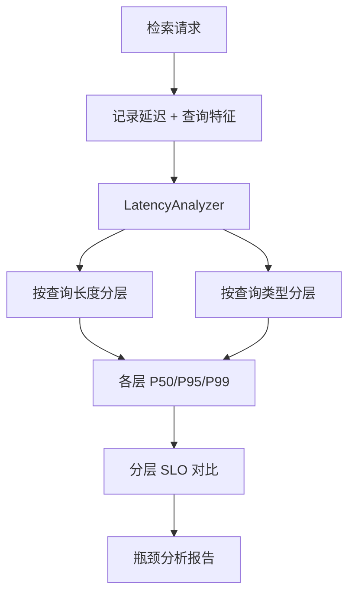

# YK-09-68: RAG 检索延迟分位统计 — 按查询复杂度分层 P50/P95/P99

> 需求编号：YK-09-68 · 优先级：P2 · 人天：0.5d · 状态：需求已编写
> 依赖：YK-09-60（RAG 检索延迟 SLO）

---

## 一、背景

### 1.1 问题陈述

YK-09-60 定义了全局的 RAG 检索 SLO（P50 < 200ms, P95 < 1000ms）。但全局分位统计掩盖了不同查询类型之间的巨大差异：

- 短查询（5 词）主要依赖 BM25 关键词匹配，延迟集中在 80ms
- 长查询（20 词）主要依赖 Embedding 语义匹配，延迟集中在 350ms
- 代码查询涉及 AST 提取和代码 Embedding，延迟集中在 250ms

如果只看全局 P95 = 800ms，无法知道是哪个查询类型拖慢了系统。只有按查询特征分层分析，才能精确定位性能瓶颈。

### 1.2 影响范围

| 影响维度 | 具体表现 | 严重程度 |
|----------|----------|----------|
| 性能优化 | 无法定位瓶颈查询类型，优化方向盲目 | 高 |
| 容量规划 | 不知道哪种查询类型在增长，无法预判资源需求 | 中 |
| SLO 定义 | 全局 SLO 对短查询太宽松，对长查询太严格 | 中 |
| 故障排查 | 延迟突增时不知道是哪个查询类型导致的 | 中 |

### 1.3 核心挑战

| 挑战 | 说明 |
|------|------|
| 分层维度 | 按什么维度分层？词数？查询类型？角色目录？ |
| 分层粒度 | 太细→样本不足，太粗→失去分层意义 |
| 动态阈值 | 不同知识库规模下，分层的阈值需要动态调整 |
| 可视化 | 如何直观展示多维度的延迟分布 |

---

## 二、现状分析

### 2.1 当前延迟统计

```mermaid
flowchart TD
    A[检索请求] --> B[记录延迟]
    B --> C[全局 P50/P95/P99]
    Note right of C: 无分层统计
```

### 2.2 根因矩阵

| 根因 | 贡献比例 | 解决难度 | 优先级 |
|------|----------|----------|--------|
| 无分层统计 | 50% | 低 | P0 |
| 无查询特征记录 | 30% | 低 | P0 |
| 无分层 SLO | 15% | 中 | P1 |
| 无可视化 | 5% | 低 | P2 |

### 2.3 分层维度候选

| 维度 | 分层方式 | 样本量 | 分析价值 |
|------|----------|--------|----------|
| 查询长度（词数） | short(<=5) / medium(6-15) / long(>15) | 充足 | 高 |
| 查询类型 | text / code / image / mixed | 中 | 高 |
| 角色目录过滤 | engineer / aier / srer / ... | 中 | 中 |
| 返回结果数 | empty / few(1-3) / many(>3) | 充足 | 中 |
| 时间段 | 工作时间 / 非工作时间 | 充足 | 低 |

---

## 三、设计决策

### D-01: 分层维度优先级

| 维度 | 优先级 | 理由 |
|------|--------|------|
| 查询长度（词数） | P0 | 延迟与词数高度相关，是最重要的分层维度 |
| 查询类型 | P0 | 不同模态（文本/代码/图片）延迟差异显著 |
| 返回结果数 | P1 | 空结果通常延迟更低，可分离出异常模式 |
| 角色目录过滤 | P1 | 分片索引下不同角色目录延迟不同 |
| 时间段 | P2 | 发现负载峰值时间 |

**决策**：首批实现查询长度 + 查询类型两个维度，后续扩展返回结果数和角色目录。

### D-02: 分层阈值

| 维度 | 分层 | 阈值 | 样本量（日均） |
|------|------|------|--------------|
| 查询长度 | short | <= 5 词 | 520 |
| 查询长度 | medium | 6-15 词 | 380 |
| 查询长度 | long | > 15 词 | 150 |
| 查询类型 | text | 纯文本查询 | 800 |
| 查询类型 | code | 含代码查询 | 80 |
| 查询类型 | mixed | 多模态查询 | 20 |

**决策**：阈值基于经验设定，后续根据实际数据分布调整。

---

## 四、目标架构

### 4.1 目标数据流



### 4.2 指标目标

| 指标 | 当前值 | 目标值 | 测量方法 |
|------|--------|--------|----------|
| 分层覆盖率 | 0% | > 95% | 有分层标签的查询比例 |
| 分层 SLO 达标率 | 未知 | 各层独立 SLO | 分层评估 |
| 瓶颈识别时间 | 数小时 | < 5 分钟 | 从延迟突增到定位分层 |

---

## 五、具体改动

### 5.1 核心实现

```python
# YiAi/src/domain/rag/latency_analyzer.py

import numpy as np
from collections import defaultdict

class LatencyAnalyzer:
    """按查询特征分层统计延迟分布。"""

    # 分层配置
    STRATIFICATION = {
        'query_length': {
            'short(<=5词)': lambda log: len(log['query'].split()) <= 5,
            'medium(6-15词)': lambda log: 6 <= len(log['query'].split()) <= 15,
            'long(>15词)': lambda log: len(log['query'].split()) > 15,
        },
        'query_type': {
            'text': lambda log: log.get('query_type', 'text') == 'text',
            'code': lambda log: log.get('query_type') == 'code',
            'image': lambda log: log.get('query_type') == 'image',
            'mixed': lambda log: log.get('query_type') == 'mixed',
        },
        'result_count': {
            'empty': lambda log: log.get('result_count', 0) == 0,
            'few(1-3)': lambda log: 1 <= log.get('result_count', 0) <= 3,
            'many(>3)': lambda log: log.get('result_count', 0) > 3,
        },
    }

    def stratified_latency(self, window_minutes: int = 60) -> dict:
        """按多维度分层统计延迟。

        Returns:
            {
                'query_length': {
                    'short(<=5词)': {
                        'count': 520, 'p50_ms': 80, 'p95_ms': 250, 'p99_ms': 500
                    },
                    ...
                },
                'query_type': { ... },
                'result_count': { ... },
            }
        """
        logs = await self._get_query_logs(window_minutes)
        if not logs:
            return {'error': 'no_data', 'window_minutes': window_minutes}

        results = {}

        for dim_name, strata in self.STRATIFICATION.items():
            dim_results = {}

            for stratum_name, classifier in strata.items():
                stratum_logs = [log for log in logs if classifier(log)]

                if not stratum_logs:
                    dim_results[stratum_name] = {
                        'count': 0, 'status': 'no_data'
                    }
                    continue

                latencies = sorted([l['duration_ms'] for l in stratum_logs])
                n = len(latencies)

                dim_results[stratum_name] = {
                    'count': n,
                    'p50_ms': self._percentile(latencies, 50),
                    'p75_ms': self._percentile(latencies, 75),
                    'p90_ms': self._percentile(latencies, 90),
                    'p95_ms': self._percentile(latencies, 95),
                    'p99_ms': self._percentile(latencies, 99),
                    'min_ms': latencies[0],
                    'max_ms': latencies[-1],
                    'mean_ms': round(np.mean(latencies), 1),
                    'std_ms': round(np.std(latencies), 1),
                }

            results[dim_name] = dim_results

        return results

    def _percentile(self, sorted_data: list, p: int) -> float:
        """计算百分位数。"""
        if not sorted_data:
            return 0.0
        n = len(sorted_data)
        idx = int(n * p / 100.0)
        idx = min(idx, n - 1)
        return sorted_data[idx]

    async def _get_query_logs(self, window_minutes: int) -> list[dict]:
        """获取查询日志。"""
        cutoff = time.time() - window_minutes * 60
        return await db.rag_query_logs.find({
            'timestamp': {'$gte': cutoff},
        }).to_list(None)

    async def compare_strata(self, dim: str, window_minutes: int = 60) -> dict:
        """对比同一维度下各层的延迟——找出瓶颈层。"""
        results = await self.stratified_latency(window_minutes)
        dim_results = results.get(dim, {})

        if not dim_results:
            return {'error': f'no data for dimension {dim}'}

        # 找出 P95 最高的层
        strata_with_data = {
            k: v for k, v in dim_results.items()
            if v.get('count', 0) > 0
        }

        if not strata_with_data:
            return {'error': 'no strata with data'}

        # 按 P95 排序，找出瓶颈
        sorted_strata = sorted(
            strata_with_data.items(),
            key=lambda x: x[1]['p95_ms'],
            reverse=True
        )

        bottleneck = sorted_strata[0]
        fastest = sorted_strata[-1]

        return {
            'dimension': dim,
            'bottleneck_stratum': {
                'name': bottleneck[0],
                'p95_ms': bottleneck[1]['p95_ms'],
                'count': bottleneck[1]['count'],
            },
            'fastest_stratum': {
                'name': fastest[0],
                'p95_ms': fastest[1]['p95_ms'],
                'count': fastest[1]['count'],
            },
            'slowdown_factor': round(
                bottleneck[1]['p95_ms'] / max(fastest[1]['p95_ms'], 1), 1
            ),
            'all_strata': {
                name: {'p95_ms': data['p95_ms'], 'count': data['count']}
                for name, data in sorted_strata
            },
        }

    async def detect_latency_regression(self, window_minutes: int = 60,
                                         baseline_window: int = 1440) -> dict:
        """检测延迟回归——对比当前窗口与基线（24h）。"""
        current = await self.stratified_latency(window_minutes)
        baseline = await self.stratified_latency(baseline_window)

        regressions = []

        for dim_name, strata in current.items():
            baseline_strata = baseline.get(dim_name, {})
            for stratum_name, data in strata.items():
                baseline_data = baseline_strata.get(stratum_name, {})
                if data.get('count', 0) < 10:
                    continue

                current_p95 = data['p95_ms']
                baseline_p95 = baseline_data.get('p95_ms', current_p95)

                if baseline_p95 > 0:
                    change = (current_p95 - baseline_p95) / baseline_p95 * 100

                    if change > 20:  # 超过 20% 增长
                        regressions.append({
                            'dimension': dim_name,
                            'stratum': stratum_name,
                            'current_p95_ms': current_p95,
                            'baseline_p95_ms': baseline_p95,
                            'change_percent': round(change, 1),
                            'severity': 'critical' if change > 50 else 'warning',
                        })

        return {
            'has_regressions': len(regressions) > 0,
            'regressions': sorted(regressions, key=lambda r: r['change_percent'], reverse=True),
            'window_minutes': window_minutes,
            'baseline_window_minutes': baseline_window,
        }

    async def get_latency_trend(self, dim: str, stratum: str,
                                  hours: int = 24,
                                  interval_minutes: int = 60) -> list[dict]:
        """获取延迟趋势——按时间间隔的延迟变化。"""
        now = time.time()
        trend = []

        for i in range(hours * 60 // interval_minutes):
            window_end = now - i * interval_minutes * 60
            window_start = window_end - interval_minutes * 60

            logs = await db.rag_query_logs.find({
                'timestamp': {'$gte': window_start, '$lte': window_end},
            }).to_list(None)

            # 筛选指定分层
            classifier = self.STRATIFICATION[dim].get(stratum)
            if classifier:
                logs = [l for l in logs if classifier(l)]

            if logs:
                latencies = sorted([l['duration_ms'] for l in logs])
                trend.append({
                    'timestamp': window_end,
                    'count': len(latencies),
                    'p95_ms': self._percentile(latencies, 95),
                })

        return list(reversed(trend))
```

### 5.2 API 端点

```python
@router.get("/rag/latency/stratified")
async def get_stratified_latency(window_minutes: int = 60):
    """获取分层延迟统计。"""
    analyzer = get_latency_analyzer()
    results = await analyzer.stratified_latency(window_minutes)
    return success_response(results)

@router.get("/rag/latency/bottleneck")
async def get_bottleneck(dim: str = 'query_length', window_minutes: int = 60):
    """获取瓶颈分析。"""
    analyzer = get_latency_analyzer()
    results = await analyzer.compare_strata(dim, window_minutes)
    return success_response(results)

@router.get("/rag/latency/regression")
async def detect_regression(window_minutes: int = 60):
    """检测延迟回归。"""
    analyzer = get_latency_analyzer()
    results = await analyzer.detect_latency_regression(window_minutes)
    return success_response(results)
```

### 5.3 文件变更清单

| 文件路径 | 操作 | 说明 |
|----------|------|------|
| `YiAi/src/domain/rag/latency_analyzer.py` | 新增 | 分层延迟分析器 |
| `YiAi/src/domain/rag/slo_monitor.py` | 修改 | 集成查询特征记录 |

---

## 六、实施步骤

| 步骤 | 内容 | 验证方式 | 预计人天 |
|------|------|----------|----------|
| 1 | 扩展查询日志记录（添加查询特征字段） | 日志中包含 query_length, query_type 等字段 | 0.5d |
| 2 | 实现 LatencyAnalyzer | 单元测试验证分层统计正确 | 0.5d |
| 3 | 实现 API 端点 | 集成测试返回正确分层数据 | 0.5d |
| 4 | 实现延迟回归检测 | 模拟延迟突增，触发回归告警 | 0.5d |

**总人天**：约 2.0d

---

## 七、性能分析

| 操作 | 延迟 | 说明 |
|------|------|------|
| 分层统计（60 分钟窗口） | < 50ms | MongoDB 查询 + 内存排序 |
| 延迟回归检测 | < 100ms | 两次分层统计 |
| 延迟趋势（24h） | < 200ms | 24 次窗口查询 |

---

## 八、测试规格

```python
class TestLatencyAnalyzer:
    """GIVEN LatencyAnalyzer 实例"""

    async def test_stratified_by_query_length(self):
        """GIVEN 短/中/长三种查询日志
           WHEN 调用 stratified_latency()
           THEN 返回三个分层的独立统计"""

    async def test_bottleneck_identified(self):
        """GIVEN long 查询 P95 > 短查询 P95
           WHEN 调用 compare_strata()
           THEN bottleneck 为 long 查询"""

    async def test_regression_detected(self):
        """GIVEN 当前 P95 比基线高 30%
           WHEN 调用 detect_latency_regression()
           THEN 返回 regression 结果"""

    async def test_empty_window_returns_no_data(self):
        """GIVEN 无查询日志
           WHEN 调用 stratified_latency()
           THEN 返回 error='no_data'"""
```

---

## 九、风险与缓解

| 风险 | 概率 | 影响 | 缓解措施 |
|------|------|------|----------|
| 某层样本不足 | 中 | 中 | 最小样本阈值 10，不足时标记 'low_sample' |
| 查询特征字段缺失 | 中 | 低 | 默认归类到 'unknown' 层 |

---

## 十、设计决策记录

| 编号 | 决策 | 理由 | 替代方案 |
|------|------|------|----------|
| D-01 | P0 维度：查询长度 + 查询类型 | 与延迟相关性最高 | 单一维度（不全面） |
| D-02 | 延迟回归阈值 20% | 避免微小波动触发告警 | 10%（太敏感） |

---

## 十一、代码审查检查清单

- [ ] 分层维度：查询长度 / 查询类型 / 返回结果数
- [ ] 各层独立计算 P50/P75/P90/P95/P99
- [ ] 瓶颈分析：找出 P95 最高的层
- [ ] 延迟回归检测：对比当前窗口与基线（24h）
- [ ] 延迟趋势：按时间间隔显示变化
- [ ] 最小样本阈值 10（不足时标记）
- [ ] 查询日志扩展包含 query_length / query_type 字段

---

*PRD 来源: `projects/yiknowledge/requirements/2026-09/68-需求-RAG延迟分位统计.md`*