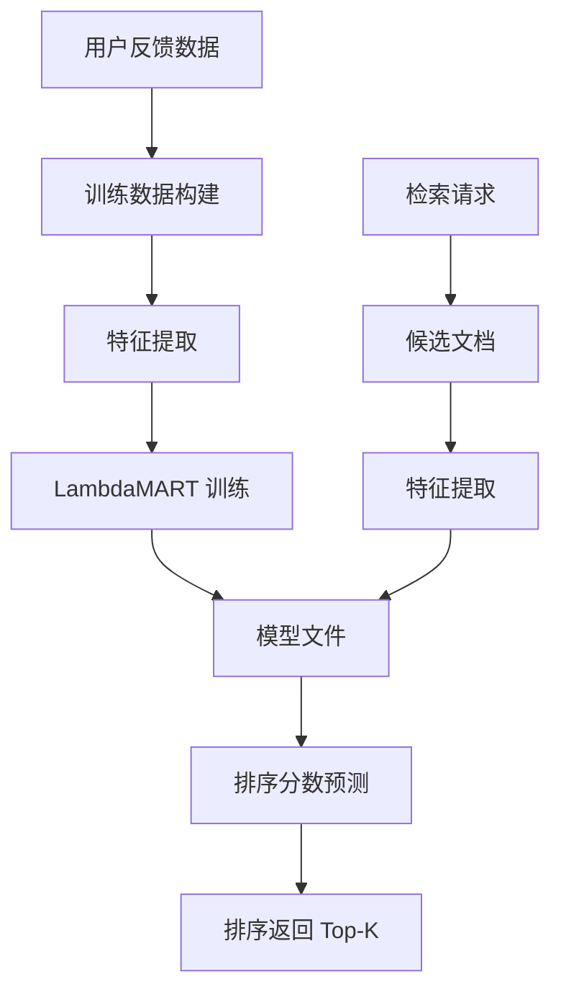

# YK-09-69: RAG 检索 Learn-to-Rank 融合策略 — LambdaMART 集成

> 需求编号：YK-09-69 · 优先级：P2 · 人天：0.5d · 状态：需求已编写
> 依赖：YK-09-63（排序算法对比评估）、YK-09-07（知识检索反馈闭环）

---

## 一、背景

### 1.1 问题陈述

YK-09-63 对比了 Linear Weighted、RRF、Multiplicative 三种规则式排序算法。这些算法的共同局限是：**权重是人工设定的固定值**，无法从数据中学习最优融合策略。

例如：
- 人工设定 alpha=0.7，但实际最优 alpha 可能因查询类型而异（关键词查询 alpha=0.9，语义查询 alpha=0.3）
- 排序特征仅限于 BM25 + Vector 两个分数，无法利用文档权威性、质量评分、新鲜度等更多信号
- 无法利用用户反馈数据（点赞/点踩/点击）来优化排序

Learn-to-Rank (LTR) 方法可以从用户反馈中学习特征到排序分数的映射，自动发现最优融合策略。

### 1.2 影响范围

| 影响维度 | 具体表现 | 严重程度 |
|----------|----------|----------|
| 排序精度 | 规则式排序无法适应不同查询类型，NDCG 提升空间有限 | 中 |
| 特征利用 | 仅使用 BM25 和 Vector 两个特征，浪费其他信号 | 中 |
| 持续优化 | 无法利用反馈数据闭环优化排序 | 中 |
| 模型解释 | 规则式排序可解释性强，LTR 是黑盒 | 中 |

### 1.3 核心挑战

| 挑战 | 说明 |
|------|------|
| 训练数据构建 | 需要 (query, doc, relevance) 三元组，标注成本高 |
| 特征工程 | 哪些特征对排序最有帮助？需要特征重要性分析 |
| 模型更新 | 模型需要定期更新以适应数据分布变化 |
| 在线推理 | LTR 模型推理不能显著增加检索延迟 |
| 可解释性 | 需要解释为什么某个文档排在前面 |

---

## 二、现状分析

### 2.1 当前排序流程

```mermaid
flowchart TD
    A[检索候选] --> B[提取 BM25 + Vector 分数]
    B --> C[alpha * BM25 + (1-alpha) * Vector]
    C --> D[排序返回]
    Note right of C: alpha=0.7 固定，仅 2 个特征
```

### 2.2 根因矩阵

| 根因 | 贡献比例 | 解决难度 | 优先级 |
|------|----------|----------|--------|
| 固定权重无法适应 | 30% | 中（需 LTR） | P0 |
| 特征维度不足 | 25% | 低（加特征） | P0 |
| 无训练数据 | 25% | 中（需标注） | P0 |
| 无模型更新机制 | 20% | 中 | P1 |

### 2.3 候选特征

| 特征 | 类型 | 信号来源 | 预期重要性 |
|------|------|----------|------------|
| BM25 分数 | 数值 | 检索 | 高 |
| 向量相似度 | 数值 | Embedding | 高 |
| 标签匹配数 | 数值 | 查询标签 vs 文档标签 | 中 |
| 文档权威性 | 数值 | PageRank | 中 |
| 文档长度 | 数值 | 内容 | 低 |
| 新鲜度（天） | 数值 | 更新时间 | 中 |
| 质量评分 | 数值 | 质量模型 | 中 |
| 影响力评分 | 数值 | YK-09-66 | 中 |
| 角色目录匹配 | 布尔 | 查询角色 vs 文档角色 | 低 |

---

## 三、设计决策

### D-01: LTR 算法选择

| 方案 | 描述 | 精度 | 训练速度 | 推理速度 | 结论 |
|------|------|------|----------|----------|------|
| A: LambdaMART (LightGBM) | 梯度提升树排序 | 高 | 快（< 1min） | 极快（< 1ms） | **推荐** |
| B: RankNet (神经网络) | 神经网络 pairwise 排序 | 中 | 慢（需 GPU） | 中（5ms） | 备选 |
| C: ListNet | 神经网络 listwise 排序 | 高 | 慢（需 GPU） | 中（5ms） | 过度复杂 |
| D: XGBoost Ranker | 梯度提升排序 | 中 | 快 | 极快 | 备选 |

**决策**：选择方案 A（LambdaMART via LightGBM），理由：
- 树模型天然适合表格数据，不需要特征归一化
- 训练速度快（< 1 分钟，数百样本）
- 推理速度快（< 1ms），不增加检索延迟
- 特征重要性可解释，便于分析
- LightGBM 是成熟的 Python 库，生态完善

### D-02: 训练数据构建

| 方案 | 描述 | 标注成本 | 数据量 | 结论 |
|------|------|----------|--------|------|
| A: 人工标注 | 策展人标注 (query, doc) 相关性 | 高 | 少 | 精度高但覆盖低 |
| B: 隐式反馈 | 点击=正例, 跳过=负例 | 零 | 多 | **推荐——主要来源** |
| C: 显式反馈 | 点赞=正例, 点踩=负例 | 零 | 少 | 补充来源 |
| D: 混合 | 隐式反馈 + 显式反馈 | 零 | 多 | **推荐——最终方案** |

**决策**：选择方案 D（混合），理由：
- 隐式反馈（点击）数据量大，自动采集
- 显式反馈（点赞/点踩）信号强，噪音低
- 两种信号互补，覆盖不同场景

### D-03: 模型更新策略

| 方案 | 描述 | 更新频率 | 结论 |
|------|------|----------|------|
| A: 每日更新 | 每天用新反馈数据重新训练 | 1 天 | **推荐** |
| B: 每周更新 | 每周重新训练 | 7 天 | 太慢 |
| C: 实时在线学习 | 每条反馈即时更新模型 | 实时 | 过度复杂 |

**决策**：选择方案 A（每日更新），理由：
- 反馈数据积累慢，每日更新足够
- 离线训练避免在线推理的性能影响
- 版本化管理，支持回滚

---

## 四、目标架构

### 4.1 目标数据流



### 4.2 指标目标

| 指标 | 当前值 | 目标值 | 测量方法 |
|------|--------|--------|----------|
| NDCG@5 | 0.78 | > 0.82 | 评估数据集 |
| 推理延迟 | 0ms | < 1ms | LightGBM predict |
| 训练数据量 | 0 | > 500 条 | 反馈数据积累 |

---

## 五、具体改动

### 5.1 核心实现

```python
# YiAi/src/domain/rag/ltr_scorer.py

import lightgbm as lgb
import numpy as np
import pickle
from pathlib import Path

class LambdaMARTScorer:
    """LambdaMART Learn-to-Rank 排序器。"""

    FEATURES = [
        'bm25_score',
        'vector_score',
        'tag_match_count',
        'authority_score',
        'doc_length',
        'recency_days',
        'quality_score',
        'influence_score',
        'role_match',
    ]

    def __init__(self, model_path: str = 'models/lambdamart.pkl'):
        self._model: lgb.Booster | None = None
        self._model_path = Path(model_path)
        self._feature_importance: dict[str, float] = {}

        # 尝试加载已有模型
        if self._model_path.exists():
            self.load_model()

    async def train(self) -> dict:
        """从反馈数据中训练 LambdaMART 模型。

        Returns:
            训练统计信息
        """
        # 1. 收集训练数据
        feedbacks = await db.rag_feedback.find({
            'feedback_type': {'$in': [
                'explicit_like', 'explicit_dislike',
                'implicit_click', 'implicit_skip',
            ]},
        }).to_list(None)

        if len(feedbacks) < 100:
            logger.warning(f"[LambdaMART] 训练数据不足: {len(feedbacks)} < 100")
            return {'success': False, 'reason': 'insufficient_data', 'count': len(feedbacks)}

        # 2. 构建特征矩阵
        X, y, qid = [], [], []

        for fb in feedbacks:
            query = fb.get('query', '')
            doc_path = fb.get('document_path', '')
            doc = await db.knowledge_files.find_one({'path': doc_path})

            if not doc:
                continue

            # 提取特征
            features = self._extract_features(doc, query)
            X.append(features)

            # 标签：1=正例, 0=负例
            is_positive = fb['feedback_type'] in ('explicit_like', 'implicit_click')
            y.append(1 if is_positive else 0)

            # Query ID (用于 listwise 训练)
            qid.append(hash(query) % 100000)

        X = np.array(X, dtype=np.float32)
        y = np.array(y, dtype=np.int32)

        # 3. 计算 group sizes
        groups = self._compute_group_sizes(qid)

        # 4. 训练 LambdaMART
        self._model = lgb.LGBMRanker(
            objective='lambdarank',
            metric='ndcg',
            num_leaves=31,
            learning_rate=0.05,
            n_estimators=100,
            min_child_samples=20,
            verbose=-1,
        )
        self._model.fit(X, y, group=groups)

        # 5. 保存模型
        self.save_model()

        # 6. 计算特征重要性
        importance = self._model.feature_importance(importance_type='gain')
        self._feature_importance = {
            self.FEATURES[i]: float(importance[i])
            for i in range(len(self.FEATURES))
            if i < len(importance)
        }

        return {
            'success': True,
            'samples': len(feedbacks),
            'queries': len(set(qid)),
            'features': len(self.FEATURES),
            'feature_importance': self._feature_importance,
        }

    def _extract_features(self, doc: dict, query: str) -> list[float]:
        """从文档和查询中提取特征。"""
        features = []

        # BM25 分数（需要从检索结果中获取，此处用占位）
        features.append(doc.get('bm25_score', 0))

        # 向量相似度
        features.append(doc.get('vector_score', 0))

        # 标签匹配数
        doc_tags = set(doc.get('frontmatter', {}).get('tags', []))
        query_words = set(query.lower().split())
        features.append(len(doc_tags & query_words))

        # 文档权威性
        features.append(doc.get('authority_score', 0))

        # 文档长度
        features.append(doc.get('content_length', 0))

        # 新鲜度（天）
        updated = doc.get('frontmatter', {}).get('updated', 0)
        if isinstance(updated, str):
            from datetime import datetime
            try:
                updated_dt = datetime.fromisoformat(updated)
                features.append((datetime.now() - updated_dt).days)
            except ValueError:
                features.append(365)
        else:
            features.append(365)

        # 质量评分
        features.append(doc.get('quality_score', 0.5))

        # 影响力评分
        features.append(doc.get('influence_score', 0))

        # 角色目录匹配
        features.append(1.0 if doc.get('role_match', False) else 0.0)

        return features

    def _compute_group_sizes(self, qids: list[int]) -> list[int]:
        """计算每个 query group 的大小。"""
        if not qids:
            return []

        groups = []
        current_qid = qids[0]
        count = 0

        for qid in qids:
            if qid == current_qid:
                count += 1
            else:
                groups.append(count)
                current_qid = qid
                count = 1
        groups.append(count)

        return groups

    def predict(self, doc_features: list[float]) -> float:
        """预测单个文档的排序分数。"""
        if self._model is None:
            return 0.0

        return float(self._model.predict([doc_features])[0])

    def predict_batch(self, docs_features: list[list[float]]) -> list[float]:
        """批量预测排序分数。"""
        if self._model is None:
            return [0.0] * len(docs_features)

        return self._model.predict(np.array(docs_features, dtype=np.float32)).tolist()

    def save_model(self):
        """保存模型到文件。"""
        self._model_path.parent.mkdir(parents=True, exist_ok=True)
        with open(self._model_path, 'wb') as f:
            pickle.dump(self._model, f)

    def load_model(self):
        """加载模型。"""
        with open(self._model_path, 'rb') as f:
            self._model = pickle.load(f)

    def get_feature_importance(self) -> dict:
        """获取特征重要性。"""
        return self._feature_importance

    def is_trained(self) -> bool:
        """检查模型是否已训练。"""
        return self._model is not None
```

### 5.2 文件变更清单

| 文件路径 | 操作 | 说明 |
|----------|------|------|
| `YiAi/src/domain/rag/ltr_scorer.py` | 新增 | LambdaMART 排序器 |
| `YiAi/requirements.txt` | 修改 | 添加 `lightgbm>=4.0` |
| `YiAi/models/` | 新增目录 | 模型文件存储 |

---

## 六、实施步骤

| 步骤 | 内容 | 验证方式 | 预计人天 |
|------|------|----------|----------|
| 1 | 特征工程 + 训练数据构建 | 生成 500+ 条训练样本 | 0.5d |
| 2 | 实现 LambdaMART 训练 | 模型训练成功，NDCG 提升 | 0.5d |
| 3 | 集成到检索流程 | 对比 LTR 与规则式排序的 NDCG | 0.5d |
| 4 | 每日模型更新定时任务 | 模型自动更新 | 0.5d |

**总人天**：约 2.0d

---

## 七、性能分析

| 操作 | 延迟 | 说明 |
|------|------|------|
| 单文档预测 | < 0.1ms | LightGBM 树模型 |
| 批量预测（50 文档） | < 0.5ms | 向量化预测 |
| 模型训练（500 样本） | < 30s | CPU 训练 |
| 模型加载 | < 50ms | pickle 反序列化 |

---

## 八、测试规格

```python
class TestLambdaMARTScorer:
    """GIVEN LambdaMARTScorer 实例"""

    async def test_train_requires_minimum_samples(self):
        """GIVEN 反馈数据 < 100 条
           WHEN 调用 train()
           THEN 返回 success=False 且 reason='insufficient_data'"""

    async def test_train_produces_model(self):
        """GIVEN 500 条反馈数据
           WHEN 调用 train()
           THEN 模型保存到文件且 is_trained()=True"""

    async def test_predict_returns_float(self):
        """GIVEN 已训练模型
           WHEN 调用 predict()
           THEN 返回 [0, 1] 范围内的浮点数"""

    async def test_feature_importance_summarizes(self):
        """GIVEN 已训练模型
           WHEN 调用 get_feature_importance()
           THEN 返回 9 个特征的重要性字典"""
```

---

## 九、风险与缓解

| 风险 | 概率 | 影响 | 缓解措施 |
|------|------|------|----------|
| 训练数据不足 | 高 | 高 | 隐式反馈自动采集，最低 100 条 |
| 反馈数据噪音 | 中 | 中 | 显式反馈（点赞）信号权重更高 |
| 模型过拟合 | 中 | 中 | 限制树深度（num_leaves=31） |
| 线上推理失败 | 低 | 中 | 回退到规则式排序 |

---

## 十、设计决策记录

| 编号 | 决策 | 理由 | 替代方案 |
|------|------|------|----------|
| D-01 | LambdaMART (LightGBM) | 训练快、推理快、可解释 | RankNet（慢、需 GPU） |
| D-02 | 隐式+显式反馈混合训练 | 数据量大 + 信号强 | 单一来源（不完整） |
| D-03 | 每日模型更新 | 反馈积累慢，日更足够 | 实时更新（过度复杂） |

---

## 十一、代码审查检查清单

- [ ] 9 个特征：BM25/Vector/标签匹配/权威性/长度/新鲜度/质量/影响力/角色匹配
- [ ] 训练数据最低 100 条
- [ ] 训练使用 group (qid) 进行 listwise 排序
- [ ] 推理回退到规则式排序（model=None 时）
- [ ] 模型持久化（pickle）并支持加载
- [ ] 特征重要性可获取
- [ ] 每日定时训练（apscheduler）

---

*PRD 来源: `projects/yiknowledge/requirements/2026-09/69-需求-学习排序融合.md`*