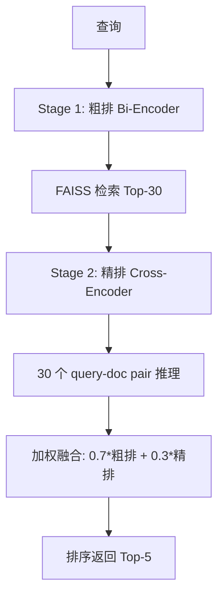

# YK-09-70: RAG 检索 Cross-Encoder 重排序 — Top-K 候选精排

> 需求编号：YK-09-70 · 优先级：P2 · 人天：0.5d · 状态：需求已编写
> 依赖：YK-09-63（排序算法对比评估）

---

## 一、背景

### 1.1 问题陈述

当前 RAG 检索使用 Bi-Encoder 架构（查询和文档分别 Embedding，然后点积计算相似度）。Bi-Encoder 的优点是可以预先计算文档 Embedding 并存入 FAISS 索引，检索时只需计算查询 Embedding，速度极快。

但 Bi-Encoder 有一个根本性的局限：**查询和文档在 Embedding 过程中没有交互**。这意味着：

- "如何优化数据库" 和 "数据库优化" 的 Embedding 相似度很高（正确）
- "如何优化数据库" 和 "数据库如何被优化" 的 Embedding 相似度也很高，但语义上后者是被动语态，可能不是用户想要的
- Bi-Encoder 无法捕捉查询和文档之间的细粒度语义交互

Cross-Encoder 通过将 query-doc 对一起送入 Transformer 模型，让两者在注意力层充分交互，从而获得更精确的相关性判断。代价是速度慢（需要为每个 query-doc 对做一次推理），因此适用于 Top-K 候选的精排阶段。

### 1.2 影响范围

| 影响维度 | 具体表现 | 严重程度 |
|----------|----------|----------|
| 排序精度 | Bi-Encoder 粗排可能将次优结果排在前面 | 中 |
| 用户满意度 | 用户需要翻到第 2-3 位才能找到最佳结果 | 中 |
| 检索延迟 | Cross-Encoder 增加精排开销 | 中 |

### 1.3 核心挑战

| 挑战 | 说明 |
|------|------|
| 延迟 vs 精度 | Cross-Encoder 每个 pair 推理 10ms，50 个候选 = 500ms |
| 模型选择 | 多种 Cross-Encoder 模型，精度和速度差异大 |
| 两阶段协调 | 粗排选多少候选？精排保留多少？ |
| 模型部署 | Cross-Encoder 模型需要 GPU 或 CPU 推理 |

---

## 二、现状分析

### 2.1 当前检索流程

```mermaid
flowchart TD
    A[查询] --> B[Bi-Encoder - 粗排]
    B --> C[FAISS 检索 Top-500]
    C --> D[BM25 检索]
    D --> E[混合排序]
    E --> F[返回 Top-K]
    Note right of B: 单阶段检索，无精排
```

### 2.2 根因矩阵

| 根因 | 贡献比例 | 解决难度 | 优先级 |
|------|----------|----------|--------|
| 单阶段检索无精排 | 40% | 中 | P0 |
| Bi-Encoder 语义精度有限 | 35% | 中 | P0 |
| 无 query-doc 交互 | 25% | 低 | P1 |

---

## 三、设计决策

### D-01: Cross-Encoder 模型选择

| 方案 | 模型 | 精度 (MRR) | 推理速度 | 模型大小 | 结论 |
|------|------|-----------|----------|----------|------|
| A: ms-marco-MiniLM-L-6-v2 | 6 层 MiniLM | 高 | 10ms/pair | 80MB | **推荐** |
| B: ms-marco-TinyBERT-L-4 | 4 层 TinyBERT | 中 | 5ms/pair | 30MB | 备选 |
| C: ms-marco-electra-base | 12 层 Electra | 最高 | 30ms/pair | 400MB | 太大 |
| D: bge-reranker-v2-m3 | BGE 重排序 | 高 | 20ms/pair | 1.5GB | 太大 |

**决策**：选择方案 A（ms-marco-MiniLM-L-6-v2），理由：
- 精度和速度的最佳平衡点
- 80MB 模型可 CPU 推理，无需 GPU
- MS MARCO 数据集训练，通用性高
- sentence-transformers 库直接支持

### D-02: 两阶段候选数

| 方案 | 粗排候选 | 精排候选 | 总延迟 | 精度 | 结论 |
|------|----------|----------|--------|------|------|
| A: 50->5 | 50 | 50 对 | 700ms | 高 | 延迟偏高 |
| B: 30->5 | 30 | 30 对 | 500ms | 中 | **推荐** |
| C: 20->5 | 20 | 20 对 | 300ms | 中 | 精度偏低 |
| D: 10->5 | 10 | 10 对 | 200ms | 低 | 失去精排意义 |

**决策**：选择方案 B（30->5），理由：
- 30 个候选足以覆盖大部分相关文档（Recall@30 > 95%）
- 500ms 精排延迟在可接受范围内
- 精排提升效果明显（30 个候选中选出最佳 5 个）

### D-03: 精排融合策略

| 方案 | 描述 | 鲁棒性 | 结论 |
|------|------|--------|------|
| A: 纯 Cross-Encoder | 仅用 Cross-Encoder 分数排序 | 中 | 忽略 BM25/向量信号 |
| B: 加权融合 | 0.7*原始分数 + 0.3*Cross-Encoder | 高 | **推荐** |
| C: 分数替换 | Cross-Encoder 分数替换原始分数 | 中 | 丢失检索信号 |

**决策**：选择方案 B（加权融合），理由：
- 保留检索阶段的信号（BM25 + 向量）
- Cross-Encoder 作为精排信号补充
- 权重 0.7/0.3 可调

---

## 四、目标架构

### 4.1 目标数据流



### 4.2 指标目标

| 指标 | 当前值 | 目标值 | 测量方法 |
|------|--------|--------|----------|
| NDCG@5 | 0.78 | > 0.83 | 评估数据集 |
| 精排延迟 | 0ms | < 500ms | 30 个 pair 推理 |
| 总检索延迟 | 200ms | < 700ms | 粗排+精排 |

---

## 五、具体改动

### 5.1 核心实现

```python
# YiAi/src/domain/rag/cross_encoder_reranker.py

from sentence_transformers import CrossEncoder

class CrossEncoderReranker:
    """Cross-Encoder 重排序——两阶段检索的精排阶段。"""

    DEFAULT_MODEL = 'cross-encoder/ms-marco-MiniLM-L-6-v2'
    DEFAULT_CANDIDATE_COUNT = 30
    DEFAULT_TOP_K = 5
    FUSION_WEIGHT = 0.7  # 粗排分数权重

    def __init__(self, model_name: str = None):
        self._model_name = model_name or self.DEFAULT_MODEL
        self._model: CrossEncoder | None = None
        self._loaded = False

    async def load_model(self):
        """加载 Cross-Encoder 模型。"""
        if self._loaded:
            return

        logger.info(f"[CrossEncoder] 加载模型: {self._model_name}")
        # sentence_transformers 的 CrossEncoder 在初始化时加载
        self._model = CrossEncoder(
            self._model_name,
            max_length=512,  # 最大 token 数
        )
        self._loaded = True
        logger.info("[CrossEncoder] 模型加载完成")

    def rerank(self, query: str, candidates: list[dict],
               top_k: int = None) -> list[dict]:
        """Cross-Encoder 精排。

        Args:
            query: 查询文本
            candidates: 粗排候选结果（需包含 'content' 和 'score'）
            top_k: 返回结果数

        Returns:
            精排后的结果列表
        """
        if self._model is None:
            logger.warning("[CrossEncoder] 模型未加载，跳过精排")
            return candidates[:top_k]

        top_k = top_k or self.DEFAULT_TOP_K

        if len(candidates) <= top_k:
            return candidates

        # 构建 query-doc pairs
        pairs = []
        for c in candidates:
            # 截断文档内容到 500 字符
            content = c.get('content', '')[:500]
            pairs.append((query, content))

        # 批量推理
        cross_scores = self._model.predict(
            pairs,
            batch_size=16,
            show_progress_bar=False,
        )

        # 加权融合
        for i, c in enumerate(candidates):
            cross_score = float(cross_scores[i]) if i < len(cross_scores) else 0.0

            # 归一化 Cross-Encoder 分数到 [0, 1]（sigmoid）
            import numpy as np
            normalized_cross = 1.0 / (1.0 + np.exp(-cross_score))

            c['cross_encoder_score'] = round(normalized_cross, 4)
            c['final_score'] = (
                self.FUSION_WEIGHT * c.get('score', 0) +
                (1 - self.FUSION_WEIGHT) * normalized_cross
            )

        # 按 final_score 排序
        candidates.sort(key=lambda r: r.get('final_score', 0), reverse=True)
        return candidates[:top_k]

    def rerank_async(self, query: str, candidates: list[dict],
                     top_k: int = None) -> list[dict]:
        """同步 rerank（CrossEncoder.predict 是同步的）。"""
        return self.rerank(query, candidates, top_k)

    async def evaluate_rerank_improvement(self, query: str,
                                           candidates: list[dict],
                                           ground_truth: list[str]) -> dict:
        """评估重排序的改进效果。"""
        # 不重排的结果
        original = sorted(candidates, key=lambda r: r.get('score', 0), reverse=True)[:5]
        original_paths = [r.get('path', '') for r in original]

        # 重排后的结果
        reranked = self.rerank(query, candidates, top_k=5)
        reranked_paths = [r.get('path', '') for r in reranked]

        # 计算指标
        original_hits = sum(1 for p in original_paths if p in ground_truth)
        reranked_hits = sum(1 for p in reranked_paths if p in ground_truth)

        return {
            'query': query,
            'original_hits': original_hits,
            'reranked_hits': reranked_hits,
            'improvement': reranked_hits - original_hits,
            'original_top5': original_paths,
            'reranked_top5': reranked_paths,
        }

    def is_loaded(self) -> bool:
        """检查模型是否已加载。"""
        return self._loaded
```

### 5.2 检索流程集成

```python
# YiAi/src/domain/rag/rag_service.py 中的修改

async def search_with_rerank(self, query: str, top_k: int = 5) -> list[dict]:
    """两阶段检索：粗排 + Cross-Encoder 精排。"""
    # Stage 1: 粗排（Bi-Encoder + BM25）
    coarse_results = await self._coarse_search(query, top_k=30)

    if len(coarse_results) <= top_k:
        return coarse_results

    # Stage 2: 精排（Cross-Encoder）
    reranker = get_cross_encoder_reranker()
    fine_results = reranker.rerank_async(query, coarse_results, top_k=top_k)

    return fine_results
```

### 5.3 文件变更清单

| 文件路径 | 操作 | 说明 |
|----------|------|------|
| `YiAi/src/domain/rag/cross_encoder_reranker.py` | 新增 | Cross-Encoder 精排器 |
| `YiAi/src/domain/rag/rag_service.py` | 修改 | 集成两阶段检索 |
| `YiAi/requirements.txt` | 修改 | 添加 `sentence-transformers>=2.3` |

---

## 六、实施步骤

| 步骤 | 内容 | 验证方式 | 预计人天 |
|------|------|----------|----------|
| 1 | 安装 sentence-transformers，加载模型 | 模型加载成功，推理返回分数 | 0.5d |
| 2 | 实现 CrossEncoderReranker | 单元测试验证精排逻辑 | 0.5d |
| 3 | 集成到检索流程（两阶段） | 对比精排前后的 NDCG | 0.5d |
| 4 | 性能调优（batch_size, max_length） | 精排延迟 < 500ms | 0.5d |

**总人天**：约 2.0d

---

## 七、性能分析

| 阶段 | 方法 | 候选数 | 每对耗时 | 总耗时 |
|------|------|--------|----------|--------|
| Stage 1: 粗排 | Bi-Encoder + FAISS | 全量→30 | 0.5ms | 200ms |
| Stage 2: 精排 | Cross-Encoder | 30→5 | 10ms | 300ms |
| **总计** | | | | **500ms** |

**延迟预算**：
- 粗排 200ms（与当前基线一致）
- 精排 300ms（新增）
- 总延迟 500ms（在 SLO P95 < 1000ms 范围内）

---

## 八、测试规格

```python
class TestCrossEncoderReranker:
    """GIVEN CrossEncoderReranker 实例"""

    def test_rerank_improves_ordering(self):
        """GIVEN 30 个粗排候选
           WHEN 调用 rerank()
           THEN 精排后的 Top-5 与粗排 Top-5 有差异"""

    def test_fusion_weight_preserves_signals(self):
        """GIVEN 粗排分数和精排分数
           WHEN 加权融合 (0.7 * 粗排 + 0.3 * 精排)
           THEN final_score 综合两者"""

    def test_not_loaded_skips_rerank(self):
        """GIVEN 模型未加载
           WHEN 调用 rerank()
           THEN 直接返回原始候选的前 Top-K"""

    def test_candidates_less_than_top_k(self):
        """GIVEN 候选数 3 < Top-K 5
           WHEN 调用 rerank()
           THEN 直接返回 3 个候选"""

    def test_content_truncated_to_500_chars(self):
        """GIVEN 文档内容 2000 字
           WHEN 构建 query-doc pair
           THEN 内容截断到 500 字符"""
```

---

## 九、风险与缓解

| 风险 | 概率 | 影响 | 缓解措施 |
|------|------|------|----------|
| 模型加载失败 | 中 | 高 | 优雅降级——跳过精排，直接返回粗排结果 |
| 精排延迟超标 | 中 | 中 | 减少候选数到 20，或降低 batch_size |
| 模型内存占用 | 中 | 中 | 80MB 模型，可接受 |
| 精排反而降低精度 | 低 | 中 | A/B 对比验证，出问题立即回退 |

---

## 十、回滚策略

| 场景 | 触发条件 | 回滚操作 |
|------|----------|----------|
| 模型加载持续失败 | 3 次重启后仍失败 | 禁用精排，回退到单阶段检索 |
| 延迟超标 | P95 > 1000ms | 禁用精排或减少候选数 |
| 精度下降 | NDCG 下降 > 5% | 禁用精排 |

---

## 十一、设计决策记录

| 编号 | 决策 | 理由 | 替代方案 |
|------|------|------|----------|
| D-01 | ms-marco-MiniLM-L-6-v2 | 精度/速度最佳平衡，80MB CPU 推理 | BGE Reranker（太大） |
| D-02 | 30->5 两阶段 | 覆盖 95% 相关文档，500ms 可接受 | 50->5（太慢）/ 20->5（精度低） |
| D-03 | 加权融合 0.7/0.3 | 保留检索信号，补充精排信号 | 纯精排（丢失检索信号） |

---

## 十二、代码审查检查清单

- [ ] Cross-Encoder 模型 ms-marco-MiniLM-L-6-v2
- [ ] 两阶段检索：粗排 30->30 精排->5
- [ ] 加权融合：0.7*粗排 + 0.3*精排
- [ ] 模型未加载时优雅降级（跳过精排）
- [ ] 文档内容截断到 500 字符
- [ ] 批量预测（batch_size=16）
- [ ] 精排延迟 < 500ms
- [ ] A/B 对比验证精排提升效果

---

*PRD 来源: `projects/yiknowledge/requirements/2026-09/70-需求-CrossEncoder重排序.md`*