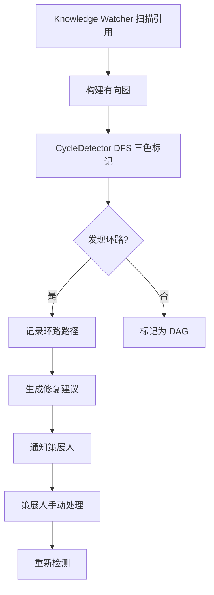

# YK-09-71: 知识库引用网络环路检测 — DFS 循环依赖识别

> 需求编号：YK-09-71 · 优先级：P2 · 人天：0.5d · 状态：需求已编写
> 依赖：YK-09-08（跨项目知识依赖图谱）、YK-09-40（文档权威性 PageRank）

---

## 一、背景

### 1.1 问题陈述

YiKnowledge 的 Markdown 文件通过 `[link](./other-file.md)` 语法相互引用，形成有向图。在理想情况下，这个图应该是**有向无环图 (DAG)**——知识从基础到高级单向流动。

然而，实际中可能出现循环引用：

```
A.md → B.md → C.md → A.md
```

或更复杂的循环：

```
engineer/api-design.md → aier/rag-guide.md → engineer/microservice.md → engineer/api-design.md
```

环路的影响：

1. **PageRank 不收敛**：YK-09-40 的 PageRank 算法在有环图上可能无法收敛，导致权威性分数不准确
2. **依赖图谱可视化混乱**：YK-09-27 的链接拓扑可视化中，环路导致图形布局异常
3. **策展人困惑**：策展人浏览引用链时陷入循环，无法判断信息的原始来源
4. **内容重复风险**：环路可能意味着 A 和 B 在讲同一件事，存在内容重复

### 1.2 影响范围

| 影响维度 | 具体表现 | 严重程度 |
|----------|----------|----------|
| PageRank 准确性 | 环路导致分数无法收敛，权威性评估失真 | 高 |
| 依赖图谱 | 环路使可视化混乱，难以理解知识结构 | 中 |
| 策展人工作流 | 浏览引用链时陷入循环，浪费时间 | 中 |
| 内容质量 | 环路暗示可能的内容重复或逻辑矛盾 | 中 |

### 1.3 核心挑战

| 挑战 | 说明 |
|------|------|
| 图规模 | 800+ 节点，2000+ 边，DFS 深度可能很大 |
| 隐式引用 | 除了显式 `[link]`，还有标签引用、概念引用等隐式边 |
| 修复建议 | 检测到环路后，如何给出合理的断链建议 |
| 增量检测 | 新增文件时如何快速检测是否引入新环路 |

---

## 二、现状分析

### 2.1 当前引用网络

```mermaid
flowchart TD
    A.md --> B.md
    B.md --> C.md
    C.md --> A.md
    Note right of C.md: 环路: A→B→C→A
```

### 2.2 根因矩阵

| 根因 | 贡献比例 | 解决难度 | 优先级 |
|------|----------|----------|--------|
| 无环路检测机制 | 50% | 低 | P0 |
| 作者无感知 | 25% | 低 | P0 |
| 无修复建议 | 15% | 中 | P1 |
| 无增量检测 | 10% | 中 | P2 |

### 2.3 数据现状

| 指标 | 当前值 |
|------|--------|
| 文件总数 | 800+ |
| 显式引用边 | 2000+ |
| 已知环路 | 0（未检测） |
| 图密度 | 约 0.003（稀疏图） |

---

## 三、设计决策

### D-01: 环路检测算法

| 方案 | 描述 | 时间复杂度 | 空间复杂度 | 结论 |
|------|------|-----------|-----------|------|
| A: DFS 三色标记 | 白/灰/黑 DFS 检测回边 | O(V+E) | O(V) | **推荐** |
| B: 拓扑排序 | Kahn 算法检测环 | O(V+E) | O(V) | 备选 |
| C: Floyd-Warshall | 全源最短路径 | O(V^3) | O(V^2) | 不推荐（800^3 太大） |
| D: Tarjan SCC | 强连通分量 | O(V+E) | O(V) | 过度（检测 SCC 比检测环更重） |

**决策**：选择方案 A（DFS 三色标记），理由：
- 经典算法，实现简单
- O(V+E) 适用于稀疏图（800 节点，2000 边）
- 可以精确定位环路路径
- 白色=未访问，灰色=访问中，黑色=已完成

### D-02: 环路修复策略

| 方案 | 描述 | 影响 | 结论 |
|------|------|------|------|
| A: 自动断链 | 自动删除环路上最后一条边 | 可能破坏合法引用 | 不推荐 |
| B: 建议断链 | 标记环路边，建议策展人手动处理 | 零风险 | **推荐** |
| C: 弱化引用 | 将环路中的引用改为"参考"而非"依赖" | 不解决根本问题 | 辅助手段 |

**决策**：选择方案 B（建议断链），理由：
- 自动修改文件有风险（可能破坏合法引用）
- 策展人最了解内容语义，应由其判断
- 提供清晰的环路路径和断链建议

### D-03: 检测频率

| 方案 | 描述 | 适用场景 | 结论 |
|------|------|----------|------|
| A: 每次文件变更 | 实时检测 | 作者即时反馈 | 开销大 |
| B: 每日定时 | 每日凌晨扫描 | 日常维护 | **推荐** |
| C: 手动触发 | 策展人按需触发 | 按需 | 辅助 |

**决策**：选择方案 B（每日定时），理由：
- 知识库变更频率低，每日检测足够
- 避免实时检测的性能开销
- 结合手动触发（策展人发布前）作为补充

---

## 四、目标架构

### 4.1 目标数据流



### 4.2 指标目标

| 指标 | 当前值 | 目标值 | 测量方法 |
|------|--------|--------|----------|
| 环路检测覆盖率 | 0% | 100% | 全量扫描 |
| 检测耗时 | N/A | < 5s | 800 节点图 |
| 已知环路数 | 0 | 发现并修复 | 环路检测 |

---

## 五、具体改动

### 5.1 核心实现

```python
# YiAi/src/domain/knowledge/cycle_detector.py

from collections import defaultdict

class CycleDetector:
    """引用网络环路检测——DFS 三色标记。"""

    WHITE = 0  # 未访问
    GRAY = 1   # 访问中（在当前 DFS 路径上）
    BLACK = 2  # 已完成

    def __init__(self):
        self._graph: dict[str, list[str]] = defaultdict(list)
        self._cycles: list[list[str]] = []
        self._edge_metadata: dict[tuple[str, str], dict] = {}

    async def build_graph(self):
        """从 knowledge_deps 集合构建有向图。"""
        self._graph.clear()
        self._edge_metadata.clear()

        deps = await db.knowledge_deps.find({
            'dep_type': 'explicit_link',
        }).to_list(None)

        for dep in deps:
            source = dep['source_file']
            target = dep['target_file']

            self._graph[source].append(target)
            self._edge_metadata[(source, target)] = {
                'source_file': source,
                'target_file': target,
                'link_text': dep.get('link_text', ''),
                'source_line': dep.get('source_line', 0),
            }

        logger.info(
            f"[CycleDetector] 图构建完成: {len(self._graph)} 节点, "
            f"{sum(len(v) for v in self._graph.values())} 边"
        )

    def detect_cycles(self) -> list[list[str]]:
        """检测所有环路——DFS 三色标记。

        Returns:
            环路列表，每个环路是节点路径列表
            e.g. [['A.md', 'B.md', 'C.md', 'A.md'], ...]
        """
        self._cycles = []
        color = defaultdict(lambda: self.WHITE)

        for node in list(self._graph.keys()):
            if color[node] == self.WHITE:
                self._dfs(node, [], color)

        logger.info(f"[CycleDetector] 检测完成: {len(self._cycles)} 个环路")
        return self._cycles

    def _dfs(self, node: str, path: list[str],
             color: dict[str, int]):
        """DFS 遍历——检测回边（灰色节点）。"""
        color[node] = self.GRAY
        path.append(node)

        for neighbor in self._graph.get(node, []):
            if color[neighbor] == self.GRAY:
                # 回边——发现环路!
                cycle_start = path.index(neighbor)
                cycle = path[cycle_start:] + [neighbor]
                self._cycles.append(cycle)

                logger.warning(
                    f"[CycleDetector] 发现环路: {' -> '.join(cycle)}"
                )

            elif color[neighbor] == self.WHITE:
                self._dfs(neighbor, path, color)

        path.pop()
        color[node] = self.BLACK

    def detect_cycles_with_metadata(self) -> list[dict]:
        """检测环路并附加边元数据——用于生成修复建议。"""
        cycles = self.detect_cycles()

        detailed_cycles = []
        for cycle in cycles:
            edges = []
            for i in range(len(cycle) - 1):
                edge = self._edge_metadata.get((cycle[i], cycle[i + 1]), {})
                edges.append({
                    'from': cycle[i],
                    'to': cycle[i + 1],
                    'link_text': edge.get('link_text', ''),
                    'source_line': edge.get('source_line', 0),
                })

            detailed_cycles.append({
                'path': cycle,
                'length': len(cycle) - 1,
                'edges': edges,
                'suggestion': self._generate_suggestion(cycle, edges),
            })

        return detailed_cycles

    def _generate_suggestion(self, cycle: list[str],
                              edges: list[dict]) -> str:
        """生成修复建议。"""
        if len(cycle) <= 2:
            # 自环
            return f"文件 {cycle[0]} 引用了自身，建议删除自引用"

        # 找到最弱的边（链接文本最短的边，可能是无意引用）
        weakest_edge = min(edges, key=lambda e: len(e.get('link_text', '')))

        return (
            f"建议断开 {weakest_edge['from']} → {weakest_edge['to']} "
            f"（链接文本: '{weakest_edge['link_text']}'，行 {weakest_edge['source_line']}）"
        )

    async def detect_incremental(self, new_file: str,
                                   new_links: list[str]) -> list[list[str]]:
        """增量检测——检查新文件是否引入新环路。"""
        # 临时添加新边
        original_neighbors = self._graph.get(new_file, []).copy()
        self._graph[new_file] = list(new_links)

        # 仅从新文件开始 DFS（性能优化）
        color = defaultdict(lambda: self.WHITE)
        new_cycles = []
        self._dfs_incremental(new_file, [], color, new_cycles)

        # 恢复原图
        if original_neighbors:
            self._graph[new_file] = original_neighbors
        else:
            self._graph.pop(new_file, None)

        return new_cycles

    def _dfs_incremental(self, node: str, path: list[str],
                          color: dict[str, int],
                          cycles: list[list[str]]):
        """增量 DFS——仅检测涉及新节点的环路。"""
        color[node] = self.GRAY
        path.append(node)

        for neighbor in self._graph.get(node, []):
            if color[neighbor] == self.GRAY:
                cycle_start = path.index(neighbor)
                cycle = path[cycle_start:] + [neighbor]
                cycles.append(cycle)
            elif color[neighbor] == self.WHITE:
                self._dfs_incremental(neighbor, path, color, cycles)

        path.pop()
        color[node] = self.BLACK

    async def get_cycle_report(self) -> dict:
        """生成环路检测报告。"""
        detailed_cycles = self.detect_cycles_with_metadata()

        # 统计
        total_nodes = len(self._graph)
        total_edges = sum(len(v) for v in self._graph.values())
        total_cycles = len(detailed_cycles)

        # 受影响的文件
        affected_files = set()
        for cycle in detailed_cycles:
            for node in cycle['path']:
                affected_files.add(node)

        # 环路长度分布
        length_dist = defaultdict(int)
        for cycle in detailed_cycles:
            length_dist[cycle['length']] += 1

        return {
            'graph_stats': {
                'nodes': total_nodes,
                'edges': total_edges,
                'density': round(total_edges / max(total_nodes * (total_nodes - 1), 1), 4),
            },
            'cycle_stats': {
                'total_cycles': total_cycles,
                'affected_files': len(affected_files),
                'affected_file_list': list(affected_files),
                'length_distribution': dict(length_dist),
                'is_dag': total_cycles == 0,
            },
            'cycles': detailed_cycles,
        }

    def has_cycles(self) -> bool:
        """快速检查是否有环路。"""
        self._cycles = []
        color = defaultdict(lambda: self.WHITE)

        for node in list(self._graph.keys()):
            if color[node] == self.WHITE:
                if self._has_cycle_dfs(node, color):
                    return True
        return False

    def _has_cycle_dfs(self, node: str, color: dict[str, int]) -> bool:
        """快速环路检查——发现第一个环路即返回。"""
        color[node] = self.GRAY

        for neighbor in self._graph.get(node, []):
            if color[neighbor] == self.GRAY:
                return True
            if color[neighbor] == self.WHITE:
                if self._has_cycle_dfs(neighbor, color):
                    return True

        color[node] = self.BLACK
        return False
```

### 5.2 API 端点

```python
@router.get("/knowledge/cycles/detect")
async def detect_cycles():
    """检测引用网络中的环路。"""
    detector = get_cycle_detector()
    await detector.build_graph()
    report = await detector.get_cycle_report()
    return success_response(report)

@router.get("/knowledge/cycles/has-cycles")
async def has_cycles():
    """快速检查是否有环路。"""
    detector = get_cycle_detector()
    await detector.build_graph()
    return success_response({'has_cycles': detector.has_cycles()})

@router.post("/knowledge/cycles/incremental")
async def incremental_check(request: IncrementalCheckRequest):
    """增量检查新文件是否引入环路。"""
    detector = get_cycle_detector()
    cycles = await detector.detect_incremental(request.file_path, request.links)
    return success_response({
        'new_cycles': len(cycles) > 0,
        'cycles': cycles,
    })
```

### 5.3 文件变更清单

| 文件路径 | 操作 | 说明 |
|----------|------|------|
| `YiAi/src/domain/knowledge/cycle_detector.py` | 新增 | 环路检测器 |
| `YiAi/src/domain/knowledge/knowledge_watcher.py` | 修改 | 集成每日环路检测 |

---

## 六、实施步骤

| 步骤 | 内容 | 验证方式 | 预计人天 |
|------|------|----------|----------|
| 1 | 实现 DFS 三色标记环路检测 | 单元测试验证已知环路检测 | 0.5d |
| 2 | 实现增量检测 + 修复建议 | 新文件引入环路时检测并建议 | 0.5d |
| 3 | 实现 API 端点 + 每日定时检测 | 每日报告环路情况 | 0.5d |
| 4 | 前端集成（YiVad 依赖图谱页面） | 环路可视化展示 | 0.5d |

**总人天**：约 2.0d

---

## 七、性能分析

| 操作 | 耗时 | 说明 |
|------|------|------|
| 构建图（800 节点，2000 边） | < 100ms | MongoDB 查询 |
| 全量环路检测 | < 50ms | DFS O(V+E) |
| 增量检测（单文件） | < 5ms | 仅从新节点开始 DFS |
| 环路报告生成 | < 200ms | 含修复建议 |

---

## 八、测试规格

```python
class TestCycleDetector:
    """GIVEN CycleDetector 实例"""

    def test_detect_simple_cycle(self):
        """GIVEN A→B→C→A 的图
           WHEN 调用 detect_cycles()
           THEN 检测到 1 个环路 [A, B, C, A]"""

    def test_detect_self_loop(self):
        """GIVEN A→A 的自环
           WHEN 调用 detect_cycles()
           THEN 检测到自环 [A, A]"""

    def test_detect_multiple_cycles(self):
        """GIVEN A→B→C→A 和 D→E→D 两个环路
           WHEN 调用 detect_cycles()
           THEN 检测到 2 个环路"""

    def test_dag_returns_no_cycles(self):
        """GIVEN A→B→C 的 DAG
           WHEN 调用 detect_cycles()
           THEN 返回空列表"""

    def test_empty_graph(self):
        """GIVEN 空图
           WHEN 调用 detect_cycles()
           THEN 返回空列表"""

    def test_incremental_new_file_introduces_cycle(self):
        """GIVEN 已有 A→B
           WHEN 新文件 B 引用 A
           THEN 增量检测发现环路 [A, B, A]"""

    def test_has_cycles_returns_false_for_dag(self):
        """GIVEN DAG 图
           WHEN 调用 has_cycles()
           THEN 返回 False"""

    def test_suggestion_for_self_loop(self):
        """GIVEN 自环 A→A
           WHEN 生成修复建议
           THEN 建议删除自引用"""
```

---

## 九、风险与缓解

| 风险 | 概率 | 影响 | 缓解措施 |
|------|------|------|----------|
| 图规模增长导致性能下降 | 低 | 低 | O(V+E) 线性，800→10000 节点仍 < 100ms |
| 虚警（误报环路） | 低 | 中 | 人工确认后处理 |
| 遗漏隐式引用 | 中 | 低 | 仅检测显式 `[link]` 引用，隐式引用暂不纳入 |
| 策展人不处理 | 中 | 低 | 每日报告提醒 + 严重程度分级 |

---

## 十、回滚策略

| 场景 | 触发条件 | 回滚操作 |
|------|----------|----------|
| 性能下降 | 检测耗时 > 5s | 关闭每日检测，保留手动触发 |
| 大量虚警 | 误报率 > 20% | 调高检测阈值或关闭 |

---

## 十一、设计决策记录

| 编号 | 决策 | 理由 | 替代方案 |
|------|------|------|----------|
| D-01 | DFS 三色标记 | 经典算法，O(V+E)，可定位路径 | 拓扑排序（类似） |
| D-02 | 建议断链（非自动） | 避免自动修改文件的风险 | 自动断链（风险高） |
| D-03 | 每日定时检测 | 知识库变更频率低 | 实时检测（开销大） |

---

## 十二、可观测性

| 指标名称 | 类型 | 说明 | 告警阈值 |
|----------|------|------|----------|
| `cycle_detector_total_cycles` | Gauge | 检测到的环路总数 | > 10 |
| `cycle_detector_affected_files` | Gauge | 受环路影响的文件数 | > 20 |
| `cycle_detector_duration_ms` | Histogram | 检测耗时 | > 5000ms |
| `cycle_detector_is_dag` | Gauge | 是否为 DAG（1=是无环, 0=有环） | = 0 |

---

## 十三、代码审查检查清单

- [ ] DFS 三色标记（WHITE/GRAY/BLACK）正确实现
- [ ] 回边（GRAY 节点）检测为环路
- [ ] 自环（A→A）正确处理
- [ ] 多环路同时检测
- [ ] 增量检测仅从新节点开始 DFS
- [ ] 修复建议基于最弱边（最短链接文本）
- [ ] 图构建从 knowledge_deps 集合读取
- [ ] 环路报告包含路径、边缘、建议
- [ ] 每日定时检测 + 手动触发 API
- [ ] 性能 O(V+E)，800 节点 < 200ms

---

*PRD 来源: `projects/yiknowledge/requirements/2026-09/71-需求-环路检测.md`*