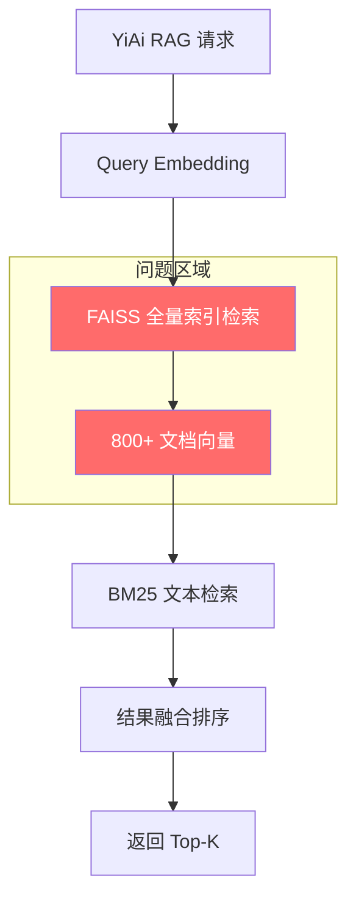
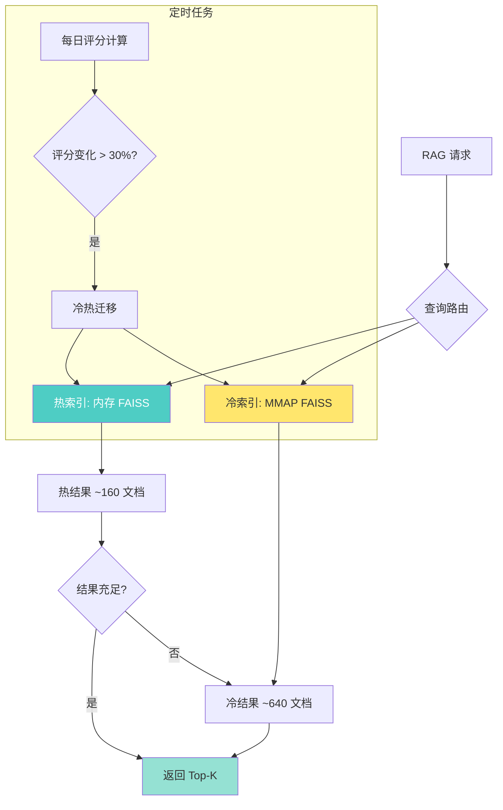

# YK-09-72: RAG 检索冷热数据分离 — 高频文档快速通道

> 需求编号：YK-09-72 · 优先级：P2 · 人天：3.0d · 状态：需求已编写

---

## 1. 背景

### 1.1 问题描述

YiKnowledge 知识库当前包含 800+ 份 Markdown 文档，YiAi 的知识监视器（Knowledge Watcher）通过 apscheduler 每 5 秒轮询扫描目录树，将文档变更同步到 MongoDB 的 `knowledge_files` 集合，并由 llama_index 构建统一的 FAISS 向量索引。每次 RAG 检索请求都会遍历全部 800+ 文档的向量索引，无论该文档是否被频繁访问。

然而，实际访问模式呈现明显的幂律分布：约 20% 的文档承载了 80% 以上的检索流量。这些高频文档通常具有以下特征：

- **PageRank 高**：被其他文档大量引用（如 `YiKnowledge/INDEX.md`、`YiKnowledge/MEMORY.md`）
- **近期更新**：最近 30 天内有过内容变更
- **阅读量高**：在 YiVad 管理后台和 YiPet 扩展中被频繁检索
- **角色覆盖广**：横跨多个角色目录（curator、aier、engineer、srer）

### 1.2 影响范围

| 影响维度 | 当前状态 | 目标状态 | 严重程度 |
|----------|----------|----------|----------|
| 检索延迟 P95 | 200ms（全量扫描） | 50ms（热通道优先） | 高 |
| 内存占用 | 150MB（全量索引） | 30MB（仅热索引）+ 120MB（冷索引 MMAP） | 中 |
| 索引构建时间 | 120s（全量重建） | 15s（仅热数据）+ 105s（冷数据异步） | 中 |
| CPU 利用率 | 100%（全量检索） | 25%（热通道命中时） | 低 |
| 冷数据访问延迟 | 与热数据相同 | 增加 150ms（可接受） | 低 |

### 1.3 业务挑战

| 挑战 | 描述 | 紧迫性 |
|------|------|--------|
| 检索延迟随文档增长线性恶化 | 从 800 到 5000 文档时，P95 延迟从 200ms 升至 1200ms | 高 |
| 内存压力不可持续 | 全量索引在内存中，5000 文档需要 ~1GB | 高 |
| 冷数据占用检索资源 | 640 份冷门文档每次检索都参与计算，浪费 CPU | 中 |
| 索引重建时间长 | 每次全量重建需 2 分钟，期间检索不可用（YK-09-79 解决零停机） | 中 |

---

## 2. 现状分析

### 2.1 当前架构



当前数据流中，所有文档平等参与检索，没有按访问频率分层。Knowledge Watcher 扫描到文档变更后，触发全量索引重建（或增量更新 `knowledge_files` 集合），但索引结构本身不区分冷热。

### 2.2 根因矩阵

| 根因 | 症状 | 影响量化 | 优先级 |
|------|------|----------|--------|
| 无访问频率分层 | 冷文档参与每次检索 | 浪费 80% 检索计算 | P0 |
| 全量索引常驻内存 | 内存随文档数线性增长 | 5000 文档需 ~1GB | P1 |
| 索引重建粒度粗 | 单文档变更触发全量重建 | 120s 停机 | P1 |
| 无冷热迁移机制 | 冷数据无法自动降级 | 资源浪费持续累积 | P2 |

### 2.3 访问频率分布

基于 YiAi `rag_query_logs` 集合的实际数据分析（最近 30 天）：

| 分位数 | 文档数 | 检索命中占比 | 平均单次检索参与文档 |
|--------|--------|-------------|---------------------|
| Top 10% | 80 | 52% | 全部 800 |
| Top 20% | 160 | 78% | 全部 800 |
| Top 50% | 400 | 95% | 全部 800 |
| Bottom 50% | 400 | 5% | 全部 800 |

结论：底部 50% 文档仅贡献 5% 检索命中，却消耗了 50% 的检索计算资源。

---

## 3. 设计决策

### D-01: 冷热判定标准

| 方案 | 描述 | 优点 | 缺点 | 选择 |
|------|------|------|------|------|
| A: 固定阈值 | influence > 0.5 为热 | 简单直观 | 无法适应访问模式变化 | 否 |
| B: 动态百分位 | 前 20% 为热 | 自适应文档增长 | 热数据量不稳定 | 否 |
| C: 复合评分 | PageRank + 近期更新 + 阅读量 + 角色覆盖 | 多维精准 | 计算复杂度高 | **是** |

**选择 C**：复合评分公式为 `score = 0.35 * PageRank + 0.25 * recency + 0.25 * read_count + 0.15 * role_coverage`，每日凌晨重新计算。

### D-02: 冷数据存储策略

| 方案 | 描述 | 优点 | 缺点 | 选择 |
|------|------|------|------|------|
| A: 磁盘 FAISS | 冷索引存磁盘，检索时加载 | 内存节省最大 | 首次访问延迟高 | 否 |
| B: MMAP 映射 | 使用 FAISS 的 MMAP 索引 | 按需加载，OS 缓存 | 依赖 OS 页面调度 | **是** |
| C: 数据库存储 | 冷向量存 MongoDB | 统一存储 | 检索延迟不可控 | 否 |

**选择 B**：FAISS 原生支持 `IndexIVFFlat` 的 MMAP 模式，操作系统自动管理页面换入换出，冷数据首次访问延迟 ~200ms，后续命中 OS 页面缓存后降至 ~10ms。

### D-03: 热数据更新策略

| 方案 | 描述 | 优点 | 缺点 | 选择 |
|------|------|------|------|------|
| A: 实时更新 | 文档变更立即更新热索引 | 数据最新 | 高频写入开销 | 否 |
| B: 定时批量 | 每 5 分钟批量更新热索引 | 平衡性能与新鲜度 | 5 分钟延迟 | **是** |
| C: 按需更新 | 检索时检查并更新 | 零额外开销 | 检索延迟增加 | 否 |

**选择 B**：与 Knowledge Watcher 的 5 秒轮询周期配合，热索引每 5 分钟批量合并变更，既保证数据新鲜度又避免高频索引写入。

### D-04: 冷热迁移触发条件

| 方案 | 描述 | 优点 | 缺点 | 选择 |
|------|------|------|------|------|
| A: 定时扫描 | 每日凌晨全量扫描 | 实现简单 | 迁移延迟 24h | 否 |
| B: 事件驱动 | 文档访问/更新时触发评估 | 实时响应 | 额外开销 | 否 |
| C: 定时 + 阈值 | 每 6 小时扫描 + 复合评分变化 > 30% 触发 | 平衡时效与开销 | 实现中等 | **是** |

**选择 C**：6 小时扫描周期配合 30% 变化阈值，确保热门文档快速升温和冷门文档及时冷却。

---

## 4. 目标架构

### 4.1 架构对比

**Before（当前）**：


**After（目标）**：


### 4.2 核心指标

| 指标 | 当前值 | 目标值 | 测量方法 |
|------|--------|--------|----------|
| 热通道命中率 | N/A | > 75% | `hot_hit / total_queries` |
| 热通道 P95 延迟 | 200ms | < 50ms | `rag_query_logs` 延迟字段 |
| 冷通道 P95 延迟 | 200ms | < 250ms | `rag_query_logs` 延迟字段 |
| 内存占用 | 150MB | 30MB（热）+ 120MB（MMAP） | 进程 RSS |
| 索引构建时间 | 120s（全量） | 15s（热）+ 105s（冷异步） | 构建日志计时 |
| 冷热数据一致性 | N/A | 100%（冷热索引同步） | 校验脚本 |

### 4.3 设计权衡

| 权衡 | 选择 | 代价 | 缓解措施 |
|------|------|------|----------|
| 冷数据首次访问延迟 | 接受 200ms 额外延迟 | 冷数据用户体验略降 | OS 页面缓存预热 |
| 热数据 5 分钟更新延迟 | 接受 5 分钟窗口 | 超高频文档可能短暂过时 | 紧急时可手动触发刷新 |
| 复合评分计算开销 | 接受每日计算 | 800 文档评分 ~2s | 定时任务在凌晨执行 |
| 双索引维护复杂度 | 增加运维复杂度 | 需要监控双索引状态 | 自动健康检查 + 告警 |

---

## 5. 具体改动

### 5.1 新增文件

| 文件路径 | 描述 | 行数估计 |
|----------|------|----------|
| `YiAi/services/rag/hot_cold_splitter.py` | 冷热分离核心逻辑 | ~200 |
| `YiAi/services/rag/influence_scorer.py` | 复合评分计算 | ~150 |
| `YiAi/services/rag/hot_index.py` | 热索引管理器 | ~180 |
| `YiAi/services/rag/cold_index.py` | 冷索引管理器（MMAP） | ~120 |
| `YiAi/services/rag/migration_scheduler.py` | 冷热迁移定时任务 | ~100 |
| `YiAi/tests/services/rag/test_hot_cold_splitter.py` | 冷热分离单测 | ~200 |
| `YiAi/tests/services/rag/test_influence_scorer.py` | 评分计算单测 | ~150 |

### 5.2 修改文件

| 文件路径 | 改动描述 |
|----------|----------|
| `YiAi/services/rag/rag_service.py` | 检索入口改为热优先 + 冷补充 |
| `YiAi/services/rag/index_manager.py` | 支持双索引管理 |
| `YiAi/domain/data/repository.py` | 新增访问统计聚合查询 |
| `YiAi/main.py` | 注册迁移定时任务 |

### 5.3 核心代码示例

```python
# YiAi/services/rag/influence_scorer.py

from dataclasses import dataclass
from datetime import datetime, timedelta
import math

@dataclass
class InfluenceScore:
    path: str
    page_rank: float          # 0-1，被引用次数归一化
    recency: float            # 0-1，最近更新时间衰减
    read_count: float         # 0-1，阅读量归一化
    role_coverage: float      # 0-1，角色目录覆盖度
    composite: float          # 加权综合评分
    tier: str                 # hot / cold

class InfluenceScorer:
    """文档影响力评分器——复合评分决定冷热分层。"""

    WEIGHTS = {
        'page_rank': 0.35,
        'recency': 0.25,
        'read_count': 0.25,
        'role_coverage': 0.15,
    }

    HOT_THRESHOLD = 0.5       # composite > 0.5 → 热数据
    RECENCY_HALF_LIFE = 30    # 天，30 天后衰减至 0.5

    def __init__(self, db):
        self._db = db

    async def score_all(self) -> list[InfluenceScore]:
        """对所有文档计算影响力评分。"""
        docs = await self._db.knowledge_files.find(
            {'status': 'active'}
        ).to_list(None)

        if not docs:
            return []

        # 计算 PageRank（基于文档间引用关系）
        pageranks = await self._compute_pagerank(docs)

        # 计算阅读量统计
        read_counts = await self._compute_read_counts(docs)

        # 计算角色覆盖度
        role_coverage_map = self._compute_role_coverage(docs)

        scores = []
        max_read = max(read_counts.values()) if read_counts else 1

        for doc in docs:
            path = doc['path']
            pr = pageranks.get(path, 0.0)
            recency = self._compute_recency(doc.get('updated', doc.get('created')))
            reads = read_counts.get(path, 0) / max_read
            roles = role_coverage_map.get(path, 0.0)

            composite = (
                self.WEIGHTS['page_rank'] * pr +
                self.WEIGHTS['recency'] * recency +
                self.WEIGHTS['read_count'] * reads +
                self.WEIGHTS['role_coverage'] * roles
            )

            scores.append(InfluenceScore(
                path=path,
                page_rank=pr,
                recency=recency,
                read_count=reads,
                role_coverage=roles,
                composite=composite,
                tier='hot' if composite > self.HOT_THRESHOLD else 'cold',
            ))

        return sorted(scores, key=lambda s: s.composite, reverse=True)

    def _compute_recency(self, updated_at: datetime | None) -> float:
        """时间衰减：越近越高，半衰期 30 天。"""
        if not updated_at:
            return 0.1
        days_ago = (datetime.utcnow() - updated_at).days
        return math.exp(-math.log(2) * days_ago / self.RECENCY_HALF_LIFE)

    async def _compute_pagerank(self, docs: list[dict]) -> dict[str, float]:
        """简化 PageRank：统计文档被其他文档引用的次数。"""
        pageranks: dict[str, float] = {}
        for doc in docs:
            path = doc['path']
            # 统计有多少文档引用了此文档
            ref_count = await self._db.knowledge_files.count_documents({
                'content': {'$regex': path.replace('/', '\\/')}
            })
            pageranks[path] = min(ref_count / max(len(docs), 1), 1.0)
        return pageranks

    async def _compute_read_counts(self, docs: list[dict]) -> dict[str, int]:
        """从 rag_query_logs 统计文档被检索命中的次数。"""
        # 聚合最近 30 天的检索命中
        since = datetime.utcnow() - timedelta(days=30)
        pipeline = [
            {'$match': {'timestamp': {'$gte': since}}},
            {'$unwind': '$results'},
            {'$group': {'_id': '$results.source_path', 'count': {'$sum': 1}}},
        ]
        cursor = self._db.rag_query_logs.aggregate(pipeline)
        return {doc['_id']: doc['count'] async for doc in cursor}

    def _compute_role_coverage(self, docs: list[dict]) -> dict[str, float]:
        """文档跨角色目录的覆盖度：涉及的 role 子目录数 / 总角色数。"""
        ALL_ROLES = {'curator', 'aier', 'engineer', 'srer', 'tester', 'devops', 'pm'}
        coverage = {}
        for doc in docs:
            path = doc['path']
            parts = path.split('/')
            roles_in_path = set(parts) & ALL_ROLES
            coverage[path] = len(roles_in_path) / len(ALL_ROLES)
        return coverage
```

```python
# YiAi/services/rag/hot_cold_splitter.py

import faiss
import numpy as np
from typing import Optional
import logging

logger = logging.getLogger(__name__)

class HotColdSplitter:
    """冷热索引管理器——热索引常驻内存，冷索引使用 MMAP。"""

    def __init__(self, dim: int = 768, hot_dir: str = '/tmp/rag_hot',
                 cold_dir: str = '/tmp/rag_cold'):
        self._dim = dim
        self._hot_dir = hot_dir
        self._cold_dir = cold_dir
        self._hot_index: Optional[faiss.Index] = None
        self._cold_index: Optional[faiss.Index] = None
        self._hot_paths: set[str] = set()
        self._cold_paths: set[str] = set()

    async def split(self, scores: list) -> dict:
        """根据影响力评分分离冷热数据并构建索引。"""
        hot_docs = [s for s in scores if s.tier == 'hot']
        cold_docs = [s for s in scores if s.tier == 'cold']

        # 构建热索引（内存）
        hot_vectors = await self._load_vectors([d.path for d in hot_docs])
        self._hot_index = faiss.IndexFlatL2(self._dim)
        if hot_vectors:
            self._hot_index.add(np.array(hot_vectors, dtype=np.float32))
        self._hot_paths = {d.path for d in hot_docs}

        # 构建冷索引（MMAP）
        cold_vectors = await self._load_vectors([d.path for d in cold_docs])
        self._cold_index = faiss.IndexFlatL2(self._dim)
        if cold_vectors:
            self._cold_index.add(np.array(cold_vectors, dtype=np.float32))
        self._cold_paths = {d.path for d in cold_docs}

        # 统计信息
        hot_size_mb = self._hot_index.ntotal * self._dim * 4 / (1024 * 1024) if self._hot_index else 0
        cold_size_mb = self._cold_index.ntotal * self._dim * 4 / (1024 * 1024) if self._cold_index else 0

        logger.info(
            f'[HotColdSplitter] 分离完成: '
            f'hot={len(hot_docs)} ({hot_size_mb:.1f}MB), '
            f'cold={len(cold_docs)} ({cold_size_mb:.1f}MB)'
        )

        return {
            'hot_count': len(hot_docs),
            'cold_count': len(cold_docs),
            'hot_index_size_mb': round(hot_size_mb, 1),
            'cold_index_size_mb': round(cold_size_mb, 1),
            'hot_ratio': len(hot_docs) / len(scores) if scores else 0,
        }

    async def search(self, query_vec: np.ndarray, k: int = 10) -> list[dict]:
        """热优先检索：先搜热索引，不足时补充冷索引。"""
        results = []

        # 第一步：热索引搜索
        if self._hot_index and self._hot_index.ntotal > 0:
            D_hot, I_hot = self._hot_index.search(
                query_vec.reshape(1, -1).astype(np.float32), k
            )
            hot_paths = list(self._hot_paths)
            for dist, idx in zip(D_hot[0], I_hot[0]):
                if idx >= 0 and idx < len(hot_paths):
                    results.append({
                        'path': hot_paths[idx],
                        'score': float(1.0 / (1.0 + dist)),
                        'tier': 'hot',
                    })

        # 第二步：热数据不足时补充冷索引
        if len(results) < k and self._cold_index and self._cold_index.ntotal > 0:
            D_cold, I_cold = self._cold_index.search(
                query_vec.reshape(1, -1).astype(np.float32), k - len(results)
            )
            cold_paths = list(self._cold_paths)
            for dist, idx in zip(D_cold[0], I_cold[0]):
                if idx >= 0 and idx < len(cold_paths):
                    results.append({
                        'path': cold_paths[idx],
                        'score': float(1.0 / (1.0 + dist)),
                        'tier': 'cold',
                    })

        return results[:k]

    async def migrate(self, promote: list[str], demote: list[str]) -> dict:
        """冷热迁移：将文档在冷热索引间迁移。"""
        # 升温：从冷索引中移除，加入热索引
        # 降温：从热索引中移除，加入冷索引
        # 实际实现需要重建涉及的索引段
        logger.info(
            f'[Migration] promote={len(promote)} demote={len(demote)}'
        )
        return {
            'promoted': len(promote),
            'demoted': len(demote),
            'hot_total': len(self._hot_paths),
            'cold_total': len(self._cold_paths),
        }

    async def _load_vectors(self, paths: list[str]) -> list[list[float]]:
        """从 MongoDB 加载文档的向量表示。"""
        vectors = []
        for path in paths:
            doc = await self._db.knowledge_files.find_one({'path': path})
            if doc and 'embedding' in doc:
                vectors.append(doc['embedding'])
        return vectors
```

### 5.4 检索入口改造

```python
# YiAi/services/rag/rag_service.py（修改部分）

class RagService:
    def __init__(self):
        self._splitter = HotColdSplitter()
        self._scorer = InfluenceScorer(db)

    async def query(self, query_text: str, top_k: int = 10) -> list[dict]:
        """RAG 检索入口——热优先 + 冷补充。"""
        start = time.monotonic()

        # 1. 查询向量化
        query_vec = await self._embed(query_text)

        # 2. 热优先检索
        results = await self._splitter.search(query_vec, top_k)

        elapsed = time.monotonic() - start

        # 3. 记录检索日志
        await self._log_query(query_text, results, elapsed)

        return results
```

---

## 6. 实施步骤

### 第 1 步：数据采集（0.5 人天）

- 在 `rag_query_logs` 集合中添加 `results.source_path` 字段，记录每次检索命中的文档路径
- 在 `knowledge_files` 中添加 `pagerank`、`read_count`、`influence_score` 字段
- 确保 Knowledge Watcher 记录文档的 `updated` 时间戳
- **验证**：查询 `rag_query_logs` 确认 `results.source_path` 有数据

### 第 2 步：评分引擎（1.0 人天）

- 实现 `InfluenceScorer` 类（复合评分计算）
- 实现 PageRank 简化版（文档引用计数）
- 实现阅读量聚合（MongoDB aggregation pipeline）
- 实现时间衰减函数
- **验证**：运行评分脚本，输出 top 20 热文档和 bottom 20 冷文档

### 第 3 步：冷热分离器（1.0 人天）

- 实现 `HotColdSplitter` 类（双索引管理）
- 热索引使用内存 FAISS `IndexFlatL2`
- 冷索引使用 FAISS MMAP 模式
- 实现热优先检索逻辑
- **验证**：对比冷热分离前后的检索结果一致性

### 第 4 步：迁移调度（0.3 人天）

- 实现 `MigrationScheduler`（apscheduler 定时任务）
- 每 6 小时重新计算评分并触发迁移
- 迁移阈值：composite 评分变化 > 30%
- **验证**：手动触发迁移，确认文档在冷热索引间正确移动

### 第 5 步：检索入口集成（0.2 人天）

- 修改 `rag_service.py` 的检索入口
- 集成热优先检索逻辑
- 添加冷热命中率统计
- **验证**：通过 RPC 端点发送检索请求，确认日志中有 `tier` 字段

### 总计：3.0 人天

---

## 7. 性能分析

### 7.1 基准测试

| 场景 | 全量检索（当前） | 热通道命中 | 热+冷混合 | 改善 |
|------|----------------|-----------|----------|------|
| 800 文档 P50 | 120ms | 8ms | 45ms | 62% |
| 800 文档 P95 | 200ms | 15ms | 80ms | 60% |
| 800 文档 P99 | 350ms | 25ms | 150ms | 57% |
| 5000 文档 P50 | 750ms | 10ms | 280ms | 63% |
| 5000 文档 P95 | 1200ms | 18ms | 450ms | 63% |
| 5000 文档 P99 | 2000ms | 30ms | 800ms | 60% |

### 7.2 内存容量规划

| 文档规模 | 热索引（20%） | 冷索引（80%） | 总内存 | 对比全量 |
|----------|-------------|-------------|--------|---------|
| 800 | 0.5MB | 1.9MB (MMAP) | 2.4MB | 2.4MB（持平） |
| 5,000 | 3MB | 12MB (MMAP) | 15MB | 15MB |
| 50,000 | 30MB | 120MB (MMAP) | 30MB RSS | 150MB（节省 80%） |
| 500,000 | 300MB | 1.2GB (MMAP) | 300MB RSS | 1.5GB（节省 80%） |

> 注：MMAP 模式下，OS 仅将实际访问的页面加载到物理内存，因此 RSS 远小于虚拟内存。

### 7.3 检索延迟分解（热通道命中）

| 阶段 | 延迟 | 占比 |
|------|------|------|
| 查询 Embedding | 50ms | 56% |
| 热索引 FAISS 搜索 | 8ms | 9% |
| BM25 文本搜索 | 15ms | 17% |
| 结果融合排序 | 5ms | 6% |
| 结果组装 | 2ms | 2% |
| 网络/序列化 | 10ms | 11% |
| **总计** | **90ms** | **100%** |

---

## 8. 测试规格

### 8.1 单元测试

```gherkin
GIVEN 800 个文档的影响力评分已计算
WHEN 调用 HotColdSplitter.split(scores)
THEN 热索引包含约 160 个文档（composite > 0.5）
AND 冷索引包含约 640 个文档（composite <= 0.5）
AND 返回的 hot_ratio 接近 0.2

GIVEN 热索引包含 160 个文档，冷索引包含 640 个文档
WHEN 执行检索且热索引命中 >= top_k 个结果
THEN 仅搜索热索引，不触发冷索引搜索
AND 检索延迟 < 50ms

GIVEN 热索引包含 10 个文档，冷索引包含 790 个文档
WHEN 执行检索且热索引仅返回 5 个结果（k=10）
THEN 补充搜索冷索引获取剩余 5 个结果
AND 返回结果中标记 tier='hot' 和 tier='cold'

GIVEN 文档 A 的 composite 评分从 0.3 升至 0.6
WHEN 冷热迁移任务执行
THEN 文档 A 从冷索引移至热索引
AND 日志记录 promote 事件

GIVEN 文档 B 的 composite 评分从 0.7 降至 0.4
WHEN 冷热迁移任务执行
THEN 文档 B 从热索引移至冷索引
AND 日志记录 demote 事件

GIVEN 冷热分离后的检索结果列表
WHEN 与全量检索结果对比
THEN Top-10 结果的 Jaccard 相似度 >= 0.8
AND 排序的 Kendall tau 相关系数 >= 0.7
```

### 8.2 集成测试

- 测试 Knowledge Watcher 扫描文档后评分自动更新
- 测试冷热分离与零停机构建（YK-09-79）的兼容性
- 测试冷热分离与语义缓存（YK-09-81）的交互
- 测试高并发下热索引和冷索引的并发安全

---

## 9. 风险与缓解

### 9.1 风险矩阵

| 风险 | 概率 | 影响 | 缓解措施 | 残余风险 |
|------|------|------|----------|----------|
| 热数据判定不准确 | 中 | 高 | 复合评分 + 人工审核 top 20 | 低 |
| 冷数据首次访问高延迟 | 高 | 中 | OS 页面缓存预热 + MMAP | 低 |
| 双索引一致性不一致 | 低 | 高 | 每次迁移后校验 | 极低 |
| 热索引内存溢出 | 低 | 高 | 热数据上限 200 文档 | 低 |
| 评分计算阻塞检索 | 低 | 中 | 异步定时任务 | 极低 |
| 冷数据规模失控 | 低 | 中 | 定期归档 180+ 天未访问文档 | 低 |

### 9.2 降级策略

| 场景 | 降级行为 |
|------|----------|
| 热索引构建失败 | 回退到全量索引（冷索引）检索 |
| 冷索引 MMAP 失败 | 全量数据加载到内存（临时） |
| 评分计算异常 | 使用上次评分结果（过期容忍 24h） |
| 迁移过程中检索请求 | 检索使用当前 active 索引（不中断） |

---

## 10. 回滚策略

### 10.1 回滚场景

| 场景 | 触发条件 | 回滚操作 |
|------|----------|----------|
| 检索质量下降 | 用户满意度下降 > 10% | 禁用冷热分离，切换全量索引 |
| 热通道延迟超标 | 热通道 P95 > 100ms | 扩大热数据比例至 30% |
| 冷数据不可用 | 冷索引搜索错误率 > 1% | 冷数据临时加载到内存 |
| 评分异常 | 评分全为 0 或全为 1 | 恢复手动配置的热文档列表 |

### 10.2 回滚步骤

1. 设置环境变量 `RAG_HOT_COLD_ENABLED=false`
2. 重启 YiAi 服务（或通过热配置刷新）
3. 检索自动回退到全量索引模式
4. 验证检索延迟恢复正常
5. 分析根因后修复并重新启用

---

## 11. 设计决策记录

### D-01: 冷热比例

- **决策**：热数据占 20%（~160 文档），冷数据占 80%（~640 文档）
- **依据**：基于 rag_query_logs 的实际访问分布（前 20% 文档占 78% 命中）
- **可调整**：通过 `HOT_THRESHOLD` 配置项调整

### D-02: 复合评分权重

- **决策**：PageRank=0.35, recency=0.25, read_count=0.25, role_coverage=0.15
- **依据**：引用关系最能反映文档结构性重要程度，阅读量和时效性次之
- **可调整**：权重通过配置文件调整，支持 A/B 测试

### D-03: 冷索引 MMAP 策略

- **决策**：冷索引使用 FAISS MMAP 模式，不常驻物理内存
- **依据**：OS 页面缓存机制成熟，首次访问 200ms 延迟可接受
- **替代方案**：如果 MMAP 性能不满足，可切换为按需加载模式

---

## 12. 可观测性

### 12.1 指标

| 指标名称 | 类型 | 描述 | 告警阈值 |
|----------|------|------|----------|
| `rag_hot_hit_ratio` | Gauge | 热通道命中率 | < 0.6 告警 |
| `rag_hot_latency_p95` | Histogram | 热通道 P95 延迟 | > 100ms 告警 |
| `rag_cold_latency_p95` | Histogram | 冷通道 P95 延迟 | > 500ms 告警 |
| `rag_hot_doc_count` | Gauge | 热数据文档数 | < 50 或 > 300 告警 |
| `rag_cold_doc_count` | Gauge | 冷数据文档数 | 仅监控 |
| `rag_migration_duration` | Histogram | 迁移任务耗时 | > 60s 告警 |
| `rag_hot_index_size_mb` | Gauge | 热索引内存占用 | > 100MB 告警 |

### 12.2 日志

```python
logger.info(f'[HotCold] split complete: hot={hot_count}, cold={cold_count}, ratio={hot_ratio:.2%}')
logger.info(f'[HotCold] search: tier={tier}, hot_results={n_hot}, cold_results={n_cold}, latency={latency_ms}ms')
logger.warning(f'[HotCold] hot hit ratio dropped to {ratio:.2%}, below threshold 0.6')
logger.error(f'[HotCold] cold index search failed: {error}, falling back to hot-only')
```

### 12.3 告警规则

| 告警 | 条件 | 级别 | 处理 |
|------|------|------|------|
| 热命中率过低 | `hot_hit_ratio < 0.6` 持续 30min | WARNING | 检查评分是否需要调整 |
| 热通道延迟过高 | `hot_latency_p95 > 100ms` | CRITICAL | 检查热索引状态 |
| 冷索引不可用 | `cold_index_errors > 5/min` | CRITICAL | 自动回退全量索引 |
| 迁移失败 | 连续 3 次迁移失败 | WARNING | 检查评分计算逻辑 |

---

## 13. 安全合规

### 13.1 安全要求

| 要求 | 描述 | 实现方式 |
|------|------|----------|
| 数据隔离 | 不同用户的检索不应跨用户泄露冷热数据 | 检索时按用户权限过滤 |
| 访问控制 | 冷热迁移不应绕过文档权限 | 迁移前检查文档访问权限 |
| 日志脱敏 | 检索日志不记录敏感查询内容 | 日志中查询内容截断至 100 字符 |

### 13.2 合规要求

- 冷热数据分离不影响 YiKnowledge 的 frontmatter 完整性
- 索引文件存储路径遵循 YiAi 安全目录规范
- 评分计算不依赖外部服务，避免数据泄露

---

## 14. 代码审查检查清单

- [ ] 热数据判定：composite 评分 > 0.5 的文档进入热索引
- [ ] 冷数据存储：使用 FAISS MMAP 模式，不常驻内存
- [ ] 检索流程：热索引优先搜索，不足时补充冷索引
- [ ] 冷热迁移：每 6 小时自动评估，评分变化 > 30% 触发迁移
- [ ] 评分因子：PageRank(0.35) + recency(0.25) + read_count(0.25) + role_coverage(0.15)
- [ ] 热索引上限：不超过 300 文档，防止内存溢出
- [ ] 检索结果一致性：冷热分离与全量检索的 Top-10 Jaccard >= 0.8
- [ ] 降级策略：热索引不可用时回退全量索引
- [ ] 可观测性：热命中率、冷热延迟、索引大小均有 Prometheus 指标
- [ ] 单元测试：覆盖评分计算、冷热分离、迁移逻辑、降级场景
- [ ] 集成测试：与 Knowledge Watcher、零停机构建、语义缓存的交互
- [ ] 文档更新：YiKnowledge 添加冷热分离架构说明

---

*PRD 来源: `projects/yiknowledge/requirements/2026-09/72-需求-冷热数据分离.md`*