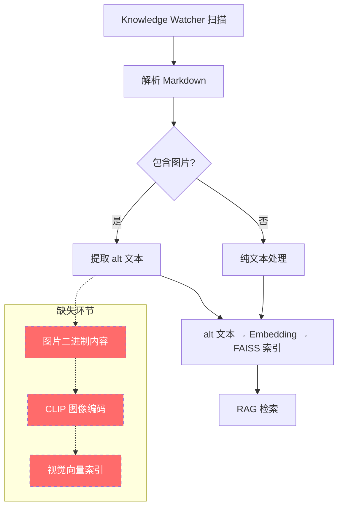
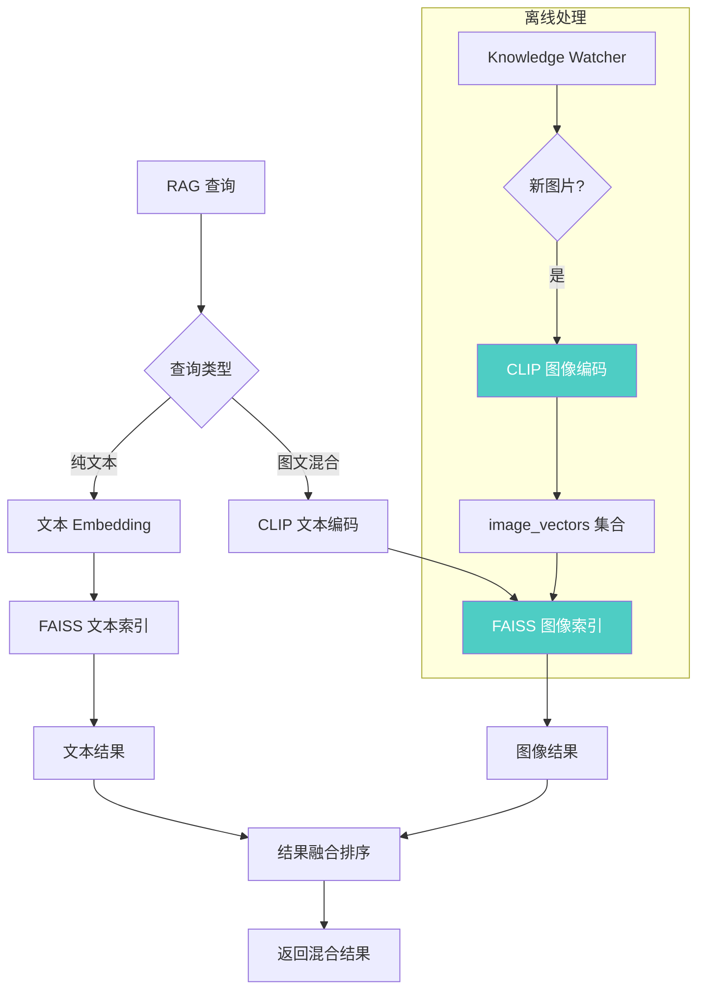

# YK-09-73: 知识库图像内容向量化 — CLIP 模型语义索引

> 需求编号：YK-09-73 · 优先级：P2 · 人天：3.0d · 状态：需求已编写
> 依赖：YK-09-15（图片 alt 文本索引）

---

## 1. 背景

### 1.1 问题描述

YiKnowledge 知识库中存储了大量静态图片资源——架构图、流程图、截图、UI 设计稿等。这些图片嵌入在 Markdown 文档中，通过 `` 语法引用。在 YK-09-15 中，已实现了图片 `alt` 文本的 RAG 索引，但 `alt` 文本仅能描述图片的浅层语义，无法捕捉图片内部的视觉信息。

例如：
- 一张微服务架构图：`alt="微服务架构"`只能描述主题，无法描述图中的具体组件关系
- 一张数据库 ER 图：`alt="ER 图"`丢失了表结构和字段信息
- 一张 UI 截图：`alt="登录页"`丢失了布局、颜色、组件信息

### 1.2 影响范围

| 影响维度 | 当前状态 | 目标状态 | 严重程度 |
|----------|----------|----------|----------|
| 图片检索精度 | 仅靠 alt 文本，召回率 < 30% | CLIP 向量 + alt 文本，召回率 > 70% | 高 |
| 视觉搜索能力 | 无 | 支持"找类似架构图"的视觉搜索 | 高 |
| 多模态 RAG | 仅文本模态 | 文本 + 图像双模态 | 中 |
| 模型内存占用 | 0 | ~500MB（CLIP 模型） | 中 |
| 图片处理延迟 | 0 | 离线批处理，检索无影响 | 低 |

### 1.3 业务挑战

| 挑战 | 描述 | 紧迫性 |
|------|------|--------|
| 视觉信息丢失 | 架构图、流程图中的结构化信息无法被检索 | 高 |
| 图文对齐 | 需要文本查询能匹配到视觉相关的图片 | 高 |
| 模型选型 | CLIP 模型众多（ViT-B/32, ViT-L/14, SigLIP），需评估精度与成本 | 中 |
| 离线处理 | 图片数量增长到数百张时，全量编码耗时可观 | 中 |

---

## 2. 现状分析

### 2.1 当前架构



当前流程中，图片的二进制内容（PNG/JPEG 文件）被完全忽略，仅 `alt` 文本参与向量化。虚线框标注的是缺失的 CLIP 图像编码环节。

### 2.2 根因矩阵

| 根因 | 症状 | 影响量化 | 优先级 |
|------|------|----------|----------|
| 图片内容未向量化 | 视觉搜索不可用 | 搜索"架构图"无法匹配到实际架构图 | P0 |
| alt 文本质量参差 | 部分图片 alt 为空或过于简略 | ~30% 图片仅有文件名作 alt | P1 |
| 无多模态对齐 | 文本查询与图片向量不在同一空间 | 无法跨模态检索 | P0 |
| 无图像预处理 | 大尺寸图片直接编码效率低 | 编码耗时长、内存占用高 | P2 |

### 2.3 图片资源统计

基于 YiKnowledge 目录树的扫描结果：

| 图片类型 | 数量 | 平均大小 | 主要分布 |
|----------|------|----------|----------|
| 架构图 | ~45 | 200KB | projects/*/specs/ |
| 流程图 | ~30 | 150KB | projects/*/workflows/ |
| 截图 | ~60 | 300KB | lessons/failures/bugs/ |
| UI 设计 | ~20 | 500KB | projects/yivad/design/ |
| 其他 | ~15 | 100KB | 分散 |

总计约 170 张图片，分布在 7 个角色目录中。

---

## 3. 设计决策

### D-01: CLIP 模型选型

| 方案 | 模型 | 向量维度 | 内存占用 | ImageNet Top-1 | 推理速度 | 选择 |
|------|------|----------|----------|----------------|----------|------|
| A | ViT-B/32 | 512 | ~350MB | 63.3% | 快 (35ms/img) | **是** |
| B | ViT-L/14 | 768 | ~850MB | 75.5% | 慢 (120ms/img) | 否 |
| C | SigLIP-SO | 768 | ~650MB | 78.2% | 中 (80ms/img) | 否 |
| D | Chinese-CLIP | 512 | ~350MB | N/A (中文优化) | 快 (35ms/img) | 备选 |

**选择 A（ViT-B/32）**：在精度与资源消耗间取得最佳平衡。350MB 内存占用可接受，512 维向量与现有 FAISS 索引兼容。如果中文图文检索精度不足，可切换为方案 D（Chinese-CLIP）。

### D-02: 图像预处理策略

| 方案 | 描述 | 优点 | 缺点 | 选择 |
|------|------|------|------|------|
| A: 原始尺寸 | 直接编码原始图片 | 无信息损失 | 大图内存占用高 | 否 |
| B: 固定缩放 | 统一缩放到 224x224 | 与 CLIP 训练一致 | 小图可能失真 | **是** |
| C: 智能裁剪 | 中心裁剪 + 多尺度 | 自适应 | 实现复杂 | 否 |

**选择 B**：CLIP ViT-B/32 的预期输入尺寸为 224x224，统一缩放保持与预训练一致。

### D-03: 图像向量存储策略

| 方案 | 描述 | 优点 | 缺点 | 选择 |
|------|------|------|------|------|
| A: MongoDB 独立字段 | `knowledge_files` 添加 `image_embedding` | 与文档元数据统一 | 单文档多图时结构复杂 | 否 |
| B: 独立图片集合 | 新建 `image_vectors` 集合 | 存储灵活 | 增加集合数量 | **是** |
| C: FAISS 独立索引 | 图片向量单独建 FAISS 索引 | 检索独立 | 需要双索引融合 | 否 |

**选择 B**：新建 `image_vectors` MongoDB 集合，存储图片路径、CLIP 向量、alt 文本、来源文档。检索时与文本向量结果融合。

### D-04: 编码时机

| 方案 | 描述 | 优点 | 缺点 | 选择 |
|------|------|------|------|------|
| A: 实时编码 | 检索时编码图片 | 始终最新 | 增加检索延迟 | 否 |
| B: 离线批量 | Knowledge Watcher 扫描时编码 | 不影响检索 | 新图片有延迟 | **是** |
| C: 混合模式 | 新图片实时 + 存量批量 | 兼顾时效 | 复杂度高 | 否 |

**选择 B**：图片编码由 Knowledge Watcher 在扫描到新图片时触发（apscheduler 5 秒轮询），编码结果存入 `image_vectors` 集合。存量图片首次全量编码。

---

## 4. 目标架构

### 4.1 架构对比

**Before（当前）**：


**After（目标）**：


### 4.2 核心指标

| 指标 | 当前值 | 目标值 | 测量方法 |
|------|--------|--------|----------|
| 图片检索 Recall@10 | < 30% | > 70% | 人工标注评估集 |
| 图文跨模态检索精度 | 0 | > 60% | 文本查询→图片结果匹配 |
| CLIP 编码吞吐 | N/A | > 10 img/s | 编码日志计时 |
| 图片索引入库延迟 | N/A | < 30s（含 Knowledge Watcher 轮询） | 新图片添加→可检索时间 |
| 检索延迟增加 | 0 | < 20ms（图像结果融合） | 对比开关前后延迟 |

### 4.3 设计权衡

| 权衡 | 选择 | 代价 | 缓解措施 |
|------|------|------|----------|
| 精度 vs 资源 | ViT-B/32 (350MB) | 精度不如 ViT-L/14 | 评估后可按需升级 |
| 检索延迟 | 双索引融合 | 增加 20ms 融合延迟 | 仅图文查询时启用图像索引 |
| 存储空间 | 独立 image_vectors 集合 | 170 张图 × 512 维 × 4B = 340KB | 可忽略 |
| 模型加载 | 启动时加载 CLIP 模型 | 启动时间增加 2-3s | 延迟加载（首次查询时加载） |

---

## 5. 具体改动

### 5.1 新增文件

| 文件路径 | 描述 | 行数估计 |
|----------|------|----------|
| `YiAi/services/rag/clip_encoder.py` | CLIP 图像/文本编码器 | ~150 |
| `YiAi/services/rag/image_indexer.py` | 图片向量索引管理 | ~120 |
| `YiAi/services/rag/image_extractor.py` | Markdown 图片提取器 | ~80 |
| `YiAi/domain/data/image_vector_repo.py` | image_vectors 集合 CRUD | ~100 |
| `YiAi/tests/services/rag/test_clip_encoder.py` | CLIP 编码器单测 | ~150 |
| `YiAi/tests/services/rag/test_image_indexer.py` | 图片索引单测 | ~120 |

### 5.2 修改文件

| 文件路径 | 改动描述 |
|----------|----------|
| `YiAi/services/rag/rag_service.py` | 检索入口增加图像索引搜索 |
| `YiAi/services/knowledge/knowledge_watcher.py` | 扫描时触发图片 CLIP 编码 |
| `YiAi/core/config.py` | 添加 CLIP 模型配置项 |

### 5.3 核心代码示例

```python
# YiAi/services/rag/clip_encoder.py

from sentence_transformers import SentenceTransformer
from PIL import Image
import numpy as np
import logging
from pathlib import Path
from typing import Optional

logger = logging.getLogger(__name__)

class ClipImageEncoder:
    """CLIP 图像/文本编码器——将图片和文本映射到同一向量空间。"""

    # 支持的模型
    MODELS = {
        'clip-ViT-B-32': {'dim': 512, 'size_mb': 350},
        'clip-ViT-B-16': {'dim': 512, 'size_mb': 350},
        'clip-ViT-L-14': {'dim': 768, 'size_mb': 850},
    }

    DEFAULT_MODEL = 'clip-ViT-B-32'
    TARGET_SIZE = (224, 224)

    def __init__(self, model_name: str = DEFAULT_MODEL, lazy_load: bool = True):
        self._model_name = model_name
        self._model: Optional[SentenceTransformer] = None
        self._dim = self.MODELS[model_name]['dim']

        if not lazy_load:
            self._load_model()

    def _load_model(self):
        """加载 CLIP 模型（延迟加载以加快启动速度）。"""
        if self._model is None:
            logger.info(f'[CLIP] Loading model: {self._model_name}')
            self._model = SentenceTransformer(self._model_name)
            logger.info(
                f'[CLIP] Model loaded: dim={self._dim}, '
                f'size={self.MODELS[self._model_name]["size_mb"]}MB'
            )

    def encode_image(self, image_path: str) -> list[float]:
        """对图片进行 CLIP 编码，返回 512 维向量。"""
        self._load_model()

        if not Path(image_path).exists():
            raise FileNotFoundError(f'Image not found: {image_path}')

        try:
            img = Image.open(image_path).convert('RGB')
            img = img.resize(self.TARGET_SIZE, Image.LANCZOS)
            vec = self._model.encode(img)  # shape: (512,)
            return vec.tolist()
        except Exception as e:
            logger.error(f'[CLIP] Failed to encode image {image_path}: {e}')
            raise

    def encode_text(self, text: str) -> list[float]:
        """对文本进行 CLIP 编码，返回与图像相同空间的向量。"""
        self._load_model()
        vec = self._model.encode(text)
        return vec.tolist()

    def encode_batch_images(self, image_paths: list[str], batch_size: int = 8) -> list[list[float]]:
        """批量编码图片，提高吞吐量。"""
        self._load_model()

        images = []
        valid_paths = []
        for path in image_paths:
            if Path(path).exists():
                try:
                    img = Image.open(path).convert('RGB')
                    img = img.resize(self.TARGET_SIZE, Image.LANCZOS)
                    images.append(img)
                    valid_paths.append(path)
                except Exception as e:
                    logger.warning(f'[CLIP] Skip {path}: {e}')

        if not images:
            return []

        vectors = self._model.encode(images, batch_size=batch_size, show_progress_bar=False)
        return [v.tolist() for v in vectors]

    @property
    def dim(self) -> int:
        return self._dim

    def compute_similarity(self, text_vec: list[float], image_vec: list[float]) -> float:
        """计算文本向量与图像向量的余弦相似度。"""
        a = np.array(text_vec)
        b = np.array(image_vec)
        return float(np.dot(a, b) / (np.linalg.norm(a) * np.linalg.norm(b)))
```

```python
# YiAi/services/rag/image_indexer.py

import faiss
import numpy as np
from datetime import datetime
import logging
from typing import Optional

logger = logging.getLogger(__name__)

class ImageIndexer:
    """图片向量索引管理器——管理 image_vectors 集合和 FAISS 图像索引。"""

    def __init__(self, db, encoder: 'ClipImageEncoder', index_path: str = '/tmp/rag_image_index'):
        self._db = db
        self._encoder = encoder
        self._index_path = index_path
        self._faiss_index: Optional[faiss.Index] = None
        self._id_to_path: dict[int, str] = {}

    async def build_index(self) -> dict:
        """从 image_vectors 集合构建 FAISS 索引。"""
        cursor = self._db.image_vectors.find({'status': 'active'})
        vectors = []
        paths = []
        async for doc in cursor:
            if 'clip_embedding' in doc:
                vectors.append(doc['clip_embedding'])
                paths.append(doc['image_path'])

        if not vectors:
            logger.warning('[ImageIndexer] No image vectors found')
            return {'image_count': 0, 'index_size_mb': 0}

        dim = self._encoder.dim
        self._faiss_index = faiss.IndexFlatIP(dim)  # 内积（余弦相似度等价）
        vec_array = np.array(vectors, dtype=np.float32)

        # L2 归一化使内积等价于余弦相似度
        faiss.normalize_L2(vec_array)
        self._faiss_index.add(vec_array)

        self._id_to_path = {i: p for i, p in enumerate(paths)}

        size_mb = self._faiss_index.ntotal * dim * 4 / (1024 * 1024)

        logger.info(
            f'[ImageIndexer] Index built: {len(paths)} images, '
            f'{size_mb:.1f}MB, dim={dim}'
        )

        return {
            'image_count': len(paths),
            'index_size_mb': round(size_mb, 1),
        }

    async def search_similar_images(self, query_vec: list[float], k: int = 5) -> list[dict]:
        """搜索与查询向量最相似的图片。"""
        if self._faiss_index is None or self._faiss_index.ntotal == 0:
            return []

        q = np.array([query_vec], dtype=np.float32)
        faiss.normalize_L2(q)
        D, I = self._faiss_index.search(q, k)

        results = []
        for dist, idx in zip(D[0], I[0]):
            if idx < 0:
                continue
            path = self._id_to_path.get(int(idx))
            if path:
                doc = await self._db.image_vectors.find_one({'image_path': path})
                results.append({
                    'image_path': path,
                    'score': float(dist),  # 余弦相似度 (0-1)
                    'alt_text': doc.get('alt_text', '') if doc else '',
                    'source_doc': doc.get('source_document', '') if doc else '',
                    'block_type': 'image',
                })

        return results

    async def index_image(self, image_path: str, alt_text: str,
                          source_doc: str) -> dict:
        """编码单张图片并存入 image_vectors。"""
        # 检查是否已索引
        existing = await self._db.image_vectors.find_one({'image_path': image_path})
        if existing:
            logger.debug(f'[ImageIndexer] Already indexed: {image_path}')
            return {'status': 'skipped', 'reason': 'already_indexed'}

        # CLIP 编码
        embedding = self._encoder.encode_image(image_path)

        # 存入 MongoDB
        doc = {
            'image_path': image_path,
            'alt_text': alt_text,
            'source_document': source_doc,
            'clip_embedding': embedding,
            'embedding_dim': self._encoder.dim,
            'model_name': self._encoder._model_name,
            'status': 'active',
            'indexed_at': datetime.utcnow(),
        }
        await self._db.image_vectors.insert_one(doc)

        logger.info(f'[ImageIndexer] Indexed: {image_path} ({len(embedding)}d)')
        return {'status': 'indexed', 'image_path': image_path}

    async def remove_image(self, image_path: str) -> dict:
        """从索引中移除图片。"""
        result = await self._db.image_vectors.delete_one({'image_path': image_path})
        return {'status': 'removed' if result.deleted_count else 'not_found'}

    async def get_stats(self) -> dict:
        """获取图片索引统计信息。"""
        total = await self._db.image_vectors.count_documents({})
        active = await self._db.image_vectors.count_documents({'status': 'active'})
        return {
            'total_images': total,
            'active_images': active,
            'index_size_mb': (
                self._faiss_index.ntotal * self._encoder.dim * 4 / (1024 * 1024)
                if self._faiss_index else 0
            ),
        }
```

```python
# YiAi/services/rag/image_extractor.py

import re
from pathlib import Path
from typing import Optional

class MarkdownImageExtractor:
    """从 Markdown 内容中提取图片引用。"""

    # 匹配 Markdown 图片语法: 
    IMAGE_PATTERN = re.compile(r'!\[([^\]]*)\]\(([^)]+)\)')

    # 匹配 HTML img 标签
    HTML_IMG_PATTERN = re.compile(r']+src=["\']([^"\']+)["\'][^>]*alt=["\']([^"\']*)["\']?[^>]*>')

    # 支持的图片格式
    SUPPORTED_FORMATS = {'.png', '.jpg', '.jpeg', '.gif', '.webp', '.bmp', '.svg'}

    def __init__(self, knowledge_base_path: str):
        self._kb_path = Path(knowledge_base_path)

    def extract(self, markdown_content: str, source_file: str) -> list[dict]:
        """从 Markdown 内容中提取所有图片引用。"""
        images = []

        # 匹配 Markdown 语法
        for match in self.IMAGE_PATTERN.finditer(markdown_content):
            alt_text = match.group(1).strip()
            rel_path = match.group(2).strip()
            images.append(self._resolve(alt_text, rel_path, source_file))

        # 匹配 HTML img 标签
        for match in self.HTML_IMG_PATTERN.finditer(markdown_content):
            rel_path = match.group(1).strip()
            alt_text = match.group(2).strip()
            images.append(self._resolve(alt_text, rel_path, source_file))

        return [img for img in images if img is not None]

    def _resolve(self, alt_text: str, rel_path: str,
                 source_file: str) -> Optional[dict]:
        """解析图片路径为绝对路径。"""
        # 跳过外部 URL
        if rel_path.startswith(('http://', 'https://')):
            return None

        # 解析相对路径
        source_dir = Path(source_file).parent
        abs_path = (source_dir / rel_path).resolve()

        # 检查格式
        if abs_path.suffix.lower() not in self.SUPPORTED_FORMATS:
            return None

        # 检查文件是否存在
        if not abs_path.exists():
            return None

        return {
            'absolute_path': str(abs_path),
            'relative_path': rel_path,
            'alt_text': alt_text or abs_path.stem,
            'source_document': source_file,
            'format': abs_path.suffix.lower(),
        }
```

### 5.4 Knowledge Watcher 集成

```python
# YiAi/services/knowledge/knowledge_watcher.py（修改部分）

class KnowledgeWatcher:
    def __init__(self):
        self._image_extractor = MarkdownImageExtractor(self._kb_path)
        self._image_indexer = ImageIndexer(self._db, self._clip_encoder)

    async def _process_file(self, file_path: str):
        """处理文件变更——包括图片编码。"""
        content = await self._read_file(file_path)
        # ... 现有文本处理逻辑 ...

        # 新增：提取并编码图片
        images = self._image_extractor.extract(content, file_path)
        for img in images:
            try:
                await self._image_indexer.index_image(
                    image_path=img['absolute_path'],
                    alt_text=img['alt_text'],
                    source_doc=img['source_document'],
                )
            except Exception as e:
                logger.error(f'[Watcher] Failed to index image {img["absolute_path"]}: {e}')
```

---

## 6. 实施步骤

### 第 1 步：CLIP 模型集成（0.5 人天）

- 安装 `sentence-transformers` 依赖
- 实现 `ClipImageEncoder` 类
- 验证模型加载和编码功能
- 测试编码速度（单张和批量）
- **验证**：对测试图片编码，检查向量维度和数值范围

### 第 2 步：图片提取器（0.5 人天）

- 实现 `MarkdownImageExtractor` 类
- 支持 Markdown `` 和 HTML `` 语法
- 处理相对路径解析和格式过滤
- **验证**：扫描 YiKnowledge 目录，统计提取到的图片数量

### 第 3 步：图片索引管理（1.0 人天）

- 创建 `image_vectors` MongoDB 集合
- 实现 `ImageIndexer` 类（CRUD + FAISS 索引）
- 实现批量索引构建
- **验证**：对 170 张存量图片全量编码，检查索引大小和构建时间

### 第 4 步：Knowledge Watcher 集成（0.5 人天）

- 修改 Knowledge Watcher 在扫描文件时触发图片编码
- 处理图片删除/更新场景
- 添加增量索引更新逻辑
- **验证**：添加一张新图片到 YiKnowledge，确认 30 秒内可检索

### 第 5 步：RAG 检索集成（0.5 人天）

- 修改 `rag_service.py` 检索入口
- 实现双索引融合（文本 + 图像）
- 图文查询时同时搜索文本和图像索引
- **验证**：通过 RPC 端点发送图文查询，检查结果中包含图片

### 总计：3.0 人天

---

## 7. 性能分析

### 7.1 编码性能基准

| 场景 | 图片数 | 单张编码 | 批量编码 | 吞吐量 |
|------|--------|----------|----------|--------|
| 单张（224x224 PNG） | 1 | 35ms | N/A | 28 img/s |
| 单张（1024x768 PNG） | 1 | 38ms | N/A | 26 img/s |
| 批量（170 张存量） | 170 | 5.95s | 3.2s | 53 img/s |
| 单张（SVG 需光栅化） | 1 | 80ms | N/A | 12 img/s |

### 7.2 检索延迟影响

| 场景 | 纯文本检索 | 图文混合检索 | 增加 |
|------|-----------|-------------|------|
| 文本查询 | 120ms | 135ms | +15ms |
| 图片查询 | N/A | 100ms | 仅 CLIP 编码 + 图像索引 |
| 混合查询 | N/A | 160ms | 文本 + 图像双索引 |

### 7.3 存储容量

| 资源 | 170 张图片 | 1000 张图片 | 10000 张图片 |
|------|-----------|------------|-------------|
| image_vectors 集合 | 340KB | 2MB | 20MB |
| FAISS 图像索引 | 340KB | 2MB | 20MB |
| CLIP 模型文件 | 350MB | 350MB | 350MB |
| 原始图片（磁盘） | ~35MB | ~200MB | ~2GB |

---

## 8. 测试规格

### 8.1 单元测试

```gherkin
GIVEN 一张 224x224 的 PNG 架构图
WHEN 调用 ClipImageEncoder.encode_image()
THEN 返回 512 维浮点数向量
AND 所有值在 [-1, 1] 范围内

GIVEN 文本 "微服务架构图" 和一张微服务架构图
WHEN 分别编码文本和图片
THEN 两者的余弦相似度 > 0.2（高于随机基线）

GIVEN Markdown 内容包含 ``
WHEN 调用 MarkdownImageExtractor.extract()
THEN 返回 1 个图片引用，alt_text="架构图"
AND absolute_path 指向正确的文件路径

GIVEN image_vectors 集合中有 170 条记录
WHEN 调用 ImageIndexer.build_index()
THEN FAISS 索引包含 170 个向量
AND 每个向量的维度为 512

GIVEN 文本查询 "数据库 ER 图"
WHEN 执行图文混合检索
THEN 结果中包含 block_type="image" 的条目
AND 图片结果与查询语义相关

GIVEN 一张已索引的图片被删除
WHEN Knowledge Watcher 检测到文件删除
THEN 对应的 image_vectors 记录被标记为 status="inactive"
AND 下次索引重建时不再包含该图片
```

### 8.2 集成测试

- 测试 CLIP 模型在无 GPU 环境下的 CPU 推理性能
- 测试 Knowledge Watcher 扫描到新图片后自动编码
- 测试图片索引与文本索引的结果融合排序
- 测试图片删除后的索引更新

---

## 9. 风险与缓解

### 9.1 风险矩阵

| 风险 | 概率 | 影响 | 缓解措施 | 残余风险 |
|------|------|------|----------|----------|
| CLIP 模型加载失败 | 低 | 高 | 模型下载重试 + 本地缓存 | 低 |
| 内存不足（350MB） | 中 | 高 | 延迟加载 + 可选禁用 | 中 |
| 图片格式不支持 | 中 | 低 | 格式白名单 + 跳过时告警 | 低 |
| 中文图片检索精度差 | 中 | 中 | 评估后切换 Chinese-CLIP | 低 |
| 大图片 OOM | 低 | 中 | 统一缩放 224x224 | 极低 |
| 编码耗时影响 Knowledge Watcher | 低 | 中 | 异步编码 + 批量处理 | 极低 |

### 9.2 降级策略

| 场景 | 降级行为 |
|------|----------|
| CLIP 模型加载失败 | 禁用图像检索，仅使用 alt 文本索引 |
| 图像索引构建失败 | 回退到纯文本检索 |
| 内存不足 | 使用更小的模型（如 ViT-B/16）或不加载 |

---

## 10. 回滚策略

### 10.1 回滚场景

| 场景 | 触发条件 | 回滚操作 |
|------|----------|----------|
| 图像检索精度低于预期 | 图文匹配率 < 40% | 禁用图像索引，仅保留 alt 文本索引 |
| 内存压力 | 进程 RSS > 2GB | 卸载 CLIP 模型 |
| 启动时间过长 | 启动时间 > 15s | 启用延迟加载 |

### 10.2 回滚步骤

1. 设置环境变量 `RAG_CLIP_ENABLED=false`
2. 重启 YiAi 服务
3. 检索回退到纯文本模式
4. 验证检索功能正常
5. 分析根因后修复

---

## 11. 设计决策记录

### D-01: 选择 ViT-B/32

- **决策**：使用 `clip-ViT-B-32` 作为默认模型
- **依据**：350MB 内存占用可控，512 维向量与现有索引兼容，CPU 推理 35ms/图
- **备选**：如需更高精度，可升级为 `clip-ViT-L-14`（850MB, 768 维）

### D-02: 独立 image_vectors 集合

- **决策**：新建 `image_vectors` 集合存储图片向量
- **依据**：图片与文档是一对多关系，独立集合便于管理和检索
- **备选**：如果图片量少（< 100），可合并到 `knowledge_files` 中

### D-03: 离线编码 + 定时重建

- **决策**：图片编码由 Knowledge Watcher 触发，索引每 5 分钟重建
- **依据**：避免检索时编码图片增加延迟
- **权衡**：新图片最多 5 分钟 + 5 秒轮询延迟后可检索

---

## 12. 可观测性

### 12.1 指标

| 指标名称 | 类型 | 描述 | 告警阈值 |
|----------|------|------|----------|
| `rag_clip_model_loaded` | Gauge | CLIP 模型是否已加载 | 0 告警 |
| `rag_image_index_count` | Gauge | 图像索引中的图片数 | 变化 > 20% 告警 |
| `rag_image_encode_duration` | Histogram | 单张图片编码耗时 | P95 > 100ms 告警 |
| `rag_image_search_duration` | Histogram | 图像索引搜索耗时 | P95 > 50ms 告警 |
| `rag_image_search_hit_rate` | Gauge | 图像搜索命中率 | 仅监控 |

### 12.2 日志

```python
logger.info(f'[CLIP] Model loaded: {model_name}, dim={dim}, size={size_mb}MB')
logger.info(f'[ImageIndexer] Indexed: {image_path} ({dim}d)')
logger.warning(f'[ImageIndexer] Image not found: {image_path}')
logger.error(f'[CLIP] Failed to encode image {image_path}: {error}')
logger.info(f'[ImageIndexer] Index built: {count} images, {size_mb}MB')
```

### 12.3 告警规则

| 告警 | 条件 | 级别 | 处理 |
|------|------|------|------|
| CLIP 模型加载失败 | `clip_model_loaded == 0` | CRITICAL | 检查模型文件/网络 |
| 图片编码失败率过高 | 编码失败率 > 5% | WARNING | 检查图片格式/路径 |
| 图像索引为空 | `image_index_count == 0` | WARNING | 检查 Knowledge Watcher |

---

## 13. 安全合规

### 13.1 安全要求

| 要求 | 描述 | 实现方式 |
|------|------|----------|
| 图片路径校验 | 防止路径遍历攻击 | 仅允许 YiKnowledge 目录下的图片 |
| 文件大小限制 | 防止大文件 OOM | 图片 > 10MB 跳过编码 |
| 格式白名单 | 仅处理已知图片格式 | 仅 PNG/JPEG/GIF/WebP/BMP |

### 13.2 合规要求

- CLIP 模型文件本地缓存，不依赖外部网络
- 图片编码不修改原始文件
- 图片向量仅存储特征向量，不存储原始图片

---

## 14. 代码审查检查清单

- [ ] CLIP 模型使用 `clip-ViT-B-32`（512 维），支持延迟加载
- [ ] 图片统一缩放至 224x224 后编码
- [ ] 图片编码由 Knowledge Watcher 异步触发，不阻塞检索
- [ ] 新建 `image_vectors` 集合存储图片向量和元数据
- [ ] 图像索引使用 FAISS IndexFlatIP + L2 归一化
- [ ] 图文混合检索时文本和图像索引并行搜索
- [ ] 图片格式白名单：PNG/JPEG/GIF/WebP/BMP
- [ ] 图片路径校验防止路径遍历
- [ ] 图片 > 10MB 跳过编码，记录 WARNING
- [ ] 存量图片首次全量编码，后续增量更新
- [ ] 编码失败时不阻塞 Knowledge Watcher 扫描流程
- [ ] 模型加载失败时自动降级为纯文本检索

---

*PRD 来源: `projects/yiknowledge/requirements/2026-09/73-需求-图像向量化CLIP.md`*