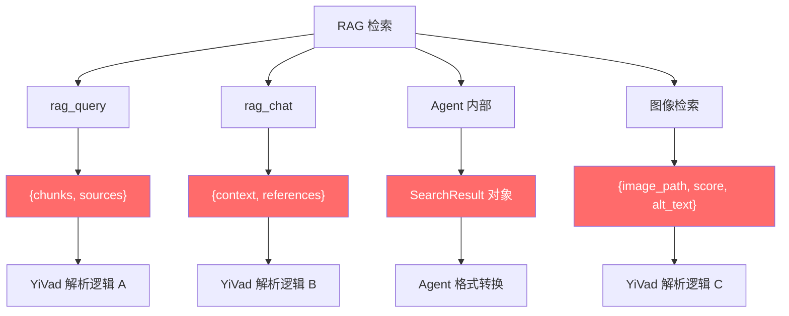
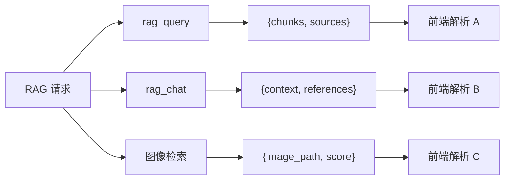
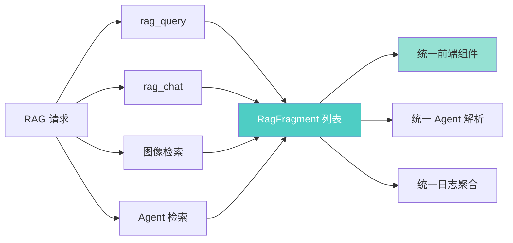

# YK-09-74: RAG 检索结果格式标准化 — 统一 Fragment Schema

> 需求编号：YK-09-74 · 优先级：P2 · 人天：2.5d · 状态：需求已编写

---

## 1. 背景

### 1.1 问题描述

YiAi 的 RAG 检索系统当前存在多个端点，各自返回不同的结果格式：

- `rag_query` 端点返回 `{chunks: [...], sources: [...]}`，其中 `chunks` 是文本片段，`sources` 是来源文档列表
- `rag_chat` 端点返回 `{context: "...", references: [...]}`，其中 `context` 是拼接后的文本，`references` 是简化的引用列表
- Agent 内部循环使用自定义的 `SearchResult` 对象，字段名与上述端点不一致
- 图像检索（YK-09-73）返回 `{image_path, score, alt_text}` 格式，与文本检索格式完全不同

这种不一致导致以下问题：

1. **前端（YiVad）**需要为每个端点编写不同的解析逻辑，渲染组件无法复用
2. **AI Agent** 在处理 RAG 结果时需要做格式转换，增加了 prompt 复杂度
3. **日志分析**（如 YK-09-80 实时看板）无法统一聚合不同端点的检索结果
4. **新增 RAG 能力**（如多模态混合查询 YK-09-84）需要定义新的返回格式，进一步加剧碎片化

### 1.2 影响范围

| 影响维度 | 当前状态 | 目标状态 | 严重程度 |
|----------|----------|----------|----------|
| 前端适配成本 | 每个端点独立适配 | 统一组件消费 | 高 |
| Agent 代码复杂度 | 格式转换逻辑分散 | 统一 `RagFragment` 解析 | 高 |
| 跨端点日志聚合 | 不可聚合 | 统一字段可聚合 | 中 |
| 新端点开发速度 | 每次需定义新格式 | 复用 `RagFragment` | 中 |
| 向后兼容性 | N/A | 保留旧格式过渡期 | 低 |

### 1.3 业务挑战

| 挑战 | 描述 | 紧迫性 |
|------|------|--------|
| 三端一致 | YiVad、YiPet、Agent 需要统一消费接口 | 高 |
| 可扩展性 | 新增字段不应破坏旧客户端 | 高 |
| 多模态兼容 | 统一格式需同时支持文本、图片、代码片段 | 中 |
| 性能不退化 | 格式转换不应增加显著的序列化开销 | 低 |

---

## 2. 现状分析

### 2.1 当前格式碎片化



### 2.2 根因矩阵

| 根因 | 症状 | 影响量化 | 优先级 |
|------|------|----------|----------|
| 无统一 Schema | 4 种不同返回格式 | 4 套解析逻辑 | P0 |
| 字段命名不一致 | `source_path` vs `path` vs `file` | 前端适配成本高 | P0 |
| 缺少版本化 | 新增字段可能破坏旧客户端 | 升级风险 | P1 |
| 无类型约束 | Python 端无 dataclass 约束 | 运行时字段缺失 | P1 |

### 2.3 当前各端点返回格式对比

| 字段 | rag_query | rag_chat | Agent 内部 | 图像检索 |
|------|-----------|----------|------------|----------|
| 文本内容 | `chunks[].text` | `context` (拼接) | `result.content` | N/A |
| 来源路径 | `sources[].path` | `references[].file` | `result.source` | `image_path` |
| 相关性分数 | `chunks[].score` | 无 | `result.relevance` | `score` |
| 文档标题 | `sources[].title` | 无 | `result.doc_title` | 无 |
| 片段 ID | 无 | 无 | `result.id` | 无 |
| 块类型 | 无 | 无 | 无 | `image` |

---

## 3. 设计决策

### D-01: 统一 Schema 定义方式

| 方案 | 描述 | 优点 | 缺点 | 选择 |
|------|------|------|------|------|
| A: Python dataclass | 使用 `@dataclass` 定义 | 类型安全，IDE 支持 | 需要序列化适配 | **是** |
| B: Pydantic BaseModel | 使用 Pydantic 模型 | 自动校验，FastAPI 兼容 | 依赖较重 | 否 |
| C: TypedDict | 使用 `TypedDict` | 轻量 | 无法定义方法 | 否 |
| D: JSON Schema | 独立 JSON Schema 文件 | 跨语言 | 与 Python 代码分离 | 否 |

**选择 A**：`@dataclass` 提供类型安全和 IDE 支持，且与现有 YiAi 代码风格一致。通过 `dataclasses.asdict()` 即可序列化为 JSON。

### D-02: 必填字段 vs 可选字段

| 方案 | 描述 | 优点 | 缺点 | 选择 |
|------|------|------|------|------|
| A: 最小必填 | 仅 content/path/score 必填 | 简单 | 信息不足 | 否 |
| B: 完整必填 | 所有字段必填 | 信息完整 | 不同端点填充成本高 | 否 |
| C: 核心必填 + 扩展可选 | 核心字段必填，扩展字段可选 | 平衡 | 需文档约定 | **是** |

**选择 C**：核心字段（id, content, source_path, source_title, score）必填，扩展字段（score_breakdown, block_type, context, metadata）可选。

### D-03: 向后兼容策略

| 方案 | 描述 | 优点 | 缺点 | 选择 |
|------|------|------|------|------|
| A: 立即切换 | 所有端点立即使用新格式 | 干净 | 破坏现有客户端 | 否 |
| B: 双格式过渡 | 同时返回新旧格式，过渡期后移除旧格式 | 平滑 | 过渡期双倍数据量 | **是** |
| C: 版本化端点 | 新建 `/v2/rag/query` 端点 | 完全隔离 | 维护两套端点 | 否 |

**选择 B**：在新格式中添加 `_format_version: "2.0"` 字段，旧格式保留 `chunks`/`sources` 字段，过渡期 2 个月后移除旧格式。

### D-04: 多模态扩展

| 方案 | 描述 | 优点 | 缺点 | 选择 |
|------|------|------|------|------|
| A: 统一 content 字段 | 所有模态的内容放在 content 中 | 简单 | 图片/代码结构不同 | 否 |
| B: 多态 content | content 根据 block_type 不同结构 | 灵活 | 消费端需判断类型 | **是** |
| C: 独立 Fragment 子类 | 文本/图片/代码各有独立 Schema | 类型安全 | 统一处理困难 | 否 |

**选择 B**：`content` 字段根据 `block_type` 提供不同结构，但外层 Schema 统一。

---

## 4. 目标架构

### 4.1 架构对比

**Before（当前）**：


**After（目标）**：


### 4.2 核心指标

| 指标 | 当前值 | 目标值 | 测量方法 |
|------|--------|--------|----------|
| 前端解析代码行数 | ~200（4 套逻辑） | ~50（1 套逻辑） | 代码行数统计 |
| Agent 格式转换代码 | ~80 行 | 0 行 | 代码行数统计 |
| 新端点开发时间 | 2h（含格式定义） | 0.5h（复用 Schema） | 开发耗时估算 |
| 日志聚合覆盖率 | 30% | 100% | 可聚合字段数/总字段数 |

### 4.3 设计权衡

| 权衡 | 选择 | 代价 | 缓解措施 |
|------|------|------|----------|
| 简洁性 vs 完整性 | 核心必填 + 扩展可选 | 消费端需处理可选字段 | 提供默认值 |
| 向后兼容 vs 干净迁移 | 双格式过渡期 | 2 个月双倍数据量 | 过渡期后自动移除 |
| 统一性 vs 灵活性 | 多态 content | 消费端需判断 block_type | 提供类型判断辅助函数 |

---

## 5. 具体改动

### 5.1 新增文件

| 文件路径 | 描述 | 行数估计 |
|----------|------|----------|
| `YiAi/services/rag/fragment.py` | RagFragment dataclass 定义 | ~80 |
| `YiAi/services/rag/fragment_serializer.py` | 序列化/反序列化工具 | ~60 |
| `YiAi/services/rag/fragment_adapter.py` | 旧格式到新格式的适配器 | ~100 |
| `YiAi/tests/services/rag/test_fragment.py` | Fragment 单测 | ~120 |
| `YiAi/tests/services/rag/test_fragment_adapter.py` | 适配器单测 | ~100 |

### 5.2 修改文件

| 文件路径 | 改动描述 |
|----------|----------|
| `YiAi/services/rag/rag_service.py` | 所有 RAG 端点返回 `list[RagFragment]` |
| `YiAi/services/rag/rag_chat.py` | 聊天端点适配新格式 |
| `YiAi/services/ai/agent_service.py` | Agent 内部使用 RagFragment |
| `YiAi/services/rag/image_indexer.py` | 图像检索返回 RagFragment |

### 5.3 核心代码示例

```python
# YiAi/services/rag/fragment.py

from dataclasses import dataclass, field, asdict
from enum import Enum
from typing import Optional, Any
import uuid


class BlockType(str, Enum):
    """RAG 检索结果的块类型。"""
    PARAGRAPH = "paragraph"     # 文本段落
    TABLE = "table"             # 表格
    CODE = "code"               # 代码块
    IMAGE = "image"             # 图片
    LIST = "list"               # 列表
    HEADING = "heading"         # 标题
    METADATA = "metadata"       # 元数据/frontmatter


class ScoreMethod(str, Enum):
    """相关性评分的计算方法。"""
    BM25 = "bm25"
    VECTOR_COSINE = "vector_cosine"
    VECTOR_IP = "vector_inner_product"
    CROSS_ENCODER = "cross_encoder"
    TAG_MATCH = "tag_match"
    HYBRID = "hybrid"           # 多方法融合
    CLIP_SIMILARITY = "clip_similarity"


@dataclass
class ScoreBreakdown:
    """相关性评分的详细分解。"""
    bm25: Optional[float] = None
    vector: Optional[float] = None
    tag_match: Optional[float] = None
    cross_encoder: Optional[float] = None
    clip_similarity: Optional[float] = None
    final: float = 0.0


@dataclass
class FragmentContext:
    """片段在原文中的上下文。"""
    before: Optional[str] = None     # 前文（100 字符）
    after: Optional[str] = None      # 后文（100 字符）
    heading_path: list[str] = field(default_factory=list)  # 标题层级路径
    page_number: Optional[int] = None   # 图片/PDF 页码


@dataclass
class FragmentMetadata:
    """片段的附加元数据。"""
    tags: list[str] = field(default_factory=list)
    category: Optional[str] = None
    role: Optional[str] = None          # 角色目录（curator/aier/engineer/...）
    language: Optional[str] = None      # 代码块语言（python/typescript/...）
    image_format: Optional[str] = None  # 图片格式（png/jpeg/...）
    image_dimensions: Optional[tuple[int, int]] = None  # 图片尺寸 (w, h)


@dataclass
class RagFragment:
    """RAG 检索结果统一 Fragment。

    所有 RAG 端点（rag_query、rag_chat、图像检索、Agent 检索）
    统一返回此格式的列表。

    核心字段（必填）：
        - id: 片段唯一标识
        - content: 文本内容（或图片路径等）
        - source_path: 来源文件路径
        - source_title: 文档标题
        - score: 相关性分数 (0-1)

    扩展字段（可选）：
        - score_breakdown: 评分分解
        - block_type: 内容块类型
        - context: 上下文信息
        - metadata: 附加元数据
    """
    # === 核心字段（必填） ===
    id: str                                    # 片段唯一标识
    content: str                               # 文本内容（或图片路径）
    source_path: str                           # 来源文件路径
    source_title: str                          # 文档标题
    score: float                               # 相关性分数 (0-1)

    # === 扩展字段（可选） ===
    score_breakdown: Optional[ScoreBreakdown] = None
    block_type: BlockType = BlockType.PARAGRAPH
    context: Optional[FragmentContext] = None
    metadata: Optional[FragmentMetadata] = None

    # === 格式版本 ===
    _format_version: str = "2.0"

    @classmethod
    def create(
        cls,
        content: str,
        source_path: str,
        source_title: str,
        score: float,
        block_type: BlockType = BlockType.PARAGRAPH,
        **kwargs,
    ) -> 'RagFragment':
        """工厂方法——自动生成 id。"""
        return cls(
            id=str(uuid.uuid4())[:12],
            content=content,
            source_path=source_path,
            source_title=source_title,
            score=score,
            block_type=block_type,
            **kwargs,
        )

    def to_dict(self) -> dict:
        """序列化为字典（用于 JSON 响应）。"""
        d = asdict(self)
        # 移除 None 值以减少响应体积
        return {k: v for k, v in d.items() if v is not None}

    def to_legacy_dict(self) -> dict:
        """转换为旧格式（向后兼容过渡期）。"""
        return {
            'text': self.content,
            'path': self.source_path,
            'title': self.source_title,
            'score': self.score,
            'type': self.block_type.value,
            'id': self.id,
            'tags': self.metadata.tags if self.metadata else [],
        }

    def is_visual(self) -> bool:
        """是否为视觉内容（图片、图表等）。"""
        return self.block_type == BlockType.IMAGE

    def is_code(self) -> bool:
        """是否为代码块。"""
        return self.block_type == BlockType.CODE

    def get_context_text(self) -> Optional[str]:
        """获取上下文文本（前后文拼接）。"""
        if self.context:
            parts = []
            if self.context.before:
                parts.append(self.context.before)
            parts.append(self.content)
            if self.context.after:
                parts.append(self.context.after)
            return ' '.join(parts)
        return None
```

```python
# YiAi/services/rag/fragment_serializer.py

from typing import Any
from .fragment import (
    RagFragment, BlockType, ScoreBreakdown,
    FragmentContext, FragmentMetadata, ScoreMethod,
)


def serialize_fragments(fragments: list[RagFragment]) -> dict:
    """将 Fragment 列表序列化为 RPC 响应格式。"""
    return {
        'code': 0,
        'message': 'ok',
        'data': {
            'fragments': [f.to_dict() for f in fragments],
            'total': len(fragments),
            '_format_version': '2.0',
        },
    }


def deserialize_fragments(data: dict) -> list[RagFragment]:
    """从 RPC 响应反序列化 Fragment 列表（前端/Agent 使用）。"""
    fragments_data = data.get('data', {}).get('fragments', [])
    fragments = []
    for fd in fragments_data:
        score_breakdown = None
        if fd.get('score_breakdown'):
            sb = fd['score_breakdown']
            score_breakdown = ScoreBreakdown(
                bm25=sb.get('bm25'),
                vector=sb.get('vector'),
                tag_match=sb.get('tag_match'),
                cross_encoder=sb.get('cross_encoder'),
                clip_similarity=sb.get('clip_similarity'),
                final=sb.get('final', 0.0),
            )

        context = None
        if fd.get('context'):
            ctx = fd['context']
            context = FragmentContext(
                before=ctx.get('before'),
                after=ctx.get('after'),
                heading_path=ctx.get('heading_path', []),
                page_number=ctx.get('page_number'),
            )

        metadata = None
        if fd.get('metadata'):
            meta = fd['metadata']
            metadata = FragmentMetadata(
                tags=meta.get('tags', []),
                category=meta.get('category'),
                role=meta.get('role'),
                language=meta.get('language'),
                image_format=meta.get('image_format'),
            )

        fragments.append(RagFragment(
            id=fd['id'],
            content=fd['content'],
            source_path=fd['source_path'],
            source_title=fd['source_title'],
            score=fd['score'],
            score_breakdown=score_breakdown,
            block_type=BlockType(fd.get('block_type', 'paragraph')),
            context=context,
            metadata=metadata,
        ))

    return fragments


def create_legacy_response(fragments: list[RagFragment]) -> dict:
    """创建向后兼容的旧格式响应（过渡期使用）。"""
    return {
        'code': 0,
        'message': 'ok',
        'data': {
            'chunks': [
                {
                    'text': f.content,
                    'score': f.score,
                    'id': f.id,
                }
                for f in fragments
            ],
            'sources': list({
                'path': f.source_path,
                'title': f.source_title,
                'type': f.block_type.value,
            } for f in fragments),
            'fragments': [f.to_dict() for f in fragments],  # 新格式
            'total': len(fragments),
            '_format_version': '2.0',
        },
    }
```

```python
# YiAi/services/rag/fragment_adapter.py

from typing import Any
from .fragment import RagFragment, BlockType, FragmentContext, FragmentMetadata


class FragmentAdapter:
    """将各端点的旧格式适配为统一的 RagFragment。"""

    @staticmethod
    def from_rag_query(chunk: dict, source: dict) -> RagFragment:
        """从 rag_query 的 chunk + source 适配。"""
        return RagFragment.create(
            content=chunk.get('text', ''),
            source_path=source.get('path', ''),
            source_title=source.get('title', ''),
            score=chunk.get('score', 0.0),
            block_type=BlockType(chunk.get('type', 'paragraph')),
            context=FragmentContext(
                before=chunk.get('before'),
                after=chunk.get('after'),
            ),
            metadata=FragmentMetadata(
                tags=source.get('tags', []),
                category=source.get('category'),
            ),
        )

    @staticmethod
    def from_rag_chat(reference: dict) -> RagFragment:
        """从 rag_chat 的 reference 适配。"""
        return RagFragment.create(
            content=reference.get('content', ''),
            source_path=reference.get('file', ''),
            source_title=reference.get('title', ''),
            score=reference.get('relevance', 0.0),
            block_type=BlockType.PARAGRAPH,
        )

    @staticmethod
    def from_agent_result(result: dict) -> RagFragment:
        """从 Agent 内部 SearchResult 适配。"""
        return RagFragment.create(
            content=result.get('content', ''),
            source_path=result.get('source', ''),
            source_title=result.get('doc_title', ''),
            score=result.get('relevance', 0.0),
            block_type=BlockType(result.get('type', 'paragraph')),
            metadata=FragmentMetadata(
                tags=result.get('tags', []),
                role=result.get('role'),
            ),
        )

    @staticmethod
    def from_image_search(result: dict) -> RagFragment:
        """从图像检索结果适配。"""
        return RagFragment.create(
            content=result.get('image_path', ''),
            source_path=result.get('source_doc', ''),
            source_title=result.get('source_doc', ''),
            score=result.get('score', 0.0),
            block_type=BlockType.IMAGE,
            metadata=FragmentMetadata(
                image_format=result.get('format'),
                tags=[result.get('alt_text', '')],
            ),
        )
```

### 5.4 RAG Service 改造

```python
# YiAi/services/rag/rag_service.py（修改部分）

class RagService:
    async def query(self, query_text: str, top_k: int = 10,
                    format_version: str = "2.0") -> dict:
        """RAG 检索——统一返回 RagFragment 列表。"""
        # ... 检索逻辑 ...

        fragments = [RagFragment.create(
            content=doc['text'],
            source_path=doc['path'],
            source_title=doc['title'],
            score=doc['score'],
            block_type=BlockType(doc.get('type', 'paragraph')),
            score_breakdown=ScoreBreakdown(
                bm25=doc.get('bm25_score'),
                vector=doc.get('vector_score'),
                final=doc['score'],
            ),
            context=FragmentContext(
                before=doc.get('before'),
                after=doc.get('after'),
            ),
            metadata=FragmentMetadata(
                tags=doc.get('tags', []),
                category=doc.get('category'),
                role=doc.get('role'),
            ),
        ) for doc in results]

        if format_version == "2.0":
            return serialize_fragments(fragments)
        else:
            return create_legacy_response(fragments)
```

---

## 6. 实施步骤

### 第 1 步：定义 Schema（0.5 人天）

- 实现 `RagFragment` dataclass 及相关辅助类
- 定义 `BlockType` 枚举
- 实现 `to_dict()` 和工厂方法
- **验证**：创建 Fragment 实例并序列化，检查 JSON 输出

### 第 2 步：适配器实现（0.5 人天）

- 实现 `FragmentAdapter` 类
- 覆盖 4 种旧格式的适配逻辑
- 实现 `create_legacy_response` 向后兼容
- **验证**：用旧格式数据测试适配器，确认输出 Fragment 正确

### 第 3 步：端点改造（1.0 人天）

- 修改 `rag_query` 端点使用新格式
- 修改 `rag_chat` 端点使用新格式
- 修改 Agent 内部使用 `RagFragment`
- 修改图像检索使用新格式
- 所有端点同时返回新旧格式（过渡期）
- **验证**：通过 RPC 调用各端点，检查响应中 `_format_version` 字段

### 第 4 步：前端适配（0.5 人天）

- YiVad 前端统一使用 `RagFragment` 类型
- 实现 TypeScript 类型定义
- 统一渲染组件
- **验证**：YiVad 管理后台各页面检索结果正常显示

### 总计：2.5 人天

---

## 7. 性能分析

### 7.1 序列化开销

| 场景 | 旧格式 | 新格式 | 增加 |
|------|--------|--------|------|
| 10 个 Fragment | ~2KB | ~3KB | +50% |
| 50 个 Fragment | ~10KB | ~15KB | +50% |
| 序列化耗时（Python） | 0.5ms | 0.8ms | +0.3ms |
| JSON 解析耗时（前端） | 1ms | 1.5ms | +0.5ms |

新格式增加了约 50% 的数据量（主要是 `score_breakdown` 和 `context` 字段），但仍在可接受范围内。通过省略 `None` 值可减少冗余。

### 7.2 向后兼容过渡期双倍数据量

| 场景 | 仅新格式 | 新+旧格式 | 过渡期增量 |
|------|----------|----------|-----------|
| 10 个 Fragment | 3KB | 4.5KB | +50% |
| 传输时间（10Mbps） | 2.4ms | 3.6ms | +1.2ms |

---

## 8. 测试规格

### 8.1 单元测试

```gherkin
GIVEN 一个文本检索结果
WHEN 通过 FragmentAdapter.from_rag_query 适配
THEN 返回的 RagFragment 所有核心字段均非空
AND id 长度为 12 字符
AND block_type 为 PARAGRAPH

GIVEN 一个 RagFragment 实例
WHEN 调用 to_dict()
THEN 返回的字典包含所有核心字段
AND None 值字段不出现在字典中
AND _format_version 为 "2.0"

GIVEN 一个图像检索结果（block_type=IMAGE）
WHEN 调用 is_visual()
THEN 返回 True
AND is_code() 返回 False

GIVEN 10 个 RagFragment 列表
WHEN 通过 serialize_fragments 序列化
THEN 返回的 RPC 响应中 code=0
AND data.fragments 长度为 10
AND data._format_version 为 "2.0"

GIVEN 一个代码块检索结果
WHEN 通过 FragmentAdapter.from_agent_result 适配
THEN block_type 为 CODE
AND metadata.language 为 "python"

GIVEN 向后兼容模式下的检索结果
WHEN 返回 create_legacy_response
THEN 响应中同时包含 chunks（旧格式）和 fragments（新格式）
AND 旧格式客户端可正常解析 chunks
```

### 8.2 集成测试

- 测试 rag_query 端点返回新格式
- 测试 rag_chat 端点返回新格式
- 测试图像检索端点返回新格式
- 测试 YiVad 前端渲染新格式 Fragment
- 测试 YiPet 前端解析新格式 Fragment

---

## 9. 风险与缓解

### 9.1 风险矩阵

| 风险 | 概率 | 影响 | 缓解措施 | 残余风险 |
|------|------|------|----------|----------|
| 旧客户端反序列化失败 | 低 | 高 | 双格式过渡期 | 低 |
| 新格式字段遗漏 | 中 | 中 | 单元测试覆盖所有字段 | 低 |
| 性能退化 | 低 | 低 | 省略 None 字段 | 极低 |
| 前端适配遗漏 | 中 | 中 | 全局搜索旧格式使用 | 低 |

### 9.2 降级策略

| 场景 | 降级行为 |
|------|----------|
| 新格式序列化失败 | 回退到旧格式响应 |
| 前端解析失败 | 使用旧格式字段（chunks/sources） |

---

## 10. 回滚策略

### 10.1 回滚场景

| 场景 | 触发条件 | 回滚操作 |
|------|----------|----------|
| 前端大面积报错 | 错误率 > 5% | 后端仅返回旧格式 |
| 响应体积过大 | 平均响应 > 100KB | 精简 Fragment 字段 |

### 10.2 回滚步骤

1. 设置 `RAG_FRAGMENT_FORMAT=legacy` 环境变量
2. 重启 YiAi 服务
3. 所有端点仅返回旧格式
4. 验证前端恢复正常
5. 修复后重新启用

---

## 11. 设计决策记录

### D-01: 选择 dataclass 而非 Pydantic

- **决策**：使用 Python `@dataclass` 定义 `RagFragment`
- **依据**：与现有 YiAi 代码风格一致，轻量无额外依赖，`asdict()` 即可序列化
- **权衡**：缺少自动校验，需在适配器中手动校验

### D-02: 核心必填 + 扩展可选

- **决策**：5 个核心字段必填，其余可选
- **依据**：不同 RAG 端点能提供的信息量不同，强制全部必填会导致填充成本高
- **权衡**：消费端需处理可选字段，提供默认值辅助

### D-03: 双格式过渡期 2 个月

- **决策**：新旧格式同时返回，2 个月后移除旧格式
- **依据**：给 YiVad 和 YiPet 前端足够的适配时间
- **权衡**：过渡期响应体积增加 50%

---

## 12. 可观测性

### 12.1 指标

| 指标名称 | 类型 | 描述 | 告警阈值 |
|----------|------|------|----------|
| `rag_fragment_format_usage` | Counter | 各格式版本使用次数 | 旧格式使用量 > 0（过渡期后） |
| `rag_fragment_serialize_duration` | Histogram | 序列化耗时 | P95 > 5ms 告警 |
| `rag_fragment_response_size` | Histogram | 响应大小（字节） | P95 > 100KB 告警 |

### 12.2 日志

```python
logger.debug(f'[Fragment] Serialized {len(fragments)} fragments, format={format_version}')
logger.warning(f'[Fragment] Legacy format requested: {format_version}')
logger.error(f'[Fragment] Failed to serialize fragment: {error}')
```

---

## 13. 安全合规

### 13.1 安全要求

| 要求 | 描述 | 实现方式 |
|------|------|----------|
| 内容截断 | 防止异常长文本导致响应过大 | content 截断至 2000 字符 |
| 路径校验 | source_path 必须是合法路径 | 校验路径格式 |
| 无敏感信息泄露 | Fragment 不包含用户数据 | 仅包含文档内容片段 |

---

## 14. 代码审查检查清单

- [ ] 所有 RAG 端点统一返回 `list[RagFragment]` 格式
- [ ] RagFragment 核心字段 (id/content/source_path/source_title/score) 必填且非空
- [ ] 扩展字段 (score_breakdown/context/metadata) 可选，None 时不出现在 JSON 中
- [ ] 格式版本号 `_format_version: "2.0"` 在所有响应中一致
- [ ] 向后兼容：旧格式客户端可正常解析 chunks/sources 字段
- [ ] 过渡期 2 个月后移除旧格式响应
- [ ] 前端 (YiVad/YiPet) 统一使用 RagFragment 类型消费
- [ ] Agent 内部使用 RagFragment 替代自定义 SearchResult
- [ ] 图像检索结果使用 RagFragment(block_type=IMAGE)
- [ ] 代码块检索结果使用 RagFragment(block_type=CODE)
- [ ] 序列化时省略 None 值以减少响应体积
- [ ] 添加 TypeScript 类型定义与 Python dataclass 保持一致

---

*PRD 来源: `projects/yiknowledge/requirements/2026-09/74-需求-检索结果格式标准化.md`*