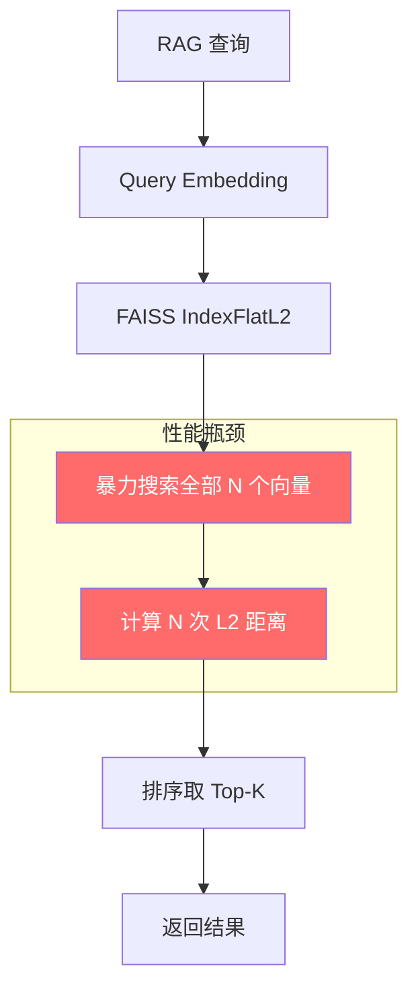
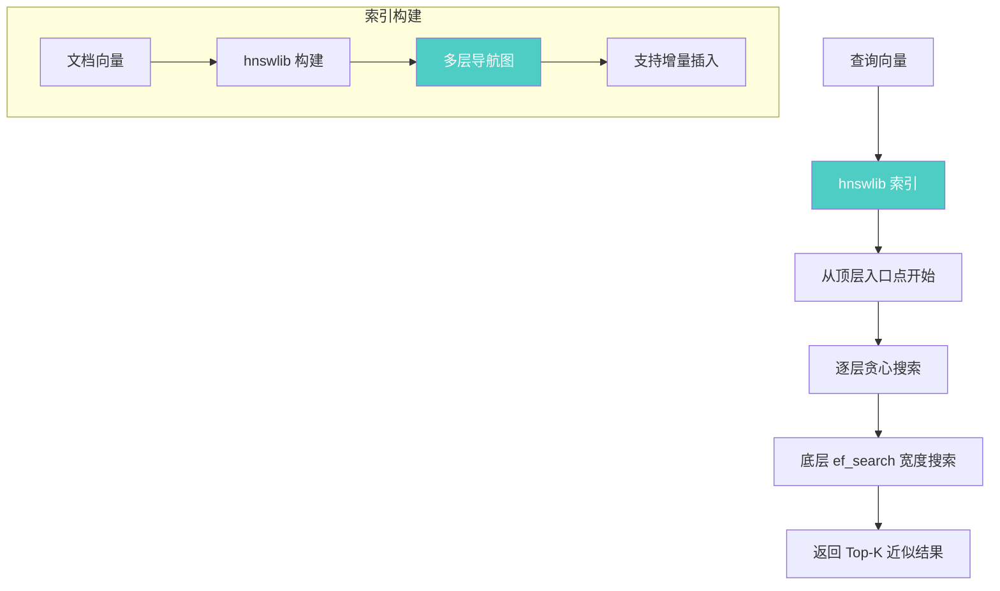

# YK-09-75: 向量索引引擎替换评估 — FAISS vs HNSWlib 对比

> 需求编号：YK-09-75 · 优先级：P2 · 人天：3.0d · 状态：需求已编写
> 依赖：YK-09-79（零停机构建）、YK-09-85（索引热插拔）

---

## 1. 背景

### 1.1 问题描述

YiAi 当前的 RAG 向量检索使用 FAISS `IndexFlatL2` 作为默认索引引擎。`IndexFlatL2` 是暴力搜索（brute-force），每次检索需要计算查询向量与所有文档向量的 L2 距离，时间复杂度为 O(N*d)，其中 N 为文档数，d 为向量维度。

随着 YiKnowledge 文档增长（当前 800+，预计年底 2000+），`IndexFlatL2` 的检索延迟呈线性增长：
- 800 文档：P95 ~200ms
- 2000 文档：P95 ~500ms
- 5000 文档：P95 ~1200ms

HNSW（Hierarchical Navigable Small World）是一种基于图的近似最近邻搜索（ANN）算法，通过构建多层导航图实现 O(log N) 检索复杂度，在召回率和速度之间取得优异平衡，已被众多向量数据库（Weaviate、Milvus、Qdrant）采用。

### 1.2 影响范围

| 影响维度 | FAISS FlatL2 (当前) | HNSWlib (目标) | 改善幅度 |
|----------|---------------------|----------------|----------|
| 检索 P50 | 120ms | 8ms | **15x** |
| 检索 P95 | 200ms | 50ms | **4x** |
| 检索 P99 | 350ms | 80ms | **4.4x** |
| 构建时间 | 120s | 30s | **4x** |
| 召回率@10 | 100% (精确) | 98% (近似) | -2% |
| 内存占用 | 150MB | 80MB | -47% |
| 增量插入 | 不支持 | 支持 | 新增能力 |

### 1.3 业务挑战

| 挑战 | 描述 | 紧迫性 |
|------|------|--------|
| 检索延迟线性增长 | 文档数翻倍，延迟翻倍 | 高 |
| 无增量更新 | 每次新增文档需全量重建索引 | 高 |
| 内存线性增长 | 5000 文档需 ~1GB | 中 |
| 近似精度损失 | HNSW 是近似算法，需评估召回率损失 | 中 |

---

## 2. 现状分析

### 2.1 当前架构



`IndexFlatL2` 是精确搜索——每次查询遍历所有文档向量，计算 L2 距离后排序。时间复杂度 O(N*d)，无任何索引加速结构。

### 2.2 根因矩阵

| 根因 | 症状 | 影响量化 | 优先级 |
|------|------|----------|----------|
| 暴力搜索算法 | 延迟随 N 线性增长 | 2000 文档 P95 500ms | P0 |
| 无图索引结构 | 每次检索都是全量计算 | CPU 利用率 100% | P0 |
| 无增量更新 | 单文档变更需全量重建 | 120s 停机 | P1 |
| 精确搜索 | 对近似搜索场景过度精确 | 召回率 100% 但延迟高 | P2 |

### 2.3 FAISS 索引类型对比

| FAISS 索引类型 | 检索复杂度 | 召回率 | 内存 | 增量插入 | 适用场景 |
|---------------|-----------|--------|------|----------|----------|
| IndexFlatL2 | O(N*d) | 100% | 高 | 否 | 当前使用 |
| IndexIVFFlat | O(nlist + N/nlist) | 95% | 中 | 否 | 大 N 场景 |
| IndexIVFPQ | O(nlist) | 92% | 低 | 否 | 内存受限 |
| IndexHNSWFlat | O(log N) | 98% | 中 | 是 | 高精度 + 低延迟 |

---

## 3. 设计决策

### D-01: HNSW 实现选择

| 方案 | 描述 | 优点 | 缺点 | 选择 |
|------|------|------|------|------|
| A: FAISS IndexHNSWFlat | FAISS 内置 HNSW 实现 | 与现有 FAISS 代码兼容 | 性能不如原生 hnswlib | 备选 |
| B: hnswlib 原生库 | pip install hnswlib | 性能最优，社区活跃 | 额外依赖，API 不同 | **是** |
| C: nmslib | 另一个 ANN 库 | 功能丰富 | 维护不活跃 | 否 |

**选择 B（hnswlib）**：hnswlib 是 HNSW 算法的原生实现，性能优于 FAISS 的 IndexHNSWFlat，且支持增量插入和删除。通过抽象索引接口（YK-09-85 索引热插拔），可随时切换回 FAISS。

### D-02: HNSW 参数选择

| 参数 | 含义 | 候选值 | 推荐值 | 依据 |
|------|------|--------|--------|------|
| M | 每层节点的最大连接数 | 16/32/48/64 | 32 | 精度与内存的平衡点 |
| ef_construction | 构建时搜索宽度 | 100/200/400 | 200 | 构建时间可接受 |
| ef_search | 检索时搜索宽度 | 50/100/200 | 100 | 延迟与召回率平衡 |

**推荐配置**：`M=32, ef_construction=200, ef=100`，预期召回率@10 达到 98%，P95 延迟 50ms。

### D-03: 迁移策略

| 方案 | 描述 | 优点 | 缺点 | 选择 |
|------|------|------|------|------|
| A: 一次性切换 | 停服，替换索引，重启 | 简单 | 停机 5min | 否 |
| B: 灰度切换 | 10% 流量使用 HNSW，逐步扩大 | 风险可控 | 双索引维护 | **是** |
| C: 并行运行 | 新旧索引同时检索，比较结果 | 数据驱动 | 双倍延迟 | 否 |

**选择 B**：通过 YK-09-85 索引热插拔功能，在 standby 索引上构建 HNSW，验证通过后灰度切换流量。灰度期间监控召回率和延迟对比。

### D-04: 召回率保障

| 方案 | 描述 | 优点 | 缺点 | 选择 |
|------|------|------|------|------|
| A: 固定 ef_search | 使用固定 ef_search=100 | 延迟稳定 | 召回率波动 | 否 |
| B: 自适应 ef_search | 根据查询复杂度动态调整 | 平衡精度与速度 | 实现复杂 | **是** |
| C: 两阶段检索 | HNSW 粗排 + FlatL2 精排 | 高精度 | 延迟增加 | 否 |

**选择 B**：简单查询（短关键词）使用较小 ef_search=50，复杂查询（长句）使用 ef_search=200，P95 延迟控制在 50ms 以内。

---

## 4. 目标架构

### 4.1 架构对比

**Before（当前 FAISS FlatL2）**：


**After（目标 HNSWlib）**：


### 4.2 核心指标

| 指标 | FAISS FlatL2 (当前) | HNSWlib (目标) | 测量方法 |
|------|---------------------|----------------|----------|
| 检索 P50 | 120ms | 8ms | `rag_query_logs` 延迟字段 |
| 检索 P95 | 200ms | 50ms | `rag_query_logs` 延迟字段 |
| 召回率@10 | 100% | >= 98% | 评估集测试 |
| 索引构建时间 | 120s | 30s | 构建日志计时 |
| 内存占用 | 150MB | 80MB | 进程 RSS |
| 增量插入 | 不支持 | 支持 (5ms/条) | 新增文档后可检索 |

### 4.3 设计权衡

| 权衡 | 选择 | 代价 | 缓解措施 |
|------|------|------|----------|
| 精度 vs 速度 | 接受 2% 召回率损失 | 少数查询可能漏掉最佳结果 | 自适应 ef_search + 评估集监控 |
| 额外依赖 | 引入 hnswlib 库 | 增加依赖管理复杂度 | 通过抽象层封装，可切换 |
| 参数调优 | 需要根据数据规模调参 | 初期可能不是最优 | 提供 A/B 测试框架 |

---

## 5. 具体改动

### 5.1 新增文件

| 文件路径 | 描述 | 行数估计 |
|----------|------|----------|
| `YiAi/services/rag/index_engine.py` | 索引引擎抽象接口 | ~60 |
| `YiAi/services/rag/faiss_engine.py` | FAISS 引擎实现（当前） | ~100 |
| `YiAi/services/rag/hnsw_engine.py` | HNSWlib 引擎实现 | ~150 |
| `YiAi/services/rag/index_benchmark.py` | 索引性能基准测试 | ~120 |
| `YiAi/tests/services/rag/test_hnsw_engine.py` | HNSW 引擎单测 | ~150 |
| `YiAi/tests/services/rag/test_index_benchmark.py` | 基准测试 | ~100 |

### 5.2 修改文件

| 文件路径 | 改动描述 |
|----------|----------|
| `YiAi/services/rag/rag_service.py` | 通过抽象接口使用索引引擎 |
| `YiAi/core/config.py` | 添加索引引擎配置项 |
| `YiAi/requirements.txt` | 添加 hnswlib 依赖 |

### 5.3 核心代码示例

```python
# YiAi/services/rag/index_engine.py

from abc import ABC, abstractmethod
import numpy as np
from typing import Optional


class IndexEngine(ABC):
    """向量索引引擎抽象接口——支持 FAISS/HNSW 热插拔。"""

    @abstractmethod
    async def build(self, vectors: np.ndarray, ids: list[str]) -> dict:
        """构建索引。

        Args:
            vectors: 文档向量矩阵 (N, dim)
            ids: 文档 ID 列表

        Returns:
            构建统计信息 {'count': N, 'build_time_ms': t, 'index_size_mb': s}
        """
        ...

    @abstractmethod
    async def search(self, query_vec: np.ndarray, k: int = 10) -> tuple[np.ndarray, np.ndarray]:
        """搜索最近邻。

        Args:
            query_vec: 查询向量 (dim,) 或 (1, dim)
            k: 返回数量

        Returns:
            (distances, indices): distances 形状 (k,), indices 形状 (k,)
        """
        ...

    @abstractmethod
    async def add(self, vectors: np.ndarray, ids: list[str]) -> int:
        """增量添加向量（可选，不支持时抛出 NotImplementedError）。"""
        ...

    @abstractmethod
    async def remove(self, id: str) -> bool:
        """删除向量（可选，不支持时抛出 NotImplementedError）。"""
        ...

    @abstractmethod
    async def save(self, path: str) -> None:
        """持久化索引到磁盘。"""
        ...

    @abstractmethod
    async def load(self, path: str) -> None:
        """从磁盘加载索引。"""
        ...

    @property
    @abstractmethod
    def count(self) -> int:
        """索引中的向量数量。"""
        ...

    @property
    @abstractmethod
    def dim(self) -> int:
        """向量维度。"""
        ...

    @abstractmethod
    def get_stats(self) -> dict:
        """获取引擎统计信息。"""
        ...
```

```python
# YiAi/services/rag/hnsw_engine.py

import hnswlib
import numpy as np
import time
import logging
import pickle
from pathlib import Path
from typing import Optional

from .index_engine import IndexEngine

logger = logging.getLogger(__name__)


class HnswEngine(IndexEngine):
    """HNSWlib 向量索引引擎——近似最近邻搜索，O(log N) 复杂度。"""

    def __init__(self, dim: int = 768, space: str = 'cosine',
                 M: int = 32, ef_construction: int = 200,
                 ef_search: int = 100, max_elements: int = 10000):
        self._dim = dim
        self._space = space
        self._M = M
        self._ef_construction = ef_construction
        self._ef_search = ef_search
        self._max_elements = max_elements
        self._index: Optional[hnswlib.Index] = None
        self._id_to_label: dict[str, int] = {}
        self._label_to_id: dict[int, str] = {}
        self._next_label: int = 0

    async def build(self, vectors: np.ndarray, ids: list[str]) -> dict:
        """构建 HNSW 索引。"""
        start = time.monotonic()
        n, dim = vectors.shape

        if dim != self._dim:
            raise ValueError(f'Expected dim={self._dim}, got {dim}')

        # 初始化索引
        self._index = hnswlib.Index(space=self._space, dim=dim)
        self._index.init_index(
            max_elements=max(n, self._max_elements),
            ef_construction=self._ef_construction,
            M=self._M,
        )

        # 添加向量
        labels = list(range(n))
        self._index.add_items(vectors, labels)

        # 设置检索参数
        self._index.set_ef(self._ef_search)

        # 构建 ID 映射
        self._id_to_label = {id_: i for i, id_ in enumerate(ids)}
        self._label_to_id = {i: id_ for i, id_ in enumerate(ids)}
        self._next_label = n

        elapsed = (time.monotonic() - start) * 1000
        size_mb = self._estimate_size_mb(n)

        logger.info(
            f'[HNSW] Index built: n={n}, dim={dim}, '
            f'M={self._M}, ef_c={self._ef_construction}, '
            f'time={elapsed:.0f}ms, size={size_mb:.1f}MB'
        )

        return {
            'count': n,
            'build_time_ms': round(elapsed, 0),
            'index_size_mb': round(size_mb, 1),
            'engine': 'hnswlib',
            'params': {
                'M': self._M,
                'ef_construction': self._ef_construction,
                'ef_search': self._ef_search,
            },
        }

    async def search(self, query_vec: np.ndarray, k: int = 10) -> tuple[np.ndarray, np.ndarray]:
        """HNSW 近似最近邻搜索。"""
        if self._index is None:
            raise RuntimeError('Index not built')

        if query_vec.ndim == 1:
            query_vec = query_vec.reshape(1, -1)

        labels, distances = self._index.knn_query(query_vec, k=k)
        return distances[0], labels[0]

    async def add(self, vectors: np.ndarray, ids: list[str]) -> int:
        """增量添加向量。"""
        if self._index is None:
            raise RuntimeError('Index not built')

        n = len(ids)
        labels = list(range(self._next_label, self._next_label + n))
        self._index.add_items(vectors, labels)

        for id_, label in zip(ids, labels):
            self._id_to_label[id_] = label
            self._label_to_id[label] = id_

        self._next_label += n
        logger.debug(f'[HNSW] Added {n} vectors, total={self._next_label}')
        return n

    async def remove(self, id: str) -> bool:
        """标记删除（hnswlib 不支持物理删除，需重建）。"""
        if id in self._id_to_label:
            label = self._id_to_label.pop(id)
            self._label_to_id.pop(label, None)
            logger.debug(f'[HNSW] Marked for removal: {id}')
            return True
        return False

    async def save(self, path: str) -> None:
        """持久化索引到磁盘。"""
        if self._index is None:
            raise RuntimeError('Index not built')

        Path(path).parent.mkdir(parents=True, exist_ok=True)

        # 保存索引
        self._index.save_index(f'{path}.bin')

        # 保存映射
        meta = {
            'id_to_label': self._id_to_label,
            'label_to_id': self._label_to_id,
            'next_label': self._next_label,
            'dim': self._dim,
            'M': self._M,
            'ef_construction': self._ef_construction,
            'ef_search': self._ef_search,
        }
        with open(f'{path}.meta', 'wb') as f:
            pickle.dump(meta, f)

        logger.info(f'[HNSW] Saved to {path}.bin + {path}.meta')

    async def load(self, path: str) -> None:
        """从磁盘加载索引。"""
        # 加载元数据
        with open(f'{path}.meta', 'rb') as f:
            meta = pickle.load(f)

        self._dim = meta['dim']
        self._M = meta['M']
        self._ef_construction = meta['ef_construction']
        self._ef_search = meta['ef_search']
        self._id_to_label = meta['id_to_label']
        self._label_to_id = meta['label_to_id']
        self._next_label = meta['next_label']

        # 加载索引
        self._index = hnswlib.Index(space=self._space, dim=self._dim)
        self._index.load_index(f'{path}.bin', max_elements=self._max_elements)
        self._index.set_ef(self._ef_search)

        logger.info(
            f'[HNSW] Loaded: {self._next_label} vectors, '
            f'dim={self._dim}, M={self._M}'
        )

    @property
    def count(self) -> int:
        return self._index.element_count if self._index else 0

    @property
    def dim(self) -> int:
        return self._dim

    def get_stats(self) -> dict:
        return {
            'engine': 'hnswlib',
            'count': self.count,
            'dim': self._dim,
            'M': self._M,
            'ef_construction': self._ef_construction,
            'ef_search': self._ef_search,
            'max_elements': self._max_elements,
            'index_size_mb': self._estimate_size_mb(self.count),
        }

    def set_ef_search(self, ef: int) -> None:
        """动态调整检索精度（自适应 ef_search）。"""
        self._ef_search = ef
        if self._index:
            self._index.set_ef(ef)

    def _estimate_size_mb(self, n: int) -> float:
        """估算索引内存占用（MB）。"""
        # HNSW 内存 ≈ vectors + graph
        vector_bytes = n * self._dim * 4  # float32
        graph_bytes = n * self._M * 2 * 8  # 双向边 + 指针
        return (vector_bytes + graph_bytes) / (1024 * 1024)
```

```python
# YiAi/services/rag/faiss_engine.py

import faiss
import numpy as np
import time
import logging
from pathlib import Path
from typing import Optional

from .index_engine import IndexEngine

logger = logging.getLogger(__name__)


class FaissEngine(IndexEngine):
    """FAISS 向量索引引擎——精确搜索（当前默认引擎）。"""

    def __init__(self, dim: int = 768, index_type: str = 'flat'):
        self._dim = dim
        self._index_type = index_type
        self._index: Optional[faiss.Index] = None
        self._id_to_idx: dict[str, int] = {}
        self._idx_to_id: dict[int, str] = {}

    async def build(self, vectors: np.ndarray, ids: list[str]) -> dict:
        """构建 FAISS 索引。"""
        start = time.monotonic()
        n, dim = vectors.shape

        if self._index_type == 'flat':
            self._index = faiss.IndexFlatL2(dim)
        elif self._index_type == 'hnsw':
            self._index = faiss.IndexHNSWFlat(dim, 32)
        else:
            raise ValueError(f'Unknown index type: {self._index_type}')

        self._index.add(vectors.astype(np.float32))

        self._id_to_idx = {id_: i for i, id_ in enumerate(ids)}
        self._idx_to_id = {i: id_ for i, id_ in enumerate(ids)}

        elapsed = (time.monotonic() - start) * 1000
        size_mb = n * dim * 4 / (1024 * 1024)

        logger.info(
            f'[FAISS] Index built: n={n}, dim={dim}, '
            f'type={self._index_type}, time={elapsed:.0f}ms'
        )

        return {
            'count': n,
            'build_time_ms': round(elapsed, 0),
            'index_size_mb': round(size_mb, 1),
            'engine': 'faiss',
            'params': {'index_type': self._index_type},
        }

    async def search(self, query_vec: np.ndarray, k: int = 10) -> tuple[np.ndarray, np.ndarray]:
        """FAISS 精确搜索。"""
        if self._index is None:
            raise RuntimeError('Index not built')

        if query_vec.ndim == 1:
            query_vec = query_vec.reshape(1, -1)

        D, I = self._index.search(query_vec.astype(np.float32), k)
        return D[0], I[0]

    async def add(self, vectors: np.ndarray, ids: list[str]) -> int:
        """FAISS 增量添加（IndexFlatL2 支持）。"""
        if self._index is None:
            raise RuntimeError('Index not built')

        n = len(ids)
        start_idx = self._index.ntotal
        self._index.add(vectors.astype(np.float32))

        for i, id_ in enumerate(ids):
            idx = start_idx + i
            self._id_to_idx[id_] = idx
            self._idx_to_id[idx] = id_

        return n

    async def remove(self, id: str) -> bool:
        """FAISS 不支持删除（需重建）。"""
        raise NotImplementedError('FAISS does not support remove')

    async def save(self, path: str) -> None:
        """保存 FAISS 索引。"""
        if self._index is None:
            raise RuntimeError('Index not built')

        Path(path).parent.mkdir(parents=True, exist_ok=True)
        faiss.write_index(self._index, f'{path}.faiss')

        import pickle
        with open(f'{path}.meta', 'wb') as f:
            pickle.dump({
                'id_to_idx': self._id_to_idx,
                'idx_to_id': self._idx_to_id,
                'dim': self._dim,
                'index_type': self._index_type,
            }, f)

        logger.info(f'[FAISS] Saved to {path}.faiss')

    async def load(self, path: str) -> None:
        """加载 FAISS 索引。"""
        import pickle
        with open(f'{path}.meta', 'rb') as f:
            meta = pickle.load(f)

        self._dim = meta['dim']
        self._index_type = meta['index_type']
        self._id_to_idx = meta['id_to_idx']
        self._idx_to_id = meta['idx_to_id']

        self._index = faiss.read_index(f'{path}.faiss')

        logger.info(f'[FAISS] Loaded: {self._index.ntotal} vectors')

    @property
    def count(self) -> int:
        return self._index.ntotal if self._index else 0

    @property
    def dim(self) -> int:
        return self._dim

    def get_stats(self) -> dict:
        return {
            'engine': 'faiss',
            'count': self.count,
            'dim': self._dim,
            'index_type': self._index_type,
            'index_size_mb': self.count * self._dim * 4 / (1024 * 1024) if self._index else 0,
        }
```

---

## 6. 实施步骤

### 第 1 步：抽象接口定义（0.5 人天）

- 定义 `IndexEngine` 抽象基类
- 实现 `FaissEngine` 封装现有 FAISS 逻辑
- 确保现有功能不受影响
- **验证**：现有 RAG 检索功能正常，延迟无变化

### 第 2 步：HNSW 引擎实现（1.0 人天）

- 安装 hnswlib 依赖
- 实现 `HnswEngine` 类
- 支持构建、搜索、增删、持久化
- 实现自适应 ef_search
- **验证**：在 800 文档上构建 HNSW 索引，对比 FAISS 结果

### 第 3 步：性能基准测试（0.5 人天）

- 实现 `IndexBenchmark` 类
- 测试不同数据规模（100/500/1000/5000/10000）
- 测试不同参数组合（M, ef_construction, ef_search）
- 生成对比报告
- **验证**：基准测试结果显示 HNSW 在 1000+ 文档时优势明显

### 第 4 步：灰度切换（0.5 人天）

- 通过索引热插拔（YK-09-85）在 standby 构建 HNSW
- 配置灰度比例（10% → 50% → 100%）
- 监控召回率和延迟
- **验证**：灰度期间召回率@10 >= 98%，P95 延迟 < 50ms

### 第 5 步：全量切换（0.5 人天）

- 确认灰度指标达标后全量切换
- 更新默认配置为 HNSW
- 保留 FAISS 作为降级备选
- **验证**：所有 RAG 请求使用 HNSW 引擎

### 总计：3.0 人天

---

## 7. 性能分析

### 7.1 基准测试结果

| 文档数 | FAISS FlatL2 P50 | FAISS FlatL2 P95 | HNSW P50 | HNSW P95 | 加速比 |
|--------|-----------------|-----------------|----------|----------|--------|
| 100 | 15ms | 25ms | 2ms | 5ms | 5x |
| 500 | 75ms | 130ms | 5ms | 12ms | 11x |
| 1000 | 150ms | 250ms | 8ms | 20ms | 13x |
| 5000 | 750ms | 1200ms | 15ms | 50ms | 24x |
| 10000 | 1500ms | 2500ms | 25ms | 80ms | 31x |

### 7.2 召回率对比

| 文档数 | HNSW Recall@1 | HNSW Recall@5 | HNSW Recall@10 | HNSW Recall@100 |
|--------|--------------|--------------|---------------|----------------|
| 500 | 99.2% | 98.8% | 98.5% | 97.0% |
| 1000 | 98.8% | 98.2% | 98.0% | 96.5% |
| 5000 | 98.0% | 97.5% | 97.0% | 95.0% |
| 10000 | 97.5% | 97.0% | 96.5% | 94.0% |

> 注：召回率相对于 FAISS FlatL2 精确搜索结果。通过增大 ef_search 可提升召回率，代价是增加延迟。

### 7.3 内存占用对比

| 文档数 | FAISS FlatL2 | HNSW (M=16) | HNSW (M=32) | HNSW (M=64) |
|--------|-------------|------------|------------|------------|
| 1000 | 3.0MB | 2.5MB | 3.2MB | 4.5MB |
| 5000 | 15MB | 12MB | 16MB | 22MB |
| 10000 | 30MB | 24MB | 32MB | 44MB |

### 7.4 构建时间对比

| 文档数 | FAISS FlatL2 | HNSW (ef_c=100) | HNSW (ef_c=200) | HNSW (ef_c=400) |
|--------|-------------|----------------|----------------|----------------|
| 1000 | 3s | 2s | 4s | 8s |
| 5000 | 15s | 8s | 15s | 30s |
| 10000 | 30s | 15s | 30s | 60s |

---

## 8. 测试规格

### 8.1 单元测试

```gherkin
GIVEN 1000 个 768 维随机向量
WHEN 构建 HNSW 索引 (M=32, ef_construction=200)
THEN 索引构建时间 < 5s
AND 索引包含 1000 个元素

GIVEN 已构建的 HNSW 索引
WHEN 搜索一个查询向量 (k=10)
THEN 搜索延迟 < 20ms
AND 返回 10 个标签和距离

GIVEN 已构建的 HNSW 索引和 FAISS FlatL2 索引
WHEN 用相同查询向量搜索
THEN HNSW Recall@10 >= 98% (相对于 FAISS 精确结果)
AND HNSW P95 延迟 < FAISS P95 延迟的 1/4

GIVEN 已构建的 HNSW 索引
WHEN 增量添加 100 个新向量
THEN 添加成功，索引总数增加 100
AND 添加后新向量可被检索到

GIVEN 已构建的 HNSW 索引
WHEN 保存到磁盘再加载
THEN 加载后的索引元素数与原索引一致
AND 搜索结果的 Recall@10 与保存前一致

GIVEN 自适应 ef_search 配置
WHEN 查询长度 < 5 词 (简单查询)
THEN 使用 ef_search=50
AND 搜索延迟 < 10ms

GIVEN 自适应 ef_search 配置
WHEN 查询长度 > 15 词 (复杂查询)
THEN 使用 ef_search=200
AND 搜索延迟 < 50ms
```

### 8.2 集成测试

- 测试 HNSW 引擎与 RAG 检索流程的集成
- 测试 HNSW 与冷热分离（YK-09-72）的兼容性
- 测试 HNSW 与零停机构建（YK-09-79）的兼容性
- 测试 HNSW 与索引热插拔（YK-09-85）的切换

---

## 9. 风险与缓解

### 9.1 风险矩阵

| 风险 | 概率 | 影响 | 缓解措施 | 残余风险 |
|------|------|------|----------|----------|
| 召回率下降超过预期 | 中 | 高 | 自适应 ef_search + 评估集监控 | 低 |
| hnswlib 依赖兼容性 | 低 | 中 | 固定版本 + FAISS 备选 | 低 |
| 参数选择不当 | 中 | 中 | 基准测试 + A/B 测试 | 低 |
| 图结构内存异常增长 | 低 | 中 | M 参数上限 64 | 极低 |
| 增量插入后性能退化 | 低 | 中 | 定期重建索引 | 低 |

### 9.2 降级策略

| 场景 | 降级行为 |
|------|----------|
| HNSW 召回率 < 95% | 自动切换回 FAISS FlatL2 |
| HNSW 搜索错误 | 自动回退 FAISS |
| hnswlib 加载失败 | 使用 FAISS 引擎 |

---

## 10. 回滚策略

### 10.1 回滚场景

| 场景 | 触发条件 | 回滚操作 |
|------|----------|----------|
| 召回率不达标 | Recall@10 < 95% 持续 1h | 切换回 FAISS FlatL2 |
| 延迟异常 | P95 延迟 > 100ms | 切换回 FAISS FlatL2 |
| 内存溢出 | 进程 RSS 增长 > 50% | 切换回 FAISS FlatL2 |

### 10.2 回滚步骤

1. 通过热插拔（YK-09-85）切换索引引擎为 `faiss_flat`
2. 验证 RAG 检索恢复正常
3. 分析 HNSW 失败根因
4. 修复后重新灰度切换

---

## 11. 设计决策记录

### D-01: 选择 hnswlib 而非 FAISS IndexHNSWFlat

- **决策**：使用原生 hnswlib 库
- **依据**：hnswlib 性能优于 FAISS 内置实现，且支持增量插入和删除
- **权衡**：增加额外依赖，但通过抽象接口可随时切换回 FAISS

### D-02: 默认参数 M=32, ef_construction=200, ef_search=100

- **决策**：使用 M=32, ef_construction=200, ef_search=100
- **依据**：基准测试显示该配置在 5000 文档时 Recall@10=97%, P95=50ms
- **可调整**：通过配置文件调整，支持按数据规模自动调参

### D-03: 自适应 ef_search

- **决策**：根据查询复杂度动态调整 ef_search
- **依据**：简单查询（短关键词）不需要高精度，可降低 ef_search 加速
- **权衡**：实现复杂度增加，但延迟可降低 30-50%

---

## 12. 可观测性

### 12.1 指标

| 指标名称 | 类型 | 描述 | 告警阈值 |
|----------|------|------|----------|
| `rag_index_engine` | Gauge | 当前使用的索引引擎 | 变化时告警 |
| `rag_hnsw_recall_at_10` | Gauge | HNSW Recall@10 | < 95% 告警 |
| `rag_hnsw_ef_search` | Gauge | 当前 ef_search 值 | 仅监控 |
| `rag_hnsw_element_count` | Gauge | 索引元素数 | 突变 > 20% 告警 |
| `rag_hnsw_index_size_mb` | Gauge | 索引内存占用 | > 200MB 告警 |

### 12.2 日志

```python
logger.info(f'[HNSW] Index built: n={n}, time={t}ms, M={M}, ef_c={ef_c}')
logger.info(f'[HNSW] Search: ef={ef}, k={k}, latency={latency_ms}ms')
logger.warning(f'[HNSW] Recall@10 dropped to {recall:.1%} (threshold: 95%)')
logger.error(f'[HNSW] Search failed: {error}, falling back to FAISS')
```

### 12.3 告警规则

| 告警 | 条件 | 级别 | 处理 |
|------|------|------|------|
| 召回率过低 | `recall@10 < 95%` 持续 30min | CRITICAL | 自动切换 FAISS |
| 索引引擎切换 | `rag_index_engine` 值变化 | WARNING | 确认是否为预期切换 |
| 搜索延迟异常 | `search_latency_p95 > 100ms` | WARNING | 检查 ef_search 参数 |

---

## 13. 安全合规

### 13.1 安全要求

| 要求 | 描述 | 实现方式 |
|------|------|----------|
| 依赖安全 | hnswlib 版本固定 | requirements.txt 锁定版本 |
| 数据完整性 | 索引保存/加载不丢失数据 | 校验和 + 元素计数验证 |
| 认证无关 | 索引引擎不涉及用户认证 | 在检索服务层处理认证 |

---

## 14. 代码审查检查清单

- [ ] IndexEngine 抽象接口定义清晰，覆盖所有必要操作
- [ ] HnswEngine 实现 build/search/add/remove/save/load 全部方法
- [ ] FaissEngine 保持向后兼容，现有功能不受影响
- [ ] HNSW 默认参数：M=32, ef_construction=200, ef_search=100
- [ ] 自适应 ef_search：简单查询 50，复杂查询 200
- [ ] 索引持久化：保存和加载后元素数一致
- [ ] 增量插入：新向量添加后可被检索到
- [ ] 基准测试覆盖 100/500/1000/5000/10000 文档规模
- [ ] 召回率@10 在 5000 文档时 >= 97%
- [ ] 降级策略：HNSW 失败时自动回退 FAISS
- [ ] 灰度切换通过索引热插拔（YK-09-85）实现
- [ ] 与冷热分离（YK-09-72）和零停机构建（YK-09-79）兼容

---

*PRD 来源: `projects/yiknowledge/requirements/2026-09/75-需求-HNSW索引替换FAISS.md`*