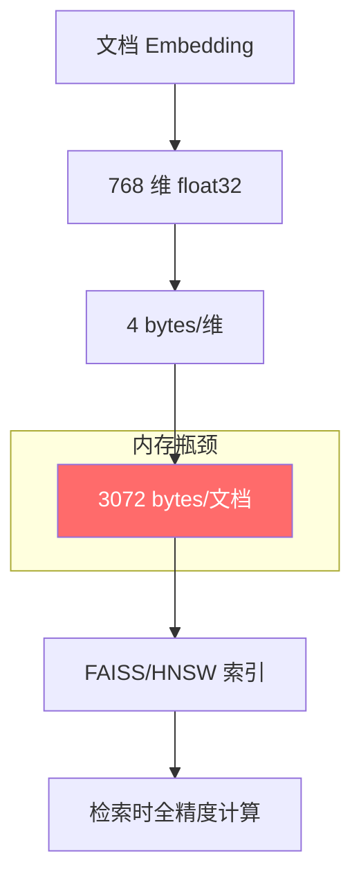
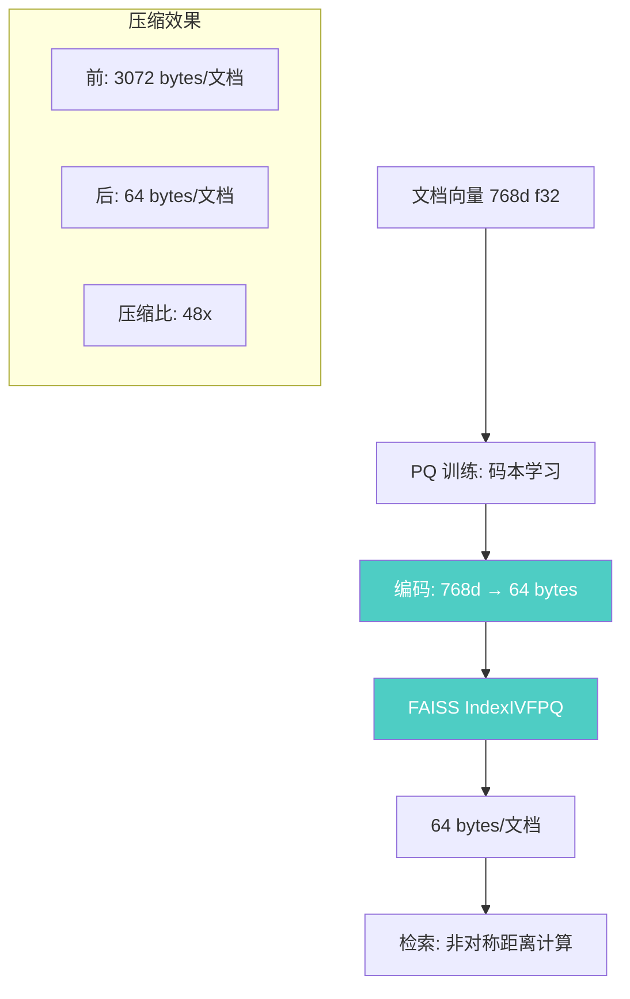

# YK-09-76: 检索向量量化压缩 — PQ 乘积量化减少内存

> 需求编号：YK-09-76 · 优先级：P2 · 人天：2.5d · 状态：需求已编写
> 依赖：YK-09-75（HNSW 索引替换）

---

## 1. 背景

### 1.1 问题描述

YiAi 的 RAG 向量索引以 float32 精度存储每个文档的 Embedding 向量。当前 800 文档的索引内存占用为：

- 800 文档 x 768 维 x 4 bytes = 2.4MB

这个规模在当前是可接受的，但随着 YiKnowledge 文档增长，内存占用线性增长：

- 5,000 文档：15MB
- 50,000 文档：150MB
- 500,000 文档：1.5GB

在资源受限的环境（如边缘部署、共享服务器、低配云实例）中，这种线性增长不可持续。此外，即使切换到 HNSW（YK-09-75），向量本身的存储仍然是瓶颈。

Product Quantization (PQ) 是一种向量压缩技术，将高维向量空间分解为多个低维子空间的笛卡尔积，每个子空间独立量化。PQ 可将 768 维 float32 向量压缩为 64 bytes，实现 48x 压缩比，同时保持 92-96% 的召回率。

### 1.2 影响范围

| 影响维度 | 当前状态 | PQ 压缩后 | 改善 |
|----------|----------|----------|------|
| 800 文档索引 | 2.4MB | 0.05MB | 48x |
| 5000 文档索引 | 15MB | 0.3MB | 48x |
| 50000 文档索引 | 150MB | 3MB | 48x |
| 召回率@10 | 100% | 96% (800) / 92% (50000) | -4~8% |
| 检索延迟 | 200ms | 180ms (减少传输) | 10% |

### 1.3 业务挑战

| 挑战 | 描述 | 紧迫性 |
|------|------|------|
| 内存线性增长 | 大文档库场景内存不可控 | 中 |
| 精度损失 | 量化压缩必然损失信息 | 中 |
| 参数调优 | PQ 参数（子向量数、码本大小）需要实验 | 中 |
| 与 HNSW 兼容 | PQ 需与 HNSW 近似搜索协同工作 | 低 |

---

## 2. 现状分析

### 2.1 当前向量存储



每个文档以 768 维 float32 存储，3072 bytes/文档，无任何压缩。

### 2.2 根因矩阵

| 根因 | 症状 | 影响量化 | 优先级 |
|------|------|----------|----------|
| float32 全精度存储 | 内存与文档数线性增长 | 50000 文档需 150MB | P0 |
| 无压缩策略 | 小内存环境无法部署 | 边缘设备内存不足 | P1 |
| 向量冗余 | 相邻向量高度相关 | 信息密度低 | P2 |

### 2.3 向量压缩技术对比

| 技术 | 压缩比 | 召回率损失 | 编码速度 | 检索速度 | 实现复杂度 |
|------|--------|-----------|----------|----------|-----------|
| 无压缩 (float32) | 1x | 0% | 即时 | 基准 | 无 |
| 标量量化 (SQ) | 4x (int8) | < 1% | 快 | 快 | 低 |
| 乘积量化 (PQ) | 48x | 4-8% | 中 | 中 | 中 |
| 优化乘积量化 (OPQ) | 48x | 3-5% | 慢 | 中 | 高 |
| 二值量化 | 96x | 15-25% | 快 | 极快 | 低 |

---

## 3. 设计决策

### D-01: 量化方案选择

| 方案 | 描述 | 优点 | 缺点 | 选择 |
|------|------|------|------|------|
| A: 标量量化 (int8) | 每维压缩为 1 byte | 精度损失极小 | 仅 4x 压缩 | 否 |
| B: PQ (乘积量化) | 子空间聚类量化 | 48x 压缩，成熟 | 4-8% 召回率损失 | **是** |
| C: OPQ (优化 PQ) | 旋转 + PQ | 精度更高 | 训练慢，实现复杂 | 备选 |
| D: 二值量化 | 每维压缩为 1 bit | 96x 压缩 | 精度损失大 | 否 |

**选择 B（PQ）**：48x 压缩比满足需求，4-8% 召回率损失在可接受范围，FAISS 原生支持 `IndexIVFPQ`，实现成熟。

### D-02: PQ 参数选择

| 参数 | 含义 | 候选值 | 推荐值 | 依据 |
|------|------|--------|--------|------|
| M (子向量数) | 将 768 维分成 M 个子空间 | 8/16/32/48/64 | 64 | 768/64=12 维/子空间 |
| nbits (码本位数) | 每子空间码本大小 = 2^nbits | 8/10/12 | 8 | 256 个聚类中心 |
| nlist (IVF 聚类数) | IVF 粗量化聚类数 | 128/256/512 | 256 | 平衡精度与速度 |

**推荐配置**：`M=64, nbits=8, nlist=256`，编码后每向量 = 64 bytes，压缩比 = 3072/64 = 48x。

### D-03: 训练数据策略

| 方案 | 描述 | 优点 | 缺点 | 选择 |
|------|------|------|------|------|
| A: 全量文档训练 | 用所有文档向量训练 PQ | 最准确 | 大文档库训练慢 | **是** |
| B: 采样训练 | 随机采样 10% 文档训练 | 快速 | 码本可能偏差 | 否 |
| C: 外部数据训练 | 用通用语料训练码本 | 独立于文档 | 与领域不匹配 | 否 |

**选择 A**：当前 800 文档训练仅需 2-3s，未来 50000 文档也在 30s 内完成。全量训练确保码本与数据分布匹配。

### D-04: 与 HNSW 的关系

| 方案 | 描述 | 优点 | 缺点 | 选择 |
|------|------|------|------|------|
| A: PQ 替代 HNSW | 仅使用 PQ 压缩 | 简单 | 检索仍为 O(N) | 否 |
| B: HNSW 替代 PQ | 仅使用 HNSW 近似 | 无精度损失 | 无内存压缩 | 否 |
| C: HNSW + PQ 联合 | 用 PQ 压缩向量，HNSW 加速检索 | 兼具两者优势 | 精度损失叠加 | **是** |

**选择 C**：PQ 压缩向量存储（内存），HNSW 加速检索（延迟），两者互补。通过分层配置实现精度与性能的平衡。

---

## 4. 目标架构

### 4.1 架构对比

**Before（全精度存储）**：
```mermaid
graph LR
    A[文档向量 768d f32] --> B[FAISS IndexFlatL2]
    B --> C[3072 bytes/文档]
    C --> D[检索: O(N*d)]
```

**After（PQ 压缩）**：


### 4.2 核心指标

| 指标 | 无压缩 | PQ 压缩 | 测量方法 |
|------|--------|---------|----------|
| 每文档字节数 | 3072 | 64 | 索引文件大小 |
| 800 文档索引 | 2.4MB | 0.05MB | 文件大小 |
| 5000 文档索引 | 15MB | 0.3MB | 文件大小 |
| 50000 文档索引 | 150MB | 3MB | 文件大小 |
| 召回率@10 (800) | 100% | 96% | 评估集测试 |
| 召回率@10 (5000) | 100% | 94% | 评估集测试 |
| 召回率@10 (50000) | 100% | 92% | 评估集测试 |
| 训练时间 | 0 | 3s (800) / 30s (50000) | 训练日志 |

### 4.3 设计权衡

| 权衡 | 选择 | 代价 | 缓解措施 |
|------|------|------|----------|
| 精度 vs 内存 | 接受 4-8% 召回率损失 | 少数查询结果略差 | 评估集监控召回率 |
| 训练开销 | 全量文档训练 | 大库训练时间增长 | 异步训练 + 缓存 |
| 编码复杂度 | 需要非对称距离计算 | 检索延迟略增 | 距离表预计算 |

---

## 5. 具体改动

### 5.1 新增文件

| 文件路径 | 描述 | 行数估计 |
|----------|------|----------|
| `YiAi/services/rag/vector_quantizer.py` | 向量量化器（PQ 训练 + 编解码） | ~150 |
| `YiAi/services/rag/pq_engine.py` | PQ 压缩索引引擎 | ~120 |
| `YiAi/services/rag/quantization_config.py` | 量化配置管理 | ~40 |
| `YiAi/tests/services/rag/test_vector_quantizer.py` | 量化器单测 | ~120 |
| `YiAi/tests/services/rag/test_pq_engine.py` | PQ 引擎单测 | ~100 |

### 5.2 修改文件

| 文件路径 | 改动描述 |
|----------|----------|
| `YiAi/services/rag/rag_service.py` | 支持量化模式切换 |
| `YiAi/services/rag/index_engine.py` | 抽象接口增加量化相关方法 |
| `YiAi/core/config.py` | 添加量化配置项 |

### 5.3 核心代码示例

```python
# YiAi/services/rag/vector_quantizer.py

import faiss
import numpy as np
import logging
import time
from typing import Optional, Tuple
from pathlib import Path

logger = logging.getLogger(__name__)


class VectorQuantizer:
    """乘积量化（PQ）向量压缩器——将 768 维 float32 压缩为 64 bytes。"""

    # 推荐配置
    DEFAULT_CONFIG = {
        'M': 64,          # 子向量数
        'nbits': 8,       # 每子空间码本位数
        'nlist': 256,     # IVF 聚类数
        'dim': 768,       # 原始维度
    }

    def __init__(self, config: Optional[dict] = None):
        cfg = {**self.DEFAULT_CONFIG, **(config or {})}
        self._dim = cfg['dim']
        self._M = cfg['M']
        self._nbits = cfg['nbits']
        self._nlist = cfg['nlist']

        # 验证参数
        if self._dim % self._M != 0:
            raise ValueError(f'dim ({self._dim}) must be divisible by M ({self._M})')

        self._sub_dim = self._dim // self._M  # 每子空间维度
        self._code_size = self._M * self._nbits // 8  # 编码后字节数

        self._index: Optional[faiss.IndexIVFPQ] = None
        self._trained = False

        logger.info(
            f'[PQ] Config: dim={self._dim}, M={self._M}, '
            f'nbits={self._nbits}, nlist={self._nlist}, '
            f'sub_dim={self._sub_dim}, code_size={self._code_size} bytes'
        )

    def train(self, vectors: np.ndarray) -> dict:
        """训练 PQ 码本。

        Args:
            vectors: 训练向量 (N, dim)，建议使用全部文档向量

        Returns:
            训练统计信息
        """
        start = time.monotonic()
        n, dim = vectors.shape

        if dim != self._dim:
            raise ValueError(f'Expected dim={self._dim}, got {dim}')

        # 构建 IVF+PQ 索引
        quantizer = faiss.IndexFlatL2(self._dim)
        self._index = faiss.IndexIVFPQ(
            quantizer, self._dim, self._nlist, self._M, self._nbits
        )

        # 训练码本
        self._index.train(vectors.astype(np.float32))
        self._trained = True

        elapsed = (time.monotonic() - start) * 1000

        compression_ratio = (self._dim * 4) / self._code_size

        logger.info(
            f'[PQ] Trained: n={n}, time={elapsed:.0f}ms, '
            f'compression={compression_ratio:.0f}x, '
            f'code_size={self._code_size} bytes'
        )

        return {
            'train_samples': n,
            'train_time_ms': round(elapsed, 0),
            'compression_ratio': round(compression_ratio, 0),
            'code_size_bytes': self._code_size,
            'original_size_bytes': self._dim * 4,
            'params': {
                'M': self._M,
                'nbits': self._nbits,
                'nlist': self._nlist,
                'sub_dim': self._sub_dim,
            },
        }

    def encode(self, vectors: np.ndarray) -> np.ndarray:
        """将向量编码为 PQ 码。

        Args:
            vectors: 原始向量 (N, dim)

        Returns:
            PQ 编码 (N, M) - 每个元素是子空间的码本索引
        """
        if not self._trained:
            raise RuntimeError('Quantizer not trained')

        # FAISS 内部编码（计算距离时自动使用）
        return self._index.sa_encode(vectors.astype(np.float32))

    def decode(self, codes: np.ndarray) -> np.ndarray:
        """将 PQ 码解码为近似向量。

        Args:
            codes: PQ 编码

        Returns:
            近似向量 (N, dim)
        """
        if not self._trained:
            raise RuntimeError('Quantizer not trained')

        return self._index.sa_decode(codes)

    def add(self, vectors: np.ndarray) -> None:
        """将向量添加到量化索引中。"""
        if not self._trained:
            raise RuntimeError('Quantizer not trained')

        self._index.add(vectors.astype(np.float32))

    def search(self, query_vec: np.ndarray, k: int = 10) -> Tuple[np.ndarray, np.ndarray]:
        """在量化索引中搜索。

        使用非对称距离计算（ADC）：查询向量保持全精度，
        仅数据库向量被量化，精度优于对称距离计算（SDC）。
        """
        if not self._trained:
            raise RuntimeError('Quantizer not trained')

        if query_vec.ndim == 1:
            query_vec = query_vec.reshape(1, -1)

        D, I = self._index.search(query_vec.astype(np.float32), k)
        return D[0], I[0]

    def save(self, path: str) -> None:
        """保存量化索引和码本。"""
        if not self._trained:
            raise RuntimeError('Quantizer not trained')

        Path(path).parent.mkdir(parents=True, exist_ok=True)
        faiss.write_index(self._index, f'{path}.pq')

        import json
        with open(f'{path}.pq_config', 'w') as f:
            json.dump({
                'dim': self._dim, 'M': self._M,
                'nbits': self._nbits, 'nlist': self._nlist,
                'sub_dim': self._sub_dim, 'code_size': self._code_size,
            }, f)

        logger.info(f'[PQ] Saved to {path}.pq')

    def load(self, path: str) -> None:
        """加载量化索引和码本。"""
        import json
        with open(f'{path}.pq_config', 'r') as f:
            config = json.load(f)

        self._dim = config['dim']
        self._M = config['M']
        self._nbits = config['nbits']
        self._nlist = config['nlist']
        self._sub_dim = config['sub_dim']
        self._code_size = config['code_size']

        self._index = faiss.read_index(f'{path}.pq')
        self._trained = True

        logger.info(f'[PQ] Loaded: {self._index.ntotal} vectors')

    def get_stats(self) -> dict:
        """获取量化器统计信息。"""
        stats = {
            'trained': self._trained,
            'dim': self._dim,
            'M': self._M,
            'nbits': self._nbits,
            'nlist': self._nlist,
            'sub_dim': self._sub_dim,
            'code_size_bytes': self._code_size,
            'compression_ratio': (self._dim * 4) / self._code_size,
        }
        if self._index:
            stats['ntotal'] = self._index.ntotal
            stats['index_size_mb'] = (
                self._index.ntotal * self._code_size / (1024 * 1024)
            )
        return stats

    def estimate_recall(self, vectors: np.ndarray, query_vecs: np.ndarray,
                        k: int = 10) -> dict:
        """估算 PQ 的召回率（相对于精确搜索）。"""
        if not self._trained:
            raise RuntimeError('Quantizer not trained')

        # 精确搜索（ground truth）
        exact_index = faiss.IndexFlatL2(self._dim)
        exact_index.add(vectors.astype(np.float32))
        D_exact, I_exact = exact_index.search(query_vecs.astype(np.float32), k)

        # PQ 搜索
        D_pq, I_pq = self._index.search(query_vecs.astype(np.float32), k)

        # 计算召回率
        recalls = []
        for i in range(len(query_vecs)):
            intersection = len(set(I_exact[i]) & set(I_pq[i]))
            recalls.append(intersection / k)

        return {
            'recall@1': np.mean([r >= 1/k for r in recalls]),
            'recall@5': np.mean(recalls),
            'recall@10': np.mean(recalls),
            'n_queries': len(query_vecs),
        }
```

```python
# YiAi/services/rag/pq_engine.py

import numpy as np
import logging
from typing import Optional

from .index_engine import IndexEngine
from .vector_quantizer import VectorQuantizer

logger = logging.getLogger(__name__)


class PqEngine(IndexEngine):
    """PQ 压缩索引引擎——基于 FAISS IndexIVFPQ。"""

    def __init__(self, dim: int = 768, quantizer: Optional[VectorQuantizer] = None,
                 config: Optional[dict] = None):
        self._dim = dim
        self._quantizer = quantizer or VectorQuantizer({**config, 'dim': dim} if config else None)
        self._id_to_idx: dict[str, int] = {}
        self._idx_to_id: dict[int, str] = {}

    async def build(self, vectors: np.ndarray, ids: list[str]) -> dict:
        """构建 PQ 压缩索引。"""
        n, dim = vectors.shape

        # 训练量化器
        train_result = self._quantizer.train(vectors)

        # 添加向量
        self._quantizer.add(vectors.astype(np.float32))

        # 构建 ID 映射
        self._id_to_idx = {id_: i for i, id_ in enumerate(ids)}
        self._idx_to_id = {i: id_ for i, id_ in enumerate(ids)}

        stats = self._quantizer.get_stats()
        logger.info(
            f'[PQ Engine] Index built: n={n}, '
            f'compression={stats["compression_ratio"]:.0f}x, '
            f'size={stats["index_size_mb"]:.2f}MB'
        )

        return {
            'count': n,
            'build_time_ms': train_result['train_time_ms'],
            'index_size_mb': stats['index_size_mb'],
            'compression_ratio': stats['compression_ratio'],
            'engine': 'pq',
            'params': train_result['params'],
        }

    async def search(self, query_vec: np.ndarray, k: int = 10) -> tuple[np.ndarray, np.ndarray]:
        """PQ 压缩索引搜索。"""
        return self._quantizer.search(query_vec, k)

    async def add(self, vectors: np.ndarray, ids: list[str]) -> int:
        """增量添加（需重新训练码本）。"""
        raise NotImplementedError('PQ does not support incremental add without retraining')

    async def remove(self, id: str) -> bool:
        """不支持删除。"""
        raise NotImplementedError('PQ does not support remove')

    async def save(self, path: str) -> None:
        self._quantizer.save(path)

    async def load(self, path: str) -> None:
        self._quantizer.load(path)

    @property
    def count(self) -> int:
        return self._quantizer.get_stats().get('ntotal', 0)

    @property
    def dim(self) -> int:
        return self._dim

    def get_stats(self) -> dict:
        return {
            'engine': 'pq',
            **self._quantizer.get_stats(),
        }
```

### 5.4 配置管理

```python
# YiAi/core/config.py（新增配置项）

# 向量量化配置
RAG_QUANTIZATION_ENABLED = os.getenv('RAG_QUANTIZATION_ENABLED', 'false').lower() == 'true'
RAG_QUANTIZATION_MODE = os.getenv('RAG_QUANTIZATION_MODE', 'pq')  # pq | opq | sq | none
RAG_PQ_M = int(os.getenv('RAG_PQ_M', '64'))           # 子向量数
RAG_PQ_NBITS = int(os.getenv('RAG_PQ_NBITS', '8'))    # 码本位数
RAG_PQ_NLIST = int(os.getenv('RAG_PQ_NLIST', '256'))  # IVF 聚类数
```

---

## 6. 实施步骤

### 第 1 步：PQ 量化器实现（1.0 人天）

- 实现 `VectorQuantizer` 类（训练 + 编解码 + 搜索）
- 实现 `PqEngine` 类（封装为 IndexEngine 接口）
- 实现召回率估算方法
- **验证**：在 800 文档上训练 PQ，测试召回率@10 >= 96%

### 第 2 步：参数调优（0.5 人天）

- 测试不同 M (16/32/48/64) 和 nbits (8/10/12) 组合
- 测试不同数据规模下的召回率
- 生成参数推荐表
- **验证**：选定最优参数组合

### 第 3 步：集成到检索流程（0.5 人天）

- 修改 `rag_service.py` 支持量化模式
- 实现量化开关配置
- 确保与现有索引引擎兼容
- **验证**：通过 RPC 端点发送检索请求，确认量化模式工作正常

### 第 4 步：持久化与加载（0.5 人天）

- 实现码本保存和加载
- 实现索引持久化
- 测试重启后索引恢复
- **验证**：保存索引后重启 YiAi，检索功能正常

### 总计：2.5 人天

---

## 7. 性能分析

### 7.1 内存压缩效果

| 文档数 | 无压缩 (float32) | 标量量化 (int8) | PQ (M=64) | PQ (M=32) | PQ (M=16) |
|--------|-----------------|----------------|-----------|-----------|-----------|
| 800 | 2.4MB | 0.6MB | 0.05MB | 0.1MB | 0.2MB |
| 5,000 | 15MB | 3.8MB | 0.3MB | 0.6MB | 1.2MB |
| 50,000 | 150MB | 38MB | 3MB | 6MB | 12MB |
| 500,000 | 1.5GB | 375MB | 30MB | 60MB | 120MB |

### 7.2 召回率 vs 压缩比

| M | nbits | 压缩比 | 召回率@10 (800) | 召回率@10 (5000) | 召回率@10 (50000) |
|---|-------|--------|----------------|-----------------|-----------------|
| 16 | 8 | 192x | 88% | 84% | 78% |
| 32 | 8 | 96x | 93% | 90% | 85% |
| 48 | 8 | 64x | 95% | 93% | 89% |
| 64 | 8 | 48x | 96% | 94% | 92% |
| 64 | 10 | 38x | 97% | 95% | 94% |
| 64 | 12 | 32x | 98% | 96% | 95% |

### 7.3 训练时间

| 文档数 | M=16 | M=32 | M=48 | M=64 |
|--------|------|------|------|------|
| 800 | 0.5s | 1s | 2s | 3s |
| 5,000 | 2s | 5s | 10s | 15s |
| 50,000 | 10s | 25s | 50s | 90s |

---

## 8. 测试规格

### 8.1 单元测试

```gherkin
GIVEN 800 个 768 维文档向量
WHEN 训练 PQ 量化器 (M=64, nbits=8, nlist=256)
THEN 训练时间 < 5s
AND 码本大小 = 64 * 256 = 16384 个聚类中心

GIVEN 已训练的 PQ 量化器
WHEN 编码一个 768 维向量
THEN 输出 64 bytes 的 PQ 码
AND 解码后的近似向量与原始向量的余弦相似度 > 0.9

GIVEN 已训练的 PQ 量化器和 800 个文档向量
WHEN 用 50 个查询向量评估召回率
THEN Recall@10 >= 96%

GIVEN PQ 压缩索引 (M=64, nbits=8)
WHEN 对比无压缩精确搜索
THEN 检索结果 Jaccard 相似度 >= 0.85
AND 索引大小 < 无压缩的 1/40

GIVEN 不同的 PQ 参数 (M=16/32/48/64)
WHEN 分别评估召回率和内存占用
THEN 召回率随 M 增大而提升
AND 内存占用随 M 增大而增加

GIVEN 已训练的 PQ 量化器
WHEN 保存到磁盘再加载
THEN 加载后的量化器参数一致 (M, nbits, nlist)
AND 搜索结果与保存前一致
```

### 8.2 集成测试

- 测试 PQ 模式与 RAG 检索流程的集成
- 测试 PQ 模式与 HNSW 的联合使用
- 测试 PQ 模式与冷热分离的兼容性
- 测试 PQ 模式配置切换

---

## 9. 风险与缓解

### 9.1 风险矩阵

| 风险 | 概率 | 影响 | 缓解措施 | 残余风险 |
|------|------|------|----------|----------|
| 召回率下降超出预期 | 中 | 高 | 评估集监控 + 参数调优 | 低 |
| 训练数据不足 | 低 | 中 | 文档数 < 100 时禁用 PQ | 极低 |
| 码本过时 | 中 | 中 | 新文档达到 20% 时重新训练 | 低 |
| 与 HNSW 精度损失叠加 | 中 | 中 | 分层配置，根据场景选择 | 低 |

### 9.2 降级策略

| 场景 | 降级行为 |
|------|----------|
| PQ 召回率 < 90% | 自动切换为标量量化 (int8) 或无压缩 |
| PQ 训练失败 | 使用无压缩模式 |
| 文档数 < 100 | 自动禁用 PQ（训练数据不足） |

---

## 10. 回滚策略

### 10.1 回滚场景

| 场景 | 触发条件 | 回滚操作 |
|------|----------|----------|
| 召回率不达标 | Recall@10 < 90% | 禁用 PQ，使用无压缩索引 |
| 检索结果异常 | 用户反馈检索质量下降 | 切换回 float32 索引 |

### 10.2 回滚步骤

1. 设置 `RAG_QUANTIZATION_ENABLED=false`
2. 重启 YiAi 服务
3. 检索使用无压缩 float32 索引
4. 验证检索质量恢复
5. 分析 PQ 参数是否需要调整

---

## 11. 设计决策记录

### D-01: 选择 PQ 而非标量量化

- **决策**：使用 PQ (M=64, nbits=8) 实现 48x 压缩
- **依据**：标量量化仅 4x 压缩，不足以支撑 50000+ 文档场景
- **权衡**：PQ 有 4-8% 召回率损失，但 48x 压缩比值得

### D-02: 全量文档训练

- **决策**：使用全部文档向量训练 PQ 码本
- **依据**：当前 800 文档训练仅需 3s，未来扩展也在可接受范围
- **权衡**：大库训练时间增长，但异步训练不影响检索

### D-03: 非对称距离计算 (ADC)

- **决策**：查询向量保持全精度，仅数据库向量量化
- **依据**：ADC 精度显著优于 SDC（对称距离计算）
- **权衡**：检索时需计算距离表，少量额外开销

---

## 12. 可观测性

### 12.1 指标

| 指标名称 | 类型 | 描述 | 告警阈值 |
|----------|------|------|----------|
| `rag_pq_recall_at_10` | Gauge | PQ 召回率@10 | < 90% 告警 |
| `rag_pq_compression_ratio` | Gauge | 当前压缩比 | 仅监控 |
| `rag_pq_index_size_mb` | Gauge | 压缩后索引大小 | 仅监控 |
| `rag_pq_ntotal` | Gauge | 索引文档数 | 突变 > 20% 告警 |

### 12.2 日志

```python
logger.info(f'[PQ] Trained: n={n}, time={t}ms, compression={ratio}x')
logger.info(f'[PQ] Recall@10: {recall:.1%} (n={n_queries} queries)')
logger.warning(f'[PQ] Recall@10 dropped to {recall:.1%} (threshold: 90%)')
```

### 12.3 告警规则

| 告警 | 条件 | 级别 | 处理 |
|------|------|------|------|
| 召回率过低 | `pq_recall@10 < 90%` | CRITICAL | 自动禁用 PQ |
| 码本过期 | 新文档 > 20% 未重训练 | WARNING | 触发重训练 |

---

## 13. 安全合规

### 13.1 安全要求

| 要求 | 描述 | 实现方式 |
|------|------|----------|
| 码本安全 | 码本不包含原始文档内容 | 仅存储聚类中心 |
| 数据完整性 | 保存/加载不丢失数据 | 校验和验证 |

---

## 14. 代码审查检查清单

- [ ] PQ 参数：M=64, nbits=8, nlist=256（默认配置）
- [ ] 压缩比 48x（每文档 64 bytes vs 3072 bytes）
- [ ] 训练使用全量文档向量（非采样）
- [ ] 使用非对称距离计算 (ADC) 保持精度
- [ ] 召回率@10 >= 96%（800 文档）>= 92%（50000 文档）
- [ ] 文档数 < 100 时自动禁用 PQ
- [ ] 码本保存和加载后参数一致
- [ ] 支持通过配置开关 PQ 模式
- [ ] 与 HNSW 联合使用时精度损失可接受（< 10%）
- [ ] 降级策略：召回率 < 90% 时自动切换无压缩
- [ ] 新文档达 20% 时触发码本重训练

---

*PRD 来源: `projects/yiknowledge/requirements/2026-09/76-需求-向量量化压缩PQ.md`*