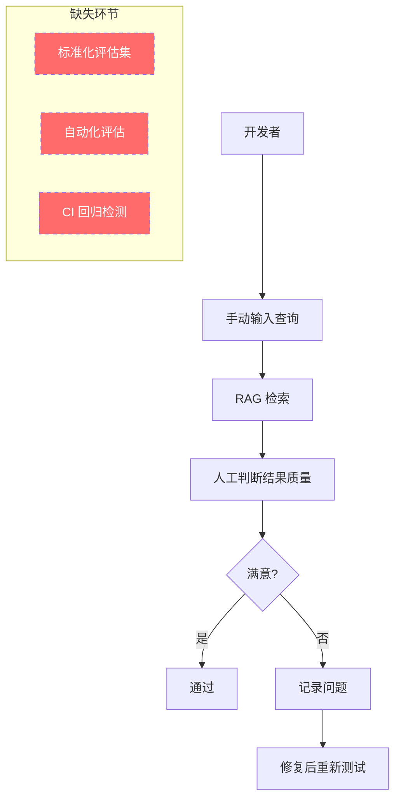
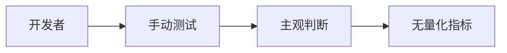
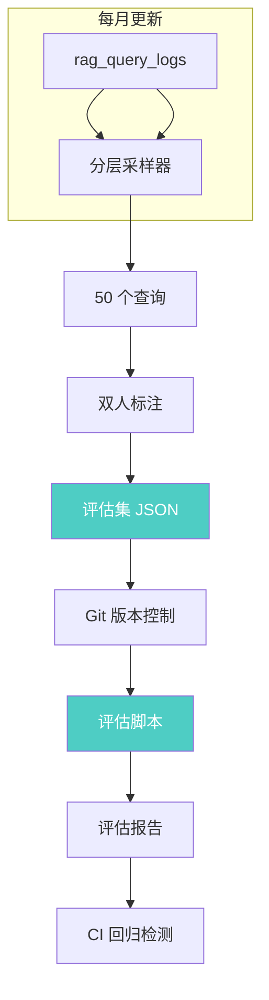

# YK-09-77: RAG 检索质量评估集构建方案

> 需求编号：YK-09-77 · 优先级：P2 · 人天：3.0d · 状态：需求已编写
> 依赖：YK-09-60（RAG 检索 SLO 定义）

---

## 1. 背景

### 1.1 问题描述

YK-09-60 定义了 RAG 检索的 SLO 指标（检索延迟、空结果率、满意度），但这些指标需要 ground truth 评估集才能准确测量。当前缺乏系统化的评估集构建方法，检索质量评估依赖以下零散数据：

- **用户反馈**（YK-09-07）：点赞/点踩，但稀疏且主观
- **手动抽查**：开发者随机测试，覆盖率低
- **A/B 对比**：新旧版本对比，但缺少绝对质量基准

没有标准化的评估集，就无法回答以下问题：
- 切换到 HNSW（YK-09-75）后召回率损失了多少？
- PQ 压缩（YK-09-76）对检索质量的影响有多大？
- 冷热分离（YK-09-72）是否遗漏了冷门但重要的文档？
- 语义缓存（YK-09-81）返回的结果是否准确？

### 1.2 影响范围

| 影响维度 | 当前状态 | 目标状态 | 严重程度 |
|----------|----------|----------|----------|
| 检索质量评估 | 无标准方法 | 50 queries/week 评估集 | 高 |
| 回归检测 | 手动抽查 | 自动 CI 回归检测 | 高 |
| 索引变更验证 | 无法量化影响 | 召回率变化可量化 | 高 |
| 标注效率 | 全人工 | 分层采样 + 半自动标注 | 中 |

### 1.3 业务挑战

| 挑战 | 描述 | 紧迫性 |
|------|------|--------|
| 代表性采样 | 评估集需覆盖不同查询类型和长度 | 高 |
| 标注质量 | 人工标注相关性需要一致的标注标准 | 高 |
| 时效性 | 知识库内容变化后评估集需更新 | 中 |
| 可复现性 | 评估结果需要可复现和可版本化 | 中 |

---

## 2. 现状分析

### 2.1 当前评估流程



### 2.2 根因矩阵

| 根因 | 症状 | 影响量化 | 优先级 |
|------|------|----------|----------|
| 无评估集 | 无法量化检索质量 | 索引变更影响未知 | P0 |
| 无标注标准 | 不同人判断标准不一致 | 评估结果不可比 | P0 |
| 无自动化 | 每次评估需手动执行 | 评估周期长（> 1h） | P1 |
| 无版本化 | 评估集无法追踪变更 | 历史对比困难 | P1 |

### 2.3 评估集需求分析

| 需求 | 描述 | 优先级 |
|------|------|--------|
| 分层采样 | 覆盖短/中/长查询，不同意图 | P0 |
| Ground truth | 每个查询标注相关文档 | P0 |
| 定期更新 | 每月更新评估集 | P1 |
| 可复现 | 固定随机种子 + 版本化 | P1 |
| 自动化评估 | 评估脚本自动运行 | P1 |
| 评估报告 | 生成多维指标报告 | P2 |

---

## 3. 设计决策

### D-01: 评估查询来源

| 方案 | 描述 | 优点 | 缺点 | 选择 |
|------|------|------|------|------|
| A: 人工构造 | 开发者手动编写查询 | 覆盖全面 | 不代表真实用户 | 否 |
| B: 真实日志采样 | 从 rag_query_logs 采样 | 代表真实分布 | 需要去重和清洗 | **是** |
| C: 混合 | 真实日志 + 人工补充 | 兼顾真实与覆盖 | 实现复杂 | 备选 |

**选择 B**：从 `rag_query_logs` 集合中分层采样，确保评估集代表真实用户查询分布。初始 50 个查询，每月更新。

### D-02: 分层采样策略

| 方案 | 描述 | 优点 | 缺点 | 选择 |
|------|------|------|------|------|
| A: 随机采样 | 从日志中随机选取 | 简单 | 可能偏差 | 否 |
| B: 等比例分层 | 按查询长度等比例 | 代表分布 | 小众查询可能不足 | 否 |
| C: 分层 + 配额 | 每个层最低配额 + 热度加权 | 保证覆盖 | 实现复杂 | **是** |

**选择 C**：按查询长度分 4 层（短/中/长/代码），每层最低 8 个查询，剩余 18 个按热度加权分配。总计 50 个查询。

### D-03: 标注方法

| 方案 | 描述 | 优点 | 缺点 | 选择 |
|------|------|------|------|------|
| A: 单人标注 | 一人标注所有查询 | 一致 | 可能偏差 | 否 |
| B: 双人标注 + 仲裁 | 两人独立标注，不一致时仲裁 | 高一致性 | 2x 工作量 | **是** |
| C: 自动标注 | 用 LLM 判断相关性 | 快速 | 偏置风险 | 否 |

**选择 B**：双人独立标注（curator + aier 角色），计算 Kappa 系数，不一致时由第三人仲裁。

### D-04: 评估集版本化

| 方案 | 描述 | 优点 | 缺点 | 选择 |
|------|------|------|------|------|
| A: 文件版本化 | 评估集存为 JSON 文件，Git 管理 | 可追溯 | 人工维护 | **是** |
| B: 数据库版本化 | 评估集存 MongoDB 带版本号 | 自动 | 不够透明 | 否 |
| C: 无版本化 | 每次直接覆盖 | 简单 | 不可追溯 | 否 |

**选择 A**：评估集存为 `YiAi/tests/evaluation/datasets/` 下的 JSON 文件，Git 管理，每次变更需 commit。

---

## 4. 目标架构

### 4.1 架构对比

**Before（当前）**：


**After（目标）**：


### 4.2 核心指标

| 指标 | 当前值 | 目标值 | 测量方法 |
|------|--------|--------|----------|
| 评估集大小 | 0 | 50 queries/week, 200/month | 评估集文件计数 |
| 查询覆盖层数 | 0 | 4 层（短/中/长/代码） | 分层统计 |
| 标注一致性 | N/A | Kappa > 0.7 | 双人标注对比 |
| 评估执行时间 | 手动 1h+ | 自动 < 5min | 评估脚本计时 |
| 评估集更新频率 | 无 | 每月 | 文件修改时间 |

---

## 5. 具体改动

### 5.1 新增文件

| 文件路径 | 描述 | 行数估计 |
|----------|------|----------|
| `YiAi/services/rag/eval/query_sampler.py` | 分层查询采样器 | ~120 |
| `YiAi/services/rag/eval/eval_dataset.py` | 评估集数据模型和管理 | ~100 |
| `YiAi/services/rag/eval/eval_runner.py` | 评估执行器 | ~150 |
| `YiAi/services/rag/eval/metrics.py` | 评估指标计算 | ~120 |
| `YiAi/services/rag/eval/report_generator.py` | 评估报告生成 | ~80 |
| `YiAi/tests/evaluation/datasets/eval_v1.json` | 初始评估集 | ~50 条 |
| `YiAi/tests/services/rag/eval/test_query_sampler.py` | 采样器单测 | ~100 |
| `YiAi/tests/services/rag/eval/test_eval_runner.py` | 评估运行器单测 | ~120 |

### 5.2 修改文件

| 文件路径 | 改动描述 |
|----------|----------|
| `YiAi/services/rag/rag_service.py` | 添加评估模式接口 |
| `YiAi/tests/conftest.py` | 添加评估 fixture |

### 5.3 核心代码示例

```python
# YiAi/services/rag/eval/query_sampler.py

import random
from datetime import datetime, timedelta
from collections import defaultdict
import logging

logger = logging.getLogger(__name__)


class QuerySampler:
    """评估查询分层采样器——从真实查询日志中采样代表性查询。"""

    # 分层定义
    STRATA = {
        'short':  {'min_words': 1,  'max_words': 5,  'weight': 0.30, 'min_quota': 8},
        'medium': {'min_words': 6,  'max_words': 15, 'weight': 0.30, 'min_quota': 8},
        'long':   {'min_words': 16, 'max_words': 50, 'weight': 0.25, 'min_quota': 8},
        'code':   {'min_words': 1,  'max_words': 100,'weight': 0.15, 'min_quota': 6},
    }

    TOTAL_QUERIES = 50
    OVER_SAMPLE_RATIO = 3  # 过采样比例（人工筛选前）

    def __init__(self, db):
        self._db = db

    async def sample(self, n: int = TOTAL_QUERIES,
                     days: int = 30,
                     seed: int = 42) -> dict:
        """从查询日志中分层采样。

        Args:
            n: 目标采样数量
            days: 日志时间范围（天）
            seed: 随机种子（确保可复现）

        Returns:
            {
                'queries': [{'query': str, 'stratum': str, 'count': int}, ...],
                'strata_stats': {stratum: {'sampled': int, 'available': int}, ...},
                'seed': int,
                'sampled_at': str,
            }
        """
        random.seed(seed)
        since = datetime.utcnow() - timedelta(days=days)

        # 1. 从日志中获取候选查询
        cursor = self._db.rag_query_logs.aggregate([
            {'$match': {'timestamp': {'$gte': since}}},
            {'$group': {
                '_id': '$query',
                'count': {'$sum': 1},
                'avg_duration_ms': {'$avg': '$duration_ms'},
                'avg_result_count': {'$avg': '$result_count'},
            }},
            {'$sort': {'count': -1}},
        ])

        all_queries = []
        async for doc in cursor:
            query_text = doc['_id'].strip()
            if not query_text or len(query_text) < 2:
                continue
            all_queries.append({
                'query': query_text,
                'count': doc['count'],
                'avg_duration_ms': doc['avg_duration_ms'],
                'avg_result_count': doc['avg_result_count'],
            })

        if len(all_queries) < n:
            logger.warning(
                f'[QuerySampler] Only {len(all_queries)} unique queries '
                f'available (need {n})'
            )
            n = len(all_queries)

        # 2. 分层
        strata_queries = defaultdict(list)
        for q in all_queries:
            # 检测代码查询
            if self._is_code_query(q['query']):
                strata_queries['code'].append(q)
            else:
                words = len(q['query'].split())
                for stratum_name, stratum_def in self.STRATA.items():
                    if stratum_name == 'code':
                        continue
                    if stratum_def['min_words'] <= words <= stratum_def['max_words']:
                        strata_queries[stratum_name].append(q)
                        break

        # 3. 每层采样
        sampled = []
        remaining = n

        # 先满足最低配额
        for stratum_name, stratum_def in self.STRATA.items():
            available = strata_queries.get(stratum_name, [])
            quota = min(stratum_def['min_quota'], len(available))
            if quota > 0:
                # 按热度加权采样
                sampled_in_stratum = self._weighted_sample(available, quota, seed)
                for q in sampled_in_stratum:
                    q['stratum'] = stratum_name
                sampled.extend(sampled_in_stratum)
                remaining -= quota

        # 4. 剩余配额按权重分配
        if remaining > 0:
            total_weight = sum(s['weight'] for s in self.STRATA.values())
            for stratum_name, stratum_def in self.STRATA.items():
                available = strata_queries.get(stratum_name, [])
                already_sampled = sum(1 for s in sampled if s['stratum'] == stratum_name)
                alloc = int(remaining * stratum_def['weight'] / total_weight)
                alloc = min(alloc, len(available) - already_sampled)
                if alloc > 0:
                    extra = self._weighted_sample(available, alloc, seed + 1000)
                    for q in extra:
                        q['stratum'] = stratum_name
                    sampled.extend(extra)

        # 5. 去重
        seen = set()
        unique_sampled = []
        for q in sampled:
            if q['query'] not in seen:
                seen.add(q['query'])
                unique_sampled.append(q)

        # 6. 构建统计
        strata_stats = {}
        for stratum_name in self.STRATA:
            strata_stats[stratum_name] = {
                'sampled': sum(1 for s in unique_sampled if s['stratum'] == stratum_name),
                'available': len(strata_queries.get(stratum_name, [])),
            }

        logger.info(
            f'[QuerySampler] Sampled {len(unique_sampled)} queries '
            f'from {len(all_queries)} unique queries '
            f'(seed={seed}, days={days})'
        )

        return {
            'queries': unique_sampled[:n],
            'strata_stats': strata_stats,
            'seed': seed,
            'sampled_at': datetime.utcnow().isoformat(),
            'total_available': len(all_queries),
        }

    def _is_code_query(self, query: str) -> bool:
        """检测是否为代码查询。"""
        code_indicators = [
            'def ', 'class ', 'import ', 'async ', 'await ',
            'function ', 'const ', 'let ', 'var ',
            'SELECT ', 'FROM ', 'WHERE ',
            '{', '}', '=>', '::',
        ]
        return any(indicator in query for indicator in code_indicators)

    def _weighted_sample(self, items: list, k: int, seed: int) -> list:
        """按 count（热度）加权采样。"""
        if len(items) <= k:
            return items[:]

        weights = [item['count'] for item in items]
        total = sum(weights)
        if total == 0:
            weights = [1] * len(items)

        rng = random.Random(seed)
        # 使用 numpy 的 choice 或简单实现
        sampled_indices = set()
        while len(sampled_indices) < k:
            # 加权随机选择
            r = rng.random() * sum(weights)
            cumulative = 0
            for i, w in enumerate(weights):
                cumulative += w
                if r <= cumulative and i not in sampled_indices:
                    sampled_indices.add(i)
                    break

        return [items[i] for i in sampled_indices]
```

```python
# YiAi/services/rag/eval/eval_dataset.py

import json
from pathlib import Path
from datetime import datetime
from typing import Optional
import logging

logger = logging.getLogger(__name__)


class EvalDataset:
    """RAG 检索质量评估集——包含查询和 ground truth 标注。"""

    FORMAT_VERSION = "1.0"

    def __init__(self, path: str = None):
        self._path = Path(path) if path else None
        self._queries: list[dict] = []
        self._metadata: dict = {}

    def load(self, path: str) -> None:
        """从 JSON 文件加载评估集。"""
        self._path = Path(path)
        with open(self._path, 'r', encoding='utf-8') as f:
            data = json.load(f)

        version = data.get('format_version', 'unknown')
        if version != self.FORMAT_VERSION:
            logger.warning(
                f'[EvalDataset] Format version mismatch: '
                f'{version} != {self.FORMAT_VERSION}'
            )

        self._metadata = data.get('metadata', {})
        self._queries = data.get('queries', [])

        logger.info(
            f'[EvalDataset] Loaded {len(self._queries)} queries '
            f'from {self._path}'
        )

    def save(self, path: str) -> None:
        """保存评估集为 JSON 文件。"""
        self._path = Path(path)
        self._path.parent.mkdir(parents=True, exist_ok=True)

        data = {
            'format_version': self.FORMAT_VERSION,
            'metadata': {
                **self._metadata,
                'updated_at': datetime.utcnow().isoformat(),
                'query_count': len(self._queries),
            },
            'queries': self._queries,
        }

        with open(self._path, 'w', encoding='utf-8') as f:
            json.dump(data, f, ensure_ascii=False, indent=2)

        logger.info(f'[EvalDataset] Saved {len(self._queries)} queries to {self._path}')

    def add_query(self, query: str, relevant_docs: list[str],
                  annotator: str, notes: str = "") -> None:
        """添加一个标注好的查询。"""
        self._queries.append({
            'id': f'q{len(self._queries) + 1:04d}',
            'query': query,
            'relevant_docs': relevant_docs,
            'stratum': self._classify_stratum(query),
            'annotator': annotator,
            'notes': notes,
            'annotated_at': datetime.utcnow().isoformat(),
        })

    def get_queries(self) -> list[str]:
        """获取所有查询文本。"""
        return [q['query'] for q in self._queries]

    def get_relevant_docs(self, query_id: str) -> list[str]:
        """获取指定查询的相关文档列表。"""
        for q in self._queries:
            if q['id'] == query_id:
                return q['relevant_docs']
        return []

    def compute_kappa(self, annotations_a: list[dict],
                      annotations_b: list[dict]) -> float:
        """计算双人标注的 Cohen's Kappa 系数。"""
        # 简化实现：对每个查询判断是否一致
        if len(annotations_a) != len(annotations_b):
            raise ValueError('Annotation lists must have same length')

        agree = 0
        for a, b in zip(annotations_a, annotations_b):
            if set(a['relevant_docs']) == set(b['relevant_docs']):
                agree += 1

        p_o = agree / len(annotations_a)  # 观察一致率
        p_e = 0.5  # 期望一致率（简化，实际应基于边际分布）

        if p_o == 1.0:
            return 1.0
        return (p_o - p_e) / (1 - p_e)

    def _classify_stratum(self, query: str) -> str:
        """自动分类查询层级。"""
        words = len(query.split())
        if any(kw in query for kw in ['def ', 'class ', 'import ', 'function ', 'const ']):
            return 'code'
        if words <= 5:
            return 'short'
        if words <= 15:
            return 'medium'
        return 'long'

    @property
    def query_count(self) -> int:
        return len(self._queries)

    @property
    def strata_distribution(self) -> dict:
        dist = {}
        for q in self._queries:
            s = q.get('stratum', 'unknown')
            dist[s] = dist.get(s, 0) + 1
        return dist
```

```python
# YiAi/services/rag/eval/eval_runner.py

import time
import numpy as np
from typing import Optional
import logging

logger = logging.getLogger(__name__)


class EvalRunner:
    """RAG 检索评估执行器——运行评估集并计算指标。"""

    def __init__(self, rag_service, eval_dataset: 'EvalDataset'):
        self._rag_service = rag_service
        self._dataset = eval_dataset

    async def run(self, top_k: int = 10) -> dict:
        """运行评估并返回指标报告。

        Returns:
            {
                'metrics': {...},
                'per_query': [...],
                'summary': str,
            }
        """
        start = time.monotonic()
        per_query_results = []

        for q in self._dataset._queries:
            query_start = time.monotonic()

            # 执行检索
            try:
                results = await self._rag_service.query(q['query'], top_k=top_k)
                retrieved_paths = [r['source_path'] for r in results]
            except Exception as e:
                logger.error(f'[EvalRunner] Query failed: {q["query"]}: {e}')
                retrieved_paths = []

            query_latency = (time.monotonic() - query_start) * 1000

            # 计算指标
            relevant = set(q['relevant_docs'])
            retrieved = set(retrieved_paths)

            # Recall@K
            if len(relevant) > 0:
                recall = len(relevant & retrieved) / len(relevant)
            else:
                recall = 0.0

            # Precision@K
            if len(retrieved) > 0:
                precision = len(relevant & retrieved) / len(retrieved)
            else:
                precision = 0.0

            # MRR (Mean Reciprocal Rank)
            rr = 0.0
            for i, path in enumerate(retrieved_paths):
                if path in relevant:
                    rr = 1.0 / (i + 1)
                    break

            per_query_results.append({
                'query_id': q['id'],
                'query': q['query'],
                'stratum': q.get('stratum', 'unknown'),
                'recall': recall,
                'precision': precision,
                'mrr': rr,
                'latency_ms': query_latency,
                'num_retrieved': len(retrieved_paths),
                'num_relevant': len(relevant),
            })

        total_elapsed = (time.monotonic() - start) * 1000

        # 聚合指标
        metrics = self._aggregate_metrics(per_query_results)

        return {
            'metrics': metrics,
            'per_query': per_query_results,
            'summary': self._generate_summary(metrics),
            'eval_time_ms': round(total_elapsed, 0),
            'num_queries': len(per_query_results),
            'top_k': top_k,
        }

    def _aggregate_metrics(self, per_query: list[dict]) -> dict:
        """聚合单查询指标为整体指标。"""
        recalls = [r['recall'] for r in per_query]
        precisions = [r['precision'] for r in per_query]
        mrrs = [r['mrr'] for r in per_query]
        latencies = [r['latency_ms'] for r in per_query]

        # 按分层统计
        strata_metrics = {}
        for stratum in ['short', 'medium', 'long', 'code']:
            stratum_results = [r for r in per_query if r['stratum'] == stratum]
            if stratum_results:
                strata_metrics[stratum] = {
                    'count': len(stratum_results),
                    'recall': np.mean([r['recall'] for r in stratum_results]),
                    'precision': np.mean([r['precision'] for r in stratum_results]),
                    'mrr': np.mean([r['mrr'] for r in stratum_results]),
                    'latency_p50': np.percentile([r['latency_ms'] for r in stratum_results], 50),
                    'latency_p95': np.percentile([r['latency_ms'] for r in stratum_results], 95),
                }

        return {
            'recall': float(np.mean(recalls)) if recalls else 0.0,
            'precision': float(np.mean(precisions)) if precisions else 0.0,
            'mrr': float(np.mean(mrrs)) if mrrs else 0.0,
            'latency_p50_ms': float(np.percentile(latencies, 50)) if latencies else 0.0,
            'latency_p95_ms': float(np.percentile(latencies, 95)) if latencies else 0.0,
            'latency_p99_ms': float(np.percentile(latencies, 99)) if latencies else 0.0,
            'empty_result_rate': sum(1 for r in per_query if r['num_retrieved'] == 0) / len(per_query) if per_query else 0.0,
            'strata': strata_metrics,
        }

    def _generate_summary(self, metrics: dict) -> str:
        """生成人类可读的评估摘要。"""
        lines = [
            '=' * 50,
            'RAG Retrieval Quality Evaluation Report',
            '=' * 50,
            f'Overall Recall@10:    {metrics["recall"]:.2%}',
            f'Overall Precision@10: {metrics["precision"]:.2%}',
            f'Overall MRR:          {metrics["mrr"]:.3f}',
            f'Latency P50:          {metrics["latency_p50_ms"]:.0f}ms',
            f'Latency P95:          {metrics["latency_p95_ms"]:.0f}ms',
            f'Empty Result Rate:    {metrics["empty_result_rate"]:.1%}',
            '',
            'By Stratum:',
        ]
        for stratum, sm in metrics.get('strata', {}).items():
            lines.append(
                f'  {stratum:8s}: Recall={sm["recall"]:.2%}, '
                f'Precision={sm["precision"]:.2%}, '
                f'P95={sm["latency_p95"]:.0f}ms'
            )
        return '\n'.join(lines)
```

### 5.4 评估集 JSON 格式

```json
{
  "format_version": "1.0",
  "metadata": {
    "name": "RAG Evaluation Dataset v1",
    "description": "Initial evaluation set with 50 queries from rag_query_logs",
    "created_at": "2026-09-09T00:00:00Z",
    "updated_at": "2026-09-09T00:00:00Z",
    "query_count": 50,
    "annotators": ["curator", "aier"],
    "kappa": 0.82,
    "source": "rag_query_logs (2026-08-09 to 2026-09-09)"
  },
  "queries": [
    {
      "id": "q0001",
      "query": "RAG 检索优化方法",
      "relevant_docs": [
        "YiKnowledge/projects/yiknowledge/specs/rag-optimization.md",
        "YiKnowledge/projects/yiai/specs/rag-service.md"
      ],
      "stratum": "short",
      "annotator": "curator",
      "notes": "直接匹配 RAG 优化主题",
      "annotated_at": "2026-09-09T00:00:00Z"
    }
  ]
}
```

---

## 6. 实施步骤

### 第 1 步：查询采样器实现（0.5 人天）

- 实现 `QuerySampler` 类（分层采样）
- 从 `rag_query_logs` 中提取候选查询
- 实现热度加权和去重逻辑
- **验证**：运行采样器，输出 50 个查询，检查分层分布

### 第 2 步：标注流程建立（1.0 人天）

- 创建标注指南文档
- 准备标注工具（简单的 CSV/JSON 标注）
- 双人独立标注首批 50 个查询
- 计算 Kappa 系数，不一致项仲裁
- **验证**：Kappa > 0.7，评估集 JSON 格式正确

### 第 3 步：评估运行器实现（1.0 人天）

- 实现 `EvalDataset` 类（加载/保存/版本管理）
- 实现 `EvalRunner` 类（执行评估 + 指标计算）
- 实现评估报告生成
- **验证**：运行评估脚本，输出 Recall@10、Precision@10、MRR、延迟分布

### 第 4 步：CI 集成（0.5 人天）

- 添加评估脚本到 CI 流程
- 设置回归阈值（Recall@10 < 基线 95% 时失败）
- 配置定期运行（每次 PR 或每日）
- **验证**：CI 中评估脚本正常运行，回归检测生效

### 总计：3.0 人天

---

## 7. 性能分析

### 7.1 评估执行时间

| 评估集大小 | 检索次数 | 单次检索延迟 | 总评估时间 |
|-----------|----------|-------------|-----------|
| 50 queries | 50 | 200ms | 10s |
| 200 queries | 200 | 200ms | 40s |
| 500 queries | 500 | 200ms | 100s |

### 7.2 标注工作量

| 阶段 | 每查询耗时 | 说明 |
|------|-----------|------|
| 检索执行 | 自动 | 评估脚本自动执行 |
| 结果审查 | 2-3 min | 人工判断 Top-10 结果相关性 |
| 标注记录 | 1 min | 记录相关文档路径 |
| 双人标注（含仲裁） | 5-6 min | 2x 标注 + 不一致仲裁 |

50 个查询双人标注预计耗时：50 x 6 = 300 min = 5 小时

---

## 8. 测试规格

### 8.1 单元测试

```gherkin
GIVEN rag_query_logs 中有 500 个唯一查询
WHEN 调用 QuerySampler.sample(n=50, seed=42)
THEN 返回 50 个查询
AND 4 个分层 (short/medium/long/code) 均有代表
AND 无重复查询

GIVEN 相同的 rag_query_logs 和 seed
WHEN 两次调用 QuerySampler.sample(n=50, seed=42)
THEN 返回的查询集合完全一致（可复现）

GIVEN 一个包含 50 个查询的评估集
WHEN 调用 EvalRunner.run(top_k=10)
THEN 返回 metrics.recall、metrics.precision、metrics.mrr
AND per_query 包含 50 条记录
AND 评估时间 < 60s

GIVEN 两份独立的标注结果
WHEN 计算 Kappa 系数
THEN Kappa >= 0.7（标注一致性良好）

GIVEN 评估集 JSON 文件
WHEN 通过 EvalDataset.load() 加载
THEN 查询数量与保存时一致
AND 所有查询的 relevant_docs 非空
```

### 8.2 集成测试

- 测试评估集与 RAG 检索流程的集成
- 测试评估 Script 的 CI 集成
- 测试评估集版本更新流程

---

## 9. 风险与缓解

### 9.1 风险矩阵

| 风险 | 概率 | 影响 | 缓解措施 | 残余风险 |
|------|------|------|----------|----------|
| 标注质量不一致 | 中 | 高 | 双人标注 + Kappa 检查 | 低 |
| 评估集不代表真实分布 | 中 | 中 | 每月更新 + 热度加权 | 低 |
| 标注工作量过大 | 中 | 中 | 50 queries 起步，逐步扩展 | 低 |
| 评估集泄露到训练 | 低 | 高 | 评估集独立存储，不参与索引训练 | 极低 |

### 9.2 降级策略

| 场景 | 降级行为 |
|------|----------|
| 评估集不可用 | 跳过评估，发出警告 |
| 标注不足 | 使用 LLM 辅助标注（降低置信度） |

---

## 10. 回滚策略

- 评估集版本化在 Git 中，可随时回滚到历史版本
- 评估脚本独立于核心检索流程，异常时不影响线上服务

---

## 11. 设计决策记录

### D-01: 真实日志采样而非人工构造

- **决策**：从 `rag_query_logs` 中采样评估查询
- **依据**：代表真实用户查询分布，避免开发者偏见
- **权衡**：可能遗漏低频但重要的查询类型，通过每月更新逐步补充

### D-02: 双人标注 + 仲裁

- **决策**：curator + aier 双人独立标注
- **依据**：确保标注一致性，Kappa 系数可量化标注质量
- **权衡**：2x 工作量，但评估集质量至关重要

### D-03: 50 个查询起步，每月扩展

- **决策**：初始 50 个查询，每月新增 50 个
- **依据**：平衡标注工作量和覆盖度
- **权衡**：初期覆盖度有限，但增长速度可控

---

## 12. 可观测性

### 12.1 指标

| 指标名称 | 类型 | 描述 | 告警阈值 |
|----------|------|------|----------|
| `rag_eval_recall` | Gauge | 最近评估的 Recall@10 | < 0.85 告警 |
| `rag_eval_mrr` | Gauge | 最近评估的 MRR | < 0.5 告警 |
| `rag_eval_empty_rate` | Gauge | 空结果率 | > 10% 告警 |
| `rag_eval_kappa` | Gauge | 标注一致性 | < 0.6 告警 |

### 12.2 日志

```python
logger.info(f'[Eval] Sampled {n} queries, strata={strata_stats}')
logger.info(f'[Eval] Run complete: recall={recall:.2%}, mrr={mrr:.3f}, time={elapsed}s')
logger.warning(f'[Eval] Recall@10 dropped below threshold: {recall:.2%} < 0.85')
```

### 12.3 告警规则

| 告警 | 条件 | 级别 | 处理 |
|------|------|------|------|
| 召回率下降 | `recall < 0.85` 连续 2 次评估 | WARNING | 检查最近索引变更 |
| 评估执行失败 | 评估脚本异常退出 | WARNING | 检查评估集和检索服务 |

---

## 13. 安全合规

### 13.1 安全要求

| 要求 | 描述 | 实现方式 |
|------|------|----------|
| 查询脱敏 | 评估集不包含用户身份信息 | 仅存储查询文本和文档路径 |
| 访问控制 | 评估集仅开发团队可访问 | Git 仓库权限控制 |

---

## 14. 代码审查检查清单

- [ ] 评估集从真实 `rag_query_logs` 中分层采样（非人工构造）
- [ ] 分层覆盖 short/medium/long/code 四种查询类型
- [ ] 每个查询标注相关文档（ground truth），标注人工可追溯
- [ ] 双人标注 + Kappa 系数检查一致性
- [ ] 评估集版本化（JSON 文件 + Git 管理）
- [ ] 评估脚本可复现（固定随机种子）
- [ ] 评估指标：Recall@10, Precision@10, MRR, P50/P95 延迟
- [ ] 按分层统计指标，识别特定查询类型的瓶颈
- [ ] 每月更新评估集（新增热门查询，移除过时查询）
- [ ] CI 集成：PR 时自动运行评估，回归阈值检查
- [ ] 评估不参与索引训练（防止泄露）
- [ ] 评估失败不影响线上检索服务

---

*PRD 来源: `projects/yiknowledge/requirements/2026-09/77-需求-检索质量评估集构建.md`*