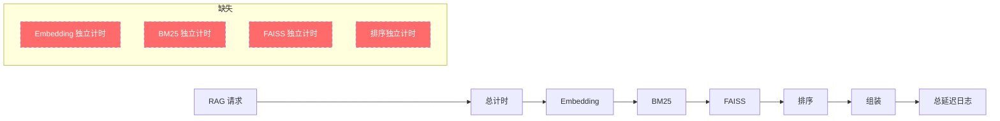
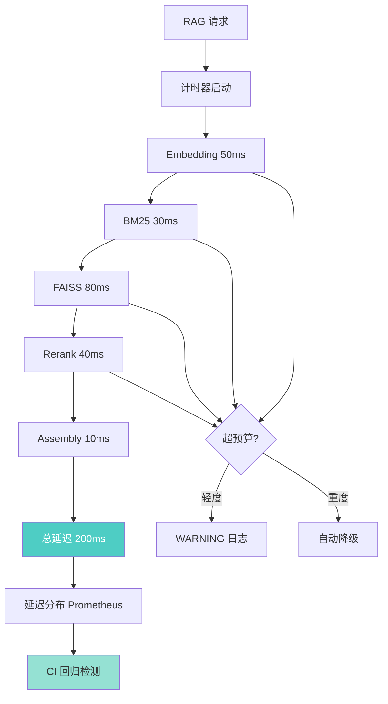

# YK-09-78: RAG 检索延迟预算分配 — 各阶段延迟目标与回归门禁

> 需求编号：YK-09-78 · 优先级：P2 · 人天：2.0d · 状态：需求已编写
> 依赖：YK-09-60（RAG SLO 定义）

---

## 1. 背景

### 1.1 问题描述

RAG 检索的总延迟是多个阶段的累加：Embedding 计算、BM25 文本搜索、向量检索、结果重排序、结果组装。当前这些阶段没有明确的延迟预算，导致：

1. **性能退化不可见**：某个阶段延迟增加 2x 时，总延迟可能仍在"可接受"范围，问题被掩盖
2. **优化方向模糊**：不知道哪个阶段是瓶颈，优化资源分配缺乏依据
3. **CI 回归无门禁**：代码变更可能引入性能退化，但缺少自动化检测
4. **跨阶段影响难追踪**：Embedding 模型切换（如 CLIP 图像编码 YK-09-73）对总体延迟的影响无法量化

### 1.2 影响范围

| 影响维度 | 当前状态 | 目标状态 | 严重程度 |
|----------|----------|----------|----------|
| 延迟退化检测 | 手动感知 | 自动化 CI 门禁 | 高 |
| 瓶颈定位 | 无数据 | 每阶段延迟独立计时 | 高 |
| 容量规划 | 无依据 | 各阶段延迟分布可预测 | 中 |
| 优化优先级 | 凭经验 | 数据驱动 | 中 |

### 1.3 业务挑战

| 挑战 | 描述 | 紧迫性 |
|------|------|--------|
| 多阶段计时 | 在检索流程中插入精确计时点 | 高 |
| 预算分配 | 各阶段预算需基于实际测量数据 | 高 |
| CI 集成 | 性能回归检测需集成到 CI 流程 | 中 |
| 自适应降级 | 超预算时需要自动降级策略 | 中 |

---

## 2. 现状分析

### 2.1 当前延迟测量



当前仅记录总延迟，各阶段延迟不可见。

### 2.2 根因矩阵

| 根因 | 症状 | 影响量化 | 优先级 |
|------|------|----------|----------|
| 无分阶段计时 | 无法定位瓶颈 | 优化方向模糊 | P0 |
| 无延迟预算 | 无性能退化标准 | 退化不可见 | P0 |
| 无 CI 回归 | 代码变更可能引入退化 | 性能持续下降 | P1 |
| 无自动降级 | 单阶段超时导致总体超时 | 用户体验差 | P1 |

### 2.3 当前延迟分布（基于 rag_query_logs）

| 阶段 | 估计延迟 | 占比 | 测量方式 |
|------|----------|------|----------|
| 查询 Embedding | ~50ms | 25% | 估算（Ollama 推理） |
| BM25 文本搜索 | ~30ms | 15% | 估算（MongoDB text search） |
| FAISS 向量检索 | ~80ms | 40% | 估算（IndexFlatL2） |
| 结果重排序 | ~30ms | 15% | 估算（MMR/Cross-Encoder） |
| 结果组装 | ~10ms | 5% | 估算（序列化） |
| **总计** | **~200ms** | **100%** | 日志记录 |

---

## 3. 设计决策

### D-01: 延迟预算分配策略

| 方案 | 描述 | 优点 | 缺点 | 选择 |
|------|------|------|------|------|
| A: 固定预算 | 每阶段固定 ms 预算 | 简单 | 不适应变化 | 否 |
| B: 百分比预算 | 每阶段按总延迟百分比 | 自适应 | 总延迟波动影响 | 否 |
| C: 固定 + 百分比混合 | 核心阶段固定，辅助阶段百分比 | 兼顾稳定和灵活 | 稍复杂 | **是** |

**选择 C**：Embedding 和 FAISS 使用固定预算（受模型/索引类型影响），其他阶段使用百分比预算。

### D-02: 预算违规处理

| 方案 | 描述 | 优点 | 缺点 | 选择 |
|------|------|------|------|------|
| A: 仅告警 | 超预算时记录 WARNING | 不中断 | 无自动处理 | 否 |
| B: 自动降级 | 超预算时降低 top_k/简化排序 | 自适应 | 可能影响质量 | **是** |
| C: 直接拒绝 | 超预算时返回错误 | 严格 | 用户体验差 | 否 |

**选择 B**：轻度超预算时 WARNING，重度超预算时自动降级（降低 top_k、跳过 Cross-Encoder 重排序）。

### D-03: CI 回归门禁

| 方案 | 描述 | 优点 | 缺点 | 选择 |
|------|------|------|------|------|
| A: 固定阈值 | P95 延迟 > 250ms 则失败 | 简单 | 不区分优化和退化 | 否 |
| B: 相对阈值 | 较基线增加 > 20% 则失败 | 适应变化 | 需要基线数据 | **是** |
| C: 统计检验 | Mann-Whitney U 检验 | 严谨 | 需要足够样本 | 否 |

**选择 B**：每次 PR 运行评估集（YK-09-77），对比 main 分支基线，P95 延迟增加 > 20% 或 Recall 下降 > 5% 时 CI 失败。

### D-04: 延迟预算配置

| 阶段 | 预算（ms） | 占比 | 严重超预算阈值 | 降级策略 |
|------|-----------|------|---------------|----------|
| query_embedding | 50 | 25% | 80ms | 切换到更小 Embedding 模型 |
| bm25_search | 30 | 15% | 50ms | 降低 ngram 精度 |
| faiss_vector | 80 | 40% | 120ms | 降低 top_k、跳过冷数据 |
| rerank | 40 | 20% | 60ms | 跳过 Cross-Encoder，仅 MMR |
| result_assembly | 10 | 5% | 20ms | 截断内容 |
| **total** | **200** | **100%** | **300ms** | 综合降级 |

---

## 4. 目标架构

### 4.1 架构对比

**Before（当前）**：


**After（目标）**：


### 4.2 核心指标

| 指标 | 当前值 | 目标值 | 测量方法 |
|------|--------|--------|----------|
| 分阶段计时覆盖率 | 0% | 100% | 各阶段独立计时 |
| CI 回归检测 | 无 | 每次 PR 自动运行 | CI 评估脚本 |
| 超预算告警 | 无 | 超预算时实时告警 | Prometheus 指标 |
| 自动降级覆盖率 | 0% | 重度超预算时 100% | 降级事件日志 |

### 4.3 设计权衡

| 权衡 | 选择 | 代价 | 缓解措施 |
|------|------|------|----------|
| 计时代码侵入 | 在检索流程中插入计时点 | 代码略增 | 使用装饰器/上下文管理器 |
| 自动降级 | 超预算时降低质量 | 检索精度略降 | 仅重度超预算时触发 |
| CI 运行时间 | 每次 PR 运行评估集 | CI 增加 40s | 仅变更 RAG 代码时触发 |

---

## 5. 具体改动

### 5.1 新增文件

| 文件路径 | 描述 | 行数估计 |
|----------|------|----------|
| `YiAi/services/rag/latency_budget.py` | 延迟预算配置和检查 | ~80 |
| `YiAi/services/rag/latency_tracker.py` | 分阶段计时器 | ~60 |
| `YiAi/services/rag/graceful_degrader.py` | 自动降级策略 | ~100 |
| `YiAi/tests/services/rag/test_latency_budget.py` | 延迟预算单测 | ~100 |
| `YiAi/tests/services/rag/test_graceful_degrader.py` | 降级策略单测 | ~80 |

### 5.2 修改文件

| 文件路径 | 改动描述 |
|----------|----------|
| `YiAi/services/rag/rag_service.py` | 插入分阶段计时，集成降级逻辑 |
| `YiAi/core/config.py` | 添加延迟预算配置项 |

### 5.3 核心代码示例

```python
# YiAi/services/rag/latency_budget.py

from dataclasses import dataclass, field
from enum import Enum
from typing import Optional


class BudgetLevel(str, Enum):
    """预算违规级别。"""
    OK = "ok"               # 在预算内
    WARNING = "warning"     # 轻度超预算（< 150%）
    CRITICAL = "critical"   # 重度超预算（>= 150%）


@dataclass
class StageBudget:
    """单个阶段的延迟预算。"""
    budget_ms: float
    warning_threshold_ms: float   # WARNING 阈值
    critical_threshold_ms: float  # CRITICAL 阈值
    degrade_action: Optional[str] = None  # 降级策略名称


@dataclass
class LatencyBudget:
    """RAG 检索各阶段延迟预算配置。

    总预算 200ms，各阶段独立预算，支持分级告警和自动降级。
    """

    stages: dict[str, StageBudget] = field(default_factory=lambda: {
        'query_embedding': StageBudget(
            budget_ms=50,
            warning_threshold_ms=65,
            critical_threshold_ms=80,
            degrade_action='switch_to_smaller_embedding_model',
        ),
        'bm25_search': StageBudget(
            budget_ms=30,
            warning_threshold_ms=40,
            critical_threshold_ms=50,
            degrade_action='reduce_ngram_precision',
        ),
        'faiss_vector': StageBudget(
            budget_ms=80,
            warning_threshold_ms=100,
            critical_threshold_ms=120,
            degrade_action='reduce_top_k',
        ),
        'rerank': StageBudget(
            budget_ms=40,
            warning_threshold_ms=50,
            critical_threshold_ms=60,
            degrade_action='skip_cross_encoder',
        ),
        'result_assembly': StageBudget(
            budget_ms=10,
            warning_threshold_ms=15,
            critical_threshold_ms=20,
            degrade_action='truncate_content',
        ),
    })

    total_budget_ms: float = 200
    total_critical_ms: float = 300

    def check_stage(self, stage: str, actual_ms: float) -> BudgetLevel:
        """检查单个阶段是否超预算。"""
        if stage not in self.stages:
            return BudgetLevel.OK

        budget = self.stages[stage]
        if actual_ms >= budget.critical_threshold_ms:
            return BudgetLevel.CRITICAL
        elif actual_ms > budget.warning_threshold_ms:
            return BudgetLevel.WARNING
        return BudgetLevel.OK

    def check_total(self, total_ms: float) -> BudgetLevel:
        """检查总延迟是否超预算。"""
        if total_ms >= self.total_critical_ms:
            return BudgetLevel.CRITICAL
        elif total_ms > self.total_budget_ms:
            return BudgetLevel.WARNING
        return BudgetLevel.OK

    def get_degrade_action(self, stage: str) -> Optional[str]:
        """获取指定阶段的降级策略。"""
        if stage in self.stages:
            return self.stages[stage].degrade_action
        return None

    def get_all_violations(self, stage_timings: dict[str, float],
                           total_ms: float) -> list[dict]:
        """获取所有预算违规信息。"""
        violations = []
        for stage, actual in stage_timings.items():
            level = self.check_stage(stage, actual)
            if level != BudgetLevel.OK:
                budget = self.stages[stage]
                violations.append({
                    'stage': stage,
                    'actual_ms': actual,
                    'budget_ms': budget.budget_ms,
                    'level': level.value,
                    'overage_pct': ((actual / budget.budget_ms) - 1) * 100,
                    'degrade_action': budget.degrade_action,
                })

        total_level = self.check_total(total_ms)
        if total_level != BudgetLevel.OK:
            violations.append({
                'stage': 'total',
                'actual_ms': total_ms,
                'budget_ms': self.total_budget_ms,
                'level': total_level.value,
                'overage_pct': ((total_ms / self.total_budget_ms) - 1) * 100,
            })

        return sorted(violations, key=lambda v: v['overage_pct'], reverse=True)
```

```python
# YiAi/services/rag/latency_tracker.py

import time
from contextlib import contextmanager
from collections import defaultdict
import logging

logger = logging.getLogger(__name__)


class LatencyTracker:
    """分阶段延迟计时器——在每个检索阶段记录精确耗时。"""

    def __init__(self):
        self._timings: dict[str, float] = {}
        self._stage_order: list[str] = []
        self._total_start: float = 0.0

    def start(self) -> None:
        """开始总计时。"""
        self._timings = {}
        self._stage_order = []
        self._total_start = time.monotonic()

    @contextmanager
    def track(self, stage: str):
        """上下文管理器——自动计时一个阶段。

        Usage:
            with tracker.track('query_embedding'):
                embedding = await embed(query)
        """
        start = time.monotonic()
        try:
            yield
        finally:
            elapsed = (time.monotonic() - start) * 1000
            self._timings[stage] = elapsed
            self._stage_order.append(stage)

    def record(self, stage: str, elapsed_ms: float) -> None:
        """手动记录一个阶段的耗时。"""
        self._timings[stage] = elapsed_ms
        self._stage_order.append(stage)

    @property
    def total_ms(self) -> float:
        """总耗时（ms）。"""
        if self._total_start == 0:
            return sum(self._timings.values())
        return (time.monotonic() - self._total_start) * 1000

    def get_timings(self) -> dict[str, float]:
        """获取所有阶段耗时。"""
        return dict(self._timings)

    def get_stage_order(self) -> list[str]:
        """获取阶段执行顺序。"""
        return list(self._stage_order)

    def get_summary(self) -> dict:
        """获取延迟摘要。"""
        total = self.total_ms
        return {
            'total_ms': round(total, 1),
            'stages': {
                stage: {
                    'elapsed_ms': round(elapsed, 1),
                    'pct': round(elapsed / total * 100, 1) if total > 0 else 0,
                }
                for stage, elapsed in self._timings.items()
            },
            'stage_order': self._stage_order,
        }
```

```python
# YiAi/services/rag/graceful_degrader.py

import logging
from .latency_budget import LatencyBudget, BudgetLevel

logger = logging.getLogger(__name__)


class GracefulDegrader:
    """自动降级策略——当阶段延迟超预算时自动调整检索参数。"""

    def __init__(self, budget: LatencyBudget = None):
        self._budget = budget or LatencyBudget()
        self._degraded_top_k: int = 10
        self._original_top_k: int = 10
        self._skip_cross_encoder: bool = False
        self._degraded: bool = False

    def should_degrade(self, stage_timings: dict[str, float],
                       total_ms: float) -> bool:
        """判断是否需要降级。"""
        violations = self._budget.get_all_violations(stage_timings, total_ms)
        critical_violations = [v for v in violations if v['level'] == 'critical']
        return len(critical_violations) > 0

    def apply_degradation(self, violations: list[dict]) -> dict:
        """应用降级策略。"""
        actions = {}

        for v in violations:
            stage = v['stage']
            action = v.get('degrade_action')

            if action == 'reduce_top_k':
                self._original_top_k = self._degraded_top_k
                self._degraded_top_k = max(3, self._degraded_top_k // 2)
                actions[stage] = f'reduce_top_k: {self._original_top_k} → {self._degraded_top_k}'

            elif action == 'skip_cross_encoder':
                self._skip_cross_encoder = True
                actions[stage] = 'skip_cross_encoder'

            elif action == 'truncate_content':
                actions[stage] = 'truncate_content'

            elif action == 'switch_to_smaller_embedding_model':
                actions[stage] = 'switch_to_smaller_embedding_model'

        if actions:
            self._degraded = True
            logger.warning(
                f'[Degrader] Applied degradation: {actions}'
            )

        return actions

    def get_degraded_params(self) -> dict:
        """获取降级后的检索参数。"""
        params = {}
        if self._degraded:
            params['top_k'] = self._degraded_top_k
            params['skip_cross_encoder'] = self._skip_cross_encoder
        return params

    def reset(self) -> None:
        """重置降级状态。"""
        self._degraded_top_k = 10
        self._skip_cross_encoder = False
        self._degraded = False
```

### 5.4 RAG 检索流程集成

```python
# YiAi/services/rag/rag_service.py（修改部分）

class RagService:
    def __init__(self):
        self._budget = LatencyBudget()
        self._degrader = GracefulDegrader(self._budget)

    async def query(self, query_text: str, top_k: int = 10) -> dict:
        """RAG 检索——带分阶段延迟追踪和自动降级。"""
        tracker = LatencyTracker()
        tracker.start()

        # 阶段 1: 查询 Embedding
        with tracker.track('query_embedding'):
            query_vec = await self._embed(query_text)

        # 阶段 2: BM25 文本搜索
        with tracker.track('bm25_search'):
            bm25_results = await self._bm25_search(query_text, top_k)

        # 阶段 3: FAISS 向量检索
        with tracker.track('faiss_vector'):
            vector_results = await self._vector_search(query_vec, top_k)

        # 阶段 4: 结果重排序
        with tracker.track('rerank'):
            reranked = await self._rerank(bm25_results, vector_results, top_k)

        # 阶段 5: 结果组装
        with tracker.track('result_assembly'):
            fragments = self._assemble_fragments(reranked)

        # 延迟检查和降级
        timings = tracker.get_timings()
        total_ms = tracker.total_ms
        violations = self._budget.get_all_violations(timings, total_ms)

        if violations:
            self._log_violations(query_text, violations)
            if self._degrader.should_degrade(timings, total_ms):
                actions = self._degrader.apply_degradation(violations)
                # 降级后重新检索
                if actions:
                    return await self._degraded_query(query_text, top_k)

        # 记录分阶段延迟
        await self._log_latency_breakdown(query_text, tracker.get_summary())

        return {
            'fragments': fragments,
            'latency': tracker.get_summary(),
            'budget_violations': violations,
        }

    def _log_violations(self, query_text: str, violations: list[dict]) -> None:
        """记录预算违规。"""
        for v in violations:
            level = v['level']
            log_fn = logger.error if level == 'critical' else logger.warning
            log_fn(
                f'[Budget] {level.upper()}: {v["stage"]} '
                f'{v["actual_ms"]:.0f}ms > {v["budget_ms"]:.0f}ms '
                f'(+{v["overage_pct"]:.0f}%) '
                f'query="{query_text[:50]}..."'
            )
```

---

## 6. 实施步骤

### 第 1 步：延迟预算配置（0.5 人天）

- 定义 `LatencyBudget` 和 `StageBudget` 数据类
- 配置各阶段预算阈值
- 实现预算检查逻辑
- **验证**：模拟各阶段延迟，测试预算检查结果

### 第 2 步：分阶段计时器（0.5 人天）

- 实现 `LatencyTracker` 上下文管理器
- 在 RAG 检索流程中插入计时点
- 实现延迟摘要生成
- **验证**：运行检索，检查日志中分阶段延迟数据

### 第 3 步：自动降级策略（0.5 人天）

- 实现 `GracefulDegrader` 类
- 定义各阶段降级策略
- 与检索流程集成
- **验证**：模拟超预算场景，确认降级策略生效

### 第 4 步：CI 回归门禁（0.5 人天）

- 实现 CI 评估脚本
- 设置相对阈值门禁（P95 增加 > 20% 失败）
- 集成到 GitHub Actions / 现有 CI
- **验证**：PR 触发 CI，确认回归检测正常工作

### 总计：2.0 人天

---

## 7. 性能分析

### 7.1 计时代码开销

| 操作 | 开销 | 说明 |
|------|------|------|
| `time.monotonic()` 调用 | < 1us | 可忽略 |
| 上下文管理器 | < 5us | 可忽略 |
| 五个阶段计时总开销 | < 25us | 占 200ms 的 0.01% |

### 7.2 降级效果

| 场景 | 降级前总延迟 | 降级策略 | 降级后总延迟 | 质量影响 |
|------|------------|----------|------------|----------|
| FAISS 超预算 | 350ms | top_k 10→5 | 180ms | Recall 略降 |
| Rerank 超预算 | 280ms | 跳过 Cross-Encoder | 240ms | 排序精度略降 |
| Embedding 超预算 | 300ms | 切换小模型 | 200ms | Embedding 精度略降 |

---

## 8. 测试规格

### 8.1 单元测试

```gherkin
GIVEN 延迟预算配置（总预算 200ms，Embedding 50ms）
WHEN Embedding 阶段耗时 60ms
THEN check_stage('query_embedding', 60) 返回 WARNING
AND check_total(195) 返回 OK

GIVEN 延迟预算配置
WHEN Embedding 阶段耗时 85ms，FAISS 耗时 130ms
THEN check_stage('query_embedding', 85) 返回 CRITICAL
AND check_stage('faiss_vector', 130) 返回 CRITICAL
AND get_all_violations 返回 2 个 CRITICAL 违规

GIVEN LatencyTracker 实例
WHEN 记录 5 个阶段的耗时（50/30/80/40/10ms）
THEN total_ms 为 210ms
AND get_summary 中 stages 包含 5 个阶段

GIVEN GracefulDegrader 实例
WHEN FAISS 阶段超预算（CRITICAL）
THEN should_degrade 返回 True
AND apply_degradation 将 top_k 从 10 降至 5

GIVEN GracefulDegrader 实例
WHEN 仅 Embedding 阶段超预算（WARNING）
THEN should_degrade 返回 False
AND 不触发降级
```

### 8.2 集成测试

- 测试分阶段计时与实际 RAG 检索流程的集成
- 测试降级策略在真实超预算场景下的表现
- 测试 CI 回归检测在 PR 中的运行

---

## 9. 风险与缓解

### 9.1 风险矩阵

| 风险 | 概率 | 影响 | 缓解措施 | 残余风险 |
|------|------|------|----------|----------|
| 计时代码影响性能 | 极低 | 极低 | 计时开销 < 25us | 无 |
| 降级策略过于激进 | 低 | 中 | 仅 CRITICAL 级别触发 | 低 |
| CI 门禁误报 | 中 | 中 | 相对阈值 + 人工审核 | 低 |
| 预算配置不合理 | 中 | 中 | 基于实际数据校准 | 低 |

### 9.2 降级策略

| 场景 | 降级行为 |
|------|----------|
| 预算检查失败 | 记录 WARNING，不中断检索 |
| 降级策略执行失败 | 跳过降级，返回原始结果 |

---

## 10. 回滚策略

- 延迟预算配置可通过环境变量禁用
- 降级策略可通过配置开关关闭
- CI 门禁可在紧急情况下跳过

---

## 11. 设计决策记录

### D-01: 固定 + 百分比混合预算

- **决策**：Embedding 和 FAISS 使用固定预算，其他阶段使用百分比
- **依据**：Embedding/FAISS 延迟受模型和索引类型影响，相对稳定；BM25/Rerank 延迟随数据规模变化
- **可调整**：基于实际运行数据校准

### D-02: 双层降级（WARNING/CRITICAL）

- **决策**：WARNING 仅记录日志，CRITICAL 触发自动降级
- **依据**：轻度超预算可能是偶发波动，重度超预算需要立即处理
- **权衡**：CRITICAL 阈值设得较高（150% 预算），避免过度降级

### D-03: CI 相对阈值 20%

- **决策**：P95 延迟较基线增加 > 20% 时 CI 失败
- **依据**：20% 是经验阈值，能检测到显著性能退化
- **可调整**：基于历史数据调整

---

## 12. 可观测性

### 12.1 指标

| 指标名称 | 类型 | 描述 | 告警阈值 |
|----------|------|------|----------|
| `rag_stage_latency_ms` | Histogram | 各阶段延迟分布 | 超预算时告警 |
| `rag_total_latency_ms` | Histogram | 总延迟分布 | P95 > 300ms 告警 |
| `rag_budget_violations_total` | Counter | 预算违规总次数 | 增速 > 10/min 告警 |
| `rag_degradation_events_total` | Counter | 降级事件总次数 | 增速 > 5/min 告警 |

### 12.2 日志

```python
logger.info(f'[Budget] Stage timings: {tracker.get_summary()}')
logger.warning(f'[Budget] WARNING: {stage} {actual}ms > {budget}ms')
logger.error(f'[Budget] CRITICAL: {stage} {actual}ms > {budget}ms, degrading')
logger.info(f'[Degrader] Applied: {actions}')
```

### 12.3 告警规则

| 告警 | 条件 | 级别 | 处理 |
|------|------|------|------|
| 频繁降级 | `degradation_events > 10/min` | CRITICAL | 检查索引/模型状态 |
| 总延迟超标 | `total_latency_p95 > 300ms` | WARNING | 检查各阶段分布 |
| 单阶段持续超标 | 某阶段 P95 超预算持续 30min | WARNING | 优化该阶段 |

---

## 13. 安全合规

- 延迟数据不包含用户敏感信息
- 计时代码不引入新的安全风险

---

## 14. 代码审查检查清单

- [ ] 检索延迟预算总上限 200ms（P95）
- [ ] 各阶段独立预算：Embedding 50ms、BM25 30ms、FAISS 80ms、Rerank 40ms、Assembly 10ms
- [ ] 分阶段计时器使用上下文管理器，开销 < 25us
- [ ] 预算违规分级：WARNING（> 预算）和 CRITICAL（> 150% 预算）
- [ ] CRITICAL 违规时触发自动降级（降低 top_k、跳过 Cross-Encoder 等）
- [ ] 降级策略不影响检索结果的正确性（仅降低精度或覆盖度）
- [ ] CI 回归门禁：P95 延迟增加 > 20% 或 Recall 下降 > 5% 时失败
- [ ] 延迟分布按 P50/P95/P99 统计，导出 Prometheus 指标
- [ ] 预算违规事件记录到日志，包含查询内容（截断至 50 字符）
- [ ] 降级事件记录到日志，包含降级原因和策略
- [ ] 计时代码不影响检索功能的正确性
- [ ] 预算配置可通过环境变量覆盖

---

*PRD 来源: `projects/yiknowledge/requirements/2026-09/78-需求-检索延迟预算分配.md`*