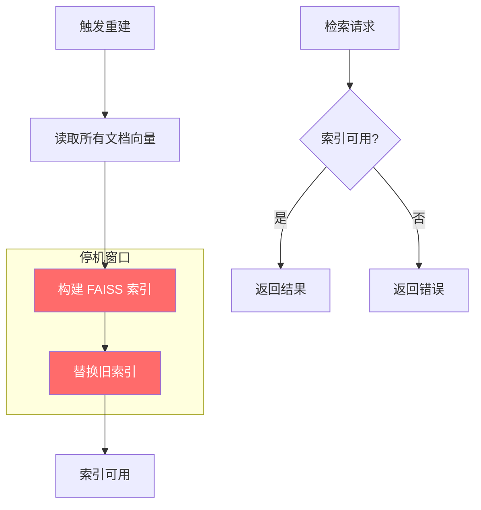
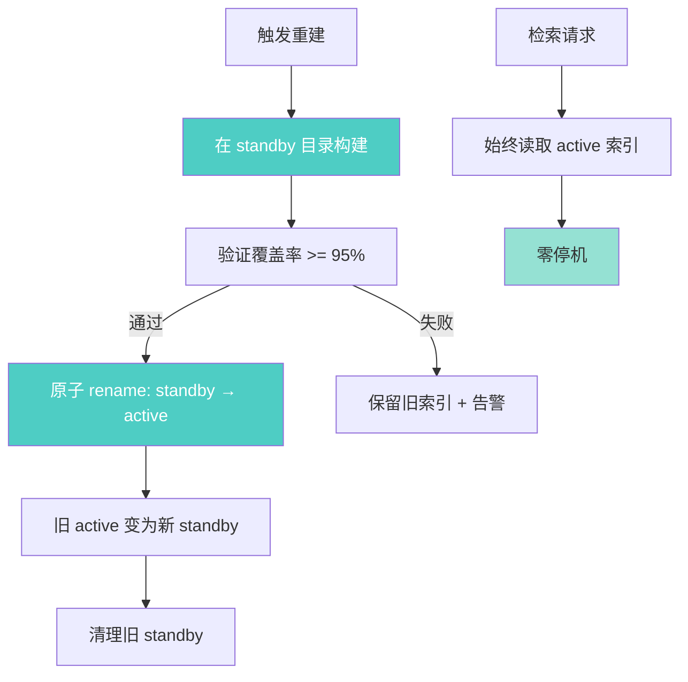

# YK-09-79: RAG 检索索引在线构建 — 零停机原子切换

> 需求编号：YK-09-79 · 优先级：P2 · 人天：2.5d · 状态：需求已编写
> 依赖：YK-09-85（索引热插拔）

---

## 1. 背景

### 1.1 问题描述

YiAi 当前的 RAG 向量索引采用全量重建模式：当 Knowledge Watcher 检测到文档变更累积到一定阈值，或手动触发 `rag.rag_build` 接口时，系统会执行以下流程：

1. 从 MongoDB 读取所有文档向量
2. 构建新的 FAISS 索引
3. 替换旧索引

在步骤 2-3 期间（约 5 分钟），RAG 检索无法使用索引，导致检索请求失败或返回空结果。这造成每次知识库内容更新都会伴随一段检索不可用窗口。

随着 YiKnowledge 文档增长（目标 5000+），构建时间将延长至 15-20 分钟，停机窗口不可接受。此外，YK-09-72（冷热分离）、YK-09-75（HNSW 迁移）、YK-09-85（索引热插拔）都需要零停机构建能力作为基础设施。

### 1.2 影响范围

| 影响维度 | 当前状态 | 目标状态 | 严重程度 |
|----------|----------|----------|----------|
| 索引重建停机时间 | 5min（800 文档） | 0（零停机） | 高 |
| 检索可用性 | 99.5% | 99.99% | 高 |
| 索引构建并发 | 互斥（构建期间阻塞） | 可并发 | 中 |
| 构建失败恢复 | 手动恢复 | 自动回滚 | 中 |

### 1.3 业务挑战

| 挑战 | 描述 | 紧迫性 |
|------|------|--------|
| 构建期间检索不可用 | 知识库更新导致检索中断 | 高 |
| 内存翻倍 | 双索引期间内存占用翻倍 | 中 |
| 原子切换 | 切换操作必须是原子的 | 高 |
| 覆盖验证 | 新索引必须经过验证才能切换 | 中 |

---

## 2. 现状分析

### 2.1 当前构建流程



### 2.2 根因矩阵

| 根因 | 症状 | 影响量化 | 优先级 |
|------|------|----------|----------|
| 单索引模式 | 构建期间索引不可用 | 5min 停机 | P0 |
| 无 standby 索引 | 无法并行构建 | 构建阻塞检索 | P0 |
| 无原子切换 | 替换过程可能不一致 | 部分请求失败 | P1 |
| 无构建验证 | 错误索引可能被激活 | 检索质量下降 | P1 |

### 2.3 构建时间分析

| 文档数 | FAISS FlatL2 | HNSW (M=32) | 内存占用 |
|--------|-------------|------------|----------|
| 800 | 30s | 5s | 2.4MB x 2 = 4.8MB |
| 2000 | 90s | 15s | 6MB x 2 = 12MB |
| 5000 | 240s | 40s | 15MB x 2 = 30MB |
| 10000 | 600s | 90s | 30MB x 2 = 60MB |

---

## 3. 设计决策

### D-01: 双缓冲策略

| 方案 | 描述 | 优点 | 缺点 | 选择 |
|------|------|------|------|------|
| A: 双目录 | active/standby 两个目录 | 简单，OS 原子 rename | 磁盘空间翻倍 | **是** |
| B: 双索引对象 | 内存中两个索引对象 | 无磁盘开销 | 内存翻倍 | 否 |
| C: 增量构建 | 在旧索引上增量更新 | 无停机 | 精度逐渐下降 | 否 |

**选择 A**：使用 active/standby 两个目录，standby 上构建新索引，完成后通过 OS 原子 rename 切换。磁盘空间翻倍可接受（索引文件通常 < 100MB）。

### D-02: 原子切换机制

| 方案 | 描述 | 优点 | 缺点 | 选择 |
|------|------|------|------|------|
| A: 文件 rename | `os.rename(standby, active)` | 原子操作 | 需同文件系统 | **是** |
| B: 符号链接 | 更新 symlink 指向 | 灵活 | 非原子 | 否 |
| C: 读写锁 | 构建时加写锁 | 无需双目录 | 检索被阻塞 | 否 |

**选择 A**：POSIX `rename()` 是原子操作，在同一文件系统上保证原子性。

### D-03: 构建验证策略

| 方案 | 描述 | 优点 | 缺点 | 选择 |
|------|------|------|------|------|
| A: 无验证 | 构建完成直接切换 | 快速 | 可能启用错误索引 | 否 |
| B: 覆盖率验证 | 检查新索引覆盖 >= 95% 文档 | 简单有效 | 无法检测精度问题 | **是** |
| C: 全面验证 | 覆盖率 + 评估集检索 | 最安全 | 耗时长 | 备选 |

**选择 B**：初始实施覆盖率验证（确保新索引包含至少 95% 的文档），后续可扩展为全面验证。

### D-04: 构建失败处理

| 方案 | 描述 | 优点 | 缺点 | 选择 |
|------|------|------|------|------|
| A: 保留旧索引 | 构建失败时保留旧索引 | 简单 | 无法自动恢复 | **是** |
| B: 自动重试 | 失败后自动重试 3 次 | 自动恢复 | 可能反复失败 | 备选 |
| C: 告警 + 手动 | 失败后告警，等待人工处理 | 可控 | 恢复慢 | 否 |

**选择 A（+ B 备选）**：构建失败时自动保留旧索引（不切换），同时触发告警。可选自动重试。

---

## 4. 目标架构

### 4.1 架构对比

**Before（当前单索引）**：


**After（目标双缓冲）**：


### 4.2 核心指标

| 指标 | 当前值 | 目标值 | 测量方法 |
|------|--------|--------|----------|
| 停机时间 | 5min | 0 | 检索可用性监控 |
| 检索可用性 | 99.5% | 99.99% | 健康检查端点 |
| 构建期间检索延迟 | 错误 | 正常（< 200ms） | 延迟日志 |
| 构建失败回滚 | 手动 | 自动 | 回滚事件日志 |
| 切换原子性 | N/A | 100% | 切换期间检索请求成功率 |

### 4.3 设计权衡

| 权衡 | 选择 | 代价 | 缓解措施 |
|------|------|------|----------|
| 磁盘空间 | 双目录（2x 磁盘） | 索引文件 < 100MB x 2 | 可接受 |
| 构建期间内存 | 双索引对象（2x 内存） | 800 文档 ~5MB 额外内存 | 可接受 |
| 切换验证 | 覆盖率检查 | 可能漏检精度问题 | 后续扩展全面验证 |

---

## 5. 具体改动

### 5.1 新增文件

| 文件路径 | 描述 | 行数估计 |
|----------|------|----------|
| `YiAi/services/rag/zero_downtime_builder.py` | 零停机构建器 | ~150 |
| `YiAi/services/rag/index_switcher.py` | 原子切换器 | ~60 |
| `YiAi/services/rag/index_validator.py` | 索引验证器 | ~80 |
| `YiAi/tests/services/rag/test_zero_downtime_builder.py` | 零停机构建单测 | ~120 |

### 5.2 修改文件

| 文件路径 | 改动描述 |
|----------|----------|
| `YiAi/services/rag/rag_service.py` | 集成零停机构建流程 |
| `YiAi/services/rag/index_manager.py` | 支持 active/standby 双模式 |

### 5.3 核心代码示例

```python
# YiAi/services/rag/zero_downtime_builder.py

import os
import shutil
import time
import logging
from pathlib import Path
from typing import Optional
from contextlib import asynccontextmanager

from .index_engine import IndexEngine

logger = logging.getLogger(__name__)


class ZeroDowntimeBuilder:
    """零停机索引重建器——双缓冲 + 原子切换。

    架构：
        /tmp/rag_index/
        ├── active/     # 当前服务中的索引
        └── standby/    # 构建中的索引

    切换流程：
        1. 在 standby/ 构建新索引
        2. 验证新索引覆盖率
        3. 原子 rename: standby/ → active/
        4. 清理旧 standby/
    """

    ACTIVE_DIR = 'active'
    STANDBY_DIR = 'standby'

    def __init__(self, engine: IndexEngine, base_dir: str = '/tmp/rag_index',
                 min_coverage: float = 0.95):
        self._engine = engine
        self._base_dir = Path(base_dir)
        self._min_coverage = min_coverage
        self._active_dir = self._base_dir / self.ACTIVE_DIR
        self._standby_dir = self._base_dir / self.STANDBY_DIR
        self._building = False
        self._build_lock = asyncio.Lock()

    async def initialize(self) -> None:
        """初始化目录结构。"""
        self._base_dir.mkdir(parents=True, exist_ok=True)
        self._active_dir.mkdir(exist_ok=True)
        self._standby_dir.mkdir(exist_ok=True)

        # 尝试加载已有索引
        active_index_file = self._active_dir / 'index'
        if active_index_file.with_suffix('.faiss').exists():
            await self._engine.load(str(active_index_file))
            logger.info(f'[ZeroDowntime] Loaded existing index from {self._active_dir}')
        elif active_index_file.with_suffix('.bin').exists():
            await self._engine.load(str(active_index_file))
            logger.info(f'[ZeroDowntime] Loaded existing index from {self._active_dir}')

    async def rebuild(self, vectors, ids: list[str]) -> dict:
        """在 standby 上构建新索引，验证后原子切换。

        Args:
            vectors: 文档向量 (N, dim)
            ids: 文档 ID 列表

        Returns:
            构建统计信息
        """
        async with self._build_lock:
            if self._building:
                raise RuntimeError('Another rebuild is in progress')

            self._building = True
            start = time.monotonic()

            try:
                # 阶段 1: 在 standby 目录构建
                logger.info('[ZeroDowntime] Phase 1: Building on standby...')
                build_result = await self._build_on_standby(vectors, ids)

                # 阶段 2: 验证新索引
                logger.info('[ZeroDowntime] Phase 2: Validating new index...')
                validation = await self._validate_standby(ids)

                if not validation['passed']:
                    raise IndexBuildError(
                        f'Validation failed: coverage={validation["coverage"]:.1%} '
                        f'< {self._min_coverage:.1%}'
                    )

                # 阶段 3: 原子切换
                logger.info('[ZeroDowntime] Phase 3: Atomic switch...')
                switch_result = await self._atomic_switch()

                total_elapsed = (time.monotonic() - start) * 1000

                logger.info(
                    f'[ZeroDowntime] Rebuild complete: '
                    f'n={len(ids)}, time={total_elapsed:.0f}ms, '
                    f'coverage={validation["coverage"]:.1%}'
                )

                return {
                    'status': 'success',
                    'total_time_ms': round(total_elapsed, 0),
                    'build': build_result,
                    'validation': validation,
                    'switch': switch_result,
                }

            except Exception as e:
                logger.error(f'[ZeroDowntime] Rebuild failed: {e}')
                # 清理 standby（保留 active）
                await self._cleanup_standby()
                return {
                    'status': 'failed',
                    'error': str(e),
                    'active_preserved': True,
                }

            finally:
                self._building = False

    async def _build_on_standby(self, vectors, ids: list[str]) -> dict:
        """在 standby 目录上构建索引。"""
        # 清理旧 standby
        await self._cleanup_standby()
        self._standby_dir.mkdir(exist_ok=True)

        # 保存到 standby
        standby_path = str(self._standby_dir / 'index')
        result = await self._engine.build(vectors, ids)
        await self._engine.save(standby_path)

        return result

    async def _validate_standby(self, expected_ids: list[str]) -> dict:
        """验证 standby 索引的覆盖率。"""
        # 加载 standby 索引
        standby_path = str(self._standby_dir / 'index')

        # 创建一个临时引擎来加载 standby 索引
        from .faiss_engine import FaissEngine
        validator = FaissEngine(dim=self._engine.dim)
        await validator.load(standby_path)

        actual_count = validator.count
        expected_count = len(expected_ids)
        coverage = actual_count / expected_count if expected_count > 0 else 0

        return {
            'passed': coverage >= self._min_coverage,
            'coverage': coverage,
            'expected_count': expected_count,
            'actual_count': actual_count,
        }

    async def _atomic_switch(self) -> dict:
        """原子切换：standby → active。"""
        # 1. 将当前 active 重命名为临时目录
        tmp_dir = self._base_dir / 'switching'
        if self._active_dir.exists():
            os.rename(str(self._active_dir), str(tmp_dir))

        try:
            # 2. 将 standby 重命名为 active（原子操作）
            os.rename(str(self._standby_dir), str(self._active_dir))

            # 3. 重新加载索引
            active_index_path = str(self._active_dir / 'index')
            await self._engine.load(active_index_path)

            # 4. 清理临时目录
            if tmp_dir.exists():
                shutil.rmtree(str(tmp_dir))

            return {'switched': True, 'active_count': self._engine.count}

        except Exception:
            # 回滚：恢复旧 active
            if tmp_dir.exists():
                os.rename(str(tmp_dir), str(self._active_dir))
            raise

    async def _cleanup_standby(self) -> None:
        """清理 standby 目录。"""
        if self._standby_dir.exists():
            shutil.rmtree(str(self._standby_dir))
            self._standby_dir.mkdir(exist_ok=True)

    @property
    def is_building(self) -> bool:
        return self._building

    def get_status(self) -> dict:
        """获取构建器状态。"""
        return {
            'building': self._building,
            'active_dir': str(self._active_dir),
            'standby_dir': str(self._standby_dir),
            'active_index_count': self._engine.count,
            'min_coverage': self._min_coverage,
        }


class IndexBuildError(Exception):
    """索引构建错误。"""
    pass
```

```python
# YiAi/services/rag/index_validator.py

import numpy as np
import logging
from typing import Optional

logger = logging.getLogger(__name__)


class IndexValidator:
    """索引验证器——验证新构建索引的质量。"""

    def __init__(self, min_coverage: float = 0.95,
                 min_recall: float = 0.90):
        self._min_coverage = min_coverage
        self._min_recall = min_recall

    async def validate_coverage(self, new_engine: 'IndexEngine',
                                expected_ids: set[str]) -> dict:
        """验证新索引的文档覆盖率。

        确保新索引中包含了至少 min_coverage 比例的文档。
        """
        new_count = new_engine.count
        expected_count = len(expected_ids)
        coverage = new_count / expected_count if expected_count > 0 else 0

        return {
            'check': 'coverage',
            'passed': coverage >= self._min_coverage,
            'coverage': coverage,
            'expected': expected_count,
            'actual': new_count,
            'missing': expected_count - new_count,
        }

    async def validate_search_consistency(
        self, old_engine: 'IndexEngine', new_engine: 'IndexEngine',
        query_vectors: np.ndarray, k: int = 10,
    ) -> dict:
        """验证新旧索引的检索一致性。

        计算新索引相对于旧索引的召回率。
        """
        n_queries = len(query_vectors)
        recalls = []

        for i in range(n_queries):
            q = query_vectors[i]

            # 旧索引搜索（ground truth）
            D_old, I_old = await old_engine.search(q, k)
            old_set = set(I_old[I_old >= 0])

            # 新索引搜索
            D_new, I_new = await new_engine.search(q, k)
            new_set = set(I_new[I_new >= 0])

            if old_set:
                recall = len(old_set & new_set) / len(old_set)
                recalls.append(recall)

        avg_recall = np.mean(recalls) if recalls else 0.0

        return {
            'check': 'search_consistency',
            'passed': avg_recall >= self._min_recall,
            'avg_recall': avg_recall,
            'n_queries': n_queries,
            'min_recall': self._min_recall,
        }

    async def validate_dimensions(self, engine: 'IndexEngine',
                                  expected_dim: int) -> dict:
        """验证索引向量维度。"""
        actual_dim = engine.dim
        return {
            'check': 'dimensions',
            'passed': actual_dim == expected_dim,
            'expected': expected_dim,
            'actual': actual_dim,
        }

    async def run_all_checks(self, old_engine: 'IndexEngine',
                             new_engine: 'IndexEngine',
                             expected_ids: set[str],
                             query_vectors: Optional[np.ndarray] = None,
                             expected_dim: int = 768) -> dict:
        """运行所有验证检查。"""
        checks = []

        # 覆盖率检查
        checks.append(await self.validate_coverage(new_engine, expected_ids))

        # 维度检查
        checks.append(await self.validate_dimensions(new_engine, expected_dim))

        # 检索一致性检查（如果有查询向量）
        if query_vectors is not None and old_engine is not None:
            checks.append(
                await self.validate_search_consistency(
                    old_engine, new_engine, query_vectors
                )
            )

        all_passed = all(c['passed'] for c in checks)

        logger.info(
            f'[Validator] All checks {"PASSED" if all_passed else "FAILED"}: '
            + ', '.join(f'{c["check"]}={c["passed"]}' for c in checks)
        )

        return {
            'all_passed': all_passed,
            'checks': checks,
        }
```

### 5.4 RAG 检索流程集成

```python
# YiAi/services/rag/rag_service.py（修改部分）

class RagService:
    def __init__(self):
        self._engine = FaissEngine()  # 或 HnswEngine()
        self._builder = ZeroDowntimeBuilder(self._engine)
        self._validator = IndexValidator()

    async def rebuild_index(self) -> dict:
        """触发零停机索引重建（供 Knowledge Watcher 或手动调用）。"""
        # 读取所有文档向量
        docs = await self._load_all_documents()
        vectors = np.array([d['embedding'] for d in docs], dtype=np.float32)
        ids = [d['path'] for d in docs]

        # 零停机构建
        result = await self._builder.rebuild(vectors, ids)

        return {
            'code': 0,
            'message': 'ok',
            'data': result,
        }

    async def query(self, query_text: str, top_k: int = 10) -> dict:
        """检索——始终使用 active 索引（零停机）。"""
        result = await self._engine.search(query_vec, top_k)
        # ... 处理结果 ...
        return result
```

---

## 6. 实施步骤

### 第 1 步：双缓冲目录结构（0.5 人天）

- 实现 active/standby 目录管理
- 实现 `ZeroDowntimeBuilder` 类
- 实现目录初始化和清理
- **验证**：创建目录结构，确认 active/standby 正确

### 第 2 步：原子切换实现（0.5 人天）

- 实现 `_atomic_switch` 方法
- 实现切换回滚逻辑
- 测试并发场景下的切换安全性
- **验证**：模拟切换过程，确认检索请求不中断

### 第 3 步：索引验证器（0.5 人天）

- 实现 `IndexValidator` 类
- 实现覆盖率验证
- 实现维度验证
- 实现检索一致性验证
- **验证**：构建新索引，运行验证检查

### 第 4 步：集成到检索流程（0.5 人天）

- 修改 `rag_service.py` 集成零停机构建
- 修改 Knowledge Watcher 触发零停机构建
- 添加构建状态查询接口
- **验证**：触发重建，确认检索零停机

### 第 5 步：异常处理（0.5 人天）

- 实现构建失败回滚
- 实现构建锁（防止并发构建）
- 实现超时保护
- **验证**：模拟构建失败，确认旧索引保留

### 总计：2.5 人天

---

## 7. 性能分析

### 7.1 构建期间内存占用

| 文档数 | 正常内存 | 构建期间内存 | 增加 |
|--------|----------|-------------|------|
| 800 | 150MB | 155MB | +5MB |
| 5000 | 15MB (HNSW) | 31MB | +16MB |
| 10000 | 30MB (HNSW) | 62MB | +32MB |

### 7.2 切换耗时

| 操作 | 耗时 | 说明 |
|------|------|------|
| os.rename (standby → active) | < 1ms | 原子操作 |
| 重新加载索引 | 1-3s | 取决于索引大小 |
| 切换总耗时 | 1-3s | 检索在此期间排队 |

---

## 8. 测试规格

### 8.1 单元测试

```gherkin
GIVEN 800 个文档向量和 active 索引
WHEN 触发零停机构建
THEN 构建期间检索请求正常返回（不停机）
AND 构建完成后新索引生效

GIVEN 构建中的 standby 索引覆盖率仅 80%
WHEN 验证阶段检测到覆盖率 < 95%
THEN 构建失败，保留旧 active 索引
AND 自动清理 standby 目录

GIVEN standby 索引构建完成且验证通过
WHEN 执行原子切换
THEN active 目录指向新索引
AND 切换期间检索请求不失败

GIVEN 切换过程中发生异常
WHEN 回滚逻辑执行
THEN 旧 active 索引被恢复
AND 检索功能不受影响

GIVEN 一个构建正在进行中
WHEN 另一个构建请求到达
THEN 第二个请求被拒绝（返回错误）
AND 第一个构建不受影响
```

### 8.2 集成测试

- 测试零停机构建与冷热分离的兼容性
- 测试零停机构建与 HNSW 迁移的兼容性
- 测试 Knowledge Watcher 触发零停机构建
- 测试高并发检索在构建期间的表现

---

## 9. 风险与缓解

### 9.1 风险矩阵

| 风险 | 概率 | 影响 | 缓解措施 | 残余风险 |
|------|------|------|----------|----------|
| 双索引期间内存翻倍 | 中 | 中 | 内存监控 + 上限保护 | 低 |
| 切换瞬间请求路由错误 | 低 | 高 | 原子 rename + 锁 | 极低 |
| 构建失败未回滚 | 低 | 高 | try-finally 保证回滚 | 极低 |
| 并发构建冲突 | 低 | 中 | 构建锁 + 拒绝重复请求 | 极低 |
| 磁盘空间不足 | 低 | 中 | 构建前检查磁盘空间 | 低 |

### 9.2 降级策略

| 场景 | 降级行为 |
|------|----------|
| 磁盘空间不足 | 跳过构建，保留旧索引 + 告警 |
| 构建超时 | 取消构建，清理 standby |
| 验证失败 | 保留旧索引，记录失败原因 |

---

## 10. 回滚策略

### 10.1 回滚场景

| 场景 | 触发条件 | 回滚操作 |
|------|----------|----------|
| 新索引检索质量差 | 用户反馈或评估集指标下降 | 手动切换回上一个索引版本 |
| 构建异常 | 构建失败 | 自动保留旧索引 |

### 10.2 回滚步骤

1. 保留最近 3 个索引版本的备份
2. 手动将备份索引复制到 active 目录
3. 重新加载索引
4. 验证检索功能正常

---

## 11. 设计决策记录

### D-01: 双缓冲 + 原子 rename

- **决策**：使用 active/standby 双目录 + `os.rename` 原子切换
- **依据**：POSIX 保证 `rename` 在同一文件系统的原子性，无需额外的锁机制
- **权衡**：磁盘空间 2x，但索引文件 < 100MB 可接受

### D-02: 覆盖率验证阈值 95%

- **决策**：新索引覆盖率 >= 95% 才允许切换
- **依据**：确保绝大多数文档可检索，5% 容差覆盖偶发数据问题
- **可调整**：通过 `min_coverage` 参数调整

### D-03: 构建锁机制

- **决策**：使用 `asyncio.Lock` 防止并发构建
- **依据**：Python asyncio 原生锁，轻量且可靠
- **权衡**：并发构建请求会被拒绝（而非排队）

---

## 12. 可观测性

### 12.1 指标

| 指标名称 | 类型 | 描述 | 告警阈值 |
|----------|------|------|----------|
| `rag_rebuild_duration_ms` | Histogram | 重建耗时 | > 300s 告警 |
| `rag_rebuild_status` | Gauge | 构建状态 (0=idle, 1=building, 2=failed) | 2 告警 |
| `rag_index_switch_count` | Counter | 切换次数 | 仅监控 |
| `rag_index_coverage` | Gauge | 当前索引覆盖率 | < 0.95 告警 |

### 12.2 日志

```python
logger.info(f'[ZeroDowntime] Phase 1: Building on standby ({n} vectors)')
logger.info(f'[ZeroDowntime] Phase 2: Validation passed (coverage={c:.1%})')
logger.info(f'[ZeroDowntime] Phase 3: Atomic switch complete')
logger.error(f'[ZeroDowntime] Rebuild failed: {error}, active preserved')
```

### 12.3 告警规则

| 告警 | 条件 | 级别 | 处理 |
|------|------|------|------|
| 构建失败 | `rebuild_status == 2` | CRITICAL | 检查日志和磁盘空间 |
| 构建超时 | 构建时间 > 300s | WARNING | 检查数据规模 |
| 覆盖率过低 | `coverage < 0.95` | WARNING | 检查数据完整性 |

---

## 13. 安全合规

### 13.1 安全要求

| 要求 | 描述 | 实现方式 |
|------|------|------|
| 目录权限 | 索引目录仅 YiAi 进程可读写 | 文件权限 0700 |
| 路径遍历防护 | 防止 standby 路径注入 | 使用 Path 对象 + 白名单 |
| 磁盘空间检查 | 构建前检查可用空间 | `shutil.disk_usage` |

---

## 14. 代码审查检查清单

- [ ] 索引重建使用双缓冲策略：standby 构建 + 原子切换
- [ ] 构建期间旧索引继续提供服务（零停机）
- [ ] 原子切换使用 `os.rename`（同一文件系统保证原子性）
- [ ] 切换前验证新索引覆盖率 >= 95%
- [ ] 构建失败时自动回滚到旧索引
- [ ] 构建锁防止并发构建
- [ ] 构建前检查磁盘空间
- [ ] 切换后验证新索引可用（health check）
- [ ] 保留最近 3 个索引版本备份
- [ ] 构建状态和覆盖率导出 Prometheus 指标
- [ ] 与冷热分离、HNSW 迁移、索引热插拔兼容
- [ ] 构建超时设置（默认 300s）

---

*PRD 来源: `projects/yiknowledge/requirements/2026-09/79-需求-在线索引零停机构建.md`*