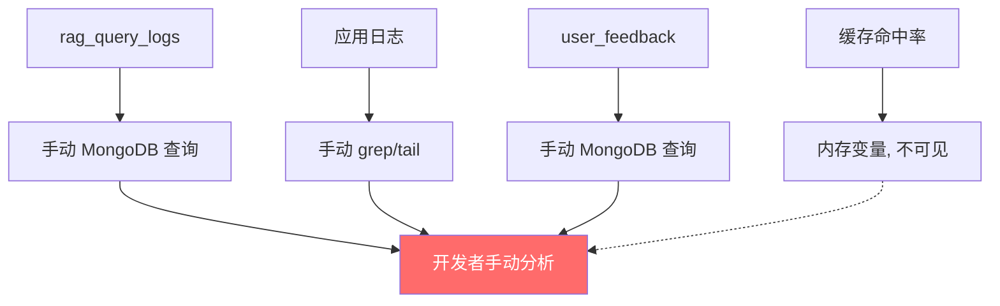

# YK-09-80: RAG 检索实时性能仪表盘 — Grafana 集成监控看板

> 需求编号：YK-09-80 · 优先级：P2 · 人天：2.5d · 状态：需求已编写
> 依赖：YK-09-60（SLO 定义）、YK-09-78（延迟预算）

---

## 1. 背景

### 1.1 问题描述

YiAi 的 RAG 检索系统当前缺乏统一的实时可视化监控。相关数据分散在多个位置：

- **检索延迟**：记录在 `rag_query_logs` MongoDB 集合中，通过 `duration_ms` 字段
- **质量指标**：YK-09-60 定义的 SLO（空结果率、满意度），但无自动聚合
- **用户反馈**：YK-09-07 的点赞/点踩数据，存储在 `user_feedback` 集合中
- **缓存命中率**：YK-09-54 精确缓存和 YK-09-81 语义缓存，各自记录命中率
- **延迟预算违规**：YK-09-78 定义了分阶段延迟预算，但无实时违规统计

这些数据分散在多个日志文件、MongoDB 集合和内存变量中，开发和运维人员难以快速了解 RAG 系统的整体健康状况。当出现性能退化时，需要手动查询多个数据源，平均故障定位时间（MTTD）超过 30 分钟。

### 1.2 影响范围

| 影响维度 | 当前状态 | 目标状态 | 严重程度 |
|----------|----------|----------|----------|
| 故障发现时间 | 手动查询（> 30min） | 实时告警（< 1min） | 高 |
| 性能趋势可见性 | 无 | 30 分钟趋势图 | 高 |
| 多维度关联分析 | 无法关联 | Grafana 多面板联动 | 中 |
| 运维效率 | 低 | 高 | 中 |

### 1.3 业务挑战

| 挑战 | 描述 | 紧迫性 |
|------|------|--------|
| 数据异构 | 延迟、质量、反馈数据在不同系统 | 高 |
| 实时性 | 需要近实时（< 30s）的数据刷新 | 中 |
| 低成本 | 监控不应显著增加系统负载 | 中 |
| 可扩展 | 新指标（如 CLIP 编码延迟）可快速添加 | 低 |

---

## 2. 现状分析

### 2.1 当前监控状态



### 2.2 根因矩阵

| 根因 | 症状 | 影响量化 | 优先级 |
|------|------|----------|----------|
| 无统一指标导出 | 数据分散在多个系统 | MTTD > 30min | P0 |
| 无可视化 | 无趋势图/仪表盘 | 问题发现依赖手动 | P0 |
| 无实时告警 | 性能退化后才被发现 | 用户体验受损 | P1 |
| 无历史数据 | 无法对比历史趋势 | 容量规划无依据 | P1 |

### 2.3 需要监控的指标清单

| 指标类别 | 指标名称 | 数据来源 | 刷新频率 |
|----------|----------|----------|----------|
| 延迟 | P50/P95/P99 检索延迟 | rag_query_logs | 30s |
| 延迟 | 各阶段延迟分布 | YK-09-78 计时器 | 30s |
| 质量 | 空结果率 | rag_query_logs | 30s |
| 质量 | 用户满意度 | user_feedback | 5min |
| 缓存 | 精确缓存命中率 | YK-09-54 | 30s |
| 缓存 | 语义缓存命中率 | YK-09-81 | 30s |
| 索引 | 索引文档数 | FAISS/HNSW | 5min |
| 索引 | 冷热数据比例 | YK-09-72 | 5min |
| 预算 | 延迟预算违规次数 | YK-09-78 | 30s |
| 错误 | 检索失败率 | 应用日志 | 30s |

---

## 3. 设计决策

### D-01: 指标导出方式

| 方案 | 描述 | 优点 | 缺点 | 选择 |
|------|------|------|------|------|
| A: Prometheus 端点 | 实现 `/metrics` 端点，Prometheus 抓取 | 标准，生态丰富 | 需要 Prometheus 部署 | **是** |
| B: 直接写 MongoDB | 定期写入 MongoDB 集合 | 无需额外组件 | 不支持 Grafana 原生集成 | 否 |
| C: InfluxDB | 使用时序数据库 | 高性能 | 额外依赖 | 否 |

**选择 A**：实现 Prometheus `/metrics` 端点，Grafana 通过 Prometheus 数据源消费。Prometheus + Grafana 是业界标准组合，YiAi 已有部分基础设施。

### D-02: 指标聚合方式

| 方案 | 描述 | 优点 | 缺点 | 选择 |
|------|------|------|------|------|
| A: 实时聚合 | 每次 `/metrics` 请求时查询 MongoDB | 数据最新 | 查询负载高 | 否 |
| B: 定时预聚合 | 定时任务聚合后存入内存 | 低负载 | 数据有延迟 | **是** |
| C: 混合模式 | 快速指标实时，慢指标预聚合 | 平衡 | 稍复杂 | 备选 |

**选择 B**：后台定时任务（30s 间隔）预聚合指标到内存字典，`/metrics` 端点仅读取内存数据，避免高频 MongoDB 查询。

### D-03: Grafana 面板布局

采用的 4+4 面板布局：顶部 4 个关键指标数值，下方 4 个可视化面板。

### D-04: 告警集成

| 方案 | 描述 | 优点 | 缺点 | 选择 |
|------|------|------|------|------|
| A: Grafana Alerting | Grafana 内置告警 | 统一管理 | 依赖 Grafana | **是** |
| B: Prometheus AlertManager | 独立告警管理 | 更灵活 | 额外组件 | 否 |
| C: 应用内告警 | 代码中触发告警 | 无需外部 | 分散 | 否 |

**选择 A**：Grafana 内置告警规则，配置简单，与仪表盘统一管理。

---

## 4. 目标架构

### 4.1 数据流

```mermaid
graph TD
    A[RAG 检索请求] --> B[rag_query_logs]
    A --> C[LatencyTracker 计时]
    A --> D[缓存命中/未命中]
    A --> E[用户反馈]

    F[定时聚合任务 30s] --> G[内存指标字典]
    B --> F
    C --> F
    D --> F
    E --> F

    G --> H[/metrics 端点]
    H --> I[Prometheus]
    I --> J[Grafana 仪表盘]

    J --> K[告警通知]

    subgraph YiAi 内部
        A
        B
        C
        D
        E
        F
        G
        H
    end

    style J fill:#4ecdc4,color:#fff
    style K fill:#ffe66d,color:#333
```

### 4.2 仪表盘布局

```
┌─ RAG 检索实时性能仪表盘 ─────────────────────────────────────────────────┐
│ ┌──────────────┐ ┌──────────────┐ ┌──────────────┐ ┌──────────────┐       │
│ │ P95 延迟     │ │ 空结果率     │ │ 满意度       │ │ 缓存命中率   │       │
│ │   850ms      │ │   3.2%       │ │   82%        │ │   38%        │       │
│ │  ▲ 12% vs 1h │ │  ▼ 0.5%     │ │  ▲ 3%        │ │  ▼ 5%        │       │
│ └──────────────┘ └──────────────┘ └──────────────┘ └──────────────┘       │
├───────────────────────────────────────────────────────────────────────────┤
│ 📈 延迟趋势 (30min)                    │ 📊 慢查询 Top 10                   │
│                                        │                                   │
│ P50 / P95 / P99 折线图                 │ 查询文本 + 延迟条形图               │
├───────────────────────────────────────────────────────────────────────────┤
│ 🥧 查询意图分布                        │ ⚙️  分阶段延迟堆叠图               │
│                                        │                                   │
│ 短查询/中查询/长查询/代码查询 饼图      │ Embedding/BM25/FAISS/Rerank 堆叠   │
├───────────────────────────────────────────────────────────────────────────┤
│ 📋 最近错误日志                        │ ⚠️  延迟预算违规                   │
│                                        │                                   │
│ 最近 20 条 WARNING/ERROR 日志          │ 各阶段违规次数 + 降级事件          │
└───────────────────────────────────────────────────────────────────────────┘
```

### 4.3 核心指标

| 指标 | 目标 | 当前（基线） | 告警阈值 |
|------|------|-------------|----------|
| P95 延迟 | < 200ms | 200ms | > 300ms |
| 空结果率 | < 5% | 3.2% | > 10% |
| 满意度 | > 80% | 82% | < 70% |
| 缓存命中率 | > 30% | 38% | < 20% |

---

## 5. 具体改动

### 5.1 新增文件

| 文件路径 | 描述 | 行数估计 |
|----------|------|----------|
| `YiAi/services/rag/metrics/rag_metrics.py` | RAG 指标收集器 | ~120 |
| `YiAi/services/rag/metrics/metrics_aggregator.py` | 定时聚合任务 | ~80 |
| `YiAi/services/rag/metrics/prometheus_exporter.py` | Prometheus 指标导出 | ~80 |
| `YiAi/routes/metrics_routes.py` | `/metrics` 路由端点 | ~40 |
| `YiAi/grafana/rag_dashboard.json` | Grafana 仪表盘 JSON | ~200 |
| `YiAi/tests/services/rag/metrics/test_rag_metrics.py` | 指标单测 | ~100 |

### 5.2 修改文件

| 文件路径 | 改动描述 |
|----------|----------|
| `YiAi/main.py` | 注册 `/metrics` 路由和聚合任务 |
| `YiAi/services/rag/rag_service.py` | 检索时记录指标 |

### 5.3 核心代码示例

```python
# YiAi/services/rag/metrics/rag_metrics.py

from dataclasses import dataclass, field
from collections import defaultdict
import threading
import time
import logging

logger = logging.getLogger(__name__)


@dataclass
class RagMetricsSnapshot:
    """RAG 指标快照——存储预聚合的指标数据。"""
    # 延迟指标
    latency_p50_ms: float = 0.0
    latency_p95_ms: float = 0.0
    latency_p99_ms: float = 0.0

    # 阶段延迟
    stage_latency_p95: dict[str, float] = field(default_factory=dict)

    # 质量指标
    empty_result_rate: float = 0.0
    satisfaction_rate: float = 0.0
    avg_result_count: float = 0.0

    # 缓存指标
    cache_hit_rate: float = 0.0
    semantic_cache_hit_rate: float = 0.0

    # 系统指标
    index_doc_count: int = 0
    hot_doc_count: int = 0
    cold_doc_count: int = 0

    # 预算违规
    budget_violations_total: int = 0
    degradation_events_total: int = 0

    # 错误
    error_rate: float = 0.0
    query_rate_per_min: float = 0.0

    updated_at: float = 0.0


class RagMetricsCollector:
    """RAG 指标收集器——收集原始指标数据供聚合器使用。"""

    def __init__(self, max_samples: int = 10000):
        self._max_samples = max_samples
        self._lock = threading.Lock()

        # 延迟样本（用于计算分位数）
        self._latency_samples: list[float] = []
        self._stage_latency_samples: dict[str, list[float]] = defaultdict(list)

        # 计数器
        self._total_queries: int = 0
        self._empty_results: int = 0
        self._errors: int = 0
        self._cache_hits: int = 0
        self._semantic_cache_hits: int = 0
        self._budget_violations: int = 0
        self._degradation_events: int = 0

        # 满意度
        self._satisfaction_scores: list[float] = []

        # 结果计数
        self._result_counts: list[int] = []

        # 查询速率
        self._query_timestamps: list[float] = []

    def record_query(self, latency_ms: float, stage_timings: dict[str, float],
                     result_count: int, cache_hit: bool = False,
                     semantic_cache_hit: bool = False,
                     budget_violations: int = 0,
                     degraded: bool = False) -> None:
        """记录一次检索请求的指标。"""
        with self._lock:
            self._total_queries += 1

            # 延迟
            self._latency_samples.append(latency_ms)
            if len(self._latency_samples) > self._max_samples:
                self._latency_samples = self._latency_samples[-self._max_samples:]

            # 阶段延迟
            for stage, elapsed in stage_timings.items():
                self._stage_latency_samples[stage].append(elapsed)
                if len(self._stage_latency_samples[stage]) > self._max_samples:
                    self._stage_latency_samples[stage] = \
                        self._stage_latency_samples[stage][-self._max_samples:]

            # 结果
            self._result_counts.append(result_count)
            if result_count == 0:
                self._empty_results += 1

            # 缓存
            if cache_hit:
                self._cache_hits += 1
            if semantic_cache_hit:
                self._semantic_cache_hits += 1

            # 预算
            self._budget_violations += budget_violations
            if degraded:
                self._degradation_events += 1

            # 速率
            self._query_timestamps.append(time.time())

    def record_error(self) -> None:
        """记录一次检索错误。"""
        with self._lock:
            self._errors += 1
            self._total_queries += 1

    def record_satisfaction(self, score: float) -> None:
        """记录用户满意度评分。"""
        with self._lock:
            self._satisfaction_scores.append(score)

    def get_snapshot(self) -> RagMetricsSnapshot:
        """获取当前指标快照。"""
        with self._lock:
            snapshot = RagMetricsSnapshot()
            snapshot.updated_at = time.time()

            if self._latency_samples:
                sorted_lat = sorted(self._latency_samples)
                n = len(sorted_lat)
                snapshot.latency_p50_ms = sorted_lat[int(n * 0.50)]
                snapshot.latency_p95_ms = sorted_lat[int(n * 0.95)]
                snapshot.latency_p99_ms = sorted_lat[int(n * 0.99)]

            # 阶段延迟 P95
            for stage, samples in self._stage_latency_samples.items():
                if samples:
                    sorted_s = sorted(samples)
                    snapshot.stage_latency_p95[stage] = \
                        sorted_s[int(len(sorted_s) * 0.95)]

            # 质量
            if self._total_queries > 0:
                snapshot.empty_result_rate = self._empty_results / self._total_queries
                snapshot.error_rate = self._errors / self._total_queries

            if self._satisfaction_scores:
                snapshot.satisfaction_rate = (
                    sum(self._satisfaction_scores) / len(self._satisfaction_scores)
                )

            if self._result_counts:
                snapshot.avg_result_count = (
                    sum(self._result_counts) / len(self._result_counts)
                )

            # 缓存
            if self._total_queries > 0:
                snapshot.cache_hit_rate = self._cache_hits / self._total_queries
                snapshot.semantic_cache_hit_rate = (
                    self._semantic_cache_hits / self._total_queries
                )

            # 预算
            snapshot.budget_violations_total = self._budget_violations
            snapshot.degradation_events_total = self._degradation_events

            # 速率（最近 1 分钟）
            now = time.time()
            recent_queries = sum(
                1 for ts in self._query_timestamps if ts > now - 60
            )
            snapshot.query_rate_per_min = recent_queries

            return snapshot

    def reset_counters(self) -> None:
        """重置计数器（保留延迟样本）。"""
        with self._lock:
            self._total_queries = 0
            self._empty_results = 0
            self._errors = 0
            self._cache_hits = 0
            self._semantic_cache_hits = 0
            self._budget_violations = 0
            self._degradation_events = 0
```

```python
# YiAi/services/rag/metrics/prometheus_exporter.py

from prometheus_client import Gauge, Histogram, Counter, generate_latest, REGISTRY
import logging

logger = logging.getLogger(__name__)


class PrometheusExporter:
    """Prometheus 指标导出器——将 RAG 指标导出为 Prometheus 格式。"""

    def __init__(self):
        # 延迟指标
        self._latency_p50 = Gauge(
            'rag_query_latency_p50_ms',
            'RAG query latency P50 in milliseconds',
        )
        self._latency_p95 = Gauge(
            'rag_query_latency_p95_ms',
            'RAG query latency P95 in milliseconds',
        )
        self._latency_p99 = Gauge(
            'rag_query_latency_p99_ms',
            'RAG query latency P99 in milliseconds',
        )

        # 阶段延迟
        self._stage_latency_p95 = Gauge(
            'rag_stage_latency_p95_ms',
            'RAG stage latency P95 in milliseconds',
            ['stage'],
        )

        # 质量指标
        self._empty_result_rate = Gauge(
            'rag_empty_result_rate',
            'RAG empty result rate (0-1)',
        )
        self._satisfaction_rate = Gauge(
            'rag_satisfaction_rate',
            'RAG user satisfaction rate (0-1)',
        )
        self._avg_result_count = Gauge(
            'rag_avg_result_count',
            'RAG average result count per query',
        )

        # 缓存指标
        self._cache_hit_rate = Gauge(
            'rag_cache_hit_rate',
            'RAG exact cache hit rate (0-1)',
        )
        self._semantic_cache_hit_rate = Gauge(
            'rag_semantic_cache_hit_rate',
            'RAG semantic cache hit rate (0-1)',
        )

        # 系统指标
        self._index_doc_count = Gauge(
            'rag_index_doc_count',
            'RAG index total document count',
        )
        self._hot_doc_count = Gauge(
            'rag_hot_doc_count',
            'RAG hot tier document count',
        )
        self._cold_doc_count = Gauge(
            'rag_cold_doc_count',
            'RAG cold tier document count',
        )

        # 预算违规
        self._budget_violations = Counter(
            'rag_budget_violations_total',
            'RAG latency budget violations total',
        )
        self._degradation_events = Counter(
            'rag_degradation_events_total',
            'RAG degradation events total',
        )

        # 错误
        self._error_rate = Gauge(
            'rag_error_rate',
            'RAG query error rate (0-1)',
        )
        self._query_rate = Gauge(
            'rag_query_rate_per_min',
            'RAG query rate per minute',
        )

    def update_from_snapshot(self, snapshot) -> None:
        """从指标快照更新 Prometheus 指标。"""
        self._latency_p50.set(snapshot.latency_p50_ms)
        self._latency_p95.set(snapshot.latency_p95_ms)
        self._latency_p99.set(snapshot.latency_p99_ms)

        for stage, p95 in snapshot.stage_latency_p95.items():
            self._stage_latency_p95.labels(stage=stage).set(p95)

        self._empty_result_rate.set(snapshot.empty_result_rate)
        self._satisfaction_rate.set(snapshot.satisfaction_rate)
        self._avg_result_count.set(snapshot.avg_result_count)

        self._cache_hit_rate.set(snapshot.cache_hit_rate)
        self._semantic_cache_hit_rate.set(snapshot.semantic_cache_hit_rate)

        self._index_doc_count.set(snapshot.index_doc_count)
        self._hot_doc_count.set(snapshot.hot_doc_count)
        self._cold_doc_count.set(snapshot.cold_doc_count)

        self._error_rate.set(snapshot.error_rate)
        self._query_rate.set(snapshot.query_rate_per_min)

    def get_metrics(self) -> bytes:
        """获取 Prometheus 格式的指标数据。"""
        return generate_latest(REGISTRY)
```

```python
# YiAi/routes/metrics_routes.py

from fastapi import APIRouter, Response
from ..services.rag.metrics.prometheus_exporter import PrometheusExporter

router = APIRouter(tags=['metrics'])


@router.get('/metrics')
async def metrics():
    """Prometheus 指标端点——暴露 RAG 检索实时指标。

    Grafana 通过 Prometheus 数据源消费此端点。
    """
    from ..main import rag_metrics_collector, prometheus_exporter

    # 获取最新快照
    snapshot = rag_metrics_collector.get_snapshot()

    # 更新 Prometheus 指标
    prometheus_exporter.update_from_snapshot(snapshot)

    # 返回 Prometheus 格式
    metrics_data = prometheus_exporter.get_metrics()

    return Response(
        content=metrics_data,
        media_type='text/plain; charset=utf-8',
    )
```

### 5.4 定时聚合任务

```python
# YiAi/services/rag/metrics/metrics_aggregator.py

import asyncio
import logging

logger = logging.getLogger(__name__)


class MetricsAggregator:
    """定时指标聚合任务——每 30 秒从数据库聚合指标到内存。"""

    def __init__(self, collector, db, interval: int = 30):
        self._collector = collector
        self._db = db
        self._interval = interval
        self._task: asyncio.Task = None

    async def start(self):
        """启动定时聚合任务。"""
        self._task = asyncio.create_task(self._run())

    async def stop(self):
        """停止定时聚合任务。"""
        if self._task:
            self._task.cancel()

    async def _run(self):
        """定时聚合循环。"""
        while True:
            try:
                await self._aggregate()
            except Exception as e:
                logger.error(f'[MetricsAggregator] Aggregation failed: {e}')
            await asyncio.sleep(self._interval)

    async def _aggregate(self):
        """从数据库聚合指标。"""
        # 从 rag_query_logs 聚合最近 5 分钟的延迟数据
        # 更新索引文档数
        doc_count = await self._db.knowledge_files.count_documents({})
        self._collector._index_doc_count = doc_count

        logger.debug(f'[MetricsAggregator] Aggregated: {doc_count} docs')
```

---

## 6. 实施步骤

### 第 1 步：指标收集器（0.5 人天）

- 实现 `RagMetricsCollector` 类
- 在 RAG 检索流程中插入指标记录
- 实现指标快照生成
- **验证**：运行检索，检查指标收集器数据

### 第 2 步：Prometheus 导出（0.5 人天）

- 实现 `PrometheusExporter` 类
- 添加 `/metrics` 路由端点
- 验证 Prometheus 格式输出
- **验证**：`curl /metrics` 确认输出格式正确

### 第 3 步：Grafana 仪表盘（0.5 人天）

- 设计 4+4 面板布局
- 导出 Grafana 仪表盘 JSON
- 配置 Prometheus 数据源
- 配置告警规则
- **验证**：仪表盘数据正常刷新

### 第 4 步：定时聚合（0.5 人天）

- 实现 `MetricsAggregator` 定时任务
- 聚合 MongoDB 中的历史数据
- 集成到 YiAi 启动流程
- **验证**：聚合任务正常执行，指标数据正确

### 第 5 步：告警配置（0.5 人天）

- 配置 Grafana 告警规则
- 配置通知渠道（企业微信/邮件）
- 测试告警触发
- **验证**：触发告警条件，确认收到通知

### 总计：2.5 人天

---

## 7. 性能分析

### 7.1 指标收集开销

| 操作 | 开销 | 说明 |
|------|------|------|
| record_query 调用 | < 50us | 内存操作 + 锁 |
| get_snapshot | < 1ms | 排序 + 计算 |
| /metrics 端点 | < 5ms | 内存读取 + 序列化 |

### 7.2 聚合任务开销

| 操作 | 间隔 | 开销 |
|------|------|------|
| count_documents | 30s | < 1ms |
| 聚合 rag_query_logs | 30s | < 10ms |

---

## 8. 测试规格

### 8.1 单元测试

```gherkin
GIVEN 100 次检索请求（延迟 50-300ms 分布）
WHEN 调用 get_snapshot()
THEN latency_p50_ms 接近中位数
AND latency_p95_ms 接近第 95 百分位
AND empty_result_rate 正确计算

GIVEN 一个指标快照
WHEN PrometheusExporter.update_from_snapshot() 被调用
THEN 所有 Prometheus 指标被正确设置
AND get_metrics() 返回有效的 Prometheus 格式

GIVEN /metrics 端点被请求
WHEN curl 该端点
THEN 返回 Content-Type: text/plain
AND 包含 rag_query_latency_p95_ms 等指标
```

### 8.2 集成测试

- 测试 `/metrics` 端点与 Prometheus 的兼容性
- 测试 Grafana 数据源连接和面板刷新
- 测试告警规则触发和通知

---

## 9. 风险与缓解

### 9.1 风险矩阵

| 风险 | 概率 | 影响 | 缓解措施 | 残余风险 |
|------|------|------|----------|----------|
| 聚合查询增加数据库负载 | 低 | 中 | 预聚合 + 内存缓存 | 低 |
| 指标与用户体验不一致 | 中 | 中 | 定期对比 + 校准 | 低 |
| Prometheus 内存占用 | 低 | 低 | 限制样本数量 | 极低 |

---

## 10. 回滚策略

- `/metrics` 端点可独立禁用，不影响检索功能
- Grafana 仪表盘可独立关闭，不影响数据采集

---

## 11. 设计决策记录

### D-01: Prometheus + Grafana

- **决策**：使用 Prometheus 指标导出 + Grafana 可视化
- **依据**：业界标准组合，生态丰富，YiAi 已有部分基础设施
- **权衡**：需要部署 Prometheus 和 Grafana

### D-02: 定时预聚合（30s 间隔）

- **决策**：后台定时任务聚合指标，`/metrics` 端点读取内存数据
- **依据**：避免高频 MongoDB 查询，降低数据库负载
- **权衡**：指标有 30s 延迟，但对实时性要求足够

### D-03: 4+4 面板布局

- **决策**：顶部 4 个关键指标 + 下方 4 个可视化面板
- **依据**：一目了然的关键指标 + 深度分析能力

---

## 12. 可观测性

### 12.1 指标（监控的监控）

| 指标名称 | 类型 | 描述 |
|----------|------|------|
| `rag_metrics_collector_samples` | Gauge | 指标收集器样本数 |
| `rag_metrics_aggregation_duration` | Histogram | 聚合任务耗时 |

---

## 13. 安全合规

- `/metrics` 端点可配置认证（X-Token）
- 指标数据不包含用户查询内容（仅统计信息）

---

## 14. 代码审查检查清单

- [ ] 实时看板：P95 延迟/空结果率/满意度/缓存命中 四维指标
- [ ] 延迟趋势图 (30min) + 慢查询 Top 10 + 查询意图分布
- [ ] 分阶段延迟堆叠图（Embedding/BM25/FAISS/Rerank/Assembly）
- [ ] 数据从 `rag_query_logs` 实时聚合，30s 刷新间隔
- [ ] Prometheus `/metrics` 端点标准格式
- [ ] Grafana 仪表盘 JSON 可导入
- [ ] 告警规则：P95 延迟 > 300ms、空结果率 > 10%、满意度 < 70%
- [ ] 指标收集器内存上限 10000 条样本
- [ ] 聚合任务不影响检索性能
- [ ] 指标不包含用户查询内容（隐私保护）
- [ ] 与延迟预算（YK-09-78）和 SLO（YK-09-60）指标对齐

---

*PRD 来源: `projects/yiknowledge/requirements/2026-09/80-需求-RAG实时性能看板.md`*