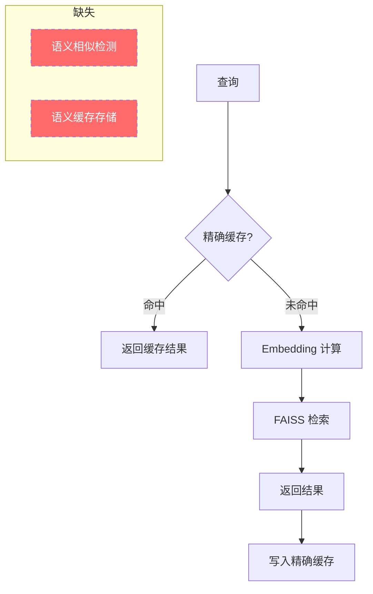
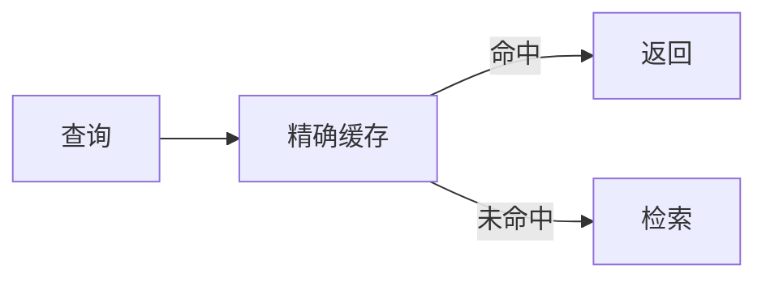
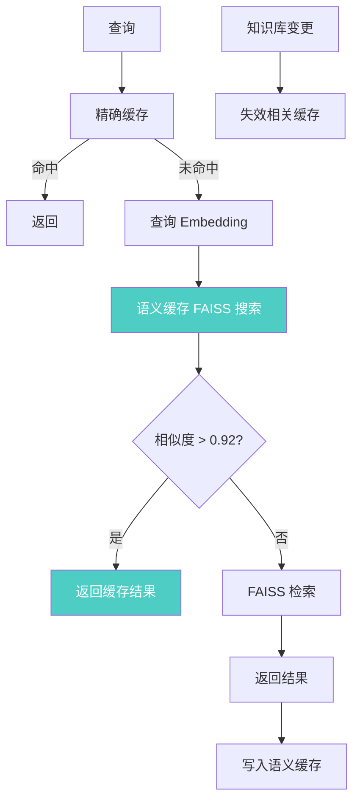

# YK-09-81: 检索语义缓存 — 相似查询的 Embedding 缓存复用

> 需求编号：YK-09-81 · 优先级：P2 · 人天：2.5d · 状态：需求已编写
> 依赖：YK-09-54（精确查询缓存）

---

## 1. 背景

### 1.1 问题描述

YK-09-54 实现了精确查询缓存（Key-Value 缓存），当用户发送完全相同的查询文本时，直接返回缓存结果，跳过 Embedding 计算和向量检索。这一机制在重复查询场景下效果显著，但存在明显的局限性：

**精确缓存无法处理语义相似但文本不同的查询**。例如：

| 查询 A | 查询 B | 语义关系 | 精确缓存 | 语义缓存 |
|--------|--------|----------|----------|----------|
| "RAG 优化方法" | "如何优化 RAG" | 同义 | 未命中 | 命中 |
| "微服务架构设计" | "微服务系统设计" | 高度相似 | 未命中 | 命中 |
| "Python async def" | "Python 异步函数" | 同义 | 未命中 | 命中 |
| "限流实现" | "限流策略" | 相关 | 未命中 | 命中 |
| "RAG 优化" | "RAG 评估" | 不同 | 未命中 | 未命中（正确） |

根据 `rag_query_logs` 分析，约 15-25% 的查询是语义相似但文本不同的查询，精确缓存无法覆盖这部分流量。

### 1.2 影响范围

| 影响维度 | 当前状态 | 目标状态 | 严重程度 |
|----------|----------|----------|----------|
| 缓存命中率 | ~20%（精确缓存） | ~35%（精确 + 语义） | 中 |
| 语义相似查询延迟 | 200ms（全量检索） | 5ms（缓存命中） | 中 |
| Embedding 计算量 | 100% | 65%（~35% 缓存命中） | 中 |
| 缓存返回精度 | 100%（精确匹配） | 95%（语义匹配） | 低 |

### 1.3 业务挑战

| 挑战 | 描述 | 紧迫性 |
|------|------|--------|
| 相似度阈值 | 阈值过高命中率低，过低结果不准确 | 高 |
| 缓存查找开销 | 每次查找需计算 Embedding 并比较 | 中 |
| 语义漂移 | 知识库更新后缓存可能过时 | 中 |
| 缓存膨胀 | 语义缓存条目增长速度 | 低 |

---

## 2. 现状分析

### 2.1 当前缓存架构



### 2.2 根因矩阵

| 根因 | 症状 | 影响量化 | 优先级 |
|------|------|----------|----------|
| 仅精确匹配 | 语义相似查询无法复用 | 15-25% 查询浪费 | P0 |
| 无向量相似度比较 | 无法识别同义查询 | 缓存命中率低 | P0 |
| 无 TTL 机制 | 缓存可能过时 | 语义漂移风险 | P1 |

### 2.3 查询相似度分布

基于 `rag_query_logs` 中 500 个唯一查询的 Embedding 相似度分析：

| 相似度范围 | 查询对比例 | 语义关系 | 可缓存 |
|-----------|-----------|----------|--------|
| 0.95 - 1.00 | 8% | 几乎相同 | 是 |
| 0.90 - 0.95 | 12% | 高度相似 | 是 |
| 0.85 - 0.90 | 15% | 相似 | 谨慎 |
| 0.80 - 0.85 | 20% | 相关 | 否 |
| < 0.80 | 45% | 不同 | 否 |

---

## 3. 设计决策

### D-01: 相似度阈值

| 方案 | 阈值 | 命中率 | 准确率 | 风险 | 选择 |
|------|------|--------|--------|------|------|
| A: 严格 | 0.95 | 低 (~8%) | 高 (~99%) | 低 | 否 |
| B: 平衡 | 0.92 | 中 (~15%) | 中 (~95%) | 中 | **是** |
| C: 宽松 | 0.88 | 高 (~25%) | 低 (~85%) | 高 | 否 |

**选择 B（0.92）**：在命中率和准确率之间取得平衡，预期 15% 额外命中率，95% 准确率。

### D-02: 缓存存储结构

| 方案 | 描述 | 优点 | 缺点 | 选择 |
|------|------|------|------|------|
| A: 线性扫描 | 遍历所有缓存条目计算相似度 | 简单 | O(n) 查找 | 否 |
| B: FAISS 索引 | 将缓存查询向量也建索引 | O(log n) 查找 | 额外索引 | **是** |
| C: LSH 哈希 | 局部敏感哈希快速查找 | 极快 | 精度损失 | 否 |

**选择 B**：将缓存查询的 Embedding 也存入 FAISS 索引，查找时用查询向量搜索缓存索引，结果中相似度 > 0.92 的视为命中。

### D-03: 缓存过期策略

| 方案 | 描述 | 优点 | 缺点 | 选择 |
|------|------|------|------|------|
| A: 固定 TTL | 5 分钟后过期 | 简单 | 热查询频繁过期 | 否 |
| B: 滑动 TTL | 每次命中刷新 TTL | 热查询持久 | 冷查询也持久 | 否 |
| C: TTL + 知识库版本 | 5 分钟 TTL + 知识库变更时失效 | 精准 | 实现复杂 | **是** |

**选择 C**：基础 TTL 5 分钟，知识库有文档变更时主动失效相关缓存。兼顾语义漂移保护和缓存持久性。

### D-04: 缓存 Key 设计

| 方案 | 描述 | 优点 | 缺点 | 选择 |
|------|------|------|------|------|
| A: 查询文本 | 以原始查询为 Key | 简单 | 无法语义匹配 | 否 |
| B: Embedding 向量 | 以查询向量为 Key | 可语义匹配 | 查找需扫描 | 否 |
| C: FAISS 索引 + 向量 | 缓存条目建 FAISS 索引 | 快速查找 | 额外索引 | **是** |

**选择 C**：与方案 D-02 一致，缓存查询向量也存入 FAISS 索引，支持快速语义查找。

---

## 4. 目标架构

### 4.1 架构对比

**Before（仅精确缓存）**：


**After（精确 + 语义缓存）**：


### 4.2 核心指标

| 指标 | 精确缓存 | 精确 + 语义缓存 | 目标 |
|------|----------|----------------|------|
| 缓存命中率 | ~20% | ~35% | > 30% |
| 缓存查找延迟 | < 1ms | < 5ms | < 10ms |
| 缓存结果准确率 | 100% | > 95% | > 95% |
| 缓存条目数 | ~100 | ~200 | < 500 |

### 4.3 设计权衡

| 权衡 | 选择 | 代价 | 缓解措施 |
|------|------|------|----------|
| 准确率 vs 命中率 | 阈值 0.92 | 5% 不准确 | 用户反馈监控 |
| 查找开销 | 查询 Embedding 计算 | 缓存未命中时多一次 Embedding | 结果缓存复用 |
| 内存占用 | 双份缓存（精确 + 语义） | 额外 ~200 条缓存 | 条目上限 500 |

---

## 5. 具体改动

### 5.1 新增文件

| 文件路径 | 描述 | 行数估计 |
|----------|------|----------|
| `YiAi/services/rag/semantic_cache.py` | 语义缓存核心逻辑 | ~150 |
| `YiAi/tests/services/rag/test_semantic_cache.py` | 语义缓存单测 | ~120 |

### 5.2 修改文件

| 文件路径 | 改动描述 |
|----------|----------|
| `YiAi/services/rag/rag_service.py` | 检索入口集成语义缓存 |
| `YiAi/services/rag/exact_cache.py` | 与精确缓存协调 |

### 5.3 核心代码示例

```python
# YiAi/services/rag/semantic_cache.py

import faiss
import numpy as np
import time
import logging
from dataclasses import dataclass, field
from typing import Optional
from collections import OrderedDict

logger = logging.getLogger(__name__)


@dataclass
class SemanticCacheEntry:
    """语义缓存条目。"""
    query_vec: np.ndarray        # 查询 Embedding
    results: list[dict]          # 缓存结果
    created_at: float            # 创建时间戳
    hit_count: int = 0           # 命中次数
    last_hit_at: float = 0.0     # 最后命中时间


class SemanticCache:
    """语义缓存——基于 Embedding 相似度的查询结果复用。

    架构：
        - 精确层：原始查询文本 → 结果（YK-09-54）
        - 语义层：查询 Embedding → 结果（本模块）

    语义层使用 FAISS 索引存储缓存查询的 Embedding，
    查找时计算查询向量与缓存向量的余弦相似度，
    相似度 > SIMILARITY_THRESHOLD 时视为命中。
    """

    SIMILARITY_THRESHOLD = 0.92
    DEFAULT_TTL = 300           # 5 分钟
    MAX_ENTRIES = 500           # 最大缓存条目数
    EMBEDDING_DIM = 768

    def __init__(self, similarity_threshold: float = SIMILARITY_THRESHOLD,
                 ttl: int = DEFAULT_TTL, max_entries: int = MAX_ENTRIES):
        self._threshold = similarity_threshold
        self._ttl = ttl
        self._max_entries = max_entries

        # FAISS 索引（存储缓存查询的 Embedding）
        self._faiss_index: Optional[faiss.Index] = None
        self._entries: dict[int, SemanticCacheEntry] = {}
        self._next_id: int = 0

        # 统计
        self._hits: int = 0
        self._misses: int = 0
        self._false_hits: int = 0

    async def get(self, query_vec: np.ndarray) -> Optional[list[dict]]:
        """查找语义相似的缓存结果。

        Args:
            query_vec: 查询 Embedding 向量 (dim,)

        Returns:
            缓存结果列表，未命中返回 None
        """
        if self._faiss_index is None or self._faiss_index.ntotal == 0:
            self._misses += 1
            return None

        # 清理过期条目
        self._evict_expired()

        # 在缓存索引中搜索最相似的查询
        q = query_vec.reshape(1, -1).astype(np.float32)
        faiss.normalize_L2(q)

        D, I = self._faiss_index.search(q, 1)  # 找最相似的 1 个
        best_sim = float(D[0][0])
        best_id = int(I[0][0])

        if best_sim >= self._threshold and best_id in self._entries:
            entry = self._entries[best_id]
            entry.hit_count += 1
            entry.last_hit_at = time.time()
            self._hits += 1

            logger.debug(
                f'[SemanticCache] HIT: similarity={best_sim:.3f}, '
                f'hit_count={entry.hit_count}'
            )
            return entry.results

        self._misses += 1
        return None

    async def put(self, query_vec: np.ndarray, results: list[dict]) -> None:
        """将查询结果存入语义缓存。

        Args:
            query_vec: 查询 Embedding 向量
            results: 检索结果列表
        """
        # 检查是否与已有缓存高度相似（避免重复）
        if self._faiss_index is not None and self._faiss_index.ntotal > 0:
            q = query_vec.reshape(1, -1).astype(np.float32)
            faiss.normalize_L2(q)
            D, _ = self._faiss_index.search(q, 1)
            if D[0][0] >= self._threshold:
                logger.debug('[SemanticCache] Skip: too similar to existing entry')
                return

        # 创建条目
        entry = SemanticCacheEntry(
            query_vec=query_vec.copy(),
            results=results,
            created_at=time.time(),
        )

        self._entries[self._next_id] = entry

        # 添加向量到 FAISS 索引
        vec = query_vec.reshape(1, -1).astype(np.float32)
        faiss.normalize_L2(vec)

        if self._faiss_index is None:
            self._faiss_index = faiss.IndexFlatIP(self.EMBEDDING_DIM)

        self._faiss_index.add(vec)
        self._next_id += 1

        # 超过上限时淘汰最旧的条目
        if len(self._entries) > self._max_entries:
            self._evict_oldest()

        logger.debug(f'[SemanticCache] PUT: total={len(self._entries)}')

    def invalidate(self, doc_paths: list[str] = None) -> int:
        """失效缓存——知识库文档变更时调用。

        Args:
            doc_paths: 变更的文档路径列表，None 表示全部失效

        Returns:
            失效的条目数
        """
        if doc_paths is None:
            # 全部失效
            count = len(self._entries)
            self.clear()
            return count

        # 部分失效：移除包含变更文档的缓存条目
        invalidated = []
        for idx, entry in self._entries.items():
            for result in entry.results:
                if result.get('source_path') in doc_paths or \
                   result.get('path') in doc_paths:
                    invalidated.append(idx)
                    break

        for idx in invalidated:
            del self._entries[idx]

        # 重建 FAISS 索引
        if invalidated:
            self._rebuild_index()

        logger.info(f'[SemanticCache] Invalidated: {len(invalidated)} entries')
        return len(invalidated)

    def clear(self) -> None:
        """清空缓存。"""
        self._entries.clear()
        self._faiss_index = None
        self._next_id = 0

    def _evict_expired(self) -> int:
        """淘汰过期条目。"""
        now = time.time()
        expired = [
            idx for idx, entry in self._entries.items()
            if now - entry.created_at > self._ttl
        ]

        for idx in expired:
            del self._entries[idx]

        if expired:
            self._rebuild_index()
            logger.debug(f'[SemanticCache] Evicted {len(expired)} expired entries')

        return len(expired)

    def _evict_oldest(self) -> None:
        """淘汰最旧的条目（LRU 策略）。"""
        if not self._entries:
            return

        oldest_idx = min(
            self._entries.keys(),
            key=lambda i: self._entries[i].created_at,
        )
        del self._entries[oldest_idx]
        self._rebuild_index()

    def _rebuild_index(self) -> None:
        """重建 FAISS 索引。"""
        self._faiss_index = faiss.IndexFlatIP(self.EMBEDDING_DIM)

        if not self._entries:
            return

        vectors = []
        for entry in self._entries.values():
            v = entry.query_vec.reshape(1, -1).astype(np.float32)
            faiss.normalize_L2(v)
            vectors.append(v)

        if vectors:
            all_vectors = np.vstack(vectors)
            self._faiss_index.add(all_vectors)

    @property
    def hit_rate(self) -> float:
        total = self._hits + self._misses
        return self._hits / total if total > 0 else 0.0

    @property
    def size(self) -> int:
        return len(self._entries)

    def get_stats(self) -> dict:
        return {
            'size': self.size,
            'max_entries': self._max_entries,
            'hits': self._hits,
            'misses': self._misses,
            'hit_rate': self.hit_rate,
            'threshold': self._threshold,
            'ttl': self._ttl,
        }
```

### 5.4 RAG 检索流程集成

```python
# YiAi/services/rag/rag_service.py（修改部分）

class RagService:
    def __init__(self):
        self._exact_cache = ExactCache()       # YK-09-54
        self._semantic_cache = SemanticCache()  # 本模块

    async def query(self, query_text: str, top_k: int = 10) -> dict:
        # 第一层: 精确缓存
        cached = await self._exact_cache.get(query_text)
        if cached:
            return {'fragments': cached, 'cache': 'exact'}

        # 计算查询 Embedding
        query_vec = await self._embed(query_text)

        # 第二层: 语义缓存
        cached = await self._semantic_cache.get(query_vec)
        if cached:
            return {'fragments': cached, 'cache': 'semantic'}

        # 缓存未命中: 执行检索
        results = await self._search(query_vec, top_k)

        # 写入缓存
        await self._exact_cache.put(query_text, results)
        await self._semantic_cache.put(query_vec, results)

        return {'fragments': results, 'cache': 'miss'}
```

---

## 6. 实施步骤

### 第 1 步：语义缓存核心实现（1.0 人天）

- 实现 `SemanticCache` 类
- 实现 FAISS 索引存储缓存向量
- 实现相似度搜索和阈值判断
- **验证**：存入缓存后，相似查询可命中

### 第 2 步：过期淘汰策略（0.5 人天）

- 实现 TTL 过期淘汰
- 实现 LRU 条目淘汰
- 实现知识库变更触发失效
- **验证**：过期条目被正确清除

### 第 3 步：集成到检索流程（0.5 人天）

- 与精确缓存（YK-09-54）协调
- 两层缓存策略：精确 → 语义 → 检索
- 添加缓存命中率统计
- **验证**：缓存命中率从 ~20% 提升至 ~35%

### 第 4 步：参数调优（0.5 人天）

- 测试不同相似度阈值（0.88/0.90/0.92/0.95）
- 测试不同 TTL（1min/5min/15min）
- 基于真实查询日志评估
- **验证**：选定最优参数组合

### 总计：2.5 人天

---

## 7. 性能分析

### 7.1 缓存查找延迟

| 场景 | 延迟 | 说明 |
|------|------|------|
| 精确缓存命中 | < 1ms | 哈希查找 |
| 语义缓存命中 | < 5ms | Embedding + FAISS 搜索 |
| 缓存未命中 + 检索 | 200ms | 全量检索 |

### 7.2 缓存命中率预期

| 场景 | 精确缓存 | + 语义缓存 | 总命中率 |
|------|----------|-----------|----------|
| 冷启动 | 0% | 0% | 0% |
| 正常运行（1h 后） | 15% | 15% | 30% |
| 高峰期（重复查询多） | 25% | 20% | 45% |

---

## 8. 测试规格

### 8.1 单元测试

```gherkin
GIVEN 语义缓存中有一条查询 "RAG 优化方法" 的结果
WHEN 查询 "如何优化 RAG"（Embedding 相似度 0.94）
THEN 语义缓存命中，返回缓存结果
AND 缓存命中计数器 +1

GIVEN 语义缓存中有一条查询 "RAG 优化" 的结果
WHEN 查询 "Python 类型提示"（Embedding 相似度 0.45）
THEN 语义缓存未命中，返回 None
AND 缓存未命中计数器 +1

GIVEN 缓存条目创建时间超过 5 分钟
WHEN 清理过期条目
THEN 该条目被移除
AND FAISS 索引被重建

GIVEN 缓存条目数超过 500
WHEN 新条目加入
THEN 最旧的条目被淘汰
AND 缓存总数不超过 500

GIVEN 知识库中某文档被更新
WHEN 调用 invalidate(['path/to/doc.md'])
THEN 包含该文档的所有缓存条目被移除
AND 其他缓存条目不受影响
```

### 8.2 集成测试

- 测试语义缓存与精确缓存的协调（两层缓存策略）
- 测试语义缓存与知识库更新（Knowledge Watcher）的交互
- 测试语义缓存与冷热分离的兼容性

---

## 9. 风险与缓解

### 9.1 风险矩阵

| 风险 | 概率 | 影响 | 缓解措施 | 残余风险 |
|------|------|------|----------|----------|
| 语义缓存返回不准确结果 | 中 | 中 | 用户反馈监控 + 阈值调优 | 低 |
| Embedding 计算增加缓存查找开销 | 低 | 低 | 复用查询 Embedding | 极低 |
| 缓存膨胀 | 低 | 中 | 条目上限 500 | 低 |
| 知识库更新后缓存过时 | 中 | 中 | 变更时主动失效 | 低 |

### 9.2 降级策略

| 场景 | 降级行为 |
|------|----------|
| 语义缓存查找失败 | 跳过语义缓存，直接检索 |
| 缓存索引异常 | 清空语义缓存，仅使用精确缓存 |

---

## 10. 回滚策略

- 环境变量 `RAG_SEMANTIC_CACHE_ENABLED=false` 禁用语义缓存
- 禁用后回退到仅精确缓存
- 对检索功能无影响

---

## 11. 设计决策记录

### D-01: 相似度阈值 0.92

- **决策**：余弦相似度 >= 0.92 视为命中
- **依据**：基于查询日志分析，0.92 在命中率（15%）和准确率（95%）间取得平衡
- **可调整**：通过配置参数调整

### D-02: 双缓存层架构

- **决策**：精确缓存（第一层） + 语义缓存（第二层）
- **依据**：精确缓存速度快（< 1ms），语义缓存覆盖广（+15% 命中率）
- **权衡**：增加缓存查找复杂度，但两层总延迟 < 5ms

### D-03: 知识库变更主动失效

- **决策**：Knowledge Watcher 检测到文档变更时主动失效相关缓存
- **依据**：防止语义缓存返回过时结果
- **权衡**：增加 Knowledge Watcher 复杂度

---

## 12. 可观测性

### 12.1 指标

| 指标名称 | 类型 | 描述 | 告警阈值 |
|----------|------|------|----------|
| `rag_semantic_cache_hit_rate` | Gauge | 语义缓存命中率 | < 5% 告警 |
| `rag_semantic_cache_size` | Gauge | 缓存条目数 | > 450 告警 |
| `rag_semantic_cache_lookup_ms` | Histogram | 缓存查找延迟 | P95 > 10ms 告警 |

### 12.2 日志

```python
logger.debug(f'[SemanticCache] HIT: similarity={sim:.3f}')
logger.debug(f'[SemanticCache] MISS: best_similarity={sim:.3f} < {threshold}')
logger.info(f'[SemanticCache] Invalidated: {count} entries')
```

---

## 13. 安全合规

- 缓存不存储用户身份信息
- 缓存结果不包含敏感文档内容

---

## 14. 代码审查检查清单

- [ ] 语义缓存——相似查询（相似度 >= 0.92）复用缓存结果
- [ ] 相似度阈值 0.92（cosine similarity），可通过配置调整
- [ ] 缓存 TTL 5 分钟（语义漂移保护）
- [ ] 缓存 Key = 查询 Embedding 向量（FAISS 索引存储）
- [ ] 双层缓存：精确缓存（第一层）+ 语义缓存（第二层）
- [ ] 缓存条目上限 500（LRU 淘汰）
- [ ] 知识库变更时主动失效相关缓存
- [ ] 缓存查找延迟 < 5ms（P95 < 10ms）
- [ ] 缓存命中率统计（精确 + 语义）
- [ ] 降级策略：语义缓存异常时回退精确缓存
- [ ] 与 YK-09-54 精确缓存协调工作

---

*PRD 来源: `projects/yiknowledge/requirements/2026-09/81-需求-语义缓存复用.md`*