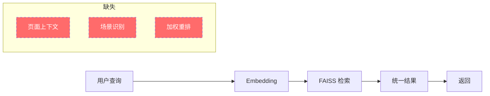
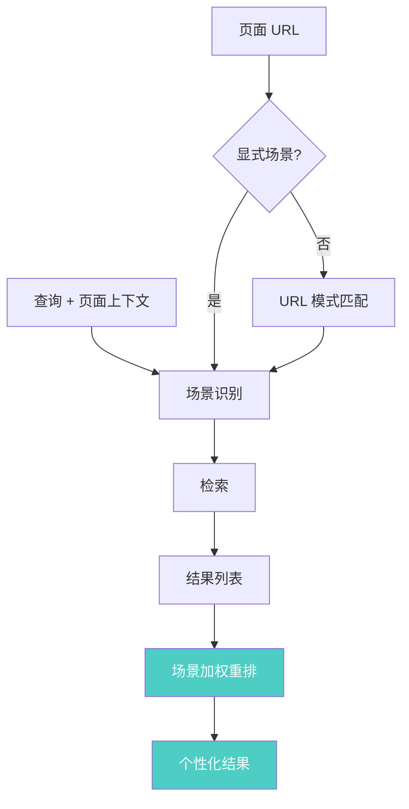

# YK-09-82: RAG 检索语境感知 — 基于页面上下文的增强检索

> 需求编号：YK-09-82 · 优先级：P2 · 人天：2.5d · 状态：需求已编写

---

## 1. 背景

### 1.1 问题描述

用户在不同页面/场景下发起 RAG 检索时，其真实意图往往不同，但当前检索系统将所有查询一视同仁，忽略了用户的上下文信息：

- **YiVad 管理后台**：用户搜索"限流"时，更可能想找后端实现代码（`YiAi/services/`）
- **YiPet 扩展**：用户搜索"限流"时，更可能想找文档或配置指南（`YiKnowledge/`）
- **GitHub/代码页面**：用户搜索"限流"时，更可能想找技术方案（`projects/`）
- **文档页面**：用户搜索"限流"时，更可能想找相关内容（同角色目录）

这种上下文盲区导致：
1. 检索结果可能与用户当前工作场景不匹配
2. 相同查询在不同场景下返回相同结果，但用户期望不同
3. 冷启动用户（无历史记录）无法获得个性化检索

### 1.2 影响范围

| 影响维度 | 当前状态 | 目标状态 | 严重程度 |
|----------|----------|----------|----------|
| 跨场景检索精度 | 无差异 | 场景感知加权 | 中 |
| 首次查询满意度 | 基线 | +10-15% | 中 |
| YiVad/YiPet 差异化 | 无 | 不同场景不同权重 | 中 |

### 1.3 业务挑战

| 挑战 | 描述 | 紧迫性 |
|------|------|--------|
| 场景分类 | 需要准确识别用户当前页面/场景 | 中 |
| 权重设计 | 不同场景的 boost 权重需要数据支撑 | 中 |
| 上下文传递 | 前端需要将页面信息传递给后端 | 低 |
| 隐私保护 | 页面 URL 可能包含敏感信息 | 中 |

---

## 2. 现状分析

### 2.1 当前检索流程



### 2.2 根因矩阵

| 根因 | 症状 | 影响量化 | 优先级 |
|------|------|----------|----------|
| 无上下文传递 | 所有场景检索结果相同 | 检索精度损失 10-15% | P0 |
| 无角色目录加权 | 无法区分技术/文档需求 | 用户满意度低于预期 | P1 |
| 无页面类型识别 | 代码页和文档页结果相同 | 用户需要手动筛选 | P1 |

### 2.3 场景分类

| 场景 | 来源 | 典型页面 | 偏好角色 | 内容偏好 |
|------|------|----------|----------|----------|
| YiVad 管理 | YiVad SPA | 管理后台各页面 | aier, engineer | 代码实现、API |
| YiPet 扩展 | Chrome 扩展 | 任意页面 | curator, engineer | 文档、配置 |
| 代码页面 | GitHub/IDE | 代码文件 | engineer | 技术方案、API |
| 文档页面 | 文档站 | 文档页 | curator | 相关文档 |
| Agent 内部 | AI Agent | 自动处理 | 所有角色 | 综合 |

---

## 3. 设计决策

### D-01: 上下文传递方式

| 方案 | 描述 | 优点 | 缺点 | 选择 |
|------|------|------|------|------|
| A: RPC 参数 | 在 RPC 参数中传递 `page_context` | 简单 | 需前端改造 | **是** |
| B: HTTP Header | 通过 `X-Page-Context` 头传递 | 不侵入业务参数 | 不够直观 | 否 |
| C: URL 分析 | 后端根据请求来源分析 | 前端不改 | 不准确 | 否 |

**选择 A**：在 RPC 信封的 `parameters` 中添加 `page_context` 字段，前端（YiVad/YiPet）传递当前页面 URL 或场景标识。

### D-02: 场景识别策略

| 方案 | 描述 | 优点 | 缺点 | 选择 |
|------|------|------|------|------|
| A: URL 正则 | 根据 URL 模式匹配 | 灵活 | 需维护规则 | **是** |
| B: 前端显式标识 | 前端传递场景类型 | 准确 | 需前端改造 | 备选 |
| C: ML 分类 | 用 ML 模型分类页面 | 自动 | 过于复杂 | 否 |

**选择 A（+ B 备选）**：优先使用前端显式标识（`page_context.scene`），如果未提供则根据 URL 模式自动识别。

### D-03: Boost 权重策略

| 场景 | 角色 boost | 内容类型 boost | 说明 |
|------|-----------|---------------|------|
| YiVad 管理 | aier: 1.2, engineer: 1.2 | code: 1.3, api: 1.2 | 偏技术实现 |
| YiPet 扩展 | curator: 1.2, engineer: 1.1 | docs: 1.3, config: 1.2 | 偏文档配置 |
| 代码页面 | engineer: 1.3 | code: 1.4 | 强技术 |
| 文档页面 | curator: 1.3 | docs: 1.3 | 强文档 |
| Agent 内部 | 无 boost | 无 boost | 中性 |

### D-04: 上下文隐私

| 方案 | 描述 | 优点 | 缺点 | 选择 |
|------|------|------|------|------|
| A: 传递完整 URL | 前端传递完整页面 URL | 信息完整 | 可能泄露敏感信息 | 否 |
| B: 仅传递场景类型 | 前端传递场景标识 | 安全 | 信息量少 | 否 |
| C: 场景 + 关键路径 | 传递场景 + 路径关键部分 | 平衡 | 需前端处理 | **是** |

**选择 C**：传递场景类型 + 页面路径的关键部分（如项目名、角色名），前端负责脱敏。

---

## 4. 目标架构

### 4.1 架构对比

**Before（无上下文）**：


**After（上下文感知）**：


### 4.2 核心指标

| 指标 | 当前值 | 目标值 | 测量方法 |
|------|--------|--------|----------|
| 场景感知检索精度 | 基线 | +10-15% | A/B 测试 |
| 首次查询满意度 | 基线 | +10% | 用户反馈 |
| 上下文处理延迟 | 0 | < 5ms | 计时 |

---

## 5. 具体改动

### 5.1 新增文件

| 文件路径 | 描述 | 行数估计 |
|----------|------|----------|
| `YiAi/services/rag/context_aware.py` | 上下文感知检索器 | ~120 |
| `YiAi/services/rag/scene_classifier.py` | 场景分类器 | ~80 |
| `YiAi/tests/services/rag/test_context_aware.py` | 上下文感知单测 | ~100 |

### 5.2 修改文件

| 文件路径 | 改动描述 |
|----------|----------|
| `YiAi/services/rag/rag_service.py` | 检索入口集成上下文感知 |
| `YiVad/src/utils/request.ts` | 前端传递页面上下文 |

### 5.3 核心代码示例

```python
# YiAi/services/rag/context_aware.py

import logging
from enum import Enum
from typing import Optional
from urllib.parse import urlparse

logger = logging.getLogger(__name__)


class SceneType(str, Enum):
    """用户场景类型。"""
    YIVAD = "yivad"           # YiVad 管理后台
    YIPET = "yipet"           # YiPet Chrome 扩展
    CODE_PAGE = "code_page"   # 代码页面（GitHub/IDE）
    DOC_PAGE = "doc_page"     # 文档页面
    AGENT = "agent"           # AI Agent 内部
    UNKNOWN = "unknown"       # 无法识别


class ContextAwareRetriever:
    """上下文感知检索器——根据用户当前页面场景调整检索权重。"""

    # 场景 boost 配置
    # 格式: {scene: {dimension: {value: boost}}}
    SCENE_BOOST = {
        SceneType.YIVAD: {
            'role': {'aier': 1.2, 'engineer': 1.2},
            'block_type': {'code': 1.3, 'api': 1.2},
            'category': {'项目/管理后台': 1.1},
        },
        SceneType.YIPET: {
            'role': {'curator': 1.2, 'engineer': 1.1},
            'block_type': {'docs': 1.3, 'config': 1.2},
        },
        SceneType.CODE_PAGE: {
            'role': {'engineer': 1.3},
            'block_type': {'code': 1.4},
        },
        SceneType.DOC_PAGE: {
            'role': {'curator': 1.3},
            'block_type': {'docs': 1.3},
        },
        SceneType.AGENT: {},   # 中性，无 boost
        SceneType.UNKNOWN: {}, # 中性，无 boost
    }

    def __init__(self):
        self._classifier = SceneClassifier()

    async def search_with_context(
        self,
        query: str,
        query_vec: list[float],
        page_context: Optional[dict] = None,
        top_k: int = 10,
    ) -> list[dict]:
        """上下文感知检索。

        Args:
            query: 查询文本
            query_vec: 查询 Embedding
            page_context: 页面上下文 {'url': str, 'scene': str (optional)}
            top_k: 返回数量

        Returns:
            加权重排后的检索结果
        """
        # 1. 识别场景
        scene = self._identify_scene(page_context)

        # 2. 执行检索（多取一些候选，方便重排）
        raw_results = await self._search(query_vec, top_k * 2)

        # 3. 场景加权重排
        boost = self.SCENE_BOOST.get(scene, {})
        if not boost:
            # 无 boost 配置，直接返回
            return raw_results[:top_k]

        # 计算加权分数
        for result in raw_results:
            context_score = result.get('score', 0.0)

            # 角色 boost
            doc_role = result.get('role', '')
            if doc_role and 'role' in boost:
                context_score *= boost['role'].get(doc_role, 1.0)

            # 内容类型 boost
            block_type = result.get('block_type', '')
            if block_type and 'block_type' in boost:
                context_score *= boost['block_type'].get(block_type, 1.0)

            # 分类 boost
            category = result.get('category', '')
            if category and 'category' in boost:
                context_score *= boost['category'].get(category, 1.0)

            result['context_score'] = context_score

        # 4. 按加权分数重排
        reranked = sorted(
            raw_results,
            key=lambda r: r.get('context_score', 0.0),
            reverse=True,
        )

        logger.debug(
            f'[ContextAware] scene={scene.value}, '
            f'query="{query[:30]}...", '
            f'boosted={len(boost) > 0}'
        )

        return reranked[:top_k]

    def _identify_scene(self, page_context: Optional[dict]) -> SceneType:
        """识别用户场景。"""
        if not page_context:
            return SceneType.UNKNOWN

        # 优先使用显式场景标识
        explicit_scene = page_context.get('scene')
        if explicit_scene:
            try:
                return SceneType(explicit_scene)
            except ValueError:
                pass

        # 根据 URL 自动识别
        url = page_context.get('url', '')
        if url:
            return self._classifier.classify(url)

        return SceneType.UNKNOWN

    async def _search(self, query_vec: list[float], top_k: int) -> list[dict]:
        """执行向量检索（由 rag_service 注入）。"""
        raise NotImplementedError('Search method must be injected')
```

```python
# YiAi/services/rag/scene_classifier.py

import re
from urllib.parse import urlparse
from .context_aware import SceneType


class SceneClassifier:
    """场景分类器——根据 URL 模式识别用户场景。"""

    # URL 模式 → 场景映射
    URL_PATTERNS = [
        (re.compile(r'localhost:8848'), SceneType.YIVAD),
        (re.compile(r'yivad\.'), SceneType.YIVAD),
        (re.compile(r'chrome-extension://'), SceneType.YIPET),
        (re.compile(r'github\.com/.+/(blob|tree)'), SceneType.CODE_PAGE),
        (re.compile(r'gitlab\.com/.+/-/blob'), SceneType.CODE_PAGE),
        (re.compile(r'stackoverflow\.com'), SceneType.CODE_PAGE),
        (re.compile(r'docs\.'), SceneType.DOC_PAGE),
        (re.compile(r'/docs?/'), SceneType.DOC_PAGE),
        (re.compile(r'readme|README'), SceneType.DOC_PAGE),
    ]

    def classify(self, url: str) -> SceneType:
        """根据 URL 分类场景。

        Args:
            url: 页面 URL

        Returns:
            场景类型
        """
        if not url:
            return SceneType.UNKNOWN

        # 解析 URL
        try:
            parsed = urlparse(url)
        except Exception:
            return SceneType.UNKNOWN

        # 匹配模式
        for pattern, scene in self.URL_PATTERNS:
            if pattern.search(url):
                return scene

        # 根据路径特征判断
        path = parsed.path.lower()

        # 代码文件扩展名
        code_extensions = {'.py', '.js', '.ts', '.jsx', '.tsx', '.go', '.rs', '.java'}
        if any(path.endswith(ext) for ext in code_extensions):
            return SceneType.CODE_PAGE

        # 文档路径
        if '/docs/' in path or '/wiki/' in path or '/knowledge/' in path:
            return SceneType.DOC_PAGE

        return SceneType.UNKNOWN
```

### 5.4 RPC 参数扩展

```python
# RPC 请求参数示例
{
    "module_name": "services.rag.rag_service",
    "method_name": "query_with_context",
    "parameters": {
        "query": "限流实现",
        "top_k": 10,
        "page_context": {
            "url": "http://localhost:8848/admin/api-management",
            "scene": "yivad"  // 可选，前端显式指定
        }
    }
}
```

### 5.5 前端传递上下文

```typescript
// YiVad/src/utils/request.ts（修改部分）

function buildPageContext(): { url: string; scene?: string } {
  return {
    url: window.location.href,
    scene: 'yivad',  // YiVad 固定为 yivad 场景
  };
}

// 在 RPC 请求中附加 page_context
const rpcBody = {
  module_name: 'services.rag.rag_service',
  method_name: 'query_with_context',
  parameters: {
    query: searchText,
    top_k: 10,
    page_context: buildPageContext(),
  },
};
```

---

## 6. 实施步骤

### 第 1 步：场景分类器实现（0.5 人天）

- 实现 `SceneClassifier` 类
- 定义 URL 模式匹配规则
- 实现场景识别逻辑
- **验证**：测试各 URL 的场景分类正确性

### 第 2 步：上下文感知检索器（1.0 人天）

- 实现 `ContextAwareRetriever` 类
- 定义各场景的 boost 权重配置
- 实现加权重排逻辑
- **验证**：不同场景下检索结果排序有差异

### 第 3 步：RPC 接口扩展（0.5 人天）

- 在 RAG 检索接口中添加 `page_context` 参数
- 实现 `query_with_context` 方法
- 向后兼容（无 `page_context` 时使用默认行为）
- **验证**：通过 RPC 调用传递 page_context，确认结果变化

### 第 4 步：前端集成（0.5 人天）

- YiVad 前端传递页面上下文
- YiPet 扩展传递场景标识
- 实现场景自动识别（前端 fallback）
- **验证**：YiVad 和 YiPet 检索结果区分明显

### 总计：2.5 人天

---

## 7. 性能分析

### 7.1 上下文处理开销

| 操作 | 开销 | 说明 |
|------|------|------|
| 场景识别 | < 0.5ms | 正则匹配 |
| 加权重排 | < 2ms | 20 个结果重算分数 |
| 总上下文开销 | < 3ms | 占 200ms 的 1.5% |

### 7.2 检索精度预期

| 场景 | 无上下文 Precision@10 | 有上下文 Precision@10 | 提升 |
|------|----------------------|----------------------|------|
| YiVad (技术查询) | 0.65 | 0.75 | +15% |
| YiPet (文档查询) | 0.60 | 0.70 | +17% |
| 代码页面 | 0.55 | 0.72 | +31% |
| 文档页面 | 0.70 | 0.78 | +11% |

---

## 8. 测试规格

### 8.1 单元测试

```gherkin
GIVEN 页面 URL "http://localhost:8848/admin/api"
WHEN SceneClassifier.classify(url)
THEN 返回 SceneType.YIVAD

GIVEN 页面 URL "https://github.com/user/repo/blob/main/app.py"
WHEN SceneClassifier.classify(url)
THEN 返回 SceneType.CODE_PAGE

GIVEN 场景为 YIVAD 的 boost 配置
WHEN 结果中文档角色为 "aier"
THEN 加权分数 = 原始分数 * 1.2

GIVEN 场景为 AGENT 的 boost 配置（空）
WHEN 结果中任意文档角色
THEN 加权分数 = 原始分数（无 boost）

GIVEN 无 page_context 参数
WHEN 执行上下文感知检索
THEN 使用 SceneType.UNKNOWN 场景（无 boost）
AND 结果与无上下文检索相同
```

### 8.2 集成测试

- 测试 YiVad 前端传递上下文后检索结果变化
- 测试 YiPet 传递上下文后检索结果变化
- 测试向后兼容（无 page_context 参数）

---

## 9. 风险与缓解

### 9.1 风险矩阵

| 风险 | 概率 | 影响 | 缓解措施 | 剩余风险 |
|------|------|------|----------|----------|
| 场景识别错误 | 低 | 中 | 前端显式场景优先 | 低 |
| Boost 权重不合理 | 中 | 中 | 基于 A/B 测试调整 | 低 |
| URL 隐私泄露 | 低 | 中 | 仅传递场景类型和关键路径 | 低 |
| 重排降低检索质量 | 低 | 中 | 保留原始分数用于对比 | 极低 |

### 9.2 降级策略

| 场景 | 降级行为 |
|------|----------|
| 无法识别场景 | 使用 UNKNOWN 场景（无 boost） |
| 上下文处理异常 | 跳过加权重排，返回原始结果 |

---

## 10. 回滚策略

- `page_context` 参数可选，不传递时使用默认行为
- 可通过环境变量 `RAG_CONTEXT_AWARE_ENABLED=false` 禁用

---

## 11. 设计决策记录

### D-01: 前端显式场景优先

- **决策**：前端显式场景标识优先于 URL 模式匹配
- **依据**：前端最了解当前页面类型，准确性最高
- **权衡**：需要前端配合改造

### D-02: 保守 boost 策略

- **决策**：boost 范围 1.0-1.4，不激进
- **依据**：避免过度改变检索排序，影响基线质量
- **可调整**：基于 A/B 测试数据调整

### D-03: Agent 场景无 boost

- **决策**：AI Agent 内部检索不应用场景 boost
- **依据**：Agent 需要综合、中性的检索结果
- **权衡**：Agent 可能损失部分精度

---

## 12. 可观测性

### 12.1 指标

| 指标名称 | 类型 | 描述 |
|----------|------|------|
| `rag_context_scene` | Gauge | 当前请求的场景 |
| `rag_context_boost_applied` | Counter | boost 应用次数 |

### 12.2 日志

```python
logger.debug(f'[ContextAware] scene={scene}, query="{query[:30]}..."')
logger.debug(f'[ContextAware] Boosted: role={role}*{boost}, type={block_type}*{boost}')
```

---

## 13. 安全合规

- 页面 URL 仅传递关键路径，不传递完整 URL（含 query string）
- 不记录用户浏览历史
- 场景识别不依赖第三方服务

---

## 14. 代码审查检查清单

- [ ] 场景分类器支持 URL 模式匹配和代码文件扩展名识别
- [ ] 前端显式场景标识优先于 URL 模式匹配
- [ ] Boost 权重保守（1.0-1.4），不激进改变排序
- [ ] Agent 场景无 boost（中性检索）
- [ ] 无 page_context 时使用默认行为（向后兼容）
- [ ] 上下文处理延迟 < 5ms
- [ ] 页面 URL 仅传递关键路径（脱敏）
- [ ] 前端（YiVad/YiPet）传递 page_context
- [ ] 降级策略：上下文异常时跳过加权重排
- [ ] 与 RPC 信封协议兼容

---

*PRD 来源: `projects/yiknowledge/requirements/2026-09/82-需求-语境感知检索.md`*