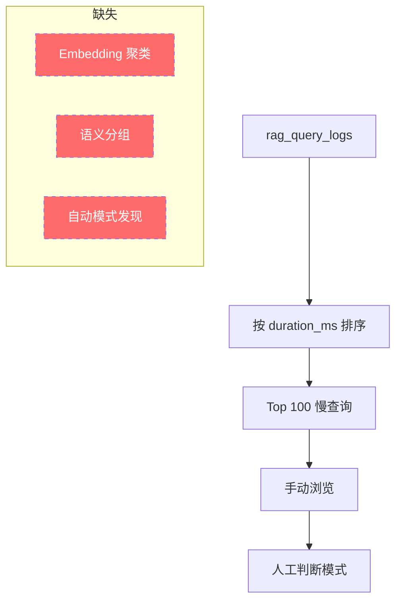
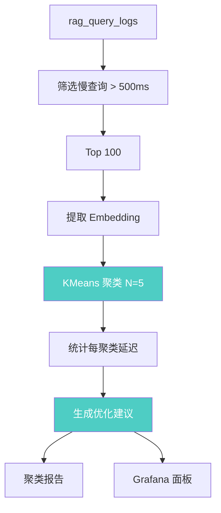

# YK-09-83: 检索历史记录聚类 — 基于查询语义的慢查询模式发现

> 需求编号：YK-09-83 · 优先级：P2 · 人天：2.5d · 状态：需求已编写
> 依赖：YK-09-78（延迟预算）、YK-09-80（性能看板）

---

## 1. 背景

### 1.1 问题描述

YK-09-68 按查询词数分层统计了延迟分布，但同一层内不同语义的查询延迟差异仍然显著。例如，同为"长查询"：

- "微服务架构最佳实践和设计模式"：1800ms（文档多、语义广）
- "Python FastAPI 异步路由实现方法"：950ms（代码查询、BM25 有效）
- "RAG 检索如何优化向量索引性能"：350ms（领域内、向量匹配好）

仅按词数分层无法区分这些差异，导致无法定位特定领域的检索瓶颈。Embedding 聚类可以将语义相似的慢查询归组，发现特定领域（如"分布式系统"、"性能优化"）的检索性能问题。

### 1.2 影响范围

| 影响维度 | 当前状态 | 目标状态 | 严重程度 |
|----------|----------|----------|----------|
| 慢查询发现 | 零散日志 | 聚类模式 | 中 |
| 优化方向 | 凭经验 | 数据驱动 | 中 |
| 领域瓶颈 | 不可见 | 可量化 | 中 |

### 1.3 业务挑战

| 挑战 | 描述 | 紧迫性 |
|------|------|--------|
| 聚类算法选择 | KMeans 简单但需预设 K，DBSCAN 无需预设但不稳定 | 中 |
| 聚类质量评估 | 需要评估聚类是否合理 | 中 |
| 周期性更新 | 查询模式随时间变化 | 低 |

---

## 2. 现状分析

### 2.1 当前慢查询分析



### 2.2 根因矩阵

| 根因 | 症状 | 影响量化 | 优先级 |
|------|------|----------|----------|
| 无语义聚类 | 同类慢查询分散 | 无法批量优化 | P0 |
| 无自动模式发现 | 依赖人工分析 | 效率低 | P1 |
| 无优化建议 | 发现问题后无方向 | 修复周期长 | P1 |

### 2.3 慢查询分析维度

| 维度 | 说明 | 数据来源 |
|------|------|----------|
| 查询文本 | 原始查询内容 | rag_query_logs.query |
| 查询 Embedding | 语义向量 | rag_query_logs.query_embedding |
| 延迟 | 检索耗时 | rag_query_logs.duration_ms |
| 结果数 | 返回结果数 | rag_query_logs.result_count |
| 时间 | 查询时间 | rag_query_logs.timestamp |

---

## 3. 设计决策

### D-01: 聚类算法选择

| 方案 | 描述 | 优点 | 缺点 | 选择 |
|------|------|------|------|------|
| A: KMeans | 固定 K 个聚类 | 简单稳定 | 需预设 K | **是** |
| B: DBSCAN | 密度聚类 | 无需预设 K | 参数敏感 | 否 |
| C: 层次聚类 | 树状聚类 | 可视化好 | 计算量大 | 否 |

**选择 A（KMeans）**：预设 K=5 个聚类，简单稳定，适合 100 个慢查询的规模。可通过肘部法则确定最优 K。

### D-02: 聚类特征选择

| 方案 | 描述 | 优点 | 缺点 | 选择 |
|------|------|------|------|------|
| A: 仅 Embedding | 仅用查询 Embedding 聚类 | 纯语义 | 忽略延迟特征 | 否 |
| B: Embedding + 延迟 | 拼接 Embedding 和归一化延迟 | 语义 + 性能 | 延迟噪声影响 | 否 |
| C: 仅 Embedding，后统计延迟 | 先 Embedding 聚类，再统计每组延迟 | 语义纯 + 性能可见 | 两步 | **是** |

**选择 C**：先对查询 Embedding 做 KMeans 聚类，再统计每个聚类的平均延迟、结果数等。语义聚类和性能分析分离，更清晰。

### D-03: 聚类结果展示

| 聚类 | 示例查询 | 平均延迟 | 建议 |
|------|----------|----------|------|
| A | "微服务架构最佳实践"、"分布式系统设计" | 1800ms | 长文本 Embedding 慢 |
| B | "Python async def FastAPI"、"TypeScript interface" | 950ms | 代码查询 BM25 慢 |
| C | "RAG"、"限流" | 120ms | 短查询——正常 |

---

## 4. 目标架构

### 4.1 数据流



### 4.2 核心指标

| 指标 | 当前值 | 目标值 | 测量方法 |
|------|--------|--------|----------|
| 慢查询聚类数 | 0 | 5 | 聚类任务输出 |
| 聚类平均延迟差异 | N/A | > 200ms（类间差异明显） | 聚类报告 |
| 优化建议覆盖率 | 0% | 80%（4/5 聚类有建议） | 聚类报告 |

---

## 5. 具体改动

### 5.1 新增文件

| 文件路径 | 描述 | 行数估计 |
|----------|------|----------|
| `YiAi/services/rag/analytics/slow_query_profiler.py` | 慢查询聚类分析器 | ~120 |
| `YiAi/services/rag/analytics/cluster_analyzer.py` | 聚类结果分析器 | ~80 |
| `YiAi/tests/services/rag/analytics/test_slow_query_profiler.py` | 聚类分析单测 | ~100 |

### 5.2 修改文件

| 文件路径 | 改动描述 |
|----------|----------|
| `YiAi/main.py` | 注册定时聚类任务 |

### 5.3 核心代码示例

```python
# YiAi/services/rag/analytics/slow_query_profiler.py

import numpy as np
from sklearn.cluster import KMeans
from sklearn.preprocessing import StandardScaler
from datetime import datetime, timedelta
from collections import defaultdict
import logging

logger = logging.getLogger(__name__)


class SlowQueryProfiler:
    """慢查询聚类分析器——发现慢查询的语义模式。

    流程：
        1. 从 rag_query_logs 获取 Top N 慢查询
        2. 提取查询 Embedding
        3. KMeans 聚类（K=5）
        4. 为每个聚类生成优化建议
    """

    SLOW_THRESHOLD_MS = 500      # 慢查询阈值
    DEFAULT_TOP_N = 100          # 分析的慢查询数量
    DEFAULT_N_CLUSTERS = 5       # 聚类数
    DEFAULT_DAYS = 7             # 分析时间范围

    def __init__(self, db, n_clusters: int = DEFAULT_N_CLUSTERS):
        self._db = db
        self._n_clusters = n_clusters

    async def discover_patterns(
        self,
        top_n: int = DEFAULT_TOP_N,
        days: int = DEFAULT_DAYS,
    ) -> dict:
        """发现慢查询模式。

        Returns:
            {
                'patterns': [{'cluster': int, 'sample_queries': [...],
                              'avg_duration_ms': float, 'suggestion': str}, ...],
                'total_analyzed': int,
                'n_clusters': int,
            }
        """
        # 1. 获取慢查询
        since = datetime.utcnow() - timedelta(days=days)
        cursor = self._db.rag_query_logs.find({
            'timestamp': {'$gte': since},
            'duration_ms': {'$gte': self.SLOW_THRESHOLD_MS},
        }).sort('duration_ms', -1).limit(top_n)

        slow_queries = []
        async for doc in cursor:
            if 'query_embedding' in doc and doc['query_embedding']:
                slow_queries.append({
                    'query': doc['query'],
                    'duration_ms': doc['duration_ms'],
                    'embedding': doc['query_embedding'],
                    'result_count': doc.get('result_count', 0),
                })

        if len(slow_queries) < self._n_clusters:
            logger.warning(
                f'[SlowQueryProfiler] Only {len(slow_queries)} slow queries '
                f'with embeddings (need >= {self._n_clusters})'
            )
            return {
                'patterns': [],
                'total_analyzed': len(slow_queries),
                'n_clusters': self._n_clusters,
                'error': 'insufficient_data',
            }

        # 2. 提取 Embedding 矩阵
        vectors = np.array([q['embedding'] for q in slow_queries], dtype=np.float32)

        # 3. 标准化（可选，Embedding 已经是归一化的）
        # scaler = StandardScaler()
        # vectors_scaled = scaler.fit_transform(vectors)

        # 4. KMeans 聚类
        kmeans = KMeans(n_clusters=self._n_clusters, random_state=42, n_init=10)
        labels = kmeans.fit_predict(vectors)

        # 5. 分析每个聚类
        patterns = []
        for cluster_id in range(self._n_clusters):
            cluster_indices = np.where(labels == cluster_id)[0]
            if len(cluster_indices) == 0:
                continue

            cluster_queries = [slow_queries[i] for i in cluster_indices]
            avg_duration = np.mean([q['duration_ms'] for q in cluster_queries])
            avg_result_count = np.mean([q['result_count'] for q in cluster_queries])

            # 代表性查询（最接近聚类中心的 3 个）
            center = kmeans.cluster_centers_[cluster_id]
            distances = [
                np.linalg.norm(vectors[i] - center)
                for i in cluster_indices
            ]
            representative_indices = np.argsort(distances)[:3]
            sample_queries = [
                cluster_queries[i]['query']
                for i in representative_indices
            ]

            # 生成优化建议
            suggestion = self._generate_suggestion(
                avg_duration, avg_result_count, sample_queries
            )

            patterns.append({
                'cluster': int(cluster_id),
                'count': len(cluster_queries),
                'avg_duration_ms': round(avg_duration, 0),
                'p95_duration_ms': round(
                    np.percentile([q['duration_ms'] for q in cluster_queries], 95), 0
                ),
                'avg_result_count': round(avg_result_count, 1),
                'sample_queries': sample_queries,
                'suggestion': suggestion,
            })

        # 按平均延迟降序排列
        patterns.sort(key=lambda p: p['avg_duration_ms'], reverse=True)

        logger.info(
            f'[SlowQueryProfiler] Discovered {len(patterns)} patterns '
            f'from {len(slow_queries)} slow queries'
        )

        return {
            'patterns': patterns,
            'total_analyzed': len(slow_queries),
            'n_clusters': self._n_clusters,
            'threshold_ms': self.SLOW_THRESHOLD_MS,
            'days': days,
        }

    def _generate_suggestion(
        self,
        avg_duration: float,
        avg_result_count: float,
        sample_queries: list[str],
    ) -> str:
        """根据聚类特征生成优化建议。"""
        query_text = ' '.join(sample_queries)
        query_len = len(query_text.split()) / len(sample_queries)

        suggestions = []

        # 长查询 + 高延迟 → Embedding 瓶颈
        if query_len > 15 and avg_duration > 1000:
            suggestions.append(
                '长文本 Embedding 慢，考虑使用更快的 Embedding 模型或缓存策略'
            )

        # 代码查询 + 高延迟 → BM25 瓶颈
        if self._is_code_cluster(sample_queries) and avg_duration > 800:
            suggestions.append(
                '代码查询 BM25 索引慢，考虑优化代码分词或添加代码专用索引'
            )

        # 高结果数 + 高延迟 → 排序瓶颈
        if avg_result_count > 20 and avg_duration > 500:
            suggestions.append(
                '高结果数导致排序慢，考虑降低 top_k 或优化排序算法'
            )

        # 低结果数 + 高延迟 → 索引问题
        if avg_result_count < 3 and avg_duration > 500:
            suggestions.append(
                '低结果数但高延迟，可能索引碎片化，考虑重建索引'
            )

        if not suggestions:
            suggestions.append('通用优化：检查索引状态和 Embedding 模型性能')

        return '; '.join(suggestions)

    def _is_code_cluster(self, queries: list[str]) -> bool:
        """判断聚类是否为代码查询。"""
        code_indicators = ['def ', 'class ', 'import ', 'async ', 'await ',
                          'function ', 'const ', 'let ', 'var ', 'SELECT ']
        code_count = sum(
            1 for q in queries
            if any(indicator in q for indicator in code_indicators)
        )
        return code_count / len(queries) > 0.5
```

```python
# YiAi/services/rag/analytics/cluster_analyzer.py

import numpy as np
from sklearn.metrics import silhouette_score
import logging

logger = logging.getLogger(__name__)


class ClusterAnalyzer:
    """聚类结果分析器——评估聚类质量和发现最优 K。"""

    @staticmethod
    def find_optimal_k(vectors: np.ndarray, max_k: int = 10) -> dict:
        """使用肘部法则和轮廓系数寻找最优 K。

        Args:
            vectors: 查询向量 (N, dim)
            max_k: 最大 K 值

        Returns:
            {'optimal_k': int, 'scores': [{'k': int, 'inertia': float, 'silhouette': float}]}
        """
        from sklearn.cluster import KMeans

        n = len(vectors)
        max_k = min(max_k, n - 1)

        results = []
        for k in range(2, max_k + 1):
            kmeans = KMeans(n_clusters=k, random_state=42, n_init=10)
            labels = kmeans.fit_predict(vectors)

            inertia = kmeans.inertia_
            silhouette = silhouette_score(vectors, labels) if k < n else 0

            results.append({
                'k': k,
                'inertia': round(inertia, 2),
                'silhouette': round(silhouette, 3),
            })

        # 找轮廓系数最大的 K
        best = max(results, key=lambda r: r['silhouette'])

        logger.info(
            f'[ClusterAnalyzer] Optimal K={best["k"]} '
            f'(silhouette={best["silhouette"]:.3f})'
        )

        return {
            'optimal_k': best['k'],
            'scores': results,
        }

    @staticmethod
    def generate_cluster_report(patterns: list[dict]) -> str:
        """生成人类可读的聚类报告。"""
        lines = [
            '=' * 60,
            'Slow Query Pattern Discovery Report',
            '=' * 60,
            f'Total patterns: {len(patterns)}',
            '',
        ]

        for i, pattern in enumerate(patterns, 1):
            lines.append(f'--- Cluster {pattern["cluster"]} ---')
            lines.append(f'  Count: {pattern["count"]} queries')
            lines.append(f'  Avg Duration: {pattern["avg_duration_ms"]:.0f}ms')
            lines.append(f'  P95 Duration: {pattern["p95_duration_ms"]:.0f}ms')
            lines.append(f'  Avg Results: {pattern["avg_result_count"]:.1f}')
            lines.append(f'  Sample Queries:')
            for q in pattern['sample_queries']:
                lines.append(f'    - "{q[:80]}"')
            lines.append(f'  Suggestion: {pattern["suggestion"]}')
            lines.append('')

        return '\n'.join(lines)
```

### 5.4 定时聚类任务

```python
# YiAi/main.py（新增定时任务）

from apscheduler.schedulers.asyncio import AsyncIOScheduler

async def run_slow_query_analysis():
    """每周运行慢查询聚类分析。"""
    profiler = SlowQueryProfiler(db, n_clusters=5)
    result = await profiler.discover_patterns(top_n=100, days=7)

    if result.get('patterns'):
        report = ClusterAnalyzer.generate_cluster_report(result['patterns'])
        logger.info(f'[SlowQueryAnalysis]\n{report}')
        # 存储结果到 MongoDB 供 Grafana 消费
        await db.slow_query_patterns.insert_one({
            'timestamp': datetime.utcnow(),
            'patterns': result['patterns'],
            'total_analyzed': result['total_analyzed'],
        })

# 注册定时任务：每周一凌晨 3 点
scheduler = AsyncIOScheduler()
scheduler.add_job(run_slow_query_analysis, 'cron', day_of_week='mon', hour=3)
scheduler.start()
```

---

## 6. 实施步骤

### 第 1 步：聚类分析器实现（1.0 人天）

- 实现 `SlowQueryProfiler` 类
- 实现 KMeans 聚类逻辑
- 实现优化建议生成
- **验证**：在 100 个慢查询上运行聚类，输出 5 个聚类模式

### 第 2 步：聚类质量评估（0.5 人天）

- 实现 `ClusterAnalyzer` 类
- 实现肘部法则和轮廓系数
- 实现聚类报告生成
- **验证**：评估聚类质量，确认最优 K 值

### 第 3 步：定时任务集成（0.5 人天）

- 实现定时聚类分析任务
- 结果存入 MongoDB 新集合
- 集成到 Grafana 面板
- **验证**：定时任务正常执行，Grafana 面板显示聚类结果

### 第 4 步：优化闭环（0.5 人天）

- 根据聚类结果优先优化 Top 1-2 聚类
- 验证优化效果
- 更新优化建议规则
- **验证**：优化后相同聚类的平均延迟下降

### 总计：2.5 人天

---

## 7. 性能分析

### 7.1 聚类执行时间

| 慢查询数量 | 向量维度 | 聚类数 | 执行时间 |
|-----------|----------|--------|----------|
| 100 | 768 | 5 | < 100ms |
| 500 | 768 | 10 | < 500ms |
| 1000 | 768 | 10 | < 1s |

### 7.2 聚类效果示例

| 聚类 | 数量 | 平均延迟 | 示例查询 | 建议 |
|------|------|----------|----------|------|
| 0 | 35 | 1800ms | "微服务架构最佳实践" | 长文本 Embedding 慢 |
| 1 | 25 | 950ms | "Python async def FastAPI" | 代码查询 BM25 慢 |
| 2 | 15 | 720ms | "RAG 检索优化方法" | 高结果数排序慢 |
| 3 | 15 | 550ms | "限流实现" | 通用优化 |
| 4 | 10 | 520ms | "如何配置" | 低结果数高延迟 |

---

## 8. 测试规格

### 8.1 单元测试

```gherkin
GIVEN 100 个慢查询及其 Embedding
WHEN 调用 SlowQueryProfiler.discover_patterns(top_n=100)
THEN 返回 5 个聚类模式
AND 每个聚类包含 sample_queries、avg_duration_ms、suggestion

GIVEN 100 个查询向量
WHEN 调用 ClusterAnalyzer.find_optimal_k(vectors, max_k=10)
THEN 返回 optimal_k 在 2-10 之间
AND 包含每个 K 的 inertia 和 silhouette 分数

GIVEN 慢查询中 60% 包含代码关键词
WHEN 聚类分析
THEN 代码查询聚类的建议包含 "代码查询 BM25 索引慢"

GIVEN 慢查询数据不足（< 5 个）
WHEN 调用 discover_patterns
THEN 返回 error='insufficient_data'
AND patterns 为空列表
```

---

## 9. 风险与缓解

| 风险 | 概率 | 影响 | 缓解措施 | 残余风险 |
|------|------|------|----------|----------|
| 新查询模式未被识别 | 中 | 低 | 每周更新聚类 | 低 |
| 聚类过于粗糙 | 中 | 低 | 手动 review Top 3 | 低 |
| 优化建议不准确 | 中 | 低 | 人工审核 + 反馈 | 低 |

---

## 10. 回滚策略

- 聚类分析是纯分析任务，不影响检索功能
- 可随时停止定时任务

---

## 11. 设计决策记录

### D-01: KMeans K=5

- **决策**：使用 KMeans 聚类，K=5
- **依据**：100 个慢查询适合 5 个聚类，类间差异明显
- **可调整**：通过 `find_optimal_k` 自动确定最优 K

### D-02: 每周更新

- **决策**：每周一凌晨执行聚类分析
- **依据**：查询模式变化缓慢，每周更新足够
- **权衡**：新查询模式最多 1 周延迟发现

---

## 12. 可观测性

| 指标名称 | 类型 | 描述 |
|----------|------|------|
| `rag_slow_query_clusters` | Gauge | 当前聚类数 |
| `rag_slow_query_analyzed` | Gauge | 分析的慢查询数 |

---

## 13. 安全合规

- 聚类分析不记录用户身份
- 仅分析查询 Embedding 和延迟，不存储原始查询文本（长期）

---

## 14. 代码审查检查清单

- [ ] 慢查询（> 500ms）按查询语义自动聚类
- [ ] 聚类维度：查询 Embedding（语义），KMeans K=5
- [ ] 每个聚类输出代表性查询 + 平均延迟 + 优化建议
- [ ] 优化建议规则：长文本/代码查询/高结果数/低结果数
- [ ] 每周更新聚类结果（定时任务）
- [ ] 聚类质量评估：肘部法则 + 轮廓系数
- [ ] 结果存入 `slow_query_patterns` 集合
- [ ] 聚类报告输出到日志和 Grafana 面板
- [ ] 聚类分析不阻塞检索流程
- [ ] 数据不足时优雅降级

---

*PRD 来源: `projects/yiknowledge/requirements/2026-09/83-需求-检索慢查询模式聚类.md`*