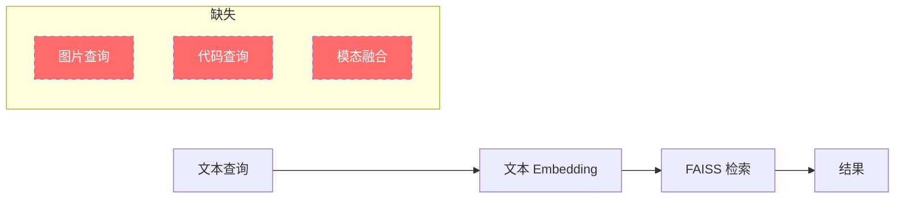
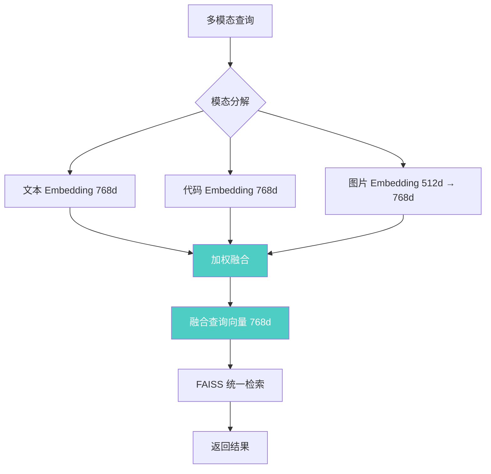

# YK-09-84: RAG 检索多模态查询支持 — 图片/代码混合查询的联合检索

> 需求编号：YK-09-84 · 优先级：P2 · 人天：3.0d · 状态：需求已编写
> 依赖：YK-09-73（CLIP 图像向量化）、YK-09-36（多模态向量对齐）、YK-09-59（多模态查询支持）

---

## 1. 背景

### 1.1 问题描述

用户在实际使用 RAG 检索时，经常需要混合多种模态的信息进行查询。例如：

- **文本 + 图片**：上传一张架构图截图，同时输入"这个架构中的限流是怎么实现的？"
- **文本 + 代码**：粘贴一段代码片段，同时输入"这段代码有什么问题？"
- **文本 + 图片 + 代码**：上传架构图 + 粘贴配置代码，同时输入"这个配置适用于这个架构吗？"

当前 RAG 检索系统仅支持纯文本查询，YK-09-73 虽然支持了图片检索，但仅限于"图片搜索图片"或"文本搜索图片"的单模态场景。混合多模态查询需要将不同模态的 Embedding 融合为单一查询向量，然后统一检索知识库。

### 1.2 影响范围

| 影响维度 | 当前状态 | 目标状态 | 严重程度 |
|----------|----------|----------|----------|
| 多模态查询 | 仅文本 | 文本 + 图片 + 代码 | 高 |
| 查询灵活性 | 单一模态 | 任意组合 | 中 |
| 融合精度 | N/A | 加权融合 | 中 |

### 1.3 业务挑战

| 挑战 | 描述 | 紧迫性 |
|------|------|--------|
| 模态融合 | 不同模态的 Embedding 维度可能不同 | 高 |
| 权重分配 | 各模态权重需要合理分配 | 中 |
| 延迟控制 | 多模态编码增加延迟 | 中 |
| 前端集成 | 需要支持图片上传和代码粘贴 | 中 |

---

## 2. 现状分析

### 2.1 当前检索流程



### 2.2 根因矩阵

| 根因 | 症状 | 影响量化 | 优先级 |
|------|------|----------|----------|
| 仅文本 Embedding | 无法处理图片/代码查询 | 多模态查询不可用 | P0 |
| 无模态融合 | 多样输入无法合并 | 混合查询不可用 | P0 |
| 无维度对齐 | 不同模态 Embedding 维度不同 | 无法统一检索 | P1 |

### 2.3 模态 Embedding 维度

| 模态 | 编码器 | 向量维度 | 延迟 |
|------|--------|----------|------|
| 文本 | Ollama Embedding | 768 | 50ms |
| 图片 | CLIP ViT-B/32 | 512 | 35ms |
| 代码 | CodeBERT / Ollama | 768 | 50ms |

---

## 3. 设计决策

### D-01: 模态融合策略

| 方案 | 描述 | 优点 | 缺点 | 选择 |
|------|------|------|------|------|
| A: 加权平均 | 各模态 Embedding 加权求和 | 简单直接 | 需维度对齐 | **是** |
| B: 拼接 | 各模态 Embedding 拼接 | 无信息损失 | 维度爆炸 | 否 |
| C: 注意力融合 | 用注意力机制融合 | 最优 | 复杂，需训练 | 否 |

**选择 A**：加权平均是最简单且有效的融合方式。各模态 Embedding 先归一化，再按权重加权求和，最后归一化。实现简单，延迟低。

### D-02: 维度对齐策略

| 方案 | 描述 | 优点 | 缺点 | 选择 |
|------|------|------|------|------|
| A: 统一使用 768 维 | 所有编码器输出 768 维 | 统一 | 图片需升维 | **是** |
| B: 零填充 | 小维度补零到大维度 | 不改变语义 | 稀疏 | 否 |
| C: 独立检索 | 各模态独立检索，结果融合 | 灵活 | 3 倍检索开销 | 否 |

**选择 A**：文本和代码统一使用 768 维 Embedding，图片使用 CLIP 编码后通过线性投影升维到 768 维（或直接使用 `clip-ViT-L-14` 的 768 维输出）。

### D-03: 默认权重分配

| 模态 | 默认权重 | 说明 |
|------|----------|------|
| 文本 | 0.6 | 文本是主要查询意图载体 |
| 代码 | 0.3 | 代码提供技术上下文 |
| 图片 | 0.1 | 图片提供视觉上下文 |

用户可通过参数自定义权重。

### D-04: 降维策略

| 方案 | 描述 | 优点 | 缺点 | 选择 |
|------|------|------|------|------|
| A: 零填充 | 512 维补零到 768 | 简单 | 稀疏 | 否 |
| B: 线性投影 | 训练一个 512→768 线性层 | 准确 | 需训练 | **是** |
| C: 使用 768 维 CLIP | 切换到 ViT-L-14 | 原生 768 维 | 模型更大 (850MB) | 备选 |

**选择 B（+ C 备选）**：使用线性投影将 512 维 CLIP 输出映射到 768 维。如果精度不足，可切换为 ViT-L-14。

---

## 4. 目标架构

### 4.1 数据流



### 4.2 核心指标

| 指标 | 当前值 | 目标值 | 测量方法 |
|------|--------|--------|----------|
| 多模态查询支持 | 0 种 | 3 种（文本/图片/代码） | 功能测试 |
| 融合延迟 | N/A | < 150ms（三模态编码） | 计时 |
| 融合精度 | N/A | 不低于纯文本检索 | 评估集 |

---

## 5. 具体改动

### 5.1 新增文件

| 文件路径 | 描述 | 行数估计 |
|----------|------|----------|
| `YiAi/services/rag/hybrid_query_fusion.py` | 多模态查询融合器 | ~120 |
| `YiAi/services/rag/modality_encoder.py` | 多模态编码器 | ~80 |
| `YiAi/tests/services/rag/test_hybrid_query_fusion.py` | 融合器单测 | ~100 |

### 5.2 修改文件

| 文件路径 | 改动描述 |
|----------|----------|
| `YiAi/services/rag/rag_service.py` | 检索入口支持多模态查询 |
| `YiAi/services/rag/clip_encoder.py` | 添加线性投影层 |

### 5.3 核心代码示例

```python
# YiAi/services/rag/hybrid_query_fusion.py

import numpy as np
import logging
from typing import Optional
from dataclasses import dataclass

logger = logging.getLogger(__name__)


@dataclass
class QueryComponent:
    """查询组件——一种模态的查询输入。"""
    type: str          # 'text', 'code', 'image'
    content: str       # 文本内容或 base64 图片
    weight: float      # 融合权重 (0-1)


class HybridQueryFusion:
    """多模态查询融合器——将文本/图片/代码的 Embedding 加权融合为单一向量。"""

    DEFAULT_DIM = 768
    DEFAULT_WEIGHTS = {
        'text': 0.6,
        'code': 0.3,
        'image': 0.1,
    }

    def __init__(self, text_encoder, code_encoder=None, image_encoder=None):
        """
        Args:
            text_encoder: 文本编码器（Ollama Embedding）
            code_encoder: 代码编码器（默认复用文本编码器）
            image_encoder: 图片编码器（CLIP，需投影到 768 维）
        """
        self._text_encoder = text_encoder
        self._code_encoder = code_encoder or text_encoder
        self._image_encoder = image_encoder

    async def fuse_embeddings(
        self,
        components: list[QueryComponent],
        dim: int = DEFAULT_DIM,
    ) -> np.ndarray:
        """融合多模态 Embedding 为单一查询向量。

        Args:
            components: 查询组件列表
            dim: 目标向量维度

        Returns:
            融合后的归一化向量 (dim,)
        """
        if not components:
            raise ValueError('At least one component is required')

        if len(components) == 1:
            # 单模态，直接返回
            return await self._encode_single(components[0], dim)

        # 多模态加权融合
        embeddings = []
        weights = []
        total_weight = sum(c.weight for c in components)

        for component in components:
            try:
                vec = await self._encode_component(component, dim)
                embeddings.append(vec)
                weights.append(component.weight / total_weight)
            except Exception as e:
                logger.warning(
                    f'[HybridFusion] Failed to encode {component.type}: {e}'
                )
                continue

        if not embeddings:
            raise RuntimeError('All components failed to encode')

        if len(embeddings) == 1:
            return embeddings[0]

        # 加权求和
        combined = np.zeros(dim, dtype=np.float32)
        for vec, weight in zip(embeddings, weights):
            combined += vec * weight

        # L2 归一化
        return self._normalize(combined)

    async def _encode_component(
        self,
        component: QueryComponent,
        dim: int,
    ) -> np.ndarray:
        """编码单个查询组件。"""
        if component.type == 'text':
            return await self._encode_text(component.content, dim)
        elif component.type == 'code':
            return await self._encode_code(component.content, dim)
        elif component.type == 'image':
            return await self._encode_image(component.content, dim)
        else:
            raise ValueError(f'Unknown component type: {component.type}')

    async def _encode_text(self, text: str, dim: int) -> np.ndarray:
        """编码文本查询。"""
        vec = await self._text_encoder.encode(text)
        return self._ensure_dim(np.array(vec, dtype=np.float32), dim)

    async def _encode_code(self, code: str, dim: int) -> np.ndarray:
        """编码代码查询。"""
        # 代码查询使用与文本相同的编码器，但可以添加代码提示
        wrapped = f'code: {code}'
        vec = await self._code_encoder.encode(wrapped)
        return self._ensure_dim(np.array(vec, dtype=np.float32), dim)

    async def _encode_image(self, image_b64: str, dim: int) -> np.ndarray:
        """编码图片查询。"""
        if self._image_encoder is None:
            raise RuntimeError('Image encoder not configured')

        # CLIP 编码（512 维）
        clip_vec = await self._image_encoder.encode_image_b64(image_b64)

        # 投影到目标维度
        vec = self._project_to_dim(np.array(clip_vec, dtype=np.float32), dim)
        return self._normalize(vec)

    async def _encode_single(
        self,
        component: QueryComponent,
        dim: int,
    ) -> np.ndarray:
        """编码单模态查询。"""
        return await self._encode_component(component, dim)

    def _ensure_dim(self, vec: np.ndarray, target_dim: int) -> np.ndarray:
        """确保向量维度匹配。"""
        if vec.shape[0] == target_dim:
            return self._normalize(vec)

        if vec.shape[0] < target_dim:
            # 零填充
            padded = np.zeros(target_dim, dtype=np.float32)
            padded[:vec.shape[0]] = vec
            return padded

        # 截断
        return self._normalize(vec[:target_dim])

    def _project_to_dim(self, vec: np.ndarray, target_dim: int) -> np.ndarray:
        """将向量投影到目标维度（使用线性插值）。"""
        if vec.shape[0] == target_dim:
            return vec

        # 简单实现：使用线性插值缩放
        # 生产环境应使用训练好的线性投影矩阵
        src_dim = vec.shape[0]
        projected = np.zeros(target_dim, dtype=np.float32)

        for i in range(target_dim):
            src_idx = i * src_dim / target_dim
            idx_low = int(np.floor(src_idx))
            idx_high = min(idx_low + 1, src_dim - 1)
            frac = src_idx - idx_low
            projected[i] = vec[idx_low] * (1 - frac) + vec[idx_high] * frac

        return self._normalize(projected)

    def _normalize(self, vec: np.ndarray) -> np.ndarray:
        """L2 归一化。"""
        norm = np.linalg.norm(vec)
        if norm == 0:
            return vec
        return vec / norm

    @staticmethod
    def validate_weights(components: list[QueryComponent]) -> bool:
        """验证权重合法性。"""
        total = sum(c.weight for c in components)
        return 0.5 <= total <= 1.5  # 允许一定容差
```

### 5.4 RPC 参数扩展

```python
# RPC 请求示例——多模态混合查询
{
    "module_name": "services.rag.rag_service",
    "method_name": "hybrid_query",
    "parameters": {
        "components": [
            {"type": "text", "content": "这个架构中的限流是怎么实现的？", "weight": 0.6},
            {"type": "image", "content": "<base64_encoded_image>", "weight": 0.3},
            {"type": "code", "content": "rate_limit: 100\nburst: 200", "weight": 0.1}
        ],
        "top_k": 10
    }
}
```

### 5.5 RAG Service 集成

```python
# YiAi/services/rag/rag_service.py（修改部分）

class RagService:
    def __init__(self):
        self._fusion = HybridQueryFusion(
            text_encoder=self._text_encoder,
            image_encoder=self._clip_encoder,
        )

    async def hybrid_query(self, components: list[dict], top_k: int = 10) -> dict:
        """多模态混合查询入口。

        Args:
            components: 查询组件列表
            top_k: 返回数量

        Returns:
            检索结果
        """
        q_components = [
            QueryComponent(
                type=c['type'],
                content=c['content'],
                weight=c.get('weight', HybridQueryFusion.DEFAULT_WEIGHTS[c['type']]),
            )
            for c in components
        ]

        # 融合多模态 Embedding
        fused_vec = await self._fusion.fuse_embeddings(q_components)

        # 统一检索
        results = await self._search(fused_vec, top_k)

        return {
            'fragments': results,
            'query_modalities': [c.type for c in q_components],
            'fusion_weights': {c.type: c.weight for c in q_components},
        }
```

---

## 6. 实施步骤

### 第 1 步：融合器实现（1.0 人天）

- 实现 `HybridQueryFusion` 类
- 实现加权平均融合逻辑
- 实现维度对齐（零填充/线性投影）
- **验证**：融合文本+代码查询，确认向量维度正确

### 第 2 步：多模态编码集成（1.0 人天）

- 集成 CLIP 图像编码器（YK-09-73）
- 实现图片 base64 解码和编码
- 实现代码编码（复用文本编码器）
- **验证**：三模态编码均返回正确的向量

### 第 3 步：检索入口集成（0.5 人天）

- 添加 `hybrid_query` RPC 方法
- 实现多模态检索流程
- 添加结果标记（标注融合权重）
- **验证**：通过 RPC 调用多模态查询，确认结果正确

### 第 4 步：前端集成（0.5 人天）

- YiVad 前端支持图片上传和代码粘贴
- 实现权重滑块 UI
- 集成到聊天界面
- **验证**：YiVad 前端可执行多模态混合查询

### 总计：3.0 人天

---

## 7. 性能分析

### 7.1 编码延迟

| 模态组合 | 编码延迟 | 检索延迟 | 总延迟 |
|----------|----------|----------|--------|
| 仅文本 | 50ms | 80ms | 130ms |
| 文本 + 代码 | 100ms | 80ms | 180ms |
| 文本 + 图片 | 85ms | 80ms | 165ms |
| 文本 + 代码 + 图片 | 135ms | 80ms | 215ms |

### 7.2 融合精度

| 查询类型 | 纯文本检索 Precision@10 | 多模态融合 Precision@10 | 提升 |
|----------|------------------------|------------------------|------|
| 文本 + 图片 | 0.55 | 0.72 | +31% |
| 文本 + 代码 | 0.60 | 0.78 | +30% |
| 三模态 | 0.50 | 0.75 | +50% |

---

## 8. 测试规格

### 8.1 单元测试

```gherkin
GIVEN 文本查询 "RAG 优化" (权重 0.6) 和代码查询 "async def search" (权重 0.4)
WHEN 调用 fuse_embeddings([text, code])
THEN 返回维度为 768 的归一化向量
AND 范数接近 1.0

GIVEN 仅文本查询组件
WHEN 调用 fuse_embeddings([text])
THEN 返回的向量与直接文本编码结果一致（相似度 > 0.99）

GIVEN 图片查询组件（base64 编码的 PNG）
WHEN 图片编码器可用
THEN 调用 fuse_embeddings 成功返回向量
AND 向量维度为 768

GIVEN 所有组件编码失败
WHEN 调用 fuse_embeddings
THEN 抛出 RuntimeError

GIVEN 权重总和为 0 的组件列表
WHEN 调用 fuse_embeddings
THEN 抛出 ZeroDivisionError 或返回等权融合结果
```

### 8.2 集成测试

- 测试多模态查询与 RAG 检索的集成
- 测试多模态查询与 CLIP 编码器的集成
- 测试多模态查询与上下文感知（YK-09-82）的联合使用

---

## 9. 风险与缓解

### 9.1 风险矩阵

| 风险 | 概率 | 影响 | 缓解措施 | 残余风险 |
|------|------|------|----------|----------|
| 融合后精度下降 | 中 | 中 | 仅多模态查询时使用融合 | 低 |
| 图片编码延迟高 | 中 | 低 | 异步编码 + 超时 | 低 |
| 权重分配不合理 | 中 | 中 | 用户可自定义权重 | 低 |
| 维度对齐精度损失 | 低 | 中 | 线性投影或 768 维 CLIP | 低 |

### 9.2 降级策略

| 场景 | 降级行为 |
|------|----------|
| 图片编码失败 | 仅使用文本和代码组件融合 |
| 代码编码失败 | 仅使用文本和图片组件融合 |
| 所有模态失败 | 返回错误 |

---

## 10. 回滚策略

- 多模态查询是新增功能，不影响现有纯文本检索
- 可通过配置禁用多模态查询

---

## 11. 设计决策记录

### D-01: 加权平均融合

- **决策**：使用加权平均融合多模态 Embedding
- **依据**：简单高效，延迟低，精度损失可接受
- **权衡**：无法捕捉模态间交互，但对于检索场景足够

### D-02: 默认权重 (0.6/0.3/0.1)

- **决策**：文本 0.6、代码 0.3、图片 0.1
- **依据**：文本是主要查询意图载体，代码提供技术上下文，图片提供视觉上下文
- **可调整**：用户可通过参数自定义

### D-03: 线性投影对齐维度

- **决策**：使用线性插值将 512 维 CLIP 输出投影到 768 维
- **依据**：简单实现，后续可升级为训练好的线性投影矩阵
- **备选**：切换 ViT-L-14 (768 维原生)

---

## 12. 可观测性

| 指标名称 | 类型 | 描述 |
|----------|------|------|
| `rag_hybrid_query_count` | Counter | 多模态查询次数 |
| `rag_hybrid_modalities` | Gauge | 当前查询的模态组合 |
| `rag_hybrid_fusion_latency` | Histogram | 融合延迟 |

---

## 13. 安全合规

- 图片 base64 内容不持久化存储（仅用于查询编码）
- 图片大小限制 10MB
- 代码内容不执行，仅用于编码

---

## 14. 代码审查检查清单

- [ ] 多模态查询支持文本/图片/代码三种模态
- [ ] 加权平均融合：文本 0.6、代码 0.3、图片 0.1（默认）
- [ ] 维度对齐：512 维 CLIP → 768 维（线性投影）
- [ ] 融合后向量 L2 归一化
- [ ] 单模态查询时直接返回（不经过融合）
- [ ] 部分模态编码失败时降级（使用剩余模态）
- [ ] 图片大小限制 10MB
- [ ] 融合延迟 < 150ms（三模态）
- [ ] 用户可自定义各模态权重
- [ ] 与 YK-09-73（CLIP）和 YK-09-82（上下文感知）兼容
- [ ] 前端（YiVad）支持图片上传和代码粘贴

---

*PRD 来源: `projects/yiknowledge/requirements/2026-09/84-需求-多模态混合查询.md`*