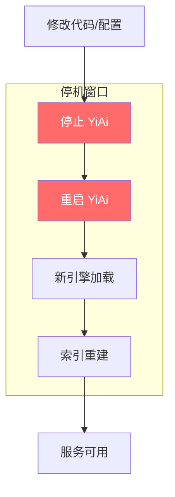
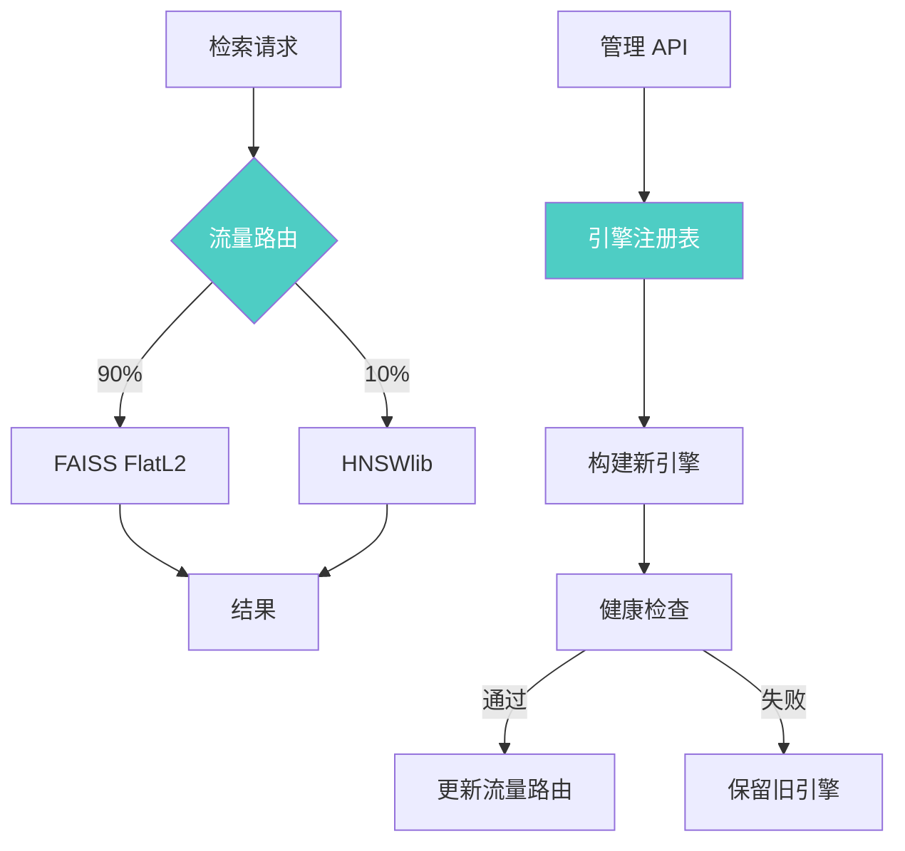

# YK-09-85: RAG 检索索引热插拔 — 在线动态切换索引后端

> 需求编号：YK-09-85 · 优先级：P2 · 人天：3.0d · 状态：需求已编写
> 依赖：YK-09-75（HNSW 索引迁移）、YK-09-76（PQ 量化压缩）、YK-09-79（零停机构建）

---

## 1. 背景

### 1.1 问题描述

YiAi 当前索引引擎固定为 FAISS `IndexFlatL2`，切换为 HNSW（YK-09-75）或 PQ 压缩（YK-09-76）需要修改代码并重启服务。这种硬编码方式带来以下问题：

1. **切换需重启**：每次切换索引引擎需要修改配置、重启 YiAi，导致 ~5 秒服务中断
2. **无法 A/B 测试**：无法同时运行两种索引引擎对比效果
3. **无法动态调优**：无法根据负载特征（高并发 vs 高精度）动态切换引擎
4. **回滚困难**：如果新引擎出现问题，恢复需要再次重启
5. **多引擎共存**：无法让不同场景使用不同引擎（如冷数据用 PQ，热数据用 HNSW）

YK-09-79 解决了零停机索引重建，但重建和切换是两件事。热插拔需要在不重启的情况下，将检索流量从一种索引引擎切换到另一种。

### 1.2 影响范围

| 影响维度 | 当前状态 | 目标状态 | 严重程度 |
|----------|----------|----------|----------|
| 引擎切换 | 需重启（5s 停机） | 在线切换（0 停机） | 高 |
| A/B 测试 | 不支持 | 支持灰度切换 | 中 |
| 回滚速度 | 需重启（5s） | 即时（< 1s） | 中 |
| 多引擎共存 | 不支持 | 支持 | 中 |

### 1.3 业务挑战

| 挑战 | 描述 | 紧迫性 |
|------|------|--------|
| 在线切换 | 切换过程中检索不中断 | 高 |
| 多引擎管理 | 需要管理多个索引引擎实例 | 中 |
| 引擎注册 | 需要可扩展的引擎注册机制 | 中 |
| 切换验证 | 切换后需要验证新引擎可用 | 中 |

---

## 2. 现状分析

### 2.1 当前切换流程



### 2.2 根因矩阵

| 根因 | 症状 | 影响量化 | 优先级 |
|------|------|----------|----------|
| 硬编码引擎 | 切换需重启 | 5s 停机 | P0 |
| 无引擎注册表 | 无法动态加载引擎 | 扩展性差 | P1 |
| 无流量路由 | 无法灰度切换 | 风险高 | P1 |
| 无多引擎管理 | 无法同时运行多引擎 | 无法 A/B 测试 | P2 |

### 2.3 支持的引擎类型

| 引擎 | 标识符 | 检索复杂度 | 特点 |
|------|--------|-----------|------|
| FAISS FlatL2 | `faiss_flat` | O(N*d) | 精确搜索，基线 |
| FAISS IndexIVFFlat | `faiss_ivf` | O(nlist) | 近似搜索，中等精度 |
| FAISS IndexHNSWFlat | `faiss_hnsw` | O(log N) | FAISS 内置 HNSW |
| hnswlib | `hnswlib` | O(log N) | 原生 HNSW，最优性能 |
| FAISS IndexIVFPQ | `faiss_pq` | O(nlist) | PQ 压缩，48x 内存节省 |

---

## 3. 设计决策

### D-01: 引擎注册机制

| 方案 | 描述 | 优点 | 缺点 | 选择 |
|------|------|------|------|------|
| A: 工厂模式 | 注册引擎工厂函数 | 简单 | 需预先注册 | **是** |
| B: 插件系统 | 动态加载引擎模块 | 灵活 | 复杂 | 否 |
| C: 配置驱动 | 配置文件指定引擎类 | 简单 | 不够灵活 | 否 |

**选择 A**：使用工厂注册模式，每个引擎注册一个工厂函数，运行时通过标识符选择。支持 `BACKENDS` 字典注册。

### D-02: 切换方式

| 方案 | 描述 | 优点 | 缺点 | 选择 |
|------|------|------|------|------|
| A: 直接切换 | 立即切换所有流量 | 快速 | 风险高 | 否 |
| B: 灰度切换 | 按比例分配流量 | 风险可控 | 需要流量路由 | **是** |
| C: 双写验证 | 两个引擎同时检索，比较结果 | 验证充分 | 2x 延迟 | 否 |

**选择 B**：支持灰度切换比例（0-100%），初始 10% 流量使用新引擎，逐步提升至 100%。

### D-03: 切换原子性

| 方案 | 描述 | 优点 | 缺点 | 选择 |
|------|------|------|------|------|
| A: 指针切换 | 原子更新引擎指针 | 原子 | 需确保并发安全 | **是** |
| B: 读写锁 | 切换时加写锁 | 安全 | 检索需等待 | 否 |

**选择 A**：Python 中对象引用赋值是原子的，无需额外锁机制。使用 `self._active = new_engine` 即可。

### D-04: 切换验证

| 方案 | 描述 | 优点 | 缺点 | 选择 |
|------|------|------|------|------|
| A: 无验证 | 直接切换 | 快 | 可能启用错误引擎 | 否 |
| B: 健康检查 | 切换后运行健康检查 | 安全 | 增加 1-2s | **是** |
| C: 全面验证 | 评估集验证 | 最安全 | 耗时长 | 否 |

**选择 B**：切换后运行快速健康检查（确认引擎可搜索、结果数正常），通过后正式切换。

---

## 4. 目标架构

### 4.1 架构对比

**Before（硬编码）**：


**After（热插拔）**：


### 4.2 核心指标

| 指标 | 当前值 | 目标值 | 测量方法 |
|------|--------|--------|----------|
| 引擎切换时间 | 5s（重启） | < 1s（在线） | 切换 API 计时 |
| 切换期间检索中断 | 5s | 0 | 检索可用性监控 |
| 支持引擎数 | 1 | 5+ | 引擎注册表 |
| 切换失败率 | 0（手动重启） | < 1% | 切换事件日志 |

### 4.3 切换对比

| 场景 | 切换耗时 | 检索中断 | 内存变化 | 适用 |
|------|----------|----------|----------|------|
| Flat → HNSW | 30s | 无 | +2MB | 性能提升 |
| Flat → PQ | 60s | 无 | -2MB | 内存优化 |
| HNSW → PQ | 90s | 无 | -4MB | 内存紧张 |
| 任意 → 任意 | 30-90s | 无 | -4MB~+2MB | 灵活切换 |

---

## 5. 具体改动

### 5.1 新增文件

| 文件路径 | 描述 | 行数估计 |
|----------|------|----------|
| `YiAi/services/rag/engine_registry.py` | 引擎注册表 | ~80 |
| `YiAi/services/rag/hot_swappable_index.py` | 热插拔索引管理器 | ~150 |
| `YiAi/services/rag/engine_health_check.py` | 引擎健康检查 | ~60 |
| `YiAi/routes/index_management_routes.py` | 索引管理 API 路由 | ~60 |
| `YiAi/tests/services/rag/test_hot_swappable_index.py` | 热插拔单测 | ~120 |

### 5.2 修改文件

| 文件路径 | 改动描述 |
|----------|----------|
| `YiAi/services/rag/rag_service.py` | 使用热插拔索引管理器 |
| `YiAi/core/config.py` | 添加引擎配置项 |

### 5.3 核心代码示例

```python
# YiAi/services/rag/engine_registry.py

import logging
from typing import Callable, Any

logger = logging.getLogger(__name__)


class EngineRegistry:
    """索引引擎注册表——管理所有可用的索引引擎。"""

    def __init__(self):
        self._factories: dict[str, Callable] = {}
        self._metadata: dict[str, dict] = {}

    def register(self, name: str, factory: Callable, metadata: dict = None) -> None:
        """注册一个引擎工厂。

        Args:
            name: 引擎标识符（如 'faiss_flat', 'hnswlib'）
            factory: 引擎工厂函数，签名为 (dim: int) -> IndexEngine
            metadata: 引擎元数据（描述、特性等）
        """
        self._factories[name] = factory
        self._metadata[name] = metadata or {}
        logger.info(f'[EngineRegistry] Registered: {name}')

    def unregister(self, name: str) -> None:
        """注销一个引擎。"""
        self._factories.pop(name, None)
        self._metadata.pop(name, None)
        logger.info(f'[EngineRegistry] Unregistered: {name}')

    def create(self, name: str, dim: int = 768) -> Any:
        """创建引擎实例。

        Args:
            name: 引擎标识符
            dim: 向量维度

        Returns:
            IndexEngine 实例
        """
        if name not in self._factories:
            available = ', '.join(self._factories.keys())
            raise ValueError(
                f'Unknown engine: {name}. Available: {available}'
            )

        engine = self._factories[name](dim)
        logger.info(f'[EngineRegistry] Created: {name} (dim={dim})')
        return engine

    def list_engines(self) -> list[dict]:
        """列出所有已注册的引擎。"""
        return [
            {
                'name': name,
                'metadata': self._metadata.get(name, {}),
            }
            for name in self._factories
        ]

    def get_metadata(self, name: str) -> dict:
        """获取引擎元数据。"""
        return self._metadata.get(name, {})

    @property
    def engine_count(self) -> int:
        return len(self._factories)
```

```python
# YiAi/services/rag/hot_swappable_index.py

import asyncio
import time
import random
import logging
from typing import Optional
from pathlib import Path

from .index_engine import IndexEngine
from .engine_registry import EngineRegistry
from .zero_downtime_builder import ZeroDowntimeBuilder

logger = logging.getLogger(__name__)


class HotSwappableIndex:
    """热插拔索引——支持在线动态切换索引后端。

    特性：
        - 在线切换：无需重启，切换过程检索不中断
        - 灰度切换：支持按比例分配流量到新引擎
        - 快速回滚：切换失败时自动回滚到旧引擎
        - 多引擎共存：支持同时运行多个引擎实例

    使用示例：
        index = HotSwappableIndex(registry)
        await index.switch_backend('hnswlib', vectors, ids)
        # 灰度 10% 流量到 HNSW
        await index.set_traffic_split(0.1)
    """

    def __init__(self, registry: EngineRegistry, dim: int = 768,
                 base_dir: str = '/tmp/rag_index'):
        self._registry = registry
        self._dim = dim
        self._base_dir = Path(base_dir)

        # 当前引擎
        self._active: Optional[IndexEngine] = None
        self._active_name: str = ''

        # 灰度引擎（正在切换/测试中）
        self._canary: Optional[IndexEngine] = None
        self._canary_name: str = ''
        self._canary_ratio: float = 0.0  # 0.0-1.0

        # 切换状态
        self._switching = False
        self._switch_lock = asyncio.Lock()

        # 统计
        self._active_requests: int = 0
        self._canary_requests: int = 0

    async def initialize(self, engine_name: str = 'faiss_flat') -> None:
        """初始化索引（启动时调用）。"""
        self._active = self._registry.create(engine_name, self._dim)
        self._active_name = engine_name

        # 尝试加载已有索引
        active_path = self._base_dir / 'active' / 'index'
        try:
            if active_path.with_suffix('.faiss').exists():
                await self._active.load(str(active_path))
            elif active_path.with_suffix('.bin').exists():
                await self._active.load(str(active_path))
        except Exception as e:
            logger.warning(f'[HotSwappable] Failed to load existing index: {e}')

        logger.info(
            f'[HotSwappable] Initialized: engine={engine_name}, '
            f'count={self._active.count}'
        )

    async def switch_backend(
        self,
        backend_name: str,
        vectors=None,
        ids: list[str] = None,
    ) -> dict:
        """切换到新的索引后端。

        Args:
            backend_name: 目标引擎标识符
            vectors: 文档向量（首次构建需要）
            ids: 文档 ID 列表

        Returns:
            切换结果
        """
        async with self._switch_lock:
            if self._switching:
                raise RuntimeError('Another switch is in progress')

            self._switching = True
            start = time.monotonic()

            try:
                # 1. 创建新引擎
                new_engine = self._registry.create(backend_name, self._dim)

                # 2. 构建新引擎索引
                if vectors is not None:
                    build_result = await new_engine.build(vectors, ids)
                    logger.info(
                        f'[HotSwappable] Built {backend_name}: '
                        f'n={build_result["count"]}'
                    )

                # 3. 健康检查
                health = await self._health_check(new_engine)
                if not health['passed']:
                    raise RuntimeError(
                        f'Health check failed: {health["reason"]}'
                    )

                # 4. 灰度切换（先 10% 流量）
                self._canary = new_engine
                self._canary_name = backend_name
                self._canary_ratio = 0.1

                # 5. 逐步提升灰度比例
                await self._gradual_rollout(backend_name)

                # 6. 全量切换
                old_engine = self._active
                old_name = self._active_name

                self._active = new_engine
                self._active_name = backend_name
                self._canary = None
                self._canary_name = ''
                self._canary_ratio = 0.0

                elapsed = (time.monotonic() - start) * 1000

                logger.info(
                    f'[HotSwappable] Switched: {old_name} → {backend_name}, '
                    f'time={elapsed:.0f}ms'
                )

                return {
                    'switched_to': backend_name,
                    'previous': old_name,
                    'switch_time_ms': round(elapsed, 0),
                    'status': 'active',
                    'health': health,
                }

            except Exception as e:
                logger.error(f'[HotSwappable] Switch failed: {e}')
                # 清理 canary
                self._canary = None
                self._canary_name = ''
                self._canary_ratio = 0.0
                return {
                    'switched_to': backend_name,
                    'status': 'failed',
                    'error': str(e),
                    'active_preserved': True,
                }

            finally:
                self._switching = False

    async def set_traffic_split(self, ratio: float) -> dict:
        """设置灰度流量比例。

        Args:
            ratio: 新引擎流量比例 (0.0-1.0)
        """
        if self._canary is None:
            raise RuntimeError('No canary engine to split traffic')

        self._canary_ratio = max(0.0, min(1.0, ratio))

        logger.info(
            f'[HotSwappable] Traffic split: '
            f'{self._active_name}={1 - self._canary_ratio:.0%}, '
            f'{self._canary_name}={self._canary_ratio:.0%}'
        )

        return {
            'active_ratio': 1 - self._canary_ratio,
            'canary_ratio': self._canary_ratio,
            'active_engine': self._active_name,
            'canary_engine': self._canary_name,
        }

    async def search(self, query_vec, k: int = 10) -> tuple:
        """检索——根据灰度比例路由流量。

        Returns:
            (distances, indices)
        """
        # 灰度路由
        if self._canary is not None and self._canary_ratio > 0:
            if random.random() < self._canary_ratio:
                self._canary_requests += 1
                return await self._canary.search(query_vec, k)

        self._active_requests += 1
        return await self._active.search(query_vec, k)

    async def _health_check(self, engine: IndexEngine) -> dict:
        """快速健康检查——确认引擎可用。"""
        try:
            if engine.count == 0:
                return {'passed': True, 'reason': 'empty_index'}

            # 用随机向量搜索，确认不报错
            import numpy as np
            test_vec = np.random.randn(self._dim).astype(np.float32)
            D, I = await engine.search(test_vec, k=3)

            return {
                'passed': True,
                'count': engine.count,
                'test_search_ok': len(I) == 3,
            }
        except Exception as e:
            return {
                'passed': False,
                'reason': str(e),
            }

    async def _gradual_rollout(self, backend_name: str) -> None:
        """逐步提升灰度比例（10% → 50% → 100%）。"""
        steps = [0.1, 0.5, 1.0]
        for ratio in steps:
            await self.set_traffic_split(ratio)
            # 等待观察期
            await asyncio.sleep(5)
            logger.info(
                f'[HotSwappable] Rollout {backend_name}: {ratio:.0%}'
            )

    def get_stats(self) -> dict:
        """获取热插拔索引统计。"""
        stats = {
            'active_engine': self._active_name,
            'active_count': self._active.count if self._active else 0,
            'active_requests': self._active_requests,
            'switching': self._switching,
        }

        if self._canary:
            stats['canary_engine'] = self._canary_name
            stats['canary_ratio'] = self._canary_ratio
            stats['canary_count'] = self._canary.count
            stats['canary_requests'] = self._canary_requests

        return stats

    def rollback(self) -> dict:
        """立即回滚——停止灰度，恢复旧引擎。"""
        if self._canary is None:
            return {'status': 'no_canary'}

        canary_name = self._canary_name
        self._canary = None
        self._canary_name = ''
        self._canary_ratio = 0.0

        logger.info(f'[HotSwappable] Rolled back: discarded {canary_name}')
        return {'status': 'rolled_back', 'discarded': canary_name}
```

### 5.4 引擎注册

```python
# YiAi/main.py（引擎注册初始化）

from services.rag.engine_registry import EngineRegistry
from services.rag.faiss_engine import FaissEngine
from services.rag.hnsw_engine import HnswEngine
from services.rag.pq_engine import PqEngine
from services.rag.hot_swappable_index import HotSwappableIndex

# 创建引擎注册表
registry = EngineRegistry()

# 注册所有引擎
registry.register('faiss_flat', lambda dim: FaissEngine(dim=dim, index_type='flat'),
                  {'description': 'FAISS FlatL2 - exact search', 'recall': 1.0})
registry.register('faiss_ivf', lambda dim: FaissEngine(dim=dim, index_type='ivf'),
                  {'description': 'FAISS IVF - approximate search', 'recall': 0.95})
registry.register('faiss_hnsw', lambda dim: FaissEngine(dim=dim, index_type='hnsw'),
                  {'description': 'FAISS HNSW - approximate search', 'recall': 0.98})
registry.register('hnswlib', lambda dim: HnswEngine(dim=dim),
                  {'description': 'HNSWlib - native HNSW', 'recall': 0.98})
registry.register('faiss_pq', lambda dim: PqEngine(dim=dim),
                  {'description': 'FAISS IVFPQ - compressed search', 'recall': 0.94})

# 创建热插拔索引
hot_index = HotSwappableIndex(registry, dim=768)
await hot_index.initialize('faiss_flat')
```

### 5.5 管理 API

```python
# YiAi/routes/index_management_routes.py

from fastapi import APIRouter, HTTPException

router = APIRouter(prefix='/admin/index', tags=['index_management'])


@router.get('/engines')
async def list_engines():
    """列出所有可用的索引引擎。"""
    return {'code': 0, 'data': registry.list_engines()}


@router.post('/switch')
async def switch_backend(backend_name: str):
    """切换索引后端。"""
    try:
        result = await hot_index.switch_backend(backend_name, vectors, ids)
        return {'code': 0, 'data': result}
    except Exception as e:
        raise HTTPException(status_code=500, detail=str(e))


@router.post('/traffic-split')
async def set_traffic_split(ratio: float):
    """设置灰度流量比例。"""
    try:
        result = await hot_index.set_traffic_split(ratio)
        return {'code': 0, 'data': result}
    except Exception as e:
        raise HTTPException(status_code=400, detail=str(e))


@router.post('/rollback')
async def rollback():
    """回滚到旧引擎。"""
    result = hot_index.rollback()
    return {'code': 0, 'data': result}


@router.get('/status')
async def get_status():
    """获取当前索引状态。"""
    return {'code': 0, 'data': hot_index.get_stats()}
```

---

## 6. 实施步骤

### 第 1 步：引擎注册表（0.5 人天）

- 实现 `EngineRegistry` 类
- 注册所有可用引擎（FAISS Flat/IVF/HNSW、hnswlib、PQ）
- 实现工厂创建逻辑
- **验证**：列出所有引擎，创建引擎实例

### 第 2 步：热插拔索引管理器（1.0 人天）

- 实现 `HotSwappableIndex` 类
- 实现在线切换流程
- 实现灰度流量路由
- 实现健康检查
- **验证**：切换引擎，确认检索不中断

### 第 3 步：管理 API（0.5 人天）

- 实现引擎列表 API
- 实现切换 API
- 实现灰度比例 API
- 实现回滚 API
- **验证**：通过 API 切换引擎，确认功能正常

### 第 4 步：集成测试（0.5 人天）

- 测试 Flat → HNSW 切换
- 测试 Flat → PQ 切换
- 测试 HNSW → PQ 切换
- 测试切换失败回滚
- **验证**：所有切换场景正常工作

### 第 5 步：Grafana 集成（0.5 人天）

- 添加引擎切换事件指标
- 添加灰度流量分布面板
- 添加引擎健康状态告警
- **验证**：Grafana 面板正确显示引擎状态

### 总计：3.0 人天

---

## 7. 性能分析

### 7.1 切换耗时分解

| 阶段 | 耗时 | 说明 |
|------|------|------|
| 创建新引擎 | < 1ms | 工厂实例化 |
| 构建新索引 | 5-90s | 取决于引擎类型和数据量 |
| 健康检查 | < 100ms | 随机向量搜索 |
| 灰度切换 | 10-15s | 10% → 50% → 100%，每步 5s 观察 |
| 总切换时间 | 15-105s | 取决于构建时间 |

### 7.2 灰度期间延迟

| 流量比例 | 活跃引擎延迟 | canary 引擎延迟 | 加权平均延迟 |
|----------|------------|---------------|-------------|
| 90%/10% | 200ms (Flat) | 50ms (HNSW) | 185ms |
| 50%/50% | 200ms (Flat) | 50ms (HNSW) | 125ms |
| 0%/100% | N/A | 50ms (HNSW) | 50ms |

---

## 8. 测试规格

### 8.1 单元测试

```gherkin
GIVEN 引擎注册表中注册了 'faiss_flat' 和 'hnswlib'
WHEN 调用 registry.create('hnswlib', dim=768)
THEN 返回 HnswEngine 实例
AND 引擎维度为 768

GIVEN 热插拔索引当前使用 'faiss_flat'
WHEN 调用 switch_backend('hnswlib', vectors, ids)
THEN 新引擎构建完成
AND 灰度从 10% 逐步提升至 100%
AND 最终 active 引擎为 'hnswlib'

GIVEN 灰度比例为 50%
WHEN 执行 1000 次检索
THEN 约 500 次使用 canary 引擎
AND 约 500 次使用 active 引擎

GIVEN 切换过程中发生异常
WHEN 异常被捕获
THEN canary 引擎被清理
AND active 引擎保持不变
AND 返回 status='failed'

GIVEN 热插拔索引正在灰度切换
WHEN 调用 rollback()
THEN canary 引擎被丢弃
AND 所有流量回到 active 引擎
```

### 8.2 集成测试

- 测试完整切换流程（Flat → HNSW → PQ）
- 测试并发检索在切换期间的表现
- 测试切换失败回滚
- 测试管理 API 的完整调用链

---

## 9. 风险与缓解

### 9.1 风险矩阵

| 风险 | 概率 | 影响 | 缓解措施 | 残余风险 |
|------|------|------|----------|----------|
| 新引擎构建失败 | 中 | 高 | 自动回滚 + 告警 | 低 |
| 灰度期间双引擎内存高 | 中 | 中 | 内存监控 + 上限保护 | 低 |
| 流量路由不准确 | 低 | 低 | 随机数路由，大数定律 | 极低 |
| 切换期间并发安全 | 低 | 高 | asyncio.Lock + 原子引用赋值 | 极低 |

### 9.2 降级策略

| 场景 | 降级行为 |
|------|----------|
| 新引擎构建失败 | 保留 active 引擎，记录错误 |
| 健康检查失败 | 不切换，保留 active 引擎 |
| 灰度期间 canary 异常 | 自动回滚到 active 引擎 |

---

## 10. 回滚策略

### 10.1 回滚场景

| 场景 | 触发条件 | 回滚操作 |
|------|----------|----------|
| 切换失败 | 构建/健康检查失败 | 自动保留 active 引擎 |
| 灰度期间发现问题 | 错误率或延迟异常 | 调用 rollback() API |
| 新引擎性能退化 | 评估集指标下降 | 手动切换回旧引擎 |

### 10.2 回滚步骤

1. 调用 `POST /admin/index/rollback`
2. canary 引擎被丢弃
3. 所有流量回到 active 引擎
4. 验证检索功能正常

---

## 11. 设计决策记录

### D-01: 工厂注册模式

- **决策**：使用引擎注册表 + 工厂函数
- **依据**：简单灵活，新增引擎只需注册工厂函数
- **权衡**：引擎工厂函数需硬编码注册

### D-02: 三步灰度切换（10% → 50% → 100%）

- **决策**：分三步逐步提升灰度比例
- **依据**：每步 5 秒观察期，及时发现异常
- **权衡**：切换时间增加 15 秒，但风险显著降低

### D-03: 随机路由 + 原子引用

- **决策**：使用 `random.random()` 路由 + 原子引用赋值
- **依据**：Python 对象引用赋值是原子的，无需额外锁
- **权衡**：短时间窗口内流量比例有波动，但统计上收敛

---

## 12. 可观测性

### 12.1 指标

| 指标名称 | 类型 | 描述 |
|----------|------|------|
| `rag_index_active_engine` | Gauge | 当前活跃引擎名称 |
| `rag_index_canary_engine` | Gauge | 灰度引擎名称 |
| `rag_index_canary_ratio` | Gauge | 灰度流量比例 |
| `rag_index_switch_events` | Counter | 切换事件次数 |
| `rag_index_switch_duration` | Histogram | 切换耗时 |

### 12.2 日志

```python
logger.info(f'[HotSwappable] Switched: {old} → {new}, time={t}ms')
logger.info(f'[HotSwappable] Traffic split: {active}={1-r:.0%}, {canary}={r:.0%}')
logger.error(f'[HotSwappable] Switch failed: {error}')
logger.info(f'[HotSwappable] Rolled back: discarded {canary}')
```

### 12.3 告警规则

| 告警 | 条件 | 级别 | 处理 |
|------|------|------|------|
| 切换失败 | `switch_event status=failed` | CRITICAL | 检查日志 |
| 灰度期间异常 | `canary_error_rate > 5%` | WARNING | 自动回滚 |
| 切换时间过长 | `switch_duration > 300s` | WARNING | 检查构建进度 |

---

## 13. 安全合规

- 管理 API 需要认证（X-Token）
- 切换操作记录审计日志
- 引擎配置变更可追溯

---

## 14. 代码审查检查清单

- [ ] 引擎注册表支持 5 种引擎（faiss_flat/faiss_ivf/faiss_hnsw/hnswlib/faiss_pq）
- [ ] 切换过程中检索不中断（零停机）
- [ ] 灰度切换：10% → 50% → 100%，每步 5s 观察期
- [ ] 切换前健康检查（随机向量搜索确认可用）
- [ ] 切换失败自动回滚到旧引擎
- [ ] 流量路由使用随机采样 + 原子引用赋值
- [ ] 管理 API：引擎列表、切换、灰度比例、回滚、状态
- [ ] 管理 API 需要认证
- [ ] 切换事件记录审计日志
- [ ] 与零停机构建（YK-09-79）集成
- [ ] 与 Grafana 看板（YK-09-80）集成
- [ ] 支持回滚命令（API + 手动）

---

*PRD 来源: `projects/yiknowledge/requirements/2026-09/85-需求-索引热插拔.md`*