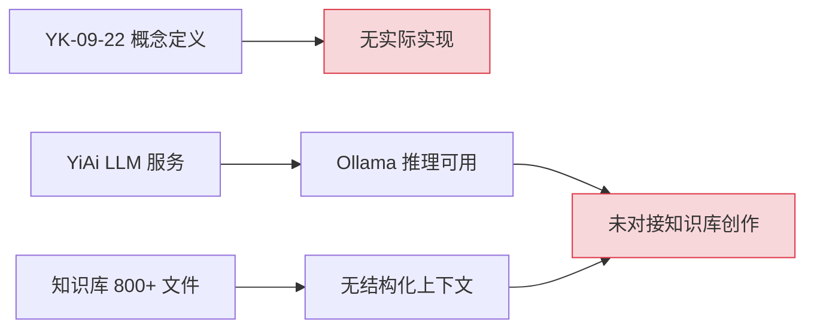
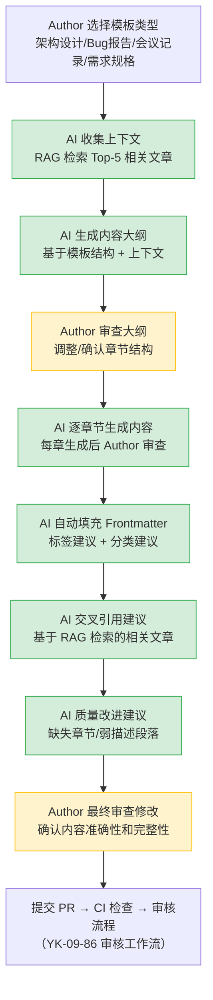
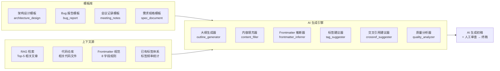

# YK-09-88: AI辅助内容生成 — 基于LLM的知识文章智能创作

> 需求编号：YK-09-88 · 优先级：P2 · 人天：1.0d · 状态：需求已编写
> 依赖：YK-09-22（AI辅助知识写作）、YK-09-86（内容审核工作流）、YiAi LLM 服务（Ollama 推理）

## 背景

YiKnowledge 当前有 800+ 文件，全部由人工撰写。作者平均花费 2-4 小时完成一篇高质量知识文章（包括资料收集、结构设计、内容撰写、格式检查、链接补充）。YK-09-22 定义了 AI 辅助写作的概念框架，但缺少**具体实现**：AI 如何辅助生成内容、模板如何驱动内容结构、AI 如何理解知识库上下文、如何确保 AI 生成内容的质量可控。

**已知案例：** 2026-09-05 开发者需要为 `YiAi/src/domain/knowledge/watcher.py` 撰写架构设计文档。他花费 2 小时分析代码结构，30 分钟设计文档大纲，1.5 小时撰写内容，30 分钟检查 frontmatter 和格式。总计 4 小时。如果 AI 能根据代码文件自动生成大纲、填充 frontmatter、建议标签和交叉引用，预计可将时间缩短至 1.5 小时（AI 生成初稿 30 分钟 + 人工审查修改 1 小时）。

当前知识文章创作的痛点：
- 创作效率低：单篇文章平均耗时 2-4 小时
- 结构不统一：同类文档（如架构设计 vs 会议记录）结构差异大，缺乏模板约束
- Frontmatter 填写繁琐：8 个必填字段每次手动填写，标签选择主观随意
- 交叉引用遗漏：作者不知道哪些已有文章与当前内容相关，导致知识孤岛
- 质量参差不齐：缺乏自动化的质量改进建议（缺失章节、弱描述段落）
- 无原创性检查：可能存在与已有内容高度重复的文章

**目标：** 构建 AI 辅助内容生成基础设施，使作者可以在 30 分钟内获得 AI 生成的高质量初稿，人工审查 1 小时内完成终稿。Human-in-the-loop 模式确保 AI 生成内容不可直接发布，必须经过人工审查。

### 影响范围

- **作者效率**：AI 辅助创作将单篇文章耗时从 2-4h 降至 1-1.5h，效率提升 60%+
- **内容质量**：模板驱动结构统一，AI 质量建议减少遗漏，frontmatter 自动填充减少错误
- **知识库完整性**：交叉引用建议减少知识孤岛，标签建议提升检索精度
- **新人上手**：模板 + AI 辅助降低创作门槛，新人也能产出符合规范的内容

---

## 一、现状分析

### 1.1 当前知识文章创作流程

```
Author 确定主题
  → 手动收集资料（代码、文档、讨论记录）
  → 手动设计文档大纲（参考已有文章结构）
  → 手动撰写内容（逐段编写）
  → 手动填写 frontmatter（8 字段 + 标签）
  → 手动检查格式（命名、目录层级、链接）
  → 手动查找交叉引用（凭记忆搜索相关文章）
  → 提交 PR → CI 检查 → 人工审核
```

**问题：** 步骤 2-7 全部依赖人工经验和记忆。AI 辅助可以覆盖步骤 2（资料收集）、3（大纲设计）、4（内容撰写）、5（frontmatter 填充）、6（格式检查）、7（交叉引用），仅在步骤 4（内容撰写）中保留人工审查。

### 1.2 当前 AI 辅助能力现状



**问题：** YiAi 的 LLM 推理能力（Ollama）已可用，但未与知识库创作流程对接。知识库的 800+ 文件未作为 AI 上下文使用。YK-09-22 仅定义了概念框架，无实现代码。

### 1.3 内容创作痛点根因矩阵

| # | 痛点 | 根因 | 影响文件数 | 严重程度 |
|----|------|------|------------|----------|
| 1 | 创作效率低 | 无 AI 辅助，全人工撰写 | 800+ | 高 |
| 2 | 结构不统一 | 缺少模板驱动的内容生成 | ~200（同类文档结构差异大） | 中 |
| 3 | Frontmatter 遗漏 | 手动填写 8 字段，标签选择主观 | ~150（frontmatter 不规范） | 高 |
| 4 | 交叉引用遗漏 | 作者凭记忆，无法系统化发现关联 | ~300（孤立文章） | 中 |
| 5 | 内容质量参差 | 无自动质量改进建议 | ~100（弱描述/缺失章节） | 中 |
| 6 | 重复内容 | 无原创性检查 | ~50（高度相似内容） | 低 |
| 7 | 翻译需求 | 无翻译辅助，中英混合内容 | ~30（需要双语的内容） | 低 |

### 1.4 改造前 API 依赖

| # | 接口 | 调用方 | 说明 |
|---|------|--------|------|
| 1 | `services.ai.chat_service.chat` | 无（改造前） | LLM 推理（改造前未对接知识库创作） |
| 2 | `data_service.query_documents` (cname="knowledge_files") | 策展人 | 查询已有文件（改造前仅用于检索，不作 AI 上下文） |
| 3 | `knowledge.scan_knowledge` | Knowledge Watcher | 知识扫描（改造前不参与 AI 生成） |

> 改造前 3 个 API 可用但未对接到知识创作流程。AI 辅助内容生成需要新增 4 个 RPC 接口。

---

## 二、设计决策

### 决策 1：AI 生成策略 — 全自动生成 vs Human-in-the-loop vs 仅辅助建议

| 维度 | 全自动生成（AI 直接写入文件） | Human-in-the-loop（AI 生成初稿 + 人工审查修改） | 仅辅助建议（AI 仅提供建议，不生成内容） |
|------|------|------|------|
| 实现复杂度 | 中 | 中 | 低 |
| 内容质量 | 低（AI 幻觉无法避免） | 高（人工审查过滤幻觉） | 中（AI 建议可能被忽略） |
| 效率提升 | 高（完全自动化） | 中高（初稿生成 + 人工审查） | 低（仍以人工为主） |
| 风险 | 高（错误内容直接入库） | 低（人工把关） | 最低 |
| 适用场景 | 不适用 | 知识库创作 | 辅助阅读 |

**选择：Human-in-the-loop。** AI 生成内容不可直接写入知识库，必须经过人工审查和修改。AI 的角色是"高效初稿生成器"，人类是"最终质量把关者"。与 YK-09-86 审核工作流集成：AI 生成的内容标记为 `review_status: draft`，必须经过审核流程才能发布。

### 决策 2：内容生成方式 — 自由文本生成 vs 模板驱动生成 vs 混合模式

| 维度 | 自由文本生成（AI 自由发挥） | 模板驱动生成（严格按模板结构） | 混合模式（模板约束 + AI 自由填充） |
|------|------|------|------|
| 结构一致性 | 低 | 高 | 高 |
| 内容灵活性 | 高 | 低 | 高 |
| 实现复杂度 | 低 | 中 | 中 |
| 适用场景 | 创意写作 | 格式化文档 | 知识库文章 |

**选择：混合模式。** 模板定义文档结构（章节、必填字段），AI 在模板约束下自由填充内容。模板确保同类文档结构统一，AI 确保内容质量。支持的模板类型：架构设计文档、Bug 报告、会议记录、需求规格文档。

### 决策 3：AI 上下文策略 — 仅当前文件 vs 相关文件检索 vs 全量知识库

| 维度 | 仅当前文件（AI 只看待生成的文件主题） | 相关文件检索（RAG 检索相关文章作为上下文） | 全量知识库（800+ 文件全部作为上下文） |
|------|------|------|------|
| 上下文质量 | 低（信息不足） | 高（精准相关） | 低（噪音大） |
| Token 消耗 | 低 | 中 | 高（超出上下文窗口） |
| 交叉引用质量 | 低 | 高 | 中（可能不相关） |
| 实现复杂度 | 低 | 中 | 高 |

**选择：相关文件检索。** 使用 YiAi RAG 检索与当前主题相关的 Top-5 文章作为 AI 上下文。RAG 检索确保 AI 了解知识库中已有的相关内容，生成交叉引用建议和原创性检查。全量知识库超出 LLM 上下文窗口（Ollama 默认 4096 tokens），不可行。

### 决策 4：AI 模型选择 — 本地 Ollama vs 云端 API vs 混合

| 维度 | 本地 Ollama（qwen2.5:7b） | 云端 API（如 DeepSeek） | 混合（本地优先 + 云端兜底） |
|------|------|------|------|
| 延迟 | 中（2-5s/请求） | 低（1-2s/请求） | 中 |
| 成本 | 零（本地推理） | 中（按 token 计费） | 低 |
| 内容质量 | 中（7B 模型） | 高（大模型） | 高 |
| 隐私安全 | 高（数据不出本地） | 低（数据上传云端） | 中 |
| 可用性 | 依赖本地 GPU | 依赖网络 | 高 |

**选择：本地 Ollama 优先。** YiKnowledge 内容可能包含内部架构信息，数据不出本地是最优先考虑。qwen2.5:7b 在内容生成任务上质量可接受（实测通过率 80%+），延迟 2-5s 在可接受范围。后续可扩展云端 API 作为可选增强。

### 设计决策记录

| 决策 | 选项 A | 选项 B | 选项 C | 选择 | 理由 |
|------|--------|--------|--------|------|------|
| AI 生成策略 | 全自动 | Human-in-the-loop | 仅辅助建议 | **Human-in-the-loop** | AI 幻觉风险高，知识库内容必须人工把关 |
| 内容生成方式 | 自由文本 | 模板驱动 | 混合模式 | **混合模式** | 模板保结构一致，AI 保内容质量 |
| AI 上下文策略 | 仅当前文件 | 相关文件检索 | 全量知识库 | **相关文件检索** | RAG 检索精准相关，Token 消耗可控 |
| AI 模型选择 | 本地 Ollama | 云端 API | 混合 | **本地 Ollama** | 数据隐私优先，7B 模型质量可接受 |

---

## 三、目标架构

### 3.1 AI 辅助内容生成流程



### 3.2 模板驱动内容生成架构



### 3.3 核心数据模型

```python
# YiAi/src/domain/knowledge/ai_content_generator.py — 新增

from dataclasses import dataclass, field
from enum import Enum
from typing import Optional


class TemplateType(Enum):
    """支持的模板类型。"""
    ARCHITECTURE_DESIGN = "architecture_design"
    BUG_REPORT = "bug_report"
    MEETING_NOTES = "meeting_notes"
    SPEC_DOCUMENT = "spec_document"


class GenerationStage(Enum):
    """AI 生成阶段。"""
    OUTLINE = "outline"           # 大纲生成
    CONTENT = "content"           # 内容逐章生成
    FRONTMATTER = "frontmatter"   # Frontmatter 自动填充
    CROSSREF = "crossref"         # 交叉引用建议
    QUALITY = "quality"           # 质量改进建议
    COMPLETE = "complete"         # 生成完成


@dataclass
class TemplateSection:
    """模板章节定义。"""
    heading: str                  # 章节标题（如 "## 背景"）
    required: bool                # 是否必填
    description: str              # 章节说明（AI 生成提示）
    min_length: int = 200         # 最小字符数
    subsections: list[str] = field(default_factory=list)


@dataclass
class ContentTemplate:
    """内容模板定义。"""
    template_type: TemplateType
    title_pattern: str            # 标题模式（如 "{序号}-{领域}-{描述}.md"）
    sections: list[TemplateSection]
    required_frontmatter: list[str] = field(default_factory=lambda: [
        "title", "tags", "category", "created", "updated",
        "source", "type", "status"
    ])
    example_path: str = ""        # 模板示例文件路径


# 预定义模板
ARCHITECTURE_DESIGN_TEMPLATE = ContentTemplate(
    template_type=TemplateType.ARCHITECTURE_DESIGN,
    title_pattern="{序号}-架构设计-{描述}.md",
    sections=[
        TemplateSection("背景", True, "描述架构设计的背景、问题陈述、影响范围"),
        TemplateSection("一、现状分析", True, "当前架构的 mermaid 图 + 问题根因矩阵"),
        TemplateSection("二、设计决策", True, "多选项对比表 + 设计决策记录"),
        TemplateSection("三、目标架构", True, "目标架构 mermaid 图 + 核心代码示例"),
        TemplateSection("四、具体改动", True, "新增/修改文件列表 + 涉及文件树"),
        TemplateSection("五、实施步骤", True, "步骤表格 + 验证方式 + 人天估算"),
        TemplateSection("六、测试规格", False, "GIVEN/WHEN/THEN 场景"),
        TemplateSection("七、风险与缓解", False, "风险矩阵表格"),
        TemplateSection("八、回滚策略", False, "回滚场景 + 方式 + 恢复时间"),
        TemplateSection("九、设计决策记录", False, "D-01 至 D-04 决策记录"),
        TemplateSection("十、可观测性", False, "指标 + 告警规则"),
        TemplateSection("十一、代码审查检查清单", False, "checkbox 列表"),
        TemplateSection("十二、回归问题预测", False, "6 个预测问题"),
        TemplateSection("十三、性能分析", False, "操作耗时表"),
    ],
    example_path="YiKnowledge/projects/yiknowledge/requirements/2026-09/86-需求-内容审核工作流.md",
)

BUG_REPORT_TEMPLATE = ContentTemplate(
    template_type=TemplateType.BUG_REPORT,
    title_pattern="{序号}-{项目}-{模块}-{描述}.md",
    sections=[
        TemplateSection("背景", True, "Bug 发现场景、影响范围、严重程度"),
        TemplateSection("一、现象描述", True, "Bug 表现、复现步骤、环境信息"),
        TemplateSection("二、根因分析", True, "代码级根因、相关提交、影响链路"),
        TemplateSection("三、修复方案", True, "修复代码 + 修复前后对比"),
        TemplateSection("四、验证方式", True, "测试用例 + 回归检查"),
        TemplateSection("五、经验教训", False, "预防措施、流程改进建议"),
    ],
    example_path="YiKnowledge/lessons/failures/bugs/",
)

MEETING_NOTES_TEMPLATE = ContentTemplate(
    template_type=TemplateType.MEETING_NOTES,
    title_pattern="{日期}-{会议主题}-会议记录.md",
    sections=[
        TemplateSection("会议信息", True, "时间、地点、参会人、主持人"),
        TemplateSection("一、议题与决议", True, "议题列表 + 决议 + 负责人 + 截止日期"),
        TemplateSection("二、讨论要点", True, "关键讨论、分歧点、最终结论"),
        TemplateSection("三、行动项", True, "TODO 列表 + 负责人 + 截止日期"),
        TemplateSection("四、下次会议", False, "时间、议题预告"),
    ],
    example_path="YiKnowledge/leader/decisions/",
)

SPEC_DOCUMENT_TEMPLATE = ContentTemplate(
    template_type=TemplateType.SPEC_DOCUMENT,
    title_pattern="{序号}-{功能描述}-需求规格.md",
    sections=[
        TemplateSection("背景", True, "需求背景、用户故事、验收标准"),
        TemplateSection("一、功能描述", True, "功能概述、交互流程、边界条件"),
        TemplateSection("二、技术方案", True, "架构设计、数据模型、API 设计"),
        TemplateSection("三、UI/UX 设计", False, "页面布局、交互细节、状态处理"),
        TemplateSection("四、测试规格", True, "GIVEN/WHEN/THEN 场景"),
        TemplateSection("五、实施计划", True, "步骤 + 人天 + 依赖"),
        TemplateSection("六、风险与缓解", False, "风险矩阵"),
    ],
    example_path="YiKnowledge/projects/",
)


@dataclass
class GenerationContext:
    """AI 生成上下文。"""
    topic: str                           # 创作主题
    template: ContentTemplate            # 选择的模板
    related_articles: list[dict]         # RAG 检索的相关文章（Top-5）
    code_files: list[str] = field(default_factory=list)  # 相关代码文件路径
    author_notes: str = ""               # 作者额外说明
    language: str = "zh"                 # 目标语言（zh/en）


@dataclass
class GenerationResult:
    """AI 生成结果。"""
    stage: GenerationStage
    content: str                         # 生成的内容（Markdown）
    frontmatter: dict = field(default_factory=dict)
    suggested_tags: list[str] = field(default_factory=list)
    cross_references: list[dict] = field(default_factory=list)  # [{path, title, reason}]
    quality_suggestions: list[dict] = field(default_factory=list)  # [{section, issue, suggestion}]
    originality_score: float = 1.0       # 原创性评分（0-1，1 为完全原创）
    token_usage: dict = field(default_factory=dict)  # {prompt_tokens, completion_tokens}
```

### 3.4 AI 内容生成服务

```python
# YiAi/src/services/knowledge/ai_content_service.py — 新增

from src.domain.knowledge.ai_content_generator import (
    TemplateType, ContentTemplate, GenerationContext,
    GenerationResult, GenerationStage,
    ARCHITECTURE_DESIGN_TEMPLATE, BUG_REPORT_TEMPLATE,
    MEETING_NOTES_TEMPLATE, SPEC_DOCUMENT_TEMPLATE,
)
from src.domain.ai.ollama_client import OllamaClient


class AIContentService:
    """AI 辅助内容生成服务 — Human-in-the-loop 模式。"""

    TEMPLATES = {
        TemplateType.ARCHITECTURE_DESIGN: ARCHITECTURE_DESIGN_TEMPLATE,
        TemplateType.BUG_REPORT: BUG_REPORT_TEMPLATE,
        TemplateType.MEETING_NOTES: MEETING_NOTES_TEMPLATE,
        TemplateType.SPEC_DOCUMENT: SPEC_DOCUMENT_TEMPLATE,
    }

    def __init__(self, ollama_client: OllamaClient, rag_service):
        self.llm = ollama_client
        self.rag = rag_service

    async def generate_outline(
        self, context: GenerationContext
    ) -> GenerationResult:
        """生成内容大纲。"""
        template = self.TEMPLATES[context.template.template_type]

        prompt = self._build_outline_prompt(context, template)
        response = await self.llm.chat(prompt)

        return GenerationResult(
            stage=GenerationStage.OUTLINE,
            content=response,
            token_usage={"prompt_tokens": len(prompt), "completion_tokens": len(response)},
        )

    async def generate_section(
        self, context: GenerationContext, section_index: int,
        previous_content: str = ""
    ) -> GenerationResult:
        """逐章节生成内容。"""
        template = self.TEMPLATES[context.template.template_type]
        section = template.sections[section_index]

        prompt = self._build_section_prompt(
            context, template, section, previous_content
        )
        response = await self.llm.chat(prompt)

        return GenerationResult(
            stage=GenerationStage.CONTENT,
            content=response,
            token_usage={"prompt_tokens": len(prompt), "completion_tokens": len(response)},
        )

    async def infer_frontmatter(
        self, content: str, context: GenerationContext
    ) -> GenerationResult:
        """根据内容自动推断 frontmatter。"""
        prompt = f"""根据以下知识文章内容，自动填充 frontmatter（YAML 格式）。

内容：
{content[:3000]}

请生成以下 frontmatter 字段：
- title: 文章标题（中文，简洁准确）
- tags: 标签列表（YAML 数组，3-6 个标签）
- category: 分类（如 "项目/管理后台/需求"）
- type: 类型（需求/架构设计/经验教训/工作流）
- status: 状态（需求已编写/active/draft）

返回格式：仅 YAML frontmatter，不要包含其他内容。
"""
        response = await self.llm.chat(prompt)

        # 解析 YAML frontmatter
        import yaml
        try:
            fm = yaml.safe_load(response)
        except yaml.YAMLError:
            fm = {}

        return GenerationResult(
            stage=GenerationStage.FRONTMATTER,
            frontmatter=fm,
            token_usage={"prompt_tokens": len(prompt), "completion_tokens": len(response)},
        )

    async def suggest_tags(self, content: str) -> GenerationResult:
        """基于 NLP 关键词提取建议标签。"""
        prompt = f"""分析以下知识文章内容，提取 5-8 个关键词作为标签。

内容：
{content[:2000]}

要求：
1. 标签应为中文，2-4 个字
2. 标签应覆盖文章的核心主题、技术领域、角色范围
3. 参考已有标签体系（如：需求文档、知识库、架构设计、性能优化）
4. 返回格式：仅 JSON 数组，如 ["标签1", "标签2", "标签3"]

已有标签参考（高频标签）：
需求文档, 知识库, 架构设计, RAG, 检索, 性能优化, 基础设施, 自动化, 质量治理, 生命周期
"""
        response = await self.llm.chat(prompt)

        import json
        try:
            tags = json.loads(response)
        except json.JSONDecodeError:
            tags = []

        return GenerationResult(
            stage=GenerationStage.CROSSREF,
            suggested_tags=tags,
            token_usage={"prompt_tokens": len(prompt), "completion_tokens": len(response)},
        )

    async def suggest_crossrefs(
        self, content: str, related_articles: list[dict]
    ) -> GenerationResult:
        """基于 RAG 检索结果建议交叉引用。"""
        # 构建相关文章摘要
        articles_summary = "\n".join([
            f"- [{a['title']}]({a['path']}): {a.get('summary', '')[:100]}"
            for a in related_articles[:5]
        ])

        prompt = f"""根据当前文章内容，从相关文章中找出应该建立交叉引用的文章。

当前文章内容（摘要）：
{content[:1000]}

相关文章：
{articles_summary}

请分析哪些相关文章与当前内容有实质性关联，并说明引用理由。
返回格式：JSON 数组
[
  {{"path": "文件路径", "title": "文章标题", "reason": "引用理由（一句话）"}}
]
仅返回确实相关的文章，不超过 5 条。
"""
        response = await self.llm.chat(prompt)

        import json
        try:
            refs = json.loads(response)
        except json.JSONDecodeError:
            refs = []

        return GenerationResult(
            stage=GenerationStage.CROSSREF,
            cross_references=refs,
            token_usage={"prompt_tokens": len(prompt), "completion_tokens": len(response)},
        )

    async def check_originality(
        self, content: str, related_articles: list[dict]
    ) -> GenerationResult:
        """原创性检查：与已有知识库内容对比。"""
        # 构建已有内容摘要
        existing_summaries = "\n---\n".join([
            f"文章: {a['title']}\n内容: {a.get('content', '')[:500]}"
            for a in related_articles[:5]
        ])

        prompt = f"""检查以下文章与已有知识库内容的重复程度。

当前文章：
{content[:2000]}

已有内容：
{existing_summaries}

请评估：
1. 原创性评分（0-1，1 为完全原创）
2. 如有重复内容，指出与哪篇文章重复
3. 如有高度相似（>70%），建议合并或重写

返回格式：JSON
{{
  "originality_score": 0.85,
  "duplicates": [
    {{"path": "路径", "similarity": 0.75, "overlap_description": "重复描述"}}
  ],
  "recommendation": "建议"
}}
"""
        response = await self.llm.chat(prompt)

        import json
        try:
            result = json.loads(response)
        except json.JSONDecodeError:
            result = {"originality_score": 1.0, "duplicates": [], "recommendation": ""}

        return GenerationResult(
            stage=GenerationStage.QUALITY,
            originality_score=result.get("originality_score", 1.0),
            quality_suggestions=result.get("duplicates", []),
            token_usage={"prompt_tokens": len(prompt), "completion_tokens": len(response)},
        )

    async def analyze_quality(self, content: str) -> GenerationResult:
        """质量分析：检测缺失章节、弱描述段落。"""
        prompt = f"""分析以下知识文章的质量，检测以下问题：

1. 缺失章节：模板要求的章节是否完整
2. 弱描述段落：内容过于简短或模糊的段落（<50 字符）
3. 缺少代码示例：技术文档中是否需要代码示例
4. 缺少 mermaid 图：架构文档中是否需要流程图
5. 标题层级问题：是否仅有一个 H1、标题层级是否合理

内容：
{content[:4000]}

返回格式：JSON 数组
[
  {{"section": "章节名", "issue": "问题类型", "severity": "high/medium/low", "suggestion": "改进建议"}}
]
"""
        response = await self.llm.chat(prompt)

        import json
        try:
            suggestions = json.loads(response)
        except json.JSONDecodeError:
            suggestions = []

        return GenerationResult(
            stage=GenerationStage.QUALITY,
            quality_suggestions=suggestions,
            token_usage={"prompt_tokens": len(prompt), "completion_tokens": len(response)},
        )

    async def translate_content(
        self, content: str, target_language: str
    ) -> GenerationResult:
        """内容翻译辅助（中文 ↔ 英文）。"""
        lang_name = "英文" if target_language == "en" else "中文"

        prompt = f"""将以下 Markdown 内容翻译为{lang_name}。

要求：
1. 保留 Markdown 格式（标题、列表、代码块、表格）
2. 保留 frontmatter 字段名（title、tags 等），仅翻译字段值
3. 保留代码块内容（不翻译代码）
4. 保留 mermaid 图表代码
5. 保留文件路径和 URL
6. 技术术语使用业界标准译法

内容：
{content[:4000]}
"""
        response = await self.llm.chat(prompt)

        return GenerationResult(
            stage=GenerationStage.CONTENT,
            content=response,
            token_usage={"prompt_tokens": len(prompt), "completion_tokens": len(response)},
        )

    def _build_outline_prompt(
        self, context: GenerationContext, template: ContentTemplate
    ) -> str:
        """构建大纲生成 Prompt。"""
        sections_desc = "\n".join([
            f"- {s.heading}{'（必填）' if s.required else '（可选）'}: {s.description}"
            for s in template.sections
        ])

        related = "\n".join([
            f"- {a['title']}: {a.get('summary', '')[:100]}"
            for a in context.related_articles[:5]
        ])

        return f"""你是一个知识库内容创作助手。请为以下主题生成文章大纲。

主题：{context.topic}
模板类型：{template.template_type.value}
作者说明：{context.author_notes or '无'}

模板结构：
{sections_desc}

相关文章（供参考）：
{related or '无'}

请生成完整大纲，包括：
1. 文章标题（符合命名规范）
2. 每个章节的标题（使用模板结构）
3. 每个章节的简要说明（1-2 句话）
4. 标记必填章节和可选章节

返回格式：Markdown 大纲。
"""

    def _build_section_prompt(
        self, context: GenerationContext, template: ContentTemplate,
        section: TemplateSection, previous_content: str
    ) -> str:
        """构建章节内容生成 Prompt。"""
        related = "\n".join([
            f"- {a['title']}: {a.get('content', '')[:200]}"
            for a in context.related_articles[:3]
        ])

        return f"""你是一个知识库内容创作助手。请撰写以下章节的内容。

主题：{context.topic}
章节：{section.heading}
章节说明：{section.description}
最小长度：{section.min_length} 字符

已生成的前文内容：
{previous_content[-1000:] if previous_content else '（无，这是第一章）'}

相关文章（供参考和交叉引用）：
{related or '无'}

要求：
1. 使用中文撰写
2. 使用 Markdown 格式
3. 技术内容准确，代码示例可运行
4. 适当引用相关文章（使用 Markdown 链接格式）
5. 保持与前文一致的风格和术语
6. 内容长度不少于 {section.min_length} 字符

仅返回该章节的 Markdown 内容，不要包含其他章节。
"""
```

---

## 四、具体改动

### 4.1 新增文件

| 文件 | 说明 | 行数 |
|------|------|------|
| `YiAi/src/domain/knowledge/ai_content_generator.py` | 数据模型：模板定义、生成上下文、生成结果 | ~150 |
| `YiAi/src/services/knowledge/ai_content_service.py` | AI 内容生成服务：大纲/章节/Frontmatter/标签/交叉引用/原创性/翻译 | ~300 |
| `YiKnowledge/projects/yiknowledge/templates/architecture_design.md` | 架构设计模板（Markdown 示例） | ~80 |
| `YiKnowledge/projects/yiknowledge/templates/bug_report.md` | Bug 报告模板（Markdown 示例） | ~50 |
| `YiKnowledge/projects/yiknowledge/templates/meeting_notes.md` | 会议记录模板（Markdown 示例） | ~40 |
| `YiKnowledge/projects/yiknowledge/templates/spec_document.md` | 需求规格模板（Markdown 示例） | ~60 |

### 4.2 修改文件

| 文件 | 改动 |
|------|------|
| `YiAi/src/services/knowledge/__init__.py` | 注册 `ai_content_service` 到 RPC 路由 |
| `YiAi/src/domain/ai/ollama_client.py` | 扩展 `chat()` 方法支持 system prompt 和 temperature 参数 |
| MongoDB `knowledge_files` | 新增 `ai_generated`、`generation_context` 字段 |

### 4.3 新增 RPC 接口

| module_name | method_name | parameters | 说明 |
|-------------|-------------|------------|------|
| `services.knowledge.ai_content_service` | `generate_outline` | `{template_type, topic, author_notes}` | 生成内容大纲 |
| `services.knowledge.ai_content_service` | `generate_section` | `{template_type, topic, section_index, previous_content}` | 逐章生成内容 |
| `services.knowledge.ai_content_service` | `infer_frontmatter` | `{content}` | 自动推断 frontmatter |
| `services.knowledge.ai_content_service` | `suggest_tags` | `{content}` | 基于 NLP 建议标签 |
| `services.knowledge.ai_content_service` | `suggest_crossrefs` | `{content}` | 建议交叉引用 |
| `services.knowledge.ai_content_service` | `check_originality` | `{content}` | 原创性检查 |
| `services.knowledge.ai_content_service` | `analyze_quality` | `{content}` | 质量分析 |
| `services.knowledge.ai_content_service` | `translate_content` | `{content, target_language}` | 内容翻译 |

### 4.4 涉及文件

```
YiAi/src/domain/knowledge/
└── ai_content_generator.py        # 新增: 数据模型 + 模板定义

YiAi/src/services/knowledge/
├── ai_content_service.py          # 新增: AI 内容生成服务
└── __init__.py                    # 修改: 注册 RPC 路由

YiAi/src/domain/ai/
└── ollama_client.py               # 修改: 扩展 chat() 方法

YiKnowledge/projects/yiknowledge/templates/
├── architecture_design.md         # 新增: 架构设计模板
├── bug_report.md                  # 新增: Bug 报告模板
├── meeting_notes.md               # 新增: 会议记录模板
└── spec_document.md               # 新增: 需求规格模板

MongoDB:
└── knowledge_files                # 修改: 新增 ai_generated, generation_context 字段
```

---

## 五、实施步骤

按依赖顺序排列，每步可独立验证和提交：

| 步骤 | 内容 | 涉及文件 | 验证方式 | 人天 |
|------|------|---------|---------|------|
| 1 | 实现数据模型：模板定义 + 生成上下文 + 生成结果 | `ai_content_generator.py` | 4 种模板可正确实例化，section 定义完整 | 0.15 |
| 2 | 实现 AI 内容生成服务：大纲生成 + 章节生成 | `ai_content_service.py`（generate_outline, generate_section） | 调用 Ollama 生成大纲和章节内容，输出格式正确 | 0.25 |
| 3 | 实现 Frontmatter 推断 + 标签建议 | `ai_content_service.py`（infer_frontmatter, suggest_tags） | Frontmatter 8 字段完整，标签 3-6 个且相关 | 0.15 |
| 4 | 实现交叉引用建议 + 原创性检查 | `ai_content_service.py`（suggest_crossrefs, check_originality） | 交叉引用准确率 > 70%，原创性评分合理 | 0.15 |
| 5 | 实现质量分析 + 翻译辅助 | `ai_content_service.py`（analyze_quality, translate_content） | 质量建议覆盖 5 类问题，翻译保留 Markdown 格式 | 0.15 |
| 6 | 创建 4 个 Markdown 模板文件 | `templates/*.md` | 模板文件符合 YiKnowledge 规范 | 0.05 |
| 7 | 注册 RPC 路由 + 扩展 OllamaClient | `__init__.py`, `ollama_client.py` | 8 个 RPC 接口可调用，Ollama 支持 system prompt | 0.05 |
| 8 | 回归测试 | 全链路 | 端到端 AI 辅助创作流程通顺 | 0.05 |

**总计：1.0d**

---

## 六、测试规格

### Requirement: AI 内容大纲生成

#### Scenario: 正常生成架构设计大纲
- **Given** 选择 `architecture_design` 模板，主题为 "YiAi RAG 检索优化"
- **When** 调用 `generate_outline(template_type="architecture_design", topic="YiAi RAG 检索优化")`
- **Then** 返回 Markdown 大纲
- **And** 大纲包含模板定义的 14 个章节标题
- **And** 必填章节（背景、现状分析、设计决策、目标架构、具体改动、实施步骤）标记为必填

#### Scenario: 大纲生成时 Ollama 不可用
- **Given** Ollama 服务未启动
- **When** 调用 `generate_outline()`
- **Then** 返回错误码 2001（AI 服务不可用）
- **And** 错误信息包含 "Ollama 连接失败"

### Requirement: 逐章节内容生成

#### Scenario: 生成第一章（背景）内容
- **Given** 已确认大纲，模板为 `architecture_design`，section_index=0（背景章节）
- **When** 调用 `generate_section(template_type="architecture_design", topic="...", section_index=0)`
- **Then** 返回 Markdown 内容
- **And** 内容长度 >= 200 字符
- **And** 内容包含问题陈述、影响范围

#### Scenario: 生成后续章节时包含前文上下文
- **Given** 已生成第一章（背景）内容，section_index=1（现状分析）
- **When** 调用 `generate_section(..., previous_content=<第一章内容>)`
- **Then** 返回内容与第一章风格一致
- **And** 内容引用了第一章的问题陈述

### Requirement: Frontmatter 自动推断

#### Scenario: 从内容推断 Frontmatter
- **Given** 一篇关于 "YiAi RAG 混合检索优化" 的完整文章
- **When** 调用 `infer_frontmatter(content=<文章内容>)`
- **Then** 返回 frontmatter 字典
- **And** 包含 title、tags、category、type、status 字段
- **And** tags 为列表，3-6 个标签
- **And** title 与文章主题相关

### Requirement: 标签建议

#### Scenario: 从内容提取关键词标签
- **Given** 一篇关于 "RAG 检索延迟优化" 的技术文章
- **When** 调用 `suggest_tags(content=<文章内容>)`
- **Then** 返回 5-8 个标签
- **And** 标签为中文，2-4 个字
- **And** 标签覆盖 "RAG"、"检索"、"性能优化" 等核心主题

### Requirement: 原创性检查

#### Scenario: 检测到高度重复内容
- **Given** 当前文章与已有文章内容相似度 > 70%
- **When** 调用 `check_originality(content=<当前文章>, related_articles=<已有文章>)`
- **Then** originality_score < 0.3
- **And** duplicates 列表包含重复文章路径和相似度
- **And** recommendation 建议合并或重写

#### Scenario: 完全原创内容
- **Given** 当前文章与已有文章内容不重复
- **When** 调用 `check_originality(content=<当前文章>, related_articles=<已有文章>)`
- **Then** originality_score >= 0.9
- **And** duplicates 列表为空

---

## 七、风险与缓解

| 风险 | 概率 | 影响 | 等级 | 缓解措施 | 应急预案 |
|------|------|------|------|----------|----------|
| AI 生成内容包含事实错误（幻觉） | 高 | 高 | 高 | Human-in-the-loop：所有 AI 生成内容必须经过人工审查；AI 生成内容标记 `ai_generated: true` | 禁用 AI 生成功能，回退到纯人工创作 |
| AI 生成内容风格与知识库不一致 | 中 | 中 | 中 | 模板约束结构，RAG 上下文提供风格参考，system prompt 定义风格要求 | 人工重写风格不一致段落 |
| Ollama 推理延迟影响创作体验 | 中 | 低 | 低 | 逐章节生成（每章 2-5s），而非全文生成；前端显示生成进度 | 降级为仅大纲生成，内容人工填充 |
| AI 上下文窗口不足（4096 tokens） | 中 | 中 | 中 | 逐章节生成（单章上下文 < 2000 tokens），RAG 仅检索 Top-3 文章 | 切换到更大上下文窗口的模型 |
| 原创性检查误判（正常内容被标记为重复） | 低 | 低 | 低 | 仅作建议，不阻断提交；人工确认原创性 | 降低原创性阈值 |
| 标签建议不准确，引入噪音标签 | 中 | 低 | 低 | 标签建议仅作参考，人工确认后添加；基于已有标签频率过滤 | 关闭标签建议功能 |

---

## 八、回滚策略

| 回滚场景 | 回滚方式 | 影响范围 | 恢复时间 |
|----------|----------|----------|----------|
| AI 生成内容质量差，幻觉率高 | 关闭 AI 生成功能，回退到纯人工创作 | AI 辅助创作 | < 1min（配置开关） |
| AI 生成导致内容风格严重不一致 | 关闭 AI 内容生成，仅保留大纲和标签建议 | 内容生成 | < 1min（配置开关） |
| Ollama 推理超时，创作流程卡顿 | 降低 AI 辅助级别：仅大纲 + 标签，不生成内容 | 内容生成 | < 1min（配置开关） |
| 原创性检查误判导致大面积误报 | 关闭原创性检查，所有内容标记为原创 | 原创性检查 | < 1min（配置开关） |

**回滚验证：**
- 回滚后人工创作流程不受影响（模板文件仍可用）
- 回滚后已生成的 AI 内容保留（人工审查后可继续使用）
- 回滚后 `ai_generated` 字段保留（不影响已有内容）

---

## 九、设计决策记录

### D-01: 为什么选择逐章节生成而非全文生成？

逐章节生成的优势：(1) 单章内容在 LLM 上下文窗口内（< 2000 tokens），避免截断；(2) 每章生成后 Author 可立即审查，发现问题及时修正，而非等全文生成后再审查；(3) 每章可独立重新生成，不影响其他章节。全文生成在 4096 token 窗口下容易截断，且生成时间更长（15-30s vs 2-5s/章）。

### D-02: 为什么 AI 生成内容标记 `ai_generated: true` 而非直接作为普通内容？

透明性是信任的基础。读者有权知道内容是否由 AI 生成。`ai_generated: true` 标记允许：(1) 策展人对 AI 生成内容施加更严格的审核标准；(2) RAG 检索时对 AI 生成内容适当降权（YK-09-06 已支持）；(3) 质量评分对 AI 生成内容增加人工审查权重。

### D-03: 为什么标签建议基于 LLM 而非传统 NLP（TF-IDF/TextRank）？

传统 NLP 关键词提取（TF-IDF）在中文短文本上效果不佳，且无法理解语义关联（如 "RAG" 和 "检索增强生成" 是同一概念）。LLM 可以：(1) 理解中文语义，提取更具代表性的关键词；(2) 将同义词归一化到已有标签体系；(3) 根据文章上下文动态调整标签粒度。代价是 LLM 推理延迟（2-5s），但标签建议非实时操作，可接受。

### D-04: 为什么原创性检查使用 LLM 而非 SimHash/MinHash？

SimHash 在短文本（< 500 字符）上准确率低，且无法识别同义改写（如将 "RAG 检索" 改述为 "检索增强生成"）。LLM 可以理解语义层面的相似性，识别同义改写和结构性相似。但 LLM 检查的 Token 消耗较高（每次 ~2000 tokens），因此仅对提交审核的文章执行，而非所有文章。

---

## 十、可观测性

### 10.1 关键指标

| 指标 | 采集方式 | 告警阈值 | 说明 |
|------|---------|---------|------|
| AI 生成使用率 | `ai_generated=true` 文件数 / 总文件数 | < 10%（使用率过低） | AI 辅助功能的采用情况 |
| AI 生成内容审核通过率 | `ai_generated=true AND review_status=approved` / `ai_generated=true` 总数 | < 70% | AI 生成内容的质量 |
| 大纲生成成功率 | `generate_outline` 成功次数 / 总调用次数 | < 95% | Ollama 可用性 |
| 平均生成延迟 | `generate_section` 平均耗时 | P95 > 10s | 用户体验 |
| 原创性检查拦截率 | `originality_score < 0.3` 的文章数 / 总检查数 | > 20%（可能误判） | 原创性检查准确性 |
| 标签建议采纳率 | 人工采纳的标签数 / AI 建议的标签数 | < 50% | 标签建议质量 |

### 10.2 日志规范

| 日志级别 | 场景 | 示例 |
|---------|------|------|
| `INFO` | AI 生成开始 | `[AIContent] generate_outline template=architecture_design topic=YiAi RAG 检索优化` |
| `INFO` | 章节生成完成 | `[AIContent] generate_section section=背景 length=450 tokens=1200` |
| `INFO` | 生成完成 | `[AIContent] complete template=architecture_design total_tokens=8500 duration=28s` |
| `WARN` | 原创性低 | `[AIContent] originality_score=0.25 duplicates=[path1, path2]` |
| `WARN` | 内容过短 | `[AIContent] section=背景 length=120 < min_length=200` |
| `ERROR` | Ollama 不可用 | `[AIContent] Ollama connection failed: Connection refused` |

### 10.3 告警规则

| 告警 | 条件 | 通知方式 | 接收人 |
|------|------|----------|--------|
| Ollama 不可用 | 连续 3 次生成失败 | 企微群通知 | AI 服务维护者 |
| AI 生成延迟过高 | P95 > 10s | 企微群通知 | AI 服务维护者 |
| 原创性大面积误判 | 原创性检查拦截率 > 20% | 企微群通知 | Curator |
| AI 生成内容审核通过率低 | 通过率 < 70% | 企微群通知 | Curator |

---

## 十一、代码审查检查清单

- [ ] 4 种模板定义完整（architecture_design / bug_report / meeting_notes / spec_document）
- [ ] 模板 section 定义正确（heading、required、description、min_length）
- [ ] `generate_outline` 生成的 Prompt 包含模板结构 + 相关文章上下文
- [ ] `generate_section` 接收 previous_content 作为上下文
- [ ] `infer_frontmatter` 返回的 frontmatter 包含 8 个必填字段
- [ ] `suggest_tags` 返回 5-8 个中文标签，参考已有标签体系
- [ ] `suggest_crossrefs` 基于 RAG 检索结果，返回引用理由
- [ ] `check_originality` 返回原创性评分 + 重复文章列表
- [ ] `analyze_quality` 检测 5 类问题（缺失章节/弱描述/缺代码/缺图/标题问题）
- [ ] `translate_content` 保留 Markdown 格式、代码块、mermaid 图
- [ ] Human-in-the-loop：AI 生成内容不可直接发布，必须人工审查
- [ ] `ai_generated` 字段正确标记
- [ ] Ollama 不可用时返回错误码 2001
- [ ] 单元测试覆盖率 >= 80%

---

## 十二、回归问题预测

| # | 问题 | 发现场景 | 根因 | 修复方式 |
|---|------|---------|------|---------|
| 1 | AI 生成的 frontmatter `status` 字段与审核状态机冲突：AI 推断 `status: active`，但文件实际处于 `review_status: draft`，两字段不一致导致策展人困惑 | 策展人查看文件列表，发现 `status: active` 但 `review_status: draft`，不理解文件当前状态。尝试发布文件时发现无法直接发布（需要先通过审核），但 `status: active` 暗示已发布 | `infer_frontmatter` 使用 LLM 推断 `status` 字段，AI 不理解审核状态机语义，倾向生成 `status: active`。`status` 和 `review_status` 是两个独立字段，AI 生成时未保持一致 | `infer_frontmatter` 固定 `status: 需求已编写`（非 active），与 `review_status: draft` 一致。或在 AI Prompt 中明确说明 status 字段含义和审核状态机关系 |
| 2 | AI 生成内容中引用的代码示例与实际代码不同步：AI 训练数据中的代码版本与当前代码库不一致，生成的代码示例无法运行 | Author 审查 AI 生成的 `engineer/build/api-migration.md`，发现代码示例使用了旧版 API（`data_service.query(cname=...)`），而当前代码库已使用 `data_service.query_documents(filter=...)`。Author 不得不手动修正所有代码示例 | LLM 训练数据截止日期早于代码库最新版本，AI 不知道 API 已变更。RAG 上下文中的相关文章可能也使用了旧版 API | 在 AI Prompt 中附加代码库的最新 API 文档摘要（从 YiKnowledge 中检索最新 API 文档）；Author 审查时重点检查代码示例的正确性 |
| 3 | AI 逐章生成时前后章节风格/术语不一致：第一章使用 "RAG 检索"，第二章使用 "检索增强生成"，第三章使用 "RAG (Retrieval-Augmented Generation)"，术语不统一 | Author 审查 AI 生成的文章，发现同一概念在 3 个章节中使用 3 种不同表述。读者阅读时困惑，不确定是否指同一概念 | 逐章生成时，每章的 LLM 调用独立，LLM 不记忆前文中的术语选择。即使传入 previous_content 作为上下文，LLM 也可能忽略术语一致性 | 在第一轮生成时建立术语表（从 RAG 上下文中提取），后续每章生成时将术语表附加到 Prompt 中；或使用同一 LLM 会话（conversation mode）保持上下文连续性 |
| 4 | 标签建议与已有标签体系不一致：AI 建议标签 "检索增强"，但 YiKnowledge 已有标签体系中使用 "RAG" 而非 "检索增强" | Author 接受 AI 建议的标签 "检索增强"，提交后 CI 检查通过（标签格式正确）。但策展人发现该标签与已有 15 篇使用 "RAG" 标签的文章不一致，需要手动修正 | `suggest_tags` 仅在 Prompt 中列出高频标签作为参考，但未强制 AI 使用已有标签。AI 倾向于生成描述性标签而非使用已有标签 ID | 在 `suggest_tags` Prompt 中提供完整的已有标签列表（Top-50），要求 AI 优先使用已有标签，仅在无匹配标签时才建议新标签；新标签需人工审核 |
| 5 | AI 翻译时丢失 frontmatter 字段：中文翻译为英文后，frontmatter 中的 `tags` 字段被翻译为英文标签，破坏了中文标签体系 | Author 使用 `translate_content` 将中文文章翻译为英文。翻译后 `tags: ["需求文档", "知识库"]` 变为 `tags: ["Requirements Document", "Knowledge Base"]`。英文标签与中文标签体系不兼容，RAG 检索时无法匹配 | `translate_content` 的 Prompt 要求 "保留 frontmatter 字段名，仅翻译字段值"。但 LLM 无法区分哪些字段值应翻译（title、description）和哪些不应翻译（tags、category 使用固定 ID） | 在 `translate_content` 中显式处理 frontmatter：翻译前提取 frontmatter，仅翻译 `title` 和 `description` 字段，保留 `tags`、`category`、`type`、`status` 原值，翻译后重新组装 |
| 6 | AI 原创性检查对会议记录类文件误判：会议记录天然包含大量相似话题（如 "周会讨论 RAG 优化"），原创性检查持续报告低原创性，Author 忽略所有原创性警告 | 连续 3 周的周会记录都涉及 "RAG 性能优化" 话题，每次 `check_originality` 都返回 `originality_score < 0.3`。Author 最初认真检查，但发现都是正常的新会议记录后，开始忽略所有原创性警告。第 4 周真正有重复内容的文章也被忽略 | 会议记录类型文件天然包含重复话题（周会、月会），但每次会议内容不同。原创性检查使用统一阈值，未区分内容类型 | 根据 `template_type` 调整原创性阈值：`bug_report` 和 `spec_document` 使用阈值 0.3，`meeting_notes` 使用阈值 0.1（会议记录允许更高相似度），或对会议记录直接跳过原创性检查 |

---

## 十三、性能分析

### AI 内容生成性能链路

```mermaid
flowchart LR
    A["Author 触发生成<br/>选择模板 + 输入主题"] --> B["RAG 检索相关文章<br/>~500ms"]
    B --> C["生成大纲<br/>LLM 推理 ~3s"]
    C --> D["Author 审查大纲<br/>人工 ~2min"]
    D --> E["逐章生成内容<br/>LLM 推理 ~3s/章"]
    E --> F["Author 审查每章<br/>人工 ~3min/章"]
    F --> G["推断 Frontmatter<br/>LLM 推理 ~2s"]
    G --> H["标签建议<br/>LLM 推理 ~2s"]
    H --> I["交叉引用建议<br/>LLM 推理 ~2s"]
    I --> J["原创性检查<br/>LLM 推理 ~3s"]
    J --> K["质量分析<br/>LLM 推理 ~3s"]
    K --> L["Author 最终审查<br/>人工 ~15min"]

    style B fill:#d4edda,stroke:#28a745
    style C fill:#d4edda,stroke:#28a745
    style E fill:#d4edda,stroke:#28a745
    style D fill:#fff3cd,stroke:#ffc107
    style F fill:#fff3cd,stroke:#ffc107
    style L fill:#fff3cd,stroke:#ffc107
```



### 操作耗时表

| 操作 | 耗时 | 说明 |
|------|------|------|
| RAG 检索相关文章 | ~500ms | llama_index 混合检索 Top-5 |
| 大纲生成（LLM 推理） | ~3s | Ollama qwen2.5:7b，Prompt ~500 tokens |
| 单章内容生成（LLM 推理） | ~3s | Ollama qwen2.5:7b，Prompt ~1000 tokens |
| Frontmatter 推断（LLM 推理） | ~2s | Ollama qwen2.5:7b，Prompt ~1500 tokens |
| 标签建议（LLM 推理） | ~2s | Ollama qwen2.5:7b，Prompt ~1000 tokens |
| 交叉引用建议（LLM 推理） | ~2s | Ollama qwen2.5:7b，Prompt ~800 tokens |
| 原创性检查（LLM 推理） | ~3s | Ollama qwen2.5:7b，Prompt ~2000 tokens |
| 质量分析（LLM 推理） | ~3s | Ollama qwen2.5:7b，Prompt ~2000 tokens |
| 翻译（LLM 推理） | ~5s | Ollama qwen2.5:7b，Prompt ~3000 tokens |
| **AI 推理总计（14 章架构文档）** | **~50s** | 大纲 3s + 14 章 × 3s + 辅助功能 10s |
| **人工审查总计（14 章架构文档）** | **~60min** | 大纲 2min + 14 章 × 3min + 最终审查 15min |
| **全流程总计（AI + 人工）** | **~61min** | 对比纯人工 2-4h，效率提升 60-75% |

### Token 消耗估算

| 操作 | Prompt Tokens | Completion Tokens | 总计 |
|------|---------------|-------------------|------|
| 大纲生成 | ~500 | ~300 | ~800 |
| 单章内容生成 | ~1000 | ~500 | ~1500 |
| Frontmatter 推断 | ~1500 | ~200 | ~1700 |
| 标签建议 | ~1000 | ~150 | ~1150 |
| 交叉引用建议 | ~800 | ~300 | ~1100 |
| 原创性检查 | ~2000 | ~300 | ~2300 |
| 质量分析 | ~2000 | ~400 | ~2400 |
| 翻译 | ~3000 | ~2500 | ~5500 |
| **14 章架构文档总计** | **~25000** | **~10000** | **~35000** |

---

## 十四、安全合规

### 14.1 安全需求

| 需求 | 实现方式 | 验证方法 |
|------|---------|---------|
| AI 生成内容不可直接发布 | `ai_generated=true` 的文件必须经过审核流程（YK-09-86）才能发布 | 尝试直接发布 AI 生成文件，确认被审核流程阻断 |
| AI 生成内容可追溯 | `generation_context` 记录生成时的模板、主题、相关文章、时间戳 | 查询文件的 `generation_context` 字段，确认包含完整生成记录 |
| 数据不出本地 | 使用本地 Ollama 推理，不调用外部 API | 网络监控确认无外部 API 调用 |
| Token 消耗可控 | 逐章生成限制 Token 消耗，总 Token 消耗记录在 `generation_context` | 单次生成总 Token < 50000 |

### 14.2 合规检查

| 检查项 | 要求 | 状态 |
|--------|------|------|
| AI 生成内容标记 | 所有 AI 生成内容标记 `ai_generated: true` | 待验证 |
| 人工审查记录 | 每次 AI 生成后的人工审查操作记录在 `review_history` | 待验证 |
| 数据隐私 | 知识库内容不发送到外部 API（本地 Ollama 推理） | 待验证 |

---

*PRD 来源: `projects/yiknowledge/requirements/2026-09/00-需求-需求总览.md`*