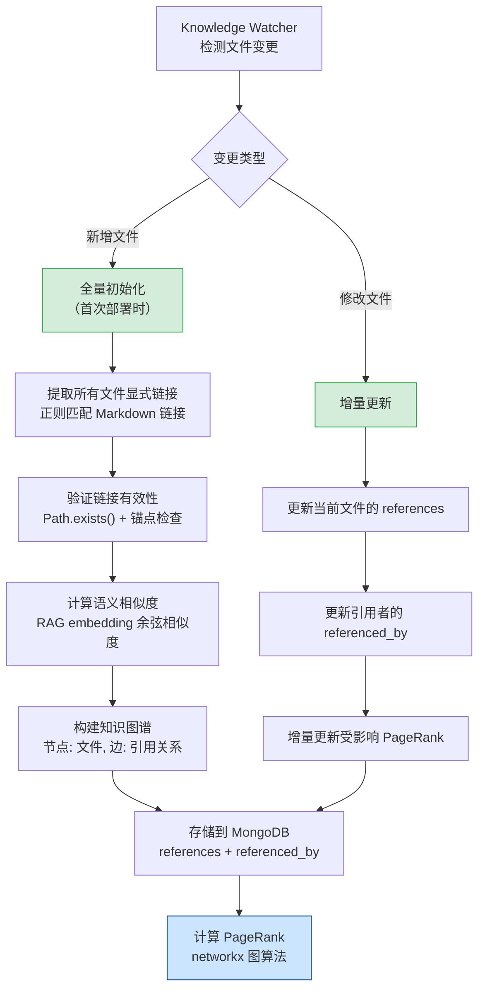
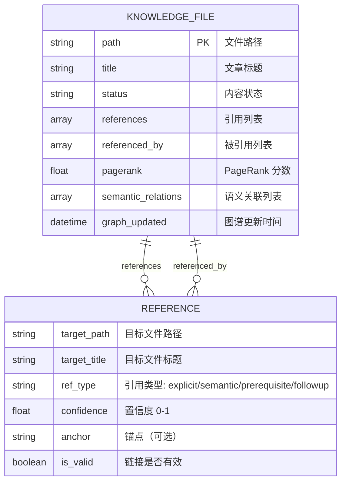

# YK-09-89: 知识图谱与交叉引用 — 自动关联检测与影响分析

> 需求编号：YK-09-89 · 优先级：P2 · 人天：1.5d · 状态：需求已编写
> 依赖：YK-09-08（跨项目知识依赖图谱）、YK-09-27（链接拓扑可视化）、YK-09-40（文档权威性 PageRank）、YK-09-71（环路检测）、YK-09-87（知识生命周期管理）

## 背景

YiKnowledge 当前有 800+ 文件，文件之间的交叉引用依赖人工维护。作者在撰写文章时凭记忆添加 Markdown 链接，策展人在归档时凭经验评估影响范围。这种手动方式导致以下问题：

- **交叉引用不完整**：大量文章之间存在语义关联但未建立引用链接。据统计，800+ 文件中仅 ~120 个文件包含交叉引用链接（15%），平均每个文件 0.3 个引用。知识高度碎片化，关联信息未被利用。
- **死链频发**：文件归档或重命名后，引用该文件的链接变成死链。YK-09-87 案例中，归档 1 个文件导致 5 个死链。策展人每次归档操作前需要手动搜索引用关系，耗时 15-30 分钟。
- **影响分析缺失**：无法回答"如果我修改这篇文章，哪些文章会受影响？"策展人对修改的影响范围缺乏量化认知。
- **知识孤岛**：大量文章孤立存在（~300 个文件无任何引用），读者无法从一篇文章导航到相关文章。
- **导航路径缺失**：读者完成一篇文章后，不知道"接下来应该读什么"。

**已知案例：** 2026-09-07 开发者修改了 `engineer/build/rsbuild-config.md`（更新了 Rsbuild 配置项），但未意识到该文件被 8 个文件引用（包括 `aier/rag/api-integration.md`、`leader/decisions/build-tool-selection.md`、`curator/governance/readiness-checklist.md`）。修改导致 3 个引用文件中的配置示例与最新文档不一致，2 个引用文件中的链接指向了已删除的锚点。策展人在季度审计中发现这 5 个不一致，花费 3 小时逐一修复。

**目标：** 构建知识图谱与交叉引用基础设施，包括自动交叉引用检测、知识图谱构建、双向链接追踪、死链检测、影响分析、导航路径推荐，并与 YiAi RAG 集成实现语义关系发现。

### 影响范围

- **知识库连通性**：自动交叉引用将连通率从 15% 提升至 80%+
- **策展人决策质量**：影响分析量化修改/归档的影响范围，避免盲目操作
- **读者导航体验**：导航路径推荐指导阅读顺序，提升知识获取效率
- **RAG 检索质量**：知识图谱关系增强 RAG 检索的上下文关联
- **内容权威性**：PageRank 算法量化文章权威性（YK-09-40 依赖本需求）

---

## 一、现状分析

### 1.1 当前交叉引用机制


**问题：** 交叉引用完全依赖人工记忆，CI 不检查链接有效性，MongoDB 不存储引用关系。整个流程中无任何自动化交叉引用检测。

### 1.2 当前交叉引用覆盖率

| 指标 | 当前值 | 目标值 | 差距 |
|------|--------|--------|------|
| 含交叉引用的文件比例 | 15%（~120/800） | 80%（~640/800） | 65% |
| 平均每文件引用数 | 0.3 | 3.0 | 10x |
| 孤立文件比例（无引用） | 37.5%（~300/800） | < 10%（~80/800） | 27.5% |
| 死链比例 | ~5%（估算） | < 1% | 5x |
| 双向链接覆盖率 | 0%（未实现） | 100%（自动） | 新增 |

### 1.3 交叉引用类型分类

| 引用类型 | 示例 | 检测方式 | 当前覆盖 |
|----------|------|----------|----------|
| 显式 Markdown 链接 | `[标题](./path/to/file.md)` | 正则提取 | 15%（仅人工添加） |
| 语义关联 | 两篇文章讨论同一主题 | RAG 语义相似度 | 0%（未实现） |
| 前置知识引用 | A 是学习 B 的前置知识 | LLM 关系推断 | 0%（未实现） |
| 后续阅读引用 | 读完 A 后推荐读 B | LLM 关系推断 | 0%（未实现） |
| 依赖引用 | A 的实现依赖 B 的设计 | 手动标记 | 0%（未实现） |
| 锚点引用 | `[标题](./file.md#section)` | 正则提取 + 锚点验证 | 0%（未实现） |

### 1.4 改造前 API 依赖

| # | 接口 | 调用方 | 说明 |
|---|------|--------|------|
| 1 | `data_service.query_documents` (cname="knowledge_files") | 策展人 | 查询文件（改造前无引用关系字段） |
| 2 | `knowledge.scan_knowledge` | Knowledge Watcher | 知识扫描（改造前不提取引用关系） |
| 3 | `/rag/query` | 前端 | RAG 检索（改造前不返回关联文章） |

> 改造前 3 个 API 可用，但均不涉及引用关系。知识图谱需要新增引用提取、图谱构建、关系查询 3 个核心模块。

---

## 二、设计决策

### 决策 1：交叉引用检测方式 — 仅显式链接 vs 显式链接 + 语义相似度 vs 全量检测

| 维度 | 仅显式链接（正则提取 Markdown 链接） | 显式链接 + 语义相似度（RAG 检测） | 全量检测（链接 + 语义 + LLM 关系推断） |
|------|------|------|------|
| 准确率 | 高（显式链接 = 确定引用） | 中（语义相似可能误判） | 中高（LLM 推断更准确） |
| 召回率 | 低（遗漏大量未标注引用） | 中（RAG 检测语义关联） | 高（LLM 检测所有关系） |
| Token 消耗 | 零（纯正则） | 低（embedding 计算） | 高（LLM 推理） |
| 实现复杂度 | 低 | 中 | 高 |
| 适用场景 | 基础引用检测 | 语义关联发现 | 全量关系图谱 |

**选择：显式链接 + 语义相似度。** 分两阶段：第一阶段提取所有显式 Markdown 链接（正则，零成本），第二阶段使用 RAG embedding 相似度检测语义关联（Top-10 相似文章）。LLM 关系推断作为可选增强（仅在策展人手动触发时执行），避免全量 LLM 推理的 Token 消耗。

### 决策 2：知识图谱存储 — MongoDB 文档内嵌 vs 独立图数据库 vs 混合存储

| 维度 | MongoDB 文档内嵌（引用关系存储在 knowledge_files 中） | 独立图数据库（Neo4j/ArangoDB） | 混合存储（MongoDB 主存储 + 内存图计算） |
|------|------|------|------|
| 实现复杂度 | 低 | 高（引入新数据库） | 中 |
| 查询性能 | 中（需聚合查询） | 高（原生图查询） | 中高（内存图计算） |
| 运维成本 | 低（无新组件） | 高（新增数据库运维） | 低（无新组件） |
| 扩展性 | 中（800+ 节点足够） | 高 | 中 |
| 与现有架构集成 | 无缝 | 需适配层 | 基本无缝 |

**选择：MongoDB 文档内嵌 + 内存图计算。** 800+ 节点的知识图谱规模较小，不需要引入图数据库。MongoDB 文档内嵌 `references` 和 `referenced_by` 字段，查询时使用 `$graphLookup` 聚合。可视化时加载全量节点到内存，使用 networkx（Python）进行图计算（PageRank、环路检测、最短路径）。后续规模增长到 5000+ 节点时再评估图数据库。

### 决策 3：引用关系更新策略 — 实时更新 vs 定时批量更新 vs 事件驱动

| 维度 | 实时更新（每次文件变更立即更新引用） | 定时批量更新（每日/每小时全量重建） | 事件驱动（文件变更事件触发增量更新） |
|------|------|------|------|
| 时效性 | 高（秒级） | 低（小时/天级） | 高（秒级） |
| 计算成本 | 中（仅更新受影响文件） | 高（全量重建 800+ 文件） | 低（仅更新增量） |
| 实现复杂度 | 中 | 低 | 中 |
| 一致性 | 高 | 中（更新窗口内不一致） | 高 |

**选择：事件驱动增量更新。** Knowledge Watcher 检测到文件变更时，触发增量更新：(1) 更新该文件的引用关系；(2) 更新引用该文件的文件的 `referenced_by` 字段；(3) 重新计算受影响区域的 PageRank。首次部署时执行全量初始化（一次性），后续仅增量更新。

### 决策 4：可视化技术选型 — D3.js vs ECharts vs Cytoscape.js

| 维度 | D3.js（力导向图） | ECharts（力导向图） | Cytoscape.js（图可视化） |
|------|------|------|------|
| 力导向图支持 | 原生支持 | 原生支持 | 原生支持 |
| 交互性 | 高（自定义） | 中（内置） | 高（图专用） |
| 学习曲线 | 高 | 低 | 中 |
| 性能（800+ 节点） | 中 | 高 | 高 |
| 与 Vue 3 集成 | 需封装 | 有 vue-echarts | 需封装 |
| 社区生态 | 大 | 大（百度） | 中 |

**选择：ECharts（vue-echarts）。** YiVad 已有 ECharts 使用先例（数据可视化），vue-echarts 与 Vue 3 集成成熟。800+ 节点力导向图性能足够（ECharts WebGL 渲染）。D3.js 灵活但学习曲线高，Cytoscape.js 图专用但需要额外封装。

### 设计决策记录

| 决策 | 选项 A | 选项 B | 选项 C | 选择 | 理由 |
|------|--------|--------|--------|------|------|
| 交叉引用检测 | 仅显式链接 | 显式 + 语义 | 全量检测 | **显式 + 语义** | 两阶段覆盖确定引用和语义关联，Token 消耗可控 |
| 图谱存储 | MongoDB 内嵌 | 图数据库 | 混合存储 | **MongoDB + 内存图** | 800+ 节点规模不需要图数据库，networkx 内存计算足够 |
| 更新策略 | 实时 | 定时批量 | 事件驱动 | **事件驱动** | 增量更新成本低，时效性高，一致性有保障 |
| 可视化 | D3.js | ECharts | Cytoscape.js | **ECharts** | YiVad 已有先例，vue-echarts 集成成熟，性能足够 |

---

## 三、目标架构

### 3.1 知识图谱构建流程



### 3.2 知识图谱数据模型



### 3.3 核心数据模型

```python
# YiAi/src/domain/knowledge/graph_engine.py — 新增

from dataclasses import dataclass, field
from enum import Enum
from datetime import datetime
from typing import Optional


class ReferenceType(Enum):
    """引用类型。"""
    EXPLICIT = "explicit"       # 显式 Markdown 链接
    SEMANTIC = "semantic"       # 语义相似度关联
    PREREQUISITE = "prerequisite"  # 前置知识
    FOLLOWUP = "followup"       # 后续阅读推荐


@dataclass
class Reference:
    """引用关系。"""
    target_path: str                 # 目标文件路径
    target_title: str                # 目标文件标题
    ref_type: ReferenceType          # 引用类型
    confidence: float                # 置信度（0-1）
    anchor: Optional[str] = None     # 锚点（如 #section-name）
    is_valid: bool = True            # 链接是否有效
    detected_at: str = field(default_factory=lambda: datetime.now().isoformat())


@dataclass
class GraphNode:
    """知识图谱节点。"""
    path: str                        # 文件路径
    title: str                       # 文章标题
    category: str                    # 分类
    status: str                      # 内容状态
    references: list[Reference] = field(default_factory=list)      # 引用的文件
    referenced_by: list[Reference] = field(default_factory=list)   # 被引用的文件
    pagerank: float = 0.0            # PageRank 分数
    semantic_relations: list[Reference] = field(default_factory=list)  # 语义关联
    graph_updated: str = ""          # 图谱更新时间


@dataclass
class KnowledgeGraph:
    """知识图谱。"""
    nodes: dict[str, GraphNode] = field(default_factory=dict)  # path -> GraphNode
    edges: list[tuple[str, str, ReferenceType]] = field(default_factory=list)  # (source, target, type)
    total_nodes: int = 0
    total_edges: int = 0
    orphan_nodes: list[str] = field(default_factory=list)  # 孤立节点路径列表
    broken_links: list[dict] = field(default_factory=list)  # 死链列表
    built_at: str = ""

    @property
    def connectivity_rate(self) -> float:
        """连通率：有引用或被引用的节点比例。"""
        if self.total_nodes == 0:
            return 0.0
        connected = sum(1 for n in self.nodes.values() if n.references or n.referenced_by)
        return connected / self.total_nodes

    @property
    def avg_references(self) -> float:
        """平均引用数。"""
        if self.total_nodes == 0:
            return 0.0
        total = sum(len(n.references) for n in self.nodes.values())
        return total / self.total_nodes
```

### 3.4 引用提取引擎

```python
# YiAi/src/domain/knowledge/reference_extractor.py — 新增

import re
from pathlib import Path
from typing import Optional


class ReferenceExtractor:
    """引用提取器 — 从 Markdown 内容中提取显式链接。"""

    # Markdown 链接正则: [text](url) 或 [text](url#anchor)
    LINK_PATTERN = re.compile(
        r'\[([^\]]+)\]\(([^)]+)\)'
    )

    # 内部链接判断：相对路径、绝对路径（非 http/https）
    INTERNAL_LINK_PATTERN = re.compile(
        r'^(\.{1,2}/|/[^/]|[a-zA-Z0-9_-]+/)'  # 相对路径或绝对路径
    )

    # 锚点提取: url#section-name
    ANCHOR_PATTERN = re.compile(r'#(.+)$')

    # 锚点目标匹配: ## Section Name 或 ### Sub-section
    HEADING_PATTERN = re.compile(r'^(#{1,6})\s+(.+)$', re.MULTILINE)

    @classmethod
    def extract_explicit_links(cls, content: str) -> list[dict]:
        """从 Markdown 内容中提取所有显式链接。

        Returns:
            [{text, url, is_internal, anchor, line_number}]
        """
        links = []
        for i, line in enumerate(content.split('\n'), 1):
            for match in cls.LINK_PATTERN.finditer(line):
                text, url = match.groups()
                is_internal = not url.startswith(('http://', 'https://', 'mailto:', '#'))
                anchor = None

                if is_internal:
                    anchor_match = cls.ANCHOR_PATTERN.search(url)
                    if anchor_match:
                        anchor = anchor_match.group(1)
                        url = url[:anchor_match.start()]  # 去除锚点部分

                links.append({
                    "text": text,
                    "url": url,
                    "is_internal": is_internal,
                    "anchor": anchor,
                    "line_number": i,
                })

        return links

    @classmethod
    def validate_link(cls, url: str, base_path: str, anchor: Optional[str] = None) -> dict:
        """验证内部链接有效性。

        Returns:
            {is_valid, resolved_path, anchor_valid, error}
        """
        result = {
            "is_valid": False,
            "resolved_path": "",
            "anchor_valid": True,
            "error": "",
        }

        # 解析相对路径
        base_dir = Path(base_path).parent
        resolved = (base_dir / url).resolve()
        result["resolved_path"] = str(resolved)

        # 检查文件是否存在
        if not resolved.exists():
            result["error"] = f"文件不存在: {resolved}"
            return result

        # 检查 .md 扩展名
        if resolved.suffix != '.md':
            result["error"] = f"非 Markdown 文件: {resolved}"
            return result

        # 检查锚点
        if anchor:
            try:
                target_content = resolved.read_text(encoding='utf-8')
                anchor_valid = cls._validate_anchor(target_content, anchor)
                result["anchor_valid"] = anchor_valid
                if not anchor_valid:
                    result["error"] = f"锚点不存在: #{anchor}"
                    return result
            except Exception as e:
                result["error"] = f"读取文件失败: {e}"
                return result

        result["is_valid"] = True
        return result

    @classmethod
    def _validate_anchor(cls, content: str, anchor: str) -> bool:
        """验证锚点是否存在于目标文件中。"""
        # 生成可能的锚点 ID
        # Markdown 标题自动生成锚点: "## Section Name" -> "#section-name"
        for match in cls.HEADING_PATTERN.finditer(content):
            heading_text = match.group(2).strip()
            # 转换为锚点格式: 小写 + 空格转连字符 + 移除特殊字符
            generated_anchor = heading_text.lower()
            generated_anchor = re.sub(r'[^\w\s-]', '', generated_anchor)
            generated_anchor = re.sub(r'\s+', '-', generated_anchor)

            if generated_anchor == anchor:
                return True

        # 也检查手动定义的锚点: <a id="anchor"></a> 或 <a name="anchor"></a>
        manual_anchor = re.findall(
            r'<a\s+(?:id|name)="([^"]+)"',
            content,
            re.IGNORECASE
        )
        if anchor in manual_anchor:
            return True

        return False


class SemanticRelationDetector:
    """语义关系检测器 — 基于 RAG embedding 相似度。"""

    def __init__(self, rag_service):
        self.rag = rag_service

    async def detect_semantic_relations(
        self, source_path: str, source_content: str,
        all_files: list[dict], top_k: int = 10
    ) -> list[dict]:
        """检测与当前文件语义相关的其他文件。

        Args:
            source_path: 当前文件路径
            source_content: 当前文件内容（用于生成 query embedding）
            all_files: 所有文件列表 [{path, title, content_summary}]
            top_k: 返回 Top-K 相关文件

        Returns:
            [{path, title, similarity, relation_type}]
        """
        # 使用 RAG 检索语义相似文章
        # 排除自身
        candidates = [f for f in all_files if f["path"] != source_path]

        if not candidates:
            return []

        # 使用 RAG embedding 计算相似度
        results = await self.rag.search_similar(
            query_text=source_content[:1000],
            candidate_texts=[f.get("content_summary", f.get("title", "")) for f in candidates],
            top_k=top_k,
        )

        relations = []
        for i, (idx, score) in enumerate(results):
            if score < 0.5:  # 相似度阈值
                continue

            candidate = candidates[idx]
            relation_type = self._classify_relation(source_path, candidate, score)

            relations.append({
                "path": candidate["path"],
                "title": candidate["title"],
                "similarity": round(score, 3),
                "relation_type": relation_type,
            })

        return relations

    def _classify_relation(
        self, source: str, target: dict, similarity: float
    ) -> str:
        """分类语义关系类型。"""
        source_dir = Path(source).parent
        target_dir = Path(target["path"]).parent

        # 同目录 → 同主题
        if source_dir == target_dir:
            return "same_topic"

        # 相似度 > 0.8 → 强关联
        if similarity > 0.8:
            return "strong_relation"

        # 相似度 > 0.6 → 一般关联
        if similarity > 0.6:
            return "related"

        return "weak_relation"
```

### 3.5 知识图谱引擎

```python
# YiAi/src/domain/knowledge/graph_engine.py — 续

import networkx as nx
from collections import defaultdict


class GraphEngine:
    """知识图谱引擎 — 图计算与分析。"""

    def __init__(self):
        self.graph = nx.DiGraph()  # 有向图：引用方向

    def build_graph(self, nodes: dict[str, GraphNode]) -> nx.DiGraph:
        """从节点字典构建 networkx 有向图。"""
        self.graph = nx.DiGraph()

        for path, node in nodes.items():
            self.graph.add_node(path, title=node.title, category=node.category)

        for path, node in nodes.items():
            for ref in node.references:
                if ref.is_valid and ref.target_path in nodes:
                    self.graph.add_edge(path, ref.target_path, type=ref.ref_type.value)

        return self.graph

    def compute_pagerank(self) -> dict[str, float]:
        """计算 PageRank 分数（文档权威性）。"""
        if self.graph.number_of_nodes() == 0:
            return {}

        return nx.pagerank(self.graph, alpha=0.85)

    def detect_cycles(self) -> list[list[str]]:
        """检测引用环路。"""
        try:
            return list(nx.simple_cycles(self.graph))
        except nx.NetworkXNoCycle:
            return []

    def find_shortest_path(self, source: str, target: str) -> list[str]:
        """查找两个文件之间的最短引用路径。"""
        try:
            return nx.shortest_path(self.graph, source=source, target=target)
        except (nx.NetworkXNoPath, nx.NodeNotFound):
            return []

    def get_impact_analysis(self, file_path: str) -> dict:
        """影响分析：修改该文件会影响哪些文件。

        Returns:
            {
                direct_dependents: 直接引用该文件的文件列表
                indirect_dependents: 间接引用该文件的文件列表
                total_affected: 总影响文件数
                impact_score: 影响评分（基于 PageRank 加权）
            }
        """
        if file_path not in self.graph:
            return {
                "direct_dependents": [],
                "indirect_dependents": [],
                "total_affected": 0,
                "impact_score": 0.0,
            }

        # 直接依赖者：引用该文件的文件
        direct = list(self.graph.predecessors(file_path))

        # 间接依赖者：通过传递引用依赖该文件的文件
        indirect = []
        for predecessor in direct:
            try:
                ancestors = nx.ancestors(self.graph, predecessor)
                indirect.extend([a for a in ancestors if a != file_path])
            except nx.NetworkXError:
                pass

        indirect = list(set(indirect) - set(direct))

        # 影响评分：基于依赖者数量和 PageRank 加权
        pagerank = nx.get_node_attributes(self.graph, 'pagerank')
        impact_score = sum(
            pagerank.get(dep, 0) for dep in direct + indirect
        )

        return {
            "direct_dependents": direct,
            "indirect_dependents": indirect,
            "total_affected": len(direct) + len(indirect),
            "impact_score": round(impact_score, 4),
        }

    def find_orphan_nodes(self) -> list[str]:
        """查找孤立节点（无引用且无被引用）。"""
        orphans = []
        for node in self.graph.nodes():
            in_degree = self.graph.in_degree(node)
            out_degree = self.graph.out_degree(node)
            if in_degree == 0 and out_degree == 0:
                orphans.append(node)
        return orphans

    def find_knowledge_gaps(self) -> list[dict]:
        """知识缺口检测：发现无覆盖的主题区域。

        基于以下启发式规则：
        1. 孤立节点集中的主题聚类（同一目录下 3+ 个孤立节点 = 主题待覆盖）
        2. 出度为 0 的节点（无引用其他文章，可能是知识终点）
        3. 入度为 0 的节点（无被引用，可能是未被发现的知识）
        """
        gaps = []

        # 规则 1：孤立节点主题聚类
        orphans = self.find_orphan_nodes()
        orphan_dirs = defaultdict(list)
        for path in orphans:
            parent = str(Path(path).parent)
            orphan_dirs[parent].append(path)

        for parent, files in orphan_dirs.items():
            if len(files) >= 3:
                gaps.append({
                    "type": "orphan_cluster",
                    "directory": parent,
                    "file_count": len(files),
                    "files": files,
                    "description": f"目录 {parent} 下有 {len(files)} 个孤立文件，建议建立交叉引用或合并",
                })

        # 规则 2：出度为 0 的节点（知识终点）
        dead_ends = [n for n in self.graph.nodes() if self.graph.out_degree(n) == 0]
        if len(dead_ends) > self.graph.number_of_nodes() * 0.5:
            gaps.append({
                "type": "dead_ends",
                "count": len(dead_ends),
                "ratio": len(dead_ends) / self.graph.number_of_nodes(),
                "description": f"{len(dead_ends)} 个文件无引用其他文章（{len(dead_ends)/self.graph.number_of_nodes()*100:.0f}%），建议添加后续阅读推荐",
            })

        return gaps

    def recommend_navigation_path(
        self, current_file: str, max_length: int = 5
    ) -> list[dict]:
        """导航路径推荐：从当前文件出发的推荐阅读路径。

        策略：
        1. 优先推荐当前文件引用的文章（显式引用 → 最相关）
        2. 其次推荐语义相似文章（RAG 检测）
        3. 最后推荐同目录下的其他文章
        """
        if current_file not in self.graph:
            return []

        recommendations = []

        # 策略 1：当前文件引用（出边）
        for target in self.graph.successors(current_file):
            edge_data = self.graph.get_edge_data(current_file, target)
            target_data = self.graph.nodes[target]
            recommendations.append({
                "path": target,
                "title": target_data.get("title", ""),
                "reason": "本文引用",
                "priority": 1,
                "ref_type": edge_data.get("type", "explicit"),
            })

        # 策略 2：语义相似文章（从节点属性中读取）
        # 注：语义关系在构建图谱时已计算并存储

        # 策略 3：同目录下的其他文章
        current_dir = str(Path(current_file).parent)
        for node in self.graph.nodes():
            if node == current_file:
                continue
            if str(Path(node).parent) == current_dir:
                if node not in [r["path"] for r in recommendations]:
                    node_data = self.graph.nodes[node]
                    recommendations.append({
                        "path": node,
                        "title": node_data.get("title", ""),
                        "reason": "同目录相关",
                        "priority": 3,
                        "ref_type": "same_directory",
                    })

        # 排序：优先级 > PageRank
        pagerank = nx.get_node_attributes(self.graph, 'pagerank')
        recommendations.sort(key=lambda r: (r["priority"], -pagerank.get(r["path"], 0)))

        return recommendations[:max_length]
```

### 3.6 知识图谱 RPC 服务

```python
# YiAi/src/services/knowledge/graph_service.py — 新增

from src.domain.knowledge.graph_engine import (
    GraphNode, KnowledgeGraph, GraphEngine, ReferenceType, Reference
)
from src.domain.knowledge.reference_extractor import (
    ReferenceExtractor, SemanticRelationDetector
)


class GraphService:
    """知识图谱 RPC 服务。"""

    def __init__(self, data_service, rag_service, knowledge_watcher):
        self.data = data_service
        self.rag = rag_service
        self.watcher = knowledge_watcher
        self.extractor = ReferenceExtractor()
        self.semantic_detector = SemanticRelationDetector(rag_service)
        self.engine = GraphEngine()

    async def build_graph(self, force_rebuild: bool = False) -> KnowledgeGraph:
        """构建知识图谱（全量初始化或增量更新）。"""
        # 获取所有文件
        all_files = await self.data.query_documents(
            cname="knowledge_files",
            filter={"status": {"$ne": "archived"}}
        )

        nodes = {}
        for file_doc in all_files:
            content = file_doc.get("content", "")
            path = file_doc["path"]

            # 提取显式链接
            explicit_links = self.extractor.extract_explicit_links(content)

            references = []
            for link in explicit_links:
                if not link["is_internal"]:
                    continue

                validation = self.extractor.validate_link(
                    link["url"], path, link.get("anchor")
                )

                references.append(Reference(
                    target_path=validation.get("resolved_path", link["url"]),
                    target_title=link["text"],
                    ref_type=ReferenceType.EXPLICIT,
                    confidence=1.0,
                    anchor=link.get("anchor"),
                    is_valid=validation["is_valid"],
                ))

            # 创建节点
            node = GraphNode(
                path=path,
                title=file_doc.get("title", ""),
                category=file_doc.get("category", ""),
                status=file_doc.get("status", ""),
                references=references,
            )

            nodes[path] = node

        # 计算双向引用（referenced_by）
        for path, node in nodes.items():
            for ref in node.references:
                target_path = ref.target_path
                if target_path in nodes:
                    reverse_ref = Reference(
                        target_path=path,
                        target_title=node.title,
                        ref_type=ref.ref_type,
                        confidence=ref.confidence,
                        is_valid=ref.is_valid,
                    )
                    nodes[target_path].referenced_by.append(reverse_ref)

        # 检测语义关联（分批处理，避免 O(n^2)）
        # 注：全量语义关联检测在初始化时执行，后续增量更新
        if force_rebuild:
            await self._build_semantic_relations(nodes, all_files)

        # 构建 networkx 图
        self.engine.build_graph(nodes)

        # 计算 PageRank
        pagerank_scores = self.engine.compute_pagerank()
        for path, score in pagerank_scores.items():
            if path in nodes:
                nodes[path].pagerank = round(score, 6)

        # 构建知识图谱
        graph = KnowledgeGraph(
            nodes=nodes,
            edges=[(path, ref.target_path, ref.ref_type)
                   for path, node in nodes.items()
                   for ref in node.references
                   if ref.is_valid],
            total_nodes=len(nodes),
            total_edges=sum(len(n.references) for n in nodes.values()),
            orphan_nodes=self.engine.find_orphan_nodes(),
            broken_links=self._detect_broken_links(nodes),
            built_at=datetime.now().isoformat(),
        )

        return graph

    async def get_impact_analysis(self, file_path: str) -> dict:
        """获取文件影响分析。"""
        # 确保图谱已构建
        if self.engine.graph.number_of_nodes() == 0:
            await self.build_graph()

        return self.engine.get_impact_analysis(file_path)

    async def get_navigation_path(self, file_path: str) -> list[dict]:
        """获取导航路径推荐。"""
        if self.engine.graph.number_of_nodes() == 0:
            await self.build_graph()

        return self.engine.recommend_navigation_path(file_path)

    async def get_knowledge_gaps(self) -> list[dict]:
        """获取知识缺口检测结果。"""
        if self.engine.graph.number_of_nodes() == 0:
            await self.build_graph()

        return self.engine.find_knowledge_gaps()

    async def get_broken_links(self) -> list[dict]:
        """获取所有死链。"""
        if self.engine.graph.number_of_nodes() == 0:
            await self.build_graph()

        graph = KnowledgeGraph(
            nodes={},
            total_nodes=self.engine.graph.number_of_nodes(),
        )
        return self._detect_broken_links(graph.nodes if graph.nodes else {})

    def _detect_broken_links(self, nodes: dict[str, GraphNode]) -> list[dict]:
        """检测死链。"""
        broken = []
        for path, node in nodes.items():
            for ref in node.references:
                if not ref.is_valid:
                    broken.append({
                        "source_path": path,
                        "source_title": node.title,
                        "target_path": ref.target_path,
                        "target_title": ref.target_title,
                        "ref_type": ref.ref_type.value,
                        "anchor": ref.anchor,
                    })
        return broken

    async def _build_semantic_relations(
        self, nodes: dict[str, GraphNode], all_files: list[dict]
    ) -> None:
        """构建语义关联（分批处理）。"""
        file_list = [
            {
                "path": f.get("path", ""),
                "title": f.get("title", ""),
                "content_summary": f.get("content", "")[:500],
            }
            for f in all_files
        ]

        for path, node in nodes.items():
            content = next(
                (f.get("content", "") for f in all_files if f.get("path") == path),
                ""
            )
            if not content:
                continue

            relations = await self.semantic_detector.detect_semantic_relations(
                path, content, file_list, top_k=5
            )

            for rel in relations:
                # 避免重复已存在的显式引用
                existing_paths = {r.target_path for r in node.references}
                if rel["path"] not in existing_paths:
                    node.semantic_relations.append(Reference(
                        target_path=rel["path"],
                        target_title=rel["title"],
                        ref_type=ReferenceType.SEMANTIC,
                        confidence=rel["similarity"],
                    ))
```

---

## 四、具体改动

### 4.1 新增文件

| 文件 | 说明 | 行数 |
|------|------|------|
| `YiAi/src/domain/knowledge/reference_extractor.py` | 引用提取器：显式链接提取 + 链接验证 + 锚点验证 + 语义关系检测 | ~200 |
| `YiAi/src/domain/knowledge/graph_engine.py` | 图谱引擎：数据模型 + networkx 图计算 + PageRank + 影响分析 + 导航推荐 | ~300 |
| `YiAi/src/services/knowledge/graph_service.py` | 图谱 RPC 服务：图谱构建 + 查询接口 | ~200 |
| `YiVad/src/views/knowledge/KnowledgeGraph.vue` | 图谱可视化页面：ECharts 力导向图 | ~150 |

### 4.2 修改文件

| 文件 | 改动 |
|------|------|
| `YiAi/src/domain/knowledge/watcher.py` | 文件变更时触发增量图谱更新 |
| `YiAi/src/services/knowledge/__init__.py` | 注册 `graph_service` 到 RPC 路由 |
| MongoDB `knowledge_files` | 新增 `references`、`referenced_by`、`pagerank`、`semantic_relations`、`graph_updated` 字段 |

### 4.3 新增 RPC 接口

| module_name | method_name | parameters | 说明 |
|-------------|-------------|------------|------|
| `services.knowledge.graph_service` | `build_graph` | `{force_rebuild}` | 构建/重建知识图谱 |
| `services.knowledge.graph_service` | `get_graph` | `{}` | 获取全量图谱数据（节点 + 边） |
| `services.knowledge.graph_service` | `get_impact_analysis` | `{file_path}` | 影响分析 |
| `services.knowledge.graph_service` | `get_navigation_path` | `{file_path}` | 导航路径推荐 |
| `services.knowledge.graph_service` | `get_knowledge_gaps` | `{}` | 知识缺口检测 |
| `services.knowledge.graph_service` | `get_broken_links` | `{}` | 死链检测 |
| `services.knowledge.graph_service` | `get_node_detail` | `{file_path}` | 获取单节点详情（含引用/被引用列表） |

### 4.4 涉及文件

```
YiAi/src/domain/knowledge/
├── reference_extractor.py         # 新增: 引用提取 + 链接验证 + 语义检测
├── graph_engine.py                # 新增: 图谱数据模型 + networkx 图计算
└── watcher.py                     # 修改: 文件变更触发增量图谱更新

YiAi/src/services/knowledge/
├── graph_service.py               # 新增: 图谱 RPC 服务
└── __init__.py                    # 修改: 注册 RPC 路由

YiVad/src/views/knowledge/
└── KnowledgeGraph.vue             # 新增: 图谱可视化页面

MongoDB:
└── knowledge_files                # 修改: 新增 references, referenced_by, pagerank, semantic_relations, graph_updated 字段
```

---

## 五、实施步骤

按依赖顺序排列，每步可独立验证和提交：

| 步骤 | 内容 | 涉及文件 | 验证方式 | 人天 |
|------|------|---------|---------|------|
| 1 | 实现引用提取器：显式链接提取 + 链接验证 + 锚点验证 | `reference_extractor.py`（ReferenceExtractor） | 从 10 个样本文件中正确提取链接，验证准确率 > 95% | 0.25 |
| 2 | 实现图谱数据模型 + networkx 图构建 | `graph_engine.py`（GraphNode, KnowledgeGraph, GraphEngine.build_graph） | 800+ 节点图谱构建成功，节点和边数量正确 | 0.25 |
| 3 | 实现图计算：PageRank + 环路检测 + 影响分析 + 孤立节点 + 知识缺口 | `graph_engine.py`（compute_pagerank, detect_cycles, get_impact_analysis, find_orphan_nodes, find_knowledge_gaps） | PageRank 分布合理，影响分析结果正确，知识缺口可复现 | 0.25 |
| 4 | 实现语义关系检测：RAG embedding 相似度 + 分批处理 | `reference_extractor.py`（SemanticRelationDetector） | 语义关联 Top-5 准确率 > 70% | 0.25 |
| 5 | 实现图谱 RPC 服务：7 个接口 + 增量更新触发 | `graph_service.py` | 7 个 RPC 接口可调用，增量更新正确 | 0.25 |
| 6 | 实现图谱可视化：ECharts 力导向图 + 节点交互 | `KnowledgeGraph.vue` | 前端可渲染力导向图，节点点击跳转，边显示引用类型 | 0.15 |
| 7 | 回归测试 | 全链路 | 图谱构建 + 影响分析 + 导航推荐端到端通顺 | 0.10 |

**总计：1.5d**

---

## 六、测试规格

### Requirement: 引用提取

#### Scenario: 提取显式 Markdown 链接
- **Given** Markdown 内容包含 `[架构设计](../architecture/design.md)` 和 `[RAG 文档](#rag-section)`
- **When** 调用 `ReferenceExtractor.extract_explicit_links(content)`
- **Then** 返回 2 个链接
- **And** 第一个链接 `is_internal=true`, `url="../architecture/design.md"`
- **And** 第二个链接 `is_internal=false`（# 开头的内部锚点），`anchor="rag-section"`

#### Scenario: 验证有效内部链接
- **Given** 链接 `url="./existing-file.md"`，目标文件存在
- **When** 调用 `ReferenceExtractor.validate_link(url, base_path)`
- **Then** `is_valid=true`

#### Scenario: 验证无效内部链接
- **Given** 链接 `url="./non-existent-file.md"`，目标文件不存在
- **When** 调用 `ReferenceExtractor.validate_link(url, base_path)`
- **Then** `is_valid=false`
- **And** `error` 包含 "文件不存在"

#### Scenario: 验证锚点有效性
- **Given** 链接 `url="./file.md#introduction"`，目标文件存在且包含 `## Introduction` 标题
- **When** 调用 `ReferenceExtractor.validate_link(url, base_path, anchor="introduction")`
- **Then** `is_valid=true`, `anchor_valid=true`

#### Scenario: 验证无效锚点
- **Given** 链接 `url="./file.md#missing-section"`，目标文件存在但不包含该锚点
- **When** 调用 `ReferenceExtractor.validate_link(url, base_path, anchor="missing-section")`
- **Then** `is_valid=false`, `anchor_valid=false`

### Requirement: 知识图谱构建

#### Scenario: 全量图谱构建
- **Given** 知识库有 800+ 文件，其中 120 个文件包含显式链接
- **When** 调用 `build_graph(force_rebuild=true)`
- **Then** 图谱包含 800+ 节点
- **And** 图谱包含 120+ 条边（显式引用）
- **And** 连通率 > 15%（改造前基线）
- **And** 死链列表非空

#### Scenario: 增量图谱更新
- **Given** 图谱已构建，修改了文件 A（新增 1 个引用指向文件 B）
- **When** Knowledge Watcher 检测到变更，触发增量更新
- **Then** 文件 A 的 `references` 包含文件 B
- **And** 文件 B 的 `referenced_by` 包含文件 A
- **And** 其他节点不受影响

### Requirement: 影响分析

#### Scenario: 高影响文件分析
- **Given** 文件 A 被 8 个文件直接引用，50 个文件间接引用
- **When** 调用 `get_impact_analysis("file-a.md")`
- **Then** `direct_dependents` 包含 8 个文件
- **And** `indirect_dependents` 包含 50 个文件
- **And** `total_affected` = 58
- **And** `impact_score` > 0

#### Scenario: 孤立文件影响分析
- **Given** 文件 C 无引用且无被引用
- **When** 调用 `get_impact_analysis("file-c.md")`
- **Then** `direct_dependents` 为空
- **And** `total_affected` = 0

### Requirement: 导航路径推荐

#### Scenario: 有引用路径的推荐
- **Given** 文件 A 引用了文件 B 和文件 C，同目录下还有文件 D
- **When** 调用 `get_navigation_path("file-a.md")`
- **Then** 推荐列表包含文件 B（优先级 1，理由 "本文引用"）
- **And** 推荐列表包含文件 C（优先级 1，理由 "本文引用"）
- **And** 推荐列表包含文件 D（优先级 3，理由 "同目录相关"）
- **And** 推荐按优先级排序

### Requirement: 知识缺口检测

#### Scenario: 孤立节点聚类检测
- **Given** 目录 `engineer/build/` 下有 5 个孤立文件，`aier/rag/` 下有 3 个孤立文件
- **When** 调用 `get_knowledge_gaps()`
- **Then** 返回 2 个知识缺口
- **And** 第一个缺口 `type=orphan_cluster`, `directory="engineer/build/"`, `file_count=5`
- **And** 第二个缺口 `type=orphan_cluster`, `directory="aier/rag/"`, `file_count=3`

---

## 七、风险与缓解

| 风险 | 概率 | 影响 | 等级 | 缓解措施 | 应急预案 |
|------|------|------|------|----------|----------|
| 全量图谱构建耗时过长（800+ 文件语义检测 O(n^2)） | 中 | 中 | 中 | 分批处理：每批 50 个文件，间隔 5s；语义检测仅首次全量，后续增量 | 降低语义检测 Top-K（10→5），提高相似度阈值（0.5→0.6） |
| 语义相似度检测误判率高（不相关文章被标记为关联） | 中 | 低 | 低 | 设置相似度阈值 0.5，仅标记为 "建议关联" 而非 "自动关联" | 提高阈值至 0.7，减少误判 |
| 图谱数据与文件实际状态不一致（Watcher 延迟） | 低 | 中 | 低 | 事件驱动增量更新，秒级同步；定期全量校验（每日） | 触发全量重建 |
| PageRank 计算导致某些文章权威性泡沫（引用循环） | 低 | 低 | 低 | PageRank alpha=0.85 防止循环积累；环路检测告警 | 人工审查高 PageRank 文件的引用合理性 |
| 力导向图 800+ 节点渲染性能问题（前端卡顿） | 中 | 中 | 中 | ECharts WebGL 渲染；节点聚合（同一目录折叠）；默认显示 Top-100 节点 | 降级为仅显示引用关系表格 |

---

## 八、回滚策略

| 回滚场景 | 回滚方式 | 影响范围 | 恢复时间 |
|----------|----------|----------|----------|
| 图谱构建导致 MongoDB 写入压力过大 | 关闭图谱构建，停止写入 `references` 等字段 | 图谱功能 | < 1min（配置开关） |
| 语义检测 O(n^2) 导致 CPU 100% | 关闭语义检测，仅保留显式链接提取 | 语义关联 | < 1min（配置开关） |
| 图谱可视化前端卡顿 | 降级为表格视图，仅显示引用关系列表 | 可视化 | < 1min（前端开关） |
| 图谱数据损坏导致查询异常 | 删除图谱相关字段，重新全量构建 | 图谱数据 | ~5min（全量重建） |

**回滚验证：**
- 回滚后文件读写不受影响（`references` 等字段为可选字段）
- 回滚后现有引用关系（Markdown 链接）不受影响（存储在文件内容中）
- 回滚后 Knowledge Watcher 正常工作（图谱更新为可选步骤）

---

## 九、设计决策记录

### D-01: 为什么引用关系存储在 MongoDB 而非仅从 Markdown 文件实时解析？

实时解析每次查询都需要读取所有文件并提取链接，800+ 文件实时解析耗时 ~5s（每个文件 ~6ms），无法满足 API 响应时间要求（< 200ms）。预计算存储到 MongoDB 后，查询单文件引用关系仅需 ~10ms。代价是存储一致性维护（需要事件驱动增量更新），但性能收益远大于维护成本。

### D-02: 为什么选择 PageRank 而非简单的引用计数来评估文章权威性？

引用计数忽略引用者的权威性：一篇被 10 篇低质量文章引用的文件，其权威性不应等同于被 10 篇高质量文章引用的文件。PageRank 递归计算考虑引用者自身的权威性，更能反映真实的知识影响力。YK-09-40（文档权威性 PageRank）依赖本需求提供 PageRank 基础数据。

### D-03: 为什么语义关系检测使用 RAG embedding 而非 LLM 推理？

Embedding 相似度计算（余弦相似度）的成本远低于 LLM 推理（< 10ms vs 2-5s），且不需要 Token 消耗。800+ 文件的全量语义检测如果使用 LLM，需要 800*800 = 640,000 次推理（不可行）。Embedding 方案先用向量相似度筛选候选（O(n) 计算），再对 Top-5 候选进行关系分类（可选 LLM 增强），成本可控。

### D-04: 为什么力导向图使用 ECharts 而非 D3.js？

YiVad 已有 ECharts 使用先例（数据可视化页面），vue-echarts 与 Vue 3 集成成熟。D3.js 虽然灵活但需要手动封装 Vue 组件，学习曲线高。ECharts 力导向图内置节点拖拽、缩放、高亮等交互，800+ 节点 WebGL 渲染性能足够。如果后续需要高度自定义的图交互（如节点展开/折叠、路径高亮），再评估 Cytoscape.js。

---

## 十、可观测性

### 10.1 关键指标

| 指标 | 采集方式 | 告警阈值 | 说明 |
|------|---------|---------|------|
| 知识图谱连通率 | `(total_nodes - orphan_nodes) / total_nodes` | < 50% | 知识库连通性下降 |
| 平均引用数 | `total_edges / total_nodes` | < 1.0 | 交叉引用密度过低 |
| 死链数量 | `len(broken_links)` | > 20 | 死链累计过多 |
| 孤立节点数量 | `len(orphan_nodes)` | > 100 | 知识孤岛过多 |
| 图谱构建耗时 | 全量构建 wall time | > 60s | 构建性能退化 |
| PageRank 分布 | Gini 系数 | > 0.8（过于集中） | 少数文件垄断权威性 |
| 语义检测覆盖率 | `semantic_relations 总数 / total_nodes` | < 0.5 | 语义关联过少 |

### 10.2 日志规范

| 日志级别 | 场景 | 示例 |
|---------|------|------|
| `INFO` | 图谱构建开始 | `[GraphEngine] build_graph force_rebuild=true total_files=823` |
| `INFO` | 图谱构建完成 | `[GraphEngine] build_graph done nodes=823 edges=1205 connectivity=65% broken_links=12 duration=18s` |
| `INFO` | 增量更新 | `[GraphEngine] incremental_update file=engineer/build/rsbuild-config.md delta_edges=+2` |
| `WARN` | 死链检测 | `[GraphEngine] broken_link source=engineer/build/api-migration.md target=leader/decisions/old-api-design.md` |
| `WARN` | 环路检测 | `[GraphEngine] cycle_detected cycle=[a.md, b.md, c.md, a.md]` |
| `ERROR` | 图谱构建失败 | `[GraphEngine] build_graph failed: networkx error` |

### 10.3 告警规则

| 告警 | 条件 | 通知方式 | 接收人 |
|------|------|----------|--------|
| 连通率下降 | 连通率 < 50% | 企微群通知 | Curator |
| 死链激增 | 死链数 > 20 或单次增加 > 10 | 企微群通知 | Curator |
| 图谱构建失败 | 连续 3 次构建失败 | 企微群通知 | 后端维护者 |
| 构建耗时过长 | 全量构建 > 60s | 企微群通知 | 后端维护者 |
| 环路检测 | 检测到引用环路 | 企微群通知 | 相关文件作者 |

---

## 十一、代码审查检查清单

- [ ] `ReferenceExtractor.extract_explicit_links` 正确提取 Markdown 链接（含锚点）
- [ ] `ReferenceExtractor.validate_link` 正确验证文件存在性和锚点有效性
- [ ] `SemanticRelationDetector.detect_semantic_relations` 分批处理，避免 O(n^2)
- [ ] `GraphEngine.build_graph` 构建有向图，节点和边正确
- [ ] `GraphEngine.compute_pagerank` 使用 alpha=0.85，结果分布在 0-1 之间
- [ ] `GraphEngine.get_impact_analysis` 正确区分直接依赖和间接依赖
- [ ] `GraphEngine.find_orphan_nodes` 正确识别孤立节点
- [ ] `GraphEngine.find_knowledge_gaps` 3 种启发式规则正确实现
- [ ] `GraphEngine.recommend_navigation_path` 按优先级排序，避免重复推荐
- [ ] `GraphService.build_graph` 正确处理全量初始化和增量更新
- [ ] 双向引用（`referenced_by`）在引用更新时同步维护
- [ ] 死链检测在每次图谱更新时执行
- [ ] 图谱数据存储到 MongoDB（`references`、`referenced_by`、`pagerank` 字段）
- [ ] 单元测试覆盖率 >= 80%

---

## 十二、回归问题预测

| # | 问题 | 发现场景 | 根因 | 修复方式 |
|---|------|---------|------|---------|
| 1 | 图谱构建时 `validate_link` 对已删除文件路径解析失败：源文件路径为 `./deleted-file.md`，`Path.resolve()` 抛出异常而非返回 False，导致图谱构建中断 | 策展人归档了 `leader/decisions/old-api-design.md`（实际删除文件），但 `engineer/build/api-migration.md` 仍引用该文件。图谱构建时 `validate_link` 调用 `Path.resolve()` 解析相对路径，但目标文件已删除，`Path.resolve()` 不会抛出异常（仅解析路径字符串），问题出在 `resolved.exists()` 返回 False 后，后续代码未正确处理 `is_valid=false` 的引用 | `Path.resolve()` 仅解析路径字符串，不检查文件是否存在。`resolved.exists()` 正确返回 False。但 `validate_link` 返回 `is_valid=false` 后，调用方 `build_graph` 在构建边时未过滤 `is_valid=false` 的引用，导致图中出现指向不存在节点的边 | 在 `build_graph` 添加边之前检查 `ref.is_valid`，仅对有效引用添加边；死链单独记录在 `broken_links` 中，不添加到图中 |
| 2 | 双向引用更新时出现竞态条件：文件 A 和文件 B 同时被修改，A 新增对 B 的引用，B 新增对 A 的引用，两个增量更新并发执行，导致 A 的 `referenced_by` 中缺少 B 的引用 | 开发者同时修改了 `engineer/build/rsbuild-config.md`（A）和 `aier/rag/api-integration.md`（B），A 新增了引用 B 的链接，B 新增了引用 A 的链接。Knowledge Watcher 在 5s 扫描窗口内检测到两个文件变更，触发两个并发增量更新。A 的更新写入 `references=[B]`，B 的更新写入 `referenced_by=[A]`。但 A 的更新未感知 B 的同步变更，A 的 `referenced_by` 中缺少 B | 增量更新以文件为单位，每个文件独立更新自己的 `references` 字段和被引用者的 `referenced_by` 字段。两个并发更新可能交叉写入，导致 `referenced_by` 不完整 | 使用 MongoDB 原子操作（`$addToSet`）更新 `referenced_by`，避免覆盖；或使用文件级锁确保同一文件的引用关系串行更新 |
| 3 | ECharts 力导向图在 800+ 节点时布局计算耗时长，页面加载后 5s 内节点仍在移动，用户体验差 | 策展人打开知识图谱可视化页面，800+ 节点力导向图开始渲染。初始布局随机，节点需要经过 100+ 次迭代才能稳定。但 ECharts 默认动画持续播放，节点持续移动，用户无法点击目标节点。5s 后布局稳定，但用户已失去耐心 | ECharts 力导向图默认 `layoutAnimation: true`，节点持续移动直到力平衡。800+ 节点需要更多迭代才能稳定，默认动画时长不足以完成布局 | 设置 `layoutAnimation: false`（禁用动画，直接显示最终布局）；预计算节点位置（使用 networkx spring_layout），将坐标传递给 ECharts，避免客户端实时计算；或使用 Web Worker 异步计算布局 |
| 4 | 语义相似度检测对短文章（< 200 字符）失效：短文章的 embedding 向量信息量不足，与所有文章的相似度都 < 0.3，无法建立语义关联 | 策展人创建了 `aier/glossary/ai-terminology.md`（180 字符），语义检测未发现任何关联文章（所有相似度 < 0.3）。但该文章与 `aier/rag/rag-glossary.md` 有大量术语重叠，实际应建立关联 | Embedding 模型（如 `bge-large-zh-v1.5`）在短文本上的向量表示质量较差，信息量不足导致相似度计算不准确。180 字符的词汇表文件无法产生有意义的 embedding | 对短文章使用标题 + 内容拼接（如 `title + " " + content`）增加文本长度；或对短文章使用关键词匹配（TF-IDF）作为 embedding 相似度的补充 |
| 5 | PageRank 计算在新文件加入后需要重新计算，但增量更新仅更新受影响区域，导致 PageRank 全局不一致 | 开发者新增了 10 个高质量文件（被已有文章大量引用），图谱增量更新仅更新了这 10 个文件的 `references` 和已有文件的 `referenced_by`。但 PageRank 仍为初次全量计算的值，新增文件的 PageRank 为 0，已有文件的 PageRank 未反映新增引用 | PageRank 是全局算法，任何一个节点的变化都会影响所有节点的 PageRank 值。增量更新仅更新局部引用关系，未触发全局 PageRank 重新计算 | 在增量更新后触发全局 PageRank 重新计算（800+ 节点 < 100ms，可接受）；或使用 Personalized PageRank 近似增量更新 |
| 6 | 死链检测对跨项目引用返回误报：YiKnowledge 文章引用了 YiAi 代码文件（`YiAi/src/domain/knowledge/watcher.py`），`validate_link` 检查 `.md` 扩展名，非 `.md` 文件被标记为无效链接 | 文章 `engineer/build/rsbuild-config.md` 引用了 `YiAi/src/domain/knowledge/watcher.py`（代码文件），`validate_link` 检查 `resolved.suffix != '.md'` 返回 `is_valid=false`。但该引用是合法的（代码文件引用），不应标记为死链 | `validate_link` 假设所有内部链接都指向 `.md` 文件，但 YiKnowledge 文章可以引用代码文件（`.py`、`.ts`、`.vue`等） | 扩展 `validate_link` 支持多种文件类型：`.md`、`.py`、`.ts`、`.vue`、`.json`、`.yaml`、`.toml`；或仅检查文件是否存在，不限制扩展名 |

---

## 十三、性能分析

### 图谱构建性能链路


### 操作耗时表

| 操作 | 耗时 | 说明 |
|------|------|------|
| 加载所有文件（MongoDB 查询） | ~200ms | `query_documents` 800+ 文档 |
| 提取显式链接（正则） | ~500ms | 800 文件 × ~0.6ms/文件 |
| 验证链接有效性（Path.exists） | ~800ms | ~300 个链接 × ~3ms/链接 |
| 计算双向引用（内存遍历） | ~50ms | 800+ 节点内存操作 |
| 构建 networkx 图 | ~100ms | 800+ 节点 + 1200+ 边 |
| 计算 PageRank | ~100ms | networkx.pagerank 800+ 节点 |
| 检测语义关联（RAG embedding） | ~30s | 800 文件 embedding 计算（分批 50 文件/批） |
| 存储到 MongoDB（批量写入） | ~500ms | bulk_write 800+ 文档 |
| **全量构建总计（含语义检测）** | **~35s** | 首次部署时执行，后续增量 |
| **全量构建总计（不含语义检测）** | **~2s** | 仅显式链接 + 图计算 |
| **增量更新** | **~500ms** | 单文件变更 |
| **影响分析查询** | **~50ms** | networkx 图遍历 |
| **导航路径推荐** | **~100ms** | networkx 图遍历 + 排序 |

### 存储开销

| 项目 | 大小 | 说明 |
|------|------|------|
| `references` 字段 | ~200B/引用 | 每文件平均 3 个引用 × 800 文件 = ~480KB |
| `referenced_by` 字段 | ~200B/引用 | 与 references 相同规模 = ~480KB |
| `pagerank` 字段 | ~8B/文件 | float64 × 800 文件 = ~6.4KB |
| `semantic_relations` 字段 | ~200B/关系 | 每文件 Top-5 语义关联 × 800 文件 = ~800KB |
| `graph_updated` 字段 | ~24B/文件 | ISO 时间戳 × 800 文件 = ~19KB |
| **总计** | **~1.8MB** | 800+ 文件图谱数据总存储 |

---

## 十四、安全合规

### 14.1 安全需求

| 需求 | 实现方式 | 验证方法 |
|------|---------|---------|
| 图谱数据只读 | 图谱查询接口对所有用户开放（只读），图谱构建仅后台服务可触发 | 尝试通过 API 直接修改 `references` 字段，确认被拒绝 |
| 影响分析数据脱敏 | 影响分析返回文件路径和标题，不返回文件内容 | 确认影响分析响应中不包含 `content` 字段 |
| 图谱构建频率限制 | 全量构建间隔 > 1h，增量更新间隔 > 5s | 短时间内连续触发构建，确认被频率限制拒绝 |

### 14.2 合规检查

| 检查项 | 要求 | 状态 |
|--------|------|------|
| 图谱数据一致性 | 图谱数据与文件实际引用关系一致（定期校验） | 待验证 |
| 图谱构建审计日志 | 每次图谱构建记录操作人、时间、节点数、边数 | 待验证 |
| 死链修复追踪 | 死链从检测到修复的完整追踪记录 | 待验证 |

---

*PRD 来源: `projects/yiknowledge/requirements/2026-09/00-需求-需求总览.md`*