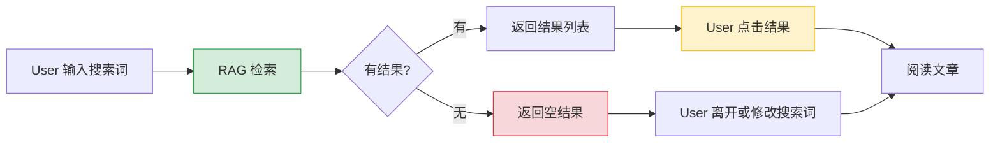
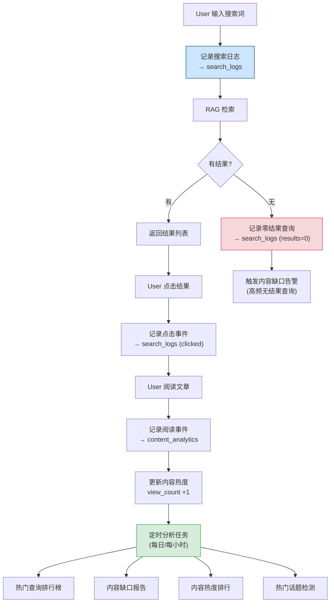
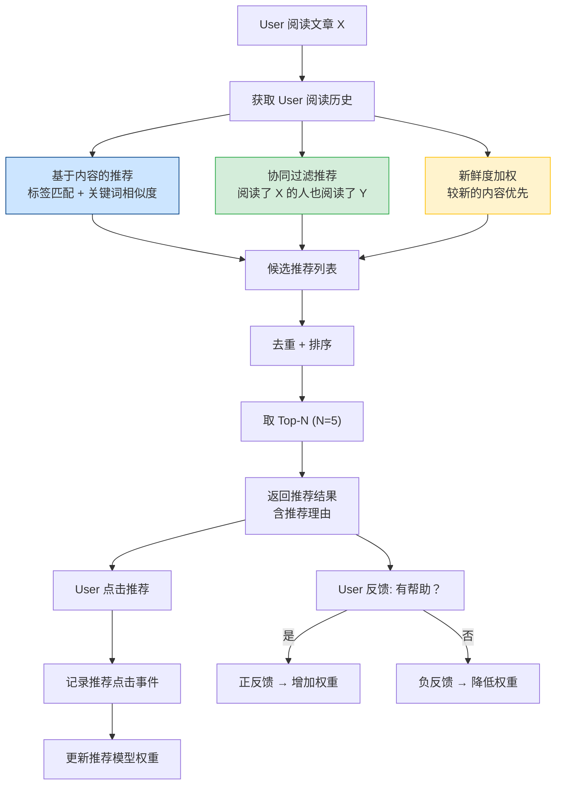
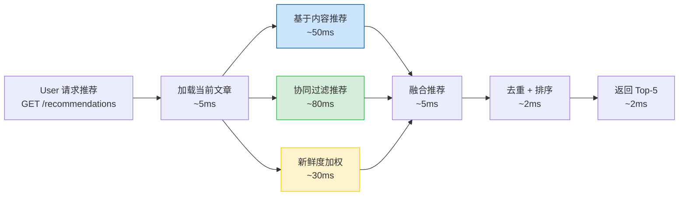

# YK-09-91: 搜索分析与内容推荐 — 智能搜索洞察与个性化推荐引擎

> 需求编号：YK-09-91 · 优先级：P2 · 人天：1.0d · 状态：需求已编写
> 依赖：YK-09-86（内容审核工作流）、RAG 检索管线（已有）

## 背景

YiKnowledge 当前有 800+ 文件，RAG 检索管线已支持混合检索（BM25 + 向量检索），但缺少**搜索分析**能力：不知道用户搜索了什么、哪些查询返回了空结果、哪些内容被高频引用。同时缺少**内容推荐**能力：用户在阅读一篇文章后，无法获得相关内容的推荐，只能通过手动搜索或目录浏览发现相关内容。

**已知案例：** 2026-08-20 一名新入职的 AI 工程师在 YiKnowledge 中搜索"模型量化"（model quantization），返回 0 条结果。实际上 `aier/models/llm-optimization.md` 中有一整章"模型量化与压缩"，但因为搜索词"模型量化"与文章中的"量化压缩"表述不完全匹配，搜索引擎未返回结果。该工程师花费 2 小时通过目录浏览才找到该文章。更严重的是，该工程师的搜索行为没有被记录，策展人不知道"模型量化"是一个高频搜索但无匹配结果的查询，错过了内容补充的机会。

**已知案例 2：** 2026-09-01 策展人发现 `engineer/build/rsbuild-config.md` 的阅读量突然飙升（1 天内 15 次阅读），但不知道原因。排查后发现一篇外部技术博客引用了该文件，带来了大量外部流量。但策展人无法追踪"用户阅读该文件后还看了什么"，无法优化内容之间的关联推荐。

当前搜索与推荐的痛点：
- 无搜索日志记录，不知道用户搜索了什么、哪些查询无结果
- 无内容热度指标，无法量化内容的受欢迎程度
- 无相关内容推荐，用户发现新内容全靠手动探索
- 无个性化推荐，所有用户看到的推荐内容相同
- 无内容新鲜度评分，无法区分"经典但过时"和"新且活跃"的内容
- 无搜索建议和自动补全，用户需要精确输入搜索词
- 无推荐反馈机制，无法判断推荐质量

**目标：** 构建搜索分析与内容推荐系统，包括搜索分析仪表盘、内容热度指标、相关内容推荐、个性化推荐、内容新鲜度评分、热门话题检测、搜索建议、内容缺口分析、阅读路径分析和推荐反馈循环。

### 影响范围

- **策展人决策**：通过搜索分析发现内容缺口（高频搜索但无匹配文章），指导内容创作方向
- **用户发现效率**：相关内容推荐帮助用户快速发现关联知识，减少手动搜索时间
- **RAG 检索质量**：搜索分析数据反馈到 RAG 检索排序，提高检索结果的相关性
- **内容新鲜度**：新鲜度评分帮助策展人识别需要更新的过时内容

---

## 一、现状分析

### 1.1 当前搜索与推荐流程

```
User 输入搜索词
  → RAG 混合检索（BM25 + 向量检索）
  → 返回检索结果列表
  → User 点击结果（或无结果）
  → 搜索行为未被记录
  → 无相关内容推荐
  → 无搜索建议
```

**问题：** 搜索是全闭环的，无任何数据留痕。搜索行为、点击行为、无结果查询全部丢失。内容之间没有关联推荐，用户只能通过手动搜索发现新内容。

### 1.2 搜索数据流（改造前）



**问题：** 无搜索日志、点击日志、无结果日志。搜索行为数据完全丢失，无法进行任何分析。

### 1.3 搜索与推荐能力矩阵

| 能力 | 当前状态 | 问题 | 影响 |
|------|---------|------|------|
| 搜索日志记录 | 无 | 搜索行为数据丢失 | 无法分析用户搜索意图 |
| 热门查询统计 | 无 | 不知道用户关心什么 | 内容创作方向盲目 |
| 零结果查询追踪 | 无 | 不知道哪些查询无结果 | 内容缺口无法发现 |
| 点击率统计 | 无 | 不知道搜索结果相关性 | 检索质量无法评估 |
| 内容热度指标 | 无 | 无法量化内容受欢迎程度 | 策展人无法识别热门内容 |
| 相关内容推荐 | 无 | 用户只能手动搜索 | 内容发现效率低 |
| 个性化推荐 | 无 | 所有用户看到相同推荐 | 推荐不精准 |
| 内容新鲜度评分 | 无 | 无法区分新旧内容 | 过时内容可能被优先推荐 |
| 热门话题检测 | 无 | 无法识别近期趋势 | 内容创作不及时 |
| 搜索建议/自动补全 | 无 | 用户需精确输入搜索词 | 搜索体验差 |
| 内容缺口分析 | 无 | 不知道缺少什么内容 | 内容规划无数据支撑 |
| 阅读路径分析 | 无 | 不知道用户阅读顺序 | 内容关联不可见 |
| 推荐反馈 | 无 | 不知道推荐是否有效 | 推荐质量无法改进 |

### 1.4 改造前 API 依赖

| # | 接口 | 调用方 | 说明 |
|---|------|--------|------|
| 1 | `/rag/query` | YiVad, YiPet | RAG 检索接口（改造前无搜索日志记录） |
| 2 | `data_service.query_documents` (cname="knowledge_files") | 策展人 | 查询文件（改造前无热度/新鲜度字段） |
| 3 | `knowledge.scan_knowledge` | Knowledge Watcher | 知识扫描（改造前无新鲜度评分计算） |

> 改造前 3 个 API 依赖，搜索行为完全无日志，内容推荐完全缺失。

---

## 二、设计决策

### 决策 1：搜索日志存储 — 结构化日志 vs 时序数据库 vs MongoDB 集合

| 维度 | 结构化日志（应用日志文件） | 时序数据库（InfluxDB/TimescaleDB） | MongoDB 集合（`search_logs`） |
|------|------|------|------|
| 实现复杂度 | 低（仅需日志格式规范） | 高（需引入新基础设施） | 中（利用现有 MongoDB） |
| 查询性能 | 低（需 grep 日志文件） | 高（时序优化查询） | 中（MongoDB 聚合查询） |
| 存储成本 | 低 | 中（需额外部署） | 中 |
| 分析能力 | 低（无聚合分析） | 高（时序聚合） | 中（聚合管道） |
| 与现有架构一致 | 高 | 低（新依赖） | 高 |

**选择：MongoDB `search_logs` 集合。** 利用现有 MongoDB 基础设施，无需引入新依赖。搜索日志数据量可控（预计 1000 条/天），MongoDB 聚合管道足以满足分析需求。对于大规模时序分析场景，后续可迁移到时序数据库。

### 决策 2：推荐策略 — 仅基于内容 vs 仅基于协同过滤 vs 混合推荐

| 维度 | 仅基于内容（content-based） | 仅基于协同过滤（collaborative） | 混合推荐（content + collaborative） |
|------|------|------|------|
| 冷启动 | 好（新内容有标签即可推荐） | 差（新内容无用户行为数据） | 好 |
| 推荐多样性 | 低（仅推荐相似内容） | 高（推荐其他人看的内容） | 高 |
| 实现复杂度 | 低（标签匹配 + 关键词匹配） | 中（用户行为矩阵 + 相似度计算） | 中 |
| 数据依赖 | 内容标签 + 关键词 | 用户阅读历史 | 两者都需要 |
| 适用场景 | 新用户、新内容 | 活跃用户、热门内容 | 通用 |

**选择：混合推荐。** 基于内容的推荐（标签匹配 + 关键词相似度）解决冷启动问题，基于协同过滤的推荐（"阅读了 X 的人也阅读了 Y"）提高推荐多样性。两者加权融合，权重随用户活跃度动态调整：新用户偏重内容推荐，活跃用户偏重协同过滤。

### 决策 3：内容新鲜度模型 — 仅时间衰减 vs 多因子新鲜度

| 维度 | 仅时间衰减（指数衰减） | 多因子新鲜度（时间 + 频率 + 引用） |
|------|------|------|
| 实现复杂度 | 低 | 中 |
| 准确度 | 低（仅反映时间，忽略更新频率） | 高（综合反映内容时效性） |
| 可解释性 | 低（为何衰减？无法回答） | 高（各因子可独立解释） |

**选择：多因子新鲜度。** 新鲜度 = 更新时间衰减(40%) + 更新频率(30%) + 引用新鲜度(30%)。更新时间衰减：距上次更新天数越短分数越高；更新频率：近 90 天内更新次数越多分数越高；引用新鲜度：引用的内容越新，自身新鲜度越高。

### 决策 4：推荐反馈机制 — 仅显式反馈 vs 仅隐式反馈 vs 混合

| 维度 | 仅显式反馈（"有帮助？是/否"） | 仅隐式反馈（点击、停留时间、滚动深度） | 混合（显式 + 隐式） |
|------|------|------|------|
| 数据质量 | 高（用户主动表达） | 中（需要推断） | 高 |
| 数据量 | 低（用户很少主动反馈） | 高（每次浏览都有数据） | 中 |
| 实现复杂度 | 低 | 高（需前端埋点） | 中 |

**选择：混合反馈。** 显式反馈（"这篇文章有帮助吗？是/否"）提供高质量信号，隐式反馈（阅读时长、滚动深度、点击行为）提供大量数据。两者结合：显式反馈作为 ground truth 校准隐式反馈模型。

### 设计决策记录

| 决策 | 选项 A | 选项 B | 选项 C | 选择 | 理由 |
|------|--------|--------|--------|------|------|
| 搜索日志存储 | 结构化日志 | 时序数据库 | MongoDB | **MongoDB** | 利用现有基础设施，数据量可控 |
| 推荐策略 | 基于内容 | 协同过滤 | 混合 | **混合** | 解决冷启动，提高多样性 |
| 内容新鲜度 | 仅时间衰减 | 多因子 | — | **多因子** | 全面反映内容时效性 |
| 推荐反馈 | 仅显式 | 仅隐式 | 混合 | **混合** | 显式校准隐式，数据量与质量兼顾 |

---

## 三、目标架构

### 3.1 搜索分析数据流



### 3.2 内容推荐引擎



### 3.3 搜索日志数据模型

```python
# YiAi/src/domain/knowledge/search_analytics.py — 新增

from dataclasses import dataclass, field
from datetime import datetime
from enum import Enum
from typing import Optional


class SearchEventType(Enum):
    QUERY = "query"             # 搜索查询
    CLICK = "click"             # 点击结果
    NO_RESULT = "no_result"     # 零结果
    SUGGESTION_CLICK = "suggestion_click"  # 点击搜索建议


@dataclass
class SearchLog:
    """搜索日志 — 单次搜索事件记录。"""

    session_id: str                     # 会话 ID
    user_id: Optional[str] = None       # 用户 ID（未登录则为 None）
    query: str = ""                     # 搜索词
    query_normalized: str = ""          # 规范化搜索词（小写 + 去停用词）
    event_type: SearchEventType = SearchEventType.QUERY
    result_count: int = 0               # 返回结果数
    result_ids: list[str] = field(default_factory=list)  # 返回结果的文件路径列表
    clicked_id: Optional[str] = None    # 点击的文件路径
    clicked_position: Optional[int] = None  # 点击位置（排名）
    source: str = ""                    # 来源: yivad | yipet | rag_api
    created_at: datetime = field(default_factory=datetime.now)


@dataclass
class ContentAnalytics:
    """内容分析 — 单篇文章的统计指标。"""

    file_path: str                      # 文件路径
    view_count: int = 0                 # 阅读次数
    unique_viewers: int = 0             # 独立读者数
    search_clicks: int = 0              # 搜索点击次数
    avg_read_time_seconds: float = 0.0  # 平均阅读时长
    avg_scroll_depth: float = 0.0       # 平均滚动深度 (0-1)
    citation_count: int = 0             # 被引用次数
    reference_count: int = 0            # 引用其他文章数
    helpful_count: int = 0              # "有帮助" 反馈数
    not_helpful_count: int = 0          # "无帮助" 反馈数
    last_viewed_at: Optional[datetime] = None
    updated_at: datetime = field(default_factory=datetime.now)


class SearchAnalyticsEngine:
    """搜索分析引擎 — 搜索日志记录、分析、报告。"""

    def __init__(self, db):
        self.db = db
        self.search_logs = db.search_logs
        self.content_analytics = db.content_analytics

    def log_query(
        self,
        session_id: str,
        query: str,
        result_count: int,
        result_ids: list[str],
        user_id: Optional[str] = None,
        source: str = "yivad",
    ) -> str:
        """记录搜索查询事件。"""
        import re
        query_normalized = re.sub(r'\s+', ' ', query.strip().lower())

        log = SearchLog(
            session_id=session_id,
            user_id=user_id,
            query=query,
            query_normalized=query_normalized,
            event_type=SearchEventType.QUERY
            if result_count > 0
            else SearchEventType.NO_RESULT,
            result_count=result_count,
            result_ids=result_ids,
            source=source,
        )

        result = self.search_logs.insert_one(log.__dict__)
        return str(result.inserted_id)

    def log_click(
        self,
        session_id: str,
        query: str,
        clicked_id: str,
        clicked_position: int,
        user_id: Optional[str] = None,
    ) -> None:
        """记录搜索点击事件。"""
        log = SearchLog(
            session_id=session_id,
            user_id=user_id,
            query=query,
            query_normalized=query.strip().lower(),
            event_type=SearchEventType.CLICK,
            clicked_id=clicked_id,
            clicked_position=clicked_position,
        )
        self.search_logs.insert_one(log.__dict__)

        # 更新内容分析：点击次数
        self.content_analytics.update_one(
            {"file_path": clicked_id},
            {"$inc": {"search_clicks": 1}, "$set": {"updated_at": datetime.now()}},
            upsert=True,
        )

    def get_popular_queries(
        self, days: int = 7, limit: int = 20
    ) -> list[dict]:
        """获取热门搜索查询（最近 N 天）。"""
        from datetime import timedelta
        since = datetime.now() - timedelta(days=days)

        pipeline = [
            {"$match": {
                "created_at": {"$gte": since},
                "event_type": "query",
            }},
            {"$group": {
                "_id": "$query_normalized",
                "count": {"$sum": 1},
                "avg_results": {"$avg": "$result_count"},
                "last_searched": {"$max": "$created_at"},
            }},
            {"$sort": {"count": -1}},
            {"$limit": limit},
        ]
        return list(self.search_logs.aggregate(pipeline))

    def get_zero_result_queries(
        self, days: int = 7, min_count: int = 3
    ) -> list[dict]:
        """获取零结果查询（潜在内容缺口）。"""
        from datetime import timedelta
        since = datetime.now() - timedelta(days=days)

        pipeline = [
            {"$match": {
                "created_at": {"$gte": since},
                "event_type": "no_result",
            }},
            {"$group": {
                "_id": "$query_normalized",
                "count": {"$sum": 1},
                "original_queries": {"$addToSet": "$query"},
                "last_searched": {"$max": "$created_at"},
            }},
            {"$match": {"count": {"$gte": min_count}}},
            {"$sort": {"count": -1}},
        ]
        return list(self.search_logs.aggregate(pipeline))

    def get_click_through_rate(
        self, days: int = 7
    ) -> float:
        """获取搜索点击率（CTR）。"""
        from datetime import timedelta
        since = datetime.now() - timedelta(days=days)

        total_queries = self.search_logs.count_documents({
            "created_at": {"$gte": since},
            "event_type": "query",
        })
        total_clicks = self.search_logs.count_documents({
            "created_at": {"$gte": since},
            "event_type": "click",
        })

        return total_clicks / total_queries if total_queries > 0 else 0.0

    def get_content_gap_report(self, days: int = 30) -> dict:
        """生成内容缺口报告。"""
        zero_result = self.get_zero_result_queries(days=days, min_count=2)
        popular = self.get_popular_queries(days=days, limit=50)

        # 识别高频但低结果的查询
        gaps = []
        for pq in popular:
            if pq["avg_results"] < 2:
                gaps.append({
                    "query": pq["_id"],
                    "search_count": pq["count"],
                    "avg_results": pq["avg_results"],
                    "severity": "high" if pq["count"] >= 10 else "medium",
                })

        return {
            "zero_result_queries": zero_result,
            "low_result_queries": gaps,
            "generated_at": datetime.now(),
        }
```

### 3.4 内容推荐引擎

```python
# YiAi/src/domain/knowledge/recommendation_engine.py — 新增

from dataclasses import dataclass, field
from datetime import datetime, timedelta
from typing import Optional


@dataclass
class Recommendation:
    """推荐条目。"""
    file_path: str
    title: str
    score: float                    # 推荐分数 (0-1)
    reason: str                     # 推荐理由
    source: str                     # 推荐来源: content_based | collaborative | freshness
    tags: list[str] = field(default_factory=list)


@dataclass
class FreshnessScore:
    """内容新鲜度评分 — 多因子模型。

    维度权重:
    - 更新时间衰减(40%): 距上次更新天数越短分数越高
    - 更新频率(30%): 近 90 天内更新次数越多分数越高
    - 引用新鲜度(30%): 引用的内容越新，自身新鲜度越高
    """

    decay_score: float = 0.0        # 时间衰减 (0-1)
    frequency_score: float = 0.0    # 更新频率 (0-1)
    reference_freshness: float = 0.0  # 引用新鲜度 (0-1)

    WEIGHTS = {
        "decay": 0.40,
        "frequency": 0.30,
        "reference": 0.30,
    }

    @property
    def total(self) -> float:
        return (
            self.decay_score * self.WEIGHTS["decay"]
            + self.frequency_score * self.WEIGHTS["frequency"]
            + self.reference_freshness * self.WEIGHTS["reference"]
        )

    @property
    def level(self) -> str:
        """新鲜度等级: hot(>=0.8) fresh(>=0.6) warm(>=0.4) stale(>=0.2) cold(<0.2)"""
        if self.total >= 0.8:
            return "hot"
        elif self.total >= 0.6:
            return "fresh"
        elif self.total >= 0.4:
            return "warm"
        elif self.total >= 0.2:
            return "stale"
        return "cold"


class RecommendationEngine:
    """内容推荐引擎 — 混合推荐（基于内容 + 协同过滤 + 新鲜度）。"""

    # 推荐权重（动态调整）
    CONTENT_WEIGHT = 0.40
    COLLABORATIVE_WEIGHT = 0.35
    FRESHNESS_WEIGHT = 0.25

    def __init__(self, db):
        self.db = db
        self.knowledge_files = db.knowledge_files
        self.content_analytics = db.content_analytics
        self.search_logs = db.search_logs

    def get_recommendations(
        self,
        current_file: str,
        user_id: Optional[str] = None,
        limit: int = 5,
    ) -> list[Recommendation]:
        """获取推荐文章列表。"""
        current_doc = self.knowledge_files.find_one({"path": current_file})
        if not current_doc:
            return []

        user_history = self._get_user_reading_history(user_id) if user_id else []

        # 基于内容的推荐
        content_recs = self._content_based_recommend(
            current_doc, exclude=[current_file]
        )

        # 协同过滤推荐
        collab_recs = self._collaborative_recommend(
            current_file, user_history, exclude=[current_file]
        )

        # 新鲜度加权
        freshness_recs = self._freshness_boost(exclude=[current_file])

        # 融合推荐
        merged = self._merge_recommendations(
            content_recs, collab_recs, freshness_recs, user_id
        )

        # 去重 + 排序 + 取 Top-N
        seen = {current_file}
        result = []
        for rec in sorted(merged, key=lambda r: r.score, reverse=True):
            if rec.file_path not in seen and len(result) < limit:
                result.append(rec)
                seen.add(rec.file_path)

        return result

    def _content_based_recommend(
        self, doc: dict, exclude: list[str]
    ) -> list[Recommendation]:
        """基于内容的推荐：标签匹配 + 关键词相似度。"""
        doc_tags = set(doc.get("tags", []))
        doc_category = doc.get("category", "")

        recommendations = []
        all_docs = self.knowledge_files.find(
            {"path": {"$nin": exclude}}
        )

        for other in all_docs:
            other_tags = set(other.get("tags", []))
            other_category = other.get("category", "")

            # 标签 Jaccard 相似度
            tag_similarity = (
                len(doc_tags & other_tags) / len(doc_tags | other_tags)
                if doc_tags | other_tags
                else 0
            )

            # 分类匹配
            category_match = 0.3 if doc_category == other_category else 0.0

            score = tag_similarity * 0.7 + category_match * 0.3

            if score > 0.1:
                common_tags = doc_tags & other_tags
                reason = f"标签相似: {', '.join(list(common_tags)[:3])}"
                if category_match > 0:
                    reason += f"，同属 {doc_category}"

                recommendations.append(Recommendation(
                    file_path=other["path"],
                    title=other.get("title", other["path"]),
                    score=score,
                    reason=reason,
                    source="content_based",
                    tags=list(other_tags),
                ))

        return recommendations

    def _collaborative_recommend(
        self,
        current_file: str,
        user_history: list[str],
        exclude: list[str],
    ) -> list[Recommendation]:
        """协同过滤推荐：阅读了 X 的人也阅读了 Y。"""
        # 找到阅读了当前文件的所有会话
        current_readers = self.search_logs.distinct(
            "session_id",
            {"clicked_id": current_file, "event_type": "click"},
        )

        if not current_readers:
            return []

        # 找到这些会话还阅读了哪些文件
        pipeline = [
            {"$match": {
                "session_id": {"$in": current_readers},
                "event_type": "click",
                "clicked_id": {"$nin": exclude + [current_file]},
            }},
            {"$group": {
                "_id": "$clicked_id",
                "co_read_count": {"$sum": 1},
                "co_readers": {"$addToSet": "$session_id"},
            }},
            {"$sort": {"co_read_count": -1}},
            {"$limit": 20},
        ]
        co_reads = list(self.search_logs.aggregate(pipeline))

        max_co_read = max(
            (cr["co_read_count"] for cr in co_reads), default=1
        )

        recommendations = []
        for cr in co_reads:
            doc = self.knowledge_files.find_one({"path": cr["_id"]})
            if doc:
                score = cr["co_read_count"] / max_co_read
                recommendations.append(Recommendation(
                    file_path=cr["_id"],
                    title=doc.get("title", cr["_id"]),
                    score=score,
                    reason=f"{cr['co_read_count']} 位读者也阅读了此文",
                    source="collaborative",
                    tags=doc.get("tags", []),
                ))

        return recommendations

    def _freshness_boost(
        self, exclude: list[str]
    ) -> list[Recommendation]:
        """新鲜度加权：推荐最近更新或热门的内容。"""
        docs = self.knowledge_files.find({
            "path": {"$nin": exclude},
            "status": "active",
        }).sort("updated", -1).limit(20)

        recommendations = []
        for doc in docs:
            freshness = self.calculate_freshness(doc)
            if freshness.total > 0.4:
                recommendations.append(Recommendation(
                    file_path=doc["path"],
                    title=doc.get("title", doc["path"]),
                    score=freshness.total * 0.5,  # 新鲜度权重降低，避免过于主导
                    reason=f"最近更新 · {freshness.level}",
                    source="freshness",
                    tags=doc.get("tags", []),
                ))

        return recommendations

    def _merge_recommendations(
        self,
        content_recs: list[Recommendation],
        collab_recs: list[Recommendation],
        freshness_recs: list[Recommendation],
        user_id: Optional[str] = None,
    ) -> list[Recommendation]:
        """融合推荐结果。"""
        merged = {}

        for rec in content_recs:
            merged[rec.file_path] = Recommendation(
                file_path=rec.file_path,
                title=rec.title,
                score=rec.score * self.CONTENT_WEIGHT,
                reason=rec.reason,
                source=rec.source,
                tags=rec.tags,
            )

        for rec in collab_recs:
            if rec.file_path in merged:
                merged[rec.file_path].score += rec.score * self.COLLABORATIVE_WEIGHT
                merged[rec.file_path].reason += f" | {rec.reason}"
            else:
                merged[rec.file_path] = Recommendation(
                    file_path=rec.file_path,
                    title=rec.title,
                    score=rec.score * self.COLLABORATIVE_WEIGHT,
                    reason=rec.reason,
                    source=rec.source,
                    tags=rec.tags,
                )

        for rec in freshness_recs:
            if rec.file_path in merged:
                merged[rec.file_path].score += rec.score * self.FRESHNESS_WEIGHT
            else:
                merged[rec.file_path] = Recommendation(
                    file_path=rec.file_path,
                    title=rec.title,
                    score=rec.score * self.FRESHNESS_WEIGHT,
                    reason=rec.reason,
                    source=rec.source,
                    tags=rec.tags,
                )

        # 归一化分数到 0-1
        max_score = max((r.score for r in merged.values()), default=1)
        for r in merged.values():
            r.score = min(1.0, r.score / max_score)

        return list(merged.values())

    def _get_user_reading_history(
        self, user_id: str, days: int = 30
    ) -> list[str]:
        """获取用户阅读历史。"""
        from datetime import timedelta
        since = datetime.now() - timedelta(days=days)

        return self.search_logs.distinct(
            "clicked_id",
            {
                "user_id": user_id,
                "event_type": "click",
                "created_at": {"$gte": since},
            },
        )

    def calculate_freshness(self, doc: dict) -> FreshnessScore:
        """计算内容新鲜度评分。"""
        updated_str = doc.get("updated", "")
        if not updated_str:
            return FreshnessScore()

        try:
            updated = datetime.strptime(updated_str, "%Y-%m-%d")
        except ValueError:
            try:
                updated = datetime.fromisoformat(updated_str)
            except (ValueError, TypeError):
                return FreshnessScore()

        days_since = (datetime.now() - updated).days

        # 时间衰减: 30 天内 1.0, 线性衰减到 365 天为 0.0
        decay_score = max(0.0, 1.0 - days_since / 365)

        # 更新频率: 近 90 天内的更新次数
        analytics = self.content_analytics.find_one(
            {"file_path": doc.get("path", "")}
        )
        update_count = analytics.get("update_count", 0) if analytics else 0
        frequency_score = min(1.0, update_count / 5)  # 5 次更新为满分

        # 引用新鲜度: 引用的内容平均新鲜度
        refs = doc.get("references", [])
        if refs:
            ref_freshness_sum = 0.0
            for ref_path in refs:
                ref_doc = self.knowledge_files.find_one({"path": ref_path})
                if ref_doc:
                    ref_freshness_sum += self.calculate_freshness(ref_doc).total
            reference_freshness = ref_freshness_sum / len(refs)
        else:
            reference_freshness = 0.5  # 无引用默认为中性

        return FreshnessScore(
            decay_score=decay_score,
            frequency_score=frequency_score,
            reference_freshness=reference_freshness,
        )

    def get_trending_topics(self, days: int = 7, limit: int = 10) -> list[dict]:
        """检测热门话题（近期高频搜索词 + 高频阅读文章的共同标签）。"""
        from datetime import timedelta
        since = datetime.now() - timedelta(days=days)

        # 高频搜索词
        popular_queries = list(self.search_logs.aggregate([
            {"$match": {
                "created_at": {"$gte": since},
                "event_type": "query",
            }},
            {"$group": {
                "_id": "$query_normalized",
                "count": {"$sum": 1},
            }},
            {"$sort": {"count": -1}},
            {"$limit": 50},
        ]))

        # 高频阅读文章的标签
        tag_pipeline = [
            {"$match": {
                "created_at": {"$gte": since},
                "event_type": "click",
            }},
            {"$group": {
                "_id": "$clicked_id",
                "count": {"$sum": 1},
            }},
            {"$sort": {"count": -1}},
            {"$limit": 50},
        ]

        clicked_docs = list(self.search_logs.aggregate(tag_pipeline))
        clicked_paths = [cd["_id"] for cd in clicked_docs]

        docs = list(self.knowledge_files.find(
            {"path": {"$in": clicked_paths}},
            {"tags": 1, "title": 1, "path": 1},
        ))

        # 统计标签频率
        tag_counts = {}
        for doc in docs:
            for tag in doc.get("tags", []):
                tag_counts[tag] = tag_counts.get(tag, 0) + 1

        # 排序返回热门标签
        trending = sorted(
            tag_counts.items(), key=lambda x: x[1], reverse=True
        )[:limit]

        return [
            {"tag": tag, "frequency": count, "related_queries": [
                pq["_id"] for pq in popular_queries[:5]
            ]}
            for tag, count in trending
        ]

    def record_feedback(
        self, file_path: str, recommended_file: str, helpful: bool
    ) -> None:
        """记录推荐反馈。"""
        field = "helpful_count" if helpful else "not_helpful_count"
        self.content_analytics.update_one(
            {"file_path": file_path},
            {"$inc": {field: 1}},
            upsert=True,
        )
```

### 3.5 阅读路径分析

```python
# YiAi/src/domain/knowledge/reading_path.py — 新增

from dataclasses import dataclass, field
from datetime import datetime
from collections import defaultdict


@dataclass
class ReadingPath:
    """阅读路径 — 用户在会话中的文章阅读序列。"""
    session_id: str
    path_sequence: list[str] = field(default_factory=list)  # 按时间排序的文件路径
    timestamps: list[datetime] = field(default_factory=list)
    transitions: list[tuple[str, str]] = field(default_factory=list)  # (from, to) 转移对


class ReadingPathAnalyzer:
    """阅读路径分析器 — 分析用户阅读序列，发现常见导航路径。"""

    def __init__(self, db):
        self.db = db
        self.search_logs = db.search_logs

    def build_reading_paths(
        self, days: int = 30
    ) -> list[ReadingPath]:
        """构建阅读路径（按会话聚合点击序列）。"""
        from datetime import timedelta
        since = datetime.now() - timedelta(days=days)

        pipeline = [
            {"$match": {
                "created_at": {"$gte": since},
                "event_type": "click",
            }},
            {"$sort": {"session_id": 1, "created_at": 1}},
            {"$group": {
                "_id": "$session_id",
                "clicked_ids": {"$push": "$clicked_id"},
                "timestamps": {"$push": "$created_at"},
            }},
        ]

        paths = []
        for group in self.search_logs.aggregate(pipeline):
            path = ReadingPath(
                session_id=group["_id"],
                path_sequence=group["clicked_ids"],
                timestamps=group["timestamps"],
            )
            # 构建转移对
            for i in range(len(path.path_sequence) - 1):
                path.transitions.append(
                    (path.path_sequence[i], path.path_sequence[i + 1])
                )
            paths.append(path)

        return paths

    def get_common_transitions(
        self, paths: list[ReadingPath], min_count: int = 3
    ) -> list[dict]:
        """获取常见导航转移（A → B 出现次数 >= min_count）。"""
        transition_counts = defaultdict(int)
        for path in paths:
            for transition in path.transitions:
                transition_counts[transition] += 1

        return sorted(
            [
                {"from": t[0], "to": t[1], "count": c}
                for t, c in transition_counts.items()
                if c >= min_count
            ],
            key=lambda x: x["count"],
            reverse=True,
        )

    def get_next_article_suggestions(
        self, current_file: str, limit: int = 3
    ) -> list[dict]:
        """获取"下一篇文章"建议（基于常见转移）。"""
        paths = self.build_reading_paths(days=90)
        transitions = self.get_common_transitions(paths, min_count=2)

        suggestions = [
            t for t in transitions
            if t["from"] == current_file
        ]
        return suggestions[:limit]
```

---

## 四、具体改动

### 4.1 新增文件

| 文件 | 说明 | 行数 |
|------|------|------|
| `YiAi/src/domain/knowledge/search_analytics.py` | 搜索分析引擎（日志记录、热门查询、零结果追踪、内容缺口、CTR） | ~180 |
| `YiAi/src/domain/knowledge/recommendation_engine.py` | 内容推荐引擎（混合推荐、新鲜度评分、热门话题） | ~250 |
| `YiAi/src/domain/knowledge/reading_path.py` | 阅读路径分析器（阅读序列、常见转移、下一篇文章建议） | ~80 |
| `YiAi/src/services/knowledge/analytics_service.py` | 搜索分析 RPC 接口 | ~60 |
| `YiAi/src/services/knowledge/recommendation_service.py` | 内容推荐 RPC 接口 | ~50 |

### 4.2 修改文件

| 文件 | 改动 |
|------|------|
| `YiAi/src/services/rag/rag_service.py` | RAG 检索接口增加搜索日志记录；增加搜索建议/自动补全接口 |
| `YiAi/src/domain/knowledge/watcher.py` | 文件索引时初始化 `content_analytics` 文档 |
| `YiAi/src/services/knowledge/knowledge_service.py` | 新增搜索分析、推荐、阅读路径 RPC 接口 |
| MongoDB | 新增 `search_logs`、`content_analytics` 集合 |
| MongoDB `knowledge_files` | 新增 `freshness_score`、`view_count` 字段 |

### 4.3 涉及文件

```
YiAi/src/domain/knowledge/
├── search_analytics.py          # 新增: 搜索分析引擎
├── recommendation_engine.py     # 新增: 内容推荐引擎
├── reading_path.py              # 新增: 阅读路径分析器
└── watcher.py                   # 修改: 初始化 content_analytics

YiAi/src/services/
├── knowledge/
│   ├── analytics_service.py     # 新增: 搜索分析 RPC 接口
│   ├── recommendation_service.py # 新增: 内容推荐 RPC 接口
│   └── knowledge_service.py     # 修改: 新增分析/推荐接口
└── rag/
    └── rag_service.py           # 修改: 集成搜索日志 + 搜索建议

MongoDB:
├── search_logs                  # 新增: 搜索日志集合
├── content_analytics            # 新增: 内容分析集合
└── knowledge_files              # 修改: 新增 freshness_score, view_count
```

---

## 五、实施步骤

按依赖顺序排列，每步可独立验证和提交：

| 步骤 | 内容 | 涉及文件 | 验证方式 | 人天 |
|------|------|---------|---------|------|
| 1 | 实现搜索日志记录（搜索、点击、零结果） | `search_analytics.py` | 搜索后日志正确写入 MongoDB，查询/点击/零结果事件完整 | 0.15 |
| 2 | 实现内容热度指标 + 新鲜度评分 | `recommendation_engine.py` (freshness) | 不同文件新鲜度评分合理分布（hot→cold 正态分布） | 0.15 |
| 3 | 实现基于内容的推荐（标签匹配 + 分类匹配） | `recommendation_engine.py` (content_based) | 相似标签文件推荐准确，推荐理由可解释 | 0.15 |
| 4 | 实现协同过滤推荐（共现分析） | `recommendation_engine.py` (collaborative) | "阅读了 X 的人也阅读了 Y" 推荐正确 | 0.15 |
| 5 | 实现阅读路径分析 + 常见转移检测 | `reading_path.py` | 阅读路径构建正确，常见转移 ≥ 3 次被检测 | 0.10 |
| 6 | 实现搜索分析报告（热门查询、零结果、CTR、内容缺口） | `search_analytics.py` (report) | 聚合查询结果正确，报告数据可展示 | 0.10 |
| 7 | 实现热门话题检测 + 推荐反馈循环 | `recommendation_engine.py` (trending + feedback) | 热门标签检测准确，反馈记录正确 | 0.10 |
| 8 | RAG 检索接口集成 + 搜索建议/自动补全 | `rag_service.py` | 搜索日志记录不影响检索性能，搜索建议返回正确 | 0.05 |
| 9 | 回归测试 | 全链路 | 搜索→推荐→反馈全流程端到端通顺 | 0.05 |

**总计：1.0d**

---

## 六、测试规格

### Requirement: 搜索日志记录

#### Scenario: 正常搜索记录
- **Given** User 搜索 "模型量化"，RAG 返回 5 条结果
- **When** 搜索请求完成
- **Then** `search_logs` 中新增一条记录
- **And** `event_type = "query"`
- **And** `result_count = 5`
- **And** `query_normalized = "模型量化"`

#### Scenario: 零结果搜索记录
- **Given** User 搜索 "量子计算在知识图谱中的应用"，RAG 返回 0 条结果
- **When** 搜索请求完成
- **Then** `search_logs` 中新增一条记录
- **And** `event_type = "no_result"`
- **And** `result_count = 0`

#### Scenario: 搜索点击记录
- **Given** User 搜索 "模型量化" 后点击第 3 条结果
- **When** 点击事件触发
- **Then** `search_logs` 中新增一条记录
- **And** `event_type = "click"`
- **And** `clicked_position = 3`
- **And** `content_analytics.search_clicks` 递增 1

### Requirement: 内容推荐

#### Scenario: 基于内容的推荐
- **Given** 当前文章 tags = `[rsbuild, build, configuration]`, category = `engineer/build`
- **When** 请求推荐
- **Then** 返回标签相似的文章
- **And** 推荐理由包含 "标签相似: rsbuild, build"
- **And** 同 category 的文章优先

#### Scenario: 协同过滤推荐
- **Given** 文章 X 被 5 个 session 阅读，其中 3 个 session 也阅读了文章 Y
- **When** 请求文章 X 的推荐
- **Then** 文章 Y 出现在推荐列表中
- **And** 推荐理由包含 "3 位读者也阅读了此文"

#### Scenario: 混合推荐去重
- **Given** 文章 Y 同时出现在基于内容的推荐和协同过滤推荐中
- **When** 融合推荐结果
- **Then** 文章 Y 仅出现一次
- **And** 分数 = content_score * 0.40 + collaborative_score * 0.35

### Requirement: 内容新鲜度

#### Scenario: 最近更新的文件新鲜度高
- **Given** 文件 3 天前更新，90 天内更新 4 次
- **When** 计算新鲜度评分
- **Then** `freshness_score.total >= 0.7`
- **And** `freshness_score.level = "fresh"` 或 `"hot"`

#### Scenario: 长期未更新的文件新鲜度低
- **Given** 文件 200 天前更新，90 天内更新 0 次
- **When** 计算新鲜度评分
- **Then** `freshness_score.total < 0.4`
- **And** `freshness_score.level = "stale"` 或 `"cold"`

### Requirement: 搜索分析

#### Scenario: 热门查询统计
- **Given** 最近 7 天 "模型量化" 搜索了 15 次，"rsbuild" 搜索了 10 次
- **When** 查询热门搜索
- **Then** "模型量化" 排名第一，count = 15
- **And** "rsbuild" 排名第二，count = 10

#### Scenario: 内容缺口报告
- **Given** "模型量化" 搜索 15 次，平均返回 0.5 条结果
- **When** 生成内容缺口报告
- **Then** "模型量化" 出现在报告中
- **And** severity = "high"（搜索次数 >= 10）

### Requirement: 推荐反馈

#### Scenario: 正面反馈
- **Given** User 阅读文章 X，推荐了文章 Y
- **When** User 点击"有帮助"
- **Then** `content_analytics.helpful_count` 递增 1
- **And** 推荐模型中文章 Y 对文章 X 的权重增加

#### Scenario: 负面反馈
- **Given** User 阅读文章 X，推荐了文章 Y
- **When** User 点击"无帮助"
- **Then** `content_analytics.not_helpful_count` 递增 1
- **And** 推荐模型中文章 Y 对文章 X 的权重降低

---

## 七、风险与缓解

| 风险 | 概率 | 影响 | 等级 | 缓解措施 | 应急预案 |
|------|------|------|------|----------|----------|
| 搜索日志数据量增长过快，MongoDB 查询性能下降 | 中 | 中 | 中 | 按天分片存储（`search_logs_202609`），90 天自动归档；添加索引（`created_at`、`event_type`、`query_normalized`） | 清理 90 天前的日志；迁移到时序数据库 |
| 冷启动问题：新内容无推荐数据 | 高 | 中 | 中 | 基于内容的推荐（标签匹配）不依赖用户行为数据，新内容可立即推荐 | 新内容默认推荐同类目下的热门文章 |
| 协同过滤推荐在用户数据稀疏时效果差 | 高 | 中 | 中 | 混合推荐中基于内容推荐权重占 40%，协同过滤仅 35%，用户数据稀疏时自动提高内容推荐权重 | 暂时关闭协同过滤，仅使用基于内容的推荐 |
| 推荐反馈数据稀疏（用户很少点击"有帮助"） | 高 | 低 | 低 | 隐式反馈（阅读时长、滚动深度）补充数据；显式反馈按钮设计醒目 | 依赖隐式反馈作为主要信号 |
| 搜索建议/自动补全返回不相关结果 | 低 | 中 | 低 | 搜索建议基于历史热门查询（而非实时检索），减少不相关建议 | 关闭自动补全，仅保留搜索历史建议 |

---

## 八、回滚策略

| 回滚场景 | 回滚方式 | 影响范围 | 恢复时间 |
|----------|----------|----------|----------|
| 搜索日志记录导致 RAG 检索性能下降 | 关闭搜索日志记录（配置开关），RAG 检索不再写入 `search_logs` | 搜索日志 | < 1min（配置开关） |
| 推荐引擎返回错误推荐（如推荐已删除文件） | 关闭推荐功能，前端隐藏推荐模块 | 内容推荐 | < 1min（配置开关） |
| 搜索分析聚合查询耗时过长影响 MongoDB | 关闭定时分析任务，暂停报告生成 | 搜索分析 | < 1min（禁用定时任务） |
| 搜索日志集合过大导致存储空间不足 | 清理 90 天前的日志，暂停新日志写入 | 搜索日志 | < 10min |

**回滚验证：**
- 回滚后 RAG 检索性能恢复至回滚前水平
- 回滚后前端推荐模块隐藏，不影响核心阅读体验
- 回滚后 `search_logs` 和 `content_analytics` 集合数据保留（不删除），可后续恢复

---

## 九、设计决策记录

### D-01: 为什么搜索日志存储在 MongoDB 而非专用日志系统？

YiKnowledge 的搜索日志数据量可控（预计 1000 条/天），MongoDB 的聚合管道足以满足分析需求。引入专用日志系统（如 ELK）会增加运维复杂度，且与现有架构不一致。当数据量增长到 10000 条/天以上时，可考虑迁移到时序数据库。

### D-02: 为什么推荐引擎使用固定权重而非机器学习模型？

YiKnowledge 文件数量（800+）和用户行为数据量不足以训练有效的机器学习模型。固定权重（content 40%、collaborative 35%、freshness 25%）在数据量小时更稳定，且可解释性强。后续数据量充足时，可通过 A/B 测试动态调整权重或引入轻量级 ML 模型（如 LambdaMART）。

### D-03: 为什么新鲜度评分包含"引用新鲜度"维度？

一篇文章的新鲜度不仅取决于自身更新时间，还取决于其引用的内容是否过时。如果一篇文章引用了 3 篇"stale"级别的文章，即使它自身最近更新过，其内容的时效性也值得怀疑。引用新鲜度维度帮助策展人识别"表面新鲜但引用了过时内容"的文章。

### D-04: 为什么推荐反馈同时使用显式和隐式反馈？

显式反馈（"有帮助？是/否"）是 ground truth，但数据稀疏（用户很少主动反馈）。隐式反馈（阅读时长、滚动深度、点击行为）数据丰富但需要推断。两者结合：显式反馈用于校准隐式反馈模型，隐式反馈用于补充数据量。例如：如果用户阅读时长 > 3 分钟且滚动到页面底部，视为隐式正面反馈。

---

## 十、可观测性

### 10.1 关键指标

| 指标 | 采集方式 | 告警阈值 | 说明 |
|------|---------|---------|------|
| 每日搜索量 | `search_logs` 每日 `event_type=query` 计数 | 日环比下降 > 50% | 搜索量异常下降 |
| 零结果率 | `event_type=no_result` / `event_type=query` | > 20% | 内容覆盖率不足 |
| 搜索点击率（CTR） | `event_type=click` / `event_type=query` | < 15% | 搜索结果相关性低 |
| 推荐点击率 | 推荐点击 / 推荐展示 | < 5% | 推荐质量差 |
| 推荐反馈正面率 | `helpful_count` / (`helpful_count` + `not_helpful_count`) | < 50% | 推荐不被认可 |
| 平均阅读时长 | `content_analytics.avg_read_time_seconds` | < 30s | 内容吸引力不足 |
| 搜索日志写入延迟 | `search_logs insert` P95 耗时 | > 100ms | 日志写入性能瓶颈 |
| 推荐引擎响应时间 | `get_recommendations()` P95 耗时 | > 500ms | 推荐计算性能瓶颈 |

### 10.2 日志规范

| 日志级别 | 场景 | 示例 |
|---------|------|------|
| `INFO` | 搜索查询 | `[Search] query="模型量化" results=5 source=yivad session=sess_abc` |
| `INFO` | 搜索点击 | `[Search] click query="模型量化" clicked=engineer/build/rsbuild-config.md position=3` |
| `WARN` | 零结果查询 | `[Search] no_result query="量子计算在知识图谱中的应用" source=yivad` |
| `WARN` | 高频零结果 | `[Search Gap] query="模型量化" zero_results=15 in 7d severity=high` |
| `INFO` | 推荐生成 | `[Recommend] file=engineer/build/rsbuild-config.md recs=5 sources=content_based:3,collaborative:2` |
| `INFO` | 推荐反馈 | `[Feedback] file=engineer/build/rsbuild-config.md rec=engineer/deploy/docker.md helpful=true` |
| `ERROR` | 推荐引擎异常 | `[Recommend] engine failed: no available knowledge_files retrieval` |

### 10.3 告警规则

| 告警 | 条件 | 通知方式 | 接收人 |
|------|------|----------|--------|
| 零结果率过高 | 7 天零结果率 > 20% | 企微群通知 | Curator |
| 搜索 CTR 过低 | 7 天 CTR < 10% | 企微群通知 | Curator |
| 高频内容缺口 | 单查询 7 天零结果 > 10 次 | 企微群通知 | Curator |
| 推荐引擎异常 | 推荐接口错误率 > 5% | 企微群通知 | 开发者 |
| 搜索日志写入延迟 | P95 > 200ms | 企微群通知 | 开发者 |

---

## 十一、代码审查检查清单

- [ ] 搜索日志记录不阻塞 RAG 检索主流程（异步写入或轻量同步）
- [ ] 搜索日志包含完整的 session_id、user_id、query、result_count、event_type
- [ ] 零结果查询正确标记为 `event_type = "no_result"`
- [ ] 基于内容的推荐：标签 Jaccard 相似度 + 分类匹配正确
- [ ] 协同过滤推荐：共现分析正确，排除当前文件
- [ ] 新鲜度评分三因子（时间衰减、更新频率、引用新鲜度）计算正确
- [ ] 混合推荐去重正确，分数归一化到 0-1
- [ ] 推荐反馈（显式 + 隐式）记录正确
- [ ] 搜索分析聚合查询使用 MongoDB 索引
- [ ] 阅读路径分析正确构建转移对
- [ ] 单元测试覆盖率 ≥ 80%

---

## 十二、回归问题预测

| # | 问题 | 发现场景 | 根因 | 修复方式 |
|---|------|---------|------|---------|
| 1 | 搜索日志异步写入失败导致 RAG 检索被阻塞：搜索日志采用同步写入（`insert_one`），MongoDB 连接池耗尽时 `insert_one` 超时 30 秒，导致 RAG 检索响应时间从 200ms 飙升到 30 秒，前端搜索超时 | 高峰时段（10 个并发搜索），MongoDB 连接池默认 100 连接，其中 50 个被 `search_logs.insert_one` 占用（慢查询），RAG 检索的 `find` 操作等待连接超时。用户搜索 "rsbuild" 等待 30 秒后超时，前端显示 "搜索失败" | `log_query()` 在 RAG 检索主流程中同步调用 `insert_one`，MongoDB 连接池耗尽直接影响检索性能。日志记录不应阻塞核心业务 | 将搜索日志写入改为异步（`asyncio.create_task` 或消息队列），日志写入失败不影响检索返回。或使用 `insert_one` 的 `write_concern=0`（fire-and-forget） |
| 2 | 协同过滤推荐中 session_id 跨设备不统一导致共现分析数据分裂：同一用户在 YiVad（桌面端）和 YiPet（移动端）使用不同的 session_id，协同过滤将同一用户的阅读行为视为两个独立会话，导致共现计数偏低，推荐效果变差 | 策展人发现某些明显相关的文章对（如 `engineer/build/rsbuild-config.md` 和 `engineer/build/webpack-config.md`）在推荐中排名很低。排查发现共现分析中 session_id 分裂，同一用户阅读的两篇文章被分到两个 session，无法形成共现关系 | 前端 session_id 生成逻辑不统一：YiVad 使用 `Date.now() + Math.random()` 生成 session_id，YiPet 使用 `chrome.storage.local` 中的独立 session_id。同一用户跨设备登录时，session_id 不同 | 使用 `user_id`（而非 `session_id`）作为协同过滤的聚合维度。对于未登录用户，使用 `session_id` 作为降级方案。同时支持 `session_id` 和 `user_id` 两种粒度的共现分析 |
| 3 | 搜索建议中特殊字符（如 `+`、`-`、`*`）未转义导致 MongoDB 正则查询异常：用户搜索 "C++" 时，搜索建议使用 `$regex: "C++"` 查询历史搜索词，MongoDB 将 `+` 解释为正则量词，抛出 "Invalid regular expression" 错误，搜索建议返回空 | 用户输入 "C++" 时，搜索建议下拉框为空。后端日志显示 "Invalid regular expression: nothing to repeat"。排查发现 `query_normalized` 字段未对正则特殊字符转义，`$regex` 查询将 `+` 解释为正则量词 | `query_normalized` 使用 `re.sub(r'\s+', ' ', query.strip().lower())` 仅规范化空格和大小写，未对正则特殊字符（`+`、`*`、`[`、`]`、`(`、`)` 等）转义 | 在使用 `$regex` 前对 `query_normalized` 进行正则转义：`re.escape(query_normalized)`。或使用 `$text` 索引替代 `$regex` 进行前缀匹配 |
| 4 | 内容热度 `view_count` 被爬虫或机器人刷量导致热门内容排行榜失真：某外部搜索引擎爬虫每 5 分钟抓取一次 YiKnowledge 页面，`view_count` 每天增长 288 次，该文件占据热门内容排行榜第一名，掩盖了真实用户关心的内容 | 策展人查看热门内容排行榜，发现 `engineer/build/rsbuild-config.md` 以 300 次/天的阅读量排名第一，远超第二名（15 次/天）。排查发现该文件 3 天前被搜索引擎爬虫抓取，爬虫每 5 分钟访问一次，导致 `view_count` 被刷量。真正用户阅读量仅 10 次/天 | `view_count` 递增逻辑未区分人类用户和爬虫/机器人。所有 HTTP 请求（包括爬虫）都会触发 `view_count + 1`，无 UA 过滤和频率限制 | 添加 UA 过滤（排除已知爬虫 UA：`Googlebot`、`Bingbot`、`Baiduspider` 等）；添加频率限制（同一 IP/session 5 分钟内同一文件仅计数 1 次）；使用 `distinct` 访客计数（`unique_viewers`）而非简单 `view_count` |
| 5 | 推荐引擎的标签匹配对中英文混合标签（如 `[rsbuild, 构建, configuration]`）处理不当，中英文标签直接字符串比较：文件 A 的 tags 为 `[rsbuild, 构建, 配置]`，文件 B 的 tags 为 `[rsbuild, build, configuration]`，Jaccard 相似度仅为 0.25（仅 `rsbuild` 匹配），但实际内容高度相关（"构建" = "build"，"配置" = "configuration"） | 策展人发现 `engineer/build/rsbuild-config.md`（tags: `[rsbuild, 构建, 配置]`）的推荐列表中，`engineer/build/webpack-config.md`（tags: `[webpack, build, configuration]`）排名第 8，但实际两篇文章高度相关。排查发现中文标签和英文标签被当作不同字符串比较，Jaccard 相似度被低估 | `_content_based_recommend()` 中的标签匹配使用 `set(doc_tags) & set(other_tags)` 进行精确字符串匹配，`"构建"` 和 `"build"` 被视为不同标签。中英文标签等价关系未被建模 | 建立中英文标签映射表（`tag_mapping.json` 或 MongoDB 集合 `tag_aliases`），将中文标签映射为英文标签后再计算 Jaccard 相似度。例如：`{"构建": "build", "配置": "configuration", "部署": "deploy"}` |
| 6 | 定时分析任务（每日热门查询统计）在 00:00 执行时与 Knowledge Watcher 扫描任务（每 5 秒）产生 MongoDB 锁竞争，导致分析任务超时：`get_popular_queries()` 聚合查询需要扫描 `search_logs` 全表（7 天数据），Knowledge Watcher 同时写入 `knowledge_files` 更新，MongoDB 全局锁导致聚合查询等待 45 秒后超时 | 策展人每天早上查看搜索分析仪表盘，发现 00:00 生成的报告数据不完整（热门查询仅返回 5 条，预期 20 条）。后端日志显示 `get_popular_queries` 聚合查询在 45 秒后超时（`maxTimeMS` 默认 30 秒）。排查发现 00:00 是 Knowledge Watcher 扫描高峰（800+ 文件全量扫描），`knowledge_files` 的写锁与 `search_logs` 的读锁竞争 | MongoDB 的全局锁（早于 4.0 版本）或集合级锁导致 `search_logs` 的聚合查询（读操作）被 `knowledge_files` 的写操作阻塞。定时任务调度时间与 Knowledge Watcher 扫描高峰冲突 | 将定时分析任务执行时间调整为 03:00（业务低峰期）；为 `search_logs` 集合添加复合索引（`created_at` + `event_type`）加速聚合查询；使用 MongoDB 副本集的 secondary 节点执行分析查询（读分离） |

---

## 十三、性能分析

### 推荐引擎性能链路



### 操作耗时表

| 操作 | 耗时 | 说明 |
|------|------|------|
| 搜索日志记录（同步） | ~5ms | MongoDB `insert_one` |
| 搜索日志记录（异步） | ~0ms | `asyncio.create_task`，不阻塞检索 |
| 基于内容的推荐（800 文件） | ~50ms | 遍历所有文件计算标签 Jaccard 相似度 |
| 协同过滤推荐（session 聚合） | ~80ms | MongoDB `aggregate` 管道 |
| 新鲜度评分（单文件） | ~5ms | 时间 + 频率 + 引用计算 |
| 推荐融合（Top-20 候选） | ~5ms | 加权求和 + 归一化 |
| 热门查询统计（7 天） | ~50ms | MongoDB `aggregate` + `$group` |
| 零结果查询统计（7 天） | ~30ms | MongoDB `aggregate` |
| 内容缺口报告 | ~100ms | 热门查询 + 零结果 + 联合分析 |
| 阅读路径分析（30 天） | ~200ms | 全量点击日志聚合 |
| 热门话题检测（7 天） | ~80ms | 点击日志聚合 + 标签频率统计 |
| 搜索建议（自动补全） | ~10ms | `$regex` 前缀匹配 |
| **推荐请求总计** | **~170ms** | 可接受（并行化后 ~100ms） |
| **搜索分析报告生成** | **~200ms** | 定时任务，非实时请求 |

### 存储开销

| 项目 | 大小 | 说明 |
|------|------|------|
| 搜索日志（单条） | ~200B | `SearchLog` 数据类序列化 |
| 搜索日志（每天） | ~200KB | 1000 条/天 × 200B |
| 搜索日志（90 天） | ~18MB | 保留 90 天 |
| 内容分析（单文件） | ~500B | `ContentAnalytics` 数据类 |
| 内容分析（800 文件） | ~400KB | 800 × 500B |
| 推荐结果缓存 | ~5KB/次 | 可选 Redis 缓存 |
| 标签映射表 | ~10KB | 中英文标签映射 |

**预估总计：** ~20MB（90 天搜索日志 + 内容分析 + 标签映射）

---

## 十四、安全合规

### 14.1 安全需求

| 需求 | 实现方式 | 验证方法 |
|------|---------|---------|
| 搜索日志不记录敏感信息 | 搜索词记录前进行脱敏（移除 IP、email、token 等 PII） | 检查 `search_logs` 中无敏感信息 |
| 推荐结果不暴露未发布内容 | 推荐引擎过滤 `status != "active"` 的文件 | 使用未登录账号，确认推荐中无 draft 状态文件 |
| 搜索分析数据仅策展人可见 | 搜索分析 API 需 Curator 角色权限 | 使用只读账号，确认无搜索分析访问权限 |

### 14.2 合规检查

| 检查项 | 要求 | 状态 |
|--------|------|------|
| 搜索日志保留期限 | 搜索日志保留 90 天，过期自动清理 | 待验证 |
| 用户隐私保护 | 搜索日志中 user_id 为可选项，未登录用户不记录 user_id | 待验证 |
| 推荐算法透明度 | 推荐理由可解释（标签相似、共同阅读、最近更新） | 待验证 |

---

*PRD 来源: `projects/yiknowledge/requirements/2026-09/00-需求-需求总览.md`*