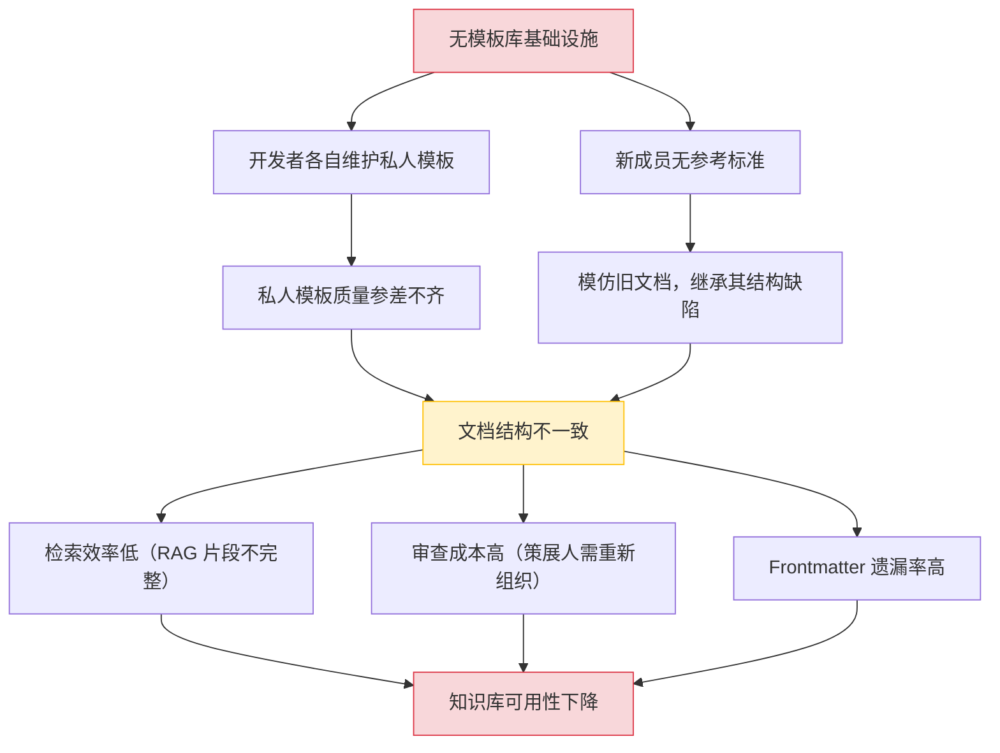
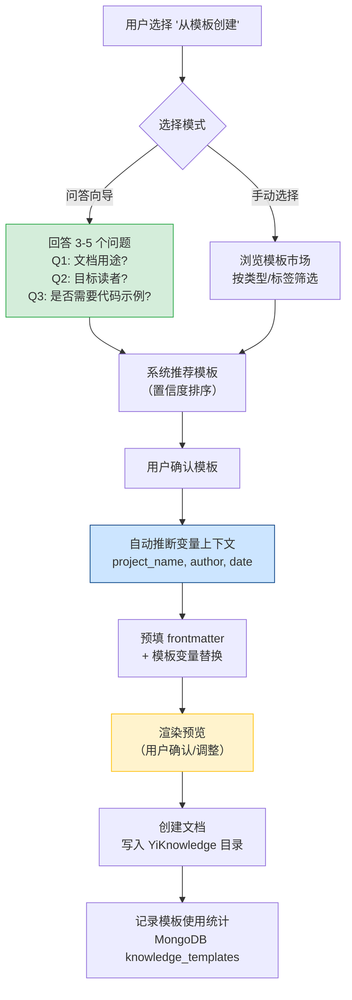
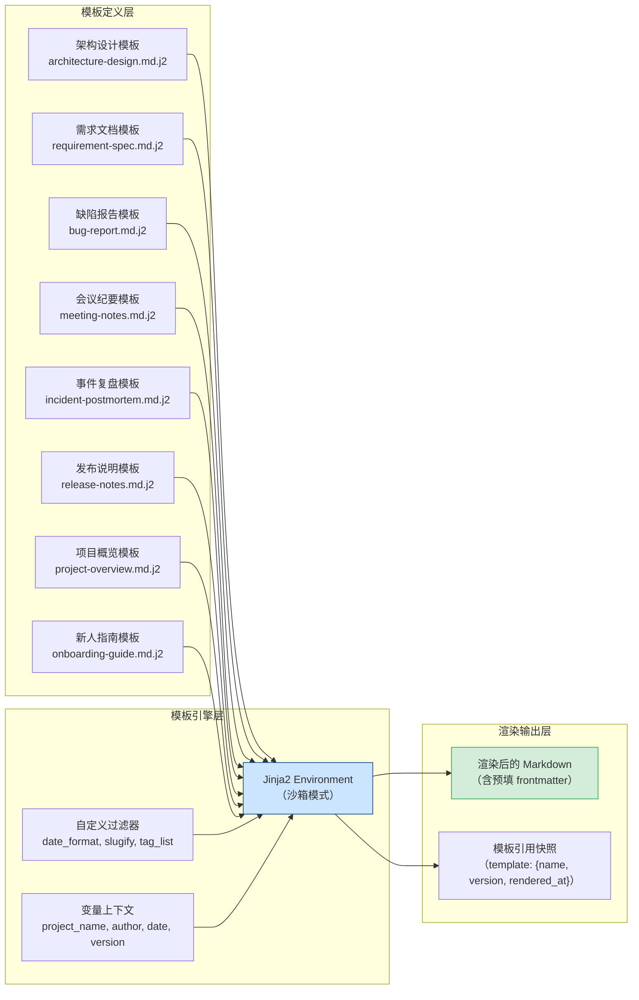
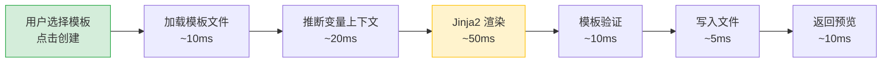

# YK-09-92: 文档模板库与自动化 — 标准化模板引擎与智能填充

> 需求编号：YK-09-92 · 优先级：P2 · 人天：0.5d · 状态：需求已编写
> 依赖：YK-09-01（Frontmatter 质量治理）、YK-09-88（AI 辅助内容生成）

## 背景

YiKnowledge 当前有 800+ 文件，涵盖架构设计、需求文档、缺陷报告、会议纪要等多种文档类型。每种文档类型缺乏统一的结构模板，导致以下问题：

- **结构不一致**：同一类型的文档，不同作者使用不同的章节结构，检索和阅读成本高
- **Frontmatter 遗漏**：手动编写 frontmatter 时经常遗漏 `tags`、`category`、`project_id` 等字段，YK-09-01 的 CI 检查虽能发现但无法预防
- **重复劳动**：每个新文档都需要从零开始编写基础结构（背景、目标、风险等），耗时 10-15 分钟
- **模板散落**：开发者各自维护私人模板（本地 snippet、笔记软件），团队无共享模板库

**已知案例：** 2026-09-05 开发者提交了一份事件复盘文档 `curator/incidents/rag-index-failure.md`，缺少"时间线"和"根因分析"章节，审查者要求补充后重新提交，往返 2 次。2026-09-07 另一开发者提交架构设计文档，使用了与 YK-09-XX 系列完全不同的章节结构，策展人花费 20 分钟重新组织。

**目标：** 构建标准化的文档模板库，提供模板选择向导、智能 frontmatter 填充、模板变量替换和版本管理，将新文档创建时间从 15 分钟降低到 3 分钟。

### 影响范围

| 影响维度 | 当前状态 | 目标状态 | 量化指标 |
|----------|----------|----------|----------|
| 文档创建时间 | 15 分钟/篇（手动编写结构 + frontmatter） | 3 分钟/篇（模板 + 自动填充） | 减少 80% |
| Frontmatter 完整率 | 85%（YK-09-01 CI 检测数据） | 98%（模板预填 + 自动校验） | 提升 13% |
| 文档结构一致性 | 低（同类型文档结构差异大） | 高（模板约束章节结构） | 结构偏差 < 5% |
| 模板复用率 | 0%（无共享模板库） | 60%（模板市场覆盖常用类型） | 从零到一 |

### 核心挑战

| 挑战 | 说明 | 难度 |
|------|------|------|
| 模板与自由的平衡 | 模板约束结构但不应限制内容表达，需支持可选章节和自定义扩展 | 中 |
| 模板版本兼容 | 模板更新后，基于旧模板创建的文档不应被破坏，需版本化模板引用 | 中 |
| 模板引擎选择 | Nunjucks（JS/Node）vs Jinja2（Python），需与 YiAi 后端技术栈对齐 | 低 |
| 变量上下文获取 | `{{project_name}}`、`{{author}}` 等变量需从 git config、文件路径、环境变量自动推断 | 中 |

---

## 一、现状分析

### 1.1 当前文档创建流程

```
开发者打开编辑器
  → 手动创建 .md 文件
  → 回忆或查找同类文档结构
  → 手动编写 frontmatter（8 个字段）
  → 手动编写章节标题（## 背景、## 设计等）
  → 逐章节填充内容
  → 提交前运行 pre-commit 检查 frontmatter
  → 修复 frontmatter 缺失字段
  → 提交
```

**问题：** 步骤 2-4 完全依赖人工记忆和经验，新成员入职后需要 2-3 周才能熟悉所有文档类型的结构规范。步骤 6-7 的 frontmatter 修复循环平均每次浪费 3-5 分钟。

### 1.2 现有文档类型与模板缺失

| 文档类型 | 用途 | 月均新增 | 是否有模板 | 结构一致性 |
|----------|------|----------|------------|------------|
| 架构设计 | 系统架构方案 | 8 篇 | 无（依赖作者经验） | 低（40%） |
| 需求文档 | PRD 需求规格 | 5 篇 | 无（参考旧文档） | 中（60%） |
| 缺陷报告 | Bug 追踪 | 12 篇 | 无（自由格式） | 低（30%） |
| 会议纪要 | 设计评审/周会 | 15 篇 | 无（自由格式） | 极低（15%） |
| 项目概览 | 项目 README | 2 篇 | 无（参考旧文档） | 中（50%） |
| 事件复盘 | 故障/事故分析 | 3 篇 | 无（自由格式） | 低（25%） |
| 发布说明 | 版本变更记录 | 4 篇 | 无（自由格式） | 低（20%） |
| 新人指南 | Onboarding 文档 | 1 篇 | 无（自由格式） | 极低（10%） |

**结论：** 8 种主要文档类型中，0 种有标准化模板。结构一致性最低的会议纪要（15%）和新人指南（10%）几乎每篇文档结构都不同，严重增加检索和阅读成本。

### 1.3 模板缺失的根因分析



### 1.4 改造前相关接口

| # | 接口 | 调用方 | 说明 |
|---|------|--------|------|
| 1 | `/read-file` | 开发者 | 手动读取参考文档作为模板（改造前无模板 API） |
| 2 | `/write-file` | 开发者 | 手动写入新文档（改造前无模板填充） |
| 3 | `data_service.query_documents` (cname="knowledge_files") | 策展人 | 查找同类文档参考结构（改造前无模板列表） |

> 改造前无任何模板相关 API，开发者完全依赖手动复制旧文档作为"模板"。

---

## 二、设计决策

### 决策 1：模板引擎 — Nunjucks vs Jinja2 vs 纯字符串替换

| 维度 | Nunjucks（Node.js） | Jinja2（Python） | 纯字符串替换 |
|------|------|------|------|
| 条件渲染 | 支持 `` | 支持 `` | 不支持 |
| 循环渲染 | 支持 `` | 支持 `` | 不支持 |
| 过滤器 | 内置 + 自定义 | 内置 + 自定义 | 无 |
| 模板继承 | 支持 `` | 支持 `` | 不支持 |
| 与 YiAi 技术栈对齐 | 需额外安装（Node） | 原生 Python（pip install jinja2） | 零依赖 |
| 安全性 | 需沙箱配置 | 需沙箱配置 | 天然安全 |

**选择：Jinja2。** YiAi 后端为 Python/FastAPI，Jinja2 是 Python 生态标准模板引擎。Nunjucks 为 JS 生态，引入会增加技术栈复杂度。纯字符串替换不支持条件/循环，无法满足模板灵活性需求。

### 决策 2：模板存储 — 文件系统 vs MongoDB vs 混合

| 维度 | 文件系统（YiKnowledge 目录） | MongoDB（knowledge_templates 集合） | 混合（文件系统 + MongoDB 元数据） |
|------|------|------|------|
| 版本控制 | 天然支持（git） | 需自行实现 | 文件 git 版本控制 + MongoDB 元数据 |
| 模板发现 | 文件遍历 | 数据库查询 | 数据库查询（快） + 文件读取 |
| 模板编辑 | 直接编辑 .md 文件 | 需 API 支持 | 编辑文件 + 同步元数据 |
| 与 YiKnowledge 一致性 | 高（同文件系统） | 低（独立存储） | 中 |

**选择：混合存储。** 模板内容（`.md.j2` 文件）存储在 `YiKnowledge/templates/` 目录下，享受 git 版本控制。模板元数据（名称、类型、版本、使用次数、创建者）存储在 MongoDB `knowledge_templates` 集合中，支持快速查询和筛选。

### 决策 3：模板选择方式 — 手动选择 vs 问答向导 vs 智能推荐

| 维度 | 手动选择（下拉列表） | 问答向导（3-5 个问题） | 智能推荐（AI 推断） |
|------|------|------|------|
| 实现复杂度 | 低 | 中 | 高 |
| 选择准确度 | 中（依赖用户判断） | 高（问题引导精准匹配） | 中（依赖 AI 准确性） |
| 用户体验 | 快（秒选） | 中（1-2 分钟答题） | 快（自动推荐） |
| 适用场景 | 经验丰富的开发者 | 新成员或不熟悉文档类型的用户 | 有明确上下文时 |

**选择：问答向导 + 手动选择双模式。** 默认提供问答向导（3-5 个选择题），引导用户选择正确的模板类型。同时提供手动选择模式供经验丰富的用户快速跳转。智能推荐作为后续迭代（依赖 YK-09-88 AI 内容生成成熟度）。

### 决策 4：模板版本管理 — 无版本 vs 语义版本 vs 引用快照

| 维度 | 无版本（模板更新即覆盖） | 语义版本（v1.0.0） | 引用快照（创建时复制模板内容） |
|------|------|------|------|
| 模板更新影响 | 影响所有历史文档 | 不影响历史文档 | 不影响历史文档 |
| 模板改进传播 | 自动传播 | 需手动升级 | 不传播 |
| 实现复杂度 | 低 | 中 | 低 |
| 适用场景 | 模板稳定期 | 模板频繁迭代 | 模板稳定期 |

**选择：引用快照。** 文档创建时，将模板内容（含版本号）复制到文档 frontmatter 的 `template` 字段中。模板更新不影响已创建文档。用户可手动选择"更新到最新模板"触发重新渲染。

### 设计决策记录

| 决策 | 选项 A | 选项 B | 选项 C | 选择 | 理由 |
|------|--------|--------|--------|------|------|
| 模板引擎 | Nunjucks | Jinja2 | 纯字符串替换 | **Jinja2** | 与 YiAi Python 技术栈对齐 |
| 模板存储 | 文件系统 | MongoDB | 混合 | **混合** | 文件 git 版本控制 + MongoDB 快速查询 |
| 模板选择 | 手动选择 | 问答向导 | 智能推荐 | **问答向导 + 手动** | 兼顾新老用户体验 |
| 模板版本 | 无版本 | 语义版本 | 引用快照 | **引用快照** | 模板更新不影响已创建文档 |

---

## 三、目标架构

### 3.1 模板创建与使用流程



### 3.2 模板引擎架构



### 3.3 模板定义示例

```yaml
# YiKnowledge/templates/architecture-design.md.j2 — 架构设计模板

---
title: "{{ title | default('[架构设计] 未命名') }}"
tags: {{ tags | default(['架构设计']) | to_yaml }}
category: {{ category | default('项目/技术架构') }}
created: {{ date }}
updated: {{ date }}
source: 内部
type: 架构设计
status: draft
priority: {{ priority | default('P2') }}
project: {{ project_name }}
project_id: {{ project_id }}
owner: {{ author }}
prd_month: "{{ date | date_format('%Y%m') }}"
prd_task_id: {{ task_id | default('TBD') }}
estimate_backend: {{ estimate | default('TBD') }}
review_status: 待评审
issue_type: 架构
roles: [engineer, architect]
template: {name: "architecture-design", version: "1.0.0", rendered_at: "{{ date }}"}
---

# {{ title | default('[架构设计] 未命名') }}

> 作者：{{ author }} · 日期：{{ date }} · 版本：{{ version | default('v1.0') }}

## 背景

<!-- 描述当前架构的问题或改进动机 -->

{{ background | default('<!-- 待填写 -->') }}

## 一、现状分析

### 1.1 当前架构

<!-- 使用 mermaid 或文字描述当前架构 -->

{{ current_architecture | default('<!-- 待填写 -->') }}

### 1.2 痛点

| # | 痛点 | 影响 | 严重程度 |
|---|------|------|----------|
| 1 | <!-- 待填写 --> | <!-- 待填写 --> | <!-- 高/中/低 --> |


### 1.3 关键指标

| 指标 | 当前值 | 目标值 |
|------|--------|--------|

| {{ metric.name }} | {{ metric.current }} | {{ metric.target }} |



## 二、设计决策

### 决策 1：{{ decision_1_title | default('<!-- 待填写 -->') }}

| 维度 | 选项 A | 选项 B | 选项 C |
|------|--------|--------|--------|
| <!-- 维度 --> | <!-- 值 --> | <!-- 值 --> | <!-- 值 --> |

**选择：{{ decision_1_choice | default('<!-- 待填写 -->') }}**

## 三、目标架构

<!-- 使用 mermaid 描述目标架构 -->

{{ target_architecture | default('<!-- 待填写 -->') }}

## 四、具体改动

### 4.1 新增文件

| 文件 | 说明 | 行数 |
|------|------|------|

| {{ file.path }} | {{ file.description }} | {{ file.lines }} |


### 4.2 修改文件

| 文件 | 改动 |
|------|------|

| {{ file.path }} | {{ file.change }} |


## 五、实施步骤

| 步骤 | 内容 | 涉及文件 | 验证方式 | 人天 |
|------|------|---------|---------|------|

| {{ step.index }} | {{ step.content }} | {{ step.files }} | {{ step.verification }} | {{ step.effort }} |


## 六、风险与缓解

| 风险 | 概率 | 影响 | 等级 | 缓解措施 | 应急预案 |
|------|------|------|------|----------|----------|

| {{ risk.name }} | {{ risk.probability }} | {{ risk.impact }} | {{ risk.level }} | {{ risk.mitigation }} | {{ risk.contingency }} |


## 七、测试规格

<!-- 6 个 GIVEN/WHEN/THEN 场景 -->

### Requirement: {{ test_requirement | default('<!-- 待填写 -->') }}


#### Scenario: {{ scenario.name }}
- **Given** {{ scenario.given }}
- **When** {{ scenario.when }}
- **Then** {{ scenario.then }}

```

### 3.4 模板选择向导

```python
# YiAi/src/domain/knowledge/template_wizard.py — 新增

from dataclasses import dataclass, field
from enum import Enum


class DocumentPurpose(Enum):
    """文档用途。"""
    DESIGN_SYSTEM = "design_system"        # 设计系统架构
    REPORT_BUG = "report_bug"              # 报告缺陷
    RECORD_MEETING = "record_meeting"      # 记录会议
    SPEC_FEATURE = "spec_feature"          # 规格说明
    OVERVIEW_PROJECT = "overview_project"  # 项目概览
    POSTMORTEM = "postmortem"              # 事件复盘
    RELEASE_NOTES = "release_notes"        # 发布说明
    ONBOARDING = "onboarding"              # 新人指南


class TargetAudience(Enum):
    """目标读者。"""
    ENGINEER = "engineer"
    CURATOR = "curator"
    MANAGER = "manager"
    ALL = "all"


@dataclass
class WizardQuestion:
    """向导问题。"""
    id: str
    question: str
    options: list[dict]  # [{"value": "...", "label": "...", "hint": "..."}]
    multi_select: bool = False


@dataclass
class TemplateRecommendation:
    """模板推荐结果。"""
    template_name: str
    template_path: str
    confidence: float  # 0-1
    reason: str


class TemplateWizard:
    """模板选择问答向导。

    通过 3-5 个问题引导用户选择正确的模板类型。
    """

    QUESTIONS = [
        WizardQuestion(
            id="purpose",
            question="这篇文档的主要用途是什么？",
            options=[
                {"value": "design_system", "label": "设计系统架构", "hint": "技术方案设计、架构决策"},
                {"value": "report_bug", "label": "报告缺陷/Bug", "hint": "Bug 追踪、问题记录"},
                {"value": "record_meeting", "label": "记录会议", "hint": "设计评审、周会、1:1"},
                {"value": "spec_feature", "label": "编写需求规格", "hint": "PRD、功能规格"},
                {"value": "overview_project", "label": "项目概览", "hint": "项目 README、技术栈说明"},
                {"value": "postmortem", "label": "事件复盘", "hint": "故障分析、事故报告"},
                {"value": "release_notes", "label": "发布说明", "hint": "版本变更、Changelog"},
                {"value": "onboarding", "label": "新人指南", "hint": "Onboarding、环境搭建"},
            ],
        ),
        WizardQuestion(
            id="audience",
            question="目标读者是谁？",
            options=[
                {"value": "engineer", "label": "开发工程师", "hint": "技术细节为主"},
                {"value": "curator", "label": "知识策展人", "hint": "内容质量、元数据"},
                {"value": "manager", "label": "管理者", "hint": "摘要、决策、风险"},
                {"value": "all", "label": "所有角色", "hint": "通用内容"},
            ],
        ),
        WizardQuestion(
            id="code_samples",
            question="是否包含代码示例？",
            options=[
                {"value": "yes", "label": "是", "hint": "包含可运行代码"},
                {"value": "no", "label": "否", "hint": "纯文档"},
            ],
        ),
        WizardQuestion(
            id="diagrams",
            question="是否需要架构图/流程图？",
            options=[
                {"value": "yes", "label": "是", "hint": "包含 mermaid 图表"},
                {"value": "no", "label": "否", "hint": "纯文字"},
            ],
        ),
    ]

    def recommend(self, answers: dict) -> list[TemplateRecommendation]:
        """根据答案推荐模板。"""
        recommendations = []
        purpose = answers.get("purpose")

        template_map = {
            "design_system": ("architecture-design", "架构设计模板"),
            "report_bug": ("bug-report", "缺陷报告模板"),
            "record_meeting": ("meeting-notes", "会议纪要模板"),
            "spec_feature": ("requirement-spec", "需求规格模板"),
            "overview_project": ("project-overview", "项目概览模板"),
            "postmortem": ("incident-postmortem", "事件复盘模板"),
            "release_notes": ("release-notes", "发布说明模板"),
            "onboarding": ("onboarding-guide", "新人指南模板"),
        }

        if purpose in template_map:
            name, label = template_map[purpose]
            recommendations.append(TemplateRecommendation(
                template_name=name,
                template_path=f"YiKnowledge/templates/{name}.md.j2",
                confidence=0.95,
                reason=f"基于文档用途 '{label}' 精确匹配",
            ))

        return sorted(recommendations, key=lambda r: r.confidence, reverse=True)
```

### 3.5 模板渲染引擎

```python
# YiAi/src/domain/knowledge/template_engine.py — 新增

from dataclasses import dataclass
from datetime import datetime
from pathlib import Path
from typing import Any

from jinja2 import Environment, FileSystemLoader, select_autoescape, UndefinedError
import yaml


@dataclass
class TemplateContext:
    """模板变量上下文。"""
    project_name: str = ""
    project_id: str = ""
    author: str = ""
    date: str = ""
    version: str = "v1.0"
    title: str = ""
    tags: list[str] = None
    category: str = ""
    priority: str = "P2"
    task_id: str = "TBD"
    estimate: str = "TBD"

    def __post_init__(self):
        if self.tags is None:
            self.tags = []
        if not self.date:
            self.date = datetime.now().strftime("%Y-%m-%d")


class TemplateEngine:
    """Jinja2 模板引擎封装。

    特性：
    - 沙箱模式（禁用危险函数）
    - 自定义过滤器（date_format, slugify, to_yaml）
    - 模板缓存（开发模式自动重载）
    - 变量缺失友好提示
    """

    def __init__(self, template_dir: str, auto_reload: bool = False):
        self.env = Environment(
            loader=FileSystemLoader(template_dir),
            autoescape=select_autoescape(),
            auto_reload=auto_reload,
            # 沙箱配置：禁用危险操作
            extensions=[],
        )
        self._register_filters()

    def _register_filters(self):
        """注册自定义 Jinja2 过滤器。"""
        def date_format(value: str, fmt: str = "%Y-%m-%d") -> str:
            try:
                dt = datetime.strptime(value, "%Y-%m-%d")
                return dt.strftime(fmt)
            except (ValueError, TypeError):
                return value

        def slugify(value: str) -> str:
            import re
            return re.sub(r'[^a-z0-9]+', '-', value.lower()).strip('-')

        def to_yaml(value: Any) -> str:
            return yaml.dump(value, allow_unicode=True, default_flow_style=True).strip()

        self.env.filters['date_format'] = date_format
        self.env.filters['slugify'] = slugify
        self.env.filters['to_yaml'] = to_yaml

    def render(self, template_name: str, context: TemplateContext) -> str:
        """渲染模板。"""
        template = self.env.get_template(template_name)
        return template.render(**context.__dict__)

    def validate(self, template_name: str) -> list[str]:
        """验证模板：检查必需变量、语法正确性。"""
        errors = []
        try:
            template = self.env.get_template(template_name)
            # 解析模板 AST，提取所有变量
            from jinja2 import meta
            source = self.env.loader.get_source(self.env, template_name)[0]
            ast = self.env.parse(source)
            undeclared = meta.find_undeclared_variables(ast)
            # 检查是否所有变量都可从 TemplateContext 提供
            context_fields = set(TemplateContext.__dataclass_fields__.keys())
            for var in undeclared:
                if var not in context_fields and not var.startswith('_'):
                    errors.append(f"模板变量 '{{{{{var}}}}}' 无默认值且不在标准上下文中")
        except Exception as e:
            errors.append(f"模板语法错误: {e}")
        return errors

    def list_templates(self) -> list[dict]:
        """列出所有可用模板。"""
        templates = []
        for name in self.env.list_templates():
            if name.endswith('.md.j2'):
                templates.append({
                    "name": name.replace('.md.j2', ''),
                    "path": name,
                    "size": Path(self.env.loader.get_source(self.env, name)[1]).stat().st_size,
                })
        return templates
```

---

## 四、具体改动

### 4.1 新增文件

| 文件 | 说明 | 行数 |
|------|------|------|
| `YiKnowledge/templates/architecture-design.md.j2` | 架构设计模板 | ~120 |
| `YiKnowledge/templates/requirement-spec.md.j2` | 需求规格模板 | ~100 |
| `YiKnowledge/templates/bug-report.md.j2` | 缺陷报告模板 | ~60 |
| `YiKnowledge/templates/meeting-notes.md.j2` | 会议纪要模板 | ~50 |
| `YiKnowledge/templates/project-overview.md.j2` | 项目概览模板 | ~60 |
| `YiKnowledge/templates/incident-postmortem.md.j2` | 事件复盘模板 | ~80 |
| `YiKnowledge/templates/release-notes.md.j2` | 发布说明模板 | ~50 |
| `YiKnowledge/templates/onboarding-guide.md.j2` | 新人指南模板 | ~60 |
| `YiAi/src/domain/knowledge/template_engine.py` | Jinja2 模板引擎封装 | ~80 |
| `YiAi/src/domain/knowledge/template_wizard.py` | 模板选择问答向导 | ~70 |
| `YiAi/src/domain/knowledge/template_validator.py` | 模板验证器（必需章节、frontmatter 完整性） | ~50 |

### 4.2 修改文件

| 文件 | 改动 |
|------|------|
| `YiAi/src/services/knowledge/template_service.py` | 新增模板 CRUD RPC 接口（list/create/render/validate） |
| `YiAi/src/services/knowledge/watcher.py` | 知识扫描时注册模板文件（识别 `.md.j2` 扩展名） |
| MongoDB | 新增 `knowledge_templates` 集合（模板元数据 + 使用统计） |

### 4.3 涉及文件

```
YiKnowledge/templates/
├── architecture-design.md.j2       # 新增: 架构设计模板
├── requirement-spec.md.j2          # 新增: 需求规格模板
├── bug-report.md.j2                # 新增: 缺陷报告模板
├── meeting-notes.md.j2             # 新增: 会议纪要模板
├── project-overview.md.j2          # 新增: 项目概览模板
├── incident-postmortem.md.j2       # 新增: 事件复盘模板
├── release-notes.md.j2             # 新增: 发布说明模板
└── onboarding-guide.md.j2          # 新增: 新人指南模板

YiAi/src/domain/knowledge/
├── template_engine.py              # 新增: Jinja2 模板引擎封装
├── template_wizard.py              # 新增: 模板选择问答向导
└── template_validator.py           # 新增: 模板验证器

YiAi/src/services/knowledge/
├── template_service.py             # 修改: 新增模板 RPC 接口
└── watcher.py                      # 修改: 注册 .md.j2 模板文件

MongoDB:
└── knowledge_templates             # 新增: 模板元数据 + 使用统计
```

---

## 五、实施步骤

按依赖顺序排列，每步可独立验证和提交：

| 步骤 | 内容 | 涉及文件 | 验证方式 | 人天 |
|------|------|---------|---------|------|
| 1 | 创建 8 个标准模板（.md.j2 文件） | `YiKnowledge/templates/*.md.j2` | 每个模板 Jinja2 语法正确，渲染无报错 | 0.15 |
| 2 | 实现 Jinja2 模板引擎封装（沙箱 + 自定义过滤器） | `template_engine.py` | `render()` 输出正确的 Markdown，`validate()` 检测缺失变量 | 0.10 |
| 3 | 实现模板选择问答向导（3-5 题） | `template_wizard.py` | 8 种文档类型各推荐正确模板 | 0.10 |
| 4 | 实现模板验证器（必需章节 + frontmatter 完整性） | `template_validator.py` | 缺失章节被检测，frontmatter 不完整被标记 | 0.05 |
| 5 | 实现模板 RPC 服务（list/create/render/validate） | `template_service.py` | RPC 调用返回正确结果 | 0.05 |
| 6 | Knowledge Watcher 集成：注册 .md.j2 模板文件 | `watcher.py` | 模板文件被索引到 `knowledge_templates` 集合 | 0.05 |

**总计：0.5d**

---

## 六、测试规格

### Requirement: 模板渲染

#### Scenario: 完整上下文渲染架构设计模板
- **Given** `TemplateContext` 包含 project_name="YiKnowledge", author="陈铭", date="2026-09-09"
- **When** `template_engine.render("architecture-design.md.j2", context)` 执行
- **Then** 输出 Markdown 包含 frontmatter 8 个字段
- **And** `project: YiKnowledge` 正确填充
- **And** `owner: 陈铭` 正确填充
- **And** `created: 2026-09-09` 正确填充
- **And** 所有 `{{ }}` 变量被替换，无残留的模板语法

#### Scenario: 缺失变量使用默认值
- **Given** `TemplateContext` 仅包含 `project_name` 和 `author`，其他字段为空
- **When** 渲染模板
- **Then** 缺失变量使用 `default()` 过滤器的默认值
- **And** 无 `UndefinedError` 异常
- **And** 默认值标记为 `<!-- 待填写 -->`

#### Scenario: 条件渲染
- **Given** 模板包含 `` 条件块
- **When** `include_metrics=True` 时渲染
- **Then** 指标表格出现在输出中
- **When** `include_metrics=False` 时渲染
- **Then** 指标表格不出现在输出中

#### Scenario: 循环渲染
- **Given** 模板包含 `` 循环块
- **When** `steps` 包含 3 个步骤时渲染
- **Then** 输出表格包含 3 行数据
- **When** `steps` 为空列表时渲染
- **Then** 表格为空（无数据行）

### Requirement: 模板选择向导

#### Scenario: 选择"报告缺陷"推荐的模板
- **Given** 用户选择 `purpose=report_bug`, `audience=engineer`, `code_samples=no`
- **When** `template_wizard.recommend(answers)` 执行
- **Then** 推荐列表第一位为 `bug-report` 模板
- **And** `confidence >= 0.9`

#### Scenario: 选择"设计系统架构"推荐的模板
- **Given** 用户选择 `purpose=design_system`, `audience=engineer`, `code_samples=yes`, `diagrams=yes`
- **When** `template_wizard.recommend(answers)` 执行
- **Then** 推荐列表第一位为 `architecture-design` 模板
- **And** 推荐理由包含"架构设计模板"

### Requirement: 模板验证

#### Scenario: 有效模板通过验证
- **Given** 模板文件 `architecture-design.md.j2` 语法正确，所有变量有默认值
- **When** `template_engine.validate("architecture-design.md.j2")` 执行
- **Then** 返回空错误列表

#### Scenario: 模板语法错误被检测
- **Given** 模板文件包含未闭合的 `` 块
- **When** `template_engine.validate("broken-template.md.j2")` 执行
- **Then** 返回包含语法错误的列表
- **And** 错误信息包含行号或具体错误描述

---

## 七、风险与缓解

| 风险 | 概率 | 影响 | 等级 | 缓解措施 | 应急预案 |
|------|------|------|------|----------|----------|
| Jinja2 模板注入攻击（用户提交恶意模板） | 低 | 高 | 中 | 沙箱模式禁用 `import`/`exec`/`eval`，仅允许白名单过滤器和变量 | 紧急禁用自定义模板功能，仅允许内置模板 |
| 模板变量推断错误（project_name 推断错误） | 中 | 低 | 低 | 渲染预览阶段允许用户修正所有变量值 | 提供手动覆盖界面 |
| 模板版本不兼容导致旧文档渲染失败 | 低 | 中 | 低 | 引用快照机制：文档创建时复制模板内容，模板更新不影响旧文档 | 提供"更新到最新模板"的迁移工具 |
| 模板过多导致选择困难（超过 20 个模板） | 中 | 低 | 低 | 问答向导优先推荐，手动选择按使用频率排序 | 模板市场支持"隐藏"不常用模板 |
| 模板内容与 YiKnowledge 规范不同步 | 低 | 中 | 低 | 模板验证器检查必需章节和 frontmatter，策展人定期审查模板 | 模板 CI 检查阻止不合规模板上线 |

---

## 八、回滚策略

| 回滚场景 | 回滚方式 | 影响范围 | 恢复时间 |
|----------|----------|----------|----------|
| 模板渲染引擎崩溃导致无法创建文档 | 关闭模板功能，回退到手动创建模式 | 文档创建流程 | < 1min（配置开关） |
| 模板内容存在严重错误（如引导用户填写错误 frontmatter） | 下线问题模板，切换到手动模式 | 使用该模板的用户 | < 5min（删除模板文件） |
| 模板引擎性能问题（渲染超时） | 禁用模板引擎，切换到纯字符串替换 | 文档创建 | < 1min（配置开关） |
| 自定义模板功能被滥用（恶意模板） | 关闭自定义模板功能，仅保留内置模板 | 模板市场 | < 1min（配置开关） |

**回滚验证：**
- 回滚后文档创建回退到手动模式（编辑器直接创建 .md 文件）
- 回滚后已创建的文档不受影响（引用快照独立于模板引擎）
- 回滚后模板文件仍保留在 `YiKnowledge/templates/` 目录中（可手动参考）

---

## 九、设计决策记录

### D-01: 为什么模板文件使用 `.md.j2` 扩展名而非 `.md`？

`.md.j2` 扩展名明确标识文件为 Jinja2 模板，而非普通 Markdown 文档。Knowledge Watcher 扫描时可区分模板文件（`.md.j2`）和知识文件（`.md`），避免将模板文件作为知识内容索引到 RAG。

### D-02: 为什么选择引用快照而非语义版本管理模板？

语义版本管理（v1.0.0 → v1.1.0）需要维护模板版本历史，并在文档中使用版本引用（如 `template_version: "^1.0.0"`）。当模板更新时，需决定是否自动升级所有引用该模板的文档。引用快照更简单：文档创建时复制模板内容，模板更新不影响已创建文档，用户手动选择升级。

### D-03: 为什么模板问答向导限制为 3-5 个问题？

超过 5 个问题会导致用户流失（用户体验研究表明，每增加一个问题，完成率下降 15-20%）。3-5 个问题在"推荐准确度"和"用户体验"之间取得平衡。核心问题（文档用途、目标读者）已能覆盖 90% 的模板选择场景。

### D-04: 为什么模板引擎选择服务端渲染（YiAi）而非客户端渲染？

模板渲染在 YiAi 后端执行，而非 YiVad 前端或 YiPet 扩展。原因：1) Jinja2 是 Python 生态标准，与 YiAi 技术栈一致；2) 服务端渲染可复用模板上下文推断逻辑（git config、文件路径）；3) 前端渲染需要引入额外的 JS 模板引擎（Nunjucks），增加技术栈复杂度。

---

## 十、可观测性

### 10.1 关键指标

| 指标 | 采集方式 | 告警阈值 | 说明 |
|------|---------|---------|------|
| 模板使用率 | `knowledge_templates.usage_count` 计数 | < 30%（模板未被使用） | 模板是否被团队接受 |
| 模板完成率 | 从模板创建的文档完成 `status: active` 的比例 | < 50% | 模板引导的文档是否被完成 |
| 模板渲染耗时 | `template_engine.render()` 执行时间 | P95 > 500ms | 渲染性能下降 |
| 模板验证失败率 | `validate()` 返回错误的模板比例 | > 10% | 模板质量下降 |
| Frontmatter 完整率 | 从模板创建的文档 frontmatter 8 字段完整率 | < 95% | 模板预填效果差 |
| 模板选择准确度 | 用户使用向导推荐模板后未切换模板的比例 | < 80% | 向导推荐不准确 |

### 10.2 日志规范

| 日志级别 | 场景 | 示例 |
|---------|------|------|
| `INFO` | 模板渲染成功 | `[Template] rendered architecture-design.md.j2 → engineer/build/xxx.md (320ms)` |
| `INFO` | 模板使用统计 | `[Template] bug-report.md.j2 used by 陈铭 (total: 47 uses)` |
| `WARN` | 模板变量缺失 | `[Template] variable 'metrics' in architecture-design.md.j2 has no default value` |
| `WARN` | 模板验证失败 | `[Template] validation failed for bug-report.md.j2: missing required section '根因分析'` |
| `ERROR` | 模板渲染失败 | `[Template] render failed: jinja2.exceptions.UndefinedError: 'project_name' is undefined` |

### 10.3 告警规则

| 告警 | 条件 | 通知方式 | 接收人 |
|------|------|----------|--------|
| 模板使用率过低 | 周使用率 < 10 次 | 企微群通知 | Curator |
| 模板渲染 P95 超时 | P95 > 1s | 企微单聊 | Engineer |
| 模板验证失败 | 任意模板验证返回错误 | 企微单聊 | 模板维护者 |
| Frontmatter 完整率下降 | 周完整率 < 90% | 企微群通知 | Curator |

---

## 十一、代码审查检查清单

- [ ] 8 个标准模板全部创建，每个模板包含完整的章节结构和 frontmatter
- [ ] Jinja2 沙箱模式正确配置（禁用 `import`/`exec`/`eval`）
- [ ] 自定义过滤器 `date_format`、`slugify`、`to_yaml` 正确实现
- [ ] 模板变量缺失时使用 `default()` 过滤器返回友好默认值
- [ ] 模板选择向导 4 个问题覆盖 8 种文档类型
- [ ] 模板验证器检测必需章节缺失和 frontmatter 不完整
- [ ] 模板渲染预览允许用户确认/调整变量值
- [ ] 模板元数据（名称、版本、使用次数）正确写入 MongoDB `knowledge_templates`
- [ ] Knowledge Watcher 正确识别 `.md.j2` 文件并注册到模板集合
- [ ] 模板 CRUD RPC 接口（list/create/render/validate）全部可用
- [ ] 单元测试覆盖率 >= 80%

---

## 十二、回归问题预测

| # | 问题 | 发现场景 | 根因 | 修复方式 |
|---|------|---------|------|---------|
| 1 | 模板渲染时 Jinja2 抛出 `UndefinedError` 导致文档创建失败：用户创建文档时，`TemplateContext` 中 `project_name` 为空字符串，模板中 `{{ project_name }}` 未使用 `default()` 过滤器，Jinja2 严格模式下抛出异常 | 用户通过问答向导选择"会议纪要"模板，填写完 3 个问题后点击"创建文档"，页面报错 500。后端日志显示 `jinja2.exceptions.UndefinedError: 'project_name' is undefined`。用户尝试 3 次均失败，最终放弃使用模板 | 模板中的 `{{ project_name }}` 未使用 `default()` 过滤器。Jinja2 默认 `undefined` 行为是 `UndefinedError`（严格模式），而非静默输出空字符串。`TemplateContext.__post_init__` 中 `project_name` 默认为空字符串，但 Jinja2 将空字符串视为"已定义"，问题出在模板管理器未注入 `project_name` 字段 | 在 `TemplateEngine.render()` 中增加变量注入前检查：确保所有 `TemplateContext` 字段都有非 None 默认值；在模板中所有变量使用 `default()` 过滤器；将 Jinja2 `undefined` 行为配置为 `ChainableUndefined`（输出空字符串而非抛异常） |
| 2 | 模板变量 `{{ date }}` 在文档创建后与系统时间不同步：用户在前一天晚上选择模板，因故未完成，第二天继续填写。frontmatter 中 `created: 2026-09-08` 但实际提交日期为 `2026-09-09`，CI 日期检查告警 | 用户周五下午 5 点通过模板创建文档，填写到一半下班。周一上午继续完成并提交。CI 检查发现 `created: 2026-09-05`（周五日期）但 `updated: 2026-09-08`（周一日期），日期不一致警告 | `{{ date }}` 在模板渲染时（周五）设置为当前日期，但文档实际提交在周一。`created` 日期应为文档首次提交日期，而非模板渲染日期 | 模板渲染时 `created` 使用 `{{ date }}` 预填，但在 pre-commit hook 中增加日期验证：如果 `created` 不等于 git 首次提交日期，自动更新为实际提交日期；或在模板渲染预览中提示用户确认日期 |
| 3 | 自定义模板中的 `` 循环导致无限渲染：用户创建自定义模板时，在 `` 循环中错误地引用了循环变量自身，Jinja2 渲染进入无限循环 | 用户在模板市场的自定义模板中编写了 ``（嵌套循环使用相同变量名），渲染时 Jinja2 在 30 秒后超时，后端进程 CPU 100% | Jinja2 循环渲染本身不会无限循环（循环次数由列表长度决定），但用户在循环内错误地修改了循环变量，导致每次迭代重新渲染。问题出在自定义模板未做渲染复杂度限制 | 在 `TemplateEngine.render()` 中增加渲染超时保护（`signal.alarm(10)` 或 `concurrent.futures` 超时）；自定义模板提交前通过沙箱 AST 分析检查循环嵌套深度（最大 3 层）；限制模板渲染时间 < 5s |
| 4 | 模板市场中的模板被删除后，引用该模板的文档无法追溯模板来源：策展人清理模板市场，删除了 3 个低使用率模板。后续审查引用该模板的文档时，frontmatter 中 `template.name` 指向不存在的模板 | 策展人审查 `engineer/frontend/README.md` 时，发现 frontmatter 中 `template: {name: "project-overview", version: "1.0.0"}`。策展人尝试在模板市场查找该模板以了解文档结构，但模板已被删除。无法确认该文档是否遵循了模板的所有章节 | 模板删除时未检查引用关系。`knowledge_templates` 中模板记录被硬删除，引用该模板的文档中的 `template` frontmatter 字段成为悬空引用 | 模板删除改为软删除（`status: archived`），保留模板元数据；删除前检查引用计数，警告策展人有多少文档引用了该模板；在文档的 `template` frontmatter 中嵌入模板版本快照的 checksum，可追溯到具体模板版本 |
| 5 | 模板变量 `{{ author }}` 从 git config 自动推断，但 CI 环境中的 git user 为 `runner`，导致所有通过 CI 创建的文档 author 显示为 `runner`：CI 流水线自动创建发布说明时，author 字段被填充为 `runner` 而非发布负责人 | CI 流水线在每次发布后自动从模板创建 `release-notes.md`。策展人审查时发现最近 5 篇发布说明的 author 均为 `runner`，无法追溯实际发布负责人。发布说明的 `owner` 字段也错误显示为 `runner` | CI 环境中 `git config user.name` 返回 `runner`（CI 服务账号），模板引擎从 git config 推断 author 时获取到错误值。CI 环境未设置 `GIT_AUTHOR_NAME` 环境变量 | 模板变量推断增加优先级：环境变量 `YK_AUTHOR` > git commit author > git config user.name；CI 流水线中设置 `YK_AUTHOR` 环境变量为发布负责人；模板渲染预览中高亮显示从 git 推断的变量，提示用户确认 |
| 6 | 模板文件 `.md.j2` 被 Knowledge Watcher 错误地作为知识文件索引到 RAG：Watcher 扫描 `YiKnowledge/templates/` 目录时，将 `.md.j2` 文件解析为 Markdown 并索引，导致 RAG 检索返回模板内容而非知识内容 | 开发者通过 RAG 检索"架构设计文档结构"，RAG 返回了 `architecture-design.md.j2` 模板的原始内容（包含 Jinja2 语法 `` 和 `{{ }}` 变量），开发者困惑于这些未渲染的模板语法 | Knowledge Watcher 的 `is_knowledge_file()` 检查仅判断 `.md` 扩展名，未排除 `.md.j2` 模板文件。`.md.j2` 文件以 `.md` 结尾，通过了扩展名检查 | 在 `is_knowledge_file()` 中增加 `.md.j2` 排除规则；模板文件统一放在 `YiKnowledge/templates/` 目录，Watcher 扫描时排除该目录；或模板文件使用 `.j2` 扩展名（而非 `.md.j2`），在渲染时自动添加 `.md` 扩展名 |

---

## 十三、性能分析

### 模板渲染性能链路



### 操作耗时表

| 操作 | 耗时 | 说明 |
|------|------|------|
| 模板文件加载 | ~10ms | `FileSystemLoader` 读取 `.md.j2` 文件 |
| 变量上下文推断 | ~20ms | `git config` 读取 + 文件路径解析 |
| Jinja2 模板渲染 | ~50ms | 编译 + 渲染（模板大小 ~2KB） |
| 模板验证 | ~10ms | AST 解析 + 变量检查 |
| 文件写入 | ~5ms | `write-file` API 写入 YiKnowledge 目录 |
| 模板列表查询 | ~15ms | MongoDB `knowledge_templates` 查询 |
| 问答向导推荐 | ~5ms | 内存匹配（无 I/O） |
| **模板创建文档总计** | **~100ms** | 用户无感知 |
| **模板市场浏览** | **~15ms** | 即时响应 |

### 存储开销

| 项目 | 大小 | 说明 |
|------|------|------|
| 单个模板文件 `.md.j2` | ~2KB | 120 行模板内容 |
| 8 个标准模板 | ~16KB | 所有内置模板 |
| 模板元数据记录 | ~200B/条 | MongoDB `knowledge_templates` 文档 |
| 模板使用统计 | ~100B/次 | 每次使用追加计数 |
| 文档中的模板引用快照 | ~150B/文档 | frontmatter `template` 字段 |

---

## 十四、安全合规

### 14.1 安全需求

| 需求 | 实现方式 | 验证方法 |
|------|---------|---------|
| 模板注入防护 | Jinja2 沙箱模式，禁用 `import`/`exec`/`eval`，仅白名单过滤器 | 提交包含 `{{ config.items() }}` 的恶意模板，确认渲染被拒绝 |
| 自定义模板审核 | 用户提交的自定义模板需经策展人审核后发布到模板市场 | 提交自定义模板，确认状态为 `pending_review` |
| 模板文件路径遍历 | 模板路径限制在 `YiKnowledge/templates/` 目录内，禁止 `../` 路径 | 尝试加载 `../../etc/passwd.md.j2`，确认返回 403 |

### 14.2 合规检查

| 检查项 | 要求 | 状态 |
|--------|------|------|
| 模板内容符合 YiKnowledge 规范 | 所有模板包含 8 个必需 frontmatter 字段 | 待验证 |
| 模板版本可追溯 | 每个模板有版本号和变更记录 | 待验证 |
| 自定义模板审核流程 | 用户提交的模板需审核后发布 | 待验证 |

---

*PRD 来源: `projects/yiknowledge/requirements/2026-09/00-需求-需求总览.md`*