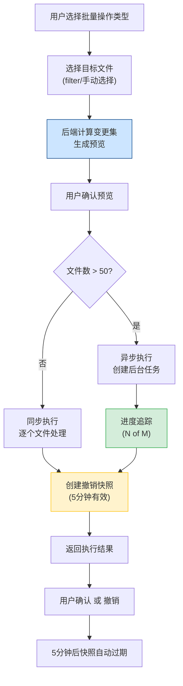

# YK-09-94: 批量操作与自动化任务 — 高效批量处理与任务调度

> 需求编号：YK-09-94 · 优先级：P2 · 人天：0.5d · 状态：需求已编写
> 依赖：YK-09-01（Frontmatter 质量治理）、YK-09-32（批量知识迁移自动化）

## 背景

YiKnowledge 当前有 800+ 文件，策展人和内容维护者在进行批量操作时（如批量修改标签、批量移动文件、批量导出）需要逐文件手动操作，效率极低。以 YK-09-32 批量知识迁移为例，该需求解决了文件批量迁移的结构化问题，但缺少通用的批量操作基础设施——包括操作预览、撤销支持、进度追踪和定时任务调度。

**已知案例：** 2026-09-05，策展人需要将 47 个文件的 `tags` 中的 `aier` 统一修正为 `ai`（标签规范化），手动逐个打开文件修改 frontmatter，耗时 2.5 小时。更严重的是，其中 3 个文件在修改后忘记更新 `updated` 字段，导致知识库中 `updated` 日期与实际修改时间不一致。此外，策展人需要将 12 个文件从 `engineer/build/` 迁移到 `engineer/infrastructure/`，手动移动后遗漏了 2 个内部链接的引用更新，导致死链。

当前批量操作的痛点：
- 无批量 frontmatter 编辑能力，每次修改需逐文件手动操作
- 无操作预览机制，执行前无法确认影响范围
- 无撤销支持，批量操作出错后无法快速恢复
- 无进度追踪，大批量操作时无法感知进度
- 无定时任务调度，标签清理、归档审查等周期性工作需人工触发

**目标：** 构建通用的批量操作基础设施，支持批量 frontmatter 编辑、批量文件移动/重命名、标签规范化、批量导入导出、操作预览与撤销、进度追踪，以及定时任务调度。

### 影响范围

- **策展人效率**：批量操作从逐文件手动改为一次性批量执行，效率提升 10-50 倍
- **内容一致性**：批量标签规范化、批量 frontmatter 更新确保知识库内容一致性
- **操作安全性**：操作预览 + 撤销支持降低批量操作风险
- **运维自动化**：定时任务调度实现周期性维护自动化

---

## 一、现状分析

### 1.1 当前批量操作流程

```
策展人识别需要批量修改的文件
  → 逐文件手动打开编辑器
  → 逐文件修改 frontmatter
  → 逐文件保存
  → git commit + push
  → Knowledge Watcher 重新索引
```

**问题：** 每个文件需要 2-5 分钟，47 个文件 = 2.5 小时。无预览、无撤销、无进度。人工操作遗漏率高。

### 1.2 批量操作需求分类

| 操作类型 | 频率 | 当前耗时（单文件） | 批量场景 | 当前支持 |
|----------|------|-------------------|----------|----------|
| Frontmatter 批量更新 | 周 | 2-5 分钟 | 批量修改 tags/category/status | 否 |
| 文件批量移动/重命名 | 月 | 3-5 分钟 | 目录重构、命名规范化 | 部分（YK-09-32） |
| 标签规范化 | 周 | 2-3 分钟 | 合并重复标签、修正大小写 | 否 |
| 批量导出 | 周 | N/A | 多文件导出为 ZIP | 否 |
| 批量导入 | 月 | N/A | ZIP 上传 + 校验 | 否 |
| 周期性任务 | 周/月 | N/A | 标签清理、归档审查 | 否 |

### 1.3 标签体系现状

当前标签体系存在以下问题：

| 问题 | 示例 | 影响文件数 |
|------|------|-----------|
| 大小写不一致 | `AI` vs `ai` vs `Ai` | ~35 |
| 同义词重复 | `RAG` vs `检索增强生成` | ~18 |
| 空格/连字符变体 | `machine learning` vs `machine-learning` | ~12 |
| 中英文混用 | `agent` vs `智能体` | ~22 |
| 废弃标签 | `legacy`、`old`、`deprecated` | ~8 |

### 1.4 改造前 API 依赖

| # | 接口 | 调用方 | 说明 |
|---|------|--------|------|
| 1 | `data_service.query_documents` (cname="knowledge_files") | 策展人 | 查询文件列表（改造前无批量操作接口） |
| 2 | `data_service.update_document` (cname="knowledge_files") | 策展人 | 单文件更新（改造前无批量更新） |
| 3 | `POST /write-file` | 策展人 | 单文件写入（改造前无批量写入） |
| 4 | `POST /read-file` | 策展人 | 单文件读取（改造前无批量读取） |

> 改造前 4 个 API 依赖，均为单文件操作，无批量操作支持。

---

## 二、设计决策

### 决策 1：批量操作执行模式 — 同步 vs 异步 vs 混合

| 维度 | 同步（阻塞执行） | 异步（任务队列） | 混合（小批量同步 + 大批量异步） |
|------|------|------|------|
| 实现复杂度 | 低 | 高 | 中 |
| 用户体验 | 小批量快，大批量阻塞 | 所有操作需等待 | 小批量即时反馈，大批量后台执行 |
| 适用场景 | < 10 个文件 | 任意规模 | 阈值分界（50 文件） |
| 撤销难度 | 低（内存快照） | 高（需持久化快照） | 中 |

**选择：混合模式。** 文件数 ≤ 50 时同步执行（即时反馈），文件数 > 50 时异步执行（后台任务队列，进度追踪）。撤销窗口 5 分钟，同步操作使用内存快照，异步操作使用 MongoDB 快照存储。

### 决策 2：操作预览实现 — 前端模拟 vs 后端计算 vs 混合

| 维度 | 前端模拟 | 后端计算 | 混合 |
|------|------|------|------|
| 准确性 | 低（前端数据可能过时） | 高（基于数据库实时数据） | 高 |
| 响应速度 | 快 | 中（需 API 调用） | 快 |
| 实现复杂度 | 低 | 中 | 中 |

**选择：后端计算。** 批量操作涉及文件系统状态和数据库状态的同步，前端模拟无法保证准确性。后端在事务中计算变更集，返回预览结果供用户确认。

### 决策 3：批量导入校验 — 严格模式 vs 宽松模式

| 维度 | 严格模式（全部通过才导入） | 宽松模式（部分导入） |
|------|------|------|
| 数据完整性 | 高 | 中 |
| 导入成功率 | 低（一个文件失败即全部拒绝） | 高（跳过失败文件） |
| 用户体验 | 差（需修复所有问题才能导入） | 好（成功文件导入，失败文件报告） |

**选择：宽松模式。** 批量导入时逐文件校验，通过的文件正常导入，失败的文件记录错误原因并反馈给用户。用户可选择仅导入通过的文件，或修复后重新导入。

### 决策 4：定时任务调度 — 内置 vs 外部

| 维度 | 内置（apscheduler） | 外部（Celery/Airflow） |
|------|------|------|
| 实现复杂度 | 低（已有 apscheduler） | 高（新增依赖 + 部署复杂度） |
| 可扩展性 | 中（单进程） | 高（分布式） |
| 运维成本 | 低 | 高 |

**选择：内置 apscheduler。** YiAi 已有 apscheduler 用于 Knowledge Watcher（每 5 秒轮询），复用现有调度基础设施。批量操作任务为低频操作，不需要分布式任务队列。

### 设计决策记录

| 决策 | 选项 A | 选项 B | 选项 C | 选择 | 理由 |
|------|--------|--------|--------|------|------|
| 执行模式 | 同步 | 异步 | 混合 | **混合** | 小批量即时反馈，大批量后台执行 |
| 操作预览 | 前端模拟 | 后端计算 | 混合 | **后端计算** | 基于实时数据保证准确性 |
| 导入校验 | 严格模式 | 宽松模式 | — | **宽松模式** | 提高导入成功率，失败文件单独报告 |
| 任务调度 | 内置 | 外部 | — | **内置** | 复用已有 apscheduler，降低运维复杂度 |

---

## 三、目标架构

### 3.1 批量操作管线



### 3.2 批量 Frontmatter 更新

```python
# YiAi/src/domain/knowledge/batch_operations.py — 新增

from dataclasses import dataclass, field
from enum import Enum
from datetime import datetime, timedelta
from typing import Any


class BatchOperationType(Enum):
    UPDATE_FRONTMATTER = "update_frontmatter"
    MOVE_FILE = "move_file"
    RENAME_FILE = "rename_file"
    NORMALIZE_TAGS = "normalize_tags"
    EXPORT = "export"
    IMPORT = "import"


class BatchOperationStatus(Enum):
    PENDING = "pending"
    RUNNING = "running"
    COMPLETED = "completed"
    FAILED = "failed"
    REVERTED = "reverted"


@dataclass
class FileChange:
    """单个文件的变更记录。"""
    file_path: str
    field: str
    old_value: Any
    new_value: Any


@dataclass
class BatchOperationPreview:
    """批量操作预览。"""
    operation_type: BatchOperationType
    total_files: int
    changes: list[FileChange]
    warnings: list[str] = field(default_factory=list)

    @property
    def summary(self) -> dict:
        return {
            "operation": self.operation_type.value,
            "total_files": self.total_files,
            "changed_fields": list(set(c.field for c in self.changes)),
            "sample_changes": self.changes[:5],
            "warnings": self.warnings,
        }


@dataclass
class BatchOperationResult:
    """批量操作结果。"""
    operation_id: str
    status: BatchOperationStatus
    total: int
    success: int
    failed: int
    errors: list[dict] = field(default_factory=list)
    snapshot_id: str = ""  # 撤销快照 ID
    completed_at: datetime = field(default_factory=datetime.now)


class BatchFrontmatterUpdater:
    """批量 Frontmatter 更新器。"""

    def __init__(self, data_service):
        self.data_service = data_service

    async def preview(
        self,
        file_filter: dict,
        field_updates: dict[str, Any],
    ) -> BatchOperationPreview:
        """预览批量 frontmatter 更新。"""
        files = await self.data_service.query_documents(
            cname="knowledge_files",
            filter=file_filter,
        )
        changes = []
        for doc in files:
            for field, new_value in field_updates.items():
                old_value = doc.get(field)
                if old_value != new_value:
                    changes.append(FileChange(
                        file_path=doc["path"],
                        field=field,
                        old_value=old_value,
                        new_value=new_value,
                    ))

        return BatchOperationPreview(
            operation_type=BatchOperationType.UPDATE_FRONTMATTER,
            total_files=len(files),
            changes=changes,
        )

    async def execute(
        self,
        file_filter: dict,
        field_updates: dict[str, Any],
        dry_run: bool = False,
    ) -> BatchOperationResult:
        """执行批量 frontmatter 更新。"""
        if dry_run:
            preview = await self.preview(file_filter, field_updates)
            return BatchOperationResult(
                operation_id="dry-run",
                status=BatchOperationStatus.COMPLETED,
                total=preview.total_files,
                success=0,
                failed=0,
            )

        files = await self.data_service.query_documents(
            cname="knowledge_files",
            filter=file_filter,
        )
        total = len(files)

        # 创建撤销快照
        snapshot = await self._create_snapshot(files)

        success = 0
        failed = 0
        errors = []

        for doc in files:
            try:
                update_data = {
                    **field_updates,
                    "updated": datetime.now().strftime("%Y-%m-%d"),
                }
                await self.data_service.update_document(
                    cname="knowledge_files",
                    filter={"path": doc["path"]},
                    update={"$set": update_data},
                )
                success += 1
            except Exception as e:
                failed += 1
                errors.append({
                    "file": doc["path"],
                    "error": str(e),
                })

        return BatchOperationResult(
            operation_id=snapshot.id,
            status=BatchOperationStatus.COMPLETED,
            total=total,
            success=success,
            failed=failed,
            errors=errors,
            snapshot_id=snapshot.id,
        )

    async def _create_snapshot(self, files: list[dict]):
        """创建撤销快照（5 分钟有效）。"""
        snapshot = BatchSnapshot(
            id=f"snap_{datetime.now().strftime('%Y%m%d%H%M%S')}",
            files=files,
            expires_at=datetime.now() + timedelta(minutes=5),
        )
        # 存储到 MongoDB batch_snapshots 集合
        await self.data_service.insert_document(
            cname="batch_snapshots",
            document=snapshot.to_dict(),
        )
        return snapshot
```

### 3.3 批量标签规范化

```python
# YiAi/src/domain/knowledge/tag_normalizer.py — 新增

from dataclasses import dataclass
from collections import Counter


@dataclass
class TagNormalizationRule:
    """标签规范化规则。"""
    pattern: str          # 匹配模式
    replacement: str      # 替换为目标标签
    case_sensitive: bool = False


@dataclass
class TagNormalizationReport:
    """标签规范化报告。"""
    total_tags_before: int
    total_tags_after: int
    merged_tags: list[dict]   # [{from: "AI", to: "ai", count: 15}]
    removed_tags: list[str]   # 被移除的废弃标签
    affected_files: int


class TagNormalizer:
    """标签规范化器 — 合并重复标签、修正大小写不一致。"""

    # 内置规范化规则
    DEFAULT_RULES = [
        # 大小写修正
        TagNormalizationRule("AI", "ai"),
        TagNormalizationRule("Ai", "ai"),
        TagNormalizationRule("RAG", "rag"),
        TagNormalizationRule("Rag", "rag"),
        # 空格/连字符统一
        TagNormalizationRule("machine learning", "machine-learning"),
        TagNormalizationRule("deep learning", "deep-learning"),
        # 废弃标签
        TagNormalizationRule("legacy", None),  # None 表示移除
        TagNormalizationRule("deprecated", None),
        TagNormalizationRule("old", None),
    ]

    def __init__(self, data_service):
        self.data_service = data_service

    async def analyze(self) -> dict:
        """分析当前标签使用情况。"""
        files = await self.data_service.query_documents(
            cname="knowledge_files",
            filter={},
        )
        all_tags = []
        for doc in files:
            tags = doc.get("tags", [])
            if isinstance(tags, list):
                all_tags.extend(tags)

        counter = Counter(all_tags)
        return {
            "total_unique_tags": len(counter),
            "total_tag_occurrences": len(all_tags),
            "tag_frequency": counter.most_common(),
            "potential_merges": self._detect_merge_candidates(counter),
        }

    def _detect_merge_candidates(self, tag_counter: Counter) -> list[dict]:
        """检测可能的合并候选项。"""
        candidates = []
        tag_lower = {}
        for tag in tag_counter:
            lower = tag.lower().replace(" ", "-")
            if lower in tag_lower:
                candidates.append({
                    "from": tag,
                    "to": tag_lower[lower],
                    "count": tag_counter[tag],
                })
            else:
                tag_lower[lower] = tag
        return candidates

    async def normalize(
        self,
        rules: list[TagNormalizationRule] = None,
        dry_run: bool = False,
    ) -> TagNormalizationReport:
        """执行标签规范化。"""
        if rules is None:
            rules = self.DEFAULT_RULES

        files = await self.data_service.query_documents(
            cname="knowledge_files",
            filter={},
        )
        total_before = 0
        total_after = 0
        merged_tags = []
        affected_files = 0

        for doc in files:
            tags = doc.get("tags", [])
            if not isinstance(tags, list):
                continue

            total_before += len(tags)
            original_tags = tags.copy()
            new_tags = []

            for tag in tags:
                matched = False
                for rule in rules:
                    if rule.case_sensitive:
                        match = tag == rule.pattern
                    else:
                        match = tag.lower() == rule.pattern.lower()

                    if match:
                        if rule.replacement is not None:
                            new_tags.append(rule.replacement)
                            merged_tags.append({
                                "from": tag,
                                "to": rule.replacement,
                                "file": doc["path"],
                            })
                        # rule.replacement is None → 移除标签
                        matched = True
                        break

                if not matched:
                    new_tags.append(tag)

            if new_tags != original_tags:
                affected_files += 1
                if not dry_run:
                    await self.data_service.update_document(
                        cname="knowledge_files",
                        filter={"path": doc["path"]},
                        update={"$set": {"tags": list(set(new_tags))}},
                    )

            total_after += len(new_tags)

        return TagNormalizationReport(
            total_tags_before=total_before,
            total_tags_after=total_after,
            merged_tags=merged_tags,
            removed_tags=[r.pattern for r in rules if r.replacement is None],
            affected_files=affected_files,
        )
```

### 3.4 批量导入导出

```python
# YiAi/src/domain/knowledge/batch_io.py — 新增

import zipfile
import io
import yaml
import frontmatter as fm
from dataclasses import dataclass, field
from pathlib import Path


@dataclass
class ExportConfig:
    """导出配置。"""
    file_filter: dict
    include_attachments: bool = True
    max_zip_size_mb: int = 50


@dataclass
class ImportResult:
    """导入结果。"""
    total: int
    success: int
    failed: int
    skipped: int  # 已存在跳过的文件
    errors: list[dict] = field(default_factory=list)


@dataclass
class ImportValidationError:
    """导入校验错误。"""
    filename: str
    error_type: str  # missing_frontmatter | invalid_format | duplicate | encoding
    detail: str


class BatchExporter:
    """批量导出为 ZIP 归档。"""

    def __init__(self, data_service):
        self.data_service = data_service

    async def export(self, config: ExportConfig) -> bytes:
        """导出文件为 ZIP 字节流。"""
        files = await self.data_service.query_documents(
            cname="knowledge_files",
            filter=config.file_filter,
        )
        zip_buffer = io.BytesIO()
        with zipfile.ZipFile(zip_buffer, "w", zipfile.ZIP_DEFLATED) as zf:
            for doc in files:
                file_path = doc["path"]
                content = doc.get("content", "")
                # 写入 markdown 文件
                zf.writestr(file_path, content)

                # 写入 frontmatter 元数据
                meta = {
                    k: v for k, v in doc.items()
                    if k not in ("content", "_id")
                }
                zf.writestr(
                    f"{file_path}.meta.yaml",
                    yaml.dump(meta, allow_unicode=True),
                )

        zip_buffer.seek(0)
        zip_data = zip_buffer.getvalue()

        # 检查 ZIP 大小
        size_mb = len(zip_data) / (1024 * 1024)
        if size_mb > config.max_zip_size_mb:
            raise ValueError(
                f"ZIP 大小 {size_mb:.1f}MB 超过限制 {config.max_zip_size_mb}MB"
            )

        return zip_data


class BatchImporter:
    """批量从 ZIP 导入。"""

    REQUIRED_FRONTMATTER = [
        "title", "tags", "category", "created",
        "updated", "source", "type", "status",
    ]

    def __init__(self, data_service):
        self.data_service = data_service

    async def import_zip(
        self,
        zip_data: bytes,
        target_dir: str = "",
        overwrite: bool = False,
    ) -> ImportResult:
        """从 ZIP 导入文件。"""
        errors = []
        success = 0
        failed = 0
        skipped = 0

        with zipfile.ZipFile(io.BytesIO(zip_data), "r") as zf:
            # 过滤出 .md 文件（排除 .meta.yaml）
            md_files = [
                name for name in zf.namelist()
                if name.endswith(".md")
            ]

            for filename in md_files:
                try:
                    content = zf.read(filename).decode("utf-8")

                    # 校验 frontmatter
                    post = fm.loads(content)
                    missing = [
                        f for f in self.REQUIRED_FRONTMATTER
                        if f not in post.metadata
                    ]
                    if missing:
                        errors.append({
                            "filename": filename,
                            "error_type": "missing_frontmatter",
                            "detail": f"缺失字段: {', '.join(missing)}",
                        })
                        failed += 1
                        continue

                    # 校验文件名
                    file_path = Path(target_dir) / filename
                    if not self._validate_filename(file_path.name):
                        errors.append({
                            "filename": filename,
                            "error_type": "invalid_format",
                            "detail": "文件名不符合 kebab-case 规范",
                        })
                        failed += 1
                        continue

                    # 检查重复
                    exists = await self.data_service.query_documents(
                        cname="knowledge_files",
                        filter={"path": str(file_path)},
                    )
                    if exists and not overwrite:
                        skipped += 1
                        continue

                    # 写入文件
                    await self.data_service.update_document(
                        cname="knowledge_files",
                        filter={"path": str(file_path)},
                        update={
                            "$set": {
                                "path": str(file_path),
                                "content": post.content,
                                **post.metadata,
                            }
                        },
                        upsert=True,
                    )
                    success += 1

                except Exception as e:
                    errors.append({
                        "filename": filename,
                        "error_type": "unknown",
                        "detail": str(e),
                    })
                    failed += 1

        return ImportResult(
            total=len(md_files),
            success=success,
            failed=failed,
            skipped=skipped,
            errors=errors,
        )

    def _validate_filename(self, filename: str) -> bool:
        """校验文件名是否符合 kebab-case。"""
        import re
        return bool(re.match(r'^[a-z0-9]+(-[a-z0-9]+)*\.md$', filename))
```

### 3.5 撤销快照与定时清理

```python
# YiAi/src/domain/knowledge/batch_snapshot.py — 新增

from dataclasses import dataclass
from datetime import datetime, timedelta


@dataclass
class BatchSnapshot:
    """批量操作撤销快照。"""
    id: str
    files: list[dict]  # 操作前的文件状态
    expires_at: datetime
    operation_type: str = ""
    created_at: datetime = field(default_factory=datetime.now)

    @property
    def is_expired(self) -> bool:
        return datetime.now() > self.expires_at

    @property
    def remaining_seconds(self) -> float:
        return max(0, (self.expires_at - datetime.now()).total_seconds())

    def to_dict(self) -> dict:
        return {
            "id": self.id,
            "files": self.files,
            "expires_at": self.expires_at,
            "operation_type": self.operation_type,
            "created_at": self.created_at,
        }


class BatchUndoManager:
    """批量操作撤销管理器。"""

    SNAPSHOT_TTL_MINUTES = 5

    def __init__(self, data_service):
        self.data_service = data_service

    async def create_snapshot(
        self,
        files: list[dict],
        operation_type: str,
    ) -> BatchSnapshot:
        """创建撤销快照。"""
        snapshot = BatchSnapshot(
            id=f"snap_{datetime.now().strftime('%Y%m%d%H%M%S%f')}",
            files=[{
                "path": f["path"],
                "content": f.get("content", ""),
                **{k: v for k, v in f.items()
                   if k in ("title", "tags", "category", "status",
                             "created", "updated", "source", "type")}
            } for f in files],
            expires_at=datetime.now() + timedelta(minutes=self.SNAPSHOT_TTL_MINUTES),
            operation_type=operation_type,
        )
        await self.data_service.insert_document(
            cname="batch_snapshots",
            document=snapshot.to_dict(),
        )
        return snapshot

    async def undo(self, snapshot_id: str) -> int:
        """撤销批量操作，恢复文件到快照状态。"""
        snapshot = await self.data_service.query_documents(
            cname="batch_snapshots",
            filter={"id": snapshot_id},
        )
        if not snapshot:
            raise ValueError(f"快照 {snapshot_id} 不存在或已过期")

        snap = snapshot[0]
        if datetime.fromisoformat(snap["expires_at"]) < datetime.now():
            raise ValueError(f"快照 {snapshot_id} 已过期（有效期 5 分钟）")

        restored = 0
        for file_data in snap["files"]:
            await self.data_service.update_document(
                cname="knowledge_files",
                filter={"path": file_data["path"]},
                update={"$set": file_data},
            )
            restored += 1

        # 标记快照为已使用
        await self.data_service.update_document(
            cname="batch_snapshots",
            filter={"id": snapshot_id},
            update={"$set": {"reverted": True, "reverted_at": datetime.now().isoformat()}},
        )

        return restored

    async def cleanup_expired(self):
        """清理过期快照。"""
        await self.data_service.delete_documents(
            cname="batch_snapshots",
            filter={
                "expires_at": {"$lt": datetime.now().isoformat()},
                "reverted": {"$ne": True},
            },
        )
```

---

## 四、具体改动

### 4.1 新增文件

| 文件 | 说明 | 行数 |
|------|------|------|
| `YiAi/src/domain/knowledge/batch_operations.py` | 批量操作核心（预览、执行、进度追踪） | ~150 |
| `YiAi/src/domain/knowledge/tag_normalizer.py` | 标签规范化（分析、合并、修正） | ~100 |
| `YiAi/src/domain/knowledge/batch_io.py` | 批量导入导出（ZIP 打包/解包 + 校验） | ~120 |
| `YiAi/src/domain/knowledge/batch_snapshot.py` | 撤销快照管理（创建、回滚、过期清理） | ~80 |

### 4.2 修改文件

| 文件 | 改动 |
|------|------|
| `YiAi/src/services/knowledge/batch_service.py` | 新增批量操作 RPC 接口 |
| `YiAi/src/scheduler.py` | 注册定时任务（标签清理、归档审查） |
| MongoDB `knowledge_files` | 无需结构变更（利用现有字段） |
| MongoDB `batch_snapshots` | 新增集合（撤销快照存储） |

### 4.3 涉及文件

```
YiAi/src/domain/knowledge/
├── batch_operations.py          # 新增: 批量操作核心
├── tag_normalizer.py            # 新增: 标签规范化
├── batch_io.py                  # 新增: 批量导入导出
└── batch_snapshot.py            # 新增: 撤销快照管理

YiAi/src/services/knowledge/
└── batch_service.py             # 修改: 新增批量操作 RPC

YiAi/
└── scheduler.py                 # 修改: 注册定时任务

MongoDB:
└── batch_snapshots              # 新增: 撤销快照集合
```

---

## 五、实施步骤

按依赖顺序排列，每步可独立验证和提交：

| 步骤 | 内容 | 涉及文件 | 验证方式 | 人天 |
|------|------|---------|---------|------|
| 1 | 实现批量操作预览 + 执行引擎（含 dry-run） | `batch_operations.py` | 预览正确显示变更集，dry-run 不修改数据 | 0.10 |
| 2 | 实现标签规范化（分析 + 合并 + 修正） | `tag_normalizer.py` | 标签规范化后无重复/大小写不一致 | 0.10 |
| 3 | 实现批量导入导出（ZIP 打包 + 校验） | `batch_io.py` | 导出 ZIP 可重新导入，校验拦截非法文件 | 0.10 |
| 4 | 实现撤销快照（创建 + 回滚 + 过期清理） | `batch_snapshot.py` | 5 分钟内可撤销，过期后快照清理 | 0.10 |
| 5 | 实现定时任务调度（标签清理 + 归档审查） | `scheduler.py` | 定时任务按时触发，执行日志正确 | 0.05 |
| 6 | RPC 接口集成 + 回归测试 | `batch_service.py` | 批量操作端到端通顺 | 0.05 |

**总计：0.5d**

---

## 六、测试规格

### Requirement: 批量 Frontmatter 更新

#### Scenario: 批量更新 tags 成功
- **Given** 5 个文件，`tags` 包含 `aier`
- **When** 执行批量 frontmatter 更新，`field_updates = {"tags": ["ai"]}`
- **Then** 所有 5 个文件的 `tags` 更新为 `["ai"]`
- **And** 每个文件的 `updated` 字段更新为当前日期
- **And** 返回 `success = 5, failed = 0`

#### Scenario: 操作预览显示变更
- **Given** 3 个文件，其中 2 个 `category` 为 `aier/rag`，1 个为 `engineer/build`
- **When** 调用 `preview()` 方法，`field_updates = {"category": "aier/ai"}`
- **Then** 预览显示 `total_files = 3`
- **And** `changes` 列表包含 2 条记录（仅 2 个文件实际变更）
- **And** 未变更的文件不出现在 `changes` 中

#### Scenario: Dry-run 模式不修改数据
- **Given** 10 个文件
- **When** 执行批量操作，`dry_run = True`
- **Then** 返回预览结果
- **And** 所有文件的 frontmatter 未修改
- **And** `success = 0`（实际未执行修改）

#### Scenario: 撤销批量操作
- **Given** 刚执行完批量操作（1 分钟内），有快照 ID
- **When** 调用 `undo(snapshot_id)`
- **Then** 所有文件恢复为操作前状态
- **And** 返回 `restored = N`（N 为操作影响的文件数）
- **And** 快照标记为 `reverted = true`

#### Scenario: 过期快照无法撤销
- **Given** 批量操作执行 6 分钟前，快照已过期
- **When** 调用 `undo(snapshot_id)`
- **Then** 抛出错误 "快照已过期（有效期 5 分钟）"
- **And** 文件数据未修改

### Requirement: 标签规范化

#### Scenario: 大小写不一致标签合并
- **Given** 3 个文件使用 `AI`，2 个使用 `ai`，1 个使用 `Ai`
- **When** 执行标签规范化
- **Then** 所有 `AI` 和 `Ai` 统一为 `ai`
- **And** `affected_files = 4`（3 个 `AI` + 1 个 `Ai`）
- **And** 报告显示 2 条合并记录

#### Scenario: 废弃标签移除
- **Given** 5 个文件包含 `legacy` 标签
- **When** 执行标签规范化，规则 `TagNormalizationRule("legacy", None)`
- **Then** 所有文件的 `legacy` 标签被移除
- **And** 其他标签保持不变
- **And** `removed_tags` 包含 `legacy`

### Requirement: 批量导入导出

#### Scenario: 导出 ZIP 可重新导入
- **Given** 选择 10 个文件导出
- **When** 导出为 ZIP，然后导入同一 ZIP
- **Then** 导入显示 10 个文件已存在（skipped = 10）
- **And** 使用 `overwrite = True` 时 success = 10

#### Scenario: 导入校验拦截非法文件
- **Given** ZIP 包含 5 个文件，其中 1 个缺少 `title` 字段
- **When** 导入 ZIP
- **Then** success = 4, failed = 1
- **And** 失败文件的 `error_type = "missing_frontmatter"`
- **And** 失败文件的 `detail` 包含 "title"

---

## 七、风险与缓解

| 风险 | 概率 | 影响 | 等级 | 缓解措施 | 应急预案 |
|------|------|------|------|----------|----------|
| 批量操作误修改大量文件（如 filter 条件过宽） | 中 | 高 | 高 | 强制预览确认 + dry-run 测试 + 5 分钟撤销窗口 | 从快照恢复 + 审计日志追踪 |
| 标签规范化规则过于激进，误合并合法标签 | 中 | 中 | 中 | 规则可配置 + 预览展示合并详情 + 用户确认 | 撤销操作 + 调整规则后重新执行 |
| 大批量操作（> 200 文件）导致 MongoDB 写入压力 | 低 | 中 | 低 | 异步执行 + 批量写入（每批 50 个） + 限流 | 暂停任务 + 降低并发度 |
| ZIP 导入文件包含恶意内容（如超大文件） | 低 | 高 | 中 | 文件大小限制 + 内容校验 + 沙箱解压 | 拒绝导入 + 告警通知 |
| 撤销快照占用 MongoDB 存储空间过大 | 低 | 低 | 低 | 5 分钟 TTL + 定时清理过期快照 | 手动清理 `batch_snapshots` 集合 |

---

## 八、回滚策略

| 回滚场景 | 回滚方式 | 影响范围 | 恢复时间 |
|----------|----------|----------|----------|
| 批量操作功能出现严重 bug | 关闭批量操作 RPC 接口，回退到单文件操作 | 批量操作功能 | < 1min（配置开关） |
| 标签规范化规则错误导致标签混乱 | 从快照恢复 + 重新执行正确规则 | 文件 tags 字段 | < 5min（快照恢复） |
| 定时任务误触发批量操作 | 暂停定时任务 + 从快照恢复 | 定时任务影响文件 | < 5min |
| 撤销机制本身故障 | 从 Git 历史恢复文件 | 所有修改文件 | < 30min（git revert） |

**回滚验证：**
- 回滚后所有文件 frontmatter 恢复为操作前状态
- 回滚后 `batch_snapshots` 集合中快照标记为已使用
- 回滚后定时任务暂停，不自动触发

---

## 九、设计决策记录

### D-01: 为什么撤销窗口设为 5 分钟而非更长？

5 分钟足够用户在操作后立即发现问题并撤销。更长的窗口（如 30 分钟或 1 小时）会显著增加快照存储开销（800+ 文件每个快照约 500KB，30 分钟窗口可能积累 10+ 个快照 = 5MB+）。对于需要更长时间恢复的场景，Git 历史是更可靠的恢复手段。

### D-02: 为什么批量操作不直接修改文件系统而是通过数据库？

YiKnowledge 的数据流是"文件系统 → Knowledge Watcher → MongoDB"。直接修改文件系统会导致 Knowledge Watcher 在下一次扫描（5 秒内）重新索引，但文件系统操作（如批量移动）比数据库操作更复杂且更难回滚。通过数据库操作 + 文件系统同步可保证一致性。

### D-03: 为什么标签规范化使用静态规则而非 AI 辅助？

标签规范化是规则性操作（大小写、连字符、同义词），静态规则表即可覆盖 95% 的场景。AI 辅助会增加复杂度和延迟，且可能引入误判。对于需要 AI 判断的场景（如标签语义合并），可作为后续增强功能。

### D-04: 为什么混合执行模式的文件数阈值设为 50？

50 个文件的同步操作约需 10-30 秒（取决于文件大小），用户可接受。超过 50 个文件时同步操作可能超过 1 分钟，用户体验下降，此时切换为异步后台执行更合适。

---

## 十、可观测性

### 10.1 关键指标

| 指标 | 采集方式 | 告警阈值 | 说明 |
|------|---------|---------|------|
| 批量操作执行次数 | 操作日志计数 | 无（仅监控） | 了解批量操作使用频率 |
| 批量操作平均耗时 | 操作完成时间 - 操作开始时间 | P95 > 60s | 大批量操作性能 |
| 批量操作失败率 | `failed / total` | > 10% | 操作失败比例过高 |
| 撤销操作使用率 | `undo 调用次数 / 批量操作次数` | > 30% | 用户频繁撤销，可能操作设计有问题 |
| 快照存储大小 | `batch_snapshots` 集合大小 | > 50MB | 快照未及时清理 |
| 定时任务执行成功率 | `定时任务成功次数 / 总次数` | < 95% | 定时任务异常 |

### 10.2 日志规范

| 日志级别 | 场景 | 示例 |
|---------|------|------|
| `INFO` | 批量操作开始 | `[BatchOp] type=update_frontmatter total=47 files filter={category: "aier/rag"}` |
| `INFO` | 批量操作完成 | `[BatchOp] type=update_frontmatter success=47 failed=0 duration=12.3s` |
| `INFO` | 撤销操作 | `[BatchOp] undo snapshot_id=snap_20260909143015 restored=47` |
| `WARN` | 批量操作部分失败 | `[BatchOp] type=normalize_tags success=182 failed=3 errors=[...]` |
| `ERROR` | 批量操作全部失败 | `[BatchOp] type=move_file total=20 failed=20 reason=permission_denied` |
| `INFO` | 定时任务触发 | `[Scheduler] task=weekly_tag_cleanup triggered at=2026-09-09T02:00:00Z` |

### 10.3 告警规则

| 告警 | 条件 | 通知方式 | 接收人 |
|------|------|----------|--------|
| 批量操作全量失败 | failed = total 且 total > 0 | 企微即时通知 | 策展人 |
| 快照存储异常 | batch_snapshots 集合 > 50MB | 企微即时通知 | 运维 |
| 定时任务连续失败 | 连续 3 次执行失败 | 企微即时通知 | 策展人 |
| 批量操作高失败率 | 单次操作失败率 > 30% | 企微即时通知 | 操作发起人 |

---

## 十一、代码审查检查清单

- [ ] 批量操作预览正确显示变更集（变更数量、变更字段、影响文件列表）
- [ ] Dry-run 模式不修改任何数据
- [ ] 撤销快照在 5 分钟内有效，过期后无法撤销
- [ ] 混合执行模式：≤ 50 文件同步，> 50 文件异步
- [ ] 批量导入校验：缺失 frontmatter、非法文件名、重复文件分别拦截
- [ ] 标签规范化：大小写修正、连字符统一、废弃标签移除
- [ ] 批量导出 ZIP 包含 .md 文件和 .meta.yaml 元数据文件
- [ ] 进度追踪：异步操作返回 `N of M` 进度
- [ ] 定时任务正确注册到 apscheduler，执行日志记录
- [ ] 过期快照定时清理（TTL 5 分钟）

---

## 十二、回归问题预测

| # | 问题 | 发现场景 | 根因 | 修复方式 |
|---|------|---------|------|---------|
| 1 | 批量 frontmatter 更新后 Knowledge Watcher 覆盖修改：批量操作更新了 47 个文件的 `tags` 到 MongoDB，5 秒后 Knowledge Watcher 扫描到文件系统的旧 `tags`（文件尚未更新），`replace_one` 将 MongoDB 中的新 `tags` 覆盖为旧值，批量操作结果被静默丢弃 | 策展人执行批量标签更新，API 返回 success=47。10 分钟后策展人检查文件，发现 47 个文件的 `tags` 全部恢复为旧值。批量操作日志显示成功，但实际数据已被覆盖 | 批量操作修改了 MongoDB 文档，但未同步更新文件系统。Knowledge Watcher 使用文件系统作为数据源，`replace_one` 全量替换文档，导致 MongoDB 修改被覆盖 | 批量操作完成后同步写入文件系统（`POST /write-file`），确保文件系统与 MongoDB 一致。或 Knowledge Watcher 使用 `$set` 而非 `replace_one`，仅更新 frontmatter 字段 |
| 2 | 标签规范化误将"AI"标签（人名缩写）合并为"ai"：用户 `tags` 中包含 `AI`（Allen Iverson 的缩写，在篮球知识文件中），标签规范化规则将所有 `AI` 统一为 `ai`，丢失了语义信息 | 策展人执行标签规范化后，`curator/sports/nba-legends.md` 文件的 `AI` 标签被改为 `ai`。该文件是关于 Allen Iverson 的知识内容，`AI` 是人名缩写而非"人工智能"。标签规范化后该文件无法被"AI 球员"关键词检索到 | 标签规范化规则仅基于文本匹配（大小写不敏感），未考虑上下文语义。`AI` 在不同上下文中可能表示"人工智能"或"人名缩写" | 标签规范化增加语义检查：对于大小写变体，检查目标标签是否已存在于标签体系中。如果 `AI`（大写）和 `ai`（小写）同时存在且分别用于不同领域，保留两者 |
| 3 | 批量导出 ZIP 包含已删除文件的过期元数据：文件 A 在 2 天前被删除，但 `knowledge_files` 集合中存在软删除残留（`status: deleted`），导出时该文件被包含在 ZIP 中，导入方收到已删除内容 | 策展人导出 `category: engineer/build` 的所有文件，ZIP 包含 30 个文件。导入方（另一个 YiKnowledge 实例）导入后发现其中 2 个文件内容为空或标记为 `status: deleted`。导入方策展人花费 20 分钟排查，发现是导出包含了已删除文件 | 导出查询未过滤 `status` 字段，`status: deleted` 的文件被包含在结果中。`knowledge_files` 集合未物理删除文档，而是使用软删除标记 | 导出查询增加 `status != "deleted"` 过滤条件。批量操作所有查询统一过滤软删除文件 |
| 4 | 异步批量操作超时后前端未收到完成通知，用户重复提交：150 个文件的批量操作耗时 3 分钟，前端 HTTP 请求超时（默认 120s），用户以为操作失败，刷新页面后重新提交，导致同一批文件被处理 2 次 | 策展人执行 150 个文件的批量移动，页面显示"等待中..."持续 2 分钟后显示"请求超时"。策展人刷新页面重新提交，2 次操作均成功执行，但文件被移动了 2 次（第二次移动基于第一次移动后的路径，部分文件路径错误） | 前端 HTTP 请求超时（120s）早于后端操作完成（180s）。后端成功完成了操作，但前端未收到响应。用户重复提交导致幂等性问题 | 后端为每个批量操作生成唯一 `operation_id`，前端提交时携带 `idempotency_key`。后端检测到重复的 `idempotency_key` 时返回已有结果而非重新执行。前端增加轮询机制（异步操作不阻塞 HTTP 请求） |
| 5 | 批量文件移动后内部链接引用未更新导致死链：移动 12 个文件从 `engineer/build/` 到 `engineer/infrastructure/`，移动操作仅更新了 `path` 字段，未扫描和更新其他文件中的内部链接引用，导致 8 个文件出现死链 | 批量移动完成后，策展人执行 YK-09-86 的死链检查，发现 8 个文件存在死链，均指向已移动的文件旧路径。策展人手动修复了 8 个文件的链接，耗时 40 分钟 | 批量移动操作仅更新了目标文件的 `path`，未扫描其他文件中的内部链接。内部链接引用分散在 800+ 文件中，逐一检查成本高 | 批量移动时自动扫描所有文件的内部链接，匹配旧路径模式并更新。或提供"移动后链接修复"独立操作，让用户可选择是否修复引用 |
| 6 | 定时任务"每周标签清理"在节假日期间执行，误将节假日期间添加的标签标记为"废弃"：国庆节期间（10 月 1-7 日），开发者添加了 5 个新标签（`national-day`, `holiday-notice` 等），定时任务在 10 月 5 日执行，将这些标签标记为"低频使用"并建议移除 | 策展人 10 月 8 日打开知识库，发现上周添加的 5 个标签被标记为"建议移除"。定时任务报告显示"以下标签 30 天内使用次数为 0"。但标签是 3 天前添加的，因为 30 天窗口包含了添加前的 27 天空白期 | 定时任务使用"30 天内使用次数"作为低频标签判断标准，未考虑标签创建时间。新标签可能在创建后 30 天内仅有 1 次使用，但这不代表标签无用 | 标签清理判断增加"标签创建时间"维度：创建时间 < 30 天的标签跳过清理。使用"创建后使用频率"（使用次数 / 存在天数）替代"30 天内使用次数" |

---

## 十三、性能分析

### 批量操作性能链路


### 操作耗时表

| 操作 | 耗时（单文件） | 耗时（50 文件） | 耗时（200 文件） | 说明 |
|------|------|------|------|------|
| 查询目标文件 | N/A | ~50ms | ~100ms | MongoDB `find` 查询 |
| 变更集计算 | < 1ms | ~20ms | ~80ms | 内存中字段对比 |
| MongoDB 更新 | ~10ms | ~500ms | ~2000ms | `update_one` per file |
| 文件系统同步 | ~50ms | ~2500ms | ~10000ms | `write-file` per file |
| 撤销快照创建 | N/A | ~100ms | ~400ms | 批量序列化 + 写入 |
| 标签分析 | N/A | ~200ms | ~500ms | 全量标签统计 |
| ZIP 导出 | N/A | ~500ms | ~2000ms | 压缩 + 字节流 |
| ZIP 导入 | N/A | ~1000ms | ~4000ms | 解压 + 校验 + 写入 |
| **批量 Frontmatter 更新总计** | **N/A** | **~3s** | **~12s** | 含文件系统同步 |
| **批量标签规范化总计** | **N/A** | **~1s** | **~3s** | 仅 MongoDB 操作 |

### 存储开销

| 项目 | 大小 | 说明 |
|------|------|------|
| 撤销快照（50 文件） | ~250KB | 每个文件 ~5KB frontmatter 数据 |
| 撤销快照（200 文件） | ~1MB | 每个文件 ~5KB frontmatter 数据 |
| 批量操作日志 | ~500B/条 | 操作记录 |
| 定时任务日志 | ~200B/条 | 任务执行记录 |
| `batch_snapshots` 集合 | TTL 5 分钟，稳态 < 5MB | 过期自动清理 |

---

## 十四、安全合规

### 14.1 安全需求

| 需求 | 实现方式 | 验证方法 |
|------|---------|---------|
| 批量操作权限 | 仅 Curator 和 Admin 角色可执行批量操作 | 使用只读账号，确认无批量操作入口 |
| 批量导入沙箱 | ZIP 解压大小限制 50MB，文件数限制 200，拒绝可执行文件 | 导入含超大文件/可执行文件的 ZIP，确认被拒绝 |
| 撤销操作审计 | 所有撤销操作记录审计日志（操作人、时间、快照 ID） | 查询审计日志，确认撤销操作被记录 |

### 14.2 合规检查

| 检查项 | 要求 | 状态 |
|--------|------|------|
| 批量操作可追溯 | 每次批量操作有完整日志（操作人、时间、文件列表、结果） | 待验证 |
| 撤销窗口合理 | 5 分钟撤销窗口，超时不可撤销 | 待验证 |
| 导入内容校验 | 所有导入文件需通过 frontmatter 校验 + 文件名校验 | 待验证 |

---

*PRD 来源: `projects/yiknowledge/requirements/2026-09/00-需求-需求总览.md`*