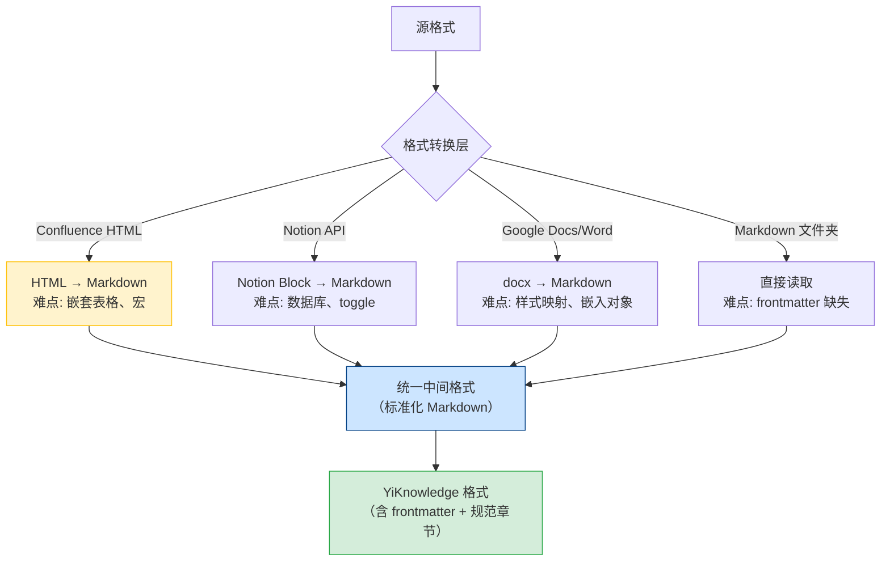
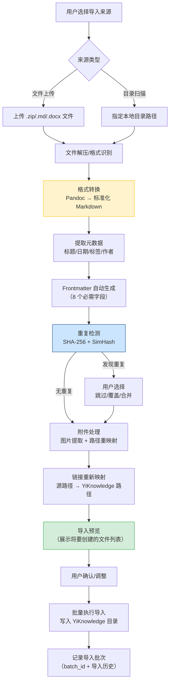
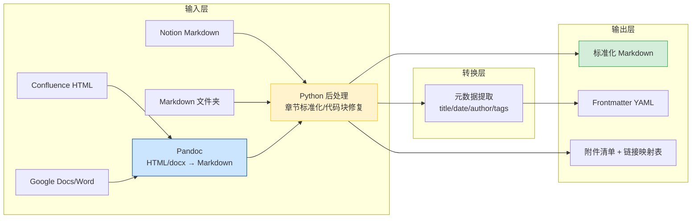

# YK-09-98: 内容迁移与导入工具 — 多源内容批量导入与格式转换引擎

> 需求编号：YK-09-98 · 优先级：P2 · 人天：0.5d · 状态：需求已编写
> 依赖：YK-09-92（文档模板库与自动化）、YK-09-01（Frontmatter 质量治理）、YK-09-32（批量知识迁移自动化）

## 背景

YiKnowledge 作为团队核心知识库，需要从多种外部来源导入存量内容。当前团队的知识分散在 Confluence、Notion、Google Docs、本地 Markdown 文件夹、Word 文档等多个平台中，缺乏统一的导入工具，导致以下问题：

- **手动迁移成本高**：开发者需要逐篇复制粘贴、重新排版、手动编写 frontmatter，一篇中等长度文档（2000 字）的迁移耗时约 20-30 分钟
- **格式保真度差**：从 Confluence 或 Word 导出后，表格、代码块、图片引用经常丢失或格式错乱，需要逐一手动修复
- **重复导入风险**：同一篇文档可能被多次导入（不同时间、不同来源），知识库中出现内容重复或近似的文档
- **附件断裂**：源文档中引用的图片、文件在导入后链接失效，需要手动查找并重新上传
- **内部链接丢失**：Confluence 和 Notion 中的内部页面链接在导出后变成死链，导入后无法映射到 YiKnowledge 路径
- **无回滚能力**：批量导入后如果发现质量问题，无法一键撤销整个导入批次，需要逐篇手动删除

**已知案例：** 2026-08-20 团队从 Confluence 迁移 15 篇技术文档，耗时 3 天（2 人日），其中 3 篇文档的代码块丢失格式，2 篇文档的图片引用失效，1 篇文档被重复导入 2 次。2026-09-02 从 Notion 导入 8 篇项目文档，内部链接全部失效，需要手动重建交叉引用关系。

**目标：** 构建多源内容批量导入工具，支持 5 种常见来源格式的自动转换、frontmatter 自动生成、重复检测、附件处理和链接重新映射，将单篇文档迁移时间从 20-30 分钟降低到 1-2 分钟。

### 影响范围

| 影响维度 | 当前状态 | 目标状态 | 量化指标 |
|----------|----------|----------|----------|
| 单篇文档迁移耗时 | 20-30 分钟/篇（手动复制+排版+frontmatter） | 1-2 分钟/篇（自动转换+预览确认） | 减少 90% |
| 格式保真度 | 60%（表格/代码块/图片常丢失） | 95%（核心格式元素保留） | 提升 35% |
| 附件完整性 | 50%（图片引用常失效） | 90%（自动提取+路径重映射） | 提升 40% |
| 重复导入率 | 15%（无检测机制） | 0%（哈希检测自动拦截） | 消除 |
| 导入回滚能力 | 无（手动逐篇删除） | 一键撤销整个批次 | 从零到一 |

### 核心挑战

| 挑战 | 说明 | 难度 |
|------|------|------|
| 格式转换保真度 | Confluence 存储格式（富文本/HTML）→ Markdown 转换时，嵌套表格、宏、自定义组件难以完美映射 | 高 |
| 链接重新映射 | 源文档内部链接（如 `/pages/viewpage.action?pageId=12345`）无法直接映射到 YiKnowledge 文件路径，需建立源路径→目标路径的映射表 | 中 |
| 重复检测准确度 | 内容哈希精确匹配可检测完全相同的文档，但无法检测"同一篇文档被修改了 5% 内容"的情况，需要 SimHash 或相似度算法 | 中 |
| 附件处理 | 源文档中的图片可能是内嵌（base64）或外部引用（URL），需区分解压到本地 vs 保留远程引用 | 中 |
| 批量导入性能 | 一次导入 100+ 篇文档时，格式转换、frontmatter 生成、重复检测的总耗时可能超过 5 分钟，需异步处理 | 低 |

---

## 一、现状分析

### 1.1 当前内容迁移流程

```
开发者找到源文档
  → 手动复制内容（Confluence/Notion/Word/Google Docs）
  → 粘贴到编辑器
  → 手动修复格式问题（表格对齐、代码块缩进、图片引用）
  → 手动编写 frontmatter（8 个字段）
  → 手动调整章节结构以符合 YiKnowledge 规范
  → 手动处理附件（下载图片 → 放到正确目录 → 更新引用路径）
  → 手动检查内部链接（找到目标页面 → 替换为 YiKnowledge 路径）
  → 提交前运行 pre-commit 检查
  → 修复 frontmatter/格式问题
  → 提交
```

**问题：** 步骤 2-7 完全依赖人工操作，一篇 2000 字的文档迁移耗时 20-30 分钟，其中 60% 的时间花在格式修复和 frontmatter 编写上。批量迁移 50 篇文档需要 2-3 人日。

### 1.2 存量内容分布估算

| 来源平台 | 存量文档数 | 格式 | 迁移难度 | 关键挑战 |
|----------|------------|------|----------|----------|
| Confluence | ~50 篇 | 富文本/HTML | 高 | 表格嵌套、宏、内部链接 |
| Notion | ~30 篇 | Notion API/Markdown | 中 | 数据库视图、嵌套块 |
| Google Docs | ~20 篇 | docx/HTML | 中 | 评论、建议修订 |
| 本地 Markdown 文件夹 | ~40 篇 | .md | 低 | 目录结构不一致 |
| Word 文档 (.docx) | ~15 篇 | docx | 中 | 样式映射、嵌入对象 |
| 其他（飞书、语雀等） | ~10 篇 | 各异 | 高 | 无标准导出格式 |

**结论：** 约 165 篇存量文档分散在 6 个平台中，手动迁移总计需要 10-15 人日。Confluence（50 篇）和本地 Markdown（40 篇）是最大的两个来源。

### 1.3 格式转换难点分析



### 1.4 改造前相关接口

| # | 接口 | 调用方 | 说明 |
|---|------|--------|------|
| 1 | `/write-file` | 开发者 | 手动写入迁移后的文档（改造前无批量导入 API） |
| 2 | `/read-file` | 开发者 | 读取源文件内容（改造前无格式转换能力） |
| 3 | `data_service.query_documents` (cname="knowledge_files") | 开发者 | 检查是否已存在同名文档（改造前无重复检测） |

> 改造前无任何内容导入相关 API，开发者完全依赖手动复制粘贴完成迁移。

---

## 二、设计决策

### 决策 1：格式转换引擎 — Pandoc vs Python 库组合 vs 外部服务

| 维度 | Pandoc（命令行） | Python 库组合（python-docx + markdownify + ...） | 外部服务（如 CloudConvert API） |
|------|------|------|------|
| 格式支持广度 | 极广（40+ 格式） | 中（依赖各库能力） | 广（取决于服务商） |
| 转换质量 | 高（业界标准） | 中（各库质量不一） | 高（专业服务） |
| 部署复杂度 | 低（系统安装 pandoc） | 低（pip install） | 中（API Key 配置） |
| 可控性 | 中（命令行参数） | 高（代码级控制） | 低（依赖外部服务） |
| 离线可用 | 是 | 是 | 否 |
| 性能 | 高（C 实现） | 中（Python） | 取决于网络 |

**选择：Pandoc + Python 后处理。** Pandoc 作为基础转换引擎处理 HTML/docx/Markdown 之间的转换，Python 后处理层负责 YiKnowledge 特定格式调整（frontmatter 注入、章节规范化、链接重新映射）。Pandoc 是业界标准，格式支持最广，转换质量最高。

### 决策 2：导入方式 — 文件上传 vs 目录扫描 vs API 拉取

| 维度 | 文件上传（用户上传 .zip/.md/.docx） | 目录扫描（指定本地目录） | API 拉取（Confluence/Notion API） |
|------|------|------|------|
| 适用场景 | 离线导出后的文件 | 本地 Markdown 文件夹 | 在线平台直接导入 |
| 用户操作 | 导出 → 上传 | 指定目录路径 | 配置 API Token |
| 实现复杂度 | 低 | 低 | 高（需对接第三方 API） |
| 实时性 | 低（需手动导出） | 高（直接读取） | 高（直接拉取） |

**选择：文件上传 + 目录扫描双模式，API 拉取作为后续迭代。** 文件上传模式覆盖已导出的 Confluence/Notion/Google Docs 内容，目录扫描模式覆盖本地 Markdown 文件夹。API 拉取因需要对接第三方认证和 API 变化，作为后续迭代。

### 决策 3：重复检测 — 精确哈希 vs SimHash vs 语义相似度

| 维度 | 精确哈希（SHA-256） | SimHash（局部敏感哈希） | 语义相似度（Embedding 余弦） |
|------|------|------|------|
| 检测粒度 | 完全相同 | 少量修改（> 90% 相似） | 语义相似（改写） |
| 实现复杂度 | 极低 | 低 | 高（需 Embedding 模型） |
| 计算开销 | 极低 | 低 | 高（向量化） |
| 误报率 | 0%（精确匹配） | 低（可调阈值） | 中（语义相似不等于内容重复） |

**选择：内容哈希（SHA-256）+ SimHash 双模式。** 内容哈希用于精确匹配快速拦截，SimHash 用于检测相似度 > 90% 的近似重复。语义相似度检测性能开销大，且误报率较高，作为后续迭代。

### 决策 4：导入回滚方式 — 文件系统快照 vs Git reset vs 批次标记

| 维度 | 文件系统快照（备份原始目录） | Git reset（git checkout 导入前 commit） | 批次标记（标记文档 batch_id，批量删除） |
|------|------|------|------|
| 回滚粒度 | 整个目录 | 整个仓库 | 单个批次 |
| 副作用 | 丢失导入期间其他正常修改 | 丢失导入期间所有修改（含非导入修改） | 无副作用 |
| 实现复杂度 | 低 | 低 | 中 |

**选择：批次标记。** 每篇导入文档的 frontmatter 中记录 `import_batch` 字段，回滚时通过 MongoDB 批量查询该批次文件并删除。批次标记方式不影响导入期间的其他正常提交，回滚粒度精确到批次级别。

### 设计决策记录

| 决策 | 选项 A | 选项 B | 选项 C | 选择 | 理由 |
|------|--------|--------|--------|------|------|
| 格式转换引擎 | Pandoc | Python 库组合 | 外部服务 | **Pandoc + Python 后处理** | 业界标准，格式支持最广 |
| 导入方式 | 文件上传 | 目录扫描 | API 拉取 | **上传 + 目录扫描** | 覆盖主要场景，API 拉取后续迭代 |
| 重复检测 | 精确哈希 | SimHash | 语义相似度 | **哈希 + SimHash** | 精确+近似覆盖，性能开销可控 |
| 回滚方式 | 文件系统快照 | Git reset | 批次标记 | **批次标记** | 精确批次粒度，无副作用 |

---

## 三、目标架构

### 3.1 导入流程



### 3.2 格式转换管道架构



### 3.3 导入引擎核心接口设计

```python
# YiAi/src/domain/knowledge/import_engine.py — 新增

class ImportEngine:
    """多源内容导入引擎。核心能力：
    - Pandoc 格式转换（HTML/docx → Markdown）+ Python 后处理
    - 元数据提取（标题/日期/作者）→ frontmatter 自动生成
    - 重复检测（SHA-256 精确匹配 + SimHash 相似度）
    - 附件提取（Pandoc --extract-media → 路径重映射）
    - 链接重新映射（源路径→YiKnowledge 路径，支持正则规则）
    - 批次管理与回滚（import_batch 标记 + 批量删除）
    """

    def convert_to_markdown(self, source_path: str, source_type: SourceType) -> str:
        """Pandoc 转换 + Python 后处理（清理 HTML 残留、规范化代码块）。"""

    def extract_metadata(self, markdown: str) -> dict:
        """从 Markdown 提取 title/date/author/tags。"""

    def generate_frontmatter(self, metadata: dict, config: ImportConfig) -> dict:
        """生成 8 字段 frontmatter，含 import_batch/import_source/import_original。"""

    def detect_duplicate(self, content: str, existing_files: list[str]) -> Optional[str]:
        """SHA-256 精确匹配 + SimHash 相似度（阈值 0.9）。"""

    def extract_attachments(self, source_path: str, target_dir: str) -> list[str]:
        """Pandoc --extract-media 提取附件，按源文件名分目录存储。"""

    def remap_links(self, markdown: str, link_map: dict) -> str:
        """正则替换源链接 → YiKnowledge 路径。"""

    def preview_import(self, config: ImportConfig) -> list[ImportResult]:
        """预览导入结果（不实际写入文件），展示将要创建的文件列表。"""

    def execute_import(self, config: ImportConfig) -> ImportBatch:
        """执行批量导入，记录批次元数据到 MongoDB import_batches 集合。"""

    def rollback_batch(self, batch_id: str) -> int:
        """通过 MongoDB 查询 import_batch == batch_id 的文件并批量删除。"""
```

### 3.4 导入配置模板示例

```yaml
# YiKnowledge/templates/import/confluence.yaml — Confluence 导入配置

source_type: confluence
conversion:
  engine: pandoc
  options: ["--wrap=none", "--markdown-headings=atx", "--extract-media=./attachments"]

frontmatter_mapping:
  title: { source_field: "h1", fallback: "filename" }
  created: { source_field: "meta.created", format: "%Y-%m-%d" }
  author: { source_field: "meta.creator", fallback: "unknown" }
  tags: { source_field: "meta.labels", transform: "lowercase" }
  category:
    source_field: "meta.space"
    mapping: { "技术团队": "项目/技术架构", "产品团队": "项目/产品需求" }

duplicate_detection:
  hash_algorithm: sha256
  similarity_threshold: 0.9
  action_on_duplicate: "skip"    # skip | overwrite | merge | ask

attachment_handling:
  extract_images: true
  image_directory: "attachments/{{source_name}}"
  remote_images: "download"      # download | keep_remote | skip

link_remapping:
  enabled: true
  mapping_rules:
    - pattern: "/pages/viewpage.action\\?pageId=(\\d+)"
      replacement: "{{mapped_path}}"
```

---

## 四、具体改动

### 4.1 新增文件

| 文件 | 说明 | 行数 |
|------|------|------|
| `YiAi/src/domain/knowledge/import_engine.py` | 多源导入引擎（格式转换/元数据提取/重复检测/附件处理） | ~200 |
| `YiAi/src/domain/knowledge/import_formats.py` | 各来源格式的定义与解析器注册 | ~80 |
| `YiAi/src/domain/knowledge/import_link_mapper.py` | 链接重新映射引擎（源路径→YiKnowledge 路径） | ~60 |
| `YiAi/src/domain/knowledge/import_duplicate.py` | 重复检测引擎（SHA-256 + SimHash） | ~50 |
| `YiKnowledge/templates/import/confluence.yaml` | Confluence 导入配置模板 | ~40 |
| `YiKnowledge/templates/import/notion.yaml` | Notion 导入配置模板 | ~30 |
| `YiKnowledge/templates/import/googledocs.yaml` | Google Docs 导入配置模板 | ~30 |
| `YiKnowledge/templates/import/word.yaml` | Word 文档导入配置模板 | ~30 |
| `YiKnowledge/templates/import/markdown-folder.yaml` | Markdown 文件夹导入配置模板 | ~25 |

### 4.2 修改文件

| 文件 | 改动 |
|------|------|
| `YiAi/src/services/knowledge/import_service.py` | 新增导入 RPC 接口（preview/execute/rollback/list-batches/batch-status） |
| `YiAi/src/services/knowledge/watcher.py` | 导入完成后触发 Watcher 重新扫描新文件 |
| MongoDB | 新增 `import_batches` 集合（批次记录 + 回滚信息） |

### 4.3 涉及文件

```
YiAi/src/domain/knowledge/
├── import_engine.py                 # 新增: 多源导入引擎
├── import_formats.py                # 新增: 格式定义与解析器
├── import_link_mapper.py            # 新增: 链接重新映射
└── import_duplicate.py              # 新增: 重复检测引擎

YiAi/src/services/knowledge/
├── import_service.py                # 修改: 新增导入 RPC 接口
└── watcher.py                       # 修改: 导入后触发重新扫描

YiKnowledge/templates/import/
├── confluence.yaml                  # 新增: Confluence 导入配置
├── notion.yaml                      # 新增: Notion 导入配置
├── googledocs.yaml                  # 新增: Google Docs 导入配置
├── word.yaml                        # 新增: Word 导入配置
└── markdown-folder.yaml             # 新增: Markdown 文件夹导入配置

MongoDB:
└── import_batches                   # 新增: 导入批次记录
```

---

## 五、实施步骤

按依赖顺序排列，每步可独立验证和提交：

| 步骤 | 内容 | 涉及文件 | 验证方式 | 人天 |
|------|------|---------|---------|------|
| 1 | 实现 Pandoc 格式转换层（HTML/docx → Markdown）+ Python 后处理 | `import_engine.py` (convert_to_markdown + _post_process) | Confluence HTML 导出文件 → 标准化 Markdown，表格/代码块/图片引用完好 | 0.10 |
| 2 | 实现元数据提取与 frontmatter 自动生成 | `import_engine.py` (extract_metadata + generate_frontmatter) | 从 Markdown 提取标题/日期/作者 → frontmatter 8 个字段完整 | 0.05 |
| 3 | 实现重复检测引擎（SHA-256 + SimHash） | `import_duplicate.py` | 导入相同内容被拦截，相似度 > 90% 被标记 | 0.05 |
| 4 | 实现附件处理（图片提取 + 路径重映射） | `import_engine.py` (extract_attachments) | 图片正确提取到 attachments/ 目录，Markdown 引用路径更新 | 0.05 |
| 5 | 实现链接重新映射器 | `import_link_mapper.py` | Confluence 内部链接 → YiKnowledge 路径正确映射 | 0.05 |
| 6 | 创建 5 种来源的导入配置模板 | `YiKnowledge/templates/import/*.yaml` | 每个模板 frontmatter_mapping 和转换选项正确 | 0.05 |
| 7 | 实现导入预览 + 批次管理 + RPC 接口 | `import_engine.py` + `import_service.py` | 预览显示文件列表不写入，批量导入可回滚 | 0.05 |

**总计：0.5d**

---

## 六、测试规格

### Requirement: 格式转换

#### Scenario: Confluence HTML 导出转换为标准化 Markdown
- **Given** 一个 Confluence 导出的 HTML 文件，包含 h1 标题、表格、代码块、图片引用
- **When** `import_engine.convert_to_markdown(source_path, SourceType.CONFLUENCE_HTML)` 执行
- **Then** 输出为 Markdown 格式，表格使用 Markdown 表格语法
- **And** 代码块使用 ` ``` ` 包围，保留语言标识
- **And** 图片引用转换为 `` 格式，无残留 HTML 标签

#### Scenario: Word docx 转换为标准化 Markdown
- **Given** 一个 Word 文档，包含标题层级、有序/无序列表、粗体/斜体格式
- **When** `import_engine.convert_to_markdown(source_path, SourceType.WORD_DOCX)` 执行
- **Then** 标题层级正确映射为 `#` ~ `####`，列表使用 Markdown 语法
- **And** 粗体映射为 `**text**`，斜体映射为 `*text*`

#### Scenario: 转换失败时返回友好错误
- **Given** 一个损坏的 docx 文件（无法被 Pandoc 解析）
- **When** 执行格式转换
- **Then** 抛出包含具体错误信息的异常，错误信息包含源文件名和失败原因
- **And** 不影响同一批次中其他文件的导入

### Requirement: 重复检测

#### Scenario: 精确哈希检测到重复内容
- **Given** 知识库中已存在一篇文档，内容为 "Hello World"
- **When** 导入一篇内容同样为 "Hello World" 的文档
- **Then** `detect_duplicate()` 返回已存在文件的路径
- **And** 导入结果状态为 `skipped`，批次记录中 `skipped_count += 1`

#### Scenario: 不同内容通过重复检测
- **Given** 知识库中已存在一篇关于"Python 入门"的文档
- **When** 导入一篇关于"JavaScript 入门"的文档
- **Then** `detect_duplicate()` 返回 None，导入正常执行

### Requirement: 导入预览与回滚

#### Scenario: 预览显示将要导入的文件列表
- **Given** 一个包含 3 个 .md 文件的 Markdown 文件夹
- **When** `import_engine.preview_import(config)` 执行
- **Then** 返回 3 个 `ImportResult`，状态均为 `pending`
- **And** 每个结果包含 `source_file`、`target_file`、`frontmatter`，未实际创建任何文件

#### Scenario: 回滚整个导入批次
- **Given** 批次 `IMP-20260909120000` 导入了 5 篇文档
- **When** `import_engine.rollback_batch("IMP-20260909120000")` 执行
- **Then** 返回删除的文件数 = 5，5 篇文档从 YiKnowledge 目录中删除
- **And** MongoDB `knowledge_files` 中对应记录被删除

---

## 七、风险与缓解

| 风险 | 概率 | 影响 | 等级 | 缓解措施 | 应急预案 |
|------|------|------|------|----------|----------|
| Pandoc 转换质量不达预期（嵌套表格、宏丢失） | 中 | 中 | 中 | 导入预览阶段展示转换结果，用户确认前可检查格式；提供手动修正入口 | 对转换失败的文件标记 `needs_manual_review`，跳过自动导入 |
| 批量导入覆盖已有文档（覆盖模式误操作） | 中 | 高 | 高 | 默认动作为 `skip`（跳过重复），覆盖模式需二次确认；导入前自动创建 Git commit 作为备份点 | 通过 Git revert 回退到导入前 commit |
| 附件提取路径冲突（多个源文档使用同名图片） | 低 | 低 | 低 | 附件按源文件名分目录存储（`attachments/{source_name}/`），避免同名冲突 | 冲突时自动重命名（添加数字后缀） |
| 链接重新映射失败（源路径无法匹配到目标路径） | 中 | 低 | 中 | 未匹配的链接保留原始 URL 并添加 `<!-- TODO: remap -->` 注释 | 导入完成后生成"未解决链接清单"供人工处理 |
| 大文件导入性能问题（100MB+ 的 HTML 导出文件） | 低 | 中 | 低 | 导入前检查文件大小，超过 50MB 警告用户；Pandoc 子进程设置 120s 超时 | 大文件拆分为多个小文件分别导入 |

---

## 八、回滚策略

| 回滚场景 | 回滚方式 | 影响范围 | 恢复时间 |
|----------|----------|----------|----------|
| 批量导入格式质量差（大量文档格式错乱） | 调用 `rollback_batch(batch_id)` 删除整个批次文件 | 该批次导入的所有文档 | < 1min |
| 导入引擎崩溃导致部分文件写入 | 通过批次记录定位已写入文件，调用回滚 | 该批次部分文档 | < 2min（自动定位+删除） |
| 导入覆盖了不该覆盖的文档 | Git revert 回到导入前 commit | 该批次覆盖的文档 | < 5min |
| 附件提取失败导致磁盘空间耗尽 | 回滚批次 + 清理 attachments/ 目录 | 该批次附件 | < 3min |

**回滚验证：**
- 回滚后 YiKnowledge 目录恢复到导入前状态（文件数、目录结构一致）
- 回滚后 MongoDB `knowledge_files` 中该批次记录被清除
- 回滚后 `import_batches` 集合中批次状态更新为 `rolled_back`
- 回滚后 Git 工作区干净（无未提交的导入文件）

---

## 九、设计决策记录

### D-01: 为什么选择 Pandoc 而非 Python 原生库？

Python 生态中有 `python-docx`（Word 解析）、`markdownify`（HTML → Markdown）、`beautifulsoup4`（HTML 解析）等库，但每个库只覆盖一种格式，组合使用时质量参差不齐。Pandoc 是 Haskell 实现的文档转换工具，支持 40+ 格式，转换质量是业界标准。通过 `subprocess` 调用 Pandoc 命令行，Python 负责后处理和 YiKnowledge 特定逻辑，兼顾转换质量和灵活性。

### D-02: 为什么重复检测使用 SHA-256 + SimHash 而非仅精确哈希？

精确哈希（SHA-256）只能检测完全相同的文档，无法检测"同一篇文档被修改了少量内容"的情况。SimHash（局部敏感哈希）可以检测相似度 > 90% 的近似重复，海明距离 < 3 即视为相似文档。双模式结合：精确哈希快速拦截完全重复，SimHash 检测近似重复并提示用户确认。

### D-03: 为什么导入配置使用 YAML 模板而非代码硬编码？

不同来源的导入需求差异大：Confluence 需要配置空间名到 category 的映射，Notion 需要配置数据库 ID 到目录的映射，Word 需要配置样式到标题层级的映射。使用 YAML 模板可以让策展人无需修改代码即可调整导入规则，也方便团队共享和复用导入配置。YAML 模板存放在 `YiKnowledge/templates/import/` 目录中，享受 git 版本控制。

### D-04: 为什么导入回滚使用批次标记而非 Git reset？

Git reset 会回退整个仓库状态，如果在导入期间有其他正常提交，这些正常提交也会被回退。批次标记方式（在 frontmatter 中记录 `import_batch` 字段）可以精确回滚指定批次的文件，不影响其他正常提交。回滚时通过 MongoDB 查询 `import_batch == batch_id` 的文件并逐个删除，精确且无副作用。

---

## 十、可观测性

### 10.1 关键指标

| 指标 | 采集方式 | 告警阈值 | 说明 |
|------|---------|---------|------|
| 导入成功率 | `import_batches.success_count / total_files` | < 80% | 格式转换或写入失败率过高 |
| 重复检测拦截率 | `import_batches.skipped_count / total_files` | > 30%（用户可能重复导入） | 提示用户正在重复导入 |
| 格式转换耗时 | Pandoc 子进程执行时间 | P95 > 30s（单文件） | 文件过大或 Pandoc 性能问题 |
| 附件提取成功率 | 附件文件数 / 源文档引用数 | < 90% | 图片引用可能失效 |
| 链接重新映射成功率 | 已映射链接数 / 总链接数 | < 70% | 大量链接无法映射 |
| 导入批次平均耗时 | `batch.finished_at - batch.started_at` | P95 > 5min（50 篇） | 批量导入性能下降 |

### 10.2 日志规范

| 日志级别 | 场景 | 示例 |
|---------|------|------|
| `INFO` | 导入批次开始 | `[Import] batch IMP-20260909120000 started: 15 files from confluence_html` |
| `INFO` | 导入批次完成 | `[Import] batch IMP-20260909120000 completed: 12 success, 2 skipped, 1 failed (45s)` |
| `WARN` | 重复检测命中 | `[Import] duplicate: 'api-design.html' matches existing 'engineer/backend/api-design.md'` |
| `WARN` | 链接重新映射失败 | `[Import] link remap failed: '/pages/viewpage.action?pageId=12345' → no mapping` |
| `ERROR` | Pandoc 转换失败 | `[Import] pandoc failed for 'corrupted-file.html': exit code 1` |
| `ERROR` | 批次回滚 | `[Import] rollback IMP-20260909120000: deleted 12 files, 0 errors` |

### 10.3 告警规则

| 告警 | 条件 | 通知方式 | 接收人 |
|------|------|----------|--------|
| 导入成功率过低 | 单批次成功率 < 70% | 企微单聊 | 导入操作者 |
| Pandoc 不可用 | 子进程调用失败 | 企微群通知 | Engineer |
| 大量重复导入 | 单批次重复率 > 50% | 企微单聊 | 导入操作者 |
| 批次回滚 | 任意批次执行回滚 | 企微群通知 | Curator |

---

## 十一、代码审查检查清单

- [ ] Pandoc 正确安装并可用（`pandoc --version` 可执行）
- [ ] 5 种来源格式的 `convert_to_markdown()` 均通过测试
- [ ] Python 后处理正确清理残留 HTML 标签（`<span>`、`<div>`）
- [ ] 元数据提取覆盖标题、日期、作者、标签 4 个字段
- [ ] Frontmatter 自动生成包含 8 个必需字段
- [ ] 重复检测引擎（SHA-256 + SimHash）正确实现
- [ ] 附件提取后图片引用路径正确更新
- [ ] 链接重新映射器正确处理 Confluence 和 Notion 链接格式
- [ ] 导入预览准确展示将要创建的文件（不实际写入）
- [ ] 批次回滚精确删除该批次的所有文件
- [ ] 5 种导入配置模板（YAML）完整且可解析
- [ ] RPC 接口（preview/execute/rollback/list-batches）全部可用
- [ ] 单元测试覆盖率 >= 80%

---

## 十二、回归问题预测

| # | 问题 | 发现场景 | 根因 | 修复方式 |
|---|------|---------|------|---------|
| 1 | Pandoc 转换 Confluence HTML 时嵌套表格丢失：用户导入包含三层嵌套表格的文档，Pandoc 转换后内层表格变为纯文本，数据关系丢失 | 用户导入 Confluence 空间"API 参数对照表"，包含 3 层嵌套表格。Pandoc 转换后内层参数详情表格变为逗号分隔的纯文本。用户未在预览中发现此问题，导入后才发现 | Markdown 语法不支持表格嵌套，Pandoc 将内层表格降级为纯文本 | 在 Python 后处理中检测嵌套表格（`<table>` 内嵌 `<table>`），将内层表格转换为列表格式。导入预览中高亮标记"嵌套表格"警告 |
| 2 | 导入批次回滚时误删了非导入文件：回滚批次 A 时，错误地删除了批次 B 导入的文档，因为 `import_batch` 字段被覆盖 | 用户先导入批次 A（3 篇），后导入批次 B（5 篇），批次 B 中一篇文档路径与批次 A 相同，用户选择"覆盖"。回滚批次 A 时，该文档的 `import_batch` 已被更新为批次 B 的值 | 覆盖操作时 `import_batch` 字段被更新为最新批次的值，导致历史批次与该文档的关联丢失 | 在 frontmatter 中记录 `import_batch_history` 数组，保留完整批次历史。回滚时检查 `import_batch_history` |
| 3 | 大型 Word 文档（50MB+）包含嵌入的 Excel 对象，Pandoc 转换超时：单文件转换耗时超过 5 分钟，后端进程 CPU 100% | 用户导入"项目进度报告.docx"（52MB），包含 10 个嵌入 Excel 表格和 50 张截图。Pandoc 处理嵌入对象耗时 8 分钟 | Pandoc 处理嵌入对象时逐个提取并转换为图片，大文档的嵌入对象数量多导致耗时线性增长 | 在 `convert_to_markdown()` 中设置 Pandoc 子进程超时（`timeout=120` 秒）。超过 50MB 的文件在导入前警告用户 |
| 4 | Confluence 导出文件的内部链接使用短链接格式，链接重新映射器无法匹配：正则仅匹配 `/pages/viewpage.action?pageId=` 格式，未覆盖 `/x/ABC123` 短链接 | 用户导入 20 篇 Confluence 文档，其中 5 个链接使用短链接格式 `/x/ABC123`，未被重新映射 | Confluence 的短链接格式 `/x/{shortCode}` 是一种 URL 缩短机制，实际 pageId 需要查表 | 在链接重新映射器中增加短链接格式的正则匹配。无法解析的短链接标记为"未解决链接" |
| 5 | 导入的 Markdown 文件夹中文件名包含特殊字符，导致衍生路径不符合 YiKnowledge 命名规范：15 个文件名含空格、中文逗号、括号 | 用户导入 `notes/` 文件夹，包含 `API 设计（v2.0）.md`、`会议纪要，20260815.md` 等文件。导入后文件名不符合 kebab-case 规范 | 导入引擎未对目标文件名做规范化处理，直接使用源文件名 | 在 `_derive_target_path()` 中增加文件名规范化：移除特殊字符 → kebab-case → 限制长度 < 100 字符 |
| 6 | 导入期间 MongoDB 连接中断，部分文件已写入磁盘但 MongoDB 记录未创建，导致 Watcher 重复扫描：批量导入 50 篇，第 35 篇时 MongoDB 超时 | 导入过程中 MongoDB 因网络波动断开。导入引擎未检测到 MongoDB 写入失败，后续 15 篇文档写入磁盘但未记录到 MongoDB | 文件写入和 MongoDB 记录写入之间无原子性，MongoDB 写入失败时文件已落盘 | 导入引擎增加事务性：文件写入 + MongoDB 记录写入包装在 try/except 中，MongoDB 写入失败时回滚文件写入。导入完成后执行一致性校验 |

---

## 十三、性能分析

### 导入处理性能链路


### 操作耗时表

| 操作 | 耗时 | 说明 |
|------|------|------|
| 文件上传（10MB .zip） | ~500ms | 网络传输 + 解压 |
| Pandoc 转换（2KB HTML → Markdown） | ~200ms | 小文件 |
| Pandoc 转换（50KB HTML → Markdown） | ~2s | 中文件（含表格/图片） |
| Pandoc 转换（500KB docx → Markdown） | ~5s | 大文件（含嵌入对象） |
| Python 后处理 + 元数据提取 | ~150ms | 正则清理 + 章节规范化 |
| 重复检测（SHA-256 + SimHash） | ~250ms | 单文件哈希计算 + 相似度 |
| 附件提取（10 张图片） | ~500ms | Pandoc --extract-media |
| 链接重新映射 + 文件写入 | ~150ms | 正则替换 + 磁盘 I/O |
| **单篇文档导入总计（中文件）** | **~3s** | 用户可接受 |
| **50 篇文档批量导入** | **~2.5min** | 异步处理，后台执行 |

### 存储开销

| 项目 | 大小 | 说明 |
|------|------|------|
| 导入配置模板 YAML | ~1KB/个 | 5 个来源各一个配置模板 |
| 导入批次记录 | ~500B/批次 | MongoDB `import_batches` 文档 |
| 导入文档 frontmatter 额外字段 | ~200B/文档 | `import_batch` + `import_source` + `import_original` |
| 附件存储 | 取决于源文档 | 按源文件分目录存储 |

---

## 十四、安全合规

### 14.1 安全需求

| 需求 | 实现方式 | 验证方法 |
|------|---------|---------|
| 文件上传安全 | 限制上传文件类型（.zip/.md/.html/.docx），文件大小限制 100MB，MIME 类型校验 | 上传 .exe 文件，确认被拒绝 |
| 路径遍历防护 | 目标路径限制在 `YiKnowledge/` 目录内，禁止 `../` 路径 | 在配置中指定 `../../etc/` 作为目标目录，确认返回 403 |
| Pandoc 沙箱执行 | Pandoc 子进程不启用 `--filter` 和 `--lua-filter` 选项，禁用自定义过滤器 | 尝试通过配置注入 Pandoc filter，确认被拒绝 |
| 附件内容安全 | 提取的图片文件检查 MIME 类型，禁止可执行文件作为附件 | 上传包含 .exe 附件的文档，确认附件提取时跳过 |

### 14.2 合规检查

| 检查项 | 要求 | 状态 |
|--------|------|------|
| 导入文档符合 YiKnowledge 规范 | 所有导入文档包含 8 个必需 frontmatter 字段 | 待验证 |
| 导入文件命名符合 kebab-case | 导入后文件名自动规范化为 kebab-case | 待验证 |
| 导入批次可追溯 | 每个批次有唯一 batch_id 和完整的导入记录 | 待验证 |

---

*PRD 来源: `projects/yiknowledge/requirements/2026-09/00-需求-需求总览.md`*