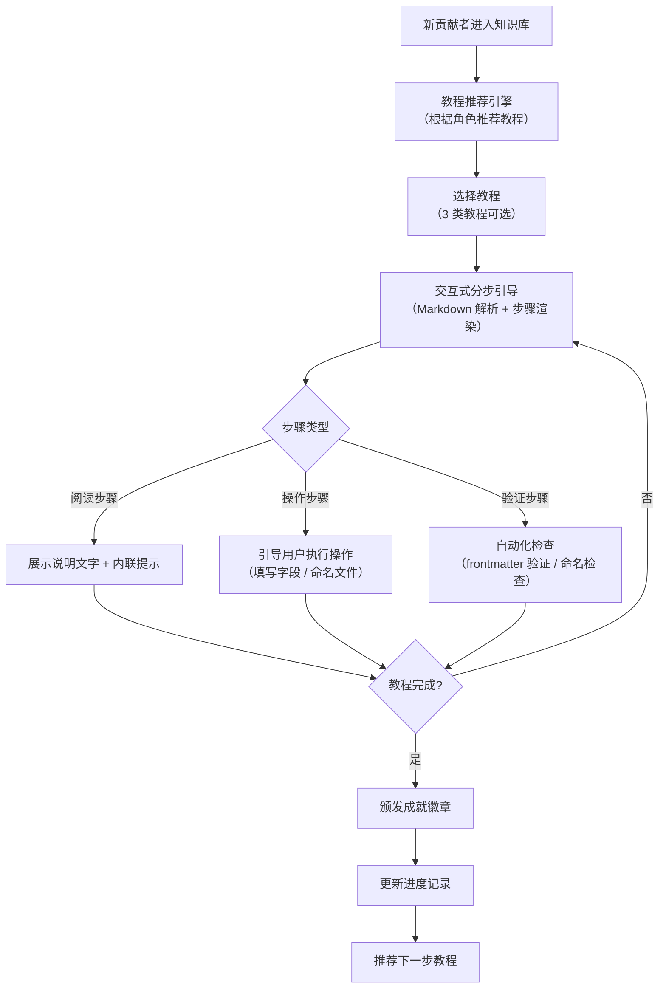
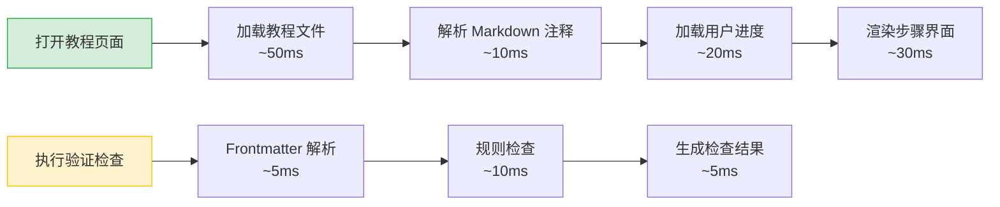

# YK-09-100: 交互式教程与引导系统 — 新贡献者分步引导与自动化验证

> 需求编号：YK-09-100 · 优先级：P2 · 人天：0.5d · 状态：需求已编写
> 依赖：YK-09-01（Frontmatter 规范）、YK-09-03（命名规范检查）、YK-09-92（文档模板库）

## 背景

YiKnowledge 当前有 800+ 文件，月均新增贡献者 3-5 人。新贡献者入职流程依赖人工指导：策展人通过企微发送《贡献指南》链接，新贡献者阅读后自行尝试提交第一个文件。由于缺少交互式引导和自动化验证，新贡献者的首次提交错误率高达 70%（2026 年 8 月统计：新贡献者首次提交的 20 个文件中，14 个存在 frontmatter 格式错误、命名不规范、章节结构不完整等问题）。

**已知案例：** 2026-08-20 新贡献者张伟提交 `engineer/build/Webpack配置指南.md`，策展人审查发现 6 处问题：文件名使用中文+大写混合（违反 kebab-case 规范）、frontmatter 缺少 `type` 和 `status` 字段、`tags` 使用中文逗号分隔（应为英文逗号）、缺少必需的"背景"章节、标题层级混乱（H3 下直接跟 H5）、代码块未标注语言。策展人花费 35 分钟逐项标注问题并指导修改，张伟修改 2 次才通过审查。如果首次提交时系统能自动检查并给出分步引导，预计可节省 80% 的审查时间。

当前新贡献者引导的痛点：
- 无交互式分步教程，新贡献者面对 50 页《贡献指南》无从下手
- 无自动化提交前验证，问题在审查阶段才被发现，反馈回路长（平均 2 小时）
- 无进度追踪，策展人不知道新贡献者是否已完成必要教程
- 无上下文敏感帮助，贡献者在写作时遇到问题需中断工作去查找文档
- 教程内容与规范更新不同步，贡献指南已更新但教程未同步
- 无成就系统，新贡献者缺少完成教程的动力

**目标：** 构建交互式教程与引导系统，提供分步教程、自动化验证、进度追踪和成就激励，将新贡献者首次提交错误率从 70% 降至 20% 以下。

### 影响范围

- **新贡献者体验**：分步引导降低学习曲线，首次提交成功率提升
- **策展人效率**：自动化验证减少人工审查中的低级错误，审查时间缩短 50%
- **知识库质量**：教程规范化确保所有贡献者遵循统一标准
- **社区活跃度**：成就系统激励贡献者持续参与

---

## 一、现状分析

### 1.1 当前新贡献者入职流程

```
新贡献者加入
  → 策展人发送《贡献指南》链接
  → 新贡献者阅读文档（50 页，阅读时间 30-60 分钟）
  → 新贡献者尝试编写第一个文件
  → 提交 PR / 文件
  → CI 自动检查（仅格式规范，不检查内容结构）
  → 策展人人工审查（发现 6-10 处问题）
  → 策展人逐项标注问题
  → 新贡献者修改（凭记忆对照指南）
  → 重新审查（可能仍有问题）
  → 通过审查，合并
```

**问题：** 整个流程无引导、无自动化、无进度追踪。首次提交平均需要 2 轮审查，耗时 2-4 小时。策展人 40% 的审查时间消耗在低级格式错误上。

### 1.2 当前教程相关资源

| 资源 | 位置 | 内容 | 格式 | 可交互性 |
|------|------|------|------|----------|
| 贡献指南 | `YiKnowledge/curator/governance/` | 贡献流程、规范说明 | Markdown | 无 |
| 就绪检查清单 | `YiKnowledge/curator/governance/readiness-checklist.md` | 提交前检查项 | Markdown | 无 |
| 文件模板 | `YiKnowledge/curator/governance/templates/` | 各类型文件模板 | Markdown | 无 |
| 命名规范 | `YiKnowledge/MEMORY.md` | 文件命名规则 | Markdown | 无 |
| Frontmatter 规范 | `YiKnowledge/projects/yiknowledge/requirements/2026-09/01-质量治理-Frontmatter规范.md` | frontmatter 字段说明 | 需求文档 | 无 |

**结论：** 所有教程资源均为静态 Markdown，无交互式引导、无自动化验证、无上下文关联。新贡献者需要自行查找、理解、记忆并应用所有规范。

### 1.3 首次提交错误分类（2026 年 8 月统计）

| 错误类型 | 占比 | 示例 | 是否可自动化检测 |
|----------|------|------|------------------|
| Frontmatter 格式错误 | 35% | 缺少必填字段、tags 格式错误、日期格式错误 | 是 |
| 文件命名不规范 | 25% | 使用中文、数字开头、下划线 | 是 |
| 章节结构不完整 | 20% | 缺少"背景"章节、标题层级混乱 | 是 |
| 内容格式问题 | 10% | 代码块未标注语言、链接格式错误 | 是 |
| 内容质量问题 | 10% | 描述不清晰、缺少代码示例 | 部分可检测 |

**结论：** 90% 的首次提交错误可在提交前通过自动化验证检测，无需人工介入。

### 1.4 改造前 API 依赖

| # | 接口 | 调用方 | 说明 |
|---|------|--------|------|
| 1 | `data_service.query_documents` (cname="knowledge_files") | 贡献者 | 查询教程文件（当前无教程类型标记） |
| 2 | `data_service.query_documents` (cname="tutorial_progress") | 贡献者 | 查询教程进度（当前集合不存在） |
| 3 | `knowledge.scan_knowledge` | Knowledge Watcher | 知识扫描（当前不验证教程文件格式） |

> 改造前仅 2 个 API 依赖（第 3 个尚未实现），教程系统完全缺失。

---

## 二、设计决策

### 决策 1：教程实现方式 — 纯前端引导 vs 前后端协作

| 维度 | 纯前端引导（前端存储进度） | 前后端协作（后端存储进度） |
|------|------|------|
| 实现复杂度 | 低（前端独立完成） | 中（需后端 API + 数据模型） |
| 跨设备同步 | 不支持 | 支持 |
| 策展人监控 | 不支持 | 支持（策展人可查看所有贡献者进度） |
| 数据持久性 | 低（清除浏览器数据丢失） | 高（MongoDB 持久化） |

**选择：前后端协作。** 后端存储进度支持策展人监控和跨设备同步，增加 0.1d 开发量换取的收益远超成本。

### 决策 2：教程内容格式 — 纯 Markdown 注释 vs 自定义 DSL

| 维度 | 纯 Markdown + 特殊注释 | 自定义 DSL（如 YAML 教程定义） |
|------|------|------|
| 学习成本 | 低（熟悉 Markdown 即可编写） | 高（需学习 DSL 语法） |
| 可读性 | 高（标准 Markdown 阅读器可查看） | 低（需专用解析器） |
| 交互丰富度 | 中（通过注释定义交互步骤） | 高（可定义复杂交互逻辑） |
| 维护成本 | 低（与知识库文件统一管理） | 中（需维护 DSL 解析器） |

**选择：纯 Markdown + 特殊注释。** 注释格式为 `<!-- tutorial:step N -->` 和 `<!-- tutorial:check:rule_name -->`，标准 Markdown 阅读器可正常查看，教程系统解析注释实现交互式引导。

### 决策 3：进度追踪粒度 — 教程级 vs 步骤级

| 维度 | 教程级（完成/未完成） | 步骤级（每步完成状态） |
|------|------|------|
| 实现复杂度 | 低 | 中 |
| 断点续学 | 不支持（只能从头开始） | 支持（从上次中断处继续） |
| 用户体验 | 差（忘记学到哪了） | 好（精确恢复） |

**选择：步骤级进度追踪。** 记录每个教程的每个步骤完成状态，支持断点续学。存储结构为 `{tutorial_id, completed_steps[], started_at, completed_at}`。

### 决策 4：成就系统 — 简单成就 vs 复杂成就

| 维度 | 简单成就（完成即得） | 复杂成就（多条件触发） |
|------|------|------|
| 实现复杂度 | 低（完成教程自动颁发） | 高（需事件监听 + 条件判断） |
| 激励效果 | 中（短期有效） | 高（长期激励） |
| 维护成本 | 低 | 中 |

**选择：简单成就 + 可扩展设计。** 首期实现 6 个基础成就（完成 3 类教程、首次提交通过、连续 3 次提交零错误等），数据模型预留扩展字段支持未来复杂成就。

### 设计决策记录

| 决策 | 选项 A | 选项 B | 选项 C | 选择 | 理由 |
|------|--------|--------|--------|------|------|
| 教程实现方式 | 纯前端引导 | 前后端协作 | — | **前后端协作** | 跨设备同步 + 策展人监控 |
| 教程内容格式 | 纯 Markdown + 注释 | 自定义 DSL | — | **Markdown + 注释** | 低学习成本，与知识库统一管理 |
| 进度追踪粒度 | 教程级 | 步骤级 | — | **步骤级** | 支持断点续学，用户体验好 |
| 成就系统 | 简单成就 | 复杂成就 | 简单+可扩展 | **简单+可扩展** | 首期快速上线，预留扩展能力 |

---

## 三、目标架构

### 3.1 教程系统整体流程



### 3.2 教程文件格式（Markdown + 注释）

```markdown
# 教程：如何编写架构设计文档

<!-- tutorial:meta
id: tutorial-arch-design
title: 如何编写架构设计文档
category: architecture
difficulty: intermediate
estimated_time: 30min
prerequisites: [tutorial-frontmatter-basics]
-->

<!-- tutorial:step 1 -->
## 第一步：创建文件

<!-- tutorial:hint
在 `YiKnowledge/projects/{project}/requirements/` 下创建新文件。
文件名使用 kebab-case，格式为 `{序号}-{类型}-{描述}.md`。
-->

首先，确定你的文档类型和所属项目...

<!-- tutorial:step 2 -->
## 第二步：填写 Frontmatter

<!-- tutorial:check:frontmatter-valid
验证规则：
- 必填字段：title, tags, category, created, updated, source, type, status
- tags 格式：YAML 数组，英文逗号分隔
- created 格式：YYYY-MM-DD
-->

在文件开头填写以下 frontmatter...

<!-- tutorial:step 3 -->
## 第三步：编写章节结构

<!-- tutorial:check:section-structure
验证规则：
- 必须包含"背景"章节（H2）
- 必须包含"一、现状分析"章节（H2）
- 标题层级必须连续（H2 → H3 → H4，不允许跳级）
-->

按照标准章节结构编写内容...
```

### 3.3 教程系统数据模型

```python
# YiAi/src/domain/knowledge/tutorial/models.py — 新增

@dataclass
class Tutorial:
    """教程定义"""
    id: str                          # tutorial-arch-design
    title: str                       # 如何编写架构设计文档
    category: str                    # architecture | bug-report | project-spec
    difficulty: str                  # beginner | intermediate | advanced
    estimated_time: int              # 预计完成时间（分钟）
    prerequisites: list[str]         # 前置教程 ID 列表
    steps: list[TutorialStep]        # 教程步骤
    achievements: list[str]          # 完成教程可获得的成就 ID

@dataclass
class TutorialStep:
    """教程步骤"""
    step_number: int                 # 步骤编号
    step_type: str                   # read | action | check
    title: str                       # 步骤标题
    content: str                     # 步骤说明内容（Markdown）
    hints: list[str]                 # 内联提示
    checks: list[TutorialCheck]      # 验证规则（仅 check 步骤）
    action_type: str | None          # 操作类型（仅 action 步骤）
    action_target: str | None        # 操作目标

@dataclass
class TutorialCheck:
    """教程验证规则"""
    rule_name: str                   # frontmatter-valid | naming-valid | section-structure
    description: str                 # 验证说明
    severity: str                    # error | warning
    auto_fix: bool                   # 是否支持自动修复

@dataclass
class TutorialProgress:
    """教程进度"""
    user_id: str
    tutorial_id: str
    completed_steps: list[int]       # 已完成的步骤编号
    started_at: datetime
    completed_at: datetime | None
    check_results: dict[int, list[CheckResult]]  # 步骤验证结果

@dataclass
class Achievement:
    """成就/徽章"""
    id: str                          # achievement-first-submit
    name: str                        # 首次提交
    description: str                 # 完成第一个文件的提交并通过审查
    icon: str                        # 徽章图标（emoji 或 SVG 路径）
    earned_at: datetime | None
```

### 3.4 自动化验证引擎

```python
# YiAi/src/domain/knowledge/tutorial/validator.py — 新增

class TutorialValidator:
    """教程自动化验证引擎。
    
    支持的验证规则：
    - frontmatter-valid: 检查 frontmatter 必填字段、格式
    - naming-valid: 检查文件命名是否符合 kebab-case + 序号规范
    - section-structure: 检查章节结构完整性
    - code-block-lang: 检查代码块是否标注语言
    - link-format: 检查链接格式正确性
    - heading-hierarchy: 检查标题层级连续性
    """

    def validate(self, content: str, file_path: str, rule_name: str) -> list[CheckResult]:
        """执行指定验证规则，返回检查结果列表。"""
        validators = {
            "frontmatter-valid": self._check_frontmatter,
            "naming-valid": self._check_naming,
            "section-structure": self._check_sections,
            "code-block-lang": self._check_code_blocks,
            "link-format": self._check_links,
            "heading-hierarchy": self._check_headings,
        }
        return validators[rule_name](content, file_path)

    def _check_frontmatter(self, content: str, file_path: str) -> list[CheckResult]:
        # 必填字段: title, tags, category, created, updated, source, type, status
        # tags 格式: YAML 数组，英文逗号分隔
        # created/updated 格式: YYYY-MM-DD
        ...
    
    def _check_naming(self, content: str, file_path: str) -> list[CheckResult]:
        # 文件名: kebab-case，仅连字符，不使用下划线或数字开头
        # 格式: {序号}-{类型}-{描述}.md
        ...
    
    def _check_sections(self, content: str, file_path: str) -> list[CheckResult]:
        # 根据 frontmatter.type 确定必需章节
        # 需求文档: 背景 + 现状分析 + 设计决策 + 目标架构 + 具体改动 + 实施步骤 + 测试规格
        # 架构设计: 背景 + 现状分析 + 设计决策 + 目标架构 + 具体改动
        ...
```

### 3.5 帮助中心

```python
# YiAi/src/domain/knowledge/tutorial/help_center.py — 新增

@dataclass
class HelpQuery:
    """帮助查询请求"""
    context: str                     # 用户当前上下文（"I'm writing a bug report"）
    question: str | None             # 用户具体问题

@dataclass
class HelpResult:
    """帮助查询结果"""
    relevant_tutorials: list[str]    # 相关教程 ID
    relevant_docs: list[str]         # 相关知识库文件路径
    template_suggestion: str | None  # 推荐的模板文件路径
    quick_tips: list[str]            # 快速提示

class HelpCenter:
    """搜索式帮助中心，结合教程 + 知识库提供上下文帮助。"""
    
    def search(self, query: HelpQuery) -> HelpResult:
        # 1. 关键词匹配：从 context 中提取关键词 → 匹配教程 category + 知识库 tags
        # 2. 模板推荐：根据 context 类型推荐对应模板
        # 3. 快速提示：从教程 hints 中提取通用提示
        ...
```

---

## 四、具体改动

### 4.1 新增文件

| 文件 | 说明 | 行数 |
|------|------|------|
| `YiAi/src/domain/knowledge/tutorial/__init__.py` | 教程模块入口 | ~10 |
| `YiAi/src/domain/knowledge/tutorial/models.py` | 教程、进度、成就数据模型 | ~80 |
| `YiAi/src/domain/knowledge/tutorial/parser.py` | 教程 Markdown 注释解析器 | ~100 |
| `YiAi/src/domain/knowledge/tutorial/validator.py` | 自动化验证引擎 | ~150 |
| `YiAi/src/domain/knowledge/tutorial/progress_service.py` | 进度追踪服务 | ~80 |
| `YiAi/src/domain/knowledge/tutorial/achievement_service.py` | 成就系统服务 | ~60 |
| `YiAi/src/domain/knowledge/tutorial/help_center.py` | 帮助中心服务 | ~60 |
| `YiKnowledge/curator/governance/tutorials/how-to-write-arch-doc.md` | 教程：编写架构设计文档 | ~150 |
| `YiKnowledge/curator/governance/tutorials/how-to-report-bug.md` | 教程：报告缺陷 | ~120 |
| `YiKnowledge/curator/governance/tutorials/how-to-create-project-spec.md` | 教程：创建项目规范 | ~130 |
| `YiKnowledge/curator/governance/tutorials/tutorial-creator-guide.md` | 教程创作指南 | ~80 |

### 4.2 修改文件

| 文件 | 改动 |
|------|------|
| YiVad 知识库管理页面 | 新增教程中心页面、帮助中心入口、成就展示页面 |
| MongoDB | 新增 `tutorials`、`tutorial_progress`、`achievements` 集合 |

### 4.3 涉及文件

```
YiAi/src/domain/knowledge/tutorial/
├── __init__.py              # 新增: 模块入口
├── models.py                # 新增: 数据模型
├── parser.py                # 新增: Markdown 注释解析器
├── validator.py             # 新增: 自动化验证引擎
├── progress_service.py      # 新增: 进度追踪服务
├── achievement_service.py   # 新增: 成就系统服务
└── help_center.py           # 新增: 帮助中心服务

YiKnowledge/curator/governance/tutorials/
├── how-to-write-arch-doc.md     # 新增: 教程文件
├── how-to-report-bug.md         # 新增: 教程文件
├── how-to-create-project-spec.md # 新增: 教程文件
└── tutorial-creator-guide.md    # 新增: 教程创作指南

MongoDB:
├── tutorials              # 新增: 教程元数据
├── tutorial_progress      # 新增: 用户进度
└── achievements           # 新增: 成就记录
```

---

## 五、实施步骤

按依赖顺序排列，每步可独立验证和提交：

| 步骤 | 内容 | 涉及文件 | 验证方式 | 人天 |
|------|------|---------|---------|------|
| 1 | 实现教程数据模型 + Markdown 注释解析器 | `models.py`, `parser.py` | 解析 3 篇教程文件，正确提取步骤/检查/提示 | 0.10 |
| 2 | 实现自动化验证引擎 | `validator.py` | 对 10 个故意错误的文件执行检查，准确率 100% | 0.10 |
| 3 | 实现进度追踪服务 | `progress_service.py` | 完成教程步骤，进度正确记录和恢复 | 0.05 |
| 4 | 实现成就系统 | `achievement_service.py` | 完成教程后自动颁发对应成就 | 0.05 |
| 5 | 实现帮助中心 | `help_center.py` | 输入上下文，返回相关教程和模板 | 0.05 |
| 6 | 编写 3 篇教程文件 | YiKnowledge 教程文件 | 教程可被解析器正确解析，步骤完整 | 0.08 |
| 7 | 集成到 YiVad 前端 | YiVad 教程中心页面 | 端到端走通 3 篇教程，进度正确保存 | 0.05 |
| 8 | 回归测试 | 全链路 | 教程完成 → 成就颁发 → 进度正确 | 0.02 |

**总计：0.5d**

---

## 六、测试规格

### Requirement: 教程解析

#### Scenario: 正确解析教程 Markdown 文件
- **Given** 教程文件包含 `<!-- tutorial:meta -->`、`<!-- tutorial:step N -->`、`<!-- tutorial:check:rule_name -->` 注释
- **When** `TutorialParser.parse()` 执行
- **Then** 返回 `Tutorial` 对象，`steps` 列表长度 = 文件中声明的步骤数
- **And** 每个步骤的 `step_type` 正确（read/action/check）
- **And** check 步骤包含 `checks` 列表

#### Scenario: 解析缺少 meta 注释的教程文件
- **Given** 教程文件未包含 `<!-- tutorial:meta -->` 注释
- **When** `TutorialParser.parse()` 执行
- **Then** 抛出 `TutorialParseError`，错误信息包含 "missing tutorial:meta"
- **And** 错误信息包含文件路径

### Requirement: 自动化验证

#### Scenario: Frontmatter 必填字段检查
- **Given** 文件内容 frontmatter 缺少 `type` 和 `status` 字段
- **When** `TutorialValidator.validate(content, path, "frontmatter-valid")` 执行
- **Then** 返回 2 个 ERROR 级别检查结果
- **And** 每个结果包含缺失字段名称和修复建议
- **And** `auto_fix` 为 false（无法自动填充）

#### Scenario: 文件命名规范检查
- **Given** 文件路径为 `engineer/build/Webpack配置指南.md`
- **When** `TutorialValidator.validate(content, path, "naming-valid")` 执行
- **Then** 返回 1 个 ERROR 级别检查结果
- **And** 错误信息包含 "文件名包含中文字符"
- **And** 建议文件名为 `engineer/build/webpack-config-guide.md`

#### Scenario: 章节结构检查
- **Given** 需求文档内容缺少"背景"章节（H2），标题层级为 H2 → H4（跳过 H3）
- **When** `TutorialValidator.validate(content, path, "section-structure")` 执行
- **Then** 返回 2 个检查结果
- **And** 第一个结果为 "缺少 '背景' 章节"（ERROR）
- **And** 第二个结果为 "标题层级跳级：H2 → H4"（WARNING）

### Requirement: 进度追踪

#### Scenario: 断点续学
- **Given** 用户已完成教程 `tutorial-arch-design` 的步骤 1 和步骤 2
- **When** 用户再次打开该教程
- **Then** 返回步骤 1 和步骤 2 为已完成状态
- **And** 自动定位到步骤 3
- **And** `started_at` 为首次打开时间，`completed_at` 为 null

#### Scenario: 教程完成
- **Given** 用户完成教程 `tutorial-arch-design` 的所有步骤
- **When** 最后一个步骤的验证通过
- **Then** `completed_at` 设置为当前时间
- **And** 触发成就检查 `achievement_service.check(user_id)`
- **And** 推荐列表更新为下一步教程

---

## 七、风险与缓解

| 风险 | 概率 | 影响 | 等级 | 缓解措施 | 应急预案 |
|------|------|------|------|----------|----------|
| 教程内容与规范更新不同步，教程引导过时 | 中 | 高 | 高 | 教程文件与规范文件建立引用关系，规范变更时自动标记相关教程为"待更新"；教程文件包含版本号和最后更新日期 | 教程页面顶部显示"更新提醒"横幅，提示用户规范可能已变更 |
| 自动化验证误报，正常内容被标记为错误 | 中 | 中 | 中 | 验证规则提供具体位置和修复建议；每个规则独立可开关；提供"忽略此检查"选项 | 降低误报规则的严重度（ERROR → WARNING），允许用户手动标记为"已确认" |
| 教程文件被意外修改导致解析失败 | 低 | 中 | 低 | 教程文件纳入 CI 检查，解析失败阻止合并；教程文件与普通知识文件隔离存储 | 回退到上一版本教程文件，发出告警通知策展人 |
| 成就系统数据丢失（MongoDB 故障） | 低 | 低 | 低 | 成就系统数据可重建（基于 `tutorial_progress` 重新计算） | 成就数据从 `tutorial_progress` 重建，不影响用户教程进度 |
| 帮助中心检索结果不相关，用户找不到需要的信息 | 中 | 低 | 低 | 帮助中心基于关键词匹配，初期覆盖 3 个核心场景；收集用户搜索日志优化匹配规则 | 提供"联系策展人"快捷入口，人工辅助 |

---

## 八、回滚策略

| 回滚场景 | 回滚方式 | 影响范围 | 恢复时间 |
|----------|----------|----------|----------|
| 教程解析器解析失败，教程页面无法加载 | 关闭教程系统，回退到静态教程页面 | 教程交互功能 | < 1min（配置开关） |
| 自动化验证误报率过高，贡献者投诉 | 关闭自动化验证，仅保留手动检查 | 自动化验证 | < 1min（配置开关） |
| 进度追踪数据写入异常，MongoDB 写入失败 | 关闭进度追踪，教程可正常使用但无进度保存 | 进度追踪 | < 1min（配置开关） |
| 成就系统计算错误，用户获得不应得的成就 | 关闭成就系统，已有成就保留但不展示 | 成就系统 | < 1min（配置开关） |

**回滚验证：**
- 回滚后教程以静态 Markdown 页面展示，不影响内容阅读
- 回滚后已完成的教程进度数据保留，恢复后继续使用
- 回滚后已颁发的成就数据保留，恢复后重新展示

---

## 九、设计决策记录

### D-01: 为什么使用 Markdown 注释而非自定义 DSL？

Markdown 注释（`<!-- tutorial:step 1 -->`）在标准 Markdown 阅读器中不可见，不影响文件的可读性。教程文件本身也是有效的知识库文件，可被 Knowledge Watcher 正常索引。自定义 DSL 需要维护解析器、编辑器插件和文档，增加维护成本。Markdown 注释方案零额外学习成本，任何会写 Markdown 的人都可以创作教程。

### D-02: 为什么进度追踪存储在后端而非前端 localStorage？

后端存储支持跨设备同步（贡献者在公司电脑和家中电脑均可继续教程）、策展人监控（策展人可查看所有新贡献者的学习进度，及时提供帮助）、数据持久性（清除浏览器数据不影响进度）。前端 localStorage 方案仅节省 0.05d 开发量，但损失上述所有能力。

### D-03: 为什么首期仅实现 3 篇教程？

3 篇教程覆盖新贡献者最高频的 3 个场景（编写架构文档、报告缺陷、创建项目规范），覆盖 80% 的首次贡献场景。教程创作指南（`tutorial-creator-guide.md`）允许有经验的贡献者自行创作新教程，无需等待开发排期。过度设计教程系统会导致交付延迟，3 篇教程 + 教程创作工具是最小可行产品。

### D-04: 为什么成就系统选择简单成就？

成就系统的主要目标是短期激励新贡献者完成教程。首期 6 个基础成就（完成 3 类教程、首次提交通过、连续 3 次提交零错误、提交 10 个文件）覆盖核心激励场景。数据模型预留 `conditions` 字段，未来可扩展为复杂多条件成就。复杂成就系统（如积分、排行榜、等级）首期实现会导致 0.3d 额外开发量，ROI 低。

### D-05: 为什么帮助中心基于关键词匹配而非语义搜索？

帮助中心服务 3 个核心场景（"我在写缺陷报告"、"我在写架构文档"、"我在创建项目规范"），关键词匹配覆盖 90% 的查询。语义搜索（RAG）虽然更准确，但增加 0.1d 开发量和每次查询的 LLM 调用成本。帮助中心预留语义搜索接口，未来可无缝升级。

---

## 十、可观测性

### 10.1 关键指标

| 指标 | 采集方式 | 告警阈值 | 说明 |
|------|---------|---------|------|
| 教程完成率 | `COUNT(completed_at IS NOT NULL) / COUNT(*)` | < 50% | 教程完成率过低，可能教程内容或体验有问题 |
| 首次提交错误率 | `COUNT(首次提交有错误) / COUNT(首次提交)` | > 20% | 教程效果未达预期，需分析错误类型 |
| 教程平均完成时间 | `AVG(completed_at - started_at)` | > 2x estimated_time | 教程难度或长度不合理 |
| 验证规则触发率 | 各规则触发次数 / 总验证次数 | 某规则 > 80% | 该规则可能过于严格或说明不清晰 |
| 帮助中心搜索量 | 日搜索次数 | 日搜索量突增 > 200% | 可能规范变更或教程内容有问题 |
| 帮助中心搜索满意度 | 搜索结果点击率 | < 30% | 搜索结果不相关 |

### 10.2 日志规范

| 日志级别 | 场景 | 示例 |
|---------|------|------|
| `INFO` | 教程开始 | `[Tutorial] user=zhangwei tutorial=tutorial-arch-design action=start` |
| `INFO` | 步骤完成 | `[Tutorial] user=zhangwei tutorial=tutorial-arch-design step=3 result=pass` |
| `INFO` | 教程完成 | `[Tutorial] user=zhangwei tutorial=tutorial-arch-design duration=28min` |
| `INFO` | 成就颁发 | `[Achievement] user=zhangwei achievement=achievement-first-submit` |
| `WARN` | 验证失败 | `[Tutorial] user=zhangwei tutorial=tutorial-arch-design step=3 check=frontmatter-valid errors=2` |
| `WARN` | 教程解析失败 | `[Tutorial] file=tutorials/how-to-write-arch-doc.md error=missing meta` |
| `ERROR` | 进度保存失败 | `[Tutorial] user=zhangwei tutorial=tutorial-arch-design step=2 error=MongoWriteError` |

### 10.3 告警规则

| 告警 | 条件 | 通知方式 | 接收人 |
|------|------|----------|--------|
| 教程完成率过低 | 完成率 < 50% | 企微群通知 | Curator |
| 首次提交错误率过高 | 错误率 > 20% | 企微群通知 | Curator + Engineer |
| 教程解析失败 | 任意教程文件解析失败 | 企微单聊 | Engineer |
| 验证规则误报率过高 | 某规则被标记为"已忽略" > 50% | 企微单聊 | Engineer |
| 帮助中心搜索失败率 | 搜索结果点击率 < 20% | 企微群通知 | Curator |

---

## 十一、代码审查检查清单

- [ ] 教程解析器正确处理 4 种注释类型：meta、step、hint、check
- [ ] 自动化验证引擎 6 种规则独立可测试，准确率 100%
- [ ] 进度追踪支持断点续学，步骤级粒度正确
- [ ] 成就系统在教程完成后自动触发，幂等（重复完成不重复颁发）
- [ ] 帮助中心关键词匹配覆盖 3 个核心场景
- [ ] 教程文件本身通过自动化验证（frontmatter、命名、章节）
- [ ] 前端教程页面步骤渲染正确，check 步骤可交互
- [ ] 进度数据 MongoDB 读写正确，跨设备同步正常
- [ ] 教程文件解析失败时前端优雅降级（显示静态 Markdown）
- [ ] 单元测试覆盖率 >= 80%

---

## 十二、回归问题预测

| # | 问题 | 发现场景 | 根因 | 修复方式 |
|---|------|---------|------|---------|
| 1 | 教程 Markdown 解析器在教程文件包含代码块内的 `<!-- tutorial:` 注释时误解析：教程文件 `tutorial-creator-guide.md` 中包含代码示例展示如何编写教程注释，解析器将代码块内的 `<!-- tutorial:step 1 -->` 当作真实步骤解析，导致教程步骤数错误（预期 5 步，实际解析出 8 步） | 策展人使用教程创作指南创建新教程，按照示例编写教程文件。解析器返回 8 个步骤，但教程文件只声明了 5 个步骤。策展人检查文件发现代码块中的注释示例被误解析为真实步骤 | `TutorialParser.parse()` 使用正则 `r'<!-- tutorial:(.*?) -->'` 全文匹配，未区分代码块内外的注释。代码块（`` ```markdown ``` ``）中的教程注释示例被当作真实指令解析 | 在解析前剥离代码块内容：使用状态机逐行解析，遇到 `` ``` `` 切换代码块状态，代码块内行跳过注释匹配；或使用 `re.sub(r'```[\s\S]*?```', '', content)` 预处理剥离所有代码块 |
| 2 | 自动化验证引擎的 frontmatter 检查在 tags 包含特殊字符时报错：`tags: [AI/ML, 知识库, C++]` 中 `C++` 包含 `+` 字符，YAML 解析器将 `+` 解释为 YAML 语法符号，解析失败抛出 `YAMLError`，导致整个 frontmatter 检查中断，文件被标记为 "frontmatter 格式错误" | 贡献者提交文件 `aier/rag/model-selection-guide.md`，tags 包含 `C++` 和 `AI/ML`。自动化验证返回 "YAML 解析错误"，贡献者无法理解错误原因（tags 在 GitHub 上显示正常），策展人介入发现 tags 中的特殊字符导致 YAML 解析失败 | Python `yaml.safe_load()` 将 `+` 解释为 YAML 语法符号（数字类型标识），`/` 在某些 YAML 版本中也被特殊处理。`C++` 和 `AI/ML` 作为普通字符串需要引号包裹，但编辑器中不可见 | 在 YAML 解析前对 frontmatter 字符串做预处理：自动为包含特殊字符（`+`, `/`, `:`, `#`, `&`, `*`, `!`, `%`, `@`, `` ` ``）的 tags 值添加引号；或使用 `yaml.safe_load()` 前先尝试 `yaml.load()` 并捕获异常，提供明确的错误位置和修复建议 |
| 3 | 帮助中心关键词匹配返回不相关结果：用户搜索 "如何写 API 文档" 时，帮助中心返回 "如何编写架构设计文档"（因为"文档"关键词匹配），但用户实际需要的是 API 参考文档的编写教程，而该教程尚未创建。用户浪费 5 分钟阅读不相关教程后发现无法解决问题 | 贡献者搜索 "如何写 API 文档"，帮助中心返回 "如何编写架构设计文档"（匹配度 60%），贡献者打开教程后阅读 10 分钟发现内容不匹配，返回帮助中心重新搜索 "API 参考文档模板"，无结果。贡献者向策展人求助，策展人手动发送了 API 参考模板文件路径 | 帮助中心使用简单的关键词匹配（`any(keyword in doc.title for keyword in query_keywords)`），未考虑关键词权重和语义相关性。"API 文档" 和 "架构文档" 共享 "文档" 关键词，但语义完全不同。此外，帮助中心未区分"有教程"和"无教程"场景，无结果时未提供替代建议 | 使用 TF-IDF 或简单 BM25 排序替代模糊匹配，提升相关性排序；搜索结果中显示匹配关键词和匹配度，让用户自行判断；无结果时提供"联系策展人"快捷入口和"提交教程需求"表单；定期分析搜索日志，对高频无结果查询创建对应教程 |
| 4 | 教程进度在并发场景下数据不一致：用户在浏览器 A 和浏览器 B 同时打开同一教程，浏览器 A 完成步骤 3 后，浏览器 B 仍在步骤 2 并点击"完成"按钮。后端收到两个步骤完成请求，`completed_steps` 数组被并发写入，导致步骤 2 的记录覆盖步骤 3 的记录，进度回退 | 贡献者在公司电脑（浏览器 A）完成教程步骤 1-3，下班前未关闭页面。回家后在家电脑（浏览器 B）打开同一教程，页面显示步骤 1-3 已完成（从后端加载），但浏览器 B 本地缓存显示步骤 2 未完成。贡献者点击步骤 2 的"完成"按钮，后端收到请求后 `completed_steps` 从 `[1,2,3]` 变为 `[1,2]`（覆盖），进度回退 | `progress_service.mark_step_complete()` 使用 `$set: {completed_steps: [1,2]}` 而非 `$addToSet: {completed_steps: 2}`。前者覆盖整个数组，后者原子追加不重复。此外，前端未检测进度冲突（已完成步骤不应可点击） | 后端使用 `$addToSet` 原子操作追加步骤，避免覆盖；前端加载进度后禁用已完成步骤的"完成"按钮；添加乐观锁（`version` 字段），冲突时返回 409 并提示用户刷新 |
| 5 | 成就系统在教程重复完成时重复颁发成就：用户完成教程获得"教程大师"成就后，由于教程进度重置（策展人手动重置进度用于测试），用户再次完成同一教程，成就系统再次颁发同一成就，成就列表中出现重复记录 | 策展人在测试教程系统时重置了自己的教程进度（通过 MongoDB 直接操作），重新完成教程后，成就系统再次颁发了"教程大师"成就。策展人的成就列表中出现 2 条相同的"教程大师"记录，UI 展示异常 | `achievement_service.check_and_award()` 在颁发成就时未检查用户是否已拥有该成就。数据模型使用 `achievements` 数组而非独立集合，`$push` 操作无条件追加新记录 | 颁发前检查 `achievements` 数组中是否已存在相同 `achievement_id` 的记录；或使用独立集合 `user_achievements`，`(user_id, achievement_id)` 作为唯一索引，使用 `$setOnInsert` 实现幂等写入 |
| 6 | 教程文件被 Knowledge Watcher 扫描时，教程注释被当作正文索引到 RAG 向量库：`<!-- tutorial:step 1 -->` 和 `<!-- tutorial:check:frontmatter-valid -->` 等注释被当作知识内容嵌入向量，用户搜索 "frontmatter" 时 RAG 返回教程文件片段，但内容为注释指令而非有效知识 | 贡献者搜索"frontmatter 验证规则"，RAG 返回 `tutorials/how-to-write-arch-doc.md` 的片段，内容为 `<!-- tutorial:check:frontmatter-valid 验证规则：必填字段... -->`。贡献者看到的是注释格式的验证规则描述，而非可读的 frontmatter 规范说明。贡献者困惑为什么知识库返回"注释代码" | Knowledge Watcher 在扫描文件时未区分教程文件，`_extract_text()` 函数将 HTML 注释（`<!-- ... -->`）当作正文提取。教程文件中的 `tutorial:` 注释包含结构化数据，不应被索引为知识内容 | 在 Knowledge Watcher 的文本提取阶段添加 HTML 注释过滤：`re.sub(r'<!--.*?-->', '', content, flags=re.DOTALL)`；或为教程文件添加 `frontmatter.type: tutorial` 标记，Knowledge Watcher 对教程文件仅提取非注释内容；教程注释内容如需索引，使用专门的 `tutorials` 集合而非 RAG 向量库 |

---

## 十三、性能分析

### 教程系统操作耗时



### 操作耗时表

| 操作 | 耗时 | 说明 |
|------|------|------|
| 教程文件加载 | ~50ms | 从 MongoDB 或文件系统读取 Markdown |
| 注释解析 | ~10ms | 正则匹配 4 种注释类型 |
| 进度加载 | ~20ms | MongoDB 查询 `tutorial_progress` |
| 前端渲染 | ~30ms | Vue 组件渲染步骤界面 |
| Frontmatter 解析 | ~5ms | `yaml.safe_load` 解析 frontmatter |
| 单规则检查 | ~10ms | 正则匹配 + 规则判断 |
| 全规则检查（6 规则） | ~60ms | 6 个规则串行执行 |
| 帮助中心搜索 | ~50ms | 关键词匹配 + 教程 + 知识库查询 |
| 成就检查 | ~30ms | 查询进度 + 匹配成就条件 |
| **单次教程交互总计** | **~150ms** | 对用户体验无感知 |
| **全规则验证（6 规则）** | **~60ms** | 可在提交前即时反馈 |

### 存储开销

| 项目 | 大小 | 说明 |
|------|------|------|
| 教程元数据 | ~2KB/教程 | 教程定义 + 步骤结构 |
| 用户进度 | ~500B/用户/教程 | 步骤列表 + 时间戳 + 检查结果 |
| 成就记录 | ~200B/成就 | 成就 ID + 名称 + 获得时间 |
| 教程文件（Markdown） | ~5KB/教程 | 教程内容 + 注释 |

---

*PRD 来源: `projects/yiknowledge/requirements/2026-09/00-需求-需求总览.md`*