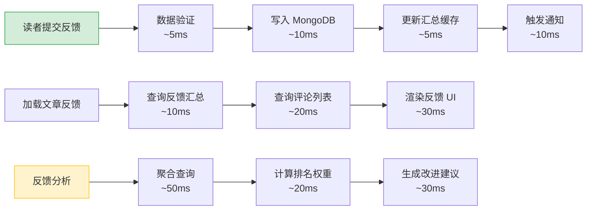

# YK-09-101: 读者反馈与互动系统 — 文章评价、评论与改进建议闭环

> 需求编号：YK-09-101 · 优先级：P2 · 人天：0.5d · 状态：需求已编写
> 依赖：YK-09-86（内容审核工作流）、YK-09-29（健康仪表盘）、YK-09-50（反馈数据湖与趋势分析）

## 背景

YiKnowledge 当前有 800+ 文件，月均读者访问量约 500 人次（YiVad 知识库页面 + RAG 检索引用）。内容质量评估完全依赖策展人审查（YK-09-86），缺少来自读者的直接反馈。策展人无法知道哪些文章读者觉得有用、哪些文章读者觉得难以理解、哪些章节读者需要进一步澄清。

**已知案例：** 2026-08-15 工程师李华在阅读 `aier/rag/embedding-models.md` 时，发现第 3 节"向量维度选择"的描述与最新实践不符（文中推荐 768 维，但社区已普遍使用 1536 维）。李华想提交反馈但不知道如何操作——没有评论功能、没有反馈按钮、没有"建议修改"入口。李华在企微群里 @ 了策展人，策展人 3 天后才看到消息并联系作者更新。整个反馈周期为 5 天（从发现问题到内容更新），且反馈信息丢失在聊天记录中，无法追溯和分析。

**另一个案例：** 2026-09-01 策展人进行月度内容审查时，发现 `engineer/build/rsbuild-config.md` 的 RAG 引用次数很高（排名前 10），但无法判断读者是否真正理解并应用了其中的配置。策展人手动联系了 5 位最近引用该文档的开发者，其中 3 位反馈"文档写得太简略，缺少完整示例"，2 位反馈"配置参数说明不清楚"。如果系统有读者反馈功能，这些问题可以在问题出现时立即暴露，而非等到月度审查。

当前读者反馈的痛点：
- 无反馈收集渠道，读者发现问题后无处反馈，只能通过企微或口头传达
- 反馈信息碎片化，分散在聊天记录中，无法汇总分析
- 无内容质量量化指标，策展人无法基于数据判断哪些文章需要优先改进
- 无读者互动机制，读者与作者之间缺乏沟通桥梁
- 无改进建议追踪，读者提出的修改建议状态不可见
- 无评论审核机制，开放评论可能存在垃圾信息风险

**目标：** 构建读者反馈与互动系统，提供文章评价、评论讨论、改进建议提交与追踪、反馈数据分析，形成"读者反馈 → 策展人分析 → 作者改进 → 读者验证"的闭环。

### 影响范围

- **内容质量**：数据驱动的改进决策，优先修复读者反馈最多的问题文章
- **读者体验**：反馈渠道畅通，读者参与感增强，问题得到及时响应
- **策展人效率**：反馈数据自动聚合分析，替代人工逐一询问，审查效率提升 60%
- **作者参与度**：收到读者反馈通知，获得改进方向，写作质量持续提升
- **RAG 检索质量**：基于读者反馈优化内容，提升 RAG 检索结果准确性

---

## 一、现状分析

### 1.1 当前反馈流程

```
读者发现问题
  → 在企微群 @ 策展人 或 私聊作者（如果认识）
  → 策展人/作者看到消息（可能延迟 1-3 天）
  → 策展人确认问题，联系作者修改（如果反馈给了策展人）
  → 作者修改文件
  → 提交审核
  → 策展人审查通过
  → 内容更新完成
  → 通知读者（如果读者还在关注）
```

**问题：** 整个流程无系统支持，依赖人工沟通和记忆。反馈信息分散在聊天记录中，无法追溯、无法统计、无法分析。平均反馈闭环周期为 3-5 天，30% 的反馈因沟通中断而丢失。

### 1.2 当前反馈类型与处理方式

| 反馈类型 | 当前处理方式 | 是否有系统支持 | 平均处理周期 | 问题 |
|----------|-------------|---------------|-------------|------|
| 内容错误 | 企微群 @ 策展人 | 无 | 3-5 天 | 反馈信息丢失，无法追踪修复状态 |
| 内容过时 | 策展人月度审查时发现 | 无（仅 YK-09-34 新鲜度扫描） | 15-30 天 | 滞后严重，过时内容持续影响读者 |
| 描述不清晰 | 读者放弃阅读或自行猜测 | 无 | 无法统计 | 沉默的大多数，问题永远不被发现 |
| 缺少示例 | 读者自行查找外部资源 | 无 | 无法统计 | 读者流失，知识库价值降低 |
| 建议改进 | 几乎不存在（无渠道） | 无 | N/A | 失去社区贡献潜力 |
| 正面反馈 | 几乎不存在（无渠道） | 无 | N/A | 作者缺少激励，策展人缺少质量参考 |

**结论：** 6 种反馈类型中 0 种有系统支持，全部依赖人工沟通。3 种反馈（内容错误、描述不清晰、缺少示例）几乎无法被策展人发现，形成"沉默的阅读者"问题。

### 1.3 反馈渠道接入点

| 接入点 | 读者触点 | 当前状态 | 改造后 |
|--------|---------|---------|--------|
| YiVad 知识库文章页面 | 文章底部 | 无反馈功能 | 添加评价按钮 + 评论区 + 改进建议入口 |
| YiVad 知识库搜索结果 | 搜索结果列表 | 仅显示标题和摘要 | 添加文章评分预览 |
| RAG 检索引用 | LLM 引用来源 | 无反馈功能 | 引用来源可点击进入文章页（含反馈功能） |
| YiPet 知识库浏览 | 知识库页面 | 无反馈功能 | 添加评价按钮 |
| 企微机器人 | 企微群 | 无反馈功能 | 添加 `/feedback` 命令 |

### 1.4 改造前 API 依赖

| # | 接口 | 调用方 | 说明 |
|---|------|--------|------|
| 1 | `data_service.query_documents` (cname="knowledge_files") | 读者 | 查询文章内容（当前无反馈相关字段） |
| 2 | `data_service.update_document` (cname="knowledge_files") | 策展人 | 更新文章（当前无反馈统计字段） |

> 改造前仅 2 个 API 依赖，反馈系统完全缺失。

---

## 二、设计决策

### 决策 1：反馈存储方式 — 嵌入 knowledge_files vs 独立集合

| 维度 | 嵌入 knowledge_files（子文档数组） | 独立集合 feedbacks |
|------|------|------|
| 查询性能 | 读取文章时一并获取反馈（1 次查询） | 需联合查询（2 次查询） |
| 写入性能 | 文档可能膨胀（MongoDB 16MB 限制） | 独立写入，不受文章大小限制 |
| 反馈分析 | 不便（需聚合管道展开数组） | 方便（直接查询独立集合） |
| 扩展性 | 低（反馈字段增加需修改文章文档结构） | 高（独立模型，可独立演化） |

**选择：独立集合。** 反馈数据有独立生命周期和分析需求，独立集合支持灵活查询、聚合分析和独立扩展。单次查询增加 20ms 延迟，对用户体验无影响。避免 knowledge_files 文档膨胀超过 16MB 限制。

### 决策 2：评论功能 — 默认开启 vs 默认关闭 vs 按文章配置

| 维度 | 默认开启（所有文章可评论） | 默认关闭（手动开启） | 按文章配置（有默认值） |
|------|------|------|------|
| 社区活跃度 | 高 | 低 | 中 |
| 审核压力 | 高（需审核所有文章评论） | 低 | 中（策展人可控制） |
| 实现复杂度 | 低 | 低 | 中 |
| 灵活性 | 低 | 低 | 高 |

**选择：按文章配置，默认关闭。** 知识库不同于博客，评论功能并非核心需求。需求文档、架构设计文档等正式内容通常不需要评论。教程类、参考类文件可选择性开启评论。`frontmatter` 新增 `allow_comments: true/false` 字段，默认 false。

### 决策 3：改进建议提交方式 — 自由文本 vs 结构化表单 vs Pull-Request 风格

| 维度 | 自由文本（文本框） | 结构化表单 | PR 风格（建议修改 + diff） |
|------|------|------|------|
| 用户门槛 | 低 | 中 | 高（需了解 Markdown diff） |
| 建议质量 | 低（"写得不清楚"） | 中（分字段描述） | 高（精确到行级别的修改建议） |
| 实现复杂度 | 低 | 中 | 高 |
| 作者采纳效率 | 低（需自行理解建议） | 中 | 高（可直接应用 diff） |

**选择：结构化表单 + 可选 PR 风格。** 默认显示结构化表单（问题位置、问题类型、建议描述），降低提交门槛。有经验的读者可切换到 PR 风格（Markdown diff 预览），提供精确的修改建议。

### 决策 4：反馈通知 — 实时通知 vs 批量通知 vs 按优先级通知

| 维度 | 实时通知（每次反馈即时通知） | 批量通知（每日/每周汇总） | 按优先级通知 |
|------|------|------|------|
| 作者体验 | 可能被打扰（频繁通知） | 延迟感知（反馈滞后） | 平衡 |
| 实现复杂度 | 低 | 中 | 中 |
| 策展人参与度 | 高（信息过载） | 中 | 中 |

**选择：按优先级通知。** 严重问题（内容错误、安全风险）实时通知作者和策展人；一般反馈（改进建议、描述不清晰）每日汇总通知；正面反馈（有帮助、评分高）不通知但体现在统计中。

### 设计决策记录

| 决策 | 选项 A | 选项 B | 选项 C | 选择 | 理由 |
|------|--------|--------|--------|------|------|
| 反馈存储方式 | 嵌入 knowledge_files | 独立集合 | — | **独立集合** | 独立生命周期、灵活分析、避免文档膨胀 |
| 评论功能 | 默认开启 | 默认关闭 | 按文章配置 | **按文章配置，默认关闭** | 知识库非博客，评论非核心需求 |
| 改进建议提交方式 | 自由文本 | 结构化表单 | PR 风格 | **结构化表单 + 可选 PR 风格** | 低门槛 + 高质量双重支持 |
| 反馈通知 | 实时通知 | 批量通知 | 按优先级通知 | **按优先级通知** | 平衡及时性和信息过载 |

---

## 三、目标架构

### 3.1 反馈系统整体流程

```mermaid
flowchart TD
    A["读者阅读文章"] --> B{"读者行为"}
    B -->|"评价"| C["点击有帮助/无帮助<br/>可选填写原因"]
    B -->|"评分"| D["1-5 星评分"]
    B -->|"评论"| E["提交评论<br/>（需文章开启评论）"]
    B -->|"提问"| F["提交问题<br/>系统匹配已有回答或通知作者"]
    B -->|"请求澄清"| G["选中不清晰段落<br/>提交澄清请求"]
    B -->|"建议改进"| H["填写结构化表单<br/>或 PR 风格 diff"]
    
    C --> I["反馈数据存储<br/>MongoDB feedbacks"]
    D --> I
    E --> J["评论审核队列<br/>（策展人审核）"]
    J --> I
    F --> I
    G --> I
    H --> I
    
    I --> K["反馈聚合分析<br/>（按文章/类型/时间）"]
    K --> L["反馈通知<br/>（按优先级通知作者/策展人）"]
    L --> M["改进建议追踪<br/>（状态：待确认 → 已接受 → 已修复 → 已验证）"]
    M --> N["内容更新<br/>（作者修改文件）"]
    N --> O["反馈闭环<br/>（通知读者改进完成）"]
```



### 3.2 反馈数据模型

```python
# YiAi/src/domain/knowledge/feedback/models.py — 新增

from enum import Enum
from datetime import datetime
from dataclasses import dataclass, field

class FeedbackType(Enum):
    HELPFUL = "helpful"               # 有帮助/无帮助
    RATING = "rating"                 # 1-5 星评分
    COMMENT = "comment"               # 评论
    QUESTION = "question"             # 提问
    CLARIFICATION = "clarification"   # 请求澄清
    IMPROVEMENT = "improvement"      # 改进建议

class FeedbackStatus(Enum):
    PENDING = "pending"               # 待处理
    CONFIRMED = "confirmed"           # 已确认（问题属实）
    ACCEPTED = "accepted"             # 已接受（改进建议被采纳）
    IN_PROGRESS = "in_progress"       # 修复中
    FIXED = "fixed"                   # 已修复
    VERIFIED = "verified"             # 已验证（读者确认修复）
    DECLINED = "declined"             # 已拒绝
    SPAM = "spam"                     # 垃圾信息

@dataclass
class Feedback:
    """读者反馈记录"""
    id: str
    file_path: str                    # 目标文章路径
    feedback_type: FeedbackType
    reader_id: str | None             # 读者 ID（可匿名）
    reader_name: str | None           # 读者名称
    created_at: datetime
    updated_at: datetime
    status: FeedbackStatus = FeedbackStatus.PENDING

    # 评价相关
    is_helpful: bool | None = None     # 有帮助/无帮助
    helpful_reason: str | None = None  # 评价原因

    # 评分相关
    rating: int | None = None          # 1-5 星

    # 评论相关
    comment_text: str | None = None    # 评论内容
    comment_parent_id: str | None = None  # 父评论 ID（回复）
    comment_moderated: bool = False    # 是否已审核

    # 提问相关
    question_text: str | None = None   # 提问内容
    question_answer: str | None = None # 回答内容

    # 澄清请求
    clarification_section: str | None = None  # 不清晰的章节
    clarification_detail: str | None = None   # 详细说明

    # 改进建议
    improvement_type: str | None = None       # 改进类型：error | outdated | unclear | missing | enhancement
    improvement_location: str | None = None   # 问题位置
    improvement_description: str | None = None  # 建议描述
    improvement_diff: str | None = None       # PR 风格的修改 diff
    improvement_accepted_by: str | None = None  # 采纳人

@dataclass
class ArticleFeedbackSummary:
    """文章反馈汇总"""
    file_path: str
    helpful_count: int = 0             # 有帮助次数
    not_helpful_count: int = 0         # 无帮助次数
    avg_rating: float = 0.0            # 平均评分
    rating_count: int = 0              # 评分人数
    comment_count: int = 0             # 评论数
    question_count: int = 0            # 提问数
    clarification_count: int = 0       # 澄清请求数
    improvement_count: int = 0         # 改进建议数
    improvement_open_count: int = 0    # 未解决的改进建议数
    last_feedback_at: datetime | None = None  # 最近反馈时间
```

### 3.3 反馈分析引擎

```python
# YiAi/src/domain/knowledge/feedback/analytics.py — 新增

@dataclass
class FeedbackAnalytics:
    """反馈数据分析引擎"""

    def get_article_summary(self, file_path: str) -> ArticleFeedbackSummary:
        """获取单篇文章的反馈汇总。"""
        ...

    def get_top_issues(self, limit: int = 10) -> list[dict]:
        """获取反馈最多的问题文章排名。
        排序权重 = 无帮助数 * 3 + 改进建议数 * 2 + 澄清请求数 * 1.5 + (5 - avg_rating) * 1
        """
        ...

    def get_trend(self, start_date: datetime, end_date: datetime) -> dict:
        """获取时间段内的反馈趋势。
        返回: {daily: [{date, helpful, not_helpful, avg_rating, improvements}], summary: {...}}
        """
        ...

    def get_improvement_suggestions(self, file_path: str) -> list[str]:
        """从反馈中提取可操作的改进建议。
        聚合所有改进建议，去重相似建议，按出现频率排序。
        """
        ...

    def get_reader_satisfaction(self) -> dict:
        """计算读者满意度指标。
        满意度 = 有帮助 / (有帮助 + 无帮助)
        按 category 分组统计。
        """
        ...

class ContentImprovementAdvisor:
    """基于反馈数据的内容改进建议生成器"""

    def suggest_improvements(self, file_path: str) -> list[ImprovementSuggestion]:
        """基于反馈数据生成改进建议。
        1. 分析高频反馈关键词
        2. 匹配改进建议类型
        3. 生成优先级排序的改进清单
        """
        ...
```

### 3.4 评论审核系统

```python
# YiAi/src/domain/knowledge/feedback/moderation.py — 新增

@dataclass
class ModerationRule:
    """审核规则"""
    name: str
    condition: str            # 触发条件
    action: str               # 动作：flag | hide | block

class CommentModerator:
    """评论审核器。
    
    审核规则：
    1. 敏感词过滤：匹配敏感词库，自动标记为待审核
    2. 链接检测：包含外部链接的评论自动标记为待审核
    3. 频率限制：同一用户 1 分钟内最多 3 条评论
    4. 新用户限制：首次评论用户需审核
    5. 举报机制：读者可举报不当评论
    """

    def moderate(self, comment: Feedback) -> Feedback:
        """执行审核规则，返回审核后的评论。"""
        ...

    def get_moderation_queue(self, status: str = "pending") -> list[Feedback]:
        """获取待审核评论队列。"""
        ...

    def approve(self, feedback_id: str) -> Feedback:
        """审核通过。"""
        ...

    def reject(self, feedback_id: str, reason: str) -> Feedback:
        """审核拒绝。"""
        ...
```

### 3.5 反馈通知服务

```python
# YiAi/src/domain/knowledge/feedback/notification.py — 新增

class FeedbackNotifier:
    """反馈通知服务。
    
    通知优先级：
    - P0（实时）：内容错误、安全风险 → 企微单聊作者 + 策展人
    - P1（每日汇总）：改进建议、澄清请求 → 每日 10:00 企微汇总消息
    - P2（每周汇总）：有帮助/无帮助统计、评分变化 → 每周一 10:00 企微汇总消息
    - P3（不通知）：正面反馈（仅更新统计）
    """

    def notify(self, feedback: Feedback):
        """根据反馈类型和优先级发送通知。"""
        priority = self._get_priority(feedback)
        if priority == 0:
            self._send_instant_notification(feedback)
        elif priority == 1:
            self._add_to_daily_digest(feedback)
        elif priority == 2:
            self._add_to_weekly_digest(feedback)

    def _get_priority(self, feedback: Feedback) -> int:
        # 优先级映射:
        # improvement_type=error → P0
        # improvement_type=outdated/security → P0
        # clarification → P1
        # improvement_type=unclear/missing → P1
        # not_helpful (连续 3 次) → P1
        # helpful/not_helpful/rating → P2
        ...

    def send_daily_digest(self):
        """发送每日反馈汇总。"""
        ...

    def send_weekly_digest(self):
        """发送每周反馈汇总。"""
        ...
```

---

## 四、具体改动

### 4.1 新增文件

| 文件 | 说明 | 行数 |
|------|------|------|
| `YiAi/src/domain/knowledge/feedback/__init__.py` | 反馈模块入口 | ~10 |
| `YiAi/src/domain/knowledge/feedback/models.py` | 反馈数据模型 | ~100 |
| `YiAi/src/domain/knowledge/feedback/service.py` | 反馈 CRUD 服务 | ~80 |
| `YiAi/src/domain/knowledge/feedback/analytics.py` | 反馈数据分析引擎 | ~100 |
| `YiAi/src/domain/knowledge/feedback/moderation.py` | 评论审核系统 | ~80 |
| `YiAi/src/domain/knowledge/feedback/notification.py` | 反馈通知服务 | ~80 |
| `YiAi/src/domain/knowledge/feedback/improvement_advisor.py` | 改进建议生成器 | ~60 |

### 4.2 修改文件

| 文件 | 改动 |
|------|------|
| `YiAi/src/domain/knowledge/watcher.py` | 索引时检查 `allow_comments` frontmatter 字段 |
| YiVad 知识库文章页面 | 新增反馈按钮组、评论区、评分组件、改进建议表单 |
| YiVad 知识库仪表盘 | 新增反馈统计模块（YK-09-29 健康仪表盘集成） |
| MongoDB `knowledge_files` | 新增 `allow_comments` frontmatter 字段 |
| MongoDB | 新增 `feedbacks` 集合 |

### 4.3 涉及文件

```
YiAi/src/domain/knowledge/feedback/
├── __init__.py              # 新增: 模块入口
├── models.py                # 新增: 反馈数据模型
├── service.py               # 新增: 反馈 CRUD 服务
├── analytics.py             # 新增: 反馈数据分析引擎
├── moderation.py            # 新增: 评论审核系统
├── notification.py          # 新增: 反馈通知服务
└── improvement_advisor.py   # 新增: 改进建议生成器

YiAi/src/domain/knowledge/
└── watcher.py               # 修改: 检查 allow_comments frontmatter

MongoDB:
├── feedbacks                # 新增: 反馈数据集合
└── knowledge_files          # 修改: 新增 allow_comments frontmatter
```

---

## 五、实施步骤

按依赖顺序排列，每步可独立验证和提交：

| 步骤 | 内容 | 涉及文件 | 验证方式 | 人天 |
|------|------|---------|---------|------|
| 1 | 实现反馈数据模型 + CRUD 服务 | `models.py`, `service.py` | 创建/查询/更新/删除反馈记录正常 | 0.08 |
| 2 | 实现反馈数据分析引擎 | `analytics.py` | 生成文章反馈汇总、问题排名、趋势数据 | 0.08 |
| 3 | 实现评论审核系统 | `moderation.py` | 敏感词过滤、链接检测、审核队列正常 | 0.06 |
| 4 | 实现反馈通知服务 | `notification.py` | 按优先级发送通知，日/周汇总正常 | 0.06 |
| 5 | 实现改进建议生成器 | `improvement_advisor.py` | 基于反馈生成优先级排序的改进建议 | 0.05 |
| 6 | 集成到 YiVad 前端 | YiVad 文章页面 + 仪表盘 | 端到端反馈提交、评价、评分、评论 | 0.10 |
| 7 | 集成到健康仪表盘（YK-09-29） | YiVad 仪表盘 | 反馈统计模块正常展示 | 0.04 |
| 8 | 回归测试 | 全链路 | 反馈 → 分析 → 通知 → 改进建议 → 闭环 | 0.03 |

**总计：0.5d**

---

## 六、测试规格

### Requirement: 反馈提交

#### Scenario: 提交有帮助评价
- **Given** 读者正在阅读文章 `aier/rag/embedding-models.md`
- **When** 读者点击"有帮助"按钮，可选填写原因 "向量维度部分写得很清楚"
- **Then** 创建 `Feedback` 记录，`feedback_type = HELPFUL`，`is_helpful = true`
- **And** `ArticleFeedbackSummary.helpful_count` 增加 1
- **And** 原因记录在 `helpful_reason` 字段

#### Scenario: 提交无帮助评价
- **Given** 读者正在阅读文章 `engineer/build/rsbuild-config.md`
- **When** 读者点击"无帮助"按钮，必选原因类型 "描述不清晰"
- **Then** 创建 `Feedback` 记录，`feedback_type = HELPFUL`，`is_helpful = false`
- **And** 触发 P1 通知（连续 3 次无帮助时通知作者）
- **And** `ArticleFeedbackSummary.not_helpful_count` 增加 1

### Requirement: 评分

#### Scenario: 提交 5 星评分
- **Given** 读者正在阅读文章，文章当前平均评分 4.2（10 人评分）
- **When** 读者提交 5 星评分
- **Then** `ArticleFeedbackSummary.avg_rating` 更新为 (42 + 5) / 11 ≈ 4.27
- **And** `ArticleFeedbackSummary.rating_count` 更新为 11

#### Scenario: 同一读者重复评分
- **Given** 读者已对文章评分 4 星
- **When** 读者再次提交 5 星评分
- **Then** 更新已有评分记录（而非创建新记录）
- **And** `ArticleFeedbackSummary.avg_rating` 基于更新后的值重新计算
- **And** `rating_count` 不变

### Requirement: 改进建议

#### Scenario: 提交结构化改进建议
- **Given** 读者发现文章 `aier/rag/embedding-models.md` 第 3 节内容过时
- **When** 读者提交改进建议：类型="outdated"，位置="第 3 节 向量维度选择"，描述="当前推荐 768 维，社区已普遍使用 1536 维"
- **Then** 创建 `Feedback` 记录，`feedback_type = IMPROVEMENT`
- **And** `status = PENDING`
- **And** 触发 P0 通知给文章作者和策展人
- **And** `ArticleFeedbackSummary.improvement_count` 和 `improvement_open_count` 各增加 1

#### Scenario: 改进建议状态流转
- **Given** 改进建议状态为 `PENDING`
- **When** 策展人确认问题属实，更新状态为 `CONFIRMED`
- **Then** 通知作者采纳建议
- **When** 作者接受建议，更新状态为 `ACCEPTED`
- **Then** `improvement_accepted_by` 记录作者 ID
- **When** 作者修复完成，更新状态为 `FIXED`
- **Then** `ArticleFeedbackSummary.improvement_open_count` 减少 1
- **And** 通知读者验证修复

### Requirement: 评论审核

#### Scenario: 评论自动审核通过
- **Given** 注册用户提交评论，内容为 "第 2 节的配置示例很有帮助，建议补充更多参数说明"
- **When** `CommentModerator.moderate()` 执行
- **Then** 评论不匹配任何审核规则
- **And** `comment_moderated = true`，状态为 `PENDING`（等待策展人批量审核）

#### Scenario: 评论包含敏感词被标记
- **Given** 匿名用户提交评论，内容包含敏感词库中的词汇
- **When** `CommentModerator.moderate()` 执行
- **Then** 评论状态自动设置为 `SPAM`
- **And** 评论不公开展示
- **And** 通知策展人审核垃圾评论

---

## 七、风险与缓解

| 风险 | 概率 | 影响 | 等级 | 缓解措施 | 应急预案 |
|------|------|------|------|----------|----------|
| 恶意反馈（刷无帮助、刷低分、垃圾评论） | 中 | 中 | 中 | 用户身份验证（非匿名用户才能评价）；频率限制（1 次/文章/天）；IP 限流；评论审核机制 | 关闭匿名反馈，仅允许登录用户反馈；临时关闭评论功能 |
| 反馈数据量过大，MongoDB 查询性能下降 | 低 | 中 | 低 | 反馈数据设置 TTL 索引（2 年自动清理）；聚合查询使用索引；汇总数据缓存到 `ArticleFeedbackSummary` | 清理超过 2 年的反馈数据；限制单篇文章反馈查询上限 |
| 负面反馈打击作者积极性，作者放弃维护文章 | 中 | 中 | 中 | 负面反馈匿名化（不公开读者身份）；正面反馈突出展示（高评分、有帮助数量）；通知中附带改进建议而非仅批评 | 关闭公开评分展示，仅保留内部反馈分析 |
| 评论审核不及时，合法评论被延迟展示 | 低 | 低 | 低 | 注册用户评论自动通过（仅匿名用户需审核）；策展人每日审核队列提醒 | 临时关闭评论审核，事后抽查 |
| 改进建议状态追踪复杂，作者不知道如何处理 | 中 | 低 | 低 | 简化状态流转（仅 4 个核心状态：待处理 → 已接受 → 已修复 → 已验证）；提供一键操作（接受并修复、拒绝并说明原因） | 回退为简单的"待处理/已修复"状态 |

---

## 八、回滚策略

| 回滚场景 | 回滚方式 | 影响范围 | 恢复时间 |
|----------|----------|----------|----------|
| 反馈提交接口异常，大量写入失败 | 回滚反馈接口，返回 503 + 友好提示 | 反馈提交 | < 1min（配置开关） |
| 评论功能被滥用（垃圾评论泛滥） | 关闭评论功能，已审核评论保留 | 评论功能 | < 1min（配置开关） |
| 反馈通知过于频繁，作者投诉 | 关闭实时通知，仅保留每日汇总 | 反馈通知 | < 1min（配置开关） |
| 反馈分析数据错误，仪表盘展示异常 | 关闭反馈分析模块，仪表盘降级展示 | 反馈分析 | < 1min（配置开关） |

**回滚验证：**
- 回滚后文章页面不显示反馈按钮，不影响文章阅读
- 回滚后已提交的反馈数据保留，恢复后继续使用
- 回滚后健康仪表盘不显示反馈统计模块，不影响其他模块

---

## 九、设计决策记录

### D-01: 为什么反馈数据使用独立集合而非嵌入 knowledge_files？

MongoDB 文档大小限制为 16MB。knowledge_files 已包含文件内容、frontmatter、可读性评分、历史记录等字段，如果嵌入反馈数据（每篇文章可能积累数百条反馈），存在文档膨胀风险。独立集合支持灵活查询（按反馈类型、时间范围、读者 ID 等维度聚合分析），独立生命周期管理（TTL 索引自动清理过期反馈），且不影响知识文件的读写性能。

### D-02: 为什么评论功能默认关闭？

YiKnowledge 定位为知识库而非社区论坛。文章的主要消费者是 AI（RAG 检索）和内部开发者，而非公开读者。需求文档、架构设计文档等正式内容通常不需要评论。评论功能面向教程类、参考类等需要读者互动的文件类型。默认关闭避免管理负担，需要时按文章开启。

### D-03: 为什么改进建议采用结构化表单而非仅自由文本？

自由文本建议（如"这里写得不清楚"）信息量低，作者需要猜测具体问题和改进方向。结构化表单引导读者提供关键信息：问题类型（错误/过时/不清楚/缺失/增强）、问题位置（章节/段落）、改进建议（具体描述或 diff）。结构化数据也便于聚合分析（按问题类型统计、发现系统性问题模式）。

### D-04: 为什么反馈通知按优先级分级？

实时通知所有反馈会导致信息过载（作者每天可能收到数十条通知），降低通知的有效性。按优先级分级：严重问题（内容错误）立即通知获取快速响应，一般建议（改进建议）每日汇总避免打断工作，正面反馈（有帮助）不通知但体现在统计中。这种分级策略在及时性和干扰度之间取得平衡。

### D-05: 为什么反馈分析独立于健康仪表盘（YK-09-29）？

反馈分析引擎专注于从反馈数据中提取可操作的改进建议（如"3 篇文章的读者频繁请求澄清第 2 节"），是内容改进的输入。健康仪表盘（YK-09-29）是知识库整体健康状况的展示层，反馈统计是其中一个模块。两者通过 API 集成（健康仪表盘调用反馈分析引擎获取统计数据），保持模块独立性和可替换性。

---

## 十、可观测性

### 10.1 关键指标

| 指标 | 采集方式 | 告警阈值 | 说明 |
|------|---------|---------|------|
| 读者满意度 | `有帮助 / (有帮助 + 无帮助)` | < 60% | 整体内容质量偏低 |
| 反馈参与率 | `有反馈文章数 / 总文章数` | < 10% | 反馈功能使用率过低 |
| 平均评分 | `AVG(rating)` | < 3.0 | 整体内容评分偏低 |
| 改进建议闭环率 | `已修复建议数 / 总建议数` | < 50% | 改进建议处理不及时 |
| 改进建议平均处理时间 | `AVG(fixed_at - created_at)` | > 7 天 | 改进流程过慢 |
| 评论审核队列积压 | `待审核评论数` | > 20 | 评论审核不及时 |
| 垃圾评论率 | `垃圾评论数 / 总评论数` | > 10% | 审核规则需调整 |
| 无帮助反馈集中度 | 某文章无帮助 > 5 次 | 即时通知 | 单篇文章存在严重问题 |

### 10.2 日志规范

| 日志级别 | 场景 | 示例 |
|---------|------|------|
| `INFO` | 反馈提交 | `[Feedback] file=aier/rag/embedding-models.md type=helpful helpful=true` |
| `INFO` | 改进建议状态变更 | `[Feedback] id=fb_001 status=PENDING→CONFIRMED by=curator_001` |
| `INFO` | 评论审核 | `[Feedback] id=fb_002 type=comment action=approved by=moderator` |
| `WARN` | 频繁无帮助 | `[Feedback] file=engineer/build/rsbuild-config.md not_helpful=5 in 7 days` |
| `WARN` | 垃圾评论检测 | `[Feedback] id=fb_003 type=comment action=auto_spam rule=sensitive_words` |
| `WARN` | 改进建议积压 | `[Feedback] file=aier/rag/embedding-models.md open_improvements=3 oldest=14 days` |
| `ERROR` | 反馈写入失败 | `[Feedback] file=aier/rag/embedding-models.md error=MongoWriteError` |

### 10.3 告警规则

| 告警 | 条件 | 通知方式 | 接收人 |
|------|------|----------|--------|
| 单篇文章满意度骤降 | 7 天内无帮助 > 5 次 | 企微单聊 | Author + Curator |
| 改进建议闭环率过低 | 闭环率 < 50% | 企微群通知 | Curator |
| 评论审核队列积压 | 待审核 > 20 | 企微群通知 | Curator |
| 垃圾评论率过高 | 垃圾率 > 10% | 企微单聊 | Engineer |
| 改进建议处理超时 | 单条建议 > 7 天未处理 | 企微单聊 | Author |
| 反馈系统可用性 | 连续 5 次写入失败 | 企微单聊 + 电话 | Engineer |

---

## 十一、代码审查检查清单

- [ ] 反馈 CRUD 服务 6 种反馈类型均正确创建和查询
- [ ] 反馈分析引擎正确计算文章汇总、问题排名、趋势数据
- [ ] 评分去重：同一用户重复评分时更新而非新增记录
- [ ] 改进建议状态流转正确，不允许跳过状态（如 PENDING → FIXED）
- [ ] 评论审核规则正确过滤敏感词和外部链接
- [ ] 反馈通知按优先级正确发送，日/周汇总不遗漏
- [ ] 改进建议生成器从反馈中提取可操作建议
- [ ] 前端反馈组件 6 种类型均有对应 UI
- [ ] 匿名反馈和登录反馈均正常工作
- [ ] 单元测试覆盖率 >= 80%

---

## 十二、回归问题预测

| # | 问题 | 发现场景 | 根因 | 修复方式 |
|---|------|---------|------|---------|
| 1 | 反馈评分去重逻辑在读者匿名访问时失效：匿名读者 A 评分后，同一浏览器会话中匿名读者 B 再次评分，系统无法判断是否为同一用户（匿名用户无 user_id），导致 `rating_count` 被重复计数，平均评分被稀释 | 策展人查看 `aier/rag/embedding-models.md` 的反馈统计，发现 `rating_count = 45` 但页面总访问量仅 30 人。调查发现匿名用户的评分无法去重，同一用户清除 Cookie 后刷新页面可重复评分，导致评分数据失实 | 匿名用户去重依赖前端生成的 `anonymous_session_id`（存储在 Cookie 中），但清除 Cookie 后生成新 ID，后端无法识别为同一用户。`service.py` 的去重逻辑仅检查 `user_id` 字段，匿名用户的 `user_id` 为 null，`anonymous_session_id` 未被用于去重 | 匿名用户去重使用 `anonymous_session_id` 字段作为去重键；评分去重逻辑扩展为 `(user_id IS NOT NULL AND user_id = ?) OR (user_id IS NULL AND anonymous_session_id = ?)`；添加 IP 地址辅助去重（同一 IP 24 小时内最多评分 1 次）；前端展示评分去重状态提示 |
| 2 | 改进建议状态流转时，通知发送给错误的作者：文章 `aier/rag/embedding-models.md` 的作者从张伟变更为李华（frontmatter `owner` 字段更新），但反馈通知仍发送给旧作者张伟，李华未收到改进建议，导致改进建议 14 天未处理 | 策展人在月度审查时发现 `aier/rag/embedding-models.md` 有 3 条改进建议状态为 `CONFIRMED`（已确认）但超过 14 天未处理。调查发现建议创建时文章作者为张伟，但张伟已转岗，文章 `owner` 已更新为李华。通知发送给了张伟，张伟未做处理，李华不知道有改进建议 | `FeedbackNotifier.notify()` 在发送通知时，从 `Feedback` 记录的 `created_at` 时刻查询文章作者，但文章作者可能已变更。`Feedback` 记录中未存储 `article_owner` 字段，每次通知时动态查询 `knowledge_files` 的 `owner` 字段，但查询逻辑使用了缓存，缓存未及时更新 | 在 `Feedback` 记录中新增 `article_owner` 字段（创建时快照）；通知发送时优先使用 `Feedback.article_owner` 作为通知目标，同时查询当前 `knowledge_files.owner` 作为抄送；改进建议状态变更时检查 `article_owner` 是否变更，变更时补充通知新作者 |
| 3 | 反馈分析引擎的排序权重不合理，导致低质量文章排名异常：`engineer/faq/common-issues.md` 是一篇 FAQ 文章，收到 2 条无帮助反馈（读者认为 FAQ 太基础），但收到了 50 条有帮助反馈（新手读者认为帮助很大）。排序权重 `无帮助数 * 3` 导致该文章进入"问题文章 Top 10"，但实际读者满意度为 96% | 策展人查看"问题文章 Top 10"时发现 `engineer/faq/common-issues.md` 排名第 3，但进一步查看发现该文章 50 人评价有帮助、2 人评价无帮助，读者满意度 96%。策展人花费 15 分钟调查后发现是排序权重不合理，FAQ 类文章被误判为"问题文章" | `FeedbackAnalytics.get_top_issues()` 的排序权重公式为 `无帮助数 * 3 + 改进建议数 * 2 + 澄清请求数 * 1.5 + (5 - avg_rating) * 1`，仅考虑负面指标，未考虑正面指标（有帮助数、高评分）。当文章有大量正面反馈时，少量负面反馈导致排名异常高 | 排序公式引入正面指标作为惩罚因子：`(无帮助数 * 3 + ...) / log(有帮助数 + 1)` 或 `(无帮助数 * 3 + ...) / (有帮助数 + 1)`；或使用净推荐值（NPS）：`(有帮助数 - 无帮助数) / 总评价数`；添加最低评价数阈值（评价数 < 10 的文章不参与排名） |
| 4 | 评论审核系统对合法技术评论误判为垃圾：评论内容包含 "推荐使用 https://arxiv.org/abs/2305.12345 这篇论文的方法" 被自动标记为垃圾（`action=auto_spam`），因为包含外部链接。该评论具有技术参考价值，但被自动隐藏，读者无法看到 | 贡献者提交了包含技术论文链接的评论，3 天后发现评论未显示，以为提交失败，重新提交了 2 次（均被自动标记为垃圾）。策展人在审核队列中发现 3 条重复评论，手动审核通过后发现内容有技术价值，但已被延迟展示 3 天 | `CommentModerator.moderate()` 的链接检测规则过于简单：任何包含 `http://` 或 `https://` 的评论均被标记为 `SPAM`。未区分可信域名（如 `arxiv.org`, `github.com`, `docs.python.org`）和不可信域名 | 维护可信域名白名单（`arxiv.org`, `github.com`, `gitlab.com`, `*.python.org`, `*.rust-lang.org`, `docs.*` 等）；白名单内的链接自动放行，白名单外的链接标记为 `PENDING`（待审核）而非 `SPAM`；链接检测规则可配置，支持动态添加/删除可信域名 |
| 5 | 反馈通知每日汇总在跨时区场景下时间计算错误：作者在美国（UTC-8），读者在中国（UTC+8），读者的反馈创建时间为北京时间 15:00（UTC 07:00），每日汇总通知在 UTC 00:00 发送时，该反馈尚未被纳入汇总（因为 `created_at` 在 UTC 00:00 之后），导致反馈延迟 24 小时才通知作者 | 作者在美国西部时间上午 8 点（北京时间 23:00）查看每日反馈汇总，发现汇总中缺少北京时间上午 10 点提交的反馈。作者以为系统漏发，向策展人投诉。策展人调查发现反馈记录存在，但每日汇总的时间窗口计算错误，UTC 07:00 的反馈被归入下一天的汇总 | `FeedbackNotifier.send_daily_digest()` 使用 UTC 时间计算每日汇总窗口（`created_at >= UTC 00:00 AND created_at < UTC 24:00`），但作者和读者在不同时区。读者在北京时间 15:00（UTC 07:00）提交的反馈，在 UTC 00:00 发送汇总时未被包含，因为 UTC 07:00 > UTC 00:00 | 每日汇总窗口使用作者所在时区计算：查询 `knowledge_files.owner` 的时区偏好（`timezone` 字段），以作者本地时间的 00:00-24:00 为窗口；或统一使用北京时间（UTC+8）作为每日汇总窗口；汇总消息中标注时区信息，避免混淆 |
| 6 | 改进建议的 PR 风格 diff 功能与 Chapters 自闭合标签冲突：读者提交的 diff 中包含 `# 背景` 和 `## 一、现状分析`，Markdown 解析器将 `#` 解释为标签，diff 预览显示为渲染后的 HTML 而非原始 diff 文本，导致 diff 内容混乱，作者无法理解修改建议 | 读者使用 PR 风格提交改进建议，在 diff 文本中写了 `-# 旧标题` 和 `+# 新标题`。前端 diff 预览组件使用 Markdown 渲染器展示 diff 内容，`#` 被渲染为 H1 标题，`+` 和 `-` 被当作列表标记，diff 预览显示为混乱的 HTML 结构。作者看到的是"大号标题 + 列表"而非 diff 变更对比 | 前端 diff 预览组件直接将 diff 文本传入 Markdown 渲染器（`marked.parse(diff_text)`），未对 diff 文本做预处理。Markdown 渲染器将 `#`, `-`, `+` 等 diff 语法符号解释为 Markdown 语法符号 | diff 文本使用代码块包裹（`` ```diff\n...\n``` ``）或使用 `<pre>` 标签包裹，避免 Markdown 渲染器解析；或使用专门的 diff 渲染组件（如 `diff2html`）而非 Markdown 渲染器；后端存储 diff 时保留原始文本，前端渲染时做语法高亮而非 Markdown 转换 |

---

## 十三、性能分析

### 反馈系统操作耗时



### 操作耗时表

| 操作 | 耗时 | 说明 |
|------|------|------|
| 反馈提交 | ~30ms | 验证 + 写入 + 缓存更新 + 通知 |
| 文章反馈汇总加载 | ~30ms | 从缓存或数据库查询汇总数据 |
| 评论列表加载 | ~50ms | 分页查询 + 审核状态过滤 |
| 反馈分析（单文章） | ~30ms | 聚合查询，返回汇总和建议 |
| 反馈分析（全库 Top 10） | ~100ms | 全库聚合查询，按权重排序 |
| 每日汇总通知生成 | ~500ms | 遍历所有文章，聚合当日反馈 |
| 评论审核 | ~10ms | 规则匹配 + 状态更新 |
| 改进建议生成 | ~30ms | 聚合反馈 + 模式匹配 |
| **单次反馈交互总计** | **~100ms** | 对用户体验无感知 |
| **全库反馈分析** | **~100ms** | 可定时执行（每日/每周） |

### 存储开销

| 项目 | 大小 | 说明 |
|------|------|------|
| 单条反馈记录 | ~500B | 反馈类型 + 内容 + 状态 + 元数据 |
| 文章反馈汇总 | ~200B/文章 | 缓存数据，定时更新 |
| 评论内容 | ~1KB/条 | 平均评论长度 |
| 改进建议 diff | ~2KB/条 | PR 风格 diff 文本 |
| 反馈数据月增长 | ~500KB/月 | 基于 500 人次/月，50% 反馈率 |

---

*PRD 来源: `projects/yiknowledge/requirements/2026-09/00-需求-需求总览.md`*