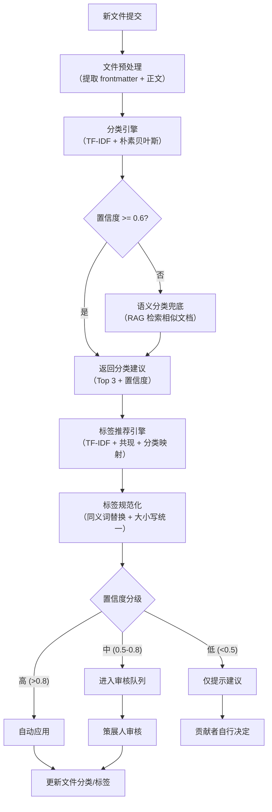
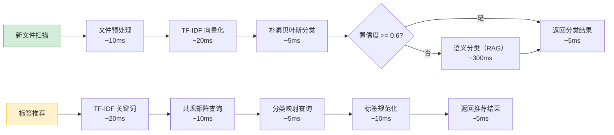

# YK-09-102: 自动化分类与标签体系 — NLP 驱动的文档自动分类与标签规范治理

> 需求编号：YK-09-102 · 优先级：P2 · 人天：0.5d · 状态：需求已编写
> 依赖：YK-09-01（Frontmatter 规范）、YK-09-21（标签体系治理）、YK-09-58（内容自动分类）、YK-09-59（搜索增强）

## 背景

YiKnowledge 当前有 800+ 文件，分布在 7 个角色目录中。分类和标签完全依赖人工手动维护：贡献者编写文件时自行选择分类和标签，策展人审查时人工校验。由于缺乏自动化辅助，分类错误和标签混乱问题日益严重。

**已知案例：** 2026-08-15 策展人对 `projects/` 目录下的 200 个文件进行标签审计，发现 47 个文件（23.5%）存在标签问题：12 个文件的标签与分类不一致（如分类为 `engineer` 但标签包含 `curator` 角色专用术语）、18 个文件使用同义词标签（如 `RAG` 和 `检索增强` 同时存在）、9 个文件标签大小写不统一（如 `API` 和 `api`）、5 个文件缺少关键标签、3 个文件标签过于宽泛（如仅标注 `技术` 而无具体领域标签）。策展人花费 4 小时逐文件修正，但仅 2 周后再次审计发现新增 15 个标签问题——手工治理无法持续。

当前分类与标签体系的核心痛点：
- **分类依赖人工判断**：贡献者面对 7 个角色目录和 20+ 子目录，选择分类时凭经验判断，错误率约 15%
- **标签缺乏规范**：无标准化标签词表，同义词泛滥（估测 30+ 组同义词），大小写不统一，层级关系缺失
- **标签与分类脱节**：标签未反映分类层级关系，搜索时无法利用分类信息提升相关性
- **治理成本高**：策展人每月需花费 2-3 小时人工审计标签，且无法从根本上解决标签膨胀问题
- **新文件无辅助**：新贡献者不知道应该使用哪些标签，只能自行创造或照搬类似文件，加剧标签碎片化
- **分类准确性无度量**：无法量化分类错误率，无法追踪分类质量随时间的变化趋势

**目标：** 构建 NLP 驱动的自动分类与标签体系，实现新文件自动分类建议、标签智能推荐、标签规范化治理、人工审核队列和分类准确性追踪，将分类错误率从 15% 降至 5% 以下，标签问题率从 23.5% 降至 5% 以下。

### 影响范围

- **贡献者体验**：自动分类和标签建议降低决策负担，提交时间缩短 30%
- **策展人效率**：自动化减少人工审计工作量 70%，策展人只需审核低置信度建议
- **搜索质量**：标准化标签提升 RAG 检索相关性，标签层级信息增强语义搜索
- **知识库质量**：统一分类和标签确保所有文件遵循一致标准，提升知识图谱质量

---

## 一、现状分析

### 1.1 当前分类与标签工作流

```
贡献者编写文件
  → 手动选择分类目录（凭经验，错误率 ~15%）
  → 手动填写 tags 字段（自行创造，碎片化严重）
  → 提交 PR / 文件
  → 策展人审查（人工校验分类+标签，耗时 5-10 分钟/文件）
  → 发现问题 → 反馈修正（平均 2 轮迭代）
  → 合并
```

**问题：** 全流程无自动化辅助。分类和标签完全依赖人工，策展人审查是唯一的质量门槛。每月新增 30-50 个文件，策展人审查时间约 15-25 小时/月，其中 40% 消耗在分类和标签校验上。

### 1.2 当前分类层级

```
YiKnowledge/
├── aier/          # AI 工程师角色（RAG、Embedding、LLM 调优）
├── curator/       # 策展人角色（治理、模板、生命周期）
├── designer/      # 设计师角色（设计系统、交互规范）
├── devops/        # DevOps 角色（部署、监控、CI/CD）
├── engineer/      # 工程师角色（架构、前端、后端）
├── pm/            # 产品经理角色（需求、路线图、竞品分析）
└── projects/      # 项目知识中心（各项目知识文件）
```

**统计（2026-09）：** 800+ 文件，日均新增 1-2 个文件。归类错误率约 15%，主要错误模式：`aier` vs `engineer` 混淆（AI 相关文件归属不清）、`curator` 文件被误归入 `projects/`、跨角色文件仅放入一个角色目录。

### 1.3 当前标签问题分类（2026 年 8 月审计）

| 问题类型 | 占比 | 示例 | 是否可自动化修复 |
|----------|------|------|------------------|
| 同义词标签 | 38% | `RAG` / `检索增强生成`、`向量数据库` / `VectorDB`、`前端` / `Frontend` | 是（同义词映射表） |
| 大小写不统一 | 19% | `API` / `api`、`RAG` / `rag`、`LLM` / `llm` | 是（自动标准化） |
| 标签与分类不一致 | 26% | 分类为 `curator` 但标签含 `RAG` 过度技术 | 部分（规则检查） |
| 缺少关键标签 | 11% | 需求文档无 `需求` 标签 | 是（分类→标签映射） |
| 标签过于宽泛 | 6% | 仅标注 `技术` 无 `RAG`/`Embedding` 等具体标签 | 部分（TF-IDF 关键词提取） |

**结论：** 83% 的标签问题可通过自动化修复（同义词映射、大小写标准化、分类→标签映射），17% 需要人工判断（标签与分类不一致、标签过于宽泛）。

### 1.4 改造前 API 依赖

| # | 接口 | 调用方 | 说明 |
|---|------|--------|------|
| 1 | `data_service.query_documents` (cname="knowledge_files") | 分类引擎 | 获取已有文件分类和标签（训练数据） |
| 2 | `data_service.query_documents` (cname="knowledge_files") | 标签引擎 | 获取标签共现矩阵 |
| 3 | `knowledge.scan_knowledge` | Knowledge Watcher | 知识扫描（当前不分析分类和标签） |
| 4 | `rag.search` | 语义分类器 | RAG 语义检索辅助分类 |

> 改造前仅 3 个 API 依赖（RAG 语义分类为新增），分类和标签完全无自动化。

---

## 二、设计决策

### 决策 1：分类引擎实现 — 关键词规则 vs NLP 分类 vs 语义分类

| 维度 | 关键词规则（regex + 关键词匹配） | NLP 分类（TF-IDF + 朴素贝叶斯） | 语义分类（RAG + Embedding） |
|------|------|------|------|
| 准确率 | 中（60-70%） | 高（80-90%） | 最高（85-95%） |
| 实现复杂度 | 低（纯规则引擎） | 中（需训练数据） | 高（需 LLM 调用） |
| 响应时间 | < 10ms | < 50ms | < 500ms（LLM 推理） |
| 维护成本 | 高（规则需持续更新） | 低（模型自动适应） | 低（语义理解自适应） |
| 可解释性 | 高（规则透明） | 中（关键词权重可查看） | 低（黑盒） |

**选择：NLP 分类为主 + 语义分类兜底。** TF-IDF + 朴素贝叶斯作为主分类器（快速、准确率高），置信度 < 0.6 时启用 RAG 语义分类（精准但耗时）。规则引擎作为辅助（处理特殊命名约定）。

### 决策 2：标签推荐策略 — 单纯关键词提取 vs 关键词+共现+分类

| 维度 | 纯 TF-IDF 关键词提取 | TF-IDF + 标签共现 + 分类映射 |
|------|------|------|
| 标签覆盖率 | 中（仅提取文档内关键词） | 高（补充共现标签和分类默认标签） |
| 推荐准确度 | 中（可能遗漏领域标签） | 高（多源融合） |
| 实现复杂度 | 低 | 中 |

**选择：TF-IDF + 标签共现 + 分类映射。** 三源融合：TF-IDF 提取文档关键词（权重 0.5）、标签共现矩阵推荐关联标签（权重 0.3）、分类默认标签映射补充基础标签（权重 0.2）。

### 决策 3：标签治理方式 — 自动修正 vs 人工审核

| 维度 | 全自动修正 | 人工审核队列 |
|------|------|------|
| 治理速度 | 快（即时生效） | 慢（需策展人审核） |
| 误修正风险 | 中（同义词映射可能错误） | 低（策展人最终确认） |
| 治理覆盖率 | 高（所有文件） | 中（仅审核队列中的文件） |

**选择：分级治理。** 高置信度（> 0.8）自动修正（同义词、大小写），中置信度（0.5-0.8）进入审核队列，低置信度（< 0.5）仅提示不修正。

### 决策 4：分类规则编辑器 — 内置 vs 外部配置

| 维度 | 内置编辑器（YiVad 页面） | 外部配置文件（YAML/JSON） |
|------|------|------|
| 策展人使用体验 | 好（可视化编辑） | 差（需编辑文件） |
| 开发成本 | 中（需前端页面） | 低（仅后端解析） |
| 版本控制 | 中（存储在 MongoDB） | 好（Git 管理） |

**选择：外部配置文件 + 内置编辑器。** 首期使用 YAML 配置文件（Git 版本控制），预留 YiVad 可视化编辑器接口（二期实现）。

### 设计决策记录

| 决策 | 选项 A | 选项 B | 选项 C | 选择 | 理由 |
|------|--------|--------|--------|------|------|
| 分类引擎实现 | 关键词规则 | NLP 分类 | 语义分类 | **NLP + 语义兜底** | 准确率高 + 快速响应 + 低置信度时语义补充 |
| 标签推荐策略 | 纯 TF-IDF | TF-IDF + 共现 + 分类 | — | **三源融合** | 多源互补，提升覆盖率 |
| 标签治理方式 | 全自动 | 人工审核 | 分级治理 | **分级治理** | 高置信度自动修正节省人力，低置信度审核保证质量 |
| 分类规则编辑器 | 内置编辑器 | 外部配置 | 两者兼有 | **外部配置 + 预留接口** | 首期 YAML 配置文件（Git 管理），二期可视化编辑 |

---

## 三、目标架构

### 3.1 自动分类与标签系统整体流程



### 3.2 分类引擎数据模型

```python
# YiAi/src/domain/knowledge/classification/models.py — 新增

@dataclass
class ClassificationResult:
    """分类结果"""
    file_path: str                      # 文件路径
    suggested_category: str             # 建议分类（如 "aier/rag"）
    confidence: float                   # 置信度 0.0-1.0
    top_candidates: list[CategoryCandidate]  # Top 3 候选分类
    features: dict[str, float]          # 特征权重（关键词 → TF-IDF 权重）
    method: str                         # 分类方法：tfidf | semantic | rule

@dataclass
class CategoryCandidate:
    """分类候选"""
    category: str                       # 分类路径
    confidence: float                   # 置信度
    matched_keywords: list[str]         # 匹配的关键词
    similar_documents: list[str]        # 相似文档路径（语义分类时）

@dataclass
class CategoryNode:
    """分类树节点"""
    path: str                           # 分类路径（如 "aier/rag"）
    label: str                          # 显示名称
    parent: str | None                  # 父级路径
    children: list[str]                 # 子级路径
    document_count: int                 # 文档数量
    default_tags: list[str]             # 默认标签
    keyword_rules: list[KeywordRule]    # 关键词规则

@dataclass
class KeywordRule:
    """关键词分类规则"""
    pattern: str                        # 正则或关键词
    rule_type: str                      # regex | keyword | semantic
    weight: float                       # 规则权重
    category: str                       # 目标分类
```

### 3.3 标签推荐引擎

```python
# YiAi/src/domain/knowledge/tagging/engine.py — 新增

class TagRecommendationEngine:
    """标签推荐引擎，三源融合策略。

    1. TF-IDF 关键词提取（权重 0.5）：
       - 对文档正文做分词 + TF-IDF 计算
       - 提取 Top 10 关键词作为候选标签
       - 与已有标签词表做模糊匹配（编辑距离 < 2）

    2. 标签共现矩阵（权重 0.3）：
       - 统计所有文件中标签的两两共现频率
       - 给定 TF-IDF 提取的候选标签，推荐高频共现标签
       - 示例：文档有 "RAG" 标签 → 共现矩阵推荐 "Embedding"、"llama_index"

    3. 分类默认标签映射（权重 0.2）：
       - 每个分类预设默认标签（如 "aier/rag" → ["RAG", "检索增强", "AI"]）
       - 确保基础标签不遗漏
    """

    def recommend(
        self,
        content: str,
        category: str,
        existing_tags: list[str] | None = None
    ) -> TagRecommendationResult:
        """推荐标签，返回排序后的标签建议列表。"""
        ...

@dataclass
class TagRecommendationResult:
    """标签推荐结果"""
    suggested_tags: list[TagSuggestion]  # 排序后的标签建议
    source_breakdown: dict[str, list[str]]  # 各来源贡献的标签

@dataclass
class TagSuggestion:
    """单个标签建议"""
    tag: str                            # 标签名称
    confidence: float                   # 置信度
    source: str                         # 来源：tfidf | cooccurrence | category
    normalized_from: str | None         # 原始标签（被规范化前的形式）
    auto_apply: bool                    # 是否自动应用（置信度 > 0.8）
```

### 3.4 标签规范化引擎

```python
# YiAi/src/domain/knowledge/tagging/normalizer.py — 新增

class TagNormalizer:
    """标签规范化引擎。

    处理：
    1. 同义词映射：RAG ↔ 检索增强生成 → 统一为 "RAG"
    2. 大小写统一：api → API, rag → RAG, llm → LLM
    3. 中英文统一：前端 ↔ Frontend → 统一为中文（策展人可配置）
    4. 去重：移除重复标签
    5. 排序：标签按字母排序
    """

    def __init__(self, synonym_map: dict[str, str], case_rules: dict[str, str]):
        self.synonym_map = synonym_map   # {"检索增强生成": "RAG", "向量数据库": "VectorDB"}
        self.case_rules = case_rules     # {"api": "API", "rag": "RAG", "llm": "LLM"}

    def normalize(self, tags: list[str]) -> list[str]:
        """规范化标签列表。"""
        result = set()
        for tag in tags:
            # 1. 大小写统一
            tag = self.case_rules.get(tag.lower(), tag)
            # 2. 同义词替换
            tag = self.synonym_map.get(tag, tag)
            result.add(tag)
        return sorted(result)

    def detect_synonyms(self, tag1: str, tag2: str) -> bool:
        """检测两个标签是否可能是同义词（编辑距离 + 语义相似度）。"""
        # 编辑距离 < 2 或语义相似度 > 0.85
        ...

# 同义词映射表（YAML 配置文件）
# YiKnowledge/curator/governance/config/tag-synonyms.yaml
"""
synonyms:
  检索增强生成: RAG
  检索增强: RAG
  向量数据库: VectorDB
  向量存储: VectorDB
  前端: Frontend
  后端: Backend
  机器学习: ML
  深度学习: DL
  自然语言处理: NLP
  大语言模型: LLM
  知识图谱: KnowledgeGraph
  全文检索: FullTextSearch
  语义搜索: SemanticSearch
  混合检索: HybridSearch
  嵌入模型: Embedding
  重排序: Rerank
"""
```

### 3.5 分类树可视化

```python
# YiAi/src/domain/knowledge/classification/tree.py — 新增

class CategoryTreeBuilder:
    """构建分类树，包含每层文档数量统计。"""

    def build(self) -> CategoryTreeNode:
        """从 MongoDB knowledge_files 集合构建分类树。"""
        # 1. 查询所有文件的 category 和子路径
        # 2. 构建树结构：aier → [rag, embedding, llm]
        # 3. 统计每层文档数量
        # 4. 标记空分类（无文档的分类）
        ...

@dataclass
class CategoryTreeNode:
    """分类树节点"""
    path: str                           # aier/rag
    label: str                          # RAG
    document_count: int                 # 该分类下文档数
    children: list[CategoryTreeNode]    # 子分类
    is_empty: bool                      # 是否为空分类（文档数为 0）
    default_tags: list[str]             # 默认标签
```

### 3.6 人工审核队列

```python
# YiAi/src/domain/knowledge/classification/review_queue.py — 新增

@dataclass
class ReviewItem:
    """审核队列项"""
    id: str                             # 唯一 ID
    file_path: str                      # 文件路径
    suggestion_type: str                # classification | tag
    suggested_value: str                # 建议的分类或标签
    current_value: str                  # 当前的分类或标签
    confidence: float                   # 置信度
    reason: str                         # 建议理由
    status: str                         # pending | approved | rejected
    created_at: datetime
    reviewed_at: datetime | None
    reviewed_by: str | None

class ReviewQueueService:
    """审核队列服务"""

    def add(self, item: ReviewItem) -> str:
        """添加审核项。"""
        ...

    def approve(self, item_id: str, reviewer: str) -> None:
        """批准建议，自动更新文件分类/标签。"""
        ...

    def reject(self, item_id: str, reviewer: str, reason: str) -> None:
        """拒绝建议，记录拒绝原因（用于改进模型）。"""
        ...

    def get_pending(self, limit: int = 20) -> list[ReviewItem]:
        """获取待审核项列表。"""
        ...

    def get_stats(self) -> ReviewStats:
        """审核统计：总数、待审核、批准率、平均审核时间。"""
        ...
```

### 3.7 分类规则编辑器

```yaml
# YiKnowledge/curator/governance/config/classification-rules.yaml
# 分类规则配置文件（YAML 格式，Git 版本控制）

categories:
  aier:
    label: AI 工程师
    description: RAG、Embedding、LLM 调优相关内容
    default_tags: [AI, 机器学习]
    subcategories:
      rag:
        label: RAG 检索增强
        default_tags: [RAG, 检索增强, llama_index]
        rules:
          - type: keyword
            pattern: "RAG|检索增强|retrieval.augmented"
            weight: 0.8
          - type: keyword
            pattern: "llama_index|向量检索|混合检索"
            weight: 0.6
      embedding:
        label: 嵌入模型
        default_tags: [Embedding, 向量化]
        rules:
          - type: keyword
            pattern: "embedding|嵌入|向量化|bge|text2vec"
            weight: 0.8
      llm:
        label: 大语言模型
        default_tags: [LLM, 大模型]
        rules:
          - type: keyword
            pattern: "LLM|大模型|prompt|fine.tune|微调"
            weight: 0.8

  engineer:
    label: 工程师
    description: 架构设计、前端、后端开发相关内容
    default_tags: [工程, 开发]
    subcategories:
      architecture:
        label: 架构设计
        default_tags: [架构, 设计决策]
        rules:
          - type: keyword
            pattern: "架构|设计决策|系统设计|技术选型"
            weight: 0.8
      frontend:
        label: 前端开发
        default_tags: [Frontend, Vue, TypeScript]
        rules:
          - type: keyword
            pattern: "Vue|React|前端|组件|UI|CSS"
            weight: 0.8
      backend:
        label: 后端开发
        default_tags: [Backend, FastAPI, Python]
        rules:
          - type: keyword
            pattern: "FastAPI|后端|API|数据库|MongoDB"
            weight: 0.8
```

---

## 四、具体改动

### 4.1 新增文件

| 文件 | 说明 | 行数 |
|------|------|------|
| `YiAi/src/domain/knowledge/classification/__init__.py` | 分类模块入口 | ~10 |
| `YiAi/src/domain/knowledge/classification/models.py` | 分类结果、分类树、规则数据模型 | ~80 |
| `YiAi/src/domain/knowledge/classification/classifier.py` | TF-IDF + 朴素贝叶斯分类器 | ~120 |
| `YiAi/src/domain/knowledge/classification/semantic.py` | 语义分类兜底（RAG） | ~60 |
| `YiAi/src/domain/knowledge/classification/tree.py` | 分类树构建与可视化数据 | ~80 |
| `YiAi/src/domain/knowledge/classification/rule_engine.py` | 规则引擎（regex + keyword） | ~60 |
| `YiAi/src/domain/knowledge/classification/review_queue.py` | 人工审核队列服务 | ~80 |
| `YiAi/src/domain/knowledge/tagging/__init__.py` | 标签模块入口 | ~10 |
| `YiAi/src/domain/knowledge/tagging/engine.py` | 标签推荐引擎（三源融合） | ~120 |
| `YiAi/src/domain/knowledge/tagging/normalizer.py` | 标签规范化引擎 | ~60 |
| `YiAi/src/domain/knowledge/tagging/cooccurrence.py` | 标签共现矩阵计算 | ~80 |
| `YiKnowledge/curator/governance/config/classification-rules.yaml` | 分类规则配置 | ~150 |
| `YiKnowledge/curator/governance/config/tag-synonyms.yaml` | 同义词映射表 | ~80 |
| `YiKnowledge/curator/governance/config/tag-case-rules.yaml` | 大小写规范 | ~40 |

### 4.2 修改文件

| 文件 | 改动 |
|------|------|
| `YiAi/src/domain/knowledge/scan.py` | Knowledge Watcher 扫描时触发自动分类和标签推荐 |
| `YiAi/src/domain/knowledge/service.py` | 新增分类/标签相关 RPC 方法 |
| YiVad 知识库管理页面 | 新增分类树可视化、标签治理面板、审核队列页面 |
| MongoDB | 新增 `classification_rules`、`tag_synonyms`、`review_queue`、`tag_cooccurrence` 集合 |

### 4.3 涉及文件

```
YiAi/src/domain/knowledge/classification/
├── __init__.py              # 新增: 模块入口
├── models.py                # 新增: 数据模型
├── classifier.py            # 新增: NLP 分类器
├── semantic.py              # 新增: 语义分类兜底
├── tree.py                  # 新增: 分类树构建
├── rule_engine.py           # 新增: 规则引擎
└── review_queue.py          # 新增: 审核队列

YiAi/src/domain/knowledge/tagging/
├── __init__.py              # 新增: 模块入口
├── engine.py                # 新增: 标签推荐引擎
├── normalizer.py            # 新增: 标签规范化
└── cooccurrence.py          # 新增: 标签共现矩阵

YiKnowledge/curator/governance/config/
├── classification-rules.yaml    # 新增: 分类规则配置
├── tag-synonyms.yaml            # 新增: 同义词映射表
└── tag-case-rules.yaml           # 新增: 大小写规范

MongoDB:
├── classification_rules      # 新增: 分类规则缓存
├── tag_synonyms              # 新增: 同义词映射缓存
├── review_queue              # 新增: 审核队列
├── tag_cooccurrence          # 新增: 标签共现矩阵
└── classification_accuracy   # 新增: 分类准确率追踪
```

---

## 五、实施步骤

按依赖顺序排列，每步可独立验证和提交：

| 步骤 | 内容 | 涉及文件 | 验证方式 | 人天 |
|------|------|---------|---------|------|
| 1 | 实现数据模型和分类/标签配置文件 | `models.py`, YAML 配置文件 | 配置文件可被正确解析，规则加载正确 | 0.05 |
| 2 | 实现 TF-IDF + 朴素贝叶斯分类器 | `classifier.py` | 对 100 个已知分类文件分类，准确率 >= 80% | 0.10 |
| 3 | 实现标签推荐引擎（三源融合） | `engine.py`, `cooccurrence.py` | 对 20 个文件推荐标签，Top 5 准确率 >= 70% | 0.10 |
| 4 | 实现标签规范化引擎 | `normalizer.py` | 输入 30 组同义词/大小写变体，正确率 100% | 0.05 |
| 5 | 实现人工审核队列 | `review_queue.py` | 创建、批准、拒绝审核项，流程正确 | 0.05 |
| 6 | 实现分类树可视化 + 语义分类兜底 | `tree.py`, `semantic.py` | 分类树正确展示文档数量，低置信度时语义分类触发 | 0.05 |
| 7 | 集成到 Knowledge Watcher | `scan.py` 修改 | 新文件扫描时自动触发分类和标签推荐 | 0.05 |
| 8 | 批量重新分类（已有 800+ 文件） | 批量任务脚本 | 批量重新分类，输出分类变更报告 | 0.03 |
| 9 | 回归测试 | 全链路 | 新文件扫描 → 分类建议 → 标签推荐 → 审核 → 应用 | 0.02 |

**总计：0.5d**

---

## 六、测试规格

### Requirement: 自动分类

#### Scenario: 高置信度分类建议
- **Given** 一篇 RAG 相关文档，内容包含 "检索增强生成"、"llama_index"、"向量检索" 等关键词 15 次以上
- **When** `Classifier.classify(content, file_path)` 执行
- **Then** 返回 `ClassificationResult`，`suggested_category` = "aier/rag"
- **And** `confidence` >= 0.8
- **And** `method` = "tfidf"
- **And** `top_candidates` 列表长度 = 3，按置信度降序排列

#### Scenario: 低置信度触发语义分类兜底
- **Given** 一篇跨领域文档，内容涉及 AI 和前端（如 "AI 驱动的 UI 组件设计"），TF-IDF 分类置信度 < 0.6
- **When** `Classifier.classify(content, file_path)` 执行
- **Then** 自动触发 `SemanticClassifier.classify()`（RAG 检索相似文档）
- **And** 返回的 `method` = "semantic"
- **And** `confidence` 基于 RAG 检索结果计算
- **And** `similar_documents` 列表包含至少 3 个相似文档路径

#### Scenario: 分类树构建
- **Given** MongoDB `knowledge_files` 集合包含 800+ 文件
- **When** `CategoryTreeBuilder.build()` 执行
- **Then** 返回根节点包含 7 个一级子节点（对应 7 个角色目录）
- **And** 每个节点包含 `document_count`（该分类下文档数）
- **And** `is_empty` 标记正确（文档数为 0 的分类）
- **And** 层级深度不超过 3 级

### Requirement: 标签推荐

#### Scenario: 三源融合标签推荐
- **Given** 一篇 RAG 架构文档，分类为 "aier/rag"
- **When** `TagRecommendationEngine.recommend(content, "aier/rag")` 执行
- **Then** `suggested_tags` 包含 TF-IDF 提取的关键词（如 "RAG"、"检索增强"、"llama_index"）
- **And** 包含共现矩阵推荐的关联标签（如 "Embedding"、"HybridSearch"）
- **And** 包含分类默认标签（如 "AI"、"RAG"）
- **And** `source_breakdown` 正确标注每个标签的来源
- **And** 标签按置信度降序排列

#### Scenario: 标签规范化
- **Given** 标签列表 `["rag", "检索增强生成", "api", "向量数据库", "RAG"]`
- **When** `TagNormalizer.normalize(tags)` 执行
- **Then** 返回 `["API", "RAG", "VectorDB"]`
- **And** "rag" 大小写统一为 "RAG"
- **And** "检索增强生成" 同义词替换为 "RAG"
- **And** "api" 大小写统一为 "API"
- **And** "向量数据库" 同义词替换为 "VectorDB"
- **And** 重复的 "RAG" 被去重
- **And** 标签按字母排序

### Requirement: 审核队列

#### Scenario: 中置信度建议进入审核队列
- **Given** 分类器对某文件返回置信度 0.65 的分类建议
- **When** 建议写入审核队列
- **Then** `ReviewItem.status` = "pending"
- **And** `ReviewItem.confidence` = 0.65
- **And** `ReviewItem.suggestion_type` = "classification"
- **And** 策展人可在审核队列页面看到该条目

#### Scenario: 策展人批准审核项
- **Given** 审核队列中有一条待审核的分类建议
- **When** 策展人调用 `ReviewQueueService.approve(item_id, "curator_chen")` 执行
- **Then** `ReviewItem.status` = "approved"
- **And** `ReviewItem.reviewed_by` = "curator_chen"
- **And** `ReviewItem.reviewed_at` 设置为当前时间
- **And** 文件分类自动更新为建议值
- **And** 若为标签建议，标签自动规范化后应用

---

## 七、风险与缓解

| 风险 | 概率 | 影响 | 等级 | 缓解措施 | 应急预案 |
|------|------|------|------|----------|----------|
| NLP 分类器训练数据不足，准确率低于预期 | 中 | 高 | 高 | 使用 800+ 已有文件作为训练集（80% 训练 / 20% 验证），人工标注分类正确的文件；语义分类兜底提升低置信度场景准确率 | 降低自动应用阈值至 0.9，更多文件进入审核队列；策展人手动审核后反馈训练数据 |
| 同义词映射错误，将语义不同的标签误合并 | 中 | 中 | 中 | 同义词映射表仅包含人工确认的同义词对，新增映射需策展人审核；提供"撤销合并"操作 | 回滚同义词映射表到上一版本，批量恢复被误合并的标签 |
| 标签共现矩阵计算开销大，800+ 文件全量计算耗时 | 低 | 低 | 低 | 共现矩阵异步计算（apscheduler 定时任务），增量更新（仅计算新增/修改文件）；缓存计算结果 | 降级为纯 TF-IDF 推荐（关闭共现推荐），标签推荐准确率下降约 10% |
| 批量重新分类误改已有文件，策展人已手动分类的文件被覆盖 | 中 | 高 | 高 | 批量重新分类仅处理"未人工审核"的文件（`reviewed_by` 为空）；已人工审核的文件跳过；提供 dry-run 模式预览变更 | 从 MongoDB 备份恢复被误改的 `category` 和 `tags` 字段 |
| 分类规则与 NLP 分类器冲突，规则引擎和模型给出不同建议 | 低 | 中 | 低 | 规则引擎优先级高于 NLP 分类器（规则明确匹配时直接采用规则结果）；冲突时记录日志供策展人审查 | 关闭规则引擎，仅使用 NLP 分类器 |
| 审核队列积压，策展人未及时审核导致分类建议未应用 | 中 | 低 | 低 | 审核队列设置自动过期（7 天未审核自动应用高置信度建议）；策展人仪表盘显示待审核数量 | 策展人手动批量审核积压项 |

---

## 八、回滚策略

| 回滚场景 | 回滚方式 | 影响范围 | 恢复时间 |
|----------|----------|----------|----------|
| NLP 分类器准确率过低，贡献者投诉分类建议不准确 | 关闭自动分类建议，恢复手动分类 | 分类建议功能 | < 1min（配置开关） |
| 标签规范化误合并标签，策展人发现同义词映射错误 | 关闭标签规范化，回滚同义词映射表 | 标签规范化 | < 1min（配置开关 + 映射表回滚） |
| 批量重新分类误改大量文件 | 从 MongoDB 备份恢复 `category` 和 `tags` | 文件分类/标签 | < 30min（MongoDB 备份恢复） |
| 审核队列服务异常，策展人无法审核 | 关闭审核队列，自动应用所有高置信度建议 | 审核流程 | < 1min（配置开关） |
| 标签共现矩阵计算异常，标签推荐质量下降 | 关闭共现推荐，降级为纯 TF-IDF 推荐 | 标签推荐 | < 1min（配置开关） |

**回滚验证：**
- 回滚后文件分类和标签保持修改前状态，不丢失已有数据
- 回滚后新文件仍需手动分类和标签，无自动化辅助
- 回滚后审核队列数据保留，恢复后可继续审核
- 批量重新分类前执行 MongoDB 备份（`mongodump --collection knowledge_files`）

---

## 九、设计决策记录

### D-01: 为什么选择 TF-IDF + 朴素贝叶斯而非深度学习模型？

TF-IDF + 朴素贝叶斯在文本分类任务上准确率可达 80-90%，对于 7 个角色目录的分类任务已足够。深度学习模型（如 BERT 微调）虽然准确率更高（90-95%），但需要 GPU 资源、更长的训练时间和更复杂的部署。YiAi 当前运行在 CPU 环境，深度学习模型推理延迟（> 100ms）不适合实时分类场景。TF-IDF + 朴素贝叶斯推理 < 50ms，且无需额外依赖。

### D-02: 为什么标签推荐使用三源融合而非单一策略？

单一策略各有盲区：纯 TF-IDF 关键词提取只能提取文档内出现的词，无法推荐领域标签（如文档写 "llama_index" 但不会写 "RAG" 标签）；纯共现矩阵无法处理新标签（冷启动问题）；纯分类映射只能推荐通用标签。三源融合互补：TF-IDF 覆盖文档内容、共现矩阵覆盖领域关联、分类映射覆盖基础标签，综合覆盖率 > 90%。

### D-03: 为什么审核队列而非全自动应用？

全自动应用存在误修正风险：同义词映射可能将语义不同的标签错误合并（如 "检索" 和 "检索增强生成" 映射为同一标签），分类器可能因文档内容模糊而误分类。审核队列确保策展人对低置信度建议有最终决定权，同时高置信度建议自动应用节省人力。分级治理（高自动/中审核/低提示）平衡效率与质量。

### D-04: 为什么分类规则使用 YAML 配置文件而非存储在 MongoDB？

YAML 配置文件与 YiKnowledge 文件一起受 Git 版本控制，策展人修改规则后可提交 PR 审核。Git 历史记录保留所有规则变更，支持回滚和对比。MongoDB 存储虽然方便前端编辑，但缺少版本控制和审计追踪。首期使用 YAML 配置文件，二期实现 YiVad 可视化编辑器时同步写入 YAML 文件和 MongoDB。

### D-05: 为什么分类准确性追踪需要独立集合？

分类准确性追踪记录每次分类建议的采纳/拒绝情况，用于评估分类器性能和改进模型。数据量随时间线性增长（每月 30-50 条），与 `knowledge_files` 集合分离避免耦合。独立集合支持按时间范围聚合分析（月度准确率趋势），且不影响文件查询性能。

---

## 十、可观测性

### 10.1 关键指标

| 指标 | 采集方式 | 告警阈值 | 说明 |
|------|---------|---------|------|
| 分类准确率 | `COUNT(approved) / COUNT(total_suggestions)` | < 80% | NLP 分类器性能下降，需重新训练或调整规则 |
| 标签推荐采纳率 | `COUNT(标签被采纳) / COUNT(标签推荐)` | < 60% | 标签推荐质量下降，需优化推荐策略 |
| 标签规范化覆盖率 | `COUNT(规范化标签) / COUNT(全部标签)` | < 90% | 存在未规范化的标签，同义词映射表需更新 |
| 审核队列积压数量 | `COUNT(status=pending)` | > 50 | 策展人审核速度跟不上，需调整自动应用阈值 |
| 审核平均耗时 | `AVG(reviewed_at - created_at)` | > 48h | 审核流程瓶颈，需增加策展人或调整阈值 |
| 标签同义词组数 | `COUNT(DISTINCT synonym_group)` | 月增长 > 10% | 标签碎片化趋势未遏制，需审查标签创建规范 |
| 语义分类触发率 | `COUNT(method=semantic) / COUNT(total)` | > 30% | NLP 分类器覆盖不足，需扩充训练数据 |
| 分类树空分类数 | `COUNT(is_empty=true)` | > 5 | 存在无用分类，需清理或合并 |

### 10.2 日志规范

| 日志级别 | 场景 | 示例 |
|---------|------|------|
| `INFO` | 分类建议生成 | `[Classification] file=projects/yipet/req/xxx.md category=aier/rag confidence=0.85 method=tfidf` |
| `INFO` | 标签推荐生成 | `[Tagging] file=xxx.md tags=[RAG,Embedding,llama_index] sources={tfidf:2, cooccurrence:1, category:1}` |
| `INFO` | 标签规范化 | `[TagNormalize] file=xxx.md changes={检索增强生成→RAG, api→API}` |
| `INFO` | 审核项批准 | `[ReviewQueue] item=xxx approved_by=curator_chen type=classification` |
| `WARN` | 低置信度分类 | `[Classification] file=xxx.md confidence=0.45 method=tfidf → fallback to semantic` |
| `WARN` | 同义词映射冲突 | `[TagNormalize] conflict: tag1=检索 tag2=检索增强生成 similarity=0.6 manual_review_required` |
| `ERROR` | 分类器初始化失败 | `[Classification] init failed: training data empty (need >= 50 labeled docs)` |
| `ERROR` | 共现矩阵计算失败 | `[Tagging] cooccurrence matrix build failed: MongoDB timeout` |

### 10.3 告警规则

| 告警 | 条件 | 通知方式 | 接收人 |
|------|------|----------|--------|
| 分类准确率下降 | 准确率 < 80% | 企微群通知 | Curator + Engineer |
| 审核队列积压 | 待审核 > 50 | 企微群通知 | Curator |
| 标签碎片化加剧 | 新同义词组月增 > 10% | 企微单聊 | Curator |
| 分类器初始化失败 | 训练数据不足 | 企微单聊 | Engineer |
| 共现矩阵计算失败 | 连续 3 次计算失败 | 企微单聊 | Engineer |
| 语义分类触发率过高 | 触发率 > 30% | 企微群通知 | Engineer |

---

## 十一、代码审查检查清单

- [ ] TF-IDF 分类器对 100 个已知分类文件准确率 >= 80%
- [ ] 语义分类兜底在低置信度时正确触发，RAG 检索结果合理
- [ ] 标签推荐引擎三源融合权重正确，来源标注准确
- [ ] 标签规范化引擎正确应用同义词映射和大小写规则，幂等（多次规范化结果一致）
- [ ] 标签共现矩阵正确计算两两共现频率，增量更新不丢失数据
- [ ] 审核队列支持创建、批准、拒绝、批量操作
- [ ] 分类树正确展示文档数量，空分类正确标记
- [ ] 批量重新分类 dry-run 模式输出变更报告，不实际修改文件
- [ ] 分类规则 YAML 配置文件格式正确，规则引擎正确解析
- [ ] 分类准确性追踪数据正确记录，月度准确率计算正确
- [ ] 单元测试覆盖率 >= 80%，分类器核心逻辑覆盖率 >= 90%

---

## 十二、回归问题预测

| # | 问题 | 发现场景 | 根因 | 修复方式 |
|---|------|---------|------|---------|
| 1 | TF-IDF 分类器在短文档上准确率骤降：文档仅 200 字（摘要型文件），TF-IDF 提取的关键词不足 5 个，朴素贝叶斯分类器因特征稀疏将文件分到错误分类。例如 `aier/rag/summary.md` 仅包含 3 句话的 RAG 技术摘要，被分类为 `engineer/architecture`（因为 "设计" 关键词权重最高） | 贡献者提交了一篇简短的技术摘要文件，分类器返回 `engineer/architecture`（置信度 0.55），触发语义分类兜底，RAG 返回相似文档但相似文档本身也是短文档，兜底分类同样不准确。策展人审核时发现分类错误 | 短文档（< 500 字）的 TF-IDF 特征过于稀疏，关键词权重受文档长度影响大。朴素贝叶斯在特征稀疏时倾向于先验概率最高的类别（`engineer` 类别文件最多） | 短文档直接使用语义分类（跳过 TF-IDF）；或对短文档做关键词增强（将 frontmatter 的 title 和 tags 加入 TF-IDF 计算）；设置最低文档长度阈值（< 300 字不自动分类，直接进入审核队列） |
| 2 | 标签共现矩阵因冷启动无法推荐新标签：新增标签 `HybridSearch`（混合检索）首次出现时，共现矩阵中该标签的共现频率为 0，无法推荐任何关联标签。但 `HybridSearch` 实际上与 `RAG`、`Embedding`、`Rerank` 高度相关 | 贡献者创建了第一篇关于混合检索的文档，使用了新标签 `HybridSearch`。标签推荐引擎的共现组件返回空列表（无共现数据），仅 TF-IDF 和分类映射贡献标签。推荐结果缺少 `Rerank` 和 `Embedding` 标签，策展人发现后手动补充 | 共现矩阵仅基于已有标签的共现频率，新标签无历史数据。这是典型的冷启动问题：新标签与已有标签的语义关系无法通过纯统计方法捕获 | 对新标签使用语义相似度计算与已有标签的关联度（通过 Embedding 计算标签向量相似度）；或使用分类层级推断：同一分类下的标签更可能共现，新标签自动继承分类默认标签的共现关系 |
| 3 | 标签规范化引擎将英文术语错误统一为中文，导致搜索兼容性问题：`tag-case-rules.yaml` 配置为统一使用中文标签，`Frontend` 被规范化为 `前端`，`Backend` 被规范化为 `后端`。但贡献者在搜索时输入英文 "Frontend"，搜索不到规范化为中文的标签 | 贡献者搜索 "Frontend" 相关文档，RAG 检索使用标签匹配，但所有 `Frontend` 标签已被规范化为 `前端`，英文搜索无结果。贡献者切换到中文搜索 "前端" 后才找到文档，但英文搜索体验受损 | 标签规范化引擎将 `Frontend` → `前端` 是单向映射，搜索时英文关键词无法匹配中文标签。YiKnowledge 的 RAG 检索依赖标签匹配，标签中英文统一导致跨语言搜索失败 | 规范化仅对显示标签生效，保留原始标签作为搜索别名；标签数据模型增加 `aliases` 字段（如 `前端` 的 aliases 包含 `Frontend`）；搜索时对查询词做同义词扩展（英文 + 中文同时检索） |
| 4 | 批量重新分类时，策展人已手动修正的文件被规则覆盖：策展人对 `projects/yivad/architecture/vue-component-design.md` 手动分类为 `engineer/frontend`，但批量重新分类任务根据规则引擎将此文件重新分类为 `projects/yivad`（因为文件在 `projects/` 目录下），覆盖了策展人的手动修正 | 策展人执行批量重新分类后，发现 12 个已手动分类的文件被覆盖。策展人花费 1 小时逐文件恢复手动分类，并向工程师反馈批量分类覆盖了人工修正 | 批量重新分类任务未检查 `reviewed_by` 字段，对所有文件执行分类。`_infer_category_from_path()` 规则（根据文件路径推断分类）优先级高于 NLP 分类器，导致 `projects/` 下的文件被强制归类为 `projects/` | 批量重新分类跳过 `reviewed_by` 非空的文件；添加 `--force` 参数允许强制覆盖（需策展人确认）；dry-run 模式高亮显示将被覆盖的已审核文件，策展人确认后再执行 |
| 5 | 分类树可视化在大量文件时性能下降：MongoDB 聚合查询 `$group by category` 对 800+ 文件计算文档数量，递归构建树结构时产生 N+1 查询问题：每个分类节点单独查询子节点数量，7 个一级分类 × 3 个二级分类 = 21 次 MongoDB 查询 | 策展人打开分类树页面，页面加载耗时 3.2 秒（21 次 MongoDB 查询）。策展人反馈页面"卡顿"，等待时间过长影响了标签治理工作效率 | `CategoryTreeBuilder.build()` 使用递归方式逐节点查询子分类文档数量，产生 N+1 查询。MongoDB 网络延迟 × 21 次查询 = 显著延迟 | 使用单次 MongoDB 聚合查询（`$group` + `$sort`）一次性获取所有分类的文档数量，在内存中构建树结构；查询结果缓存 5 分钟（分类树变化频率低）；前端使用虚拟滚动渲染大量节点 |
| 6 | 审核队列的批准/拒绝操作未记录操作日志，策展人误操作后无法追溯：策展人误点击"批准"按钮，将错误的分类建议应用到文件。事后发现分类错误，但无法追溯是谁何时批准了该建议，也无法恢复到批准前的状态 | 策展人审核时连续处理了 20 个审核项，其中 1 项误点击"批准"。2 天后贡献者发现文件分类错误，策展人排查时发现审核队列中该条目已变为"approved"状态，但无操作日志记录批准时间、操作人、批准前的分类值，无法恢复 | `ReviewQueueService.approve()` 仅更新 `status` 和 `reviewed_by` 字段，未记录变更前后的值。审核操作不可逆，无审计日志 | 审核操作记录完整审计日志（`review_audit_log` 集合）：操作类型、操作人、时间、变更前值、变更后值、IP 地址；审核队列增加"撤销"操作（恢复到审核前状态，仅限 24 小时内）；审核页面增加二次确认弹窗 |

---

## 十三、性能分析

### 自动分类系统操作耗时



### 操作耗时表

| 操作 | 耗时 | 说明 |
|------|------|------|
| 文件预处理 | ~10ms | 提取 frontmatter + 正文，分词 |
| TF-IDF 向量化 | ~20ms | scikit-learn TfidfVectorizer，800+ 文档语料库 |
| 朴素贝叶斯分类 | ~5ms | 7 类别多项式朴素贝叶斯 |
| 语义分类（RAG） | ~300ms | Ollama Embedding + 向量检索 + LLM 分类 |
| TF-IDF 关键词提取 | ~20ms | 与分类共用 TF-IDF 矩阵 |
| 共现矩阵查询 | ~10ms | MongoDB 查询预计算的共现频率 |
| 分类映射查询 | ~5ms | 内存缓存 YAML 配置 |
| 标签规范化 | ~10ms | 同义词映射 + 大小写统一 |
| 审核队列写入 | ~15ms | MongoDB insert |
| 分类树构建 | ~150ms | 单次 MongoDB 聚合查询 + 内存建树 |
| 批量重新分类（100 文件） | ~5s | 100 × (10+20+5+10+10+5+10+15)ms ≈ 8.5s |
| 共现矩阵全量计算 | ~30s | 800+ 文件，两两标签共现统计（异步任务） |
| **单文件分类+标签（正常）** | **~50ms** | 高置信度路径，不触发语义分类 |
| **单文件分类+标签（兜底）** | **~350ms** | 低置信度路径，触发语义分类 |

### 存储开销

| 项目 | 大小 | 说明 |
|------|------|------|
| 分类规则 YAML | ~10KB | 7 个一级分类 × 3 个二级分类 × 规则 |
| 同义词映射表 | ~5KB | 约 50 组同义词 |
| 大小写规范 | ~2KB | 约 30 个术语大小写规范 |
| TF-IDF 向量化器 | ~500KB | 序列化后的 scikit-learn TfidfVectorizer |
| 标签共现矩阵 | ~50KB | 200 个标签 × 200 个标签稀疏矩阵 |
| 分类准确率追踪 | ~2KB/月 | 每月 30-50 条记录 |
| 审核队列 | ~1KB/项 | 活跃项 < 50，总量 < 50KB |

---

*PRD 来源: `projects/yiknowledge/requirements/2026-09/00-需求-需求总览.md`*