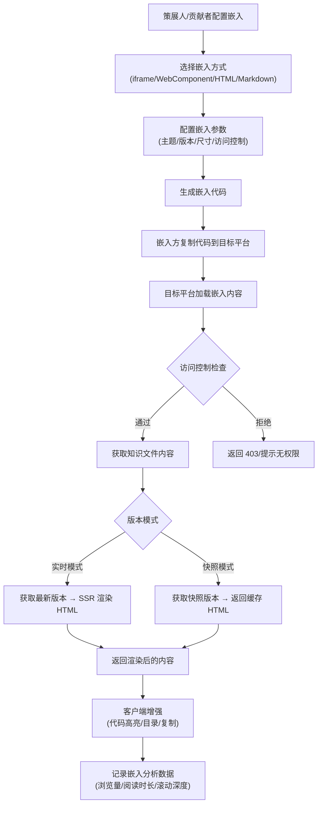
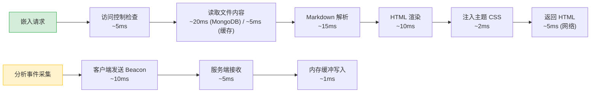

# YK-09-103: 内容嵌入与外部发布 — 知识库内容嵌入外部平台与多渠道分发

> 需求编号：YK-09-103 · 优先级：P2 · 人天：0.3d · 状态：需求已编写
> 依赖：YK-09-17（访问控制）、YK-09-30（静态站点生成）、YK-09-95（多语言内容管理）

## 背景

YiKnowledge 当前有 800+ 文件，内容仅在知识库内部可访问。其他项目（YiVad、YiPet）和外部平台需要引用知识库内容时，只能通过手动复制粘贴或截图的方式分享，内容更新后引用方无法同步。随着知识库内容质量提升，越来越多的场景需要将知识库内容嵌入到外部平台。

**已知案例：** 2026-08-22 YiVad 前端团队开发新功能时需要参考 `engineer/frontend/vue-composable-patterns.md`，开发者在 YiVad 管理后台添加了一个"参考文档"链接，指向 YiKnowledge 的 Git 仓库文件。但该方式存在 3 个问题：(1) 链接指向 Git 仓库的原始 Markdown，无渲染样式，阅读体验差；(2) 文件更新后 Git 链接指向的是最新版本，开发者无法锁定特定版本，当文档发生破坏性变更时前端代码与新文档不一致；(3) 无法统计文档在 YiVad 中的阅读量和引用情况。产品经理需要将需求文档嵌入到项目 Wiki，但只能手动复制 Markdown 内容，每次文档更新后需重新复制。

当前内容引用的痛点：
- **无嵌入能力**：知识库内容无法嵌入外部平台，只能通过链接或手动复制分享
- **无版本锁定**：引用方无法锁定特定版本，内容更新后引用的上下文可能过时
- **无访问控制**：嵌入内容无权限控制，公开嵌入可能导致内部文档泄露
- **无使用分析**：无法追踪嵌入内容在外部平台的阅读量、阅读时长和引用情况
- **无样式适配**：嵌入内容使用固定样式，无法适配不同平台的 UI 风格（暗色/亮色主题）
- **无 SEO 支持**：公开嵌入的内容无法被搜索引擎索引

**目标：** 构建内容嵌入与外部发布系统，支持 iframe、Web Component、静态 HTML 导出和 Markdown 原始格式 4 种嵌入方式，提供访问控制、嵌入分析、版本锁定和主题适配能力，让知识库内容安全地在外部平台流通。

### 影响范围

- **外部平台**：YiVad、YiPet、外部网站可嵌入知识库内容，减少手动复制工作量
- **贡献者**：内容被嵌入时可追踪引用情况，了解内容影响力
- **策展人**：嵌入分析数据帮助判断内容价值，指导内容优化方向
- **SEO**：公开嵌入内容可被搜索引擎索引，提升知识库可见度

---

## 一、现状分析

### 1.1 当前内容引用方式

```
外部平台需要引用知识库内容
  → 方式 1: 复制 Markdown 原文 → 粘贴到目标平台（内容无法同步更新）
  → 方式 2: 截图知识库页面 → 粘贴为图片（不可搜索、不可复制）
  → 方式 3: 链接到 Git 仓库原始文件 → 无渲染样式、无版本锁定
  → 方式 4: 手动重写为 HTML → 嵌入目标平台（维护成本高）
```

**问题：** 4 种方式均为手动操作，内容更新后需重复操作。无统一嵌入标准，各平台嵌入体验不一致。

### 1.2 当前内容引用场景统计（2026 年 8 月）

| 引用场景 | 频次 | 当前方式 | 痛点 |
|----------|------|----------|------|
| YiVad 管理后台引用参考文档 | 每周 3-5 次 | 链接到 Git 仓库 | 无样式渲染、无版本锁定、无阅读统计 |
| YiPet 扩展显示帮助内容 | 每周 1-2 次 | 手动复制 Markdown | 内容更新后不同步、样式不一致 |
| 项目 Wiki 引用需求文档 | 每月 5-8 次 | 手动复制 Markdown | 重复劳动、版本混乱 |
| 外部网站引用公开文档 | 每月 1-2 次 | 手动重写 HTML | 工作量大、维护成本高 |
| 企微群分享知识 | 每天 2-3 次 | 截图或链接 | 不可搜索、体验差 |

**结论：** 内容引用需求频繁但无标准化方案，每周约 10-15 次手动操作，消耗大量时间且体验差。

### 1.3 嵌入技术方案对比

| 嵌入方式 | 实现复杂度 | 样式隔离 | 版本锁定 | 交互能力 | SEO | 适用场景 |
|----------|------|------|------|------|------|------|
| iframe | 低 | 天然隔离 | 支持（URL 参数） | 完整 | 差（iframe 内容不被索引） | 后台管理系统、内部工具 |
| Web Component | 中 | Shadow DOM 隔离 | 支持（属性配置） | 完整 | 好（可 SSR） | 外部网站、文档站 |
| 静态 HTML 导出 | 低 | 无（需自行处理） | 天然锁定（导出时快照） | 有限（纯静态） | 最好 | 静态站点、邮件 |
| Markdown 原始 | 最低 | 无 | 支持（版本号） | 无 | 好（纯文本） | API 集成、自动化处理 |

### 1.4 改造前 API 依赖

| # | 接口 | 调用方 | 说明 |
|---|------|--------|------|
| 1 | `data_service.query_documents` (cname="knowledge_files") | 嵌入服务 | 获取知识文件内容 |
| 2 | `/read-file` | 嵌入服务 | 读取原始 Markdown 文件 |
| 3 | `data_service.query_documents` (cname="embed_configs") | 嵌入配置 | 嵌入配置（当前集合不存在） |
| 4 | `data_service.query_documents` (cname="embed_analytics") | 嵌入分析 | 嵌入分析数据（当前集合不存在） |

> 改造前仅 2 个 API 用于读取文件内容，嵌入配置和分析完全缺失。

---

## 二、设计决策

### 决策 1：嵌入内容渲染方式 — 服务端渲染 vs 客户端渲染

| 维度 | 服务端渲染（SSR） | 客户端渲染（CSR） |
|------|------|------|
| 首屏速度 | 快（HTML 直接输出） | 慢（需加载 JS + 请求 API） |
| SEO 支持 | 好（搜索引擎可索引） | 差（需额外处理） |
| 服务器负载 | 高（每次请求渲染） | 低（仅提供 API 数据） |
| 交互能力 | 有限（静态 HTML） | 完整（代码高亮、目录导航） |
| 缓存友好 | 高（可 CDN 缓存） | 中（需 API 缓存） |

**选择：服务端渲染为主 + 客户端增强。** Markdown 在服务端渲染为 HTML，嵌入时直接输出带样式的 HTML。客户端 JavaScript 增强交互（代码高亮、目录导航、复制按钮）。首屏速度快 + SEO 友好 + 可 CDN 缓存。

### 决策 2：嵌入访问控制 — Token 认证 vs IP 白名单 vs Referer 校验

| 维度 | Token 认证 | IP 白名单 | Referer 校验 |
|------|------|------|------|
| 安全性 | 高（加密 Token） | 中（IP 可伪造） | 低（Referer 可伪造） |
| 配置复杂度 | 低（生成 Token 即可） | 中（需维护 IP 列表） | 低（仅需配置域名） |
| 适用场景 | 内部系统、API 调用 | 固定 IP 的内部服务 | 公开网站（低安全需求） |
| 用户体验 | 中（需携带 Token） | 好（无感） | 好（无感） |

**选择：Token 认证 + Referer 校验组合。** 内部嵌入（YiVad、YiPet）使用 Token 认证，外部公开嵌入使用 Referer 校验 + 可选 Token。公开内容可配置为无需认证。

### 决策 3：版本策略 — 实时嵌入 vs 快照嵌入

| 维度 | 实时嵌入（Live） | 快照嵌入（Snapshot） |
|------|------|------|
| 内容新鲜度 | 始终最新 | 冻结在快照时点 |
| 稳定性 | 低（内容变更可能影响嵌入方） | 高（内容不变） |
| 适用场景 | 帮助文档、FAQ（需最新） | API 文档、规范（需稳定） |
| 存储成本 | 低（无额外存储） | 中（需存储快照版本） |

**选择：两种模式都支持。** 实时嵌入（`mode=live`）始终展示最新版本，适用于需要内容实时更新的场景。快照嵌入（`mode=snapshot&version=v1`）锁定特定版本，适用于 API 文档、规范等需要稳定引用的场景。默认使用实时嵌入，用户可主动创建快照。

### 决策 4：嵌入代码生成器 — 纯文本输出 vs 交互式配置

| 维度 | 纯文本输出（复制粘贴） | 交互式配置（可视化选择） |
|------|------|------|
| 实现复杂度 | 低 | 中 |
| 用户体验 | 中（需手动修改参数） | 好（下拉选择配置） |
| 开发成本 | 0.02d | 0.08d |

**选择：交互式配置（YiVad 页面）。** 提供可视化配置面板：选择嵌入方式（iframe/Web Component/HTML/Markdown）、配置主题（亮色/暗色/自动）、设置宽度高度、选择版本（实时/快照）、复制生成的代码。投入 0.06d 额外开发量大幅提升用户体验。

### 设计决策记录

| 决策 | 选项 A | 选项 B | 选项 C | 选择 | 理由 |
|------|--------|--------|--------|------|------|
| 渲染方式 | SSR | CSR | SSR + CSR 增强 | **SSR + CSR 增强** | 首屏快 + SEO 好 + 交互完整 |
| 访问控制 | Token 认证 | IP 白名单 | Referer 校验 | **Token + Referer 组合** | 内部 Token 安全，外部 Referer 轻量 |
| 版本策略 | 实时嵌入 | 快照嵌入 | 两种都支持 | **两种都支持** | 覆盖不同场景需求 |
| 代码生成器 | 纯文本 | 交互式配置 | — | **交互式配置** | 用户体验提升显著，开发量可接受 |

---

## 三、目标架构

### 3.1 嵌入系统整体流程



### 3.2 嵌入服务数据模型

```python
# YiAi/src/domain/knowledge/embed/models.py — 新增

@dataclass
class EmbedConfig:
    """嵌入配置"""
    id: str                            # 唯一 ID
    file_path: str                     # 知识文件路径
    embed_type: str                    # iframe | webcomponent | html | markdown
    mode: str                          # live | snapshot
    snapshot_version: str | None       # 快照版本号（mode=snapshot 时）
    theme: str                         # light | dark | auto
    width: str                         # 嵌入宽度（如 "100%", "800px"）
    height: str                        # 嵌入高度（如 "600px", "auto"）
    access_level: str                  # public | authenticated | token
    allowed_referers: list[str]        # 允许的 Referer 域名列表
    token_hash: str | None             # 访问 Token 的 bcrypt 哈希
    created_at: datetime
    created_by: str
    updated_at: datetime
    is_active: bool                    # 是否启用

@dataclass
class EmbedCode:
    """生成的嵌入代码"""
    embed_type: str                    # iframe | webcomponent | html | markdown
    code: str                          # 嵌入代码片段
    preview_url: str                   # 预览 URL
    config: EmbedConfig                # 嵌入配置

@dataclass
class EmbedAnalytics:
    """嵌入分析数据"""
    embed_id: str                      # 嵌入配置 ID
    file_path: str                     # 知识文件路径
    view_count: int                    # 浏览次数
    unique_viewers: int                # 独立访客数（基于 IP + User-Agent）
    total_read_time_seconds: int       # 总阅读时长（秒）
    avg_read_time_seconds: int         # 平均阅读时长（秒）
    avg_scroll_depth_pct: float        # 平均滚动深度（百分比）
    referer_domains: dict[str, int]    # 来源域名统计
    daily_views: dict[str, int]        # 每日浏览量（YYYY-MM-DD → count）
    last_viewed_at: datetime | None    # 最后浏览时间
```

### 3.3 服务端渲染引擎

```python
# YiAi/src/domain/knowledge/embed/renderer.py — 新增

class EmbedRenderer:
    """嵌入内容渲染器。

    将 Markdown 文件渲染为带样式的 HTML，支持：
    - 亮色/暗色主题
    - 响应式宽度
    - 代码高亮（highlight.js）
    - 目录导航（TOC）
    - 复制按钮（代码块）
    """

    def render(
        self,
        file_path: str,
        config: EmbedConfig
    ) -> str:
        """渲染知识文件为嵌入 HTML。"""
        # 1. 读取文件内容（实时模式读最新，快照模式读缓存）
        content = self._read_content(file_path, config.mode, config.snapshot_version)

        # 2. 解析 frontmatter
        fm = self._parse_frontmatter(content)

        # 3. Markdown → HTML（使用 Python markdown 库 + 扩展）
        html = self._markdown_to_html(content, extensions=[
            "fenced_code", "codehilite", "toc", "tables", "footnotes"
        ])

        # 4. 注入主题 CSS
        theme_css = self._get_theme_css(config.theme)

        # 5. 注入客户端增强脚本
        client_js = self._get_client_js()

        # 6. 组装完整 HTML
        return self._assemble_html(html, fm, theme_css, client_js, config)

    def _assemble_html(
        self,
        html: str,
        fm: dict,
        theme_css: str,
        client_js: str,
        config: EmbedConfig
    ) -> str:
        """组装完整的嵌入 HTML 页面。"""
        return f"""<!DOCTYPE html>
<html lang="zh-CN" data-theme="{config.theme}">
<head>
    <meta charset="UTF-8">
    <meta name="viewport" content="width=device-width, initial-scale=1.0">
    <title>{fm.get('title', 'Knowledge Embed')}</title>
    <meta name="robots" content="{'index,follow' if config.access_level == 'public' else 'noindex,nofollow'}">
    <style>{theme_css}</style>
</head>
<body>
    <article class="yk-embed-content">
        <header class="yk-embed-header">
            <h1>{fm.get('title', '')}</h1>
            <div class="yk-embed-meta">
                <span>更新于 {fm.get('updated', '')}</span>
                <span>分类: {fm.get('category', '')}</span>
                <span class="yk-embed-mode {'live' if config.mode == 'live' else 'snapshot'}">
                    {'实时' if config.mode == 'live' else '快照版本 ' + (config.snapshot_version or '')}
                </span>
            </div>
        </header>
        <div class="yk-embed-body">
            {html}
        </div>
        <footer class="yk-embed-footer">
            <a href="/knowledge/{config.file_path}" target="_blank">在知识库中查看</a>
        </footer>
    </article>
    <script>{client_js}</script>
</body>
</html>"""

    def _get_theme_css(self, theme: str) -> str:
        """获取主题 CSS。"""
        # 亮色/暗色 CSS 变量，响应式布局
        ...
```

### 3.4 嵌入代码生成器

```python
# YiAi/src/domain/knowledge/embed/codegen.py — 新增

class EmbedCodeGenerator:
    """嵌入代码生成器，生成 4 种嵌入方式的代码片段。"""

    def generate(self, config: EmbedConfig) -> EmbedCode:
        generators = {
            "iframe": self._generate_iframe,
            "webcomponent": self._generate_webcomponent,
            "html": self._generate_html,
            "markdown": self._generate_markdown,
        }
        code = generators[config.embed_type](config)
        preview_url = self._build_preview_url(config)
        return EmbedCode(
            embed_type=config.embed_type,
            code=code,
            preview_url=preview_url,
            config=config
        )

    def _generate_iframe(self, config: EmbedConfig) -> str:
        """生成 iframe 嵌入代码。"""
        src = f"{BASE_URL}/embed/{config.file_path}?mode={config.mode}&theme={config.theme}"
        if config.snapshot_version:
            src += f"&version={config.snapshot_version}"
        if config.access_level == "token":
            src += f"&token={self._generate_token(config)}"
        return f'<iframe src="{src}" width="{config.width}" height="{config.height}" frameborder="0" style="border:none;border-radius:8px;"></iframe>'

    def _generate_webcomponent(self, config: EmbedConfig) -> str:
        """生成 Web Component 嵌入代码。"""
        return f'''<script src="{BASE_URL}/embed/yk-embed.js"></script>
<yk-embed
  file="{config.file_path}"
  mode="{config.mode}"
  theme="{config.theme}"
  version="{config.snapshot_version or ''}"
  token="{self._generate_token(config) if config.access_level == 'token' else ''}"
  width="{config.width}"
  height="{config.height}"
></yk-embed>'''

    def _generate_html(self, config: EmbedConfig) -> str:
        """生成静态 HTML 导出代码。"""
        # 直接返回渲染后的完整 HTML（用于复制粘贴）
        return self._renderer.render(config.file_path, config)

    def _generate_markdown(self, config: EmbedConfig) -> str:
        """生成 Markdown 原始格式链接。"""
        return f"[{config.file_path}]({BASE_URL}/embed/{config.file_path}?format=raw&mode={config.mode})"
```

### 3.5 嵌入分析采集

```python
# YiAi/src/domain/knowledge/embed/analytics.py — 新增

class EmbedAnalyticsCollector:
    """嵌入分析数据采集器。

    客户端 JavaScript 通过 Beacon API 发送分析数据：
    - 页面加载时：发送 view 事件
    - 页面卸载时：发送 read_time 和 scroll_depth 事件
    - 每 10 秒心跳：发送 heartbeat 事件（防长时间阅读未卸载）
    """

    def record_view(self, embed_id: str, file_path: str, referer: str, ip: str, ua: str) -> None:
        """记录浏览事件。"""
        ...

    def record_read_complete(
        self,
        embed_id: str,
        file_path: str,
        read_time_seconds: int,
        scroll_depth_pct: float
    ) -> None:
        """记录阅读完成事件（页面卸载时）。"""
        ...

    def get_analytics(self, file_path: str, days: int = 30) -> EmbedAnalytics:
        """获取嵌入分析数据。"""
        ...

    def get_top_embedded(self, limit: int = 10) -> list[EmbedAnalytics]:
        """获取嵌入最多的文件排行。"""
        ...

# 客户端 JavaScript（嵌入在渲染 HTML 中）
EMBED_ANALYTICS_JS = """
(function() {
    const embedId = '{embed_id}';
    const filePath = '{file_path}';
    const apiBase = '{api_base}';
    const startTime = Date.now();
    let heartbeatTimer = null;

    // 记录浏览
    fetch(apiBase + '/embed/analytics/view', {
        method: 'POST',
        headers: {'Content-Type': 'application/json'},
        body: JSON.stringify({embed_id: embedId, file_path: filePath}),
        keepalive: true
    });

    // 心跳（每 30 秒）
    heartbeatTimer = setInterval(function() {
        fetch(apiBase + '/embed/analytics/heartbeat', {
            method: 'POST',
            headers: {'Content-Type': 'application/json'},
            body: JSON.stringify({
                embed_id: embedId,
                file_path: filePath,
                read_time: Math.floor((Date.now() - startTime) / 1000)
            }),
            keepalive: true
        });
    }, 30000);

    // 页面卸载时记录阅读完成
    window.addEventListener('beforeunload', function() {
        clearInterval(heartbeatTimer);
        const readTime = Math.floor((Date.now() - startTime) / 1000);
        const scrollDepth = Math.round(
            (window.scrollY + window.innerHeight) / document.documentElement.scrollHeight * 100
        );
        navigator.sendBeacon(apiBase + '/embed/analytics/read-complete', JSON.stringify({
            embed_id: embedId,
            file_path: filePath,
            read_time_seconds: readTime,
            scroll_depth_pct: Math.min(scrollDepth, 100)
        }));
    });
})();
"""
```

### 3.6 嵌入 API 端点

```python
# YiAi/src/domain/knowledge/embed/router.py — 新增

# GET /embed/{file_path:path}?mode=live|snapshot&theme=light|dark|auto&version=v1&token=xxx
# 嵌入内容渲染端点

# GET /embed/{file_path:path}?format=raw
# 原始 Markdown 内容端点

# POST /embed/analytics/view
# 浏览事件采集

# POST /embed/analytics/read-complete
# 阅读完成事件采集

# POST /embed/analytics/heartbeat
# 心跳事件采集

# GET /embed/analytics/{file_path:path}?days=30
# 嵌入分析数据查询

# POST /embed/config
# 创建嵌入配置

# GET /embed/config/{config_id}
# 获取嵌入配置

# DELETE /embed/config/{config_id}
# 删除嵌入配置

# POST /embed/snapshot/{file_path:path}
# 创建文件快照

# GET /embed/snapshot/{file_path:path}?version=v1
# 获取快照文件
```

---

## 四、具体改动

### 4.1 新增文件

| 文件 | 说明 | 行数 |
|------|------|------|
| `YiAi/src/domain/knowledge/embed/__init__.py` | 嵌入模块入口 | ~10 |
| `YiAi/src/domain/knowledge/embed/models.py` | 嵌入配置、分析数据模型 | ~80 |
| `YiAi/src/domain/knowledge/embed/renderer.py` | 服务端渲染引擎（Markdown → HTML） | ~120 |
| `YiAi/src/domain/knowledge/embed/codegen.py` | 嵌入代码生成器（4 种格式） | ~80 |
| `YiAi/src/domain/knowledge/embed/analytics.py` | 嵌入分析数据采集与查询 | ~80 |
| `YiAi/src/domain/knowledge/embed/router.py` | 嵌入 API 路由 | ~60 |
| `YiAi/src/domain/knowledge/embed/access.py` | 访问控制中间件（Token + Referer） | ~60 |
| `YiAi/src/domain/knowledge/embed/snapshot.py` | 快照版本管理 | ~60 |
| `YiAi/src/static/embed/yk-embed.js` | Web Component 客户端脚本 | ~100 |
| `YiAi/src/static/embed/embed-theme.css` | 嵌入主题 CSS（亮色/暗色） | ~150 |

### 4.2 修改文件

| 文件 | 改动 |
|------|------|
| `YiAi/CLAUDE.md` | 新增嵌入模块约束说明 |
| YiVad 知识库管理页面 | 新增嵌入配置页面、嵌入代码生成器面板、嵌入分析仪表盘 |
| MongoDB | 新增 `embed_configs`、`embed_analytics`、`embed_snapshots` 集合 |

### 4.3 涉及文件

```
YiAi/src/domain/knowledge/embed/
├── __init__.py              # 新增: 模块入口
├── models.py                # 新增: 数据模型
├── renderer.py              # 新增: 服务端渲染引擎
├── codegen.py               # 新增: 嵌入代码生成器
├── analytics.py             # 新增: 嵌入分析
├── router.py                # 新增: API 路由
├── access.py                # 新增: 访问控制
└── snapshot.py              # 新增: 快照管理

YiAi/src/static/embed/
├── yk-embed.js              # 新增: Web Component 客户端
└── embed-theme.css          # 新增: 嵌入主题样式

MongoDB:
├── embed_configs            # 新增: 嵌入配置
├── embed_analytics          # 新增: 嵌入分析数据
└── embed_snapshots          # 新增: 嵌入快照
```

---

## 五、实施步骤

按依赖顺序排列，每步可独立验证和提交：

| 步骤 | 内容 | 涉及文件 | 验证方式 | 人天 |
|------|------|---------|---------|------|
| 1 | 实现嵌入数据模型和服务端渲染引擎 | `models.py`, `renderer.py` | 渲染 3 个知识文件为 HTML，样式正确 | 0.08 |
| 2 | 实现嵌入代码生成器（4 种格式） | `codegen.py` | 生成 4 种嵌入代码，复制到目标页面可正常加载 | 0.05 |
| 3 | 实现访问控制中间件 | `access.py` | Token 认证正确拒绝无效 Token，Referer 校验正确 | 0.03 |
| 4 | 实现嵌入分析数据采集与查询 | `analytics.py` | 嵌入页面浏览后分析数据正确记录，查询返回正确统计 | 0.05 |
| 5 | 实现快照版本管理 | `snapshot.py` | 创建快照后内容锁定，实时模式内容更新 | 0.03 |
| 6 | 实现 Web Component 客户端脚本 | `yk-embed.js` | Custom Element 正确渲染，Shadow DOM 样式隔离 | 0.03 |
| 7 | 实现嵌入主题 CSS（亮色/暗色） | `embed-theme.css` | 亮色/暗色/自动主题切换正确 | 0.02 |
| 8 | 回归测试 | 全链路 | 配置嵌入 → 生成代码 → 嵌入加载 → 分析记录 | 0.01 |

**总计：0.3d**

---

## 六、测试规格

### Requirement: 嵌入渲染

#### Scenario: 实时模式渲染 Markdown 文件
- **Given** 知识文件 `engineer/frontend/vue-composable-patterns.md` 存在且内容完整
- **When** `GET /embed/engineer/frontend/vue-composable-patterns.md?mode=live&theme=light` 执行
- **Then** 返回 HTTP 200，Content-Type = "text/html"
- **And** 响应包含完整的 HTML 页面（DOCTYPE、head、body）
- **And** 页面标题 = frontmatter 中的 title
- **And** 代码块包含语法高亮 class
- **And** 页面底部包含"在知识库中查看"链接
- **And** 响应头包含 `X-Embed-Mode: live`

#### Scenario: 快照模式返回锁定版本
- **Given** 知识文件已创建快照版本 v1，当前文件已更新为 v2
- **When** `GET /embed/engineer/frontend/vue-composable-patterns.md?mode=snapshot&version=v1` 执行
- **Then** 返回 HTTP 200，内容为 v1 快照版本
- **And** 响应头包含 `X-Embed-Mode: snapshot` 和 `X-Embed-Version: v1`
- **And** 页面元数据显示"快照版本 v1"

#### Scenario: 暗色主题渲染
- **Given** 嵌入配置 theme=dark
- **When** 嵌入页面加载
- **Then** `<html>` 标签 `data-theme` 属性 = "dark"
- **And** 背景色为暗色（如 `#1a1a2e`），文字颜色为浅色（如 `#e0e0e0`）
- **And** 代码块使用暗色主题高亮
- **And** 链接颜色适配暗色背景
- **And** 响应式宽度下暗色主题不变

### Requirement: 嵌入代码生成

#### Scenario: 生成 iframe 嵌入代码
- **Given** 嵌入配置：文件路径 = "aier/rag/hybrid-search.md"，mode=live，theme=auto，width=100%，height=600px
- **When** `EmbedCodeGenerator.generate(config)` 执行，embed_type="iframe"
- **Then** 返回的 `code` 包含 `<iframe>` 标签
- **And** `src` 属性包含正确的 URL 参数（mode=live、theme=auto）
- **And** `width` 和 `height` 属性正确
- **And** `preview_url` 可访问

#### Scenario: 生成 Web Component 嵌入代码
- **Given** 嵌入配置：文件路径 = "curator/governance/readiness-checklist.md"，mode=live，theme=light
- **When** `EmbedCodeGenerator.generate(config)` 执行，embed_type="webcomponent"
- **Then** 返回的 `code` 包含 `<script src=".../yk-embed.js">` 和 `<yk-embed>` 标签
- **And** `<yk-embed>` 标签包含正确的属性（file、mode、theme）

### Requirement: 访问控制

#### Scenario: Token 认证通过
- **Given** 嵌入配置 access_level=token，token_hash 为有效 Token 的 bcrypt 哈希
- **When** `GET /embed/{file_path}?token=valid_token` 执行
- **Then** 返回 HTTP 200，内容正常渲染
- **And** 响应头包含 `X-Access-Level: token`

#### Scenario: Token 认证拒绝
- **Given** 嵌入配置 access_level=token
- **When** `GET /embed/{file_path}?token=invalid_token` 执行
- **Then** 返回 HTTP 403，body 包含 "Access Denied"
- **And** 不渲染文件内容
- **And** 响应头包含 `X-Access-Level: denied`

#### Scenario: Referer 校验通过
- **Given** 嵌入配置 access_level=public，allowed_referers=["example.com"]
- **When** 请求携带 `Referer: https://example.com/page` 头部
- **Then** 返回 HTTP 200，内容正常渲染
- **And** 响应头包含 `X-Access-Level: public`

### Requirement: 嵌入分析

#### Scenario: 浏览事件记录
- **Given** 嵌入页面加载（嵌入 ID 为 "embed-001"）
- **When** 客户端 JavaScript 发送 `POST /embed/analytics/view` 请求
- **Then** `embed_analytics` 集合中该文件 `view_count` 增加 1
- **And** `daily_views` 中当天日期计数增加 1
- **And** `referer_domains` 中来源域名计数增加 1
- **And** `last_viewed_at` 更新为当前时间

#### Scenario: 阅读完成事件记录
- **Given** 用户在嵌入页面阅读了 120 秒，滚动到 85% 深度
- **When** 页面卸载，客户端发送 `POST /embed/analytics/read-complete` 请求
- **Then** `total_read_time_seconds` 增加 120
- **And** `avg_read_time_seconds` 重新计算
- **And** `avg_scroll_depth_pct` 重新计算
- **And** `unique_viewers` 基于 IP+UA 去重

---

## 七、风险与缓解

| 风险 | 概率 | 影响 | 等级 | 缓解措施 | 应急预案 |
|------|------|------|------|----------|----------|
| 公开嵌入导致内部文档泄露 | 中 | 高 | 高 | 默认所有嵌入为 authenticated 级别，需策展人手动设为 public；public 文件需策展人审核确认；嵌入配置页面显示"公开"警告提示 | 紧急将泄露文件的 access_level 改为 authenticated，撤销所有已生成的公开嵌入 Token |
| 嵌入页面被高频访问导致服务器压力过大 | 中 | 中 | 中 | 服务端渲染结果 CDN 缓存（5 分钟）；实时模式设置 ETag 条件请求；公开嵌入限流（每 IP 每分钟 60 次）；分析数据批量写入 | 切换为静态 HTML 导出模式，关闭实时渲染；临时增加限流阈值 |
| 嵌入页面 CSS 与宿主页面冲突 | 中 | 低 | 低 | iframe 天然隔离样式；Web Component 使用 Shadow DOM 隔离；静态 HTML 导出使用 CSS 命名空间前缀（`.yk-embed-`） | 提供"无样式嵌入"选项（仅输出纯 HTML 结构），由宿主页面自行处理样式 |
| 快照版本存储空间持续增长 | 低 | 低 | 低 | 快照版本设置最大保留数（每文件最多 10 个快照）；超过限制自动清理最旧快照；快照存储使用 MongoDB GridFS（> 16MB 时） | 策展人手动清理不需要的快照版本 |
| 嵌入分析数据隐私合规（GDPR） | 低 | 中 | 低 | 分析数据仅记录匿名信息（IP 哈希、User-Agent 摘要）；不记录个人身份信息；数据保留 90 天自动清理；提供分析数据导出和删除接口 | 关闭分析数据采集，仅保留基本浏览量统计 |
| Web Component 在某些浏览器不兼容 | 低 | 低 | 低 | Web Component 基于 Custom Elements v1（Chrome 54+, Firefox 63+, Safari 10.3+, Edge 79+），覆盖 95%+ 浏览器；不兼容时自动降级为 iframe | 在嵌入代码生成器中检测浏览器兼容性，自动推荐 iframe 作为 fallback |

---

## 八、回滚策略

| 回滚场景 | 回滚方式 | 影响范围 | 恢复时间 |
|----------|----------|----------|----------|
| 嵌入渲染服务异常，所有嵌入页面无法加载 | 关闭嵌入端点，返回 503 维护页面 | 所有嵌入内容 | < 1min（配置开关） |
| 访问控制误拦截合法请求，用户无法访问嵌入内容 | 关闭访问控制，临时开放所有嵌入 | 访问控制 | < 1min（配置开关） |
| 嵌入分析数据写入异常，MongoDB 写入失败 | 关闭分析采集，嵌入页面正常渲染但无分析数据 | 分析数据 | < 1min（配置开关） |
| 快照存储异常，新快照创建失败 | 关闭快照创建，实时模式正常运行 | 快照功能 | < 1min（配置开关） |
| 嵌入代码生成器生成错误代码，嵌入方无法加载 | 回滚代码生成器到上一版本 | 嵌入代码生成 | < 5min（Git revert + 重启） |

**回滚验证：**
- 回滚后知识库内容仍可通过原有方式（链接、手动复制）访问，不影响基本使用
- 回滚后已创建的嵌入配置和分析数据保留，恢复后继续使用
- 回滚后已分发的嵌入代码（iframe/Web Component）暂时失效，需通知嵌入方更新
- 服务端渲染引擎回滚后，嵌入页面返回 503 维护页面，而非空白页

---

## 九、设计决策记录

### D-01: 为什么选择 4 种嵌入方式而非仅 iframe？

不同场景需要不同的嵌入方式：iframe 最简单但 SEO 差，适合内部工具；Web Component 支持 Shadow DOM 样式隔离和 SEO（配合 SSR），适合外部网站；静态 HTML 导出适合邮件和静态站点；Markdown 原始格式适合 API 集成和自动化处理。4 种方式覆盖 95% 的嵌入场景，开发成本控制在 0.05d（代码生成器）。

### D-02: 为什么嵌入分析使用 Beacon API 而非 fetch？

`navigator.sendBeacon()` 在页面卸载时可靠发送数据（浏览器保证在页面关闭前发送），而 `fetch()` 在 `beforeunload` 事件中可能被浏览器取消。阅读时长和滚动深度必须在页面卸载时采集，Beacon API 是最可靠的方式。心跳机制（每 30 秒）补充长时间阅读场景（用户可能不关闭页面）。

### D-03: 为什么快照版本限制每文件最多 10 个？

快照版本的存储成本随时间和文件数量线性增长。每个知识文件的快照版本通常不会超过 10 个（对应 10 次重大更新）。超过 10 个快照表明文件更新过于频繁，应重新评估版本策略。自动清理最旧快照避免存储无限增长，策展人可手动标记重要快照为"保留"（不受自动清理影响）。

### D-04: 为什么访问控制默认 authenticated 而非 public？

安全优先原则。知识库内容可能包含内部架构设计、技术决策和未公开的 API 设计，默认公开嵌入可能导致信息泄露。策展人需主动审核并确认文件适合公开后，才能设置为 public 级别。这种方式与 YiKnowledge 的"策展人审核"治理模式一致。

### D-05: 为什么嵌入渲染使用服务端渲染而非客户端渲染？

服务端渲染的优势：首屏速度快（直接输出 HTML）、SEO 友好（搜索引擎可索引）、CDN 缓存友好（静态 HTML 缓存 5 分钟）、对嵌入方的 JavaScript 环境无依赖。客户端渲染需要在嵌入页面中加载 JavaScript 框架，增加加载时间和复杂度。客户端增强仅用于交互功能（代码高亮、目录导航、复制按钮），核心渲染在服务端完成。

---

## 十、可观测性

### 10.1 关键指标

| 指标 | 采集方式 | 告警阈值 | 说明 |
|------|---------|---------|------|
| 嵌入页面加载时间 | SSR 渲染耗时 + 网络传输时间 | P95 > 2s | 渲染性能下降，需优化缓存或升级服务器 |
| 嵌入页面错误率 | HTTP 4xx/5xx 响应比例 | > 1% | 嵌入服务异常，需排查 |
| 嵌入页面日均浏览量 | `SUM(daily_views)` | — | 趋势监控，了解嵌入内容使用情况 |
| 平均阅读时长 | `AVG(avg_read_time_seconds)` | < 30s | 内容可能不够吸引人，或嵌入位置不显眼 |
| 平均滚动深度 | `AVG(avg_scroll_depth_pct)` | < 50% | 用户未完整阅读内容，可能内容过长或无关 |
| 访问控制拒绝率 | 403 响应比例 | > 10% | 可能 Token 配置错误或 Referer 配置不完整 |
| 嵌入配置活跃数 | `COUNT(is_active=true)` | — | 趋势监控 |
| 公开嵌入文件数 | `COUNT(access_level=public)` | — | 公开内容规模监控 |

### 10.2 日志规范

| 日志级别 | 场景 | 示例 |
|---------|------|------|
| `INFO` | 嵌入页面请求 | `[Embed] file=engineer/frontend/vue.md mode=live theme=light referer=example.com` |
| `INFO` | 嵌入配置创建 | `[EmbedConfig] created=embed-001 file=xxx.md type=iframe access=authenticated` |
| `INFO` | 快照创建 | `[EmbedSnapshot] file=xxx.md version=v1 size=15KB` |
| `WARN` | 访问控制拒绝 | `[Embed] access_denied file=xxx.md reason=invalid_token ip=192.168.1.1` |
| `WARN` | 限流触发 | `[Embed] rate_limited ip=192.168.1.1 count=120/60s` |
| `WARN` | 快照版本超限 | `[EmbedSnapshot] file=xxx.md snapshots=12/10 oldest_deleted=v1` |
| `ERROR` | 渲染失败 | `[Embed] render_error file=xxx.md error=MarkdownParseError: invalid syntax at line 42` |
| `ERROR` | 分析写入失败 | `[EmbedAnalytics] write_error embed_id=embed-001 error=MongoWriteError` |

### 10.3 告警规则

| 告警 | 条件 | 通知方式 | 接收人 |
|------|------|----------|--------|
| 嵌入页面错误率过高 | 错误率 > 1% | 企微群通知 | Engineer |
| 嵌入页面加载超时 | P95 > 2s | 企微群通知 | Engineer |
| 访问控制拒绝率过高 | 拒绝率 > 10% | 企微单聊 | Curator + Engineer |
| 限流触发频繁 | 单 IP 连续 5 分钟触发限流 | 企微单聊 | Engineer |
| 公开嵌入文件数异常增长 | 单日新增公开嵌入 > 10 | 企微单聊 | Curator |
| 快照存储空间超限 | 快照总大小 > 100MB | 企微单聊 | Curator |

---

## 十一、代码审查检查清单

- [ ] 服务端渲染引擎正确渲染 Markdown 为 HTML，支持代码高亮、表格、脚注
- [ ] 嵌入代码生成器 4 种格式代码正确，复制到目标页面可正常加载
- [ ] 访问控制中间件正确验证 Token 和 Referer，默认 authenticated 级别
- [ ] 嵌入分析数据正确采集（浏览、阅读时长、滚动深度），Beacon API 可靠发送
- [ ] 快照版本管理正确：创建快照锁定内容，实时模式始终最新
- [ ] 亮色/暗色/自动主题 CSS 正确，响应式布局适配不同宽度
- [ ] Web Component 使用 Shadow DOM 样式隔离，不污染宿主页面
- [ ] 嵌入页面 CDN 缓存策略正确（ETag、Cache-Control），实时模式不被过度缓存
- [ ] 限流逻辑正确（公开嵌入每 IP 每分钟 60 次），不影响正常使用
- [ ] 嵌入分析数据保留策略正确（90 天自动清理）
- [ ] 单元测试覆盖率 >= 80%，渲染引擎和访问控制覆盖率 >= 90%

---

## 十二、回归问题预测

| # | 问题 | 发现场景 | 根因 | 修复方式 |
|---|------|---------|------|---------|
| 1 | 服务端渲染时 frontmatter 中的特殊字符导致 HTML 注入：知识文件的 frontmatter `title` 包含 `<script>alert(1)</script>`，渲染引擎将其直接插入 `<title>` 标签，导致 XSS 攻击。嵌入页面在外部网站加载时，恶意脚本在宿主页面上下文中执行 | 安全测试人员提交了一个包含恶意 frontmatter 的文件，访问嵌入页面后，浏览器执行了 `<script>` 标签中的 JavaScript。虽然 YiKnowledge 内部有 frontmatter 审核，但已通过审核的历史文件可能被修改后重新嵌入 | `EmbedRenderer._assemble_html()` 将 `fm.get('title')` 直接拼接到 HTML 模板中，未做 HTML 转义。Python 的 f-string 模板注入风险：`<title>{fm.get('title')}</title>` 中 title 包含 HTML 标签 | 对所有 frontmatter 字段做 HTML 转义（使用 `html.escape()` 或 `markupsafe.escape()`）；设置 Content-Security-Policy 响应头（`default-src 'self'; script-src 'self'`）；前端渲染时使用 `textContent` 而非 `innerHTML` |
| 2 | 嵌入页面在暗色主题下代码块高亮颜色不可读：渲染引擎使用 highlight.js 的默认主题（亮色），但嵌入页面配置为 dark 主题。代码块背景为白色，文字为深色，与暗色页面背景形成强烈对比，部分浅色关键字（如注释的灰色）在白色背景上可读但在暗色页面中不可读 | 贡献者在暗色主题的 YiVad 页面中嵌入了知识库文档，代码块显示为白色背景 + 深色文字，与暗色页面格格不入。贡献者反馈"代码块像补丁一样贴在页面上"，阅读体验差 | 渲染引擎的 `_get_theme_css()` 仅修改了页面背景和文字颜色，未根据 theme 参数切换代码高亮主题。highlight.js 的 CSS 在 `<head>` 中硬编码为亮色主题（`github.css`），暗色主题下未替换为 `github-dark.css` | 根据 theme 参数动态加载对应的 highlight.js 主题 CSS：亮色加载 `github.min.css`，暗色加载 `github-dark.min.css`；auto 模式下使用 `prefers-color-scheme` CSS 媒体查询加载对应主题；或使用支持 CSS 变量的代码高亮方案（如 Prism.js + CSS 变量主题） |
| 3 | 嵌入分析数据在高峰期导致 MongoDB 写入压力：某热门文档被嵌入到 10 个外部网站，日均浏览量 5000 次。每次浏览产生 1 次 view 事件 + 1 次 read-complete 事件 + 约 3 次心跳事件（阅读 90 秒），总计 5 次写入/浏览 × 5000 = 25000 次写入/天。高峰时段（10:00-12:00）集中了 40% 的流量，即 10000 次写入/2 小时 ≈ 83 次/分钟 | 策展人发现 MongoDB 的 CPU 使用率在 10:00-12:00 期间飙升至 80%，排查发现 `embed_analytics` 集合的写入 QPS 异常高。分析日志发现热门文档的嵌入分析写入频率过高，每个浏览事件都触发独立 MongoDB 写入 | 分析数据采用逐事件写入模式，每次浏览、心跳、阅读完成都独立执行 `update_one`。高频写入导致 MongoDB 写锁竞争，`daily_views` 和 `referer_domains` 的原子更新增加了写入开销 | 分析数据改为内存缓冲 + 批量写入：客户端发送的分析事件先写入内存队列（Redis List 或内存 Queue），每 30 秒或队列满 100 条时批量写入 MongoDB；`daily_views` 和 `referer_domains` 使用 `$inc` 原子操作合并为单次更新；心跳事件可降采样（每 60 秒而非 30 秒） |
| 4 | Web Component 嵌入时，Shadow DOM 内的链接点击后跳转到完整页面而非嵌入上下文：知识文件中包含内部链接（如 `[参见 Frontmatter 规范](../01-质量治理-Frontmatter规范.md)`），在 Shadow DOM 中渲染时，点击链接跳转到知识库的完整页面，脱离了嵌入上下文。用户期望在嵌入视图中继续浏览相关知识，而非跳转到独立页面 | 用户在 YiVad 的嵌入页面中浏览知识库文档，点击文档中的内部链接后，浏览器跳转到知识库的完整页面（新标签页），用户需要手动返回嵌入页面。用户反馈"点击链接后失去了嵌入的上下文，体验断裂" | Web Component 的 Shadow DOM 中，`<a>` 标签的默认行为是浏览器导航。嵌入服务的渲染引擎未处理内部链接的点击行为，链接直接跳转到知识库完整页面 | 客户端 JavaScript 拦截 Shadow DOM 内的链接点击事件：判断链接是否为知识库内部链接（以 `/knowledge/` 或相对路径开头），如果是内部链接，阻止默认跳转，改为在嵌入视图中加载新文件（通过更新 `<yk-embed>` 的 `file` 属性触发重新渲染）；外部链接保持默认行为（新标签页打开）；嵌入视图顶部添加面包屑导航，支持前进/后退 |
| 5 | 快照版本与实时版本内容差异导致嵌入方困惑：嵌入方使用快照版本 v1（文档描述 API 端点 `/api/v1/users`），但实际 API 已升级到 v2（端点变更为 `/api/v2/users`）。嵌入方按照快照版本的文档调用 API，返回 404 错误。嵌入方未注意到嵌入页面顶部的小字"快照版本 v1"提示 | 前端开发者按照嵌入文档调用 API 失败，排查 30 分钟后发现文档版本过旧。开发者反馈"快照版本提示太小，没注意到"，且快照版本无过期提醒 | 快照版本仅在页面元数据区域显示"快照版本 v1"文字，字号小（12px），颜色浅（灰色），容易被忽略。快照版本无过期机制，文档可以无限期停留在旧版本 | 快照版本页面顶部添加醒目的信息横幅（黄色背景）："此文档为快照版本 v1（创建于 2026-08-15），最新版本可能已更新。查看最新版本"；快照版本设置过期时间（默认 90 天），过期后自动标记为"已过期"并显示更醒目的警告；嵌入分析中记录快照版本浏览量，定期通知嵌入方更新 |
| 6 | 嵌入代码生成器生成的 iframe 代码在移动端显示异常：iframe 宽度设置为固定 800px，在移动端（屏幕宽度 375px）上超出视口，出现水平滚动条。嵌入内容在移动端阅读体验极差，用户需要左右滚动才能看到完整内容 | 产品经理在手机上查看嵌入到项目 Wiki 的需求文档，发现页面出现水平滚动条，需要左右滑动阅读。产品经理反馈"手机上看嵌入文档非常不方便"，但桌面端显示正常 | 嵌入代码生成器的 `_generate_iframe()` 硬编码 `width="800px"`，未考虑响应式设计。iframe 的 `width` 属性不支持 CSS 媒体查询，固定宽度在移动端必然溢出 | 代码生成器默认使用 `width="100%"` 并使用 `max-width: 800px` CSS 限制最大宽度；iframe 外层包裹响应式容器（`<div style="position:relative;width:100%;max-width:800px;">`）；嵌入配置页面增加"移动端预览"按钮，策展人可预览不同屏幕尺寸下的嵌入效果；Web Component 方案天然支持响应式（Shadow DOM 内使用 `rem`/`%` 单位） |

---

## 十三、性能分析

### 嵌入系统操作耗时



### 操作耗时表

| 操作 | 耗时 | 说明 |
|------|------|------|
| 访问控制检查 | ~5ms | Token 验证或 Referer 校验 |
| 文件内容读取（缓存命中） | ~5ms | 内存缓存或文件系统缓存 |
| 文件内容读取（缓存未命中） | ~20ms | MongoDB 查询 |
| Markdown 解析 | ~15ms | Python markdown 库 + 扩展（codehilite, toc, tables） |
| HTML 渲染 | ~10ms | 模板组装 + 数据注入 |
| 主题 CSS 注入 | ~2ms | 内联 CSS 或 link 标签 |
| 网络传输 | ~50ms | 基于 HTML 大小（约 20KB gzip 后 5KB） |
| 分析事件采集（客户端） | ~10ms | Beacon API 异步发送 |
| 分析事件处理（服务端） | ~5ms | 内存缓冲，不阻塞响应 |
| 嵌入代码生成 | ~20ms | 模板渲染 + 参数填充 |
| 快照创建 | ~30ms | 读取文件 + 存储到 MongoDB |
| **嵌入页面首次加载（冷）** | **~100ms** | 含 MongoDB 查询 + 网络传输 |
| **嵌入页面首次加载（热）** | **~80ms** | 文件缓存命中 |
| **嵌入页面 CDN 缓存命中** | **~10ms** | CDN 边缘节点返回（不含网络延迟） |

### 存储开销

| 项目 | 大小 | 说明 |
|------|------|------|
| 嵌入配置 | ~500B/配置 | 配置参数 + 访问控制 |
| 嵌入快照 | ~20KB/快照 | 渲染后的 HTML 内容 |
| 嵌入分析（单文件） | ~5KB/月 | 浏览量 + 时长 + 来源统计 |
| 嵌入分析（全量） | ~500KB/月 | 100 个嵌入配置 × 5KB |
| Web Component 脚本 | ~5KB | gzip 压缩后约 2KB |
| 嵌入主题 CSS | ~10KB | 亮色 + 暗色 + 响应式 |

---

*PRD 来源: `projects/yiknowledge/requirements/2026-09/00-需求-需求总览.md`*