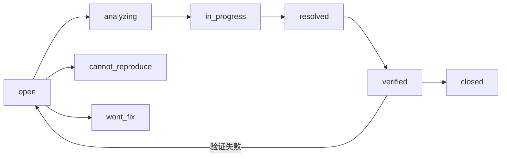

# 缺陷报告模板 — YiPet Chrome MV3 扩展

> 使用此模板记录 YiPet 扩展缺陷。每个缺陷只描述**一个问题**（单一职责）。如果多个问题共现，拆分为独立的缺陷报告。

---

## 命名规范

文件命名：`{序号}-{分类}-{简短描述}.md`

- **序号**：两位数字，同一分类内递增
- **分类**：缺陷所属模块或类别（如 `content`、`service-worker`、`api`、`构建`、`代码质量`）
- **描述**：5-15 字，动词短语，描述现象而非根因

示例：`01-content-ContentScript注入时机过早导致DOM未就绪.md`

---

## 严重度与优先级

| 严重度 | 定义 | 典型场景 |
|--------|------|---------|
| `critical` | 扩展不可用、数据丢失、安全漏洞 | Service Worker 崩溃、CSP 违规阻断 |
| `major` | 核心功能异常 | 聊天消息发送失败、角色切换异常 |
| `minor` | 非核心功能异常、体验退化 | Popup 样式错乱、动画卡顿 |
| `trivial` | 代码风格、未使用导入、命名不规范 | ESLint 警告、类型推断可优化 |

| 优先级 | 定义 | 响应时间 |
|--------|------|---------|
| `p0` | 阻断使用 | 立即修复 |
| `p1` | 影响核心功能 | 当天修复 |
| `p2` | 影响非核心功能 | 本周修复 |
| `p3` | 可延后 | 下个迭代 |

---

## 生命周期



---

## MV3 特定分类

| 分类 | 说明 | 典型缺陷 |
|------|------|---------|
| `content` | Content Script 注入、DOM 操作、页面交互 | 注入时机、ISOLATED world 隔离 |
| `service-worker` | SW 生命周期、消息路由、后台任务 | SW 休眠后状态丢失 |
| `popup` | Popup 弹窗 UI、交互 | Popup 失焦状态丢失 |
| `api` | ApiClient 调用 YiAi、RPC 契约 | 参数名称不匹配 |
| `构建` | Rsbuild 打包、manifest 生成 | 构建产物异常 |
| `安全` | CSP、权限、XSS | CSP 违规 |
| `代码质量` | 类型、lint、死代码 | 未使用变量 |

---

## 模板

### 一、现象

> **一句话描述**：什么情况下发生了什么问题。

**复现环境**：Chrome 版本、扩展版本、页面 URL

**错误日志**（如有）：

```
# Service Worker 控制台或 Content Script 错误
```

### 二、复现步骤

1. 前置条件（Chrome 版本、页面 URL、扩展状态）
2. 操作步骤（精确到 UI 操作或触发条件）
3. 观察结果

### 三、根因分析

> 技术层面的根因：
> - **问题代码位置**：`文件:行号` + 所属世界（CS/SW/Popup）
> - **为什么出错**：逻辑缺陷、MV3 限制或环境不匹配
> - **是否历史遗留**：重构残留、Chrome 版本升级等

### 四、修复方案

> 具体的代码变更，附修复前后对比。标注涉及的世界（Content Script / Service Worker / Popup）。

### 五、验证方法

- [ ] 单元测试通过：`npm test -- {test file}`
- [ ] 扩展构建成功：`npm run build`
- [ ] 在 Chrome 中加载扩展并验证修复
- [ ] Content Script 注入正常（目标页面可交互）
- [ ] Service Worker 日志无异常

### 六、影响范围

| 维度 | 评估 |
|------|------|
| 影响世界 | Content Script / Service Worker / Popup |
| 是否影响 API 契约 | 是/否 |
| 是否影响 YiVad 桥接 | 是/否 |
| 用户感知 | {用户可见的影响} |
| 数据完整性 | {chrome.storage 数据是否受影响} |

### 七、预防措施

| 层面 | 措施 |
|------|------|
| 代码 | {代码层面的防护} |
| 测试 | {测试层面的覆盖} |
| 流程 | {流程层面的改进} |
| CI | `npm run build` + `tsc --noEmit` 门禁 |

### 八、追溯

| 关联 | 链接 |
|------|------|
| 来源 PRD | {PRD 链接，如适用} |
| 关联开发模块 | {Dev 链接，如适用} |