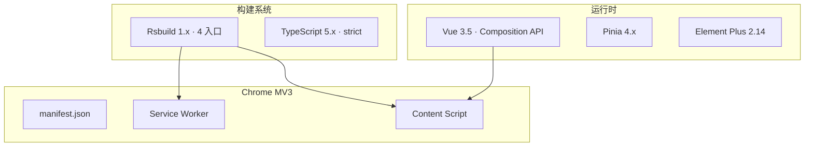

# YP-07-01: 技术栈迁移 — 开发方案

> 来源 PRD：[01-基础设施-技术栈迁移.md](../../prds/2026-07/01-基础设施-技术栈迁移.md)
> 需求编号：YP-07-01 · 优先级：P0 · 人天：4.0d

---

## 一、方案概述

### 1.1 迁移目标

从零搭建 YiPet Chrome MV3 扩展：Vue 3.5 + TypeScript strict + Rsbuild 多入口构建 + MV3 manifest。



---

## 二、文件清单

| 文件 | 类型 | 职责 |
|------|------|------|
| `manifest.json` | 新增 | Chrome MV3 扩展清单 |
| `package.json` | 新增 | 依赖 + 脚本 |
| `rsbuild.config.ts` | 新增 | 主构建（popup + background） |
| `rsbuild.config.chat.ts` | 新增 | Chat Window 独立构建 |
| `rsbuild.config.bootstrap.ts` | 新增 | Content Script 构建 |
| `tsconfig.json` | 新增 | TypeScript strict |
| `eslint.config.mjs` | 新增 | ESLint 10 |
| `src/popup/` | 新增 | Popup 入口 |
| `src/background/` | 新增 | Service Worker |
| `src/content/` | 新增 | Content Script |

---

## 三、模块设计

### 3.1 Rsbuild 多入口构建

```typescript
// rsbuild.config.ts — 主构建 (popup + background)
export default defineConfig({
  plugins: [pluginVue()],
  source: {
    entry: {
      popup: "./src/popup/main.ts",
      background: "./src/background/index.ts",
    },
  },
  output: {
    filenameHash: false,    // MV3 manifest 引用固定文件名
    target: "webworker",    // Service Worker 环境
  },
});
```

### 3.2 MV3 Manifest 关键配置

| 配置项 | 值 | 说明 |
|--------|-----|------|
| `manifest_version` | 3 | MV3 协议 |
| `permissions` | storage, activeTab, scripting | 最小权限原则 |
| `background.service_worker` | assets/background.js | SW 入口 |
| `content_scripts.run_at` | document_idle | DOM 就绪后注入 |
| `web_accessible_resources` | assets/*, cdn/* | 显式声明可访问资源 |

### 3.3 构建约束

| 约束 | 影响入口 | 原因 |
|------|---------|------|
| 禁用 filenameHash | 所有 | manifest 引用固定文件名 |
| 禁用代码分割 | background, bootstrap | SW/CS 需单文件 |
| `run_at: document_idle` | CS | DOM 加载完成后注入 |

---

## 四、实施步骤

| 步骤 | 内容 | 验证方式 | 人天 |
|------|------|---------|------|
| 1 | 项目脚手架 + manifest.json | `npm run build` 成功 | 1.0 |
| 2 | Rsbuild 4 入口配置 | 4 入口独立构建 | 1.0 |
| 3 | TypeScript strict + ESLint | `tsc --noEmit` 通过 | 0.5 |
| 4 | Popup + Chat Window Vue 3 | Popup 渲染，Chat 注入正常 | 0.75 |
| 5 | SW + CS 集成 | SW 分发，CS 注入宿主 | 0.5 |
| 6 | Chrome 加载 + 端到端 | 扩展加载，核心功能可用 | 0.25 |

**合计：4.0d**

---

## 五、完成定义（DoD）

- [ ] 10 个文件按 §2 清单落地
- [ ] `npm run build` 成功，4 入口构建正确
- [ ] Chrome 扩展加载，Popup 和 CS 正常
- [ ] `tsc --noEmit` 零错误