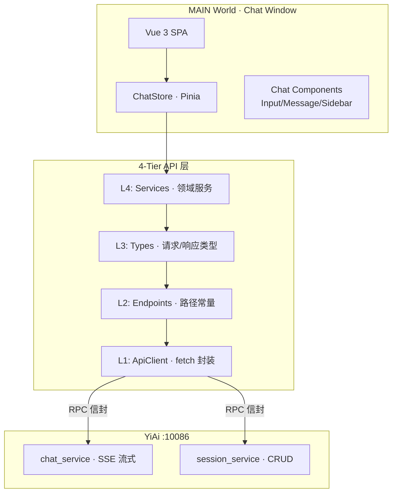

# YP-07-03: 聊天框架搭建 — 开发方案

> 来源 PRD：[03-基础设施-聊天框架搭建.md](../../prds/2026-07/03-基础设施-聊天框架搭建.md)
> 需求编号：YP-07-03 · 优先级：P0 · 人天：2.0d

---

## 一、方案概述

### 1.1 架构定位

聊天框架是 YiPet 的核心功能模块，在 MAIN World 中作为独立 Vue 3 SPA 运行，通过 4-Tier API 层调用 YiAi 后端，支持 SSE 流式响应和会话持久化。



---

## 二、文件清单

| 文件 | 类型 | 职责 |
|------|------|------|
| `src/api/client.ts` | 新增 | ApiClient · fetch 封装 + RPC 信封 + SSE 解析 |
| `src/api/endpoints.ts` | 新增 | API 路径常量 |
| `src/api/types.ts` | 新增 | RpcRequest/RpcResponse/ChatMessage 类型 |
| `src/api/services/chatService.ts` | 新增 | 聊天 API（SSE 流式） |
| `src/api/services/sessionService.ts` | 新增 | 会话 CRUD API |
| `src/chat/stores/chat.ts` | 新增 | ChatStore · Pinia 状态管理 |
| `src/chat/components/ChatInput.vue` | 新增 | 消息输入框 |
| `src/chat/components/ChatMessages.vue` | 新增 | 消息列表 |
| `src/chat/components/ChatSidebar.vue` | 新增 | 会话列表 |

---

## 三、模块设计

### 3.1 ApiClient — 4-Tier 架构核心

```typescript
// src/api/client.ts
class ApiClient {
  constructor(private baseUrl: string) {}

  async post<T>(endpoint: string, body: RpcRequest): Promise<T> {
    const response = await fetch(`${this.baseUrl}${endpoint}`, {
      method: "POST",
      headers: {
        "Content-Type": "application/json",
        ...(this.token ? { "X-Token": this.token } : {}),
      },
      body: JSON.stringify(body),
    });

    const data = await response.json();
    if (data.code !== 0) {
      throw new ApiError(data.code, data.message);
    }
    return data.data as T;
  }

  // SSE 流式：不走 RPC 信封解包
  async streamChat(
    messages: ChatMessage[],
    onChunk: (text: string) => void,
    signal?: AbortSignal
  ): Promise<void> {
    const response = await fetch(`${this.baseUrl}/`, {
      method: "POST",
      headers: { "Content-Type": "application/json", "X-Token": this.token || "" },
      body: JSON.stringify({
        module_name: "services.ai.chat_service",
        method_name: "chat",
        parameters: { messages, stream: true },
      }),
      signal,
    });

    const reader = response.body!.getReader();
    const decoder = new TextDecoder();
    let buffer = "";

    while (true) {
      const { done, value } = await reader.read();
      if (done) break;

      buffer += decoder.decode(value, { stream: true });
      const lines = buffer.split("\n");
      buffer = lines.pop() || "";

      for (const line of lines) {
        if (line.startsWith("data: ")) {
          const data = line.slice(6);
          if (data === "[DONE]") return;
          try {
            const parsed = JSON.parse(data);
            if (parsed.data?.message) onChunk(parsed.data.message);
          } catch { /* skip malformed */ }
        }
      }
    }
  }
}
```

### 3.2 ChatStore — 状态管理

```typescript
// src/chat/stores/chat.ts
export const useChatStore = defineStore("yipet-chat", () => {
  const sessions = ref<Session[]>([]);
  const currentSessionId = ref<string | null>(null);
  const isStreaming = ref(false);
  let abortController: AbortController | null = null;

  const currentMessages = computed(() =>
    sessions.value.find(s => s.id === currentSessionId.value)?.messages ?? []
  );

  async function sendMessage(text: string) {
    abortController = new AbortController();
    isStreaming.value = true;

    // 添加用户消息
    addMessage({ role: "user", content: text });
    // 创建 AI 消息占位
    const aiMsg = addMessage({ role: "assistant", content: "" });

    try {
      await apiClient.streamChat(
        currentMessages.value,
        (chunk) => { aiMsg.content += chunk; },
        abortController.signal
      );
    } catch (err) {
      if ((err as Error).name === "AbortError") return;
      aiMsg.error = (err as Error).message;
    } finally {
      isStreaming.value = false;
      await persistToStorage();
    }
  }

  function stopStreaming() {
    abortController?.abort();
  }

  return { sessions, currentSessionId, currentMessages, isStreaming, sendMessage, stopStreaming };
});
```

### 3.3 组件结构

| 组件 | 职责 | 关键行为 |
|------|------|---------|
| ChatInput | 文本输入 + 发送/停止 | Enter 发送，Shift+Enter 换行，streaming 时显示停止按钮 |
| ChatMessages | 消息列表渲染 | 自动滚底，用户上滚时显示「回到底部」按钮 |
| ChatSidebar | 会话列表管理 | 新建/删除/重命名/搜索 |

---

## 四、实施步骤与验证

| 步骤 | 内容 | 涉及文件 | 验证方式 | 人天 |
|------|------|---------|---------|------|
| 1 | ApiClient 4-Tier 架构 | `client.ts`, `endpoints.ts`, `types.ts` | RPC 信封正确，响应解包 | 0.5 |
| 2 | SSE 流式解析 | `client.ts` streamChat | SSE 流式接收，token 累积 | 0.25 |
| 3 | ChatStore 状态管理 | `stores/chat.ts` | 会话 CRUD + 消息管理 + 持久化 | 0.5 |
| 4 | ChatInput + ChatMessages | 组件 | 发送→流式渲染→停止 | 0.5 |
| 5 | ChatSidebar 会话管理 | `ChatSidebar.vue` | 会话列表 CRUD + 搜索 | 0.25 |

**合计：2.0d**

---

## 五、边缘场景

| 场景 | 处理策略 |
|------|---------|
| SSE 流中断 | 已接收内容保留 + 「回复中断」标记 |
| 用户取消生成 | `AbortController.abort()` |
| 并发生成 | 前一个 AbortController 取消 |
| chrome.storage 配额满 | 旧会话 LRU 淘汰 |
| MAIN World 无 chrome.* API | 通过 IPC Relay 访问 chrome.storage |

---

## 六、完成定义（DoD）

- [ ] 9 个文件按 §2 清单落地
- [ ] ApiClient RPC 信封正确，4-Tier 架构完整
- [ ] SSE 流式响应正常
- [ ] ChatStore 会话持久化（chrome.storage）
- [ ] 消息流式渲染 + 停止生成
- [ ] `tsc --noEmit` 通过