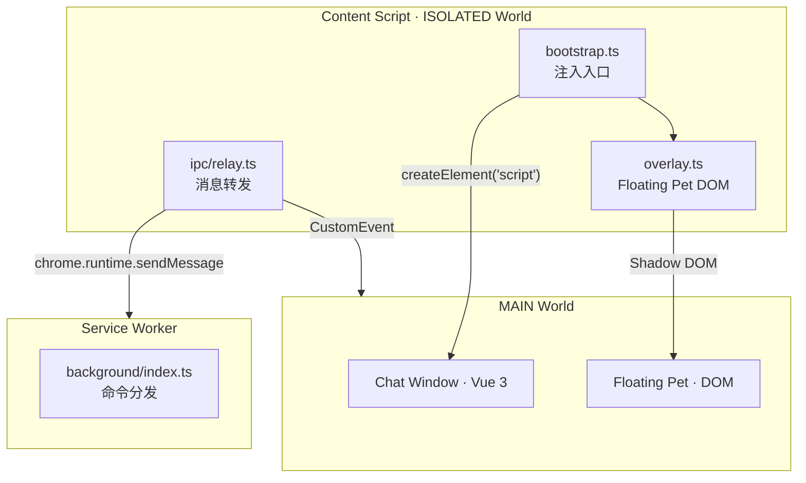
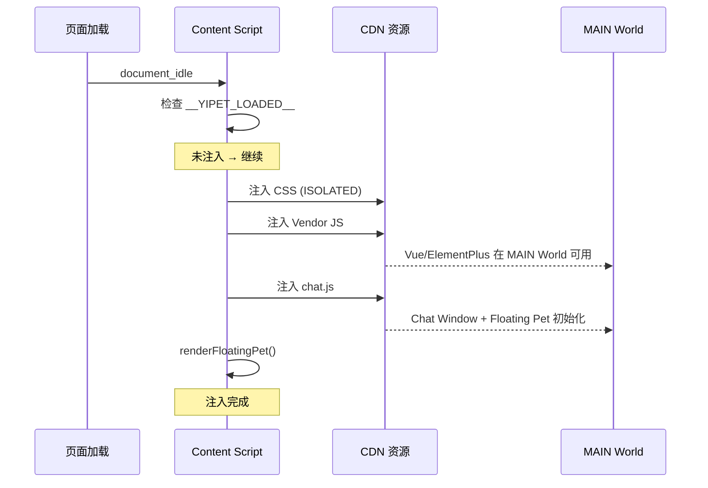

# YP-07-05: Content Script 注入架构 — 开发方案

> 来源 PRD：[05-架构设计-ContentScript注入架构.md](../../prds/2026-07/05-架构设计-ContentScript注入架构.md)
> 需求编号：YP-07-05 · 优先级：P0 · 人天：3.0d

---

## 一、方案概述

### 1.1 架构定位

Content Script 是 YiPet 扩展的注入入口，在 ISOLATED World 中运行，负责向宿主页面注入浮动宠物和聊天窗口。Shadow DOM 隔离样式，生命周期管理防止重复注入和资源泄漏。



### 1.2 职责边界

| 组件 | 世界 | 职责 | 明确不做 |
|------|------|------|---------|
| bootstrap.ts | ISOLATED | 注入入口、防重复、CDN 资源加载 | 不处理业务逻辑 |
| overlay.ts | ISOLATED | Shadow DOM 创建、Floating Pet 渲染 | 不处理消息路由 |
| ipc/relay.ts | ISOLATED | ISOLATED ↔ MAIN 消息转发 | 不处理业务数据 |

---

## 二、文件清单

| 文件 | 类型 | 职责 |
|------|------|------|
| `src/content/bootstrap.ts` | 新增 | 注入入口 + `__YIPET_LOADED__` 防重复 |
| `src/content/overlay.ts` | 新增 | Shadow DOM + Floating Pet DOM 渲染 |
| `src/content/ipc/relay.ts` | 新增 | IPC 消息转发（ISOLATED ↔ MAIN） |
| `src/content/ipc/messages.ts` | 新增 | 消息类型定义 |
| `src/utils/cdn/injector.ts` | 新增 | CDN 资源注入器 |

---

## 三、模块设计

### 3.1 bootstrap.ts — 注入入口

```typescript
// src/content/bootstrap.ts
const YIPET_LOADED_KEY = "__YIPET_LOADED__";

async function inject(): Promise<void> {
  // 1. 防重复注入
  if ((window as any)[YIPET_LOADED_KEY]) return;
  (window as any)[YIPET_LOADED_KEY] = true;

  try {
    // 2. 注入 CDN 样式（ISOLATED World 直接操作 DOM）
    await injectStyles(chrome.runtime.getURL("cdn/styles/variables.css"));
    await injectStyles(chrome.runtime.getURL("cdn/styles/pet.css"));

    // 3. 注入 Vendor JS（MAIN World 执行）
    await injectScript(chrome.runtime.getURL("cdn/vendor/vue.global.prod.js"));
    await injectScript(chrome.runtime.getURL("cdn/vendor/element-plus.js"));

    // 4. 注入 Chat Window + Floating Pet
    await injectScript(chrome.runtime.getURL("assets/chat.js"));

    // 5. 渲染 Floating Pet（ISOLATED World）
    renderFloatingPet();
  } catch (err) {
    // 失败时清除标记，允许重试
    delete (window as any)[YIPET_LOADED_KEY];
    console.error("[YiPet] Injection failed:", err);
  }
}

function injectScript(src: string): Promise<void> {
  return new Promise((resolve, reject) => {
    const script = document.createElement("script");
    script.src = src;
    script.onload = () => resolve();
    script.onerror = () => reject(new Error(`Failed to load: ${src}`));
    (document.head || document.documentElement).appendChild(script);
  });
}

// 在 document_idle 时注入
if (document.readyState === "loading") {
  document.addEventListener("DOMContentLoaded", inject);
} else {
  inject();
}
```

**设计要点：**
- `__YIPET_LOADED__` 全局标记防重复——注入前检查，失败时清除允许重试
- CDN 样式在 ISOLATED World 直接 `<link>` 注入（不经过 MAIN World）
- Vendor JS 通过 `<script>` 创建在 MAIN World 执行
- `document_idle` 时机：DOM 加载完成但未等待图片/iframe

### 3.2 overlay.ts — Shadow DOM 隔离

```typescript
// src/content/overlay.ts
export function createPetContainer(): ShadowRoot {
  const host = document.createElement("div");
  host.id = "yipet-root";
  document.body.appendChild(host);

  const shadow = host.attachShadow({ mode: "closed" });
  // mode: "closed" — 外部 JS 无法通过 element.shadowRoot 访问

  return shadow;
}

export function renderFloatingPet(): void {
  const shadow = createPetContainer();

  // Floating Pet 渲染在 Shadow DOM 内
  shadow.innerHTML = `
    <div class="yipet-floating-pet">
      <div class="pet-ring"></div>
      
      <div class="pet-tooltip"></div>
    </div>
  `;
}
```

**Why Shadow DOM：**
- 样式隔离——YiPet 的 CSS 不影响宿主页面，宿主页面的 CSS 也不影响宠物
- DOM 隔离——外部 JS 无法通过 `document.querySelector('#yipet-root')` 遍历到内部
- `mode: "closed"` 比 `"open"` 更安全——宿主页面无法通过 `element.shadowRoot` 访问

### 3.3 IPC Relay — 消息转发

```typescript
// src/content/ipc/relay.ts
const IPC_SECRET = crypto.randomUUID(); // 安装时生成，持久化到 chrome.storage

// ISOLATED → MAIN
export function dispatchToMain(action: string, payload: Record<string, unknown>): void {
  window.postMessage({
    source: "yipet-isolated",
    action,
    payload,
    __signature: IPC_SECRET,
    __timestamp: Date.now(),
  }, "*");
}

// 监听 MAIN → ISOLATED
window.addEventListener("message", (event) => {
  if (event.source !== window) return;
  if (event.data?.__signature !== IPC_SECRET) return;
  if (Date.now() - event.data?.__timestamp > 5000) return; // 5s 过期

  // 安全验证通过，处理消息
  handleMainMessage(event.data);
});

// ISOLATED → Service Worker
export async function sendToBackground(action: string, payload: unknown): Promise<unknown> {
  return chrome.runtime.sendMessage({ action, payload });
}
```

---

## 四、注入生命周期



---

## 五、页面兼容策略

| 页面类型 | 注入策略 | 说明 |
|---------|---------|------|
| 静态 HTML | `document_idle` 直接注入 | 标准流程 |
| SPA (Vue/React) | `MutationObserver` 监听 app root | 等待 SPA 渲染完成 |
| chrome:// 页面 | 跳过注入 | 受保护页面，禁止 Content Script |
| iframe | 仅顶层窗口注入 | `window.top === window.self` 检查 |
| 动态路由 SPA | `MutationObserver` + `popstate` 监听 | 路由变化时检查是否需要重新注入 |

---

## 六、实施步骤

| 步骤 | 内容 | 涉及文件 | 验证方式 | 人天 |
|------|------|---------|---------|------|
| 1 | bootstrap.ts 注入入口 + 防重复 | `bootstrap.ts` | 刷新页面不重复注入，`__YIPET_LOADED__` 正确 | 0.5 |
| 2 | overlay.ts Shadow DOM + Pet 渲染 | `overlay.ts` | Shadow DOM 创建，Pet 显示，样式隔离 | 0.5 |
| 3 | CDN 资源注入器 | `injector.ts` | CSS/JS 正确加载，失败时清除标记 | 0.5 |
| 4 | IPC Relay 消息转发 | `ipc/relay.ts` | ISOLATED↔MAIN↔SW 三向通信 | 0.5 |
| 5 | 页面兼容处理（SPA/chrome://） | `bootstrap.ts` | SPA 路由切换不丢失，chrome:// 跳过 | 0.5 |
| 6 | 集成测试 + 边界处理 | 全部 | 各页面类型验证通过 | 0.5 |

**合计：3.0d**

---

## 七、边缘场景

| 场景 | 处理策略 |
|------|---------|
| 重复注入 | `__YIPET_LOADED__` 标记检查，短路返回 |
| 注入失败 | 清除标记 + console.error，允许页面刷新后重试 |
| chrome:// 页面 | `chrome.runtime.id` 检测，静默跳过 |
| SPA 路由切换 | MutationObserver 监听，Pet 保持在位 |
| CSP 限制 | 所有资源通过 `chrome.runtime.getURL` 加载，非远程 URL |
| Shadow DOM 事件穿透 | Pet 交互事件在 Shadow DOM 内处理，不冒泡到宿主 |

---

## 八、完成定义（DoD）

- [ ] 5 个文件按 §2 清单落地
- [ ] 静态页面注入成功，Pet 可见
- [ ] 刷新页面不重复注入
- [ ] Shadow DOM 样式隔离生效（宿主 CSS 不影响 Pet）
- [ ] SPA 路由切换不丢失 Pet
- [ ] chrome:// 页面静默跳过