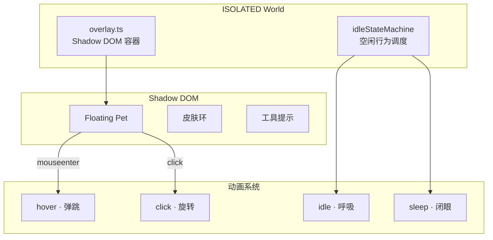

# YP-07-06: 浮窗宠物 UI 与动画系统 — 开发方案

> 来源 PRD：[06-功能实现-浮窗宠物UI与动画系统.md](../../prds/2026-07/06-功能实现-浮窗宠物UI与动画系统.md)
> 需求编号：YP-07-06 · 优先级：P0 · 人天：2.5d

---

## 一、方案概述

### 1.1 架构定位

Floating Pet 是 YiPet 的视觉核心——在宿主页面右下角渲染一个可交互的宠物角色，通过 Shadow DOM 隔离样式，CSS 关键帧驱动动画，空闲状态机控制行为。



### 1.2 职责边界

| 组件 | 职责 | 明确不做 |
|------|------|---------|
| overlay.ts | Shadow DOM 创建 + Pet DOM 注入 | 不处理业务消息 |
| 动画系统 | CSS @keyframes + class 切换 | 不用 JS 动画（性能） |
| 空闲状态机 | 计时器驱动的行为调度 | 不响应用户主动操作 |

---

## 二、文件清单

| 文件 | 类型 | 职责 |
|------|------|------|
| `src/content/overlay.ts` | 新增 | Shadow DOM + Pet DOM 结构 |
| `src/content/animations.css` | 新增 | CSS @keyframes 动画定义 |
| `src/content/idleStateMachine.ts` | 新增 | 空闲行为状态机 |
| `src/assets/pet-characters/` | 新增 | 角色图片资源 |

---

## 三、模块设计

### 3.1 Pet DOM 结构

```html
<!-- Shadow DOM 内部 -->
<div class="yipet-floating-pet" data-state="idle">
  <!-- 皮肤环：角色选择器 -->
  <div class="pet-ring">
    <div class="ring-option" v-for="role in roles" :class="{ active: role === current }">
      
    </div>
  </div>

  <!-- 宠物主体 -->
  <div class="pet-body">
    
    <div class="pet-eyes">
      <div class="eye left"></div>
      <div class="eye right"></div>
    </div>
  </div>

  <!-- 工具提示 -->
  <div class="pet-tooltip" v-if="tooltip">
    {{ tooltip }}
  </div>
</div>
```

### 3.2 CSS 关键帧动画

```css
/* 呼吸动画 · idle 状态 */
@keyframes pet-breathe {
  0%, 100% { transform: scale(1); }
  50% { transform: scale(1.05); }
}

/* 弹跳动画 · hover 状态 */
@keyframes pet-bounce {
  0%, 100% { transform: translateY(0); }
  30% { transform: translateY(-12px); }
  50% { transform: translateY(0); }
  70% { transform: translateY(-6px); }
}

/* 旋转动画 · click 状态 */
@keyframes pet-spin {
  from { transform: rotate(0deg); }
  to { transform: rotate(360deg); }
}

/* 闭眼动画 · sleep 状态 */
@keyframes pet-sleep {
  0%, 100% { transform: scaleY(1); }
  50% { transform: scaleY(0.1); }
}

.yipet-floating-pet[data-state="idle"] .pet-body {
  animation: pet-breathe 3s ease-in-out infinite;
}
.yipet-floating-pet[data-state="hover"] .pet-body {
  animation: pet-bounce 0.6s ease;
}
.yipet-floating-pet[data-state="sleep"] .pet-eyes .eye {
  animation: pet-sleep 4s ease-in-out infinite;
}
```

**性能约束：**
- 仅使用 `transform` 和 `opacity`——触发 Composite 而非 Layout/Paint
- 不用 JS 驱动动画帧——CSS 动画由浏览器合成器线程处理
- `will-change: transform` 预提升合成层

### 3.3 空闲状态机

```typescript
// src/content/idleStateMachine.ts
type IdleState = "idle" | "sleep" | "lookAround" | "stretch";

interface IdleBehavior {
  state: IdleState;
  duration: number;       // 持续时间 ms
  weight: number;         // 触发权重（越高越容易触发）
  animation: string;      // CSS 动画名
}

const IDLE_BEHAVIORS: IdleBehavior[] = [
  { state: "idle",       duration: 4000, weight: 50, animation: "pet-breathe" },
  { state: "lookAround", duration: 2000, weight: 20, animation: "pet-look" },
  { state: "stretch",    duration: 2500, weight: 15, animation: "pet-stretch" },
  { state: "sleep",      duration: 8000, weight: 15, animation: "pet-sleep" },
];

class IdleStateMachine {
  private current: IdleState = "idle";
  private timer: number | null = null;
  private inactiveTime = 0;

  start() {
    this.inactiveTime = 0;
    this.scheduleNext();
    // 监听用户活动，重置计时器
    document.addEventListener("mousemove", () => { this.inactiveTime = 0; });
    document.addEventListener("keydown", () => { this.inactiveTime = 0; });
  }

  private scheduleNext() {
    const elapsed = this.inactiveTime;
    // 30s 无活动 → 进入 sleep 候选
    const available = elapsed > 30000
      ? IDLE_BEHAVIORS
      : IDLE_BEHAVIORS.filter(b => b.state !== "sleep");

    const next = weightedRandom(available);
    this.transition(next.state);
    this.timer = window.setTimeout(() => this.scheduleNext(), next.duration);
  }

  private transition(state: IdleState) {
    this.current = state;
    const pet = document.querySelector(".yipet-floating-pet");
    if (pet) pet.setAttribute("data-state", state);
  }
}
```

---

## 四、实施步骤与验证

| 步骤 | 内容 | 涉及文件 | 验证方式 | 人天 |
|------|------|---------|---------|------|
| 1 | Shadow DOM + Pet DOM 结构 | `overlay.ts` | Pet 渲染，宿主 CSS 不影响 Pet 样式 | 0.5 |
| 2 | CSS @keyframes 动画 (9 种) | `animations.css` | idle/hover/click/sleep 动画流畅 | 0.75 |
| 3 | 空闲状态机 | `idleStateMachine.ts` | 30s 无操作→sleep，有操作→唤醒 | 0.5 |
| 4 | 皮肤环 + 工具提示 | `overlay.ts` | 角色切换、tooltip 显示/隐藏 | 0.5 |
| 5 | 性能优化 + 集成测试 | 全部 | 动画仅触发 Composite，60fps | 0.25 |

**合计：2.5d**

---

## 五、边缘场景

| 场景 | 处理策略 |
|------|---------|
| 宿主 CSS 冲突 | Shadow DOM 样式隔离 |
| 页面 iframe | 仅顶层窗口注入 Pet |
| 移动端触屏 | hover 动画替换为 tap 动画 |
| prefers-reduced-motion | 禁用所有动画，静态展示 |
| Pet 遮挡页面按钮 | `pointer-events: none` 在非交互区 |

---

## 六、完成定义（DoD）

- [ ] 4 个文件按 §2 清单落地
- [ ] Shadow DOM 样式隔离生效
- [ ] 9 种关键帧动画流畅（60fps）
- [ ] 空闲状态机正确调度（idle→sleep→唤醒）
- [ ] 宿主页面交互不受 Pet 影响