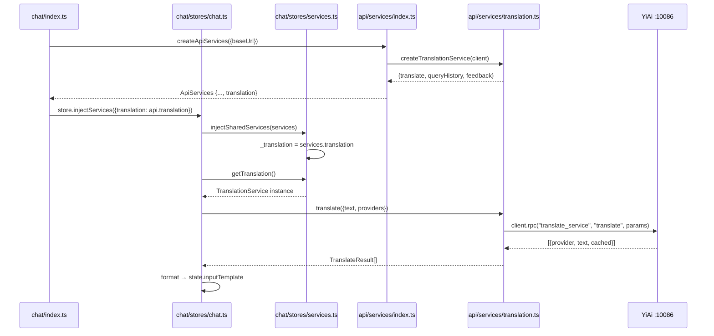

---

doc_type: task
prd_task_id: "YP-09-100"
title: "YP-09-100: 即时翻译功能 — 技术设计"
status: 已完成
priority: P2
owner: Claude
roles: [engineer]
created: 2026-09-23
updated: 2026-09-23
project: YiPet
project_id: yipet
prd_month: "202609"
estimate_frontend: 0.5
source_prd: "100-基础设施-即时翻译功能.md"
tags: [translation, chrome-extension, quick-translate, rpc, api-layer]

type: task
---

# YP-09-100: 即时翻译功能 — 技术设计

> **版本**：v3.0 · **人天**：0.5d · **PRD**：[100-基础设施-即时翻译功能.md](../../prds/2026-09/100-基础设施-即时翻译功能.md)

---

## 1. 业务上下文

YiPet Chrome 扩展需要内置翻译能力，利用 YiAi 后端的 19 个翻译供应商 + 记忆缓存。通过四层 API 架构和服务注入模式，在聊天 Store 中暴露 `translateSelection` 操作。

**PRD**：[YP-09-100](../../prds/2026-09/100-基础设施-即时翻译功能.md)

## 2. 架构

### 系统架构图

```
index.ts (createApiServices → api.translation)
  │ store.injectServices({translation: api.translation})
  ▼
chat.ts (translateSelection)
  │ getTranslation().translate({text, from_lang, to_lang, providers})
  ▼
services/translation.ts (createTranslationService)
  │ client.rpc("services.translation.translate_service", "translate", params)
  ▼
YiAi :10086 → translate_service.translate → provider + memory cache
```

### 组件清单

| 组件 | 职责 | 文件 |
|------|------|------|
| TranslationService | API 工厂 | `api/services/translation.ts` |
| ApiServices 接口 | 类型注册 | `api/services/index.ts` |
| services.ts | 注入管理 | `chat/stores/services.ts` |
| chat.ts | translateSelection 操作 | `chat/stores/chat.ts` |
| index.ts | 启动注入 | `chat/index.ts` |

### API 契约

```typescript
// TranslationService (factory)
createTranslationService(client: ApiClient) → {
  translate(params: TranslateParams): Promise<TranslateResult[]>
  queryHistory(params): Promise<{list, total}>
  feedback(params): Promise<{success}>
}

// RPC envelope
client.rpc("services.translation.translate_service", "translate", {
  text, from_lang, to_lang, providers, provider_config, use_memory
})
```

### 注入链调用序列



## 3. 实现细节

### 文件变更

| 文件 | 操作 | 说明 |
|------|------|------|
| `api/services/translation.ts` | 新增 | TranslationService 工厂 |
| `api/services/index.ts` | 修改 | 注册 + ApiServices 接口 |
| `chat/stores/services.ts` | 修改 | getTranslation() + injectServices |
| `chat/stores/chat.ts` | 修改 | translateSelection(from?, to?) |
| `chat/index.ts` | 修改 | 启动注入 api.translation |
| `tests/api/translation.test.ts` | 新增 | 6 个 Vitest 用例 |

### 关键实现

**translateSelection 流程**：`window.getSelection()` → trim → 长度校验 → `getTranslation().translate({text: sel, providers: ['openai','ollama']})` → 多供应商结果拼接 → `state.inputTemplate` → 自动打开聊天

**类型设计**：`TranslationService` 为 `ReturnType<typeof createTranslationService>`，作为类型用于 `ApiServices` 接口，作为值通过 `createTranslationService(client)` 创建

### 错误处理

- 未选中文本 → `notify('info')`
- API 失败 → `notify('error')` + `logger`
- 结果为空 → `notify('warning')`

## 4. 非功能需求

| 维度 | 要求 | 实现 |
|------|------|------|
| 性能 | 翻译 <3s | 复用 YiAi HTTP 连接池 |
| 安全 | API Key 不暴露 | Key 由 YiAi 管理，前端仅传 RPC |
| 类型安全 | vue-tsc 0 error | strict mode + isolatedModules |
| 可测试 | 6 个 Vitest | tests/api/translation.test.ts |