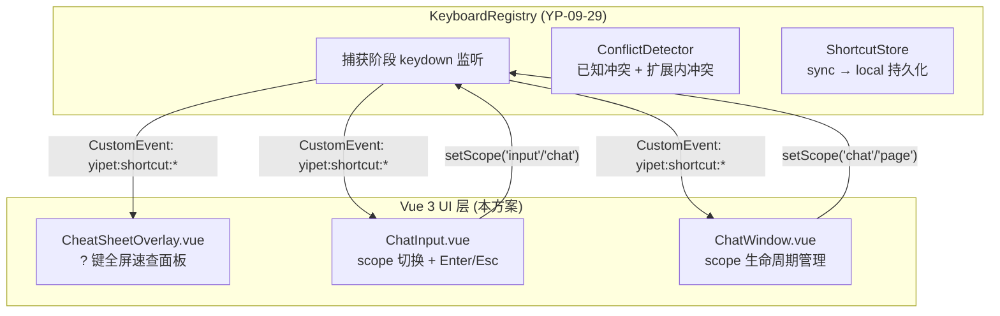
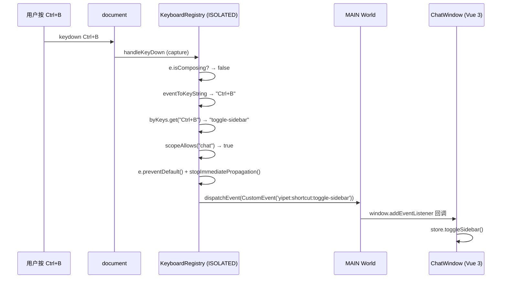
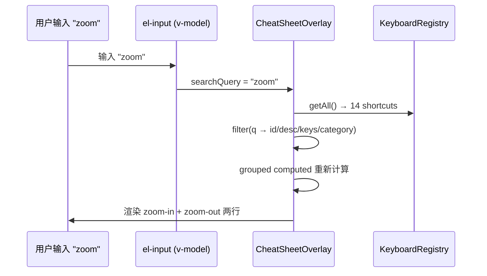

# YP-09-97: 键盘快捷键系统 — CheatSheetOverlay 与 ChatInput 集成 — 开发方案

> 来源 PRD：[104-功能实现-键盘快捷键系统.md](../../prds/2026-09/104-功能实现-键盘快捷键系统.md)
> 需求编号：YP-09-97 · 优先级：P2 · 人天：0.3d 估算
> 本文档定义 **CheatSheetOverlay 速查面板 UI、ChatInput 作用域集成，以及冲突检测算法的具体实现**。核心注册中心实现见 [YP-09-29 开发方案](../2026-09/36-prd-task-快捷键系统.md)，验证方式见[测试用例](../../tests/2026-09/104-prd-test-键盘快捷键系统.md)。

---

## 一、方案概述

### 1.1 架构定位

本方案在 YP-09-29 (KeyboardRegistry 核心) 之上构建 **Vue 3 UI 层**和**冲突检测算法**。KeyboardRegistry 通过 `CustomEvent` 分发快捷键触发事件，Vue 组件通过 `window.addEventListener` 监听并响应。



### 1.2 职责边界

| 组件 | 文件 | 职责 | 明确不做 |
|------|------|------|---------|
| CheatSheetOverlay | `src/chat/components/CheatSheetOverlay.vue` | 渲染全屏半透明面板，按 4 分类展示所有快捷键，实时搜索过滤，`?` 键/`Escape` 切换 | 不修改快捷键绑定；不嵌入聊天窗口内 |
| ChatInput (集成层) | `src/chat/components/ChatInput.vue` | 输入框 focus/blur 时切换 KeyboardRegistry scope；Enter/Esc/Ctrl+K 处理 | 不做全局快捷键处理；scope 切换委托给 registry |
| ChatWindow (生命周期) | `src/chat/components/ChatWindow.vue` | 聊天窗口打开/关闭时切换 scope；挂载 CheatSheetOverlay | 不直接处理键盘事件 |

---

## 二、文件清单

| 文件 | 类型 | 职责 |
|------|------|------|
| `src/chat/components/CheatSheetOverlay.vue` | 新增 | 快捷键速查面板 |
| `src/chat/components/ChatWindow.vue` | 修改 | 导入并挂载 CheatSheetOverlay |
| `src/chat/components/index.ts` | 修改 | 导出 CheatSheetOverlay |
| `src/shared/shortcuts.ts` | 引用 | KeyboardRegistry 提供 `getAll()`/`displayKeys()` 供面板使用 |

---

## 三、模块设计

### 3.1 CheatSheetOverlay（快捷键速查面板）

**组件结构**：

```
CheatSheetOverlay.vue
├── Teleport (to="body")
│   └── Transition (fade + scale)
│       └── .yipet-cheatsheet-overlay (全屏半透明背景)
│           └── .yipet-cheatsheet-panel (居中面板 640px)
│               ├── Header: 标题 + 关闭按钮
│               ├── Search: el-input 搜索过滤
│               ├── Body (scrollable):
│               │   ├── Group: Pet Controls
│               │   │   ├── Row: 显示/隐藏宠物 · ⌘ShiftP
│               │   │   └── Row: 切换静音 · ⌘ShiftM
│               │   ├── Group: Chat
│               │   │   ├── Row: 打开聊天窗口 · ⌘ShiftX
│               │   │   ├── Row: 聚焦输入框 · ⌘I
│               │   │   └── ...
│               │   ├── Group: Navigation
│               │   └── Group: Utilities
│               └── Footer: ? 切换 · Esc 关闭 · N shortcuts total
```

**关键实现细节**：

| 细节 | 实现 |
|------|------|
| 触发方式 | 监听 `yipet:shortcut:cheatsheet` CustomEvent 切换可见性；同时监听 `keydown` 的 `?` 键（仅非输入框时） |
| 搜索过滤 | `computed` 属性过滤 `keyboardRegistry.getAll()`，匹配 id/description/keys/category label |
| 分组渲染 | 按 category 顺序 (pet → chat → navigation → utility) 分组，空组自动隐藏 |
| 平台感知 | `displayKeys()` 在 macOS 上显示 `Cmd`，否则显示 `Ctrl` |
| 锁定标记 | `!item.customizable` 的行显示 🔒 图标，title="Core shortcut — not customizable" |
| 关闭方式 | Escape 键、点击 overlay 背景、点击关闭按钮 |
| 动画 | `<Transition name="yipet-cheatsheet-fade">` — opacity 0.15s + scale(0.95→1) |
| 空状态 | 搜索无匹配时显示 "No shortcuts match '<query>'" |

### 3.2 冲突检测算法

ConflictDetector 集成在 KeyboardRegistry 内部，分为两层检测：

**L1 — 扩展内冲突**（注册时实时检测）：
```
输入: newKeys (string), excludeId (string)
算法:
  1. 遍历 _byKeys Map (keys → id)
  2. 若 newKeys 已存在且对应 id ≠ excludeId → 返回冲突
  3. 否则 → 无冲突
复杂度: O(1) Map 查找
```

**L2 — 已知浏览器/系统冲突**（初始化时批量检测）：
```
输入: KNOWN_CONFLICTS 列表 (18 项)
算法:
  1. 初始化完成后遍历所有已注册快捷键
  2. 对每个快捷键的 keys 在 KNOWN_CONFLICTS 中查找匹配
  3. 匹配项收集到 knownConflicts ref
  4. 通过 console.warn 输出冲突列表
复杂度: O(n × m)，n=14 个快捷键，m=18 个已知冲突 → 252 次比较，< 1ms
```

**已知冲突列表**（18 项）：

| 快捷键 | 冲突来源 | 说明 |
|--------|---------|------|
| Ctrl+T | Chrome | 打开新标签页 |
| Ctrl+W | Chrome | 关闭标签页 |
| Ctrl+Shift+T | Chrome | 恢复关闭的标签页 |
| Ctrl+N | Chrome | 打开新窗口 |
| Ctrl+D | Chrome | 添加书签 |
| Ctrl+H | Chrome | 打开历史记录 |
| Ctrl+J | Chrome | 打开下载页 |
| Ctrl+F | Chrome | 页面内查找 |
| Ctrl+P | Chrome | 打印页面 |
| Ctrl+S | Chrome | 保存页面 |
| Ctrl+Shift+N | Chrome | 打开隐身窗口 |
| Ctrl+Shift+P | VS Code | 命令面板 |
| Ctrl+Shift+K | VS Code | 删除行 |
| Ctrl+Shift+S | VS Code | 另存为 |
| Ctrl+Shift+M | VS Code | Markdown 预览 |
| Ctrl+K | Notion/GitHub | 搜索/插入链接 |
| Escape | 通用 | 取消/关闭 |
| ? | GitHub/Twitter/Jira | 快捷键帮助 |

### 3.3 ChatInput 作用域集成

ChatInput 通过以下生命周期钩子管理 KeyboardRegistry scope：

```typescript
// ChatInput.vue — onMounted/onUnmounted 中
onMounted(() => {
  // 输入框聚焦 → 切换 registry 到 input scope
  textarea.addEventListener('focus', () => keyboardRegistry.setScope('input'));
  textarea.addEventListener('blur', () => keyboardRegistry.setScope('chat'));
});

// ChatWindow.vue — 聊天窗口生命周期
watch(() => s.visible, (v) => {
  if (v) {
    keyboardRegistry.startListening();
    keyboardRegistry.setScope('chat');
  } else {
    keyboardRegistry.setScope('page');
  }
});
```

**作用域匹配规则**：
- `global` 快捷键 → 始终匹配
- `chat` 快捷键 → 当 scope 为 `chat` 或 `input` 时匹配
- `input` 快捷键 → 仅当 scope 为 `input` 时匹配
- `page` 快捷键 → 仅当 scope 为 `page` 时匹配

---

## 四、MV3 双世界数据流

### 4.1 快捷键触发的 UI 响应流程



### 4.2 CheatSheetOverlay 搜索过滤流程



---

## 五、MV3 特定约束

| 约束 | 影响 | 应对 |
|------|------|------|
| Content Script 无法访问 MAIN World Vue 实例 | CheatSheetOverlay 在 MAIN World 渲染，KeyboardRegistry 在 ISOLATED World 运行 | CustomEvent 作为唯一通信桥梁，数据通过 registry 公开 API 获取 |
| `document.addEventListener` 在 ISOLATED World | ISOLATED 的 keydown 事件先于 MAIN World 触发 | 利用此特性实现捕获阶段拦截 |
| Element Plus 组件在 content script 环境 | el-input/el-button 等需要 CSS 变量和主题系统 | 复用 `var(--primary-rgb)` 等变量，通过 `public/cdn/` 加载 Element Plus |

---

## 六、实施步骤与验证

| 步骤 | 内容 | 涉及文件 | 验证方式 | 人天 |
|------|------|---------|---------|------|
| 1 | 实现 CheatSheetOverlay 组件 | `CheatSheetOverlay.vue` | `?` 键打开面板，4 分组正确 | 0.10 |
| 2 | 集成搜索过滤 | `CheatSheetOverlay.vue` | 搜索 "chat" 过滤至聊天组 | 0.02 |
| 3 | 平台感知键名显示 | `CheatSheetOverlay.vue` + `shortcuts.ts` | macOS 显示 Cmd，Windows 显示 Ctrl | 0.02 |
| 4 | 集成到 ChatWindow | `ChatWindow.vue` | 组件挂载 + 导入正确 | 0.02 |
| 5 | ChatInput scope 切换 | `ChatInput.vue` | 聚焦时 scope=input，失焦 scope=chat | 0.03 |
| 6 | ChatWindow 生命周期 scope | `ChatWindow.vue` | 打开 scope=chat，关闭 scope=page | 0.02 |
| 7 | 冲突检测算法实现 | `shortcuts.ts` (内部) | 初始化时 console.warn 输出冲突 | 0.03 |
| 8 | typecheck + build 验证 | — | tsc 通过，4 入口构建成功 | 0.02 |

**合计：0.26d**。

### 验证检查点

| 步骤 | 验证项 | 通过标准 |
|------|--------|---------|
| 1 | 速查面板渲染 | 14 个快捷键按 4 组展示，kbd 样式正确 |
| 2 | 搜索过滤 | 输入 "toggle" → 显示 toggle-pet + toggle-sidebar + toggle-mute |
| 3 | 平台键名 | macOS: Cmd+Shift+P；Windows: Ctrl+Shift+P |
| 5 | 输入框 scope | 聚焦输入框时 Ctrl+B 不触发侧边栏切换 |
| 6 | 聊天窗口 scope | 关闭聊天窗口后所有 chat scope 快捷键不触发 |
| 7 | 冲突检测 | 浏览器控制台输出 `[YiPet:KeyboardRegistry] Known conflicts detected:` |

---

## 七、边缘场景处理

| 场景 | 触发条件 | 处理策略 | 实现位置 |
|------|---------|---------|---------|
| 搜索无匹配 | searchQuery 过滤后 grouped 为空 | 渲染空状态提示 "No shortcuts match '<query>'" | CheatSheetOverlay 模板 |
| 面板打开时切换语言 | i18n locale 变化 | 快捷键描述为静态中文，不依赖 i18n 动态切换 | 快捷键描述硬编码 |
| 快速连续按 `?` | 面板 toggle 竞态 | visible ref 翻转，每个事件触发一次切换 | CheatSheetOverlay `onCheatsheetEvent` |
| 面板打开时页面 DOM 变化 | SPA 路由切换导致 body 被替换 | Teleport 目标为 `body`，SPA 替换 body 时面板也会被移除 | 无解——Teleport 依赖稳定的 body 元素 |
| `displayKeys()` 在 SSR/测试环境 | `navigator` 不可用 | `typeof navigator !== 'undefined'` 守卫，默认显示 Ctrl | `displayKeys()` 函数 |

---

## 八、已知缺陷与改进项

### 缺陷 1（P3）：搜索不支持中文拼音/模糊匹配

**现象**：用户输入 "kongzhi" 无法匹配 "控制" 相关快捷键。

**根因**：当前搜索为简单 `toLowerCase().includes()` 匹配，无拼音/模糊匹配能力。

**影响**：中文用户使用拼音搜索无结果。

**改进方向**：集成 pinyin-pro 等拼音库，或添加快捷键别名字段（如 `aliases: ['kongzhi']`）。

---

## 九、风险与回滚

| 风险 | 概率 | 影响 | 缓解措施 |
|------|------|------|---------|
| CheatSheetOverlay 遮挡页面关键 UI | 低 | 低 | 半透明背景 + Escape 一键关闭；面板仅 640px 宽 |
| ChatInput scope 切换遗漏边缘场景 | 中 | 中 | focus/blur 事件覆盖正常输入流；compositionstart/end 不改变 scope |

| 场景 | 回滚方式 | 影响范围 |
|------|---------|---------|
| CheatSheetOverlay 性能/渲染异常 | 从 ChatWindow 模板移除组件引用 | 失去快捷键发现能力 |
| scope 切换导致快捷键失灵 | 设置 scope 为 'global'（禁用 scope gate） | 输入框内快捷键可能与页面冲突 |

---

## 十、完成定义（DoD）

- [ ] CheatSheetOverlay 渲染正确，14 个快捷键 4 组展示
- [ ] 搜索过滤实时生效（computed 驱动）
- [ ] macOS Cmd / Windows Ctrl 显示正确
- [ ] `?` 键在非输入框时触发面板，Escape 关闭
- [ ] ChatInput focus → scope='input'，blur → scope='chat'
- [ ] ChatWindow 打开 → scope='chat'，关闭 → scope='page'
- [ ] 已知冲突列表 18 项，初始化时检测
- [ ] 未匹配快捷键事件 passthrough 至宿主页面
- [ ] `npm run build` 无错误
- [ ] `vue-tsc --noEmit` 通过

---

## 已知缺口与技术债

### 功能缺口

| # | 缺口 | 影响 | 建议 |
|---|------|------|------|
| — | 无 | — | — |

### 技术债

| # | 技术债 | 优先级 | 预计人天 | 说明 | 状态 |
|---|--------|--------|---------|------|------|
| — | 无 | — | — | — | — |
