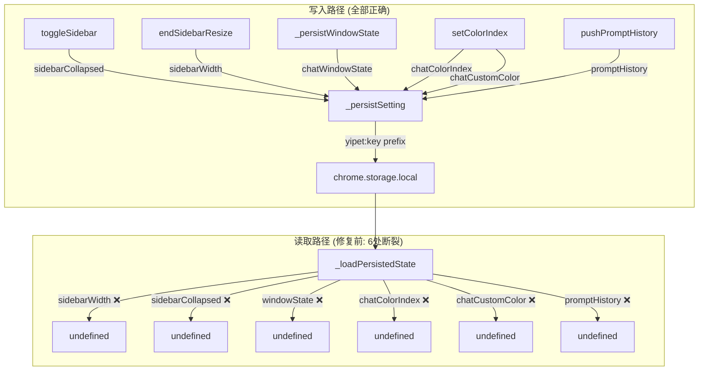

---

doc_type: task
prd_task_id: "YP-09-111"
title: "YP-09-111: 存储持久化一致性修复 — 技术设计"
status: 已完成
priority: P0
owner: Claude
roles: [engineer]
created: 2026-09-23
updated: 2026-09-23
project: YiPet
project_id: yipet
prd_month: "202609"
estimate_frontend: 0.5
source_prd: "111-基础设施-存储持久化一致性修复.md"
tags: [storage, chrome-storage, persistence, bug-fix]

type: task
---

# YP-09-111: 存储持久化一致性修复 — 技术设计

> **版本**：v1.0 · **人天**：0.5d · **PRD**：[111-基础设施-存储持久化一致性修复.md](../../prds/2026-09/111-基础设施-存储持久化一致性修复.md)

---

## 1. 业务上下文

`_persistSetting` 和 `_loadPersistedState` 之间存在系统性的键名约定断裂，导致 6 项用户设置在浏览器重启后无法恢复。

**PRD**：[YP-09-111](../../prds/2026-09/111-基础设施-存储持久化一致性修复.md)

## 2. 架构

### _persistSetting 函数分析

```typescript
// chat.ts:354 — 所有持久化的单一入口
function _persistSetting(key: string, value: unknown, immediate = false) {
    // localStorage 路径: yipet:key → JSON.stringify(value) 或原字符串
    window.localStorage?.setItem(`yipet:${key}`, ...)
    // chrome.storage 路径: yipet:key → 原始 value
    chrome.storage.local.set({ [`yipet:${key}`]: value })
}
```

关键观察：此函数**无条件**为所有键添加 `yipet:` 前缀。这是设计意图——同一域名下的多个扩展/应用需要命名空间隔离。

### 调用关系图



### 修复后的读取路径

```typescript
// chat.ts:375 — 修复后：统一使用 yipet: 前缀
const result = await chrome.storage.local.get([
    'yipet:sidebarWidth',      // was: 'sidebarWidth'
    'yipet:sidebarCollapsed',  // was: 'sidebarCollapsed'
    'weChatRobots',            // unchanged — stored without prefix
    'yipet:promptHistory',     // was: 'promptHistory'
    'yipet:chatWindowState',   // was: 'windowState' (name also wrong!)
    'yipet:chatColorIndex',    // was: 'chatColorIndex'
    'yipet:chatCustomColor',   // was: 'chatCustomColor'
    // RAG keys — already correct, unchanged
    'yipet:ragEnabled', 'yipet:ragScope', ...
]);

// 访问器同步修改为括号表示法
if (typeof result['yipet:sidebarWidth'] === 'number')
    state.sidebarWidth = result['yipet:sidebarWidth'];
```

## 3. 变更清单

### A. chat/stores/chat.ts — 核心修复

| 行号 | 变更 | 修复的缺陷 |
|------|------|-----------|
| 375-380 | `chrome.storage.local.get` 参数全部添加 `yipet:` 前缀 | B03: 6键前缀 |
| 380 | `windowState` → `yipet:chatWindowState` | B03: 键名不一致 |
| 382-400 | 访问器 `result.sidebarWidth` → `result['yipet:sidebarWidth']` 等 | B03: 访问路径 |
| 1001-1003 | `ragContentSummary` 添加 `\|\| 'unknown'` fallback | B01: undefined 传播 |
| 1077-1078 | `_persistSetting('promptHistory', arr)` 移除 `JSON.stringify()` | B02: 双重序列化 |

### B. promptHistory 写入修正

```diff
  function pushPromptHistory(text: string) {
    // ...
-   _persistSetting('promptHistory', JSON.stringify(arr));
+   _persistSetting('promptHistory', arr);
  }
```

`_persistSetting` 对非字符串值自动 `JSON.stringify`，传入已序列化的字符串导致：
- localStorage: 存为 JSON 字符串的 JSON（双重编码）
- chrome.storage: 存为字符串而非数组 → `Array.isArray` 失败

### C. ragContentSummary fallback

```diff
  const topSource = state.ragSources[0];
+ const topFile = topSource?.path?.split('/').pop() || 'unknown';
- state.messages[idx].ragContentSummary = topSource?.path?.split('/').pop() + ...;
+ state.messages[idx].ragContentSummary = topFile + ...;
```

## 4. 关键决策

| 决策 | 理由 |
|------|------|
| 读键加前缀而非移除写键前缀 | `_persistSetting` 的设计意图是命名空间隔离；RAG 键已用此前缀；删前缀需要改更多代码 |
| 括号表示法 `result['yipet:key']` 而非点表示法 | 冒号 `:` 不是有效的 JS 标识符字符，必须用括号 |
| `windowState` → `chatWindowState` | 写入键本就是 `chatWindowState`；`windowState` 是历史遗留的不一致命名 |
| `weChatRobots` 不加前缀 | 它不受 `_persistSetting` 管理，存储和读取都用直接 `chrome.storage` API |

## 5. 验证

```bash
npm run typecheck    # ✓ 零类型错误
npm test             # ✓ 138/138 测试通过
npm run build        # ✓ 4 入口构建成功
```

手工验证清单：
- [ ] 侧边栏宽度在扩展刷新后恢复
- [ ] 窗口位置在扩展刷新后恢复
- [ ] 颜色主题在浏览器重启后恢复
- [ ] 提示词历史可跨会话回溯
- [ ] RAG 检索摘要无 "undefined" 显示