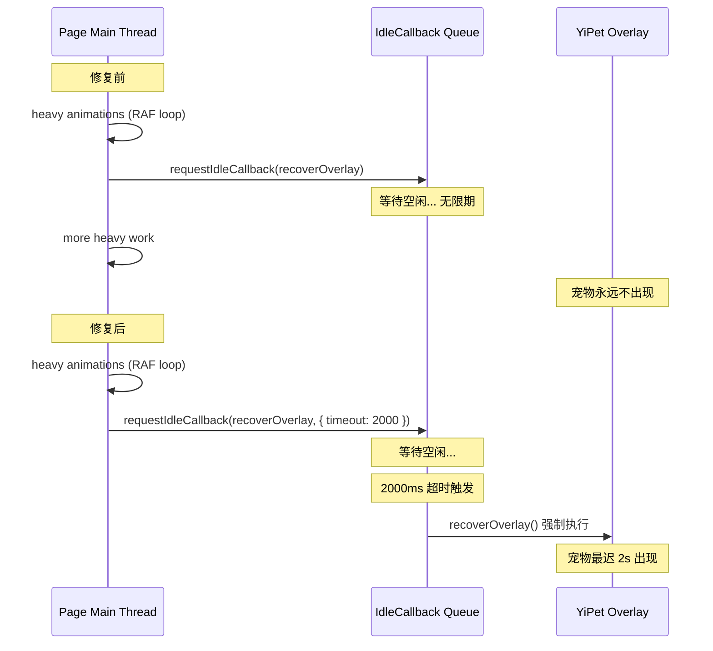

---

doc_type: task
prd_task_id: "YP-09-114"
title: "YP-09-114: 运行时可靠性修复 — 技术设计"
status: 已完成
priority: P2
owner: Claude
roles: [engineer]
created: 2026-09-23
updated: 2026-09-23
project: YiPet
project_id: yipet
prd_month: "202609"
estimate_frontend: 0.25
source_prd: "114-基础设施-requestIdleCallback超时与CSP合规.md"
tags: [reliability, csp, performance]

type: task
---

# YP-09-114: 运行时可靠性修复 — 技术设计

> **版本**：v1.0 · **人天**：0.25d

---

## 1. 业务上下文

两处运行时可靠性问题需要修复：`requestIdleCallback` 无超时兜底导致宠物注入延迟，以及更新横幅内联 `onclick` 违反 MV3 CSP。

## 2. 架构

### requestIdleCallback 超时机制



### 对比

```typescript
// 修复前
const _scheduleIdle = 'requestIdleCallback' in window
  ? (fn: () => void) => requestIdleCallback(fn)           // ❌ 可能无限等待
  : (fn: () => void) => setTimeout(fn, 0);                // ❌ 0ms 在繁忙时也不够

// 修复后
const _scheduleIdle = 'requestIdleCallback' in window
  ? (fn: () => void) => requestIdleCallback(fn, { timeout: 2000 })  // ✅ 最多等 2s
  : (fn: () => void) => setTimeout(fn, 50);                         // ✅ 合理回退
```

### 更新横幅 DOM 构建

```typescript
// 修复前
banner.innerHTML =
  '<button onclick="location.reload()">刷新页面</button>';  // ❌ CSP 违规

// 修复后
const btn = document.createElement('button');
btn.textContent = '刷新页面';
btn.addEventListener('click', () => location.reload());  // ✅ CSP 合规
banner.appendChild(wrapper);
```

## 3. 变更清单

| 文件 | 行号 | 变更 | 说明 |
|------|------|------|------|
| `bootstrap.ts` | 65 | `requestIdleCallback(fn)` → `requestIdleCallback(fn, { timeout: 2000 })` | 一对一替换 |
| `bootstrap.ts` | 66 | `setTimeout(fn, 0)` → `setTimeout(fn, 50)` | polyfill 改善 |
| `overlay.ts` | 472-484 | `innerHTML` 字符串拼接 → `createElement` + `appendChild` | 24行 → 26行 |

## 4. 验证

```bash
npm run typecheck    # ✓
npm test             # ✓ 138/138
npm run build        # ✓ 4 entries
```