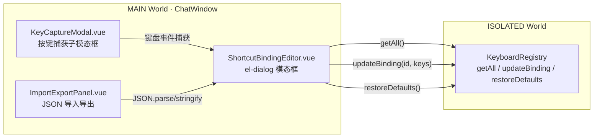

# YP-09-191: 快捷键绑定编辑器 — 开发方案

> 来源 PRD：[198-功能实现-快捷键绑定编辑器.md](../../prds/2026-09/198-功能实现-快捷键绑定编辑器.md)
> 需求编号：YP-09-191 · 优先级：P2 · 人天：0.2d 估算 · 状态：待开始
> 依赖：YP-09-29 (KeyboardRegistry 核心) 已落地 · YP-09-97 (CheatSheetOverlay) 已落地
> 本文档定义 **快捷键绑定编辑器的完整实现方案**。需求见 PRD，验证方式见[测试用例](../../tests/2026-09/198-prd-test-快捷键绑定编辑器.md)。

---

## 一、方案概述

### 1.1 架构定位

快捷键绑定编辑器位于 **MAIN World 的聊天窗口**内，作为独立的 `el-dialog` 模态框渲染。通过 `keyboardRegistry` 的公开 API（`getAll()`、`updateBinding()`、`restoreDefaults()`）完成快捷键的查看、编辑、重置、导入导出。



### 1.2 职责边界

| 组件 | 文件 | 职责 | 明确不做 |
|------|------|------|---------|
| ShortcutBindingEditor | `src/chat/components/ShortcutBindingEditor.vue` | 主模态框：按场景分组展示快捷键列表，提供编辑/重置/导入导出入口 | 不直接处理键盘事件 |
| KeyCaptureModal | `src/chat/components/KeyCaptureModal.vue` | 按键捕获子模态框：进入监听模式，捕获 keydown 事件解析修饰键+主键，显示冲突警告 | 不修改 KeyboardRegistry |
| ImportExportPanel | `src/chat/components/ImportExportPanel.vue` | JSON 导出下载 + 文件导入上传 | 不做版本迁移（第一版） |

---

## 二、文件清单

| 文件 | 类型 | 职责 |
|------|------|------|
| `src/chat/components/ShortcutBindingEditor.vue` | 新增 | 编辑器主模态框（el-dialog），4 场景分组列表 |
| `src/chat/components/KeyCaptureModal.vue` | 新增 | 按键捕获子模态框：监听模式 + 冲突显示 |
| `src/chat/components/ImportExportPanel.vue` | 新增 | JSON 导出（下载 .json 文件）+ 导入（FileReader） |
| `src/chat/components/ChatWindow.vue` | 修改 | 挂载 ShortcutBindingEditor |
| `src/chat/components/ChatToolbar/ChatToolbar.vue` | 修改 | 添加快捷键设置入口按钮（键盘图标） |
| `src/chat/components/index.ts` | 修改 | 导出新组件 |

---

## 三、模块设计

### 3.1 ShortcutBindingEditor（主编辑器）

**UI 结构**：

```
el-dialog (title="Keyboard Shortcuts", width="720px")
├── el-tabs (4 个场景 tab)
│   ├── Tab: 全局 (5 shortcuts)
│   ├── Tab: 聊天 (7 shortcuts)
│   ├── Tab: 工具 (—)
│   └── Tab: 阅读 (—)
├── el-table (当前 tab 的快捷键列表)
│   ├── Column: 操作名称 (description)
│   ├── Column: 当前快捷键 (kbd 样式，蓝色标记=已自定义)
│   ├── Column: 操作按钮
│   │   ├── 编辑按钮 → 打开 KeyCaptureModal
│   │   └── 重置按钮 → 恢复默认 (仅自定义过的行显示)
├── Footer:
│   ├── 导入按钮 → 触发 file input
│   ├── 导出按钮 → 下载 JSON
│   └── 全部重置按钮 → 确认对话框 → restoreDefaults()
```

**关键交互**：

| 交互 | 行为 |
|------|------|
| 点击快捷键行 | 打开 KeyCaptureModal，进入按键捕获模式 |
| 捕获完成确认 | 调用 `keyboardRegistry.updateBinding(id, newKeys)`，成功后列表即时刷新 |
| 冲突返回 | `updateBinding` 返回 `{ conflict: 'new-session' }`，显示冲突警告 "已被'新建会话'使用" |
| 重置单个 | 调用 `updateBinding(id, defaultKeys)` 恢复默认值 |
| 全部重置 | `ElMessageBox.confirm` 确认 → `keyboardRegistry.restoreDefaults()` |
| 导出 JSON | `JSON.stringify` 自定义绑定 → `Blob` → `<a download>` |
| 导入 JSON | `<input type="file">` → `FileReader.readAsText` → `JSON.parse` → 批量 `updateBinding` |

### 3.2 KeyCaptureModal（按键捕获）

**状态机**：

```
IDLE → 用户点击编辑 → LISTENING → 用户按键 → CAPTURED → 用户确认 → IDLE
                                  → 用户按 Escape → IDLE (取消)
                    → 用户点击取消 → IDLE
```

**捕获逻辑**：

```typescript
function onKeyDown(e: KeyboardEvent) {
  e.preventDefault();
  e.stopPropagation();

  // 忽略纯修饰键按下
  if (['Control', 'Alt', 'Shift', 'Meta'].includes(e.key)) return;

  capturedKeys.value = {
    ctrlKey: e.ctrlKey || e.metaKey,
    altKey: e.altKey,
    shiftKey: e.shiftKey,
    key: e.key,
  };
}

function confirmBinding() {
  if (!capturedKeys.value) return;

  // 验证组合键有效性
  const validation = validateCombination(capturedKeys.value);
  if (!validation.valid) {
    error.value = validation.error;
    return;
  }

  // 冲突检测
  const keysStr = keyToString(capturedKeys.value);
  const conflict = checkConflict(keysStr, editingId.value);
  if (conflict) {
    // 显示冲突警告，但仍允许用户确认（覆盖）
    showConflict.value = true;
    conflictMessage.value = conflict;
  }

  emit('confirm', keysStr);
  close();
}
```

**组合键验证规则**：
- 至少包含一个非修饰键（字母/数字/功能键）
- 对于全局快捷键，需至少有一个修饰键（Ctrl/Alt/Cmd）
- 功能键 (F1-F12) 可以不搭配修饰键

### 3.3 ImportExportPanel（导入导出）

**导出流程**：
```
1. 收集所有自定义绑定 (currentKeys ≠ defaultKeys)
2. 构建 ShortcutExport 对象:
   {
     version: "1.0",
     exportedAt: new Date().toISOString(),
     platform: navigator.platform,
     shortcuts: { "zoom-in": "Ctrl+Shift+=", ... }
   }
3. JSON.stringify → Blob → URL.createObjectURL → <a download>
4. 文件名: yipet-shortcuts-{YYYY-MM-DD}.json
```

**导入流程**：
```
1. <input type="file" accept=".json"> → FileReader.readAsText
2. JSON.parse → 验证 version + shortcuts 字段
3. 遍历 shortcuts: 跳过无效 ID，对有效 ID 调用 updateBinding
4. 显示结果: "成功导入 N 个快捷键，跳过 M 个"
5. 列表即时刷新
```

**导入兼容性**：
- 版本号不匹配 → 警告但仍尝试导入（向前兼容）
- 快捷键 ID 不存在 → 跳过并计数
- JSON 格式无效 → 显示错误提示

---

## 四、实施步骤与验证

| 步骤 | 内容 | 涉及文件 | 验证方式 | 人天 |
|------|------|---------|---------|------|
| 1 | 实现 ShortcutBindingEditor 主模态框 | `ShortcutBindingEditor.vue` | 4 tab 分组显示，列表渲染正确 | 0.04 |
| 2 | 实现 KeyCaptureModal 按键捕获 | `KeyCaptureModal.vue` | 按 Ctrl+Shift+K → 显示 "Ctrl+Shift+K" | 0.04 |
| 3 | 实现冲突检测与提示 | `KeyCaptureModal.vue` | 重复绑定 → 显示冲突警告 | 0.02 |
| 4 | 实现导入导出功能 | `ImportExportPanel.vue` | 导出 JSON → 导入 → 绑定生效 | 0.03 |
| 5 | 实现重置功能（单个+全部） | `ShortcutBindingEditor.vue` | 重置单个 → 恢复默认；全部重置 → 确认后恢复 | 0.02 |
| 6 | 集成到 ChatWindow + 工具栏入口 | `ChatWindow.vue` + `ChatToolbar.vue` | 工具栏按钮打开编辑器 | 0.02 |
| 7 | typecheck + build 验证 | — | tsc 通过，构建成功 | 0.02 |

**合计：0.19d**。

### 验证检查点

| 步骤 | 验证项 | 通过标准 |
|------|--------|---------|
| 1 | 编辑器列表渲染 | 14 个快捷键按 4 tab 分组显示 |
| 2 | 按键捕获 | 按下 Ctrl+Shift+K → 模态框显示 "Ctrl + Shift + K" |
| 3 | 冲突检测 | 将 zoom-in 改为 Ctrl+B → 显示 "已被'切换侧边栏'使用" |
| 4 | 导出导入 | 导出 JSON → 修改内容 → 导入 → 快捷键更新 |
| 5 | 重置全部 | 全部重置 → 所有自定义标记消失 → 快捷键恢复默认 |

---

## 五、边缘场景处理

| 场景 | 触发条件 | 处理策略 | 实现位置 |
|------|---------|---------|---------|
| 按键捕获时 IME 激活 | 中文输入法激活状态下按键 | 捕获 `compositionstart` 事件，显示提示 "请关闭输入法后再录制快捷键" | KeyCaptureModal |
| 仅按修饰键 | 用户只按 Ctrl 无主键 | `validateCombination` 返回 `{ valid: false, error: '请包含一个字母、数字或功能键' }` | KeyCaptureModal |
| 导入文件非 JSON | 用户选择了 .txt 或其他文件 | JSON.parse 失败 → 显示 "无效的配置文件格式" | ImportExportPanel |
| 导入含已废弃 ID | 旧版本配置文件包含已删除的快捷键 ID | 跳过无效 ID，报告 "成功导入 10 个，跳过 2 个" | ImportExportPanel |
| 跨平台导入 | macOS 导出的配置导入到 Windows | 快捷键键位原样导入，修饰键显示由 `displayKeys()` 自动适配平台 | ImportExportPanel |

---

## 六、已知缺陷与改进项

### 缺陷 1（P2）：跨版本导入无 Schema 迁移

**现象**：快捷键 ID 在新版本中重命名后，旧配置的绑定无法导入。

**根因**：当前导入仅跳过无效 ID，不做 ID 映射/迁移。

**影响**：升级扩展版本后用户需重新配置快捷键。

**改进方向**：在 `ShortcutExport` 中增加 `schemaVersion`，维护一个迁移映射表 `{ oldId: newId }`，导入时自动转换。

---

## 七、风险与回滚

| 风险 | 概率 | 影响 | 缓解措施 |
|------|------|------|---------|
| 按键捕获时页面快捷键被阻止 | 确定 | 低 | 捕获模态框内 `e.preventDefault()` + `stopPropagation()`，仅影响该模态框 |
| chrome.storage.sync 写入冲突 | 低 | 中 | 使用 KeyboardRegistry 已有的 sync→local fallback 机制 |

| 场景 | 回滚方式 | 影响范围 |
|------|---------|---------|
| 编辑器导致聊天窗口异常 | 从 ChatWindow 模板移除编辑器组件 | 失去可视化编辑，但仍可通过 chrome://extensions/shortcuts 修改全局快捷键 |
| 导入功能损坏 | 隐藏导入按钮，保留导出和手动编辑 | 无法从文件恢复配置 |

---

## 八、完成定义（DoD）

- [ ] ShortcutBindingEditor 以 el-dialog 模态框形式渲染
- [ ] 4 场景 tab（全局/聊天/工具/阅读）分组展示
- [ ] KeyCaptureModal 正确捕获修饰键+主键组合
- [ ] 组合键验证规则生效（纯修饰键拒绝、无修饰键警告）
- [ ] 冲突检测提示正确（扩展内 + 已知系统冲突）
- [ ] 导出 JSON 格式正确，文件名含日期
- [ ] 导入 JSON 有格式校验、版本检查、跳过无效 ID 并报告
- [ ] 单个重置恢复默认，全部重置有确认对话框
- [ ] 工具栏入口按钮可见
- [ ] `npm run build` 无错误
- [ ] `vue-tsc --noEmit` 通过