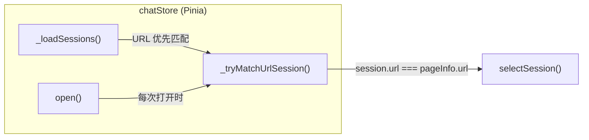

---

doc_type: module
prd_task_id: "YP-09-232"
title: "YP-09-232: 聊天框打开时默认选中 URL 对应会话 — 页面感知的会话自动选择 — 开发方案"
status: 已完成
priority: P1
owner: 陈铭
roles: [engineer]
created: "2026-09-22"
updated: "2026-09-22"
project: YiPet
project_id: yipet
prd_month: "202609"
estimate_frontend: 0.25
source_prd: "232-体验优化-聊天框打开默认选中url对应会话.md"
related_tests: ["232-prd-test-聊天框默认选中url会话.md"]
source_okr: [yipet-002]

type: task
---

# YP-09-232: 聊天框打开时默认选中 URL 对应会话 — 开发方案

> 来源 PRD：[232-体验优化-聊天框打开默认选中url对应会话.md](../../prds/2026-09/232-体验优化-聊天框打开默认选中url对应会话.md)
> 需求编号：YP-09-232 · 优先级：P1 · 人天：0.25d
> 本文档定义 **URL 感知的会话自动选择在 Chat Pinia Store 中的实现方案**。需求见 PRD，验证方式见[测试用例](../../tests/2026-09/232-prd-test-聊天框默认选中url会话.md)。

---

## 一、方案概述

### 1.1 架构定位

此功能完全位于 Chat Pinia Store（`src/chat/stores/chat.ts`）内部，不涉及 Content Script、Service Worker 或 API 层。



### 1.2 职责边界

| 层/组件 | 文件 | 职责 | 明确不做 |
|---------|------|------|---------|
| `_loadSessions` | `src/chat/stores/chat.ts:627-641` | 加载会话列表后优先 URL 匹配 | 不改变排序/持久化逻辑 |
| `_tryMatchUrlSession` | `src/chat/stores/chat.ts:1912-1920` | 刷新 pageInfo 并匹配 URL | 不发起网络请求 |
| `open` | `src/chat/stores/chat.ts:1922-1925` | 包装 `_windowActions.open()` + URL 匹配 | 不影响窗口位置/大小 |

---

## 二、文件清单

| 文件 | 类型 | 职责 |
|------|------|------|
| `src/chat/stores/chat.ts` | 修改 | `_loadSessions` 中增加 URL 优先匹配；新增 `_tryMatchUrlSession` 和 `open` 方法 |

---

## 三、模块设计

### 3.1 `_loadSessions()` 中 URL 优先匹配

**改动位置**：`chat.ts` 第 627-641 行（原第 627-638 行）

原有逻辑按 `localStorage activeSessionKey → 有消息的会话 → 首个会话` 的优先级选择。改动后在最前面增加 URL 匹配步骤。

```typescript
// Auto-select session matching current page URL, then last-active, then first with messages
if (state.sessions.length > 0 && !state.currentSessionId) {
  const pageUrl = state.pageInfo.url;
  // 1) Session matching current page URL
  let target = pageUrl ? state.sessions.find((s) => s.url === pageUrl) : undefined;
  if (!target) {
    // 2) Last active session (from localStorage)
    let savedKey = null;
    try { savedKey = window.localStorage?.getItem('yipet:activeSessionKey') ?? null; } catch {}
    target = savedKey ? state.sessions.find((s) => s.id === savedKey) : undefined;
  }
  if (!target) {
    // 3) First session with messages, or first session
    target = state.sessions.find((s) => (s.messageCount || 0) > 0) || state.sessions[0];
  }
  await selectSession(target!.id);
}
```

**设计要点**：

| 要点 | 说明 |
|------|------|
| 精确匹配 | `s.url === pageUrl` 精确字符串比较——会话的 `url` 字段与当前页面的 `url` 一致时才匹配 |
| 级联回退 | URL 无匹配时依次回退到 localStorage → 有消息的会话 → 首个，不改变原有行为 |
| 时机正确 | `pageInfo` 在 `mount()` 中先于 `_loadSessions()` 设置，保证 URL 可用 |

### 3.2 打开时 URL 重新匹配

**新增方法**：`_tryMatchUrlSession()` 和 `open()` 包装函数

```typescript
function _tryMatchUrlSession() {
  state.pageInfo = readPageInfo();
  const url = state.pageInfo.url;
  if (!url) return;
  const match = state.sessions.find((s) => s.url === url);
  if (match && match.id !== state.currentSessionId) {
    selectSession(match.id);
  }
}

function open() {
  _windowActions.open();
  _tryMatchUrlSession();
}
```

**设计要点**：

| 要点 | 说明 |
|------|------|
| 刷新 pageInfo | 每次 `open()` 调用 `readPageInfo()` 重新获取当前页面信息，确保 SPA 内导航后 URL 正确 |
| 幂等 | 如果当前已选中匹配的会话，`selectSession` 不会被调用 |
| 不阻塞 UI | `readPageInfo()` 和 `find()` 均为同步操作，< 1ms |
| 无网络请求 | 仅在内存中查找，不重新加载会话列表 |
| `open` 覆盖 | `open` 定义在 `..._windowActions` 展开之后，覆盖原始的 `_windowActions.open` |

### 3.3 数据流

```
┌─ mount() ──────────────────────────────────────────────────────┐
│ 1. state.pageInfo = readPageInfo()   ← 读取当前页面 URL/标题  │
│ 2. _loadSessions()                   ← 加载会话列表            │
│    └─ URL 匹配优先 → selectSession()  ← 自动选中对应会话       │
└────────────────────────────────────────────────────────────────┘

┌─ open() ───────────────────────────────────────────────────────┐
│ 1. _windowActions.open()             ← 设置 visible = true    │
│ 2. _tryMatchUrlSession()             ← 刷新 pageInfo + 匹配   │
│    └─ url 匹配且不是当前会话 → selectSession()                 │
└────────────────────────────────────────────────────────────────┘
```

---

## 四、接口与数据契约

无新增 RPC 调用或 chrome.storage 数据结构变更。所有改动仅限于 Pinia store 内部状态管理逻辑。

---

## 五、MV3 特定约束

无影响——此功能不涉及 Service Worker、Content Script 或跨世界通信。

---

## 六、实施步骤与验证

| 步骤 | 内容 | 涉及文件 | 验证方式 | 人天 |
|------|------|---------|---------|------|
| 1 | `_loadSessions` 增加 URL 优先匹配 | `chat.ts` | 首次打开聊天框时自动选中 URL 对应的会话 | 0.15 |
| 2 | 新增 `_tryMatchUrlSession` + `open` 包装 | `chat.ts` | 导航到新页面后打开聊天框自动切换会话 | 0.10 |

**合计：0.25d**。

### 验证检查点

| 步骤 | 验证项 | 通过标准 |
|------|--------|---------|
| 1 | 首次打开聊天框 | 自动选中当前页面 URL 对应的会话 |
| 1 | 页面无对应会话 | 回退到 localStorage 中上次活跃的会话 |
| 2 | 切换页面后重新打开 | 切换到新页面 URL 对应的会话 |
| 2 | 当前已选中正确会话 | 不触发重复的 `selectSession` |

---

## 七、边缘场景处理

| 场景 | 触发条件 | 处理策略 | 实现位置 |
|------|---------|---------|---------|
| pageInfo.url 为空 | 特殊页面（如 chrome://）无 URL | `if (!url) return` 跳过匹配 | `_tryMatchUrlSession` |
| 会话列表为空 | 首次使用、无历史会话 | 跳过 `selectSession`，等待用户发送消息时 `_findOrCreateSession` 创建 | `_loadSessions` |
| 会话列表加载中 | `_loadSessions` 正在进行 | `_loadSessionsPromise` 守卫防止重复加载 | `_loadSessions` |

---

## 八、已知缺陷与改进项

无已知缺陷。

---

## 九、完成定义（DoD）

- [x] `_loadSessions` 中 URL 优先匹配逻辑落地
- [x] `_tryMatchUrlSession` + `open` 包装函数落地
- [x] `vue-tsc --noEmit` 通过（pre-existing error 除外）
- [x] `npm test` 全量通过（pre-existing failures 除外）
- [x] 单元测试覆盖核心匹配逻辑