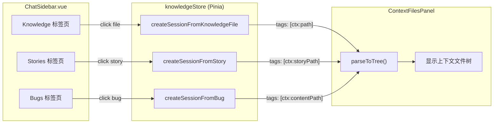

---

doc_type: module
prd_task_id: "YP-09-233"
title: "YP-09-233: 会话创建即自动加载上下文文件 — Knowledge Store 改造 — 开发方案"
status: 已完成
priority: P1
owner: 陈铭
roles: [engineer]
created: "2026-09-22"
updated: "2026-09-22"
project: YiPet
project_id: yipet
prd_month: "202609"
estimate_frontend: 0.25
source_prd: "233-体验优化-会话上下文文件自动加载.md"
related_tests: ["233-prd-test-会话上下文文件自动加载.md"]
source_okr: [yipet-002]

type: task
---

# YP-09-233: 会话创建即自动加载上下文文件 — 开发方案

> 来源 PRD：[233-体验优化-会话上下文文件自动加载.md](../../prds/2026-09/233-体验优化-会话上下文文件自动加载.md)
> 需求编号：YP-09-233 · 优先级：P1 · 人天：0.25d
> 本文档定义 **3 个 createSessionFrom* 函数中 ctx: tag 和 pageContent 格式化方案**。需求见 PRD，验证方式见[测试用例](../../tests/2026-09/233-prd-test-会话上下文文件自动加载.md)。

---

## 一、方案概述

### 1.1 架构定位

此功能完全位于 Knowledge Pinia Store 内部（`src/chat/stores/knowledge.ts`），不涉及 UI 组件或 API 层变更。



### 1.2 职责边界

| 函数 | 改动 | 不改动 |
|------|------|--------|
| `createSessionFromKnowledgeFile` | 添加 `ctx:path` tag；格式化 pageContent 为 `## path\n\ncontent` | 不改 session 创建流程、RAG scope 设置 |
| `createSessionFromStory` | 添加 `ctx:storyPath` tag；格式化 pageContent | 不改 story 读取、syntheticUrl 计算 |
| `createSessionFromBug` | 添加 `ctx:contentPath` tag（如有） | 不改 bug 摘要表格生成、syntheticUrl 计算 |

---

## 二、文件清单

| 文件 | 类型 | 职责 |
|------|------|------|
| `src/chat/stores/knowledge.ts` | 修改 | 3 个 createSessionFrom* 函数增加 ctx: tag + pageContent 格式化 |

---

## 三、模块设计

### 3.1 上下文系统工作原理

ContextFilesPanel 使用 `parseToTree(pageContent, tags)` 解析上下文文件树：

```typescript
// contextTreeUtils.ts
export function parseToTree(raw: string, tags: string[]): ContextNode[] {
  const ctxPaths = extractCtxPaths(tags);  // 提取所有 ctx: 前缀的 tag
  if (ctxPaths.length) {
    filePaths = ctxPaths;                  // 优先使用 ctx: tag 路径
  } else if (raw) {
    // 否则从 pageContent 解析 ## path 标题
    filePaths = sections.map(sec => sec.match(/^## (.+)$/)?.[1]).filter(Boolean);
  }
  // 从 pageContent 提取各文件的内容
  // ...
}
```

**关键设计**: `ctx:` tag 优先于 pageContent 解析；两者同时存在时，`ctx:` 决定路径列表，pageContent 提供正文内容。

### 3.2 `createSessionFromKnowledgeFile` 改造

```typescript
// 新增变量
const ctxTag = `ctx:${path}`;
const formattedContent = `## ${path}\n\n${content}`;

// 新 session 创建
tags: ['source:YiKnowledge', `from:${path}`, ctxTag],
pageContent: formattedContent,

// 已有 session 重新打开
if (!(existing.tags || []).includes(ctxTag)) {
  existing.tags = [...(existing.tags || []), ctxTag];
}
existing.pageContent = formattedContent;
await s.update(existing.id, { pageContent: formattedContent, tags: existing.tags });
```

### 3.3 `createSessionFromStory` 改造

```typescript
const storyPath = `${story.project}/${storyName}/story.md`;
const ctxTag = `ctx:${storyPath}`;
const formattedContent = `## ${storyPath}\n\n${content}`;

// 新 session tags
tags: ['source:YiKnowledge', `project:${story.project}`, `story:${storyName}`, ctxTag],

// 已有 session 补充 ctx: tag
```

### 3.4 `createSessionFromBug` 改造

```typescript
const tags = ['source:YiPet', `bug:${bug.key}`, `project:${bug.project}`];
if (bug.contentPath) {
  tags.push(`ctx:${bug.contentPath}`);
}

// 已有 session 补充 ctx: tag
if (bug.contentPath && !existingTags.includes(`ctx:${bug.contentPath}`)) {
  existingTags.push(`ctx:${bug.contentPath}`);
}
```

**注意**: Bug 的 pageContent 保持原有的 markdown 概要表格格式，不改为 `## path` 格式。`ctx:` tag 已足够让 Context 面板显示文件路径；正文内容可后续通过知识库 API 加载。

---

## 四、接口与数据契约

无新增 RPC 调用。Session 数据结构变化：

| 字段 | 变化 |
|------|------|
| `tags` | 新增 `ctx:{path}` 条目 |
| `pageContent` | Knowledge/Story 会话改为 `## path\n\ncontent` 格式 |

---

## 五、MV3 特定约束

无影响——此功能不涉及 Service Worker、Content Script 或跨世界通信。

---

## 六、实施步骤与验证

| 步骤 | 内容 | 涉及文件 | 验证方式 | 人天 |
|------|------|---------|---------|------|
| 1 | `createSessionFromKnowledgeFile` 添加 ctx tag + 格式化 | `knowledge.ts` | 点击知识文件后打开 Context 面板，文件出现 | 0.10 |
| 2 | `createSessionFromStory` 添加 ctx tag + 格式化 | `knowledge.ts` | 点击 Story 后 Context 面板显示 story.md | 0.08 |
| 3 | `createSessionFromBug` 添加 ctx tag | `knowledge.ts` | 点击 Bug 后 Context 面板显示文件 | 0.07 |

**合计：0.25d**。

### 验证检查点

| 步骤 | 验证项 | 通过标准 |
|------|--------|---------|
| 1 | 点击 Knowledge 文件 → 打开 Context 面板 | 面板显示该文件路径 + 内容 |
| 1 | 重复点击同一 Knowledge 文件 | 不重复添加 ctx tag，Content 面板行为正确 |
| 2 | 点击 Story → 打开 Context 面板 | 面板显示 `{project}/{name}/story.md` |
| 3 | 点击 Bug → 打开 Context 面板 | 面板显示 `bug.contentPath` 路径 |

---

## 七、边缘场景处理

| 场景 | 触发条件 | 处理策略 | 实现位置 |
|------|---------|---------|---------|
| bug.contentPath 为空 | Bug 无关联知识库文件 | 不添加 ctx: tag，不 crash | `createSessionFromBug` |
| 已有 session 重新打开 | syntheticUrl 匹配到已有 session | 补充缺失的 ctx: tag 并通过 s.update 持久化 | 各 createSessionFrom* |
| 已有 session 已有 ctx: tag | 重复点击同一条目 | `if (!includes(ctxTag))` 不重复添加 | 已有 session 分支 |

---

## 八、已知缺陷与改进项

无已知缺陷。

---

## 九、完成定义（DoD）

- [x] `createSessionFromKnowledgeFile` 添加 ctx tag + 格式化 pageContent
- [x] `createSessionFromStory` 添加 ctx tag + 格式化 pageContent
- [x] `createSessionFromBug` 添加 ctx tag（如有 contentPath）
- [x] 已有 session 重新打开时补充 ctx tag
- [x] `vue-tsc --noEmit` 通过（pre-existing error 除外）
- [x] `npm test` 全量通过（pre-existing failures 除外）
- [x] `npm run build` 通过