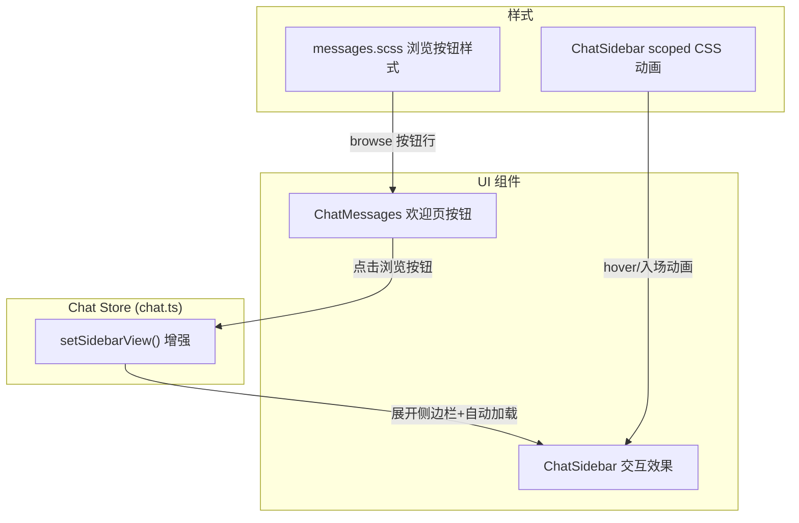

---

doc_type: module
prd_task_id: "YP-09-234"
title: "YP-09-234: 聊天弹框 Knowledge/Stories/Bugs 交互增强 — 开发方案"
status: 已完成
priority: P1
owner: 陈铭
roles: [engineer]
created: "2026-09-22"
updated: "2026-09-22"
project: YiPet
project_id: yipet
prd_month: "202609"
estimate_frontend: 0.5
source_prd: "234-体验优化-聊天弹框knowledge-stories-bugs交互增强.md"
related_tests: ["234-prd-test-聊天弹框knowledge-stories-bugs交互增强.md"]
source_okr: [yipet-002]

type: task
---

# YP-09-234: 聊天弹框 Knowledge/Stories/Bugs 交互增强 — 开发方案

> 来源 PRD：[234-体验优化-聊天弹框knowledge-stories-bugs交互增强.md](../../prds/2026-09/234-体验优化-聊天弹框knowledge-stories-bugs交互增强.md)
> 需求编号：YP-09-234 · 优先级：P1 · 人天：0.5d
> 本文档定义 **Knowledge/Stories/Bugs 交互增强在 Chat Store + ChatSidebar + ChatMessages 中的实现方案**。需求见 PRD，验证方式见[测试用例](../../tests/2026-09/234-prd-test-聊天弹框knowledge-stories-bugs交互增强.md)。

---

## 一、方案概述

### 1.1 架构定位

改动分布在三个层面：



### 1.2 职责边界

| 层/组件 | 文件 | 职责 | 明确不做 |
|---------|------|------|---------|
| `setSidebarView` | `chat.ts:1344-1357` | 展开侧边栏 + 切换标签 + 自动加载 | 不改变数据加载逻辑 |
| `ChatMessages` | `ChatMessages.vue:191-194` | 欢迎页渲染三个浏览按钮 | 不改变会话创建逻辑 |
| `ChatSidebar` | `ChatSidebar.vue` | 交互效果 + 同步时间显示 | 不改变 API 调用 |
| `messages.scss` | `ChatMessages_styles/messages.scss` | 浏览按钮行样式 | — |

---

## 二、文件清单

| 文件 | 类型 | 职责 |
|------|------|------|
| `src/chat/stores/chat.ts` | 修改 | `setSidebarView` 展开侧边栏 + 自动加载 Stories/Bugs |
| `src/chat/components/ChatMessages.vue` | 修改 | 欢迎页增加 📚 Knowledge / 📖 Stories / 🐛 Bugs 浏览入口 |
| `src/chat/components/ChatMessages_styles/messages.scss` | 修改 | `.cm-welcome-empty-browse` 样式 |
| `src/chat/components/ChatSidebar.vue` | 修改 | Knowledge 同步时间、hover 动画、Stories/Bugs 入场动画 |

---

## 三、模块设计

### 3.1 `setSidebarView` 增强

**改动位置**：`chat.ts` 第 1344-1357 行

原有逻辑仅切换 `state.sidebarView`，不改变侧边栏折叠状态。改动后：

```typescript
function setSidebarView(view: 'sessions' | 'knowledge' | 'stories' | 'bugs') {
    if (state.sidebarView === view && !state.sidebarCollapsed) return;
    state.sidebarView = view;
    state.sidebarCollapsed = false;                    // ★ 新增：展开侧边栏
    _persistSetting('sidebarCollapsed', false);        // ★ 新增：持久化
    if (view === 'knowledge') { /* 加载树 + 分类 */ }
    if (view === 'stories') { /* ★ 新增：自动加载故事 */ }
    if (view === 'bugs') { /* ★ 新增：自动加载缺陷 */ }
}
```

**关键变更**：
- `state.sidebarCollapsed = false` — 确保切换标签时侧边栏可见
- 新增 Stories 标签的自动加载逻辑
- 新增 Bugs 标签的自动加载逻辑

### 3.2 欢迎页浏览按钮

**改动位置**：`ChatMessages.vue` 空状态模板

```html
<div class="cm-welcome-empty-browse">
  <span class="cm-welcome-empty-browse-label">Browse:</span>
  <el-button size="small" text @click="store.setSidebarView?.('knowledge')">📚 Knowledge</el-button>
  <el-button size="small" text @click="store.setSidebarView?.('stories')">📖 Stories</el-button>
  <el-button size="small" text @click="store.setSidebarView?.('bugs')">🐛 Bugs</el-button>
</div>
```

### 3.3 Knowledge 标签交互增强

**改动位置**：`ChatSidebar.vue`

| 特性 | 实现方式 |
|------|---------|
| 同步时间显示 | `localStorage` 存储 `yipet:knowledge:lastSyncTime`，`lastSyncLabel()` 计算相对时间 |
| 同步按钮 tooltip | `el-tooltip` 包裹同步按钮，显示"上次同步：3m ago" |
| 文件 hover 滑动 | `.is-file:hover { transform: translateX(2px) }` + `transition: transform 0.15s` |
| 文件 active 状态 | `.is-file:active { transform: translateX(0) }` |
| 拖拽提示 | 头部显示"Drag → Chat"标签 |
| 文件单击预览 | 调用 `store.openKnowledgePreview(path)`（匹配 YiVad 行为） |
| 文件双击创建会话 | 调用 `store.createSessionFromKnowledgeFile(path)` |

### 3.4 Stories 标签交互增强

| 特性 | 实现方式 |
|------|---------|
| 入场动画 | `@keyframes storyFadeIn` + `animation-delay: #{$i * 0.03}s` 逐项延迟 |
| hover 边框 | `&:hover { border-left-color: var(--primary-light); transform: translateX(2px) }` |
| active 状态 | `&:active { transform: translateX(0) }` |

### 3.5 Bugs 标签交互增强

| 特性 | 实现方式 |
|------|---------|
| 入场动画 | `@keyframes bugFadeIn` + `animation-delay: #{$i * 0.025}s` |
| hover 边框 | `&:hover { border-left-color: var(--el-color-danger); transform: translateX(2px) }` |
| Discuss 按钮 | `opacity: 0; transform: scale(0.9)` → hover 时 `opacity: 1; transform: scale(1)`，带 `transition` |

### 3.6 知识文件交互流程

```
单击文件 → openKnowledgePreview(path) → KnowledgePreviewDialog
双击文件 → createSessionFromKnowledgeFile(path) → 新会话 + RAG 范围
拖拽文件 → ChatWindow drop handler → createSessionFromKnowledgeFile(path)
```

---

## 四、测试要点

### 手动测试

1. 打开 YiPet 聊天框 → 欢迎页显示三个浏览按钮
2. 点击 📚 Knowledge → 侧边栏展开 → Knowledge 标签激活 → 文件树加载
3. hover 文件项 → 右移 2px 动画
4. hover 同步按钮 → tooltip 显示相对时间
5. 切换 Stories 标签 → 列表入场动画播放
6. 切换 Bugs 标签 → hover 某行 → Discuss 按钮弹性出现

### 自动化测试

- `findSessionByUrl` 纯函数（已有 `tests/chat/findSessionByUrl.test.ts`）
- Chat Store 方法导出验证（`typecheck` 通过即验证）