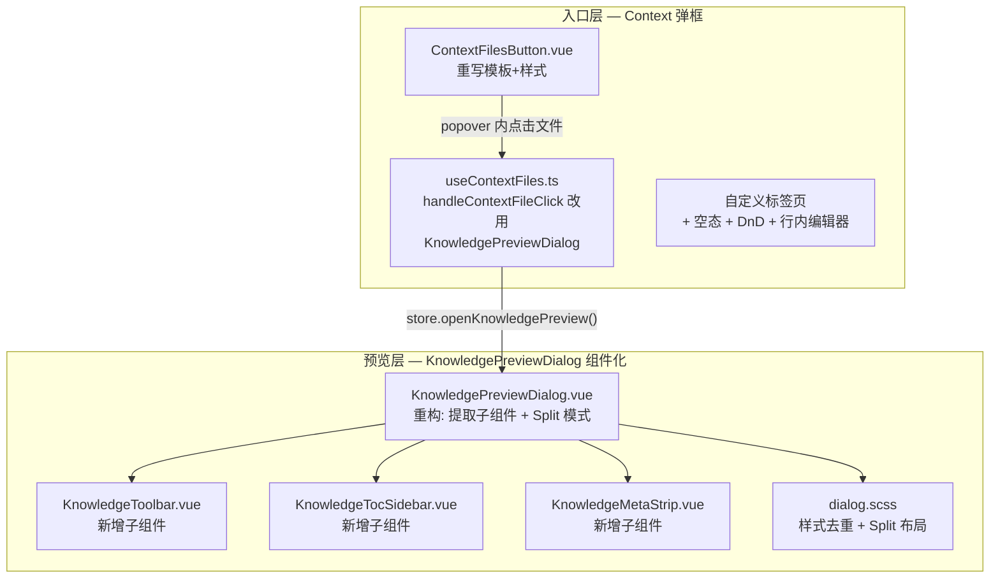

---

doc_type: module
prd_task_id: "YP-09-235"
title: "YP-09-235: Context 按钮与文件预览弹框样式对齐 — 开发方案"
status: 已完成
priority: P1
owner: Chengliang.Yi
roles: [engineer]
created: "2026-09-22"
updated: "2026-09-23"
project: YiPet
project_id: yipet
prd_month: "202609"
estimate_frontend: 1.0
source_prd: "235-体验优化-context按钮与文件预览弹框样式对齐.md"
related_tests: ["235-prd-test-context按钮与文件预览弹框样式对齐.md"]
source_okr: [yipet-002]

type: task
---

# YP-09-235: Context 按钮与文件预览弹框样式对齐 — 开发方案

> 来源 PRD：[235-体验优化-context按钮与文件预览弹框样式对齐.md](../../prds/2026-09/235-体验优化-context按钮与文件预览弹框样式对齐.md)
> 验证方式：[测试用例](../../tests/2026-09/235-prd-test-context按钮与文件预览弹框样式对齐.md)
> 需求编号：YP-09-235 · 优先级：P1 · 人天：1.0d · 状态：已完成

> **文档职责**：本文档定义**怎么做、为什么这么做、实际做成什么样**（HOW），不含产品目标与测试用例。

---

## 一、方案概述

### 1.1 架构定位

改动分布在两层：Context 弹框层（入口按钮 + 弹框交互）和 KnowledgePreviewDialog 层（文件预览弹框组件化重构）。



### 1.2 职责边界

| 层/组件 | 文件 | 职责 | 明确不做 |
|---------|------|------|---------|
| Context 按钮 | `ContextFilesButton.vue` | 药丸按钮样式 + popover 标签页 + 文件列表 | 不改变会话数据模型 |
| Context 逻辑 | `useContextFiles.ts` | 文件点击→预览弹框、DnD 处理、行内编辑器 | 不调用 YiVad 专属 API |
| KnowledgeToolbar | `KnowledgeToolbar.vue` | 返回/模式切换 (Edit/Split/Preview)/操作按钮 | 不含源页面导航/阅读列表/聊天面板 |
| KnowledgeTocSidebar | `KnowledgeTocSidebar.vue` | H2/H3 目录列表 + 折叠/展开 | 不参与文件加载 |
| KnowledgeMetaStrip | `KnowledgeMetaStrip.vue` | benefit/tacit/badges/roles/tags/related/criteria | 不修改 meta 数据 |
| KnowledgePreviewDialog | `KnowledgePreviewDialog.vue` | 组合子组件 + Split 模式 + 同步滚动 + 内部导航 | 不改变 store 数据加载逻辑 |
| 样式 | `dialog.scss` | 布局 + 排版 + Split 模式样式 | 不含子组件内部样式（已迁移至 `.kms-*`） |

---

## 二、文件清单

| 文件 | 类型 | 行数 | 职责 |
|------|------|------|------|
| `src/chat/components/ChatToolbar/ContextFilesButton.vue` | 重写 | ~280 | 药丸按钮 + 自定义标签页 popover |
| `src/chat/components/ChatToolbar/useContextFiles.ts` | 修改 | ~5 | `handleContextFileClick` → `openKnowledgePreview` |
| `src/chat/components/KnowledgePreviewDialog/KnowledgePreviewDialog.vue` | 重构 | ~400 | 组合子组件 + Split 模式 + 同步滚动 |
| `src/chat/components/KnowledgePreviewDialog/KnowledgeToolbar.vue` | **新增** | ~80 | 工具栏子组件 |
| `src/chat/components/KnowledgePreviewDialog/KnowledgeTocSidebar.vue` | **新增** | ~35 | 目录侧边栏子组件 |
| `src/chat/components/KnowledgePreviewDialog/KnowledgeMetaStrip.vue` | **新增** | ~270 | 元数据展示子组件 |
| `src/chat/components/KnowledgePreviewDialog/styles/dialog.scss` | 重构 | ~380 | 去重 + Split 布局 |

---

## 三、模块设计

### 3.1 KnowledgeToolbar — 工具栏子组件

**职责**：管理文件预览弹框的顶部操作栏，包含返回导航、模式切换、保存/取消、文档统计、下载/刷新/关闭。

**Props：**
```typescript
defineProps<{
  currentPath: string;        // 当前文件路径
  mode: KbMode;               // 'preview' | 'edit' | 'split'
  loading: boolean;           // 文件加载中
  hasContent: boolean;        // 是否有内容（控制 Download 禁用）
  saving: boolean;            // 保存中
  docStats: { chars: number; words: number; readingMin: number };
  navHistoryLength: number;   // 导航历史深度（控制返回按钮显示）
}>();
```

**Emits：** `update:mode` → 模式切换 | `goBack` → 返回上级文件 | `cancelEdit` / `save` → 编辑操作 | `downloadFile` / `refresh` / `close` → 工具操作

**模式切换校验：**
```typescript
const VALID_MODES: readonly KbMode[] = ['preview', 'edit', 'split'];
function onModeChange(value: unknown) {
  const str = typeof value === 'string' ? value : String(value ?? 'preview');
  const next = VALID_MODES.includes(str as KbMode) ? (str as KbMode) : 'preview';
  emit('update:mode', next);
}
```

**导出类型：** `export type KbMode = 'preview' | 'edit' | 'split'` — 供父组件共享模式状态

### 3.2 KnowledgeTocSidebar — 目录侧边栏

**职责**：渲染文件的 H2/H3 标题列表，支持展开（200px）↔ 折叠（36px + 首字母缩写）切换。

**Props：** `items: TocItem[]` (level/text/id) | `collapsed: boolean`
**Emits：** `toggleCollapse` | `scrollTo: [id: string]`

**显示规则**：仅在 `mode === 'preview'` 且 `toc.length >= 3` 时渲染（无 chat 模式限制，YiPet 不支持嵌入聊天面板）。

### 3.3 KnowledgeMetaStrip — 元数据展示

**职责**：解析 frontmatter 元数据，渲染 benefit 摘要、tacit 默会知识、状态/生命周期徽章、roles/tags/related 标签组、criteria tooltip。

**Props：** `meta: Record<string, unknown>` | `currentPath?: string`
**Emits：** `navigate-related: [path: string]`

**默会知识支持：**
- `meta.tacit === true` → 渲染 `tacit: yes` warning 徽章
- `typeof meta.tacit === 'string'` → 渲染警告色左边框条 + 斜体文字

**related 链接解析：** 使用 `resolvePath(href)` 解析相对路径，区分内部导航（emit `navigate-related`）和外部链接（`window.open`）。

**导出：** `defineExpose({ hasAnything, hasMeta })` — 供父组件判断是否需要渲染 `.kpd-meta` 包裹容器。

### 3.4 KnowledgePreviewDialog — Split 模式

**模式定义：** `type KbMode = 'preview' | 'edit' | 'split'`

**Split 模式布局：**
```
┌─────────────────────────────────────────────┐
│ kpd-body--split                             │
│ ┌──────────────────┐ ┌────────────────────┐ │
│ │ kpd-editor       │ │ kpd-preview        │ │
│ │ (flex: 1)        │ │ (flex: 1)          │ │
│ │ <el-input        │ │ <div v-html>       │ │
│ │  type="textarea"> │ │  rendered markdown │ │
│ └──────────────────┘ └────────────────────┘ │
│        ↕ 双向同步滚动 (requestAnimationFrame)  │
└─────────────────────────────────────────────┘
```

**同步滚动实现（对齐 YiVad）：**
```typescript
let syncScrolling = false;  // guard flag 防递归

function setupSyncScroll() {
  const editor = getEditorTextarea();  // el-input.internal textarea
  const preview = previewRef.value;    // .kpd-preview div
  if (!editor || !preview) return;

  // editor → preview: scrollTop 比例映射
  editor.addEventListener('scroll', onEditorScroll, { passive: true });
  // preview → editor: 反向映射
  preview.addEventListener('scroll', onPreviewScroll, { passive: true });
}

function teardownSyncScroll() {
  editorScrollCleanup?.();   // removeEventListener
  previewScrollCleanup?.();
}

// watch mode 在进入/离开 split 时 attach/detach
watch(() => mode.value, (next, prev) => {
  if (next === 'split' && prev !== 'split') nextTick(() => setupSyncScroll());
  else if (next !== 'split' && prev === 'split') teardownSyncScroll();
});
onBeforeUnmount(() => teardownSyncScroll());
```

**模式切换种子：** 从 preview 切换到 edit/split 时，自动 `editContent = content`。

**未保存编辑保护：** `onPreviewClick` 和 `navigateToRelated` 均在编辑未保存时阻止导航。

### 3.5 ContextFilesButton — 弹框重写

**改造前：** `Folder` 图标 + 独立计数徽章 + 绿色激活点 + `el-tabs` / `el-tab-pane` + `ElMessageBox.alert` 纯文本预览

**改造后：**
- 图标 `CollectionTag` + 内联标签 `Context` / `Context: N`
- 自定义 `.ct-pop-tabs` + `.ct-pop-tab` 下划线激活态
- 右上角 `.ct-pop-close` X 按钮 (28×28, hover 变红)
- 空态：📄 图标 + "No context files" 标题 + 引导文字
- 文件夹计数徽章 + 已添加文件绿色高亮
- 点击文件 → `store.openKnowledgePreview(path)` → 完整预览弹框
- 行内编辑器内嵌于 popover（非独立 dialog）
- 弹框宽度 420px（对齐 YiVad ContextPopover）

---

## 四、接口与数据契约

### 4.1 Store API

| 方法 | 调用位置 | 职责 |
|------|----------|------|
| `store.openKnowledgePreview(path)` | ContextFilesButton / ContextFilesPanel / ChatToolbar | 打开预览弹框 + 加载文件 |
| `store.closeKnowledgePreview()` | KnowledgePreviewDialog | 关闭预览弹框 + 重置状态 |
| `store.navigateKnowledgePreview(path)` | KnowledgePreviewDialog (内部链接) | 导航到关联文件 |
| `store.saveKnowledgePreview(content)` | KnowledgePreviewDialog (Save) | 保存编辑内容 |
| `store.loadKnowledgeTree()` | useContextFiles | 加载浏览树 |
| `store.readKnowledgeFileContent(path)` | useContextFiles | 读取文件内容（DnD 添加用） |
| `store.applyContextChange(path, content)` | useContextFiles | 写入 context 文件内容 |
| `store.addContextFile(path)` | useContextFiles | 添加 context 文件标签 |

### 4.2 状态契约

```typescript
// ChatState 中的预览状态
interface ChatState {
  knowledgePreviewVisible: boolean;   // 弹框可见性
  knowledgePreviewPath: string;       // 当前文件路径
  knowledgePreviewData: KnowledgeReadResponse | null;  // { path, name, content, meta? }
  knowledgePreviewLoading: boolean;   // 加载中
}
```

### 4.3 样式参数对齐 YiVad

| 参数 | YiVad 值 | 本实现 | 位置 |
|------|---------|--------|------|
| toolbar gap | `4px` | `4px` | `dialog.scss: .kpd-nav, .kpd-actions` |
| path max-width | `30vw` | `30vw` | `dialog.scss: .kpd-path` |
| classification gap/label/chip | `2px / 10px / 0 6px` | 同 | `dialog.scss: .kpd-classification/*` |
| meta padding/radius | `8px 10px / 6px` | 同 | `dialog.scss: .kpd-meta` |
| badge radius/padding | `10px / 1px 8px` | 同 | `KnowledgeMetaStrip: .kms-badge` |
| TOC width/collapsed | `200px → 36px` | 同 | `dialog.scss: .kpd-toc` |
| preview padding | `16px` | `16px` | `dialog.scss: .kpd-preview` |
| H1/H2/H3 | `1.5em/1.3em/1.15em` | 同 | `dialog.scss: .kpd-preview h1/h2/h3` |
| pre/blockquote/td padding | `12px 14px / 6px 14px / 6px 12px` | 同 | `dialog.scss` |
| scrollbar | `4px / 2px radius` | 同 | `dialog.scss: .kpd-preview::-webkit-scrollbar` |
| strict-mode 方法 | `defineProps` 不含冗余 `const props =` | 同 | `KnowledgeToolbar.vue` |

---

## 五、实施步骤

| 步骤 | 任务 | 人天 | 验证点 |
|------|------|------|--------|
| 1 | Context 按钮 + 弹框重写 | 0.3 | 按钮图标/标签/弹框标签页/空态/关闭按钮 |
| 2 | KnowledgePreviewDialog toolbar 对齐 + 分类面包屑 | 0.1 | 工具栏间距/路径宽度/面包屑结构 |
| 3 | 提取 KnowledgeToolbar / KnowledgeTocSidebar 子组件 | 0.15 | Props/Emits 类型正确 + 渲染正确 |
| 4 | 提取 KnowledgeMetaStrip + 默会知识支持 | 0.15 | benefit/tacit/badges/roles/tags/related 全部正确 |
| 5 | Split 模式 + 双向同步滚动 | 0.15 | 左右并排 + scroll sync + cleanup |
| 6 | 集成测试 + 文档更新 | 0.1 | typecheck/build/test 通过 + PRD/Test 文档 |
| **总计** | | **1.0d** | |

---

## 六、边缘场景

| 场景 | 处理方式 |
|------|----------|
| 文件加载失败 | 弹框显示 "Failed to load content for {path}"，工具栏保持可用（关闭/刷新） |
| 编辑器无内容 | save 仍然可执行（允许清空文件） |
| Split 模式切换文件 | `editContent` 在 preview → split 时 seed 新内容 |
| Split 模式卸载 | `onBeforeUnmount` 自动 detach 滚动监听 |
| meta 字段缺失 | `KnowledgeMetaStrip` 仅渲染存在的字段，无数据时不渲染 `.kpd-meta` 容器 |
| related 链接在编辑未保存时点击 | `navigateToRelated` 检查 `mode !== 'preview' && unsaved` 后阻止 |
| navigation 历史中打开已删除文件 | 工具栏保持可用，弹框显示加载错误 |
| 上下文弹框无文件 | 自动切换到 Browse 标签页 |

---

## 七、完成定义

- [x] `vue-tsc --noEmit` 通过（0 错误）
- [x] `npm run build` 4/4 入口构建成功
- [x] `npm test` 132/132 测试通过
- [x] Context 按钮图标 `CollectionTag` + 标签 `Context: N`
- [x] KnowledgeToolbar / KnowledgeTocSidebar / KnowledgeMetaStrip 三个子组件独立可用
- [x] Split 模式编辑器↔预览双向同步滚动
- [x] 未保存编辑保护：`onPreviewClick` + `navigateToRelated`
- [x] 样式参数与 YiVad 完全对齐
- [x] 无 `ElMessageBox` 残留
- [x] 无 `any` 类型（仅 `Record<string, unknown>` 用于 meta）
- [x] PRD / Task / Test 文档完整