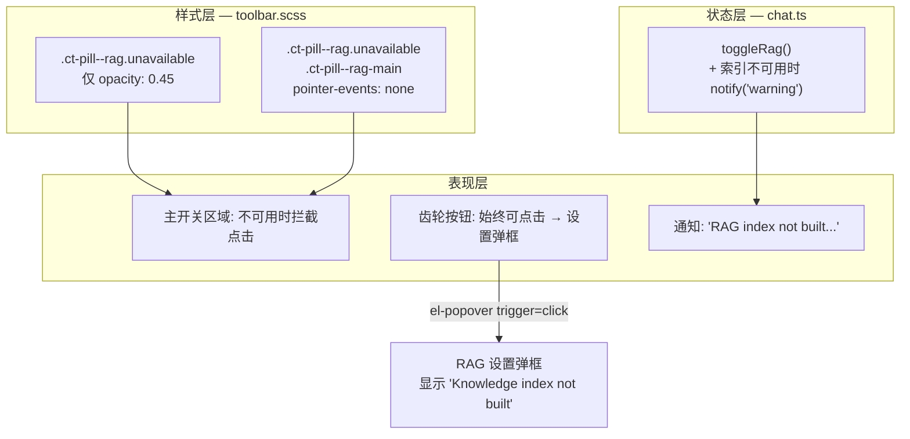

---

doc_type: module
prd_task_id: "YP-09-236"
title: "YP-09-236: RAG 按钮交互改进 — 开发方案"
status: 已完成
priority: P1
owner: Chengliang.Yi
roles: [engineer]
created: "2026-09-23"
updated: "2026-09-23"
project: YiPet
project_id: yipet
prd_month: "202609"
estimate_frontend: 0.25
source_prd: "236-体验优化-rag按钮交互改进.md"
related_tests: ["236-prd-test-rag按钮交互改进.md"]
source_okr: [yipet-002]

type: task
---

# YP-09-236: RAG 按钮交互改进 — 开发方案

> 来源 PRD：[236-体验优化-rag按钮交互改进.md](../../prds/2026-09/236-体验优化-rag按钮交互改进.md)
> 验证方式：[测试用例](../../tests/2026-09/236-prd-test-rag按钮交互改进.md)
> 需求编号：YP-09-236 · 优先级：P1 · 人天：0.25d · 状态：已完成

> **文档职责**：本文档定义**怎么做、为什么这么做、实际做成什么样**（HOW），不含产品目标与测试用例。

---

## 一、方案概述

### 1.1 架构定位

改动仅涉及 ChatToolbar 样式层和 Chat Store 的 `toggleRag` 方法，不引入新组件或新依赖。



### 1.2 职责边界

| 层 | 文件 | 职责 | 明确不做 |
|----|------|------|---------|
| 样式 | `toolbar.scss` | 精准控制 pointer-events 作用范围 | 不改变药丸视觉外观 |
| Store | `chat.ts` | `toggleRag()` 增加用户反馈 | 不改变 RAG 启用/禁用逻辑 |

---

## 二、文件清单

| 文件 | 类型 | 改动行数 | 职责 |
|------|------|---------|------|
| `src/chat/components/ChatToolbar/styles/toolbar.scss` | 修改 | +3 | 将 `pointer-events: none` 从父级移至 `.ct-pill--rag-main` 子选择器 |
| `src/chat/stores/chat.ts` | 修改 | +5/-2 | `toggleRag()` 增加索引不可用时的 warning 通知 |

---

## 三、模块设计

### 3.1 CSS — pointer-events 精准拦截

**改造前：**
```scss
.ct-pill--rag {
  &.unavailable {
    opacity: 0.45;
    pointer-events: none;  // 整颗药丸不可交互
  }
}
```

**改造后：**
```scss
.ct-pill--rag {
  &.unavailable {
    opacity: 0.45;

    .ct-pill--rag-main {
      pointer-events: none;  // 仅主开关区域拦截
    }
  }
}
```

**选择器作用域分析：**

| 元素 | 选择器 | unavailable 时行为 |
|------|--------|-------------------|
| `.ct-pill--rag` (整颗药丸) | `&.unavailable` | `opacity: 0.45` 视觉提示 |
| `.ct-pill--rag-main` (主开关) | `&.unavailable .ct-pill--rag-main` | `pointer-events: none` 阻止点击 |
| `.ct-pill--rag-gear` (齿轮) | 无特殊规则 | 正常可点击 → 打开 el-popover |

**Scoped CSS 兼容性：** 父子元素均在 `ChatToolbar.vue` 同一 SFC 内，Vue 的 scoped 属性选择器（`data-v-xxx`）会同时添加到父级和子级，子选择器正常匹配。

### 3.2 Store — toggleRag 用户反馈

**改造前：**
```typescript
function toggleRag() {
  state.ragEnabled = !state.ragEnabled;
  try { chrome.storage.local.set({ 'yipet:ragEnabled': state.ragEnabled }); } catch { /* ignore */ }
  if (state.ragEnabled && !state.ragStatus) {
    loadRagStatus();
  }
}
```

**改造后：**
```typescript
function toggleRag() {
  const wasEnabled = state.ragEnabled;
  state.ragEnabled = !state.ragEnabled;
  try { chrome.storage.local.set({ 'yipet:ragEnabled': state.ragEnabled }); } catch { /* ignore */ }
  if (state.ragEnabled) {
    if (!state.ragStatus) {
      loadRagStatus();
    } else if (!state.ragStatus.built || state.ragStatus.num_docs === 0) {
      notify('RAG index not built — enable and ask, or build index from YiAi first', 'warning');
    }
  }
}
```

**逻辑分支：**

| `ragEnabled` | `ragStatus` | 行为 |
|-------------|-------------|------|
| `false → true` | `null`（未加载） | 触发 `loadRagStatus()` 异步加载 |
| `false → true` | `{ built: false }` 或 `{ num_docs: 0 }` | 显示 warning 通知 |
| `false → true` | `{ built: true, num_docs: >0 }` | 正常启用，无额外通知 |
| `true → false` | 任意 | 正常禁用，无通知 |

**通知内容：** `"RAG index not built — enable and ask, or build index from YiAi first"` — 告知用户当前状态 + 两个可选路径（直接提问 or 先构建索引）。

---

## 四、接口与数据契约

### 4.1 无 API 变更

本次改动不涉及：
- RPC 协议变更
- REST 端点变更
- Store state 结构变更
- 组件 Props/Emits 变更

### 4.2 notify 签名

```typescript
// 已有函数签名（来自 @/chat/stores/services）
function notify(message: string, type?: 'success' | 'warning' | 'error' | 'info'): void;
```

`'warning'` 类型在现有代码中已有使用先例（如 `notify('...', 'error')`），Element Plus 的 `ElNotification` 支持所有四个类型。

---

## 五、实施步骤

| 步骤 | 任务 | 验证点 |
|------|------|--------|
| 1 | 修改 `toolbar.scss`：pointer-events 精准拦截 | 样式编译无错误 |
| 2 | 修改 `chat.ts`：toggleRag 增加 warning 通知 | TypeScript 编译通过 |
| 3 | 构建 + 类型检查 | `vue-tsc --noEmit` + `npm run build` 通过 |

---

## 六、边缘场景

| 场景 | 处理方式 |
|------|----------|
| RAG 状态异步加载中（`ragStatusLoading === true`） | 此时 `ragStatus` 为 null，走 `loadRagStatus()` 分支，不显示 warning |
| RAG 状态加载失败（`ragStatus.error` 非空） | `ragStatus.built` 为 false，显示 warning 通知 |
| 用户先启用 RAG 再构建索引 | 通知已显示，索引构建后 `ragStatus` 更新，`unavailable` 类自动移除 |
| 用户通过快捷键 Ctrl+Shift+R 触发 | 与点击行为一致，同样触发 `toggleRag()` |
| RAG 索引从可用变为不可用（如清空索引） | `ragStatus` 更新后 `.unavailable` 类自动添加，主开关区域自动拦截 |

---

## 七、完成定义

- [x] `vue-tsc --noEmit` 通过（0 错误）
- [x] `npm run build` 4/4 入口构建成功
- [x] RAG 索引不可用时齿轮按钮可点击并打开设置弹框
- [x] RAG 索引不可用时主开关区域不可点击
- [x] 启用 RAG 且索引不可用时显示 warning 通知
- [x] PRD / Task / Test 文档完整