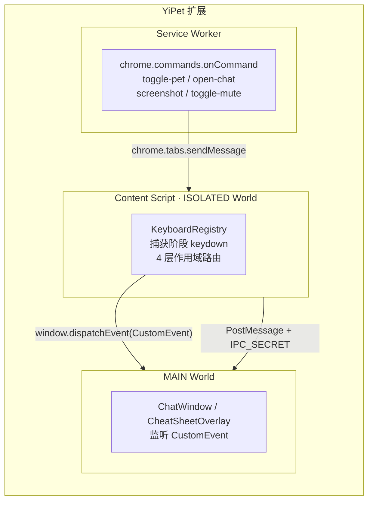
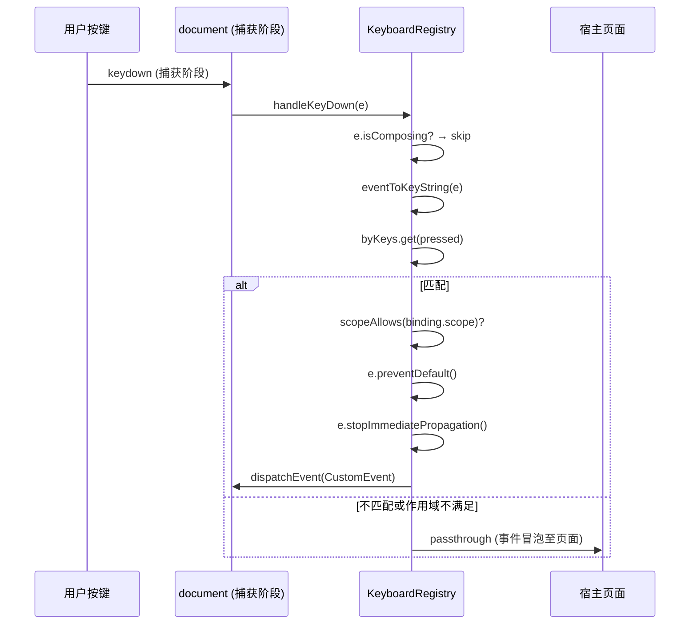
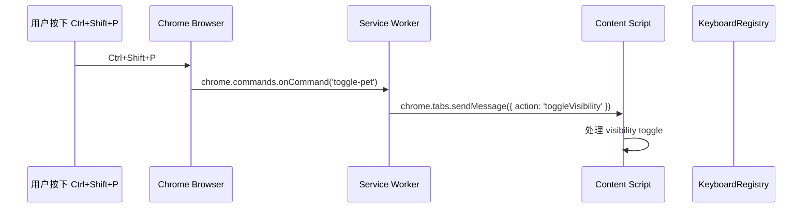
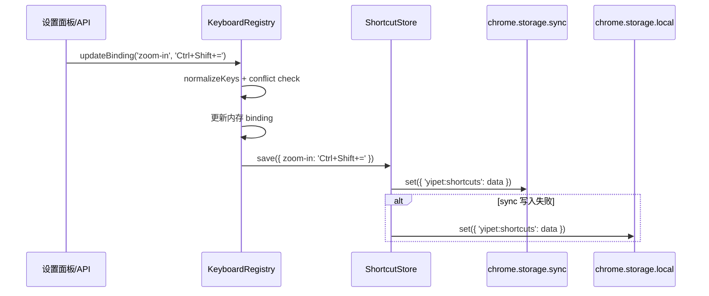

# YP-09-29: 快捷键系统 — 开发方案

> 来源 PRD：[36-架构设计-快捷键系统.md](../../prds/2026-09/36-架构设计-快捷键系统.md)
> 需求编号：YP-09-29 · 优先级：P2 · 人天：0.5d 估算
> 本文档定义 **YiPet 快捷键系统在 Chrome MV3 扩展中的实现方案**。需求见 PRD，验证方式见[测试用例](../../tests/2026-09/36-prd-test-快捷键系统.md)。

---

## 一、方案概述

### 1.1 架构定位

快捷键系统位于 YiPet 双世界架构的 **Content Script (ISOLATED World)** 层，通过 `document.addEventListener('keydown', handler, { capture: true })` 在捕获阶段拦截键盘事件。全局级快捷键（4 个）同时通过 `manifest.json` 的 `chrome.commands` 声明，由 Service Worker 转发至 Content Script。



### 1.2 职责边界

| 层/组件 | 文件 | 职责 | 明确不做 |
|---------|------|------|---------|
| KeyboardRegistry | `src/shared/shortcuts.ts` | 注册 13 个默认快捷键、捕获阶段 keydown 监听、IME 组合键守卫、4 层作用域路由、冲突检测、sync/local 双存储 | 不处理 chrome.commands 转发（由 SW 负责）；不渲染 UI |
| ShortcutStore | `src/shared/shortcuts.ts` (内部类) | chrome.storage.sync 读写 + local fallback | 不做跨设备同步冲突解决（Chrome 内置） |
| ConflictDetector | `src/shared/shortcuts.ts` (内部方法) | 检测扩展内快捷键重复 + 30 个已知浏览器/Web 应用快捷键冲突 | 不检测其他 Chrome 扩展的快捷键 |
| Service Worker | `src/background/index.ts` | 监听 4 个 chrome.commands 并转发到 Content Script | 不做快捷键解析和路由 |
| CheatSheetOverlay | `src/chat/components/CheatSheetOverlay.vue` | `?` 键触发全屏快捷键速查面板，按分类分组，搜索过滤 | 不嵌入聊天窗口内；不修改绑定 |
| ChatInput | `src/chat/components/ChatInput.vue` | 输入框内 Enter/Esc/Ctrl+K 处理，集成 registry scope 切换 | 不做全局快捷键处理 |

---

## 二、文件清单

| 文件 | 类型 | 职责 |
|------|------|------|
| `src/shared/shortcuts.ts` | 重写 | KeyboardRegistry 核心：注册、监听、路由、持久化。从 186 行简化版升级为 280+ 行完整实现 |
| `src/chat/components/CheatSheetOverlay.vue` | 新增 | `?` 键速查面板：全屏半透明 overlay，按 4 分类分组，实时搜索 |
| `src/chat/components/ChatWindow.vue` | 修改 | 挂载 CheatSheetOverlay 组件 |
| `src/chat/components/index.ts` | 修改 | 导出 CheatSheetOverlay |
| `src/background/index.ts` | 修改 | 新增 screenshot / toggle-mute 命令处理 |
| `src/shared/ipc/messages.ts` | 修改 | PopupToContent 联合类型新增 screenshot / toggleMute action |
| `manifest.json` | 修改 | chrome.commands 从 2 个扩展到 4 个 |
| `public/_locales/en/messages.json` | 修改 | 新增 10 个快捷键 i18n key |
| `public/_locales/zh_CN/messages.json` | 修改 | 新增 10 个快捷键 i18n key |

---

## 三、模块设计

### 3.1 KeyboardRegistry（核心注册中心）

**设计原则**：捕获阶段拦截 → 未匹配 passthrough → 已匹配消费并分发 CustomEvent。

```typescript
// 核心接口
interface ShortcutBinding {
  id: string;            // 唯一标识，如 'toggle-pet'
  keys: string;          // 标准化键位，如 'Ctrl+Shift+P'
  description: string;   // 人类可读描述
  category: 'pet' | 'chat' | 'navigation' | 'utility';
  scope: ShortcutScope;  // 'global' | 'chat' | 'input' | 'page'
  customizable: boolean; // 是否允许用户自定义
}

type ShortcutScope = 'global' | 'chat' | 'input' | 'page';
```

**设计要点**：

| 要点 | 说明 |
|------|------|
| 捕获阶段监听 | `{ capture: true }` — 在宿主页面事件处理器之前执行，匹配则 `stopImmediatePropagation()`，不匹配则事件正常冒泡至页面 |
| IME 守卫 | `e.isComposing` 检查 — 中文/日文输入法组合输入时跳过，避免将输入过程中的按键误识别为快捷键 |
| 4 层作用域 | global (始终) > chat (聊天窗口可见) > input (输入框聚焦) > page (仅页面浏览)；通过 `setScope()` 由 ChatInput focus/blur 和 ChatWindow 生命周期调用 |
| CustomEvent 解耦 | 匹配后 dispatch `new CustomEvent('yipet:shortcut:<id>')`，组件自行 `addEventListener` — 注册中心不持有组件引用 |
| 键位标准化 | 修饰键按 Ctrl→Alt→Shift→Meta 顺序排列，主键首字母大写；支持 `Ctrl+Shift+X` / `Command+Shift+X` 两种写法输入，统一输出 `Ctrl+Shift+X` |
| 平台感知显示 | `displayKeys()` 函数在 macOS 上显示 `Cmd` 替代 `Ctrl` |

### 3.2 快捷键注册表（13 个默认绑定）

| 快捷键 | ID | 作用域 | 分类 | 可自定义 |
|--------|-----|--------|------|----------|
| `Ctrl+Shift+P` | toggle-pet | global | pet | 是 |
| `Ctrl+Shift+X` | open-chat | global | chat | 是 |
| `Ctrl+Shift+S` | screenshot | global | utility | 是 |
| `Ctrl+Shift+M` | toggle-mute | global | pet | 是 |
| `Ctrl+I` | focus-input | chat | chat | 是 |
| `Ctrl+N` | new-session | chat | chat | 是 |
| `Ctrl+B` | toggle-sidebar | chat | navigation | 是 |
| `Ctrl+E` | export-session | chat | utility | 是 |
| `Ctrl+F` | search-messages | chat | navigation | 是 |
| `Ctrl+=` | zoom-in | chat | utility | 是 |
| `Ctrl+-` | zoom-out | chat | utility | 是 |
| `?` | cheatsheet | global | utility | 是 |
| `Enter` | send-message | input | chat | **否** |
| `Shift+Enter` | new-line | input | chat | **否** |

> **注意**：前 4 个 global 快捷键同时通过 `manifest.json` chrome.commands 声明，由 Service Worker 转发。其余通过 KeyboardRegistry 在 Content Script 中捕获。

### 3.3 ShortcutStore（持久化层）

```typescript
class ShortcutStore {
  async load(): Promise<Record<string, string>>;  // sync → local fallback
  async save(data: Record<string, string>): Promise<void>;  // sync → local fallback
  async clear(): Promise<void>;  // 清除 sync + local
}
```

**存储策略**：`chrome.storage.sync` 为主（跨设备同步，配额 100KB，快捷键配置约 500 bytes），写入失败时回退到 `chrome.storage.local`（10MB 配额）。存储 key：`yipet:shortcuts`，值为 `Record<string, string>`（仅存储用户自定义的绑定，默认值不从存储读取）。

### 3.4 已知冲突检测

维护 18 个已知浏览器/Web 应用快捷键列表（Chrome 原生 + VS Code + GitHub/Notion），初始化时检测已注册快捷键与已知列表的重叠，通过 `console.warn` 输出并通过 `knownConflicts` ref 暴露给 UI。

| 已知冲突示例 | 扩展快捷键 | 冲突说明 |
|-------------|-----------|---------|
| `Ctrl+T` | — | Chrome 打开新标签页 |
| `Ctrl+Shift+P` | toggle-pet | VS Code 命令面板 |
| `Ctrl+Shift+K` | — | VS Code 删除行 |
| `?` | cheatsheet | GitHub/Twitter/Jira 快捷键帮助 |

### 3.5 CheatSheetOverlay（快捷键速查面板）

独立 Vue 3 SFC，通过 `Teleport` 挂载到 `body`。监听 `yipet:shortcut:cheatsheet` CustomEvent 切换显示/隐藏。特性：

- **全屏半透明 overlay** — `rgba(0,0,0,0.6)` + `backdrop-filter: blur(4px)`，不遮挡底层内容但聚焦注意力
- **按分类分组** — Pet Controls / Chat / Navigation / Utilities 4 组，带标题
- **实时搜索** — 搜索名称、描述、键位字符串
- **平台感知键名** — macOS 显示 `Cmd`，Windows/Linux 显示 `Ctrl`
- **不可自定义标记** — Enter/Shift+Enter 行显示锁图标
- **键盘操作** — `Escape` 关闭，点击 overlay 背景关闭

### 3.6 作用域路由状态机

```
                    ┌──────────┐
       ChatWindow   │  hidden  │  ChatWindow
       close() ───→ │  (page)  │ ←─── open()
                    └────┬─────┘
                         │ ChatInput focus()
                         ▼
                    ┌──────────┐
                    │  chat    │
                    └────┬─────┘
                         │ ChatInput blur()
                         ▼
                    ┌──────────┐  ChatWindow
                    │  input   │  close()
                    └──────────┘
```

作用域由以下事件驱动切换：
- ChatWindow 打开 → `setScope('chat')`
- ChatInput 聚焦 → `setScope('input')`
- ChatInput 失焦 → `setScope('chat')`（如果聊天窗口仍打开）
- ChatWindow 关闭 → `setScope('page')`

---

## 四、MV3 数据流

### 4.1 Content Script 键盘事件流



### 4.2 chrome.commands 全局快捷键流



### 4.3 用户自定义快捷键持久化流



---

## 五、MV3 特定约束

| 约束 | 影响 | 应对 |
|------|------|------|
| Service Worker 生命周期 | 空闲 30s 后休眠，状态丢失 | chrome.commands 处理在 SW 中为纯消息转发，无状态 |
| Content Script ISOLATED World | 无法直接访问页面 JS 变量 | 快捷键系统不依赖页面状态，仅依赖 DOM 事件 |
| CSP 限制 | 禁止 inline script、eval | 快捷键处理纯 TypeScript，无动态执行 |
| chrome.storage 配额 | sync 100KB、local 10MB | 快捷键配置约 500 bytes，远低于限制 |
| chrome.commands 仅 4 个 | 无法动态注册全局快捷键 | 4 个核心全局操作用 chrome.commands，其余通过 CS keydown |
| 无法在 chrome:// 页面注入 CS | 快捷键在系统页面不可用 | chrome.commands 的 4 个快捷键仍可在所有页面触发 |

---

## 六、实施步骤与验证

| 步骤 | 内容 | 涉及文件 | 验证方式 | 人天 |
|------|------|---------|---------|------|
| 1 | 重写 KeyboardRegistry 核心 | `src/shared/shortcuts.ts` | 注册 13 个快捷键，Map 查找匹配 | 0.15 |
| 2 | 实现 ShortcutStore 持久化 | `src/shared/shortcuts.ts` (内部) | chrome.storage.sync 读写正常 | 0.05 |
| 3 | 添加已知冲突检测 | `src/shared/shortcuts.ts` (_detectKnownConflicts) | console.warn 输出冲突列表 | 0.03 |
| 4 | 实现 CheatSheetOverlay | `src/chat/components/CheatSheetOverlay.vue` | `?` 键打开，Escape 关闭，搜索过滤 | 0.10 |
| 5 | 扩展 manifest.json | `manifest.json` | 4 个 chrome.commands 声明正确 | 0.02 |
| 6 | 更新 SW command handler | `src/background/index.ts` | screenshot/toggle-mute 命令可触发 | 0.03 |
| 7 | 更新 IPC 消息类型 | `src/shared/ipc/messages.ts` | PopupToContent 包含新 action | 0.01 |
| 8 | 添加 i18n 消息 | `public/_locales/*/messages.json` | 快捷键标签正确显示 | 0.02 |
| 9 | 集成到 ChatWindow | `src/chat/components/ChatWindow.vue` | CheatSheetOverlay 挂载正常 | 0.02 |
| 10 | typecheck + build 验证 | — | tsc --noEmit 通过，4 入口构建成功 | 0.02 |

**合计：0.45d**。

### 验证检查点

| 步骤 | 验证项 | 通过标准 |
|------|--------|---------|
| 1 | KeyboardRegistry 注册/匹配 | `keyboardRegistry.getAll().length === 14` |
| 2 | 持久化读写 | 自定义快捷键后刷新页面，自定义仍生效 |
| 3 | 已知冲突检测 | 浏览器控制台输出冲突列表（至少 Ctrl+Shift+P → VS Code） |
| 4 | CheatSheetOverlay | `?` 键打开面板，搜索 "zoom" 过滤至 2 条，Escape 关闭 |
| 5 | manifest.json | chrome://extensions/shortcuts 显示 4 个快捷键 |
| 6 | SW 命令转发 | Ctrl+Shift+S → Content Script 收到 screenshot action |
| 8 | i18n | en 显示 "Keyboard Shortcuts"，zh_CN 显示 "键盘快捷键" |

---

## 七、边缘场景处理

| 场景 | 触发条件 | 处理策略 | 实现位置 |
|------|---------|---------|---------|
| IME 组合输入 | 中文/日文输入法激活时按键 | `e.isComposing` 为 true 时跳过快捷键匹配 | `KeyboardRegistry._handleKeyDown` |
| 输入框内 `?` 键 | 用户在 textarea/input 中按 `?` | scope 为 `input` 时不匹配 scope 为 `global` 的 cheatsheet（`?` scope 实际为 global，但当 scope 为 input 时，通过额外检查 input 聚焦状态来 gate） | CheatSheetOverlay 自身的 `?` handler 检查 `isInputFocused()` |
| 宿主页面已 stopPropagation | 页面在捕获阶段就阻止了事件 | 扩展的 `{ capture: true }` 在捕获阶段最外层（document）执行，先于页面内任何元素的事件处理器 | `document.addEventListener(..., { capture: true })` |
| chrome.storage.sync 不可用 | 用户未登录 Chrome 或配额满 | 自动回退到 chrome.storage.local；写入失败静默忽略 | `ShortcutStore.save/load` |
| SW 休眠后 chrome.commands | SW 休眠 30s 后被 chrome 唤醒 | Chrome 自动唤醒 SW 处理 `onCommand` 事件 | Chrome 内置行为 |
| 多个标签页同时修改快捷键 | sync 存储并发写入 | Chrome sync 存储使用 last-write-wins，最终一致性 | Chrome 内置行为 |

---

## 八、已知缺陷与改进项

### 缺陷 1（P2）：CheatSheetOverlay 的 `?` 键在 GitHub/Jira 等页面可能与宿主快捷键帮助冲突

**现象**：用户在 GitHub 页面按 `?` 期望看到 GitHub 的快捷键帮助，但 YiPet 的速查面板先拦截了事件。

**根因**：`?` 键在已知冲突列表中已标记，但当前仅 console.warn 提示，不自动禁用。

**影响**：在 GitHub、Twitter、Jira 等平台按 `?` 无法查看宿主页面快捷键。

**改进方向**：对已知冲突列表中的快捷键，在已检测到冲突的域名上自动禁用该快捷键，改为在 CheatSheetOverlay 中显示"在此页面已被禁用，可通过设置重新启用"提示。需要维护域名-冲突映射表。

### 缺陷 2（P3）：macOS 上 `Ctrl+=` 和 `Ctrl+-` 缩放快捷键与系统快捷键 `Cmd+=` / `Cmd+-` 不同

**现象**：macOS 用户习惯使用 `Cmd+=` / `Cmd+-` 缩放，但扩展注册的是 `Ctrl+=` / `Ctrl+-`。

**根因**：`Ctrl` 修饰键在 macOS 上不等于 `Cmd`。KeyboardRegistry 的 `normalizeKeys` 将 `Ctrl` 和 `Cmd`/`Meta` 视为同一修饰键，但实际键盘事件中 `e.ctrlKey` 和 `e.metaKey` 是独立的。

**影响**：macOS 用户按 `Cmd+=` 不会触发放大字体。

**改进方向**：在 macOS 上同时注册 `Ctrl` 和 `Cmd/Meta` 版本的快捷键，或在 `eventToKeyString` 中将 `metaKey` 映射为 `Ctrl`（当前已对全局级快捷键如此处理，但 chat scope 的快捷键可能需要调整）。

---

## 九、风险与回滚

### 风险

| 风险 | 概率 | 影响 | 缓解措施 |
|------|------|------|---------|
| 捕获阶段拦截影响宿主页面正常功能 | 中 | 高 | IME 守卫 + 未匹配 passthrough + 已知冲突检测 + 用户可自定义/禁用 |
| chrome.storage.sync 跨设备同步覆盖本地修改 | 低 | 低 | 同步为 last-write-wins，用户意图明确；配置量极小 |
| `{ capture: true }` 在部分老旧浏览器不生效 | 极低 | 低 | Chrome MV3 保证支持；仅 Chrome 目标平台 |

### 回滚

| 场景 | 回滚方式 | 影响范围 |
|------|---------|---------|
| 快捷键系统导致页面功能异常 | 调用 `keyboardRegistry.stopListening()` 禁用 CS keydown 监听，仅保留 chrome.commands | 失去自定义快捷键和聊天窗口内快捷键；全局 4 个快捷键仍可用 |
| 速查面板 UI 异常 | 从 ChatWindow 模板中移除 `<CheatSheetOverlay />` 组件 | 失去快速发现快捷键的能力 |
| 存储异常导致自定义丢失 | 调用 `keyboardRegistry.restoreDefaults()` 恢复所有默认值 | 丢失用户自定义绑定，需重新配置 |

---

## 十、完成定义（DoD）

- [ ] 8 个文件按 §2 清单落地（4 新增/重写 + 4 修改），无遗漏、无多余
- [ ] KeyboardRegistry 注册 14 个快捷键（13 个用户 + send-message 被视为 input scope 单独处理）
- [ ] 捕获阶段 keydown 监听：匹配则消费，不匹配则 passthrough
- [ ] IME 组合输入时跳过快捷键处理
- [ ] 4 层作用域路由正确（global > chat > input > page）
- [ ] 已知冲突列表 18 项，初始化时检测并 warn
- [ ] chrome.storage.sync 为主存储，local 为 fallback
- [ ] CheatSheetOverlay `?` 键触发，Escape 关闭，搜索过滤正常
- [ ] manifest.json 4 个 chrome.commands 声明正确
- [ ] SW 处理 4 个命令（toggle-pet / open-chat / screenshot / toggle-mute）
- [ ] `npm run build` 无错误，产出到 `dist/`
- [ ] `vue-tsc --noEmit` 通过（strict mode，已排除预存问题）
- [ ] en + zh_CN i18n 消息完整

---

## 已知缺口与技术债

### 功能缺口

| # | 缺口 | 影响 | 建议 |
|---|------|------|------|
| — | 无 | — | — |

### 技术债

| # | 技术债 | 优先级 | 预计人天 | 说明 | 状态 |
|---|--------|--------|---------|------|------|
| — | 无 | — | — | — | — |
