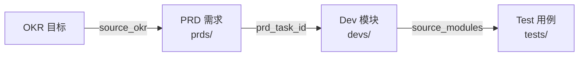

# YiPet 开发模块索引

> **文档职责**：本文档定义**怎么做、为什么这么做、实际做成什么样**（HOW），不含产品目标与测试用例。

> 开发方案文档——描述 HOW（实现方案、架构设计、技术决策），从 PRD 中拆出。
> 完整追溯链：**OKR → PRD → Dev Module → Test**

<a id="sec-1"></a>
## 一、全链路追溯



<a id="sec-2"></a>
## 二、月度分布

| 月份 | PRD 数 | Dev 模块数 | Test 规格数 |
|------|--------|-----------|------------|
| 2026-07 | 7 | [7](../devs/2026-07/) | [7](../tests/2026-07/) |
| 2026-08 | 8 | [8](../devs/2026-08/) | [8](../tests/2026-08/) |
| 2026-09 | 232 | [232](../devs/2026-09/) | [232](../tests/2026-09/) |

<a id="sec-3"></a>
## 三、Dev 文档结构

每个开发方案文件遵循标准结构（参考 [Dev 模板](../模板/00-模板-开发方案.md)）：

```
1. 方案概述 — 架构定位 (Mermaid 双世界图)、职责边界
2. 文件清单 — 标注所属世界 (CS/SW/Popup)
3. 模块设计 — 子模块设计、关键代码
4. 接口与数据契约 — RPC 调用、chrome.storage 结构
5. MV3 特定约束 — SW 生命周期、CSP、存储配额
6. 实施步骤 — 分步实施、验证检查点
7. 边缘场景 — SW 休眠恢复、storage 满、离线
8. 已知缺陷 — 当前实现的真实状态
9. 风险与回滚 — MV3 平台风险
10. 完成定义 — 可验证的完成标准
```

<a id="sec-4"></a>
## 四、文件命名约定

```
devs/{month}/NN-prd-task-{描述}.md    → 开发模块文档
prds/{month}/NN-{type}-{描述}.md      → 来源 PRD
tests/{month}/NN-prd-test-{描述}.md   → 对应测试规格
```

<a id="sec-5"></a>
## 五、Frontmatter 规范

```yaml
doc_type: module
prd_task_id: "YP-{月}-{序号}"
source_prd: "{PRD文件名}"
source_okr: [{OKR ID}]
```

<a id="sec-6"></a>
## 六、追溯规则

| 从 | 到 | 字段 | 说明 |
|----|----|------|------|
| OKR | PRD | `source_okr` | OKR 驱动 PRD |
| PRD | Dev | `prd_task_id` | PRD 拆分为开发模块 |
| Dev | Test | `source_modules` | 开发模块被测试覆盖 |

<a id="sec-7"></a>
## 七、YiPet 特定约束

| 约束 | 影响 | 应对 |
|------|------|------|
| SW 非持久化 | 空闲 30s 休眠，内存状态丢失 | `chrome.storage` 持久化 |
| CSP 限制 | 禁止远程代码、eval | 所有依赖本地打包 |
| 双世界隔离 | CS 无页面 JS，MAIN 无 chrome.* | IPC 消息桥接 |
| Content Script 注入 | ISOLATED world | 不污染页面全局 |
| 构建约束 | 禁用文件名哈希和代码分割 | 固定文件名引用 |