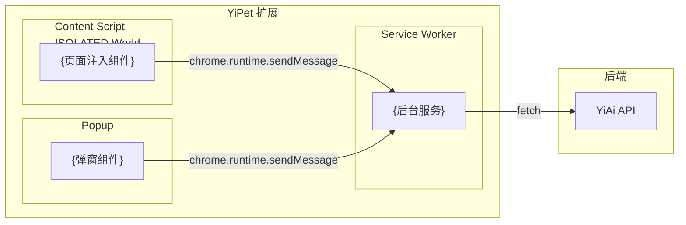
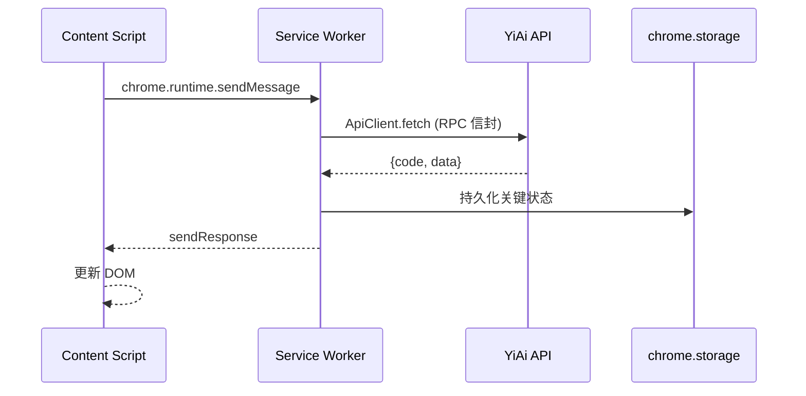

# YP-{{MONTH}}-{{NUMBER}}: {{功能名称}} — {{一句话描述}} — 开发方案

> 来源 PRD：[{{NUMBER}}-{{分类}}-{{描述}}.md](../../prds/{{YEAR}}-{{MONTH}}/{{NUMBER}}-{{分类}}-{{描述}}.md)
> 需求编号：YP-{{MONTH}}-{{NUMBER}} · 优先级：P1 · 人天：0.5d 估算
> 本文档定义 **{{功能名称}}在 Chrome MV3 扩展中的实现方案**。需求见 PRD，验证方式见[测试用例](../../tests/{{YEAR}}-{{MONTH}}/{{NUMBER}}-prd-test-{{描述}}.md)。

---

## 一、方案概述

### 1.1 架构定位

{说明模块在 YiPet 双世界架构中的位置——Content Script / Service Worker / Popup / 公共}



### 1.2 职责边界

| 层/组件 | 文件 | 职责 | 明确不做 |
|---------|------|------|---------|
| {组件1} | `src/{world}/path.ts` | {职责} | {边界} |
| {IPC} | `src/ipc/path.ts` | {消息桥接} | {边界} |

---

## 二、文件清单

| 文件 | 类型 | 职责 |
|------|------|------|
| `src/content/{name}.ts` | 新增 | Content Script 注入逻辑 |
| `src/service/{name}.ts` | 新增/修改 | Service Worker 处理 |
| `src/api/{name}.ts` | 新增 | YiAi API 调用（ApiClient 层） |

---

## 三、模块设计

### 3.1 {子模块名}

{核心设计说明}

```typescript
// 关键接口
interface ExampleMessage {
  type: "EXAMPLE_ACTION";
  payload: { data: string };
}

// IPC 桥接
chrome.runtime.sendMessage({ type: "EXAMPLE_ACTION", payload: { data } });
```

**设计要点**：

| 要点 | 说明 |
|------|------|
| {要点1} | {说明} |

### 3.2 MV3 双世界数据流



---

## 四、接口与数据契约

### 4.1 RPC 调用（通过 ApiClient）

| 模块 | 方法 | 参数 | 返回 | 说明 |
|------|------|------|------|------|
| `services.{domain}.{service}` | `{method}` | `{params}` | `{type}` | {说明} |

### 4.2 chrome.storage 数据结构

```typescript
interface StorageSchema {
  {key}: {type};  // {说明}
}
```

---

## 五、MV3 特定约束

| 约束 | 影响 | 应对 |
|------|------|------|
| Service Worker 生命周期 | 空闲 30s 后休眠，状态丢失 | 关键状态持久化到 `chrome.storage` |
| Content Script 隔离 | ISOLATED world，无法访问页面 JS 变量 | 通过 DOM/PostMessage 桥接 |
| CSP 限制 | 禁止 inline script、eval | 构建时处理，不依赖动态执行 |
| `chrome.storage` 配额 | local 10MB, sync 100KB | 大数据量时使用 IndexedDB |
| MV3 禁止远程代码 | 不可引用 CDN 脚本 | 所有依赖本地打包 |

---

## 六、实施步骤与验证

| 步骤 | 内容 | 涉及文件 | 验证方式 | 人天 |
|------|------|---------|---------|------|
| 1 | {步骤} | {文件} | {验证} | 0.25 |
| 2 | {步骤} | {文件} | {验证} | 0.25 |

**合计：{N.N}d**。

### 验证检查点

| 步骤 | 验证项 | 通过标准 |
|------|--------|---------|
| 1 | {验证项} | {标准} |
| 2 | {验证项} | {标准} |

---

## 七、边缘场景处理

| 场景 | 触发条件 | 处理策略 | 实现位置 |
|------|---------|---------|---------|
| SW 休眠唤醒 | 消息到达时 SW 已休眠 | `chrome.runtime.sendMessage` 自动唤醒 | IPC 层 |
| storage 配额满 | `chrome.storage.local` 满 | LRU 淘汰旧数据 | Store 层 |
| 页面无扩展注入点 | 受保护的浏览器页面 | 静默跳过，不抛错 | Content Script 入口 |
| 离线 | 无网络连接 | 本地缓存兜底 + 离线提示 | ApiClient 层 |

---

## 八、已知缺陷与改进项

> 以下记录**当前实现的真实状态**。

### 缺陷 1（{P0/P1/P2/P3}）：{缺陷标题}

**现象**：{具体表现}

**根因**：{技术根因}

**影响**：{用户/系统影响}

**改进方向**：{建议方案}

---

## 九、风险与回滚

### 风险

| 风险 | 概率 | 影响 | 缓解措施 |
|------|------|------|---------|
| {风险} | 高/中/低 | 高/中/低 | {措施} |

### 回滚

| 场景 | 回滚方式 | 影响范围 |
|------|---------|---------|
| 扩展异常 | 发布修复版本至 Chrome Web Store | 全部用户 |

---

## 十、完成定义（DoD）

- [ ] {N} 个文件按 §2 清单落地，无遗漏、无多余
- [ ] 核心功能行为正确
- [ ] `npm run build` 无错误，产出到 `dist/`
- [ ] `tsc --noEmit` 通过（strict mode）
- [ ] Content Script 与 Service Worker 消息契约一致
- [ ] 单元测试覆盖核心判定逻辑（见测试用例）
- [ ] §8 已知缺陷已登记至缺陷追踪