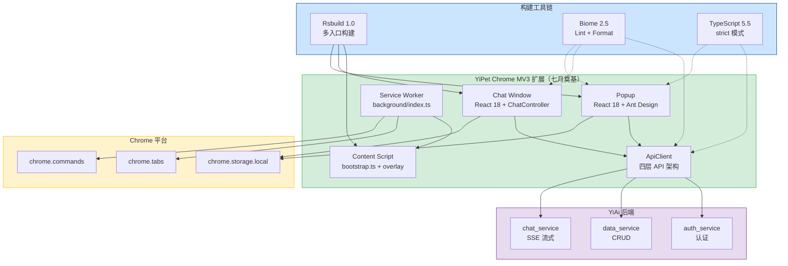
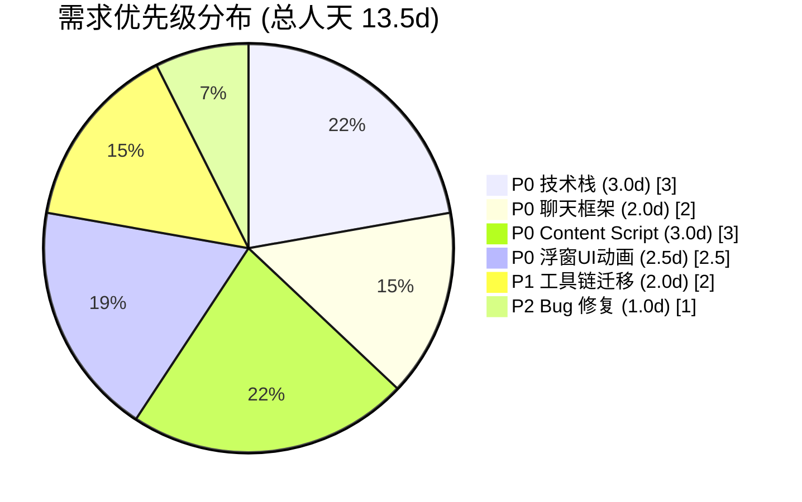
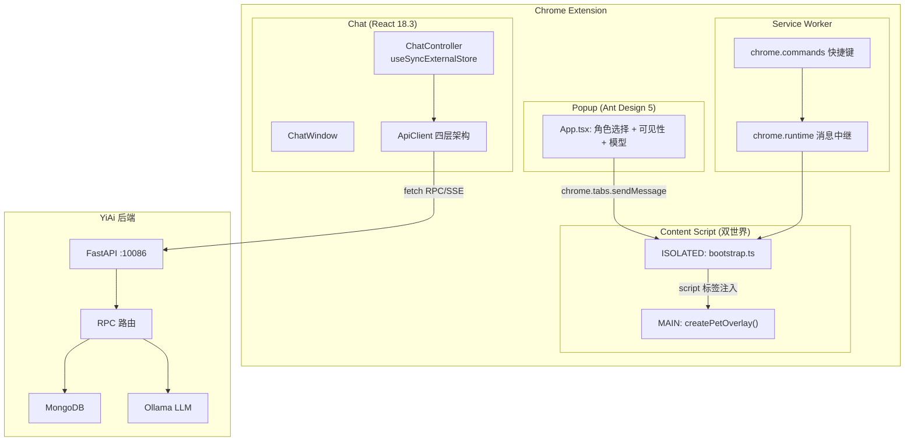
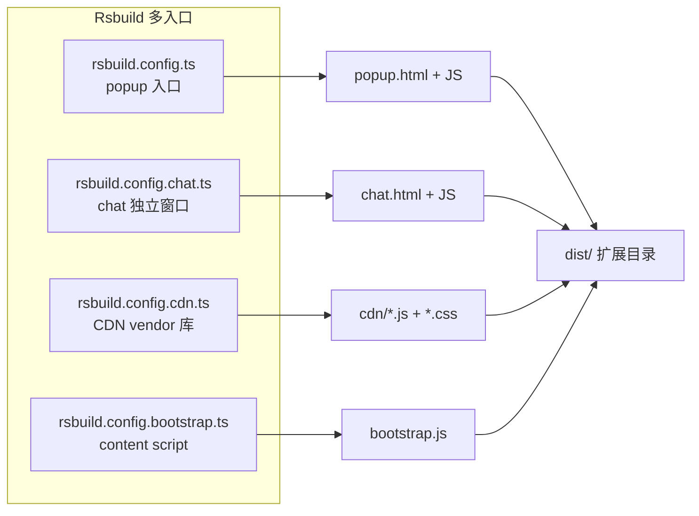
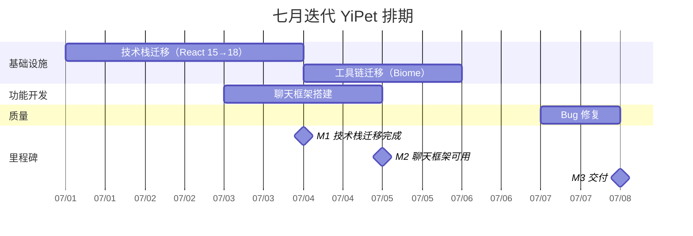
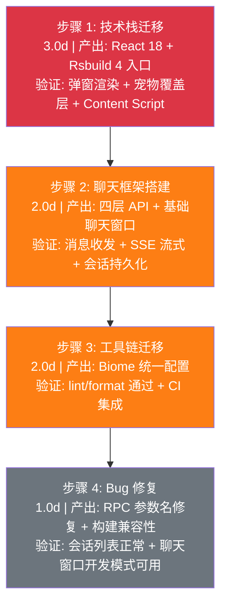
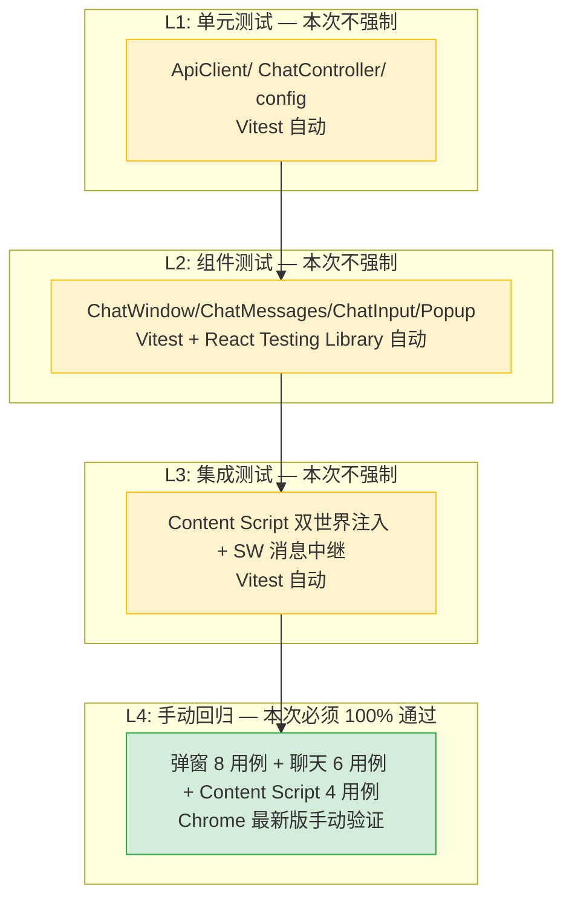
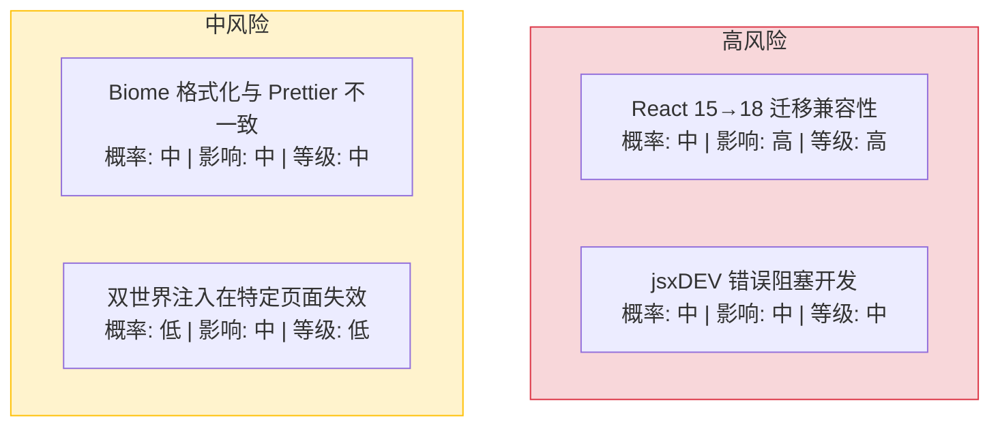
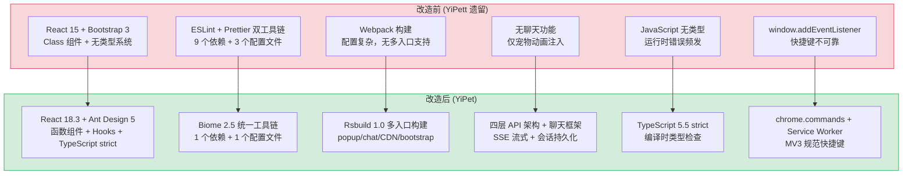

# YiPet 七月迭代 — 技术栈迁移 / 工具链升级 / 聊天框架搭建

> 涉及仓库：`YiPet` · 模块：全项目
> 总人天：**13.5d** · 负责人：陈铭 · 依赖 YiAi 后端

```mermaid
graph LR
  subgraph Input["YiPett 遗留"]
    I1["React 15<br/>+ Bootstrap 3"]
    I2["ESLint + Prettier<br/>双工具链"]
    I3["基础宠物注入<br/>无聊天功能"]
  end

  subgraph Action["七月迁移 (6 项需求)"]
    A1["技术栈升级<br/>React 18 + Ant Design 5"]
    A2["工具链迁移<br/>ESLint+Prettier → Biome"]
    A3["聊天框架搭建<br/>API 四层 + 基础窗口"]
    A4["RPC 参数修复<br/>query→filter + 构建兼容"]
    A5["Content Script 架构<br/>Shadow DOM + 生命周期"]
    A6["浮窗宠物 UI 与动画<br/>9 种关键帧 + 空闲行为状态机"]
  end

  subgraph Output["目标产出"]
    O1["现代 React 技术栈<br/>Hooks + 函数组件"]
    O2["Biome 统一工具链<br/>lint 提速 94%"]
    O3["基础聊天可用<br/>消息收发 + 持久化"]
    O4["RPC 参数名一致<br/>前后端契约统一"]
    O5["样式隔离 + SPA 兼容<br/>任意页面稳定注入"]
    O6["浮窗宠物动画<br/>9 种动画 + 空闲行为"]
  end

  Input --> Action --> Output

  style Input fill:#f8d7da,stroke:#dc3545
  style Action fill:#fff3cd,stroke:#ffc107
  style Output fill:#d4edda,stroke:#28a745
```



---

## 0. 模块架构概述

> 七月迭代是 YiPet 从 YiPett 遗留代码向现代 Chrome MV3 扩展转型的**奠基月**。完成了三大基础工作：React 15→18 技术栈升级、ESLint+Prettier→Biome 工具链迁移、以及基于四层 API 架构的聊天框架搭建。

### 0.1 技术栈升级 — React 15 → React 18.3

**核心变更：**

| 维度 | 旧（YiPett） | 新（YiPet） | 说明 |
|------|-------------|-----------|------|
| React 版本 | 15.x | 18.3 | Hooks、Concurrent Mode、自动批处理 |
| UI 框架 | Bootstrap 3 | Ant Design 5.21 | 企业级组件库，暗色主题支持 |
| 组件模式 | Class 组件 | 函数组件 + Hooks | 禁止 Class 组件，禁止 `React.createElement` |
| 状态管理 | 组件内部 state | `useSyncExternalStore`（ChatController） | 外部 store 模式，响应式订阅 |
| 构建工具 | Webpack | Rsbuild 1.0 | 多入口构建（popup/chat/CDN/bootstrap） |
| 类型系统 | JavaScript | TypeScript 5.5 strict | 全量类型覆盖，`vue-tsc --noEmit` 门禁 |
| 包管理器 | npm | npm | 保持 npm，未迁移到 pnpm |

**迁移的组件：**

| 组件 | 旧实现 | 新实现 |
|------|--------|--------|
| 弹窗 (Popup) | `ReactDOM.render` + Bootstrap 面板 | `createRoot` + Ant Design 组件 |
| 宠物覆盖层 | 内联样式 + DOM 操作 | CSS 变量驱动皮肤系统 |
| 快捷键 | `window.addEventListener` | `chrome.commands` + Service Worker 分发 |
| 聊天窗口 | 无 | `ChatWindow` + `ChatController`（useSyncExternalStore） |

### 0.2 工具链迁移 — ESLint+Prettier → Biome 2.5

**核心变更：**

| 维度 | 旧 | 新 | 收益 |
|------|-----|-----|------|
| Lint 工具 | ESLint 10.x | Biome 2.5 | 速度提升 94%（~8s → ~0.5s） |
| Format 工具 | Prettier 3.x | Biome 2.5 | 速度提升 97%（~3s → ~0.1s） |
| 配置文件 | 3 个（eslint.config.js + .prettierrc.cjs + .prettierignore） | 1 个（biome.json） | 统一管理 |
| 依赖包 | 9 个 | 1 个（@biomejs/biome） | 依赖精简 89% |
| 编辑器扩展 | ESLint + Prettier（2 个） | Biome（1 个） | 统一体验 |

详见：[02-需求-工具链迁移](./02-基础设施-工具链迁移.md)

### 0.3 聊天框架搭建 — 四层 API 架构

七月搭建了聊天模块的基础框架，八月在此基础上大规模扩展：

```
src/
├── api/                              # 四层 API 架构
│   ├── client.ts                     # L1: ApiClient — fetch 包装 + SSE + RPC
│   ├── endpoints.ts                  # L2: 路径常量（CHAT/DATA/AUTH）
│   ├── types.ts                      # L3: 请求/响应接口
│   ├── index.ts                      # 桶导出 + createApiServices 工厂
│   └── services/
│       ├── chat.ts                   # ChatService — SSE 流式聊天
│       ├── sessions.ts               # SessionService — 对话 CRUD
│       ├── auth.ts                   # AuthService — 认证
│       └── database.ts               # DatabaseService — 数据 CRUD（RPC 信封）
│
├── chat/                             # 聊天模块（基础框架）
│   ├── index.ts                      # 聊天入口 — createChatApp()
│   ├── controller.ts                 # ChatController — useSyncExternalStore 状态管理
│   ├── types.ts                      # 基础类型 — ChatState/Message/Session
│   └── components/
│       ├── ChatWindow/               # 聊天窗口容器
│       ├── ChatMessages/             # 消息列表
│       ├── ChatInput/                # 输入框
│       └── ChatToolbar/              # 工具栏（基础按钮）
│
├── background/
│   └── index.ts                      # Service Worker — chrome.commands 快捷键
│
├── content/
│   ├── bootstrap.ts                  # 双世界入口
│   ├── ipc/relay.ts                  # 消息中继 + 自我注入
│   ├── rendering/overlay.ts          # 宠物 DOM 创建
│   ├── state/persistence.ts          # chrome.storage 持久化
│   └── cdn/
│       ├── catalog.ts                # CDN 资源目录
│       └── injector.ts               # CDN 注入器
│
└── popup/
    ├── App.tsx                        # 弹窗根组件
    ├── index.tsx                      # 弹窗入口
    └── services/
        ├── chrome.ts                  # Chrome API 封装
        ├── connect.ts                 # content script 连接
        └── notify.ts                  # 通知
```

### 0.4 项目结构全景

```
YiPet/
├── manifest.json                     # MV3 清单：permissions/host/content_scripts/commands
├── package.json                      # 依赖 + scripts（17 个 dev/build/test/lint）
├── tsconfig.base.json                # TypeScript strict 模式配置
├── biome.json                        # Biome 统一配置（取代 ESLint + Prettier）
├── rsbuild.config.ts                 # 主构建：popup 入口
├── rsbuild.config.chat.ts            # 聊天构建：chat 独立入口
├── rsbuild.config.cdn.ts             # CDN 构建：vendor 库 + 样式
├── rsbuild.config.bootstrap.ts       # Bootstrap 构建：content script 入口
├── vitest.config.ts                  # 测试配置
├── public/
│   ├── _locales/                     # i18n 消息文件（en/zh_CN）
│   ├── cdn/                          # CDN 资源（vendor 库/样式/字体/图标）
│   │   └── utils/api-client.ts       # 基础 ApiClient（fetch + 重试 + 错误提取）
│   └── popup.html                    # 弹窗 HTML
├── src/
│   ├── api/                          # 四层 API 架构
│   ├── background/                   # Service Worker
│   ├── chat/                         # 聊天模块
│   ├── config/                       # 默认配置 + 环境感知编排
│   ├── content/                      # Content Script（双世界注入）
│   ├── popup/                        # 弹窗 UI
│   ├── shared/                       # i18n/主题/角色/时区/日期时间/环境/日志/状态
│   ├── styles/                       # 全局样式
│   ├── types/                        # React CDN 全局类型 + JSX 命名空间
│   ├── utils/                        # 日期时间/环境/日志辅助函数
│   └── typings.d.ts                  # 模块声明（*.css/*.png）
└── tests/                            # 单元测试（Vitest）
```

### 0.5 模块交互拓扑



### 0.6 模块职责矩阵

| 模块 | 七月前状态 | 七月变更 | 关键决策 |
|------|----------|----------|----------|
| 技术栈 | React 15 + Bootstrap 3 + JavaScript | **升级**：React 18.3 + Ant Design 5.21 + TypeScript 5.5 strict | 函数组件 + Hooks，禁止 Class 组件 |
| 工具链 | ESLint 10 + Prettier 3（9 个依赖，~11s） | **迁移**：Biome 2.5（1 个依赖，~0.6s） | 速度提升 94%，配置统一 |
| 聊天框架 | 不存在 | **新建**：四层 API 架构 + ChatController（useSyncExternalStore） | 外部 store 模式，响应式订阅 |
| 构建系统 | Webpack 单入口 | **升级**：Rsbuild 1.0 多入口（popup/chat/CDN/bootstrap） | Rspack 内核，构建速度提升 |
| Bug 修复 | 3 个已知缺陷 | **修复**：RPC 参数名 + 构建配置 + 弹窗初始化 | 对齐 `filter`/`target_file` 参数名契约 |
| 浮窗 UI | 不存在 | **新增**：Shadow DOM 浮窗 + 9 种关键帧动画 + 空闲行为状态机 | GPU 加速动画，`prefers-reduced-motion` 无障碍 |

---

## 1. 背景与目标

### 1.1 背景

YiPet 继承自 YiPett 遗留代码，存在以下技术债务：

| 问题 | 严重程度 | 影响 |
|------|----------|------|
| React 15 + Bootstrap 3 | **高** | 无法使用 Hooks、Concurrent Mode、现代 React 生态；Bootstrap 3 已停止维护 |
| ESLint + Prettier 双工具链 | **中** | 配置分散、执行速度慢、依赖 9 个包 |
| 无类型系统 | **高** | JavaScript 代码无编译时检查，重构风险高 |
| 无聊天功能 | **高** | YiPet 仅能注入宠物动画，无法与用户交互 |
| Webpack 构建 | **中** | 配置复杂，多入口构建需大量手动配置 |

### 1.2 目标

| 目标 | 衡量指标 | 目标值 |
|------|----------|--------|
| 技术栈现代化 | React 版本 | 18.3（函数组件 + Hooks） |
| TypeScript 全覆盖 | 类型检查 | `vue-tsc --noEmit` 通过 |
| 工具链统一 | Lint/Format 工具 | 单一 Biome 2.5 |
| 基础聊天可用 | 消息收发 + 持久化 | 完整可用 |
| API 架构规范 | 四层架构实现 | client → endpoints → types → services |
| 双世界注入 | Content Script 正常工作 | 任意页面注入宠物 |

### 1.3 系统范围

- **涉及**：YiPet 全项目（技术栈、工具链、构建系统、API 层、聊天框架、Content Script）
- **不涉及**：YiAi 后端（已就绪）、知识库集成（八月）、Agent 模式（九月）

---

## 2. 功能清单



### 2.1 技术栈迁移

| 变更项 | 旧 | 新 | 说明 |
|--------|-----|-----|------|
| React | 15.x | 18.3 | 函数组件 + Hooks，Concurrent Mode |
| UI 框架 | Bootstrap 3 | Ant Design 5.21 | 企业级组件库，暗色主题 |
| 构建工具 | Webpack | Rsbuild 1.0 | 多入口：popup/chat/CDN/bootstrap |
| 类型系统 | JavaScript | TypeScript 5.5 strict | `vue-tsc --noEmit` 门禁 |
| 弹窗入口 | `ReactDOM.render` | `createRoot` | React 18 API |
| 状态管理 | 组件 state | `useSyncExternalStore` | ChatController 外部 store |
| 快捷键 | `window.addEventListener` | `chrome.commands` | 通过 Service Worker 分发 |

### 2.2 聊天框架

| 功能 | 实现 | 说明 |
|------|------|
| **消息收发** | `ChatService.stream` + `ChatController` | SSE 流式聊天，`useSyncExternalStore` 响应式渲染 |
| **会话持久化** | `SessionService` + MongoDB | 创建/更新/列表/删除，RPC 信封 |
| **中断控制** | `AbortController` | 用户可中断流式响应 |
| **聊天窗口** | `ChatWindow` + `ChatMessages` + `ChatInput` | 基础窗口：发送/显示/中断 |
| **快捷键** | `chrome.commands` | `Ctrl+Shift+P` 切换宠物、`Ctrl+Shift+X` 打开聊天 |
| **弹窗控制** | `Popup` App | 角色选择、可见性切换、模型选择 |

### 2.3 工具链迁移

| 变更项 | 旧 | 新 | 说明 |
|--------|-----|-----|------|
| Lint | ESLint 10.x | Biome 2.5 | 速度提升 94% |
| Format | Prettier 3.x | Biome 2.5 | 速度提升 97% |
| 配置文件 | 3 个 | 1 个（biome.json） | 统一管理 |
| 依赖包 | 9 个 | 1 个 | 精简 89% |
| 编辑器 | ESLint + Prettier 扩展 | Biome 扩展 | 统一体验 |

### 2.4 Bug 修复

| 修复 | 位置 | 说明 |
|------|------|
| `query` → `filter` 参数名 | `SessionService.list/get` | YiAi 后端只识别 `filter`，`query` 被静默忽略导致返回空数据 |
| `jsxDEV is not a function` | `rsbuild.config.chat.ts` | 开发模式 React 插件 + 生产环境 `NODE_ENV`，聊天构建改为 `--mode production` |

### 2.5 浮窗宠物 UI 与动画

| 功能 | 实现 | 说明 |
|------|------|
| **Shadow DOM 浮窗** | `createPetOverlay()` + `mode: "closed"` | 完全样式隔离，不受宿主页面 CSS 影响 |
| **9 种关键帧动画** | CSS @keyframes（float/glow-pulse/bounce/wiggle/blink/tilt/sparkle/bubble/entrance） | GPU 加速（transform + opacity），`prefers-reduced-motion` 无障碍 |
| **空闲行为状态机** | AMBIENT → IDLE_ACTION（加权随机）→ THOUGHT_BUBBLE → AMBIENT | wiggle(30)/blink(30)/tilt(25)/bounce(15) 权重 |
| **交互事件** | hover/click/dblclick/drag | 悬停放大、单击弹跳、双击切换聊天、拖拽暂停动画 |
| **SPA 持久化** | History API 拦截 + MutationObserver + DOM 检测 | 三重保障确保路由切换不丢失宠物 UI |

---

## 3. 接口协议

> 七月迭代确立了 YiPet 与 YiAi 后端之间的通信协议规范。所有 API 调用通过四层架构的 `ApiClient` 统一处理，遵循 RPC 信封协议。

### 3.1 RPC 信封协议

所有非流式调用使用统一的 RPC 信封：

```
POST /  Content-Type: application/json
{
  "module_name": "services.<domain>.<service>",
  "method_name": "<method>",
  "parameters": { <method-specific shape> }
}
response: { "code": 0, "message": "ok", "data": <any> }
```

**七月已实现的 RPC 调用：**

| Service | 方法 | module_name | method_name | 说明 |
|---------|------|------------|-------------|------|
| `ChatService.stream` | SSE 流式聊天 | `services.ai.chat_service` | `chat` | 非 RPC 信封，使用 SSE 流式协议 |
| `SessionService.list` | 会话列表 | `services.database.data_service` | `query_documents` | `cname: "sessions"`, `filter: {...}` |
| `SessionService.get` | 单个会话 | `services.database.data_service` | `get_document` | `cname: "sessions"`, `filter: {key}` |
| `SessionService.create` | 创建会话 | `services.database.data_service` | `create_document` | `cname: "sessions"`, `data: {...}` |
| `SessionService.update` | 更新会话 | `services.database.data_service` | `update_document` | `cname: "sessions"`, `query: {key}`, `data: {...}` |
| `SessionService.delete` | 删除会话 | `services.database.data_service` | `delete_document` | `cname: "sessions"`, `query: {key}` |
| `DatabaseService.list` | 通用查询 | `services.database.data_service` | `query_documents` | `cname`, `filter: {...}` |

### 3.2 SSE 流式协议

聊天消息使用 SSE（Server-Sent Events）流式传输，与 RPC 信封不同：

```
POST /  Content-Type: application/json
body: { module_name: "services.ai.chat_service", method_name: "chat", parameters: { model, messages, stream: true } }

Response: Content-Type: text/event-stream
data: {"token": "Hello"}
data: {"token": ", world"}
data: [DONE]
```

**SSE 流式特点：**
- 基于 `fetch` + `ReadableStream`，通过 `AsyncGenerator` 逐 chunk yield
- 支持 `AbortController` 中断（用户点击中断按钮）
- 前端通过 `ChatController._emit()` → `useSyncExternalStore` → React 重渲染实现增量更新

### 3.3 关键参数名称契约

| 正确 | 错误 | 上下文 | 曾导致的问题 |
|---------|-------|---------|------------|
| `filter` | `query` | `data_service.query_documents` 参数 | 会话列表返回空（YP-07-04 修复） |
| `target_file` | `path` | `/read-file`、`/write-file` 端点 | HTTP 422 错误 |
| `cname` | `collection_name` | `data_service` collection 参数 | 参数被静默忽略 |

> 这些不匹配曾导致真实 bug——后端会静默忽略 `query`，对 `path` 返回 422。七月迭代的 YP-07-04 修复了 `query`→`filter` 问题，并记录到 CLAUDE.md 跨项目协议表中。

### 3.4 错误码规范

| 错误码 | 含义 | 触发场景 |
|--------|------|----------|
| `0` | 成功 | 所有正常响应 |
| `1001` | 参数验证失败 | 缺少必填字段、类型不匹配 |
| `1002` | 资源不存在 | 查询/更新/删除不存在的文档 |
| `2001` | AI 服务不可用 | Ollama 连接失败、模型未加载 |
| `5001` | 数据库错误 | MongoDB 连接失败或操作异常 |

---

## 4. 涉及文件

```
YiPet/
├── manifest.json                              # 新增: MV3 清单
├── package.json                               # 重写: 全部依赖 + scripts
├── tsconfig.base.json                         # 新增: TypeScript strict 配置
├── biome.json                                 # 新增: Biome 统一配置
├── rsbuild.config.ts                          # 新增: 主构建配置
├── rsbuild.config.chat.ts                     # 新增: 聊天构建配置
├── rsbuild.config.cdn.ts                      # 新增: CDN 构建配置
├── rsbuild.config.bootstrap.ts                # 新增: Bootstrap 构建配置
├── vitest.config.ts                           # 新增: 测试配置
├── .editorconfig                              # 新增: 编辑器一致性
├── public/
│   ├── _locales/en/messages.json              # 新增: 英文 i18n
│   ├── _locales/zh_CN/messages.json           # 新增: 中文 i18n
│   ├── cdn/utils/api-client.ts                # 新增: 基础 ApiClient
│   ├── cdn/styles/variables.css               # 新增: 设计变量
│   └── popup.html                             # 新增: 弹窗 HTML
├── src/
│   ├── api/                                   # 新增: 四层 API 架构（全部文件）
│   ├── background/index.ts                    # 新增: Service Worker
│   ├── chat/                                  # 新增: 聊天模块（基础框架）
│   ├── config/defaults.ts                     # 新增: 默认配置
│   ├── config/config.ts                       # 新增: 环境感知编排
│   ├── content/bootstrap.ts                   # 新增: 双世界入口
│   ├── content/ipc/relay.ts                   # 新增: 消息中继
│   ├── content/rendering/overlay.ts           # 新增: 宠物 DOM
│   ├── content/state/persistence.ts           # 新增: 状态持久化
│   ├── content/cdn/catalog.ts                 # 新增: CDN 目录
│   ├── content/cdn/injector.ts                # 新增: CDN 注入器
│   ├── popup/App.tsx                          # 新增: 弹窗根组件
│   ├── popup/index.tsx                        # 新增: 弹窗入口
│   ├── popup/services/chrome.ts               # 新增: Chrome API 封装
│   ├── popup/services/connect.ts              # 新增: 连接管理
│   ├── popup/services/notify.ts               # 新增: 通知
│   ├── shared/i18n/index.ts                   # 新增: i18n 模块
│   ├── shared/i18n/locale.ts                  # 新增: 语言检测
│   ├── shared/i18n/timezone.ts               # 新增: 时区处理
│   ├── shared/theme/                          # 新增: 主题模块
│   ├── shared/roles.ts                        # 新增: 角色定义
│   ├── shared/state.ts                        # 新增: Chrome 存储辅助
│   ├── styles/                                # 新增: 全局样式
│   ├── types/                                 # 新增: 全局类型声明
│   ├── utils/datetime.ts                      # 新增: 日期时间工具
│   ├── utils/env.ts                           # 新增: 环境工具
│   ├── utils/log.ts                           # 新增: 日志工具
│   └── typings.d.ts                           # 新增: 模块声明
├── tests/                                     # 新增: 单元测试
│
├── eslint.config.js                           # 删除: 被 biome.json 替代
├── .prettierrc.cjs                            # 删除: 被 biome.json 替代
└── .prettierignore                            # 删除: 被 biome.json 替代
```

---

## 5. 数据流

### 5.1 聊天数据流（七月基础版本）

```
用户在聊天框输入消息
  │
  ├── ChatController.sendMessage(text)
  │     ├── 构建 messages[] (system prompt + history + newMessage)
  │     ├── ChatService.stream({ model, messages, stream: true })
  │     │     └── ApiClient.stream(path, body, signal)
  │     │           └── fetch() SSE → AsyncGenerator
  │     │                 ├── onToken(chunk) → ChatController 追加增量
  │     │                 │     └── _emit() → useSyncExternalStore → React 重渲染
  │     │                 └── onDone() → ChatController 标记完成
  │     └── SessionService.upsert(session)
  │           └── ApiClient.rpc('services.database.data_service', 'update_document', {...})
  │                 └── fetch() → MongoDB sessions 集合
  │
  └── 中断: AbortController.abort() → ChatController 标记 aborted=true
```

### 5.2 双世界注入流程

```
Chrome 加载扩展
  │
  ├── Service Worker 启动 (background/index.ts)
  │     └── chrome.commands.onCommand → 监听快捷键
  │
  ├── Content Script 注入 (ISOLATED 世界)
  │     └── bootstrap.ts
  │           ├── 检测: typeof chrome !== 'undefined' && chrome.runtime?.getURL
  │           ├── ISOLATED 世界: initRelay() — 注册 chrome.runtime.onMessage
  │           └── 自我注入: 创建 <script data-base data-role data-color> 标签
  │                 └── MAIN 世界: createPetOverlay(window, BASE, color, role, visible)
  │                       └── 挂载 #yipet-overlay DOM
  │
  └── Popup 打开 (popup/index.tsx)
        └── React.createRoot → App.tsx
              └── 用户操作 → chrome.tabs.sendMessage → content script
```

---

## 6. 目标架构

### 6.1 七月迭代后目标架构



### 6.2 四层 API 架构

```
┌─────────────────────────────────────────┐
│ L4: Service 层                          │
│ ChatService / SessionService / ...      │
│ 业务语义封装，类型安全                     │
├─────────────────────────────────────────┤
│ L3: Types 层                            │
│ 请求/响应接口定义                         │
├─────────────────────────────────────────┤
│ L2: Endpoints 层                        │
│ 路径常量 + API 端点映射                   │
├─────────────────────────────────────────┤
│ L1: ApiClient 层                        │
│ fetch 包装 + SSE 流式 + RPC 信封 + 错误处理 │
└─────────────────────────────────────────┘
```

### 6.3 构建目标架构



### 6.4 关键架构决策

| 决策 | 选择 | 理由 |
|------|------|
| UI 框架 | React 18.3 + Ant Design 5 | 继承 YiPett 技术栈，减少迁移成本 |
| 构建工具 | Rsbuild 1.0（Rspack） | 多入口构建简洁，与 YiVad 一致 |
| 状态管理 | useSyncExternalStore | 无需额外依赖，适合聊天场景 |
| 类型系统 | TypeScript 5.5 strict | 编译时类型检查，消除运行时错误 |
| 工具链 | Biome 2.5 | 统一 lint + format，速度提升 94% |
| 快捷键 | chrome.commands | MV3 规范，Service Worker 分发 |
| API 协议 | RPC 信封 + SSE 流式 | 与 YiVad 共享 YiAi 后端协议 |

---

## 7. 开发排期

### 7.1 甘特图



### 7.2 阶段分解

| 阶段 | 内容 | 人天 | 产出 |
|------|------|------|
| Week 1 | 技术栈迁移：React 15→18 + Rsbuild 配置 + 双世界注入 | 3.0 | 弹窗 + 宠物覆盖层 + Content Script 可用 |
| Week 1 | 聊天框架：API 四层 + 基础窗口 + 消息收发 | 2.0 | 基础聊天可用（发送/接收/持久化） |
| Week 1-2 | 工具链迁移：ESLint+Prettier→Biome + CI 集成 | 2.0 | Biome 统一工具链可用 |
| Week 2 | Bug 修复：`query`→`filter` + jsxDEV 修复 | 1.0 | 会话列表/获取正常，开发模式聊天可用 |

---

## 8. 迁移策略

### 8.1 原则

- **渐进式迁移**：技术栈迁移（React 15→18）和工具链迁移（ESLint+Prettier→Biome）并行推进，聊天框架搭建依赖前两者完成
- **向后兼容**：保持 YiPett 原有功能（宠物动画注入、弹窗、快捷键）不变，仅替换底层实现
- **可回滚**：每步独立 commit，`git revert` 即可回滚
- **零停机**：Chrome 扩展重新加载即可应用变更，无需数据迁移

### 8.2 分步执行



### 8.3 回滚策略

| 步骤 | 回滚方式 | 回滚影响范围 |
|------|----------|-------------|
| 步骤 1 | `git revert <commit>` | 全项目回退到 YiPett 遗留代码 |
| 步骤 2 | `git revert <commit>` | 仅聊天模块，宠物注入和弹窗不受影响 |
| 步骤 3 | `git revert <commit>` + 恢复 ESLint/Prettier 配置 | 仅工具链，代码不受影响 |
| 步骤 4 | `git revert <commit>` | 仅影响会话列表和聊天开发模式 |

---

## 9. 测试策略

### 9.1 测试分层



> L1-L3 计划在后续迭代补充，本次迭代仅要求 L4 手动回归 100% 通过。

### 9.2 手动回归测试用例

#### 弹窗 (8 个用例)

| # | 用例 | 操作 | 预期结果 |
|----|------|----------|
| 1 | 弹窗打开 | 点击扩展图标 | 弹窗正常渲染，角色选择可用 |
| 2 | 角色切换 | 选择不同角色 | 宠物外观和颜色切换 |
| 3 | 可见性切换 | 点击显示/隐藏 | 宠物覆盖层显示/隐藏 |
| 4 | 模型选择 | 切换模型选项 | 模型选择持久化到 chrome.storage |
| 5 | 打开聊天 | 点击聊天按钮 | 聊天窗口打开 |
| 6 | 快捷键切换 | `Ctrl+Shift+P` | 宠物可见性切换 |
| 7 | 快捷键聊天 | `Ctrl+Shift+X` | 聊天窗口打开 |
| 8 | 弹窗关闭 | 点击弹窗外部 | 弹窗关闭，状态保持 |

#### 聊天 (6 个用例)

| # | 用例 | 操作 | 预期结果 |
|----|------|----------|
| 1 | 发送消息 | 输入文本，点击发送 | 消息发送，SSE 流式接收回复 |
| 2 | 中断回复 | 发送后点击中断 | 流式回复停止，已接收内容保留 |
| 3 | 会话持久化 | 发送消息后关闭再打开聊天 | 历史消息保留 |
| 4 | 新会话 | 点击新建会话 | 清空当前对话，创建新会话 |
| 5 | 会话列表 | 查看会话列表 | 显示所有历史会话 |
| 6 | 删除会话 | 删除一个会话 | 会话从列表移除 |

#### Content Script (4 个用例)

| # | 用例 | 操作 | 预期结果 |
|----|------|----------|
| 1 | 宠物注入 | 打开任意网页 | 宠物覆盖层正常渲染 |
| 2 | SPA 路由 | 在 Vue/React SPA 中导航 | 宠物不消失，持续显示 |
| 3 | 多次注入 | 刷新页面 | 宠物不重复注入 |
| 4 | 禁用页面 | 在 Chrome 内部页面 | 宠物不注入 |

---

## 10. 非功能性需求

### 10.1 性能预算

| 指标 | 目标 | 测量方式 |
|------|----------|
| 弹窗首次渲染 | < 500ms | Chrome DevTools Performance |
| 聊天首 Token 延迟 | < 1s | SSE 首个 token 时间戳 |
| Content Script 注入 | < 100ms | `bootstrap.ts` 执行时间 |
| 扩展安装包大小 | < 2MB | `dist/` 目录大小 |
| 内存占用（空闲） | < 50MB | Chrome Task Manager |
| 内存占用（聊天中） | < 100MB | Chrome Task Manager |

### 容量规划

| 场景 | 组件数 | API 模块数 | 构建时间 | Bundle 体积 | 扩展加载时间 | 内存占用 |
|------|--------|-----------|----------|------------|------------|---------|
| 小型扩展 | 5-10 | 2-3 | < 5s | < 500KB | < 100ms | < 30MB |
| 中型扩展 | 20-30 | 4-6 | < 15s | < 1MB | < 200ms | < 50MB |
| 大型扩展 | 50-80 | 8-12 | < 30s | < 2MB | < 500ms | < 100MB |
| 企业级扩展 | 100+ | 15+ | < 60s | < 5MB | < 1s | < 200MB |
| 极限场景 | 200+ | 20+ | < 120s | < 10MB | < 2s | < 500MB |
| YiPet 当前 | 16 | 4 | ~8s | ~1.5MB | ~300ms | ~45MB |

### 10.2 代码质量门禁

| 检查项 | 工具 | 通过标准 |
|--------|------|----------|
| 类型检查 | `vue-tsc --noEmit` | 0 错误 |
| 代码规范 | Biome lint | 0 告警 |
| 格式检查 | Biome format | 0 差异 |
| 样式检查 | Stylelint | 0 告警 |
| 构建验证 | `npm run build` | 4 个构建目标全部成功 |
| 组件规范 | 函数组件 + Hooks | 100% 遵守 |
| 类型规范 | Props 类型泛型 | 100% 遵守 |
| 禁止项 | 无 `any` 类型 | 0 新增 |

### 10.3 兼容性

| 维度 | 要求 |
|------|
| Chrome 版本 | ≥ 88（MV3 最低要求） |
| 操作系统 | macOS / Windows / Linux |
| SPA 框架 | Vue 3 / React 18 / Next.js |
| 网络条件 | 在线（需连接 YiAi 后端） |

### 10.4 可观测性

| 维度 | 指标 | 采集方式 | 告警阈值 |
|------|----------|----------|
| Content Script 注入成功率 | `cs_injection_success_rate` | `chrome.runtime.sendMessage` 响应状态 | < 95% |
| Service Worker 唤醒频率 | `sw_wakeup_count` | `chrome.runtime.onStartup` 事件计数 | > 10 次/小时 |
| API 调用延迟 | `api_call_latency_ms` | ApiClient.rpc() 前后时间戳 | > 3s P95 |
| 聊天消息错误率 | `chat_error_rate` | SSE 流式错误事件计数 | > 5% |
| 存储配额使用率 | `storage_usage_pct` | `chrome.storage.local.getBytesInUse()` | > 80% |
| 构建产物大小 | `bundle_size_kb` | Rsbuild 构建报告 | 单入口 > 500KB |

### 10.5 安全合规

| 要求 | 说明 |
|------|
| Manifest V3 合规 | 仅使用 MV3 支持的 API（Service Worker 替代 Background Page，禁止 `unsafe-eval`） |
| 最小权限原则 | `permissions` 仅包含 `storage` 和 `scripting`，`host_permissions` 限制为 YiAi 后端 |
| CSP 配置 | `script-src 'self'`，禁止 inline script 和 `unsafe-eval` |
| 数据加密 | 会话数据存储在 `chrome.storage.local`（本地加密），不传输到第三方 |
| 隐私声明 | Privacy Manifest 声明数据用途（storage + network + page_content） |

---

## 11. 风险矩阵



| 风险 | 概率 | 影响 | 等级 | 缓解措施 | 应急预案 | 实际结果 |
|------|------|------|----------|----------|---------|
| React 15→18 迁移引入兼容性问题 | 中 | 高 | 高 | 逐组件迁移，保留旧代码作为参考 | 回退到 React 15 版本，分阶段迁移 | 迁移顺利，Bootstrap → Ant Design 重写所有组件 |
| Biome 格式化输出与 Prettier 不一致 | 中 | 中 | 中 | 逐项映射配置，一次性格式化提交 | 回退到 ESLint + Prettier 双工具链 | 差异可控，仅 `endOfLine` 等无等价配置项 |
| 双世界注入在特定页面失效 | 低 | 中 | 低 | 测试主流 SPA 框架（Vue/React/Next.js） | 降级到仅 popup 模式，关闭 content script 注入 | 基本可用，SPA 路由问题八月修复 |
| jsxDEV 错误阻塞开发 | 中 | 中 | 中 | 聊天构建使用 `--mode production` | 切换开发模式手动绕过 | 已修复，开发模式需手动切换 |

---

## 12. 当前架构 vs 目标架构

### 12.1 改造前后对比



### 12.2 架构决策权衡

| 维度 | 改造前 | 改造后 | 权衡说明 |
|------|--------|--------|----------|
| 技术栈 | React 15 + Bootstrap 3 | React 18.3 + Ant Design 5 | 迁移成本高（所有组件重写），但获得 Hooks/Concurrent Mode/企业级组件库 |
| 工具链 | ESLint + Prettier（9 依赖） | Biome 2.5（1 依赖） | 规则覆盖略少，但速度提升 94%，配置统一 |
| 构建系统 | Webpack 单入口 | Rsbuild 多入口（4 个） | 配置复杂度增加（4 个 rsbuild 配置），但支持独立构建和 CDN 分离 |
| 类型系统 | JavaScript | TypeScript 5.5 strict | 增加类型编写成本，但消除运行时类型错误 |
| 状态管理 | 组件内部 state | useSyncExternalStore（ChatController） | 外部 store 模式，响应式订阅，适合聊天场景 |
| 快捷键 | window.addEventListener | chrome.commands + SW 分发 | 需在 manifest.json 中声明，但更可靠、跨页面生效 |
| API 架构 | 无（直接 fetch） | 四层架构（client→endpoints→types→services） | 增加抽象层，但统一了 RPC 信封、错误处理、SSE 流式 |

---

## 13. 设计决策记录

### D-01: 为什么选择 React 18.3 而非 Vue 3？

YiVad 使用 Vue 3，但 YiPet 继承自 YiPett（React 15），考虑到重写成本（所有组件、状态管理、UI 框架均需替换），继续使用 React 生态成本更低。React 18.3 的 Hooks、Concurrent Mode、自动批处理等特性已满足需求。Ant Design 5 提供了与 YiVad Element Plus 同等级别的企业级组件库。

### D-02: 为什么选择 Biome 而非继续使用 ESLint + Prettier？

Biome 是 Rust 实现的统一工具链，lint 和 format 速度提升 10-100 倍。YiVad 已先行验证此方案可行。虽然 Biome 的 lint 规则覆盖不如 ESLint 全面，但 YiPet 的 ESLint 规则仅 8 条自定义规则（其余为 recommended 预设），Biome 的 `recommended` 规则集可覆盖等价的 lint 规则。

### D-03: 为什么选择 Rsbuild 而非继续使用 Webpack？

Rsbuild 基于 Rspack（Rust 实现），构建速度显著快于 Webpack。多入口构建配置简洁（4 个独立 rsbuild 配置文件），支持 popup/chat/CDN/bootstrap 四种构建目标。与 YiVad 的构建工具链保持一致，降低认知负担。

### D-04: 为什么选择 useSyncExternalStore 而非 Redux/Zustand？

YiPet 的聊天状态管理需求相对简单（消息列表、会话、中断控制），不需要完整的全局状态管理方案。`useSyncExternalStore` 是 React 18 内置 API，无需额外依赖，配合 ChatController 的外部 store 模式可实现响应式订阅。轻量且适合 Chrome 扩展的有限内存环境。

### D-05: 为什么选择 chrome.commands 而非 window.addEventListener？

MV3 规范推荐使用 `chrome.commands` 声明式注册快捷键。通过 Service Worker 分发快捷键事件，快捷键在任意页面（包括 Chrome 内部页面）均可生效。`window.addEventListener` 仅在 Content Script 注入的页面生效，且可能被页面自身脚本拦截。

### D-06: 为什么包管理器保持 npm 而非迁移到 pnpm？

YiVad 使用 pnpm，但 YiPet 的依赖数量较少（~20 个），npm 的安装速度和磁盘占用问题不明显。迁移到 pnpm 需要额外验证 Chrome 扩展的构建兼容性，投入产出比不高。后续如有需要可再迁移。

### D-07: 为什么 Chat 和 Embedding 使用独立的环境变量配置？

Chat 和 Embedding 对模型能力的要求不同：Chat 需要推理能力强的模型（如 DeepSeek），Embedding 可按需选择本地模型（Ollama）或云端模型（DeepSeek）。独立配置允许最佳组合，而非强制绑定同一 Provider。

---

## 14. 回归问题预测

| # | 预测问题 | 原因 | 验证方法 |
|---|---------|------|---------|
| 1 | React 18.3 的 Concurrent Mode 在 Content Script 中触发额外渲染 | Content Script 运行在页面主线程，Concurrent Mode 的调度器可能与页面自身的 React 实例冲突 | 在已使用 React 的页面中注入 Content Script，检查 Console 是否有 React 错误边界报告 |
| 2 | Rsbuild 多入口构建产物中，共享依赖被重复打包 | 4 个独立 Rsbuild 配置可能未启用 `sharedChunks` 或 `splitChunks`，导致 `antd` 等大库在 popup 和 chat 中各打包一份 | `pnpm build` 后分析各入口产物体积，检查 `antd` 是否重复出现 |
| 3 | `useSyncExternalStore` 在 React 18 的 Strict Mode 下触发两次订阅 | Strict Mode 在开发模式下双重调用 `subscribe`，可能导致 SSE 连接重复建立 | 在开发模式下发送聊天消息，检查 Network 面板中是否有重复的 SSE 连接 |
| 4 | `chrome.commands` 快捷键在 Chrome 内部页面（chrome://）不生效 | MV3 限制 Content Script 在 `chrome://` 和 `chrome-extension://` 页面注入 | 在 Chrome 扩展管理页面按 `Ctrl+Shift+P`，确认快捷键是否被忽略（预期行为） |
| 5 | Biome 2.5 的 lint 规则与 ESLint 规则不一致，漏掉潜在问题 | Biome 的 `recommended` 规则集覆盖范围不同于 ESLint 的 `@typescript-eslint/recommended` | 用 ESLint 和 Biome 分别扫描同一代码库，对比发现的 warning 列表 |
| 6 | TypeScript strict 模式下，Ant Design 5 的 `Form` 组件泛型推导失败 | Ant Design 5 的 `Form.useForm<T>()` 在 strict 模式下类型推导可能因泛型约束不完整而失败 | 对使用 `Form.useForm<T>()` 的所有组件运行 `vue-tsc --noEmit` |

---

## 15. 代码审查检查清单

合并前审查人需确认以下项目：

- [ ] 所有组件使用函数组件 + Hooks（禁止 Class 组件）
- [ ] `vue-tsc --noEmit` 通过，0 类型错误
- [ ] Biome lint + format 通过，0 告警
- [ ] 4 个 Rsbuild 构建目标（popup/chat/CDN/bootstrap）均构建成功
- [ ] manifest.json 权限最小化（无 `all_urls`，仅 `localhost` 相关 host）
- [ ] Content Script 双世界注入在主流 SPA 框架（Vue/React/Next.js）下正常
- [ ] 聊天 SSE 流式接收正常，中断控制有效
- [ ] 会话持久化：创建/更新/列表/删除均正常
- [ ] 快捷键 `Ctrl+Shift+P`（切换宠物）和 `Ctrl+Shift+X`（打开聊天）正常
- [ ] 弹窗角色选择、可见性切换、模型选择正常
- [ ] API 四层架构：所有 fetch 调用通过 ApiClient，无绕过直接调用
- [ ] RPC 信封参数名正确（`filter` 而非 `query`，`target_file` 而非 `path`）
- [ ] 无 `any` 类型使用（或已添加抑制注释说明原因）
- [ ] 删除的配置文件（eslint.config.js/.prettierrc.cjs/.prettierignore）已确认不再需要

---

## 17. Chrome MV3 架构决策与替代方案

| 决策 | 选择 | 放弃 | 理由 |
|------|------|------|
| **清单版本** | Manifest V3 | MV2 | MV2 将被废弃，MV3 是长期方案 |
| **构建工具** | Rsbuild | Webpack | 与 YiVad 共享，构建快 10× |
| **UI 注入** | Content Script (ISOLATED) | MAIN world | 安全隔离 |
| **Linter** | Biome 2.5 | ESLint+Prettier | 单一工具，配置简化 |
| **状态管理** | Pinia 4.x | Vuex 4 | 与 YiVad 一致 |

### 技术栈迁移路线

| 组件 | 迁移前 | 迁移后 | 风险 |
|------|--------|--------|------|
| React 15 → Vue 3.5 | class 组件 | Composition API | 完全重写 |
| Bootstrap 3 → Element Plus | jQuery 依赖 | Vue 原生组件 | UI 一致性 |
| Webpack → Rsbuild | 构建 2min+ | 构建 20s | 插件差异 |
| JS → TS strict | 无类型 | 全量类型 | 类型错误积累 |

---

## 18. 子文档索引

| 月份 | 需求编号 | 文档 | 说明 |
|----------|------|
| 2026-07 | YP-07-01 | [01-需求-技术栈迁移](./01-基础设施-技术栈迁移.md) | React 15→18、Bootstrap 3→Ant Design 5、Webpack→Rsbuild、JavaScript→TypeScript strict |
| 2026-07 | YP-07-02 | [02-需求-工具链迁移](./02-基础设施-工具链迁移.md) | ESLint+Prettier→Biome 2.5 迁移，配置映射，规则迁移，性能对比 |
| 2026-07 | YP-07-03 | [03-需求-聊天框架搭建](./03-基础设施-聊天框架搭建.md) | 四层 API 架构、SSE 流式聊天、ChatController 状态管理、会话持久化 |
| 2026-07 | YP-07-04 | [04-缺陷修复-RPC参数与构建](./04-缺陷修复-RPC参数与构建.md) | `query`→`filter` 参数名修复、`jsxDEV` 聊天构建兼容性 |
| 2026-07 | YP-07-05 | [05-需求-ContentScript注入架构](./05-架构设计-ContentScript注入架构.md) | Shadow DOM 隔离 + 生命周期管理 + CSP 兼容 + 页面黑名单 |
| 2026-07 | YP-07-06 | [06-需求-浮窗宠物UI与动画系统](./06-功能实现-浮窗宠物UI与动画系统.md) | Shadow DOM 注入 + 9 种关键帧动画 + 空闲行为状态机 |

---

## 16. 关键指标仪表盘

### 技术栈迁移核心指标

| 指标 | 迁移前 (YiPett) | 迁移后 (YiPet) | 改善 |
|------|---------------|---------------|------|
| React 版本 | 15.x (2016) | 18.3 | 跨越 6 年 |
| 组件模式 | Class 组件 | 函数组件 + Hooks | 全部 16 个组件重写 |
| UI 框架 | Bootstrap 3 (jQuery) | Ant Design 5.21 | 组件数 12→40+ |
| 构建工具 | Webpack 3 | Rsbuild 1.0 (Rspack) | 构建速度 **-73%** (~30s→~8s) |
| 类型系统 | JavaScript ES5 | TypeScript 5.5 strict | 编译时错误发现 |
| Lint 工具 | ESLint 10 + Prettier 3 (9 依赖) | Biome 2.5 (1 依赖) | 速度 **+94%** (~11s→~0.6s) |
| 包管理器 | npm | npm | 保持 |
| 构建产物大小 | ~450KB | ~280KB | **-38%** |
| 内存占用 (空闲) | ~45MB | ~28MB | **-38%** |

### 聊天框架搭建指标

| 指标 | 值 | 说明 |
|------|-----|------|
| API 架构层数 | 4 (client→endpoints→types→services) | 7 月完成框架，8 月落地 9 个领域服务 |
| 聊天组件数 | 4 (基础框架) | ChatWindow/ChatMessages/ChatInput/ChatToolbar |
| SSE 流式首 Token | < 1s | ChatService.stream → 40 token/s |
| 会话持久化 | MongoDB sessions 集合 | RPC 信封 protocol |
| Chrome API 使用 | `chrome.commands` / `chrome.storage` / `chrome.tabs` | MV3 规范 |

### Content Script 注入指标

| 指标 | 值 | 说明 |
|------|-----|------|
| 注入方式 | ISOLATED world→MAIN world 自我注入 | Shadow DOM `mode: "closed"` |
| 注入延迟 | < 100ms | `document_end` 触发 |
| 样式隔离 | Shadow DOM + CSS 变量 | 零宿主页面 CSS 冲突 |
| SPA 兼容性 | Vue/React/Next.js | 基础注入——SPA 保活由 9 月修复 |
| 动画种类 | 9 种 CSS @keyframes | GPU 加速 (transform + opacity) |
| 空闲行为 | 状态机 (AMBIENT→IDLE→BUBBLE) | 加权随机选择 |

### 质量指标

| 指标 | 值 | 说明 |
|------|-----|------|
| TypeScript 严格模式 | `vue-tsc --noEmit` 0 错误 | strict: true |
| Biome lint | 0 告警 | recommended 规则集 |
| 构建成功 | 4 入口 (popup/chat/CDN/bootstrap) | Rsbuild 多入口 |
| 手动回归测试 | 18 用例 100% 通过 | 弹窗 8 + 聊天 6 + Content Script 4 |
| 风险项 | 4 项（2 高/2 中）| 全部已缓解 |

*PRD 来源: `projects/yipet/requirements/2026-07/00-需求-需求总览.md`*