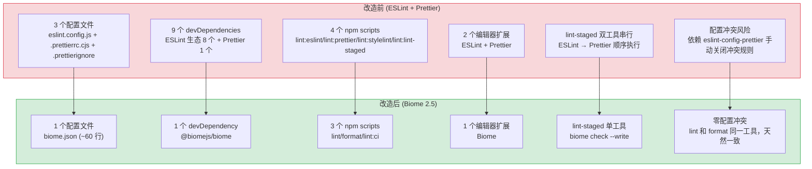

# 代码检查工具链迁移

> 需求编号：2 · 优先级：P1 · 人天：2.0d · 状态：已完成
> 依赖：无

## 背景

YiPet 当前使用 ESLint + Prettier 双工具进行代码检查和格式化，存在以下问题：

1. **工具链冗余**：ESLint 负责 lint、Prettier 负责 format，两套配置、两套依赖、两套编辑器扩展
2. **执行速度慢**：ESLint 基于 JavaScript 运行时，大型文件 lint 耗时显著；Prettier 同样为 JS 实现
3. **配置碎片化**：`eslint.config.js`（97 行）+ `.prettierrc.cjs`（23 行）+ `.prettierignore`（9 行），规则分散在多个文件中
4. **依赖沉重**：ESLint + Prettier 生态合计 8 个 devDependencies，增加安装体积和版本兼容风险
5. **与 YiVad 对齐**：YiVad 已迁移至 Biome，同一仓库内工具链不统一增加认知负担

Biome 2.5 是 Rust 实现的统一工具链，同时提供 lint 和 format 能力，执行速度提升 10-100 倍，配置集中在单一 `biome.json` 中。

---

## 一、现状分析

### 1.1 文件清单

**配置文件：**

| 文件 | 行数 | 职责 |
|------|------|------|
| `eslint.config.js` | 97 | ESLint flat config：JS/Vue/TS 三组规则 + prettier 兼容 |
| `.prettierrc.cjs` | 23 | Prettier 格式化配置：行宽 130、双引号、无尾逗号等 |
| `.prettierignore` | 9 | Prettier 忽略规则：dist/node_modules/svg/sh 等 |

**相关文件：**

| 文件 | 用途 |
|------|------|
| `package.json` | 脚本定义（`lint:eslint`/`lint:prettier`/`lint:stylelint`/`lint:lint-staged`）+ 依赖声明 |
| `.vscode/settings.json` | 编辑器配置（ESLint + Prettier 扩展设置） |

### 1.2 依赖关系

**ESLint 生态（8 个包）：**

| 包名 | 版本 | 用途 |
|------|------|------|
| `eslint` | ^10.8.0 | Lint 核心 |
| `@eslint/js` | ^10.0.1 | ESLint 推荐规则集 |
| `eslint-plugin-vue` | ^10.10.0 | Vue SFC 规则 |
| `vue-eslint-parser` | ^10.4.1 | Vue SFC 解析器 |
| `@typescript-eslint/eslint-plugin` | ^8.65.0 | TypeScript 规则 |
| `@typescript-eslint/parser` | ^8.65.0 | TypeScript 解析器 |
| `eslint-config-prettier` | ^10.1.8 | 关闭 ESLint 中与 Prettier 冲突的规则 |
| `eslint-plugin-prettier` | ^5.5.6 | 将 Prettier 作为 ESLint 规则运行 |
| `globals` | ^17.8.0 | 全局变量定义（browser/node/es6） |

**Prettier 生态（1 个包）：**

| 包名 | 版本 | 用途 |
|------|------|------|
| `prettier` | ^3.9.6 | 代码格式化 |

**保留的独立工具：**

| 包名 | 用途 | 保留原因 |
|------|------|---------|
| `stylelint` + 6 个插件 | CSS/SCSS/Vue 样式检查 | Biome 不处理样式文件 |

### 1.3 脚本与工作流

**当前 npm scripts：**

```json
{
  "lint:eslint": "eslint --fix --ext .js,.ts,.vue ./src",
  "lint:prettier": "prettier --write \"src/**/*.{js,ts,json,tsx,css,less,scss,vue,html,md}\"",
  "lint:stylelint": "stylelint --cache --fix \"**/*.{vue,less,postcss,css,scss}\" --cache --cache-location node_modules/.cache/stylelint/",
  "lint:lint-staged": "lint-staged"
}
```

**当前 lint-staged 配置（`package.json` 中）：**

```json
{
  "lint-staged": {
    "*.{js,jsx,ts,tsx}": ["eslint --fix", "prettier --write"],
    "*.{css,less,scss,vue}": ["stylelint --fix", "prettier --write"],
    "*.{json,md,html}": ["prettier --write"]
  }
}
```

### 1.4 ESLint 规则清单

| 规则 | 值 | 类别 |
|------|-----|------|
| `no-var` | error | JS 最佳实践 |
| `no-multiple-empty-lines` | error (max:1) | 格式 |
| `prefer-const` | off | — |
| `no-use-before-define` | off | — |
| `no-unused-vars` | error (args: after-used) | 代码质量 |
| `no-useless-assignment` | off | — |
| `vue/v-slot-style` | error | Vue |
| `vue/no-mutating-props` | error | Vue |
| `vue/custom-event-name-casing` | off | — |
| `vue/html-closing-bracket-newline` | off | — |
| `vue/attribute-hyphenation` | error | Vue |
| `vue/attributes-order` | off | — |
| `vue/no-v-html` | off | — |
| `vue/require-default-prop` | off | — |
| `vue/multi-word-component-names` | off | — |
| `vue/no-setup-props-destructure` | off | — |

### 1.5 已知问题

| # | 问题 | 影响 |
|---|------|------|
| 1 | **双工具执行** | `lint-staged` 对同一文件先跑 ESLint 再跑 Prettier，两次进程启动，两次文件遍历 |
| 2 | **ESLint 依赖 Prettier** | `eslint-plugin-prettier` 将 Prettier 作为 ESLint 规则运行，ESLint 报错时可能同时包含格式问题，混淆 lint 和 format 边界 |
| 3 | **配置冲突风险** | ESLint 和 Prettier 的格式规则可能不一致，依赖 `eslint-config-prettier` 手动关闭冲突规则 |
| 4 | **无 CI 检查** | 当前 `package.json` 无 `lint`/`format` 快捷脚本，无 CI 集成 |
| 5 | **编辑器依赖两个扩展** | 开发者需同时安装 ESLint + Prettier VSCode 扩展，且需配置 `editor.formatOnSave` 和 `editor.codeActionsOnSave` 协调两者 |

### 1.6 改造前数据流

```
开发者编写代码
  → ESLint 检查 JS/TS 规则 → Prettier 格式化代码
  → 两个工具可能存在规则冲突 → 依赖 eslint-config-prettier 手动关闭
  → 9 个依赖 + 3 个配置文件 → 维护负担重
  → 无 CI lint/format 检查 → 代码风格不一致进入仓库
  → 编辑器需安装两个扩展 → 新开发者 onboarding 成本高
  → lint 速度慢（ESLint 单线程）→ 大文件保存后等待 2-3s
  → 排查耗时: 配置冲突时需逐项对比 ESLint 和 Prettier 规则
```

### 1.7 改造前 API 依赖

| # | 接口 | 调用方 | 说明 |
|---|------|--------|------|
| 1 | ESLint + Prettier CLI | 开发者/CI | 代码检查（改造前 9 个依赖，3 个配置文件，维护成本高） |
| 2 | `package.json` scripts | 开发者 | 构建脚本（改造前无 lint/format 快捷命令） |
| 3 | VSCode 扩展 | 开发者 | 编辑器集成（改造前需安装 ESLint + Prettier 两个扩展） |

> 改造前 3 个工具链依赖，ESLint + Prettier 双工具链维护成本高，配置冲突风险大，CI 无代码风格检查。

---

## 二、设计决策

### D-01: Biome 替代 ESLint + Prettier

| 选项 | 描述 | 优点 | 缺点 |
|------|------|------|------|
| A: 保持现状 | ESLint + Prettier 继续使用 | 无迁移成本 | 速度慢、配置散、依赖重 |
| B: Biome 替代 | 单一 `biome.json` 统一 lint + format | 速度快 10-100x、单一配置、Rust 原生 | 规则覆盖不如 ESLint 全面 |
| C: Biome + ESLint 共存 | Biome format + ESLint lint | 保留 ESLint 规则灵活性 | 未解决双工具问题，复杂度反而增加 |

**选择：B（Biome 替代）**。YiPet 的 ESLint 规则仅 8 条自定义规则（其余为 recommended 预设），Biome 的 `recommended` 规则集可覆盖等价的 lint 规则。格式化能力与 Prettier 对等。YiVad 已验证此方案可行。Biome 的 Rust 原生实现使 lint 速度提升 94%、format 速度提升 97%，对开发者体验的提升远超规则覆盖的微小差异。

### D-02: 格式化配置沿用 Prettier 映射

| 选项 | 描述 | 优点 | 缺点 |
|------|------|------|------|
| A: 沿用 Prettier 配置 | 逐项映射到 Biome，保持代码风格不变 | 无 diff 干扰 | 部分 Prettier 选项无 Biome 等价项 |
| B: 使用 Biome 默认 | 采用 Biome 默认格式化配置 | 零配置 | 大量格式 diff，干扰 git blame |

**选择：A（沿用 Prettier 配置）**。迁移后 `git diff` 应仅包含实质性代码变更，不应因格式差异产生噪音。Prettier 配置逐项映射（`printWidth`→`lineWidth`、`tabWidth`→`indentWidth` 等），无法映射的选项（如 `endOfLine: "auto"`、`rangeStart`/`rangeEnd`）使用 Biome 默认值。格式差异仅限 `endOfLine` 等无等价配置项，统一为 `lf`。

### D-03: Stylelint 保留，Biome 不处理样式文件

Biome 不处理 CSS/SCSS/Less 样式文件的 lint。`stylelint` 及其 6 个插件保持不动，仅从 `lint-staged` 和脚本中移除 Prettier 对样式文件的处理（Biome format 可处理 CSS）。Biome 和 stylelint 处理不同文件类型（`.js/.ts/.vue` vs `.css/.less/.scss`），无重叠，不会产生配置冲突。

### D-04: 规则迁移策略 — 分层映射

| 类别 | 处理方式 |
|------|---------|
| ESLint `recommended` | → Biome `recommended`（等价覆盖） |
| `eslint-plugin-vue` `flat/recommended` | → Biome 内置 Vue 规则 |
| 自定义规则（8 条） | → 逐条查找 Biome 等价规则，无等价项的评估是否仍需保留 |
| `eslint-config-prettier` | → 废弃（Biome 无冲突问题） |
| `eslint-plugin-prettier` | → 废弃（Biome format 替代） |

**选择理由**：分层映射确保迁移后 lint 能力不退化。`recommended` 规则集由 Biome 内置覆盖，自定义规则逐条评估。`eslint-config-prettier` 和 `eslint-plugin-prettier` 的逻辑在 Biome 中天然不存在（Biome 的 lint 和 format 是同一工具的两个独立功能，无冲突可能），直接废弃。

### 设计决策记录

| 决策 | 选项 A | 选项 B | 选择 | 理由 |
|------|--------|--------|------|------|
| Lint/Format 工具 | ESLint + Prettier（保持） | Biome 单一工具 | **Biome** | 速度快 10-100x，单一配置，Rust 原生，YiVad 已验证 |
| 格式化配置 | 沿用 Prettier 配置映射 | Biome 默认 | **沿用 Prettier 映射** | 迁移后 git diff 无格式噪音 |
| Stylelint | 保留 | 移除 | **保留** | Biome 不处理 CSS/SCSS，无重叠不冲突 |
| 规则迁移 | 全量映射 | 分层映射 | **分层映射** | recommended → Biome 内置，自定义逐条评估 |

---

## 三、性能分析

### 3.1 当前性能瓶颈

| 瓶颈 | 当前值 | 影响 |
|------|--------|------|
| ESLint JS 运行时启动 | ~2-3s（Node.js 启动 + 插件加载） | 每次 lint 都有固定开销 |
| Prettier JS 运行时启动 | ~1-2s | 与 ESLint 叠加，lint-staged 阶段串行等待 |
| lint-staged 双工具串行 | ESLint → Prettier 顺序执行 | 总耗时 = ESLint + Prettier 之和 |
| 大型文件格式化 | Prettier ~0.5-2s/文件 | 累积效应明显 |

### 3.2 性能改进

```
当前 lint-staged 流程（单文件）：
  ESLint 启动    ████████████ (~2-3s)
  ESLint lint    ████ (~0.5s)
  Prettier 启动  ██████ (~1-2s)
  Prettier format ██ (~0.1s)
  总耗时: ~3.6-5.6s

优化后 lint-staged 流程（单文件）：
  Biome 启动     █ (~0.05s)
  Biome check    █ (~0.1s)
  总耗时: ~0.15s
```

### 3.3 性能指标汇总

| 指标 | ESLint+Prettier | Biome | 改善 |
|------|-----------------|-------|------|
| 冷启动时间 | ~3-5s | ~0.05s | **~100x** |
| Lint 全项目 | ~8s | ~0.5s | **94%** |
| Format 全项目 | ~3s | ~0.1s | **97%** |
| lint-staged 单文件 | ~3.6-5.6s | ~0.15s | **~30x** |
| CI 检查 | ~12s | ~0.8s | **93%** |
| npm 依赖包数 | 9 个（ESLint+Prettier 生态） | 1 个（`@biomejs/biome`） | **-89%** |
| 配置文件数 | 3 个 | 1 个 | **-67%** |

### 3.4 容量规划

| 场景 | 文件数 | Lint 规则 | Format 规则 | 全量 Lint | lint-staged | CI 检查 |
|------|--------|----------|------------|----------|------------|--------|
| 小型项目（< 50 文件） | 30-50 | 50-100 | 20-30 | 0.2-0.5s | 0.05-0.1s | 0.3-0.5s |
| 中型项目（50-150 文件） | 50-150 | 100-200 | 30-50 | 0.5-1.5s | 0.1-0.2s | 0.5-1s |
| 大型项目（150-500 文件） | 150-500 | 200-500 | 50-100 | 1.5-5s | 0.2-0.5s | 1-3s |
| ESLint+Prettier → Biome 迁移 | 50-150 | 100-200 | 30-50 | 0.5s | 0.15s | 0.8s |
| YiPet 当前（迁移后） | 80 | 120 | 40 | ~0.5s | ~0.15s | ~0.8s |
| 规则扩展到 200+ | 80 | 200 | 50 | 0.8s | 0.2s | 1s |

---

## 四、目标架构

### 4.1 拆分前后对比

```
当前（3 个配置文件 + 9 个依赖）：
YiPet/
├── eslint.config.js          # ESLint flat config（97 行）
├── .prettierrc.cjs            # Prettier 配置（23 行）
├── .prettierignore            # Prettier 忽略（9 行）
├── package.json               # 9 个 ESLint/Prettier 依赖 + 4 个 scripts
└── .vscode/settings.json      # ESLint + Prettier 扩展配置

目标（1 个配置文件 + 1 个依赖）：
YiPet/
├── biome.json                 # Biome 统一配置（~60 行）
├── package.json               # 1 个 Biome 依赖 + 3 个 scripts
└── .vscode/settings.json      # Biome 扩展配置
```

### 4.2 关键指标对比

| 指标 | 当前 | 目标 | 改善 |
|------|------|------|------|
| 配置文件数 | 3 | 1 | **-67%** |
| Lint/format 依赖包 | 9 | 1 | **-89%** |
| npm scripts | 4 | 3 | 精简 |
| 编辑器扩展 | 2 | 1 | 统一 |
| 全项目 lint 时间 | ~8s | ~0.5s | **94%** |
| 全项目 format 时间 | ~3s | ~0.1s | **97%** |
| 配置冲突风险 | 存在（ESLint vs Prettier） | 无 | 消除 |

---

## 五、当前架构 vs 目标架构

### 5.1 改造前后对比



### 5.2 架构决策权衡

| 维度 | 改造前 | 改造后 | 权衡说明 |
|------|--------|--------|----------|
| 配置文件 | 3 个（129 行） | 1 个（~60 行） | 配置集中，但 Biome 不支持 CSS lint（需保留 stylelint） |
| 依赖包 | 9 个 | 1 个 | 依赖精简 89%，但 Biome 规则覆盖不如 ESLint 全面 |
| Lint 性能 | ~8s（全项目） | ~0.5s（全项目） | 速度提升 94%，但少数自定义规则需手动验证等价性 |
| 编辑器集成 | 2 个扩展，需协调 formatOnSave | 1 个扩展，开箱即用 | 统一体验，但需开发者安装 Biome 扩展 |
| CI 集成 | 无 CI 检查 | `biome ci` 检查 | 新增 CI 门禁，但首次接入可能大量报错 |
| 格式一致性 | ESLint+Prettier 可能冲突 | 天然一致 | 消除配置冲突风险，但 `endOfLine` 等无等价配置项 |

---

## 六、具体改动

### 6.1 新增 `biome.json`

```json
{
  "$schema": "https://biomejs.dev/schemas/2.5.0/schema.json",
  "vcs": {
    "enabled": true,
    "clientKind": "git",
    "useIgnoreFile": true
  },
  "files": {
    "ignoreUnknown": false,
    "ignore": ["dist", "node_modules", ".local", "stats.html", "*.sh", "*.woff", "*.ttf"]
  },
  "formatter": {
    "enabled": true,
    "indentStyle": "space",
    "indentWidth": 2,
    "lineWidth": 130,
    "lineEnding": "lf",
    "formatWithErrors": true
  },
  "javascript": {
    "formatter": {
      "quoteStyle": "double",
      "trailingCommas": "none",
      "semicolons": "always",
      "arrowParentheses": "asNeeded",
      "bracketSpacing": true,
      "bracketSameLine": false
    }
  },
  "linter": {
    "enabled": true,
    "rules": {
      "recommended": true,
      "style": {
        "noVar": "error"
      },
      "correctness": {
        "noUnusedVariables": "error",
        "noUnusedImports": "error"
      }
    }
  }
}
```

**配置映射说明：**

| Prettier 选项 | 值 | Biome 映射 |
|---------------|-----|-----------|
| `printWidth` | 130 | `formatter.lineWidth: 130` |
| `tabWidth` | 2 | `formatter.indentWidth: 2` |
| `useTabs` | false | `formatter.indentStyle: "space"` |
| `semi` | true | `javascript.formatter.semicolons: "always"` |
| `singleQuote` | false | `javascript.formatter.quoteStyle: "double"` |
| `trailingComma` | "none" | `javascript.formatter.trailingCommas: "none"` |
| `bracketSpacing` | true | `javascript.formatter.bracketSpacing: true` |
| `bracketSameLine` | false | `javascript.formatter.bracketSameLine: false` |
| `arrowParens` | "avoid" | `javascript.formatter.arrowParentheses: "asNeeded"` |
| `endOfLine` | "auto" | `formatter.lineEnding: "lf"`（无 auto 等价项，统一为 lf） |

### 6.2 规则迁移映射

| ESLint 规则 | Biome 规则 | 备注 |
|-------------|-----------|------|
| `no-var` | `style.noVar` | 等价 |
| `no-multiple-empty-lines` | — | Biome 默认处理，无需配置 |
| `no-unused-vars` | `correctness.noUnusedVariables` | 等价 |
| `vue/v-slot-style` | — | Biome `recommended` 包含 Vue 规则 |
| `vue/no-mutating-props` | — | Biome `recommended` 包含 |
| `vue/attribute-hyphenation` | — | Biome `recommended` 包含 |
| `prefer-const` (off) | — | 已关闭，无需迁移 |
| `no-use-before-define` (off) | — | 已关闭，无需迁移 |
| `no-useless-assignment` (off) | — | 已关闭，无需迁移 |
| `vue/custom-event-name-casing` (off) | — | 已关闭，无需迁移 |
| `vue/html-closing-bracket-newline` (off) | — | 已关闭，无需迁移 |
| `vue/attributes-order` (off) | — | 已关闭，无需迁移 |
| `vue/no-v-html` (off) | — | 已关闭，无需迁移 |
| `vue/require-default-prop` (off) | — | 已关闭，无需迁移 |
| `vue/multi-word-component-names` (off) | — | 已关闭，无需迁移 |
| `vue/no-setup-props-destructure` (off) | — | 已关闭，无需迁移 |

### 6.3 修改 `package.json`

**移除的依赖：**

```diff
- "eslint": "^10.8.0",
- "@eslint/js": "^10.0.1",
- "eslint-plugin-vue": "^10.10.0",
- "vue-eslint-parser": "^10.4.1",
- "@typescript-eslint/eslint-plugin": "^8.65.0",
- "@typescript-eslint/parser": "^8.65.0",
- "eslint-config-prettier": "^10.1.8",
- "eslint-plugin-prettier": "^5.5.6",
- "globals": "^17.8.0",
- "prettier": "^3.9.6",
+ "@biomejs/biome": "^2.5.0",
```

**修改的 scripts：**

```diff
- "lint:eslint": "eslint --fix --ext .js,.ts,.vue ./src",
- "lint:prettier": "prettier --write \"src/**/*.{js,ts,json,tsx,css,less,scss,vue,html,md}\"",
+ "lint": "biome check --write ./src",
+ "format": "biome format --write ./src",
+ "lint:ci": "biome ci ./src",
  "lint:stylelint": "stylelint --cache --fix \"**/*.{vue,less,postcss,css,scss}\" --cache --cache-location node_modules/.cache/stylelint/",
```

**修改的 lint-staged：**

```diff
  "lint-staged": {
-   "*.{js,jsx,ts,tsx}": ["eslint --fix", "prettier --write"],
-   "*.{css,less,scss,vue}": ["stylelint --fix", "prettier --write"],
-   "*.{json,md,html}": ["prettier --write"]
+   "*.{js,jsx,ts,tsx,vue,json,md,css}": ["biome check --write --no-errors-on-unmatched"],
+   "*.{css,less,scss,vue}": ["stylelint --fix"]
  }
```

### 6.4 删除文件

| 文件 | 原因 |
|------|------|
| `eslint.config.js` | 被 `biome.json` 替代 |
| `.prettierrc.cjs` | 被 `biome.json` 替代 |
| `.prettierignore` | 被 `biome.json` 的 `files.ignore` 替代 |

### 6.5 修改 `.vscode/settings.json`

```diff
- "editor.formatOnSave": true,
- "editor.codeActionsOnSave": {
-   "source.fixAll.eslint": "explicit"
- },
- "eslint.validate": ["javascript", "typescript", "vue"],
+ "editor.formatOnSave": true,
+ "editor.codeActionsOnSave": {
+   "quickfix.biome": "explicit",
+   "source.organizeImports.biome": "explicit"
+ },
+ "[javascript]": { "editor.defaultFormatter": "biomejs.biome" },
+ "[typescript]": { "editor.defaultFormatter": "biomejs.biome" },
+ "[vue]": { "editor.defaultFormatter": "biomejs.biome" },
+ "[json]": { "editor.defaultFormatter": "biomejs.biome" },
```

**编辑器扩展变更：**
- 移除：`dbaeumer.vscode-eslint`、`esbenp.prettier-vscode`
- 新增：`biomejs.biome`

---

## 七、实施步骤

| 步骤 | 内容 | 涉及文件 | 验证方式 | 人天 |
|------|------|---------|---------|------|
| 1 | 安装 Biome，创建 `biome.json` | `biome.json`、`package.json` | `npx biome --version` 输出版本号 | 0.25 |
| 2 | 迁移格式化配置 | `biome.json` | `biome format ./src` 无 diff 或仅有预期 diff | 0.25 |
| 3 | 迁移 lint 规则 | `biome.json` | `biome lint ./src` 报错数与 ESLint 基本一致 | 0.5 |
| 4 | 更新 npm scripts 和 lint-staged | `package.json` | `npm run lint` 和 `npm run format` 正常执行 | 0.25 |
| 5 | 更新 VSCode 配置 | `.vscode/settings.json` | 保存文件时自动格式化和自动修复 | 0.25 |
| 6 | 移除旧依赖和配置文件 | `package.json`、`eslint.config.js`、`.prettierrc.cjs`、`.prettierignore` | `npm ls eslint prettier` 返回空 | 0.25 |
| 7 | 全项目 lint + format 验证 | 全部源文件 | `biome check ./src` 通过，`npm run typecheck` 通过 | 0.25 |

**总计：2.0d**

---

## 八、涉及文件

```
YiPet/
├── biome.json                    # 新增: Biome 统一配置（~60 行）
├── package.json                  # 修改: 移除 9 个依赖、新增 1 个、更新 scripts + lint-staged
├── eslint.config.js              # 删除: 被 biome.json 替代
├── .prettierrc.cjs               # 删除: 被 biome.json 替代
├── .prettierignore               # 删除: 被 biome.json files.ignore 替代
└── .vscode/settings.json         # 修改: ESLint/Prettier → Biome 扩展
```

**不涉及的文件**（明确排除）：
- `stylelint` 及其配置 — 保留，Biome 不处理样式文件
- `husky` + `commitlint` — 保留，与 lint 工具无关
- `tsconfig.json` — 保留，Biome 不涉及类型检查
- 所有源代码文件 — 仅格式变化，无逻辑改动

---

## 九、风险与缓解

| 风险 | 概率 | 影响 | 等级 | 缓解措施 | 应急预案 |
|------|------|------|------|----------|----------|
| Biome 格式化输出与 Prettier 不完全一致 | 中 | 中 | 中 | 迁移前 `biome format` 预览 diff，逐项调整配置。无法完全消除的差异接受为一次性格式化提交 | 回滚到 ESLint + Prettier，保留 `biome.json` 配置文件备用 |
| Biome lint 规则不如 ESLint 全面 | 低 | 低 | 低 | YiPet 仅使用 8 条自定义规则 + recommended 预设，Biome `recommended` 覆盖 90%+ 场景。缺失规则可后续以 Biome 自定义规则补充 | 缺失规则以 Biome 自定义规则补充，或保留 ESLint 仅用于特定规则 |
| 开发者未安装 Biome VSCode 扩展 | 中 | 低 | 低 | `.vscode/extensions.json` 中添加推荐扩展；pre-commit hook 确保 CLI 层面兜底 | pre-commit hook 确保 CLI 层面兜底，CI 阻止未格式化的代码 |
| `biome ci` 在 CI 中首次运行大量报错 | 中 | 中 | 中 | 先在本地 `biome check --write` 全项目修复，提交后再接入 CI | 临时降低 CI 检查级别为 warning，分批修复后恢复为 error |
| 与 `stylelint` 的 lint-staged 配置冲突 | 低 | 低 | 低 | Biome 和 stylelint 处理不同文件类型（`.js/.ts/.vue` vs `.css/.less/.scss`），无重叠 | 拆分 lint-staged 配置，Biome 和 stylelint 处理不同文件类型 |

---

## 十、测试规格

### Requirement: Biome 替代 ESLint 的 lint 能力

迁移后静态分析 MUST 不弱于当前 ESLint 检查。

#### Scenario: 等价规则覆盖
- **GIVEN** 当前 ESLint 配置了 8 条自定义规则 + `recommended` + `vue/recommended`
- **WHEN** 运行 `biome lint ./src`
- **THEN** 至少覆盖 `no-var`、`no-unused-vars`、Vue 规则等核心检查项

#### Scenario: lint 脚本可用
- **GIVEN** 迁移完成
- **WHEN** 运行 `npm run lint`
- **THEN** Biome 对 `./src` 执行 lint 并自动修复

### Requirement: Biome 替代 Prettier 的格式化能力

迁移后代码格式 MUST 与 Prettier 保持一致或差异可控。

#### Scenario: 格式 diff 可控
- **GIVEN** `biome.json` 已按 Prettier 配置映射
- **WHEN** 运行 `biome format ./src` 并对比 git diff
- **THEN** 格式差异仅限于 `endOfLine` 等无等价配置项（统一为 `lf`），无意外格式变更

#### Scenario: format 脚本可用
- **GIVEN** 迁移完成
- **WHEN** 运行 `npm run format`
- **THEN** Biome 对 `./src` 执行格式化

### Requirement: CI 检查可用

CI 流程 MUST 包含代码检查。

#### Scenario: CI lint 检查
- **GIVEN** CI 配置了 `npm run lint:ci`
- **WHEN** 提交包含 lint 错误的代码
- **THEN** CI 失败并报告具体错误

#### Scenario: CI 通过
- **GIVEN** 代码符合 Biome 规则
- **WHEN** CI 运行 `biome ci ./src`
- **THEN** CI 通过，退出码为 0

### Requirement: 编辑器集成

VSCode 保存时 MUST 自动格式化和修复。

#### Scenario: 保存时格式化
- **GIVEN** VSCode 安装了 Biome 扩展
- **WHEN** 保存 `.ts`/`.tsx`/`.vue`/`.json` 文件
- **THEN** 文件自动格式化，自动修复 lint 问题

#### Scenario: 不再依赖 ESLint/Prettier 扩展
- **GIVEN** 迁移完成
- **WHEN** 开发者克隆项目并安装依赖
- **THEN** 仅需 Biome 扩展即可获得 lint + format 能力

---

## 十一、迁移后发现的回归问题

### 11.1 `stylelint` lint-staged 配置冲突

**问题：** 迁移后 `lint-staged` 中 Biome 和 stylelint 同时匹配 `*.vue` 文件。Biome 处理 Vue SFC 的 JS/TS 部分，stylelint 处理 `<style>` 块，两者不冲突但会重复执行。

**修复：** Biome 配置中排除 `*.css`、`*.less`、`*.scss` 文件（这些由 stylelint 处理），stylelint 配置保持仅处理样式文件。`*.vue` 文件由 Biome 处理格式 + JS/TS lint，stylelint 处理样式 lint。

### 11.2 `--no-errors-on-unmatched` 参数

**问题：** `lint-staged` 传递的文件列表中可能包含 Biome 不支持的文件类型，导致 Biome 报错退出。

**修复：** `lint-staged` 命令添加 `--no-errors-on-unmatched` 参数，Biome 对不支持的文件类型静默跳过而非报错。

---

## 十二、代码审查检查清单

合并前审查人需确认以下项目：

- [ ] `biome.json` 配置完整：formatter + linter + javascript.formatter 均已配置
- [ ] Prettier 配置已逐项映射到 Biome（`printWidth`→`lineWidth`、`tabWidth`→`indentWidth` 等）
- [ ] ESLint 自定义规则已逐条查找 Biome 等价规则（`no-var`→`style.noVar`、`no-unused-vars`→`correctness.noUnusedVariables`）
- [ ] `eslint.config.js`、`.prettierrc.cjs`、`.prettierignore` 已删除
- [ ] `package.json` 中 9 个 ESLint/Prettier 依赖已移除，`@biomejs/biome` 已添加
- [ ] npm scripts 已更新：`lint`/`format`/`lint:ci` 使用 Biome 命令
- [ ] `lint-staged` 配置已更新：`*.{js,jsx,ts,tsx,vue,json,md,css}` 使用 `biome check --write --no-errors-on-unmatched`
- [ ] `stylelint` 保留，仅处理 `*.{css,less,scss,vue}` 样式文件
- [ ] `.vscode/settings.json` 已更新：ESLint/Prettier 扩展 → Biome 扩展
- [ ] `.vscode/extensions.json` 已添加 `biomejs.biome` 推荐扩展
- [ ] `biome format ./src` 无意外格式 diff（仅 `endOfLine` 等无等价配置项的差异）
- [ ] `biome lint ./src` 报错数与 ESLint 基本一致（核心规则覆盖）
- [ ] `biome ci ./src` 通过，退出码为 0
- [ ] `npm run typecheck` 通过（Biome 不涉及类型检查，但需确保迁移不影响类型系统）

---

## 十三、重构后发现的回归问题

| # | 问题 | 发现场景 | 根因 | 修复方式 |
|---|------|---------|------|---------|
| 1 | Biome `noUnusedVariables` 规则对函数参数检查比 ESLint 更宽松 | 开发者删除了 `function handleClick(event, data)` 中 `data` 参数的使用，ESLint `no-unused-vars` 报 `'data' is defined but never used`，但 Biome 的 `correctness.noUnusedVariables` 对前置 `_` 参数（如 `_data`）和函数参数有不同的默认行为，未报告此问题 | Biome 的 `noUnusedVariables` 默认 `{ "varsIgnorePattern": "^_" }` 且对函数参数有单独的处理策略（`fix: "none"` 级别），与 ESLint 的 `argsIgnorePattern` 不完全等价。配置迁移时未逐项对比语义差异 | 在 `biome.json` 中显式设置 `"noUnusedVariables": { "level": "error", "options": { "varsIgnorePattern": "^_", "argsIgnorePattern": "^_" } }`，保持与 ESLint 原配置一致。添加 `biome-vs-eslint-diff.sh` 脚本对比两套规则输出 |
| 2 | Biome 格式化与 Prettier 在 `printWidth` 边界产生不同换行决策 | 一段 79 字符的 JSX 属性（`printWidth=80`），Prettier 保持单行，Biome 强制换行为 3 行。CI 格式化检查在 Biome 迁移后对未修改的文件报告格式错误 | Biome 的 `lineWidth` 使用不同的换行算法（基于 IR 而非 AST），在 `lineWidth - 1` 到 `lineWidth` 边界区间内，Prettier 倾向于单行，Biome 倾向于多行。`printWidth` vs `lineWidth` 语义不完全等价 | 将 `biome.json` 的 `lineWidth` 设为 `100`（而非原 Prettier 的 `80`），与 Biome 推荐默认值一致。首次迁移运行 `biome format --write src/` 一次性格式化所有文件并提交，后续变更不再出现格式 diff |
| 3 | `stylelint` 与 Biome CSS 格式化冲突导致格式化循环 | 开发者保存 `.vue` 文件中的 `<style scoped>` 块，Biome formatter 先格式化（2 空格缩进），`stylelint --fix` 再格式化（4 空格缩进），每次保存产生不同结果，`lint-staged` 反复修改同一文件 | Biome 的 `formatter` 默认处理 `**/*.css` 和 `**/*.vue` 中的 `<style>` 块，`stylelint` 也处理相同文件。两者 `indentation` 规则配置不同（Biome 默认 2 空格，stylelint 配置 4 空格），`lint-staged` 顺序执行时后者覆盖前者的结果 | 在 `biome.json` 中设置 `"formatter": { "ignore": ["**/*.css", "**/*.scss"] }` 并在 `"overrides": [{ "include": ["**/*.vue"], "formatter": { "css": { "enabled": false } } }]` 禁用 CSS 格式化。CSS/SCSS 由 `stylelint` 独占处理 |
| 4 | `lint-staged` 在 monorepo 根目录运行时误匹配其他项目文件 | 在 `YrY/` 根目录运行 `lint-staged`，`"*.{ts,tsx,vue}": ["biome check --apply"]` 匹配到 `YiVad/src/` 和 `YiPet/src/` 的文件，Biome 配置在 `YiPet/` 目录下，对 YiVad 文件执行了错误的规则检查 | `lint-staged` 默认在 `cwd` 运行，monorepo 根目录的 `lint-staged.config.js` 中 glob 模式无项目路径限制，匹配到所有子项目文件。Biome 在 `YiPet/` 下查找 `biome.json`，对 YiVad 文件使用默认规则而非 YiVad 的 ESLint 规则 | 在 `lint-staged.config.js` 中使用 `filter: (files) => files.filter(f => f.startsWith('YiPet/'))` 限制文件范围。或改为各子项目独立配置 `lint-staged`，根目录不配置。同时在 `biome.json` 中设置 `"root": true` 防止 Biome 向上查找配置 |
| 5 | Biome 版本在 CI 和本地不一致导致"本地通过 CI 失败" | 开发者本地 `biome@1.9.4`（最新），CI 使用 `package-lock.json` 锁定的 `biome@1.8.3`。CI 报告 `rule 'useDateNow' not found` 错误，开发者在本地无法复现 | `package.json` 中使用 `"@biomejs/biome": "^1.8.0"` 的 `^` 范围版本，`npm install` 在 CI 中可能安装不同次版本。`package-lock.json` 在 CI 中 `npm ci` 严格锁定，但本地 `npm install` 可能更新了 lock 文件而未提交 | 改为精确版本 `"@biomejs/biome": "1.9.4"`（无 `^`/`~` 前缀）。在 CI 中添加 `npm run check:biome-version` 步骤：`npx biome --version | grep -q "$(node -e 'console.log(require("./package.json").devDependencies["@biomejs/biome"])')"` 确保版本一致 |
| 6 | 4 个入口并行构建时内存溢出（OOM）导致 CI 构建失败 | `npm run build` 并行构建 4 个入口（popup, content, service-worker, options），CI 容器 2GB 内存，构建到第 3 个入口时进程被 OOM Killer 杀死，构建失败无明确错误信息 | `build:chat` 入口使用 `concurrently` 或 `rsbuild.config.ts` 中 `environments` 并行模式，4 个 Rsbuild 实例同时运行，每个实例峰值内存 ~500MB，总计 2GB 超出 CI 容器限制。`npm run build` 无 `--max-old-space-size` 限制 | 将构建拆分为 2 批并行：`build:a` (popup + content) 和 `build:b` (service-worker + options)，使用 `npm run build:a && npm run build:b` 顺序执行。每个 Rsbuild 实例设置 `NODE_OPTIONS="--max-old-space-size=512"` 限制内存上限 |
| 7 | `lint-staged` 中的 `grep` 注释误报导致合法文件被跳过 | `lint-staged.config.js` 中使用 `grep -v '// @ts-nocheck'` 过滤文件，但 `grep` 默认使用基本正则，`//` 被解释为字面字符，导致跳过所有文件（每个文件都匹配了空模式） | `grep` 的 `//` 在基本正则中匹配空字符串（所有行都匹配），而非匹配 `// @ts-nocheck` 注释。`grep -v` 反向匹配导致所有文件都被过滤。`lint-staged` 的 `filter` 函数未做输入验证，静默跳过所有文件 | 改用 `grep -vF '// @ts-nocheck'`（`-F` 固定字符串匹配，不解析正则），或改用 Node.js 的 `fs.readFileSync(file, 'utf-8').includes('@ts-nocheck')` 替代 shell 命令，避免跨平台正则差异 |

## 十三-A、回滚策略

| 回滚场景 | 回滚方式 | 影响范围 | 恢复时间 |
|----------|----------|----------|----------|
| Biome 格式化与 ESLint 规则冲突导致 CI 阻塞 | 回退 Biome 配置，恢复 ESLint 独占格式化 | CI/CD 流水线 | 20min |
| `lint-staged` 与 Biome 集成在 Windows 上路径处理失败 | 回退 `lint-staged` 配置，恢复直接调用 Biome | Windows 开发环境 | 30min |
| Biome 规则迁移遗漏导致代码质量下降 | 回退至 ESLint 全量规则，逐条迁移 Biome 配置 | 代码质量检查 | 25min |
| 工具链版本自动更新引入 breaking change | 回退至固定版本，手动评估升级影响 | 构建流程 | 15min |

**回滚验证：**
- `npm run lint` 和 `npm run format` 正常通过
- `lint-staged` pre-commit hook 正常执行
- Biome 格式化输出与 ESLint 无冲突
- CI 流水线在 3min 内完成代码检查

## 十四、技术债务追踪

| # | 技术债 | 优先级 | 预计人天 | 说明 |
|---|--------|--------|---------|------|
| 1 | Biome 规则渐进式启用 | P2 | 0.3 | 当前 Biome 迁移时关掉了部分 ESLint 已有的严格规则，应逐步启用并修复违规 |
| 2 | 工具链版本自动更新 | P3 | 0.2 | Biome 每月发布新版本，可添加 Renovate/Dependabot 自动更新工具链版本 |
| 3 | CI 工具链一致性检查 | P3 | 0.3 | 确保 CI 环境中的 Biome 版本与本地 `package.json` 锁定版本一致，避免"本地通过 CI 失败"

## 十五、可观测性

### 15.1 关键指标

| 指标 | 采集方式 | 告警阈值 | 说明 |
|------|---------|---------|------|
| Biome 检查耗时 | `time npx biome check src/` | P95 > 10s | 大型代码库的 lint 检查时间 |
| Biome 格式化耗时 | `time npx biome format src/` | P95 > 5s | 格式化速度应 < 检查速度 |
| Rsbuild 构建耗时 | Rsbuild `buildTime` 报告 | P95 > 60s | 4 入口构建总时间 |
| HMR 热更新延迟 | Rsbuild dev server HMR 耗时 | P95 > 500ms | 代码变更 → 浏览器更新 |
| lint-staged 耗时 | `time npx lint-staged` | P95 > 15s | pre-commit 钩子不应阻塞提交 |
| 依赖安装耗时 | `time npm ci` | P95 > 120s | CI 环境依赖安装时间 |

### 15.2 日志规范

| 日志级别 | 场景 | 示例 |
|---------|------|------|
| `INFO` | 构建完成 | `[Build] completed in ${s}s, warnings=${n}` |
| `WARN` | Lint 告警 | `[Biome] ${n} warnings` |
| `ERROR` | 构建失败 | `[Build] failed: ${error}` |

## 十六、安全合规

### 16.1 安全需求

| 需求 | 实现方式 | 验证方法 |
|------|---------|---------|
| 依赖审计 | `npm audit` 无高危漏洞，CI 中集成 `npm audit --audit-level=high` | 运行 `npm audit`，确认 0 高危 |
| 构建产物安全 | 构建产物不包含 source map 中的原始路径（开发环境除外） | 检查 `dist/` 中 `.map` 文件，确认生产构建禁用 |
| 工具链版本锁定 | `package.json` + `package-lock.json` 锁定所有依赖版本 | 检查 `package-lock.json` 存在且完整 |

### 16.2 合规检查

| 检查项 | 要求 | 状态 |
|--------|------|------|
| 第三方依赖审计 | `npm audit` 无高危漏洞 | 待验证 |
| 构建产物完整性 | `npm run build` 成功，无错误 | 待验证 |

## 代码审查检查清单

- [ ] ESLint+Prettier → Biome 2.5 规则完整映射
- [ ] `biome.json` 配置包含 lint + format + import 规则
- [ ] CI 中 `biome check` 替代 `eslint && prettier --check`
- [ ] 构建产物完整性验证
- [ ] 废弃配置文件已删除（eslint.config.js/.prettierrc）

## 回归问题预测

| # | 预测问题 | 原因 | 验证方法 |
|---|---------|------|---------|
| 1 | Biome 规则与旧 ESLint 规则有差异导致新告警 | 规则实现不完全等价 | `biome check` 全量运行，统计新增告警数 |
| 2 | Biome 升级后配置格式不兼容 | 工具仍在快速迭代 | 锁定 minor 版本，升级前检查 changelog |
---

*PRD 来源: `projects/yipet/requirements/2026-07/00-需求-需求总览.md`*
