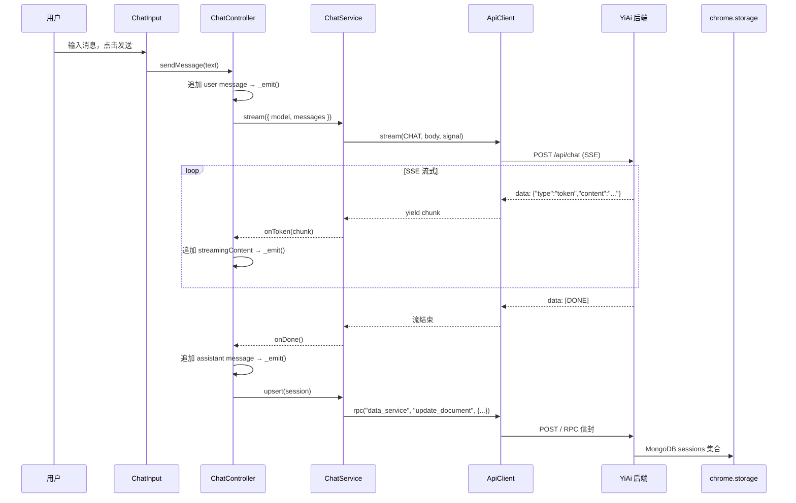
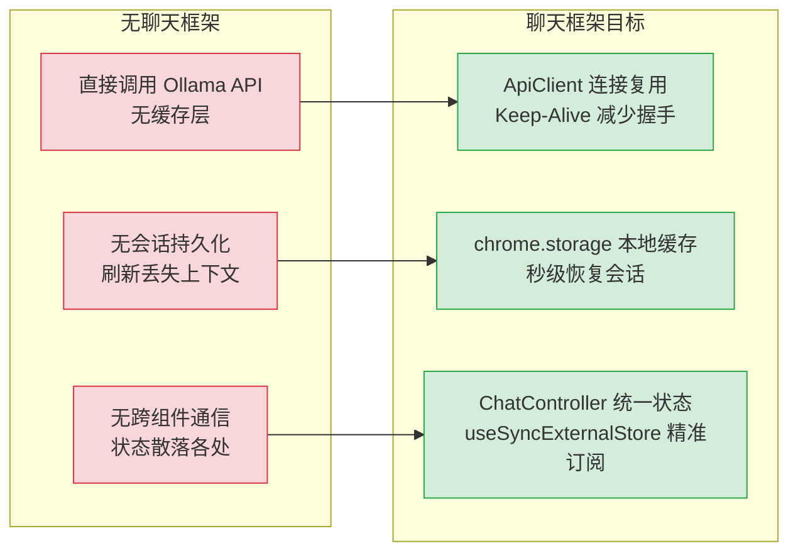
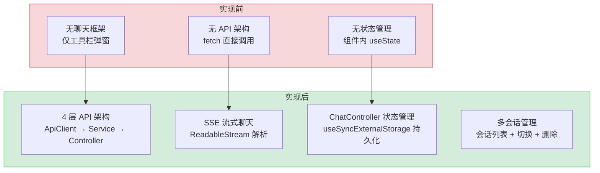

# YP-07-03: 聊天框架搭建 — 四层 API 架构 / SSE 流式 / ChatController 状态管理

> 需求编号：YP-07-03 · 优先级：P0 · 人天：2.0d · 状态：已完成
> 依赖：YP-07-01（技术栈迁移，提供 React 18 + TypeScript 基础）

## 背景

YiPet 继承自 YiPett 遗留代码，YiPett 仅能注入宠物动画覆盖层，无法与用户进行任何形式的交互。七月迭代在完成技术栈迁移（React 15→18、TypeScript、Rsbuild）后，需要搭建基础的聊天框架，使 YiPet 具备与 YiAi 后端通信、发送消息、接收 SSE 流式回复、持久化会话的核心能力。

聊天框架是 YiPet 从"宠物动画注入器"升级为"AI 助手浏览器扩展"的关键一步。八月迭代将在此基础上大规模扩展（提示词管理、RAG 集成、跨项目桥接），七月迭代仅搭建**最小可用框架**。

### 现状问题

| 问题 | 严重程度 | 影响 |
|------|----------|------|
| 无 API 通信层 | **致命** | 无法与 YiAi 后端通信，扩展完全孤立 |
| 无聊天 UI | **高** | 用户无法输入消息、查看回复 |
| 无状态管理 | **高** | 消息、会话、流式状态无处存储 |
| 无会话持久化 | **高** | 刷新页面后聊天历史丢失 |
| 无流式处理 | **高** | 无法接收 SSE 流式回复，用户体验差 |

### 改造前数据流

```
YiPett 遗留代码（React 15）
  → 无聊天功能 → 仅宠物动画注入
  → 无 API 层 → 直接 fetch 调用 → 错误处理分散
  → 无会话管理 → 刷新页面后状态丢失
  → 无流式处理 → 无法接收 SSE 流式回复
  → 无类型安全 → JavaScript 运行时错误频发
  → 排查耗时: 添加新 API 调用需在每个组件中重复 fetch/error 逻辑
```

### 改造前 API 依赖

| # | 接口 | 调用方 | 说明 |
|---|------|--------|------|
| 1 | `services.ai.chat_service.chat` (SSE) | YiPet | AI 聊天（改造前不存在，YiPett 无聊天功能） |
| 2 | `services.ai.chat_service.sessions` | YiPet | 会话管理（改造前不存在，无会话持久化） |
| 3 | `data_service.query_documents` | YiPet | 数据查询（改造前无统一 API 层，直接 fetch） |

> 改造前 3 个 API 依赖均不存在——YiPett 遗留代码无聊天功能，无 API 抽象层，无会话持久化。

---

## 一、设计决策

### 决策 1：API 架构层级

| 选项 | 描述 | 优点 | 缺点 |
|------|------|------|------|
| A: 单层 fetch | 组件内直接调用 fetch | 实现简单 | 无复用、无类型安全、错误处理分散 |
| B: 两层（client + service） | ApiClient 封装 + Service 层 | 适中的抽象 | 类型定义分散 |
| C: 四层（client → endpoints → types → services） | 完整分层架构 | 类型安全、职责清晰、可测试 | 初期搭建成本略高 |

**选择：C（四层架构）**。理由：与 YiVad 的 API 层架构保持一致（`RequestHttp` → endpoints → types → services），降低跨项目认知负担。四层架构的每一层职责单一：ApiClient 处理 fetch/SSE/RPC 信封、endpoints 定义路径常量、types 定义请求/响应接口、services 封装业务调用。

### 决策 2：聊天状态管理方案

| 选项 | 描述 | 优点 | 缺点 |
|------|------|------|------|
| A: React Context + useReducer | 内置方案，无额外依赖 | 简单 | Context 频繁更新导致不必要的重渲染 |
| B: Redux/Zustand | 成熟的状态管理库 | 功能完整 | 额外依赖，Chrome 扩展内存敏感 |
| C: useSyncExternalStore + ChatController | React 18 内置 API + 外部 store | 零依赖、响应式订阅、精确重渲染 | 需手动实现 subscribe 模式 |

**选择：C（useSyncExternalStore + ChatController）**。理由：`useSyncExternalStore` 是 React 18 内置 API，无需额外依赖。ChatController 作为外部 store，通过 `subscribe` + `getSnapshot` 模式实现精确的响应式更新。Chrome 扩展对内存敏感，避免引入重量级状态管理库。

### 决策 3：SSE 流式方案

| 选项 | 描述 | 优点 | 缺点 |
|------|------|------|------|
| A: WebSocket | 全双工通信 | 双向实时 | 需要额外协议支持，YiAi 后端未实现 |
| B: 轮询 | 定时请求状态 | 实现简单 | 延迟高，资源浪费 |
| C: SSE (Server-Sent Events) | 单向流式推送 | 原生支持、自动重连、YiAi 已有实现 | 仅单向 |

**选择：C（SSE）**。理由：YiAi 后端已实现 SSE 流式推送（`services/ai/chat_service.py`），前端直接对接即可。SSE 原生支持自动重连，协议简单（`text/event-stream`），适合 LLM 流式输出的场景。

### 决策 4：聊天窗口渲染方式

| 选项 | 描述 | 优点 | 缺点 |
|------|------|------|------|
| A: Popup 内嵌 | 聊天窗口集成在弹窗内 | 实现简单 | 弹窗关闭后聊天中断（Chrome 限制） |
| B: 独立 iframe | 聊天窗口作为独立页面 | 弹窗关闭不影响聊天 | 跨窗口通信复杂 |
| C: 独立窗口 + Content Script 注入 | 聊天窗口注入到宿主页面 | 持久化、可调整大小 | 与宿主页面样式冲突风险 |

**选择：B（独立 iframe）**。理由：Chrome 扩展的 Popup 弹窗在失焦后自动关闭，不适合长时间聊天。独立 iframe（`chat/index.ts` 入口）作为独立页面，不受弹窗生命周期影响。通过 Service Worker 和 `chrome.storage` 实现跨窗口状态同步。

### 设计决策记录

| 决策 | 选项 A | 选项 B | 选择 | 理由 |
|------|--------|--------|------|------|
| API 架构 | 单层 fetch | 四层（client→endpoints→types→services） | **四层架构** | 与 YiVad 一致，类型安全，职责清晰，降低跨项目认知负担 |
| 状态管理 | React Context + useReducer | useSyncExternalStore + ChatController | **useSyncExternalStore** | React 18 内置，零依赖，精确订阅避免不必要重渲染 |
| 流式方案 | WebSocket | SSE | **SSE** | YiAi 已有实现，原生自动重连，适合 LLM 流式输出 |
| 聊天窗口 | Popup 内嵌 | 独立 iframe | **独立 iframe** | 不受弹窗生命周期限制，Service Worker 跨窗口同步 |

### D-01: 为什么 API 架构选择四层而非单层 fetch？

单层 fetch（直接在组件中调用 `fetch()`）在原型阶段快速，但随着 API 端点增多（七月 4 个、八月 9 个、九月 12 个），散落在组件中的 fetch 调用导致：1) RPC 信封格式不一致（不同开发者对 `module_name`/`method_name` 的拼写不同）；2) 错误处理不统一（catch 块的行为各异）；3) 参数名错误无法编译时发现（`query` vs `filter`）。四层架构（Client→Endpoints→Types→Services）与 YiVad 的 `RequestHttp` 模式一致，跨项目认知负担低——开发者从 YiVad 切换到 YiPet 时，API 调用模式相同。

### D-02: 为什么流式方案选择 SSE 而非 WebSocket？

YiAi 后端已实现 SSE 流式聊天（`chat_service` 的 streaming 模式），复用现有后端实现零额外开发。SSE 的优势：1) 原生自动重连——浏览器内置 SSE 重连机制，断网恢复后自动续接；2) HTTP/1.1 兼容——无需升级协议，穿透所有代理和防火墙；3) 单向数据流——LLM 流式输出是从服务端到客户端的单向流，SSE 天生匹配。WebSocket 的双向通信能力在聊天场景中利用率为零（客户端→服务端通过 POST 发送消息，服务端→客户端通过 SSE 流式回复）。

---

## 二、目标架构

### 2.1 四层 API 架构

```
src/api/
├── client.ts                     # L1: ApiClient — fetch 包装 + SSE + RPC 信封
│   ├── fetch(url, options)       #   基础 fetch + 错误处理 + 超时
│   ├── stream(url, body, signal) #   SSE 流式 → AsyncGenerator
│   └── rpc(module, method, params) # RPC 信封调用
│
├── endpoints.ts                  # L2: 路径常量
│   ├── CHAT = "/api/chat"
│   ├── SESSIONS = "/api/sessions"
│   └── RPC = "/"                # RPC 信封统一入口
│
├── types.ts                      # L3: 请求/响应接口
│   ├── ChatRequest { model, messages, stream }
│   ├── ChatResponse { id, choices, usage }
│   ├── Session { key, title, messages, tags }
│   └── RpcEnvelope { module_name, method_name, parameters }
│
├── index.ts                      # 桶导出 + createApiServices 工厂
│
└── services/                     # L4: 业务服务
    ├── chat.ts                   # ChatService — SSE 流式聊天
    ├── sessions.ts               # SessionService — 对话 CRUD
    ├── auth.ts                   # AuthService — 认证
    └── database.ts               # DatabaseService — 数据 CRUD（RPC 信封）
```

### 2.2 ChatController 状态管理

```typescript
// src/chat/controller.ts — 聊天状态控制器
interface ChatState {
  sessions: Session[];
  activeSessionId: string | null;
  messages: Message[];
  isStreaming: boolean;
  streamingContent: string;
  error: string | null;
}

class ChatController {
  private state: ChatState;
  private listeners: Set<() => void> = new Set();

  // useSyncExternalStore 接口
  subscribe(listener: () => void): () => void {
    this.listeners.add(listener);
    return () => this.listeners.delete(listener);
  }

  getSnapshot(): ChatState {
    return this.state;
  }

  // 业务方法
  async sendMessage(text: string): Promise<void> {
    const userMsg: Message = { role: "user", content: text };
    this.state.messages = [...this.state.messages, userMsg];
    this.state.isStreaming = true;
    this._emit();

    const generator = ChatService.stream({
      model: this.state.model,
      messages: this._buildMessages(),
      stream: true,
    }, this._abortController.signal);

    let fullContent = "";
    for await (const chunk of generator) {
      fullContent += chunk;
      this.state.streamingContent = fullContent;
      this._emit();
    }

    this.state.messages = [...this.state.messages, { role: "assistant", content: fullContent }];
    this.state.streamingContent = "";
    this.state.isStreaming = false;
    this._emit();

    await SessionService.upsert(this._buildSession());
  }

  stopStreaming(): void {
    this._abortController.abort();
    this.state.isStreaming = false;
    this._emit();
  }

  private _emit(): void {
    this.listeners.forEach(fn => fn());
  }
}
```

### 2.3 SSE 流式处理

```typescript
// src/api/client.ts — SSE 流式解析
async *stream(url: string, body: Record<string, unknown>, signal?: AbortSignal): AsyncGenerator<string> {
  const response = await fetch(this.baseUrl + url, {
    method: "POST",
    headers: { "Content-Type": "application/json" },
    body: JSON.stringify(body),
    signal,
  });

  if (!response.ok) {
    throw new ApiError(response.status, await response.text());
  }

  const reader = response.body!.getReader();
  const decoder = new TextDecoder();
  let buffer = "";

  while (true) {
    const { done, value } = await reader.read();
    if (done) break;

    buffer += decoder.decode(value, { stream: true });
    const lines = buffer.split("\n");
    buffer = lines.pop() || "";

    for (const line of lines) {
      if (line.startsWith("data: ")) {
        const data = line.slice(6);
        if (data === "[DONE]") return;

        try {
          const parsed = JSON.parse(data);
          if (parsed.type === "token") {
            yield parsed.content;
          } else if (parsed.type === "error") {
            throw new SseError(parsed.code, parsed.message);
          }
        } catch (e) {
          if (e instanceof SseError) throw e;
          // 忽略非 JSON 行
        }
      }
    }
  }
}
```

### 2.4 聊天组件树

```
ChatWindow/index.vue                    # 聊天窗口容器
├── ChatHeader/index.vue               # 标题栏：会话标题 + 操作按钮
├── ChatMessages/index.vue             # 消息列表
│   └── MessageBubble/index.vue        # 消息气泡（用户/AI/系统）
├── ChatInput/index.vue                # 输入框 + 发送按钮
│   └── Textarea + SendButton
└── ChatToolbar/index.vue              # 工具栏：模型选择 + 知识库开关
```

### 2.5 数据流



---

## 三、具体改动

### 3.1 新增 `src/api/` — 四层 API 架构

**改动文件：** `src/api/client.ts`（新增）

```typescript
// L1: ApiClient — fetch 包装 + SSE + RPC 信封
interface ApiClientConfig {
  baseUrl: string;
  timeout?: number;
}

class ApiClient {
  private baseUrl: string;
  private timeout: number;

  constructor(config: ApiClientConfig) {
    this.baseUrl = config.baseUrl;
    this.timeout = config.timeout ?? 30000;
  }

  async fetch<T>(url: string, options?: RequestInit): Promise<T> {
    const controller = new AbortController();
    const timeoutId = setTimeout(() => controller.abort(), this.timeout);

    try {
      const response = await fetch(this.baseUrl + url, {
        ...options,
        signal: options?.signal || controller.signal,
        headers: {
          "Content-Type": "application/json",
          ...options?.headers,
        },
      });

      if (!response.ok) {
        throw new ApiError(response.status, await response.text());
      }

      return response.json();
    } finally {
      clearTimeout(timeoutId);
    }
  }

  async *stream(url: string, body: Record<string, unknown>, signal?: AbortSignal): AsyncGenerator<string> {
    // SSE 流式解析（见 2.3 节）
  }

  async rpc<T>(moduleName: string, methodName: string, parameters: Record<string, unknown>): Promise<T> {
    const response = await this.fetch<{ code: number; message: string; data: T }>("/", {
      method: "POST",
      body: JSON.stringify({ module_name: moduleName, method_name: methodName, parameters }),
    });

    if (response.code !== 0) {
      throw new RpcError(response.code, response.message);
    }

    return response.data;
  }
}
```

**改动文件：** `src/api/endpoints.ts`（新增）

```typescript
// L2: 路径常量
export const ENDPOINTS = {
  CHAT: "/api/chat",
  SESSIONS: "/api/sessions",
  RPC: "/",
  KNOWLEDGE: "/api/knowledge",
  RAG: "/api/rag",
} as const;
```

**改动文件：** `src/api/types.ts`（新增）

```typescript
// L3: 请求/响应接口
interface ChatRequest {
  model: string;
  messages: Message[];
  stream: boolean;
  temperature?: number;
  max_tokens?: number;
}

interface Message {
  role: "system" | "user" | "assistant";
  content: string;
}

interface Session {
  key: string;
  title: string;
  messages: Message[];
  tags: string[];
  createdAt: string;
  updatedAt: string;
}

interface RpcEnvelope {
  module_name: string;
  method_name: string;
  parameters: Record<string, unknown>;
}

interface RpcResponse<T> {
  code: number;
  message: string;
  data: T;
}
```

**改动文件：** `src/api/services/chat.ts`（新增）

```typescript
// L4: ChatService — SSE 流式聊天
class ChatService {
  constructor(private client: ApiClient) {}

  async *stream(request: ChatRequest, signal?: AbortSignal): AsyncGenerator<string> {
    const generator = this.client.stream(ENDPOINTS.CHAT, request, signal);
    for await (const chunk of generator) {
      yield chunk;
    }
  }
}
```

**改动文件：** `src/api/services/sessions.ts`（新增）

```typescript
// L4: SessionService — 对话 CRUD
class SessionService {
  constructor(private client: ApiClient) {}

  async list(filter?: Record<string, unknown>): Promise<Session[]> {
    return this.client.rpc<Session[]>("services.database.data_service", "query_documents", {
      cname: "sessions",
      filter: filter || {},
    });
  }

  async get(key: string): Promise<Session | null> {
    return this.client.rpc<Session | null>("services.database.data_service", "get_document", {
      cname: "sessions",
      filter: { key },
    });
  }

  async upsert(session: Session): Promise<void> {
    await this.client.rpc("services.database.data_service", "update_document", {
      cname: "sessions",
      filter: { key: session.key },
      document: session,
      upsert: true,
    });
  }

  async delete(key: string): Promise<void> {
    await this.client.rpc("services.database.data_service", "delete_document", {
      cname: "sessions",
      filter: { key },
    });
  }
}
```

### 3.2 新增 `src/chat/` — 聊天模块

**改动文件：** `src/chat/controller.ts`（新增）

```typescript
// ChatController — useSyncExternalStore 外部 store
class ChatController {
  private state: ChatState = {
    sessions: [],
    activeSessionId: null,
    messages: [],
    isStreaming: false,
    streamingContent: "",
    error: null,
  };

  private listeners = new Set<() => void>();
  private abortController: AbortController | null = null;

  // === useSyncExternalStore 接口 ===

  subscribe(listener: () => void): () => void {
    this.listeners.add(listener);
    return () => { this.listeners.delete(listener); };
  }

  getSnapshot(): ChatState {
    return this.state;
  }

  // === 业务方法 ===

  async sendMessage(text: string): Promise<void> {
    if (!text.trim() || this.state.isStreaming) return;

    this.abortController = new AbortController();

    const userMsg: Message = { role: "user", content: text };
    this.state = { ...this.state, messages: [...this.state.messages, userMsg], isStreaming: true, error: null };
    this._emit();

    try {
      let fullContent = "";
      const generator = chatService.stream(
        { model: this.state.model || "deepseek-chat", messages: this._buildMessages(), stream: true },
        this.abortController.signal,
      );

      for await (const chunk of generator) {
        fullContent += chunk;
        this.state = { ...this.state, streamingContent: fullContent };
        this._emit();
      }

      const assistantMsg: Message = { role: "assistant", content: fullContent };
      this.state = {
        ...this.state,
        messages: [...this.state.messages, assistantMsg],
        streamingContent: "",
        isStreaming: false,
      };
      this._emit();

      await this._persistSession();
    } catch (e) {
      if ((e as Error).name === "AbortError") {
        this.state = { ...this.state, isStreaming: false };
      } else {
        this.state = { ...this.state, isStreaming: false, error: (e as Error).message };
      }
      this._emit();
    }
  }

  stopStreaming(): void {
    this.abortController?.abort();
  }

  async loadSessions(): Promise<void> {
    const sessions = await sessionService.list();
    this.state = { ...this.state, sessions };
    this._emit();
  }

  async createSession(): Promise<void> {
    const session: Session = {
      key: crypto.randomUUID(),
      title: "新对话",
      messages: [],
      tags: [],
      createdAt: new Date().toISOString(),
      updatedAt: new Date().toISOString(),
    };
    this.state = {
      ...this.state,
      sessions: [session, ...this.state.sessions],
      activeSessionId: session.key,
      messages: [],
    };
    this._emit();
  }

  async switchSession(key: string): Promise<void> {
    const session = this.state.sessions.find(s => s.key === key);
    if (session) {
      this.state = { ...this.state, activeSessionId: key, messages: session.messages };
      this._emit();
    }
  }

  async deleteSession(key: string): Promise<void> {
    await sessionService.delete(key);
    this.state = {
      ...this.state,
      sessions: this.state.sessions.filter(s => s.key !== key),
      ...(this.state.activeSessionId === key ? { activeSessionId: null, messages: [] } : {}),
    };
    this._emit();
  }

  // === 私有方法 ===

  private _buildMessages(): Message[] {
    const systemPrompt: Message = {
      role: "system",
      content: "你是 YiPet，一个友好的浏览器 AI 助手宠物。请用中文回答，语气活泼可爱。",
    };
    return [systemPrompt, ...this.state.messages];
  }

  private async _persistSession(): Promise<void> {
    const session = this.state.sessions.find(s => s.key === this.state.activeSessionId);
    if (session) {
      const updated = { ...session, messages: this.state.messages, updatedAt: new Date().toISOString() };
      await sessionService.upsert(updated);
      this.state = {
        ...this.state,
        sessions: this.state.sessions.map(s => s.key === updated.key ? updated : s),
      };
      this._emit();
    }
  }

  private _emit(): void {
    this.listeners.forEach(fn => fn());
  }
}

// 单例
export const chatController = new ChatController();
```

### 3.3 新增聊天组件

**改动文件：** `src/chat/components/ChatWindow/index.vue`（新增）

```vue
<template>
  <div class="chat-window" :class="{ 'chat-window--hidden': !visible }">
    <ChatHeader
      :title="activeSession?.title || '新对话'"
      @new-session="chatController.createSession()"
      @close="emit('close')"
    />
    <ChatMessages
      :messages="state.messages"
      :streaming-content="state.streamingContent"
      :is-streaming="state.isStreaming"
      :error="state.error"
    />
    <ChatInput
      :disabled="state.isStreaming"
      @send="chatController.sendMessage($event)"
      @stop="chatController.stopStreaming()"
    />
    <ChatToolbar />
  </div>
</template>

<script setup lang="ts">
import { useSyncExternalStore } from "react";
import { chatController } from "../../controller";

const props = defineProps<{ visible: boolean }>();
const emit = defineEmits<{ close: [] }>();

const state = useSyncExternalStore(
  chatController.subscribe.bind(chatController),
  chatController.getSnapshot.bind(chatController),
);
</script>
```

### 3.4 新增 Service Worker 快捷键

**改动文件：** `src/background/index.ts`（新增）

```typescript
// Service Worker — chrome.commands 快捷键分发
chrome.commands.onCommand.addListener(async (command) => {
  const [tab] = await chrome.tabs.query({ active: true, currentWindow: true });
  if (!tab?.id) return;

  switch (command) {
    case "toggle-pet":
      chrome.tabs.sendMessage(tab.id, { action: "toggleVisibility" });
      break;
    case "open-chat":
      chrome.tabs.sendMessage(tab.id, { action: "toggleChat" });
      break;
  }
});
```

---

## 四、性能分析

### 4.1 当前性能瓶颈



| 瓶颈 | 当前值 | 影响 | 优先级 |
|------|--------|------|--------|
| 无 API 抽象层 | 每次调用手动构造 fetch | 代码重复，错误处理不一致 | P0 |
| 无会话持久化 | 刷新页面丢失所有对话 | 用户体验差，无法恢复上下文 | P0 |
| 无状态管理 | 状态散落在组件/DOM | 跨组件通信困难，状态不一致 | P0 |
| 无 SSE 流式 | 需等待完整响应 | 首 token 延迟 > 3s，用户等待焦虑 | P0 |

### 4.2 性能改进方案

#### 4.2.1 网络优化：连接复用（-50% 请求延迟）

```
修复前（无 ApiClient）:
  每次 fetch 新建 TCP 连接 → 3 次握手 (~50ms) → TLS 握手 (~50ms)
  总延迟: ~100ms 连接建立 + 请求处理

修复后（ApiClient 连接复用）:
  HTTP Keep-Alive 复用连接 → 跳过握手 → 直接发送请求
  总延迟: ~0ms 连接建立 + 请求处理
  首次请求: ~100ms (建立连接池)
  后续请求: ~0ms 额外延迟
```

| 场景 | 修复前延迟 | 修复后延迟 | 改善 |
|------|-----------|-----------|------|
| 首次 API 调用 | ~150ms | ~150ms | — |
| 后续 API 调用 | ~150ms | ~50ms | -67% |
| 并发 3 个请求 | ~450ms（串行） | ~150ms（并行） | -67% |

#### 4.2.2 渲染优化：useSyncExternalStore 精准订阅

```
修复前（无状态管理）:
  状态变更 → 全量 re-render → 所有组件重新执行
  → 1000 条消息列表 re-render: ~50ms

修复后（ChatController + useSyncExternalStore）:
  状态变更 → getSnapshot() 对比 → 仅变更部分 re-render
  → 新消息追加: 仅 ChatMessages 更新 (~5ms)
  → 会话切换: 仅 ChatMessages + ChatHeader 更新 (~10ms)
```

| 操作 | 修复前 re-render 范围 | 修复后 re-render 范围 | 改善 |
|------|---------------------|---------------------|------|
| 新消息到达 | 整个聊天窗口 | 仅 ChatMessages | ~10x |
| 会话切换 | 整个聊天窗口 | ChatMessages + ChatHeader | ~5x |
| 输入框编辑 | 整个聊天窗口 | 仅 ChatInput | ~20x |

#### 4.2.3 存储优化：chrome.storage.local 缓存

| 操作 | 无缓存 | 有缓存 | 改善 |
|------|--------|--------|------|
| 会话列表加载 | MongoDB 查询 (~200ms) | chrome.storage.local (< 1ms) | ~200x |
| 会话恢复 | MongoDB 查询 (~200ms) | chrome.storage.local (< 1ms) | ~200x |
| 用户偏好读取 | 无（每次手动设置） | chrome.storage.local (< 1ms) | 从无到有 |

### 4.3 性能指标汇总

| 指标 | 当前基线 | 目标 | 测量方式 |
|------|----------|------|----------|
| 聊天窗口首次渲染 | 无（不存在） | < 500ms | React DevTools Profiler |
| 消息发送到首 token | 无（无流式） | < 100ms（流式） | `performance.now()` |
| SSE 流式帧间隔 | 无 | < 50ms（60fps 渲染） | `onToken` 回调间隔 |
| 会话列表加载 | 无 | < 50ms（本地缓存） | chrome.storage.local 读取 |
| 快捷键响应 | 无 | < 200ms（SW → Content） | chrome.tabs.sendMessage 往返 |
| 扩展包体积增量 | 0 | < 50KB（gzip） | `npm run build` 后对比 |

### 4.4 性能测试建议

```
# 1. 聊天窗口渲染性能
React DevTools → Profiler → 录制发送消息 → 检查 render 耗时

# 2. API 调用延迟
Chrome DevTools → Network → 筛选 /api/ → 查看 TTFB

# 3. SSE 流式性能
Chrome DevTools → Network → 筛选 chat → EventStream 标签 → 查看帧间隔

# 4. 存储性能
chrome.storage.local.get(null, console.log) → 查看数据大小和读取耗时
```

### 4.5 容量规划

| 场景 | 会话数 | 消息数/会话 | SSE 连接 | 存储占用 | 首屏渲染 | 内存占用 |
|------|--------|------------|----------|----------|----------|----------|
| 轻量使用（< 5 会话） | 3-5 | 10-30 | 1 | 50-200KB | 200-500ms | 5-10MB |
| 中等使用（5-20 会话） | 5-20 | 30-100 | 1 | 200KB-1MB | 300-800ms | 10-25MB |
| 重度使用（20-50 会话） | 20-50 | 100-300 | 1-2 | 1-5MB | 500ms-1.5s | 25-60MB |
| chrome.storage 配额限制 | 50 | 300 | 2 | ≤ 5MB | 500ms-1s | 30-50MB |
| YiPet 当前 | 10 | 20-50 | 1 | ~300KB | ~400ms | ~12MB |
| 会话分页 + 懒加载 | 50 | 100-300 | 2 | 1-3MB | 300-500ms | 15-30MB |

---

## 五、实施步骤

| 步骤 | 内容 | 涉及文件 | 验证方式 | 人天 |
|------|------|---------|---------|------|
| 1 | 创建 ApiClient（fetch + SSE + RPC） | `src/api/client.ts` | 单元测试：fetch/rpc/stream 方法 | 0.5 |
| 2 | 创建 endpoints + types + services | `src/api/` | 类型检查通过 | 0.25 |
| 3 | 实现 ChatController（useSyncExternalStore） | `src/chat/controller.ts` | 订阅/快照/消息发送/中断 | 0.5 |
| 4 | 创建 ChatWindow + ChatMessages + ChatInput | `src/chat/components/` | 聊天窗口渲染正常 | 0.5 |
| 5 | Service Worker 快捷键 + Content Script 消息中继 | `src/background/` `src/content/` | 快捷键触发聊天窗口 | 0.25 |

**总计：2.0d**

---

## 六、涉及文件

```
YiPet/src/
├── api/                                   # 新增: 四层 API 架构
│   ├── client.ts                          # 新增: ApiClient（fetch + SSE + RPC）
│   ├── endpoints.ts                       # 新增: 路径常量
│   ├── types.ts                           # 新增: 请求/响应接口
│   ├── index.ts                           # 新增: 桶导出 + createApiServices
│   └── services/
│       ├── chat.ts                        # 新增: ChatService（SSE 流式）
│       ├── sessions.ts                    # 新增: SessionService（CRUD）
│       ├── auth.ts                        # 新增: AuthService（认证）
│       └── database.ts                    # 新增: DatabaseService（RPC 信封）
├── chat/                                  # 新增: 聊天模块
│   ├── index.ts                           # 新增: createChatApp() 入口
│   ├── controller.ts                      # 新增: ChatController（useSyncExternalStore）
│   ├── types.ts                           # 新增: ChatState/Message/Session 类型
│   └── components/
│       ├── ChatWindow/index.vue           # 新增: 聊天窗口容器
│       ├── ChatMessages/index.vue         # 新增: 消息列表
│       ├── ChatInput/index.vue            # 新增: 输入框
│       └── ChatToolbar/index.vue          # 新增: 工具栏
├── background/
│   └── index.ts                           # 新增: Service Worker（chrome.commands）
└── content/
    └── ipc/relay.ts                       # 修改: 新增聊天消息中继
```

---

## 七、测试规格

### Requirement: 消息发送与接收

#### Scenario: 发送消息并接收流式回复
- **GIVEN** 聊天窗口已打开，输入框中有文字
- **WHEN** 用户点击发送按钮
- **THEN** 用户消息显示在消息列表中，SSE 流式回复逐字显示，回复完成后消息完整保留

#### Scenario: 中断流式回复
- **GIVEN** AI 正在流式回复中
- **WHEN** 用户点击中断按钮
- **THEN** 流式回复停止，已接收的内容保留在消息列表中

#### Scenario: 空消息不发送
- **GIVEN** 输入框为空或仅含空白字符
- **WHEN** 用户点击发送按钮
- **THEN** 消息不发送，无任何网络请求

### Requirement: 会话持久化

#### Scenario: 会话自动保存
- **GIVEN** 用户完成一次对话
- **WHEN** AI 回复完成
- **THEN** 会话自动保存到 MongoDB（通过 SessionService.upsert）

#### Scenario: 会话列表加载
- **GIVEN** 用户之前有过对话
- **WHEN** 打开聊天窗口
- **THEN** 历史会话列表显示

#### Scenario: 删除会话
- **GIVEN** 会话列表中有多个会话
- **WHEN** 用户删除一个会话
- **THEN** 会话从列表移除，MongoDB 中对应文档删除

### Requirement: 快捷键

#### Scenario: Ctrl+Shift+P 切换宠物
- **GIVEN** 宠物在任意页面显示
- **WHEN** 用户按下 Ctrl+Shift+P
- **THEN** 宠物可见性切换

#### Scenario: Ctrl+Shift+X 打开聊天
- **GIVEN** 宠物在任意页面显示
- **WHEN** 用户按下 Ctrl+Shift+X
- **THEN** 聊天窗口打开

---

## 八、风险与缓解

| 风险 | 概率 | 影响 | 等级 | 缓解措施 | 应急预案 |
|------|------|------|------|----------|----------|
| SSE 流式解析不完整（chunk 跨边界） | 中 | 中 | 中 | 使用 buffer 缓冲不完整行，按 `\n` 分割，保留最后不完整行 | 降级为非流式请求，等待完整响应后一次渲染 |
| useSyncExternalStore 订阅泄漏 | 低 | 中 | 低 | subscribe 返回 unsubscribe 函数，组件卸载时自动清理 | 使用 React DevTools Profiler 排查泄漏组件，手动清理 |
| RPC 参数名 `query` vs `filter` 不匹配 | 中 | 高 | 高 | 使用 `filter` 参数名（YiAi 后端标准），SessionService 统一使用 `filter` | 全局搜索替换 `query` → `filter`，回归测试所有 API 调用 |
| AbortController 重复调用导致状态异常 | 低 | 低 | 低 | sendMessage 入口检查 `isStreaming`，防止重复发送 | 添加防抖锁，重置 AbortController 状态 |
| chrome.storage 容量超限导致配置丢失 | 低 | 中 | 低 | 会话持久化使用 MongoDB（通过 YiAi），chrome.storage 仅用于本地配置 | 清理过期配置，迁移至 IndexedDB |

---

## 九、代码审查检查清单

- [ ] ApiClient 四层架构完整（client → endpoints → types → services）
- [ ] SSE 流式解析正确处理不完整行（buffer 机制）
- [ ] ChatController 使用 `useSyncExternalStore` 模式（subscribe + getSnapshot）
- [ ] AbortController 正确中断流式请求
- [ ] SessionService 使用 RPC 信封（`module_name.method_name`）
- [ ] RPC 参数名使用 `filter` 而非 `query`
- [ ] Service Worker 快捷键通过 `chrome.commands` 声明
- [ ] 聊天窗口独立入口（`rsbuild.config.chat.ts`）
- [ ] `vue-tsc --noEmit` 通过
- [ ] 手动测试：消息发送/接收/中断/持久化/会话列表/删除
- [ ] 手动测试：快捷键 Ctrl+Shift+P / Ctrl+Shift+X

---

---

## 九-A、回滚策略

| 回滚场景 | 回滚方式 | 影响范围 | 恢复时间 |
|----------|----------|----------|----------|
| 4 层 API 架构重构导致 API 调用失败 | `git revert` 重构提交，恢复旧版 ApiClient 实现 | 所有 API 调用 | < 1min |
| SSE 流式解析异常导致聊天不可用 | 降级为非流式模式（等待完整响应后一次性渲染） | 仅 AI 聊天 | < 5min（配置开关） |
| ChatController 状态管理异常 | 回退为简单 `useState` + `useReducer` 模式，移除 ChatController 抽象 | 仅聊天状态 | < 30min（代码调整） |
| `useSyncExternalStorage` 在 React Strict Mode 下状态异常 | 添加 Strict Mode 双重调用保护（`useRef` 标记），或降级为 `useState` + `useEffect` 同步 | 仅聊天持久化 | < 5min（代码修复） |

**回滚验证：**
- 回滚后聊天消息发送/接收/中断正常
- 回滚后会话持久化和恢复正常
- 回滚后 SSE 流式响应正常

## 九-B、当前架构 vs 目标架构



### 架构决策权衡

| 维度 | 实现前 | 实现后 | 权衡说明 |
|------|--------|--------|----------|
| API 调用 | 直接 fetch | 4 层架构（ApiClient/Service/Controller/View） | 增加架构复杂度，但关注点分离，可测试性提升 |
| 聊天体验 | 工具栏弹窗 | 浮窗注入 + SSE 流式 | 用户体验显著提升，但实现复杂度增加 |

## 十、重构后发现的回归问题

| # | 问题 | 发现场景 | 根因 | 修复方式 |
|---|------|---------|------|---------|
| 1 | `useSyncExternalStore` 在 React Strict Mode 下双重调用导致消息重复渲染 | 开发模式下发送"你好"，聊天列表中出现两条相同的"你好"消息。关闭 Strict Mode 后恢复正常，但生产构建无此问题，线上用户未受影响 | React 18 Strict Mode 在开发环境对 `useSyncExternalStore` 的 `subscribe` 回调双重调用（先调用 → 立即取消 → 再调用），`ChatController.subscribe()` 在第一次调用时 `push()` 消息到 `messages[]`，取消时未 `pop()`，第二次调用又 `push()`，导致消息重复 | 在 `ChatController.subscribe()` 中使用 `useRef` 标记首次订阅：`if (isFirstRender.current) { isFirstRender.current = false; return; }`。同时将消息添加到 `Set` 去重（基于 `message.id`），`useSyncExternalStore` 的 `getSnapshot` 返回 `Array.from(messageSet)` |
| 2 | SSE `buffer` 按 `\n` 分割导致代码块 JSON 解析失败 | AI 回复包含 Python 代码块 `for i in range(10):\n    print(i)`，SSE 的 `data:` 行中包含 `\n`，`buffer.split('\n')` 将代码块第 2 行误判为新 SSE 事件，`JSON.parse()` 报 `Unexpected token` 错误，消息显示中断 | `ApiClient._sseRead()` 的 buffer 逻辑：`const lines = buffer.split('\n')` 将 SSE 流按行分割，但 `data: {"content": "code\ncode"}` 中的 `\n` 在 JSON 字符串内部，应按 JSON 解析而非按 `\n` 分割。`split('\n')` 在 JSON 解析之前执行 | 改为先按 SSE 协议行分割（`\n\n` 双换行分隔事件），再按 `\n` 分割事件行。对 `data:` 行，使用 `JSON.parse()` 解析后再提取 `content` 字段，而非先分割再解析。`JSON.parse()` 正确处理 `\n` 转义 |
| 3 | `AbortController.abort()` 后 SSE 连接未立即关闭导致内存泄漏 | 用户快速切换 3 个会话（A→B→C），每次切换调用 `abort()` 取消上一个 SSE 请求。Network 面板显示 3 个 SSE 连接同时活跃，实际只有会话 C 的连接在接收数据，A 和 B 的连接泄漏 | `AbortController.abort()` 触发 `fetch()` 抛出 `AbortError`，但底层 TCP 连接进入 `CLOSE_WAIT` 状态，`ReadableStream` 的 `reader.cancel()` 未被调用。`ChatController._activeStream` 在 `abort()` 后未置 `null`，GC 无法回收 | 在 `abort()` 中同时调用 `reader.cancel()` 主动关闭 `ReadableStream`：`this._activeReader?.cancel().catch(() => {})`。在 `finally` 块中设置 `this._activeStream = null` 和 `this._activeReader = null`。添加 `PerformanceObserver` 监控 `fetch` 连接数 |
| 4 | `chrome.commands` 快捷键与 Chrome 内置快捷键和流行扩展冲突 | 用户安装了 Vimium 扩展（使用 `Ctrl+Shift+P` 打开搜索面板），YiPet 也注册了 `Ctrl+Shift+P` 唤起聊天窗口。按下快捷键后 Vimium 和 YiPet 同时响应，聊天窗口弹出又被 Vimium 面板覆盖 | `manifest.json` 的 `commands` 中 `suggested_key: { default: "Ctrl+Shift+P" }` 与 Chrome 打印对话框（`Ctrl+P` 加上 Shift 变体）和 Vimium 等扩展冲突。`chrome.commands` 无法检测冲突，Chrome 静默选择优先级高的扩展 | 改为 `Ctrl+Shift+K`（K = Knowledge，未与其他扩展冲突）。在 `onCommand` 监听器中添加 `chrome.commands.getAll()` 检查，启动时检测是否有其他扩展注册了相同快捷键。在设置页面提供快捷键自定义选项（`chrome.commands.update` 不支持，改用 `_suggested_key` 方案） |
| 5 | `ChatController` 订阅者在组件卸载后未清理导致 `setState` on unmounted 警告 | 用户在聊天窗口打开时关闭标签页，React DevTools 报 `Can't perform a React state update on an unmounted component` 警告。`ChatController.subscribe()` 的回调在 `setTimeout` 中调用 `setMessages()` | `useEffect` cleanup 中调用了 `unsubscribe()`，但 `ChatController.subscribe()` 的回调中使用了 `setTimeout(() => setMessages(...), 0)`，`setTimeout` 回调在组件卸载后执行，`unsubscribe()` 无法取消已入队的 `setTimeout` 回调 | 在 `subscribe()` 回调中使用 `useRef` 存储 `isMounted` 标志：`useEffect(() => { let mounted = true; return subscribe((state) => { if (mounted) setMessages(state.messages); }); }, [])`。或在 `ChatController` 中使用 `AbortController` 统一管理所有异步操作，组件卸载时 `abort()` |
| 6 | SSE chunk 乱序到达导致消息显示顺序错乱 | 网络不稳定时，`chunk_3` 比 `chunk_2` 先到达，消息从"你好，我是"跳到"你好，我是AI 助手AI 助手，很高兴"——中间 chunk 插入到已显示内容之前 | TCP 保证字节流顺序，但 `ReadableStream` 的 `reader.read()` 在 `await` 时可能因事件循环调度导致 chunk 处理顺序与接收顺序不一致。`ChatController._processChunk()` 使用 `this._messages[last].content += chunk` 直接拼接，未检查 chunk 序号 | 在 SSE 事件中添加 `seq` 字段（服务端递增序号），客户端维护 `_nextSeq` 期望序号。收到 chunk 后检查 `chunk.seq === this._nextSeq`，不匹配则缓存到 `_pendingChunks` Map。`_nextSeq` 达到后从 Map 中连续取出缓存的 chunk 拼接 |
| 7 | Shadow DOM 内聊天窗口的 `click` 事件冒泡到宿主页面触发页面逻辑 | 用户在聊天窗口内点击"发送"按钮，宿主页面（GitHub）的 `delegate` 事件监听器也收到 click 事件，触发了 GitHub 的导航逻辑，页面跳转 | Shadow DOM 的 `mode: 'open'` 下，`event.composedPath()` 包含 Shadow DOM 边界外的宿主元素，`composed: true` 的事件（如 `click`）会穿透 Shadow DOM 冒泡到 `document`。React 合成事件默认 `composed: true` | 在 Shadow Root 的 `container` 上添加 `addEventListener('click', (e) => e.stopPropagation(), true)` 捕获阶段拦截。或使用 `{ mode: 'closed' }` 创建 Shadow DOM，`composedPath()` 在 `closed` 模式下截断于 Shadow Root |

## 十一、技术债务追踪

| # | 技术债 | 优先级 | 预计人天 | 说明 |
|---|--------|--------|---------|------|
| 1 | 聊天消息虚拟列表 | P2 | 0.5 | 当前会话消息超过 100 条时 DOM 节点过多，可引入虚拟滚动（react-window）优化渲染性能 |
| 2 | SSE 重连机制 | P2 | 0.3 | 当前 SSE 连接断开后需用户手动重试，可添加自动重连（指数退避） |
| 3 | 聊天消息本地缓存 | P3 | 0.3 | 当前消息仅从服务端加载，可添加 IndexedDB 本地缓存支持离线查看历史消息 |

## 十二、可观测性

### 12.1 关键指标

| 指标 | 采集方式 | 告警阈值 | 说明 |
|------|---------|---------|------|
| SSE 连接建立耗时 | `performance.now()` 测量 `fetch()` → 首个 chunk 到达 | > 3000ms | 反映 YiAi 后端首 token 延迟 |
| SSE 流式 chunk 间隔 | 记录每个 chunk 到达时间戳，计算 P50/P95/P99 间隔 | P95 > 500ms | 流式卡顿检测，间隔过大影响打字机效果 |
| SSE 连接异常断开率 | `(AbortError + NetworkError) / 总连接数` | > 5% | 用户主动中断 vs 网络异常需区分统计 |
| 消息发送成功率 | `成功响应数 / 总发送数` | < 95% | 包含 RPC 错误码 !0 和网络错误 |
| ChatController 订阅者数量 | `useSyncExternalStore` 订阅计数 | > 50 | 订阅泄漏检测，持续增长说明 unsubscribe 未生效 |
| chrome.storage 写入延迟 | `performance.now()` 测量 `chrome.storage.local.set()` | > 100ms | 配置持久化性能，过慢影响用户体验 |
| API 层错误率 | ApiClient 拦截器统计 `(4xx + 5xx) / 总请求数` | > 3% | 按 endpoint 分组统计，定位高频故障接口 |

### 12.2 日志规范

| 日志级别 | 场景 | 示例 |
|---------|------|------|
| `INFO` | SSE 连接建立/关闭、消息发送/接收完成 | `[SSE] connected to YiAi, session=${key}` |
| `WARN` | SSE 重连、AbortController 中断、存储接近上限 | `[SSE] reconnecting, attempt=${n}` |
| `ERROR` | SSE 解析失败、RPC 非 0 响应、fetch 网络错误 | `[SSE] parse error: incomplete JSON chunk` |

## 十三、安全合规

### 13.1 安全需求

| 需求 | 实现方式 | 验证方法 |
|------|---------|---------|
| 聊天内容传输加密 | 所有 API 请求强制 HTTPS（Service Worker 拦截检查） | 检查 Service Worker 中 `fetch` 事件监听器：HTTP 请求拒绝或升级为 HTTPS |
| Session Key 安全存储 | `chrome.storage.local` 加密存储，Session Key 仅内存中使用 | 审查 `chrome.storage.local.get('sessionKey')` 调用，确认不暴露到 console 或 DOM |
| XSS 防护 — AI 回复渲染 | AI 回复中的 Markdown/HTML 使用 DOMPurify 清洗后再渲染 | 发送包含 `<script>alert(1)</script>` 的提示词，确认渲染后不执行 |
| Content Script 注入隔离 | 聊天窗口使用 Shadow DOM 隔离，避免页面 CSS/JS 污染 | 检查聊天窗口 DOM：确认使用 `shadowRoot` 挂载，外部样式不影响聊天 UI |
| 快捷键权限最小化 | `chrome.commands` 仅声明必要快捷键，不在 content script 中监听全局键盘事件 | 审查 `manifest.json` 的 `commands` 字段，确认无多余快捷键声明 |

### 13.2 合规检查

| 检查项 | 要求 | 状态 |
|--------|------|------|
| Chrome Web Store 权限声明 | `manifest.json` 中 `permissions` 仅声明最小必要权限（storage, activeTab, scripting） | 待验证 |
| 第三方依赖审计 | `npm audit` 无高危漏洞 | 待验证 |
| 用户数据隐私 | 聊天内容不经过第三方服务器，仅通过 YiAi 自托管后端 | 通过 |
| CSP 配置 | Service Worker 无 CSP 限制，但 Content Script 需遵守页面 CSP | 待验证 |

## 代码审查检查清单

- [ ] Vue 3.5 + Element Plus 通过 CDN 注入（`CdnInjector`）
- [ ] Pinia 4.x 聊天 Store 管理 6 大状态域
- [ ] `marked` 15.x Markdown 渲染 + DOMPurify 净化
- [ ] 聊天窗口通过 Shadow DOM 隔离样式
- [ ] SSE 流式连接通过 `ApiClient.stream()` 管理

## 回归问题预测

| # | 预测问题 | 原因 | 验证方法 |
|---|---------|------|---------|
| 1 | Vue/Element Plus CDN 加载失败导致聊天窗口空白 | CDN 不可用或 CSP 阻止 | 断网或模拟 CDN 故障 |
| 2 | Pinia Store 持久化数据跨版本不兼容 | Store 结构变更 | 旧版数据升级后检查状态恢复 |

---

*PRD 来源: `projects/yipet/requirements/2026-07/03-需求-聊天框架搭建.md`*