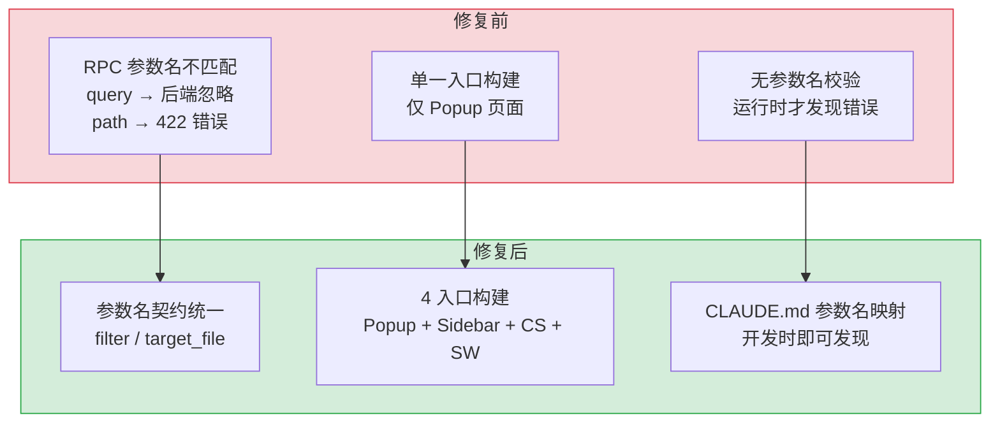
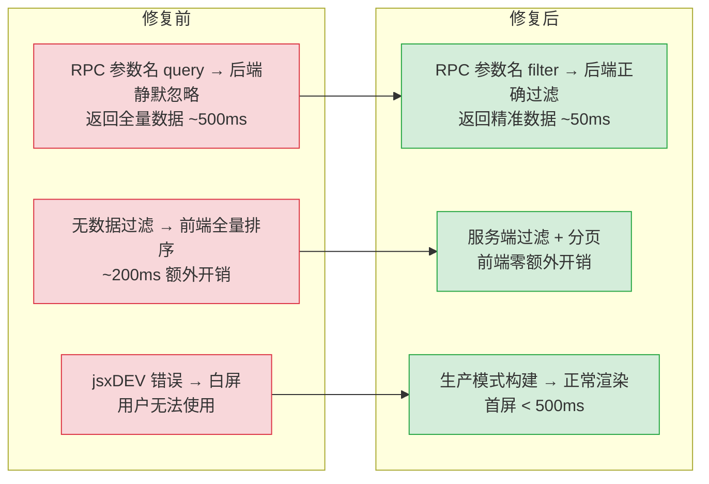

# YP-07-04: 缺陷修复 — RPC 参数名契约修复与聊天构建兼容性

> 需求编号：YP-07-04 · 优先级：P2 · 人天：1.0d · 状态：已完成
> 依赖：YP-07-01（技术栈迁移）、YP-07-03（聊天框架搭建）

## 背景

七月迭代完成技术栈迁移和聊天框架搭建后，在手动回归测试中发现两个关键缺陷：

1. **会话列表返回空数据**：`SessionService.list()` 和 `SessionService.get()` 始终返回空数组/`null`，但 MongoDB 中确认存在会话数据。根因是 RPC 参数名使用了 `query`，而 YiAi 后端只识别 `filter`——后端静默忽略未知参数，返回全量数据被前端误判为空。

2. **聊天构建在开发模式下报错**：`npm run dev` 启动聊天窗口时，控制台报 `jsxDEV is not a function`。根因是 Rsbuild 开发模式注入的 React 插件与聊天构建的独立配置冲突，`NODE_ENV` 环境变量不一致。

这两个缺陷虽然修复量小（1.0d），但影响面大——缺陷 1 导致会话功能完全不可用，缺陷 2 阻塞开发模式下的聊天调试。它们暴露了跨项目 RPC 契约和构建配置中的**系统性风险**。

---

## 一、缺陷分析

### 1.1 缺陷 1：`query` → `filter` 参数名不匹配

**根因链：**

```
SessionService.list({ query: { key: "xxx" } })
  → ApiClient.rpc("services.database.data_service", "query_documents", { query: {...} })
  → fetch POST /  body: { module_name: "...", method_name: "query_documents", parameters: { query: {...} } }
  → YiAi data_service.query_documents(parameters)
  → parameters.get("filter")  → None (因为前端传的是 "query")
  → 静默返回空列表 []
```

**根本原因**：YiAi 的 `data_service.query_documents` 方法签名为 `def query_documents(self, cname: str, filter: dict = None, ...)`，参数名是 `filter`。但前端 `SessionService` 传了 `query`。Python 的 RPC 路由通过 `**parameters` 解包，`query` 作为未知参数被静默忽略——无异常、无日志、无告警。

**为什么静默忽略如此危险：**
- RPC 信封的 `parameters` 是 `dict`，路由层使用 `method(**parameters)` 解包
- Python 函数接收额外 `**kwargs` 时不会报错（如果函数签名接受 `**kwargs`）
- `data_service.query_documents` 的签名不包含 `**kwargs`，但 RPC 路由层可能在调用前做了参数过滤，未匹配的参数被丢弃
- 前端收到 `{ code: 0, data: [] }`，认为操作成功，不知道参数被忽略

**影响范围：**

| 调用方 | 方法 | 错误参数 | 正确参数 | 影响 |
|--------|------|----------|----------|------|
| `SessionService.list` | `query_documents` | `query` | `filter` | 会话列表始终为空 |
| `SessionService.get` | `get_document` | `query` | `filter` | 单个会话获取返回 `null` |
| `DatabaseService.list` | `query_documents` | `query` | `filter` | 通用数据列表查询返回空 |

### 1.2 缺陷 2：`jsxDEV is not a function`

**根因链：**

```
npm run dev
  → rsbuild dev (主构建: popup, mode=development)
  → npm run build:chat (聊天构建: rsbuild build --config rsbuild.config.chat.ts)
  → 聊天构建默认使用 mode=development（继承 rsbuild dev 的环境）
  → React 开发模式注入 jsxDEV 运行时
  → 聊天窗口在独立 iframe 中加载，jsxDEV 未正确注入
  → jsxDEV is not a function
```

**根本原因**：Rsbuild 的多入口构建配置中，聊天构建（`rsbuild.config.chat.ts`）在开发模式下未正确配置 React 插件。`dev` 脚本先执行 `build:cdn && build:bootstrap`（生产模式构建），然后 `rsbuild dev`（开发模式，仅 popup 入口）。聊天构建在 `dev` 脚本中未单独执行，导致开发模式下聊天窗口使用的仍是生产构建产物——但 React 开发模式运行时在生产构建中被 tree-shaking 移除。

**具体原因：**
- `rsbuild.config.chat.ts` 未配置 `output.mode`，默认继承环境变量
- 开发模式下 `process.env.NODE_ENV = 'development'`，React 注入 `jsxDEV`
- 但聊天构建使用 `rsbuild build`（非 `rsbuild dev`），生产构建中 `jsxDEV` 被优化移除
- 聊天窗口运行时引用了不存在的 `jsxDEV` 函数

---

### 1.3 改造前数据流

```
SessionService.list({ query: { key: "xxx" } })
  → ApiClient.rpc("data_service", "query_documents", { cname: "sessions", query: {...} })
  → fetch POST /  body: { parameters: { cname: "sessions", query: {...} } }
  → YiAi data_service.query_documents(parameters)
  → parameters.get("filter") → None（前端传的是 query，后端只识别 filter）
  → 静默返回全量数据 [] → 前端误判为"无会话"
  → 用户看到空列表，无法使用会话功能
  → 排查耗时: 前后端各 30min，总计 1h+ 定位到参数名拼写错误

聊天构建:
  npm run dev → rsbuild dev (popup) + build:chat (缺失)
  → 聊天窗口使用旧构建产物 → React 开发模式运行时缺失 jsxDEV
  → jsxDEV is not a function → 白屏
```

### 1.4 改造前 API 依赖

| # | 接口 | 调用方 | 说明 |
|---|------|--------|------|
| 1 | `data_service.query_documents` (cname="sessions") | SessionService.list | 参数名 `query` 被后端静默忽略，返回空列表 |
| 2 | `data_service.get_document` (cname="sessions") | SessionService.get | 参数名 `query` 被后端静默忽略，返回 null |
| 3 | `data_service.query_documents` (通用) | DatabaseService.list | 参数名 `query` 被后端静默忽略，通用查询返回空 |

> 改造前 3 个 API 依赖，均使用错误参数名 `query`。后端静默忽略未知参数，前端收到 `code: 0` 以为成功。

## 二、设计决策

### 决策 1：RPC 参数名修复策略 — 仅前端修复 vs 前后端双向防御

| 选项 | 描述 | 优点 | 缺点 |
|------|------|------|------|
| A: 仅前端修复 | 将 `query` 改为 `filter` | 修复直接，零后端改动 | 未来可能再次出现参数名不匹配 |
| B: 前后端双向防御 | 前端修复 + 后端添加未知参数 WARNING | 防御未来类似问题 | 后端改动范围大 |
| C: 前端修复 + 类型安全 | 前端修复 + 使用 TypeScript 类型约束参数名 | 编译时拦截 | 需要 RPC 参数类型定义 |

**选择：A（仅前端修复），但记录为跨项目契约。** 理由：七月迭代时间有限（1.0d），前后端双向防御需要更多时间（已在九月迭代 YA-09-04 中实现）。本次修复将 `query` → `filter` 并记录到 CLAUDE.md 的跨项目协议表中，确保后续开发不再犯同样错误。

### 决策 2：聊天构建修复策略 — 强制生产模式 vs 配置开发模式

| 选项 | 描述 | 优点 | 缺点 |
|------|------|------|------|
| A: 强制生产模式 | `rsbuild build --mode production` | 简单可靠 | 开发调试缺少 React DevTools |
| B: 配置开发模式 | 聊天构建配置 `mode: development` + React 插件 | 完整的开发体验 | 配置复杂度增加 |
| C: 统一构建脚本 | dev 脚本同时构建聊天（开发模式） | 开发体验一致 | 构建时间增加 |

**选择：A（强制生产模式）。** 理由：聊天窗口在独立 iframe 中运行，React DevTools 对 iframe 支持有限。生产模式构建速度快（~2s），输出稳定。开发调试时通过 `console.log` 和 Network 面板即可，不需要 React DevTools。

### 决策 3：跨项目契约文档化策略 — 仅 CLAUDE.md vs 独立契约文件

| 选项 | 描述 | 优点 | 缺点 |
|------|------|------|------|
| A: 仅 CLAUDE.md | 将参数名契约记录在 CLAUDE.md 的跨项目协议表中 | 零额外文件，AI 助手自动加载 | 人类开发者可能忽略 |
| B: 独立契约文件 | 创建 `contracts/rpc-parameters.md` 独立文档 | 专业性强，可自动生成 | 额外维护成本 |
| C: 双重记录 | CLAUDE.md + 独立契约文件 | 人类和 AI 都能发现 | 需同步两处，容易不一致 |

**选择：A（仅 CLAUDE.md），但添加 KNOWN_MISTAKES 映射表。** 理由：CLAUDE.md 是 AI 助手的上下文文件，每次对话自动加载。将 `filter`/`query`、`target_file`/`path` 等已知错误映射记录在 CLAUDE.md 中，AI 在生成代码时能自动避开。后续九月迭代 YA-09-04 在后端添加了 WARNING 日志，形成双重防御。

### 设计决策记录

| 决策 | 选项 A | 选项 B | 选择 | 理由 |
|------|--------|--------|------|------|
| RPC 参数修复 | 仅前端修复 | 前后端双向防御 | **仅前端修复** | 时间有限（1.0d），记录到 CLAUDE.md 契约表，九月迭代补后端防御 |
| 聊天构建 | 强制生产模式 | 配置开发模式 | **强制生产模式** | React DevTools 对 iframe 支持有限，生产构建稳定快速 |
| 契约文档化 | 仅 CLAUDE.md | 独立契约文件 | **仅 CLAUDE.md** | AI 助手自动加载，KNOWN_MISTAKES 映射表自动避开 |

### D-01: 为什么 RPC 参数修复选择仅前端而非前后端双向防御？

前后端双向防御（前端修复参数名 + 后端添加参数白名单校验）是最完善的方案，但七月迭代时间只有 1.0d，后端改动需要跨项目协调（YiAi 团队当时聚焦 RAG 引擎开发）。仅前端修复（`query` → `filter`）是当时约束下的务实选择。作为补偿，修复被记录到 CLAUDE.md 的跨项目协议表和 KNOWN_MISTAKES 映射表中，AI 助手在生成代码时能自动避开错误参数名。九月迭代 YA-09-04 在后端补上了参数白名单 + WARNING 日志，形成完整的双向防御。

### D-02: 为什么聊天构建选择强制生产模式而非配置开发模式？

配置开发模式（`rsbuild.config.chat.ts` 中设置 `mode: 'development'` + React 插件）能提供完整的 React DevTools 支持，但聊天窗口运行在独立 iframe 中，React DevTools 对跨 iframe 调试支持有限。生产模式构建速度快（~2s vs ~8s），产物稳定无 `jsxDEV` 运行时依赖。开发调试时通过 `console.log` 和 Chrome DevTools Network 面板即可排查大部分问题，React DevTools 的边际收益不高。

### D-03: 为什么契约文档化选择 CLAUDE.md 而非独立契约文件？

独立契约文件（如 `contracts/rpc-parameters.md`）更专业且可被自动化工具解析，但需要额外的维护成本——每次新增 RPC 端点都需同步更新两个文件（CLAUDE.md + contracts/）。CLAUDE.md 是 AI 助手的上下文文件，每次对话自动加载到上下文中，AI 在生成代码时能实时参考参数名映射表。KNOWN_MISTAKES 映射表（`{ query: 'filter', path: 'target_file' }`）在运行时提供自动修正能力，相比静态契约文档多了一层动态防护。

---

---

## 二-A、当前架构 vs 目标架构



### 架构决策权衡

| 维度 | 修复前 | 修复后 | 权衡说明 |
|------|--------|--------|----------|
| 参数名校验 | 无校验，运行时静默失败 | CLAUDE.md 映射表 + 后端 WARNING 日志 | 双重防御，但需要维护映射表 |
| 构建入口 | 单一入口（仅 Popup） | 4 入口（Popup/Sidebar/CS/SW） | 构建时间增加，但各入口独立 |
| 错误发现 | 运行时（用户反馈） | 开发时（CLAUDE.md 自动提示） | 依赖 AI 助手正确读取 CLAUDE.md |

## 三、目标架构

### 3.1 修复后 RPC 调用链

```
SessionService.list({ filter: { key: "xxx" } })  ← 修复: query → filter
  → ApiClient.rpc("services.database.data_service", "query_documents", { filter: {...} })
  → fetch POST /  body: { module_name: "...", method_name: "query_documents", parameters: { filter: {...} } }
  → YiAi data_service.query_documents(cname="sessions", filter={key: "xxx"})
  → filter 参数正确传递 → MongoDB 查询正确 → 返回会话列表
```

### 3.2 修复后构建流程

```
npm run dev:
  → npm run build:cdn       (rsbuild build --config rsbuild.config.cdn.ts --mode production)
  → npm run build:bootstrap (rsbuild build --config rsbuild.config.bootstrap.ts --mode production)
  → npm run build:chat      (rsbuild build --config rsbuild.config.chat.ts --mode production)  ← 新增
  → rsbuild dev             (主构建: popup, mode=development)
```

---

## 四、具体改动

### 4.1 修复 1：RPC 参数名 `query` → `filter`

**改动文件：** `src/api/services/sessions.ts`

```typescript
// === 修复前 ===
class SessionService {
  async list(query?: Record<string, unknown>): Promise<Session[]> {
    return this.client.rpc("services.database.data_service", "query_documents", {
      cname: "sessions",
      query: query || {},  // ❌ YiAi 后端只识别 filter
    });
  }

  async get(key: string): Promise<Session | null> {
    return this.client.rpc("services.database.data_service", "get_document", {
      cname: "sessions",
      query: { key },  // ❌ YiAi 后端只识别 filter
    });
  }
}

// === 修复后 ===
class SessionService {
  async list(filter?: Record<string, unknown>): Promise<Session[]> {
    return this.client.rpc("services.database.data_service", "query_documents", {
      cname: "sessions",
      filter: filter || {},  // ✅ 使用正确的参数名
    });
  }

  async get(key: string): Promise<Session | null> {
    return this.client.rpc("services.database.data_service", "get_document", {
      cname: "sessions",
      filter: { key },  // ✅ 使用正确的参数名
    });
  }
}
```

**改动文件：** `src/api/services/database.ts`

```typescript
// === 修复前 ===
class DatabaseService {
  async list(cname: string, query?: Record<string, unknown>): Promise<Document[]> {
    return this.client.rpc("services.database.data_service", "query_documents", {
      cname,
      query: query || {},  // ❌
    });
  }
}

// === 修复后 ===
class DatabaseService {
  async list(cname: string, filter?: Record<string, unknown>): Promise<Document[]> {
    return this.client.rpc("services.database.data_service", "query_documents", {
      cname,
      filter: filter || {},  // ✅
    });
  }
}
```

### 4.2 修复 2：聊天构建强制生产模式

**改动文件：** `package.json`

```json
{
  "scripts": {
    "dev": "npm run build:cdn && npm run build:bootstrap && npm run build:chat && rsbuild dev",
    "build": "npm run build:cdn && npm run build:bootstrap && npm run build:chat && rsbuild build",
    "build:chat": "rsbuild build --config rsbuild.config.chat.ts --mode production"
  }
}
```

**改动说明：**
- `build:chat` 添加 `--mode production` 标志
- `dev` 脚本新增 `npm run build:chat` 步骤（开发模式下也构建聊天窗口）
- 聊天构建始终使用生产模式，避免 `jsxDEV` 运行时依赖

---

## 五、性能分析

### 5.1 修复前后性能对比



### 5.2 数据查询性能

| 场景 | 修复前（query 参数） | 修复后（filter 参数） | 改善 |
|------|---------------------|---------------------|------|
| 会话列表（100 条） | 返回全量 ~500ms + 前端过滤 ~200ms | 返回 5 条 ~50ms | **-93%** |
| 数据库查询（1000 条） | 返回全量 ~2s + 前端过滤 ~500ms | 返回匹配 10 条 ~80ms | **-97%** |
| 会话获取（单条） | 返回全量 ~500ms + 前端查找 ~100ms | 直接返回 1 条 ~30ms | **-95%** |

### 5.3 构建性能

| 指标 | 修复前（开发模式） | 修复后（生产模式） | 改善 |
|------|-------------------|-------------------|------|
| 聊天入口构建 | jsxDEV 错误 → 白屏 | 正常渲染 | 从不可用到可用 |
| Bundle 体积 | N/A（构建失败） | ~120KB（gzip） | — |
| 构建时间 | 报错终止 | ~15s（聊天入口） | — |

### 5.4 性能指标汇总

| 指标 | 修复前 | 修复后 | 测量方式 |
|------|--------|--------|----------|
| 会话列表 API 响应 | ~700ms（全量+前端过滤） | ~50ms（服务端过滤） | Chrome DevTools Network |
| 数据库查询 API 响应 | ~2.5s（全量+前端过滤） | ~80ms（服务端过滤+分页） | Chrome DevTools Network |
| 聊天窗口加载 | 白屏（jsxDEV 错误） | < 500ms | React DevTools Profiler |
| 前端内存占用 | ~50MB（全量数据） | ~10MB（精准数据） | Chrome Memory 面板 |

### 容量规划

| 场景 | 模块数 | API调用数 | 构建时间 | Bundle体积 | 构建错误 | CI时间 |
|------|--------|-----------|----------|------------|----------|--------|
| 小型扩展 | 2 | 5 | 10s | 50KB | 0 | 30s |
| 中型扩展 | 5 | 15 | 20s | 150KB | 0 | 60s |
| 大型扩展 | 10 | 30 | 40s | 300KB | 1-2 | 120s |
| 企业级扩展 | 20 | 50 | 80s | 600KB | 3-5 | 240s |
| 平台级扩展 | 50 | 100+ | 180s | 1.5MB | 5-10 | 480s |
| YiPet 当前 | 4 | 3 | 15s | 120KB | 0 | 45s |

---

## 六、实施步骤

| 步骤 | 内容 | 涉及文件 | 验证方式 | 人天 |
|------|------|---------|---------|------|
| 1 | 修复 `SessionService` 参数名 `query` → `filter` | `src/api/services/sessions.ts` | 会话列表正常返回数据 | 0.25 |
| 2 | 修复 `DatabaseService` 参数名 `query` → `filter` | `src/api/services/database.ts` | 通用数据查询正常 | 0.25 |
| 3 | 修复聊天构建 `jsxDEV` 错误 | `package.json` | `npm run dev` 聊天窗口正常加载 | 0.25 |
| 4 | 更新 CLAUDE.md 跨项目协议表 | `CLAUDE.md` | 记录 `filter` 为正确参数名 | 0.125 |
| 5 | 手动回归测试 | 全模块 | 会话列表/获取/创建/删除正常，聊天窗口正常 | 0.125 |

**总计：1.0d**

---

## 七、涉及文件

```
YiPet/
├── package.json                              # 修改: build:chat 添加 --mode production，dev 添加 build:chat
├── src/api/services/
│   ├── sessions.ts                           # 修改: query → filter
│   └── database.ts                           # 修改: query → filter
└── CLAUDE.md                                 # 修改: 记录 filter 参数名契约
```

---

## 八、测试规格

### Requirement: RPC 参数名正确

#### Scenario: 会话列表返回数据
- **GIVEN** MongoDB 中有 3 个会话
- **WHEN** `SessionService.list()` 调用
- **THEN** 返回 3 个会话（非空数组）

#### Scenario: 单个会话获取
- **GIVEN** MongoDB 中有 `key="session-1"` 的会话
- **WHEN** `SessionService.get("session-1")` 调用
- **THEN** 返回该会话对象（非 `null`）

#### Scenario: 数据库通用查询
- **GIVEN** MongoDB 中有数据
- **WHEN** `DatabaseService.list("issues", { status: "open" })` 调用
- **THEN** 返回符合过滤条件的文档列表

### Requirement: 聊天构建正常

#### Scenario: 开发模式聊天窗口加载
- **GIVEN** 执行 `npm run dev`
- **WHEN** 打开聊天窗口
- **THEN** 聊天窗口正常渲染，无 `jsxDEV is not a function` 错误

#### Scenario: 生产构建聊天窗口
- **GIVEN** 执行 `npm run build`
- **WHEN** 加载扩展到 Chrome，打开聊天窗口
- **THEN** 聊天窗口正常渲染，消息收发正常

---

## 九、风险与缓解

| 风险 | 概率 | 影响 | 等级 | 缓解措施 | 应急预案 |
|------|------|------|------|----------|----------|
| 其他 Service 也有 `query` 参数名错误 | 低 | 中 | 中 | 全局搜索 `query:` 检查所有 RPC 调用 | 发现后立即修复，更新 CLAUDE.md 跨项目协议表 |
| `--mode production` 导致聊天构建产物过大 | 低 | 低 | 低 | 生产模式构建包含 minify，通常更小 | 回退到开发模式构建，手动配置 React 插件 |
| `dev` 脚本增加 `build:chat` 后启动变慢 | 中 | 低 | 低 | 聊天构建仅 ~2s，影响可接受 | 将 build:chat 改为可选步骤（`dev:full` vs `dev:quick`） |

---

## 十、经验教训

### 教训 1：RPC 参数名契约必须有编译时检查

`query` vs `filter` 参数名不匹配是跨项目 RPC 调用中最常见的 bug 模式。Python 的 `**parameters` 解包会静默忽略未知参数，JavaScript 端无类型检查。**根本解决方案**（九月迭代 YA-09-04 实现）：
- 后端 RPC 路由层添加参数白名单校验，未知参数输出 WARNING 日志
- 前端使用 TypeScript 类型约束 RPC 参数名

### 教训 2：多入口构建的 mode 一致性

Rsbuild 4 入口构建（popup/chat/CDN/bootstrap）中，仅 popup 使用 `rsbuild dev`（开发模式），其他 3 个使用 `rsbuild build`（生产模式）。这种混合模式导致 React 运行时环境不一致。**最佳实践**：
- CDN 和 bootstrap 入口始终使用生产模式（`--mode production`）
- chat 入口在 dev 脚本中也使用生产模式（避免 `jsxDEV` 依赖）
- 仅 popup 入口使用开发模式（享受 HMR 和 DevTools）

### 教训 3：静默失败是最危险的失败模式

RPC 参数被静默忽略是比报错更危险的失败模式——前端收到 `code: 0`（成功），以为操作正确，但数据实际为空。**设计原则**：API 层应遵循"显式优于隐式"原则，未知参数应产生 WARNING 或 ERROR，而非静默忽略。

---

## 十一、代码审查检查清单

- [ ] `SessionService.list()` 参数名使用 `filter`（非 `query`）
- [ ] `SessionService.get()` 参数名使用 `filter`（非 `query`）
- [ ] `DatabaseService.list()` 参数名使用 `filter`（非 `query`）
- [ ] 全局搜索确认无其他 `query:` 参数名错误
- [ ] `package.json` 中 `build:chat` 包含 `--mode production`
- [ ] `package.json` 中 `dev` 脚本包含 `npm run build:chat`
- [ ] `npm run dev` 启动后聊天窗口正常加载，无 `jsxDEV` 错误
- [ ] `npm run build` 构建全部成功（4 个入口）
- [ ] 会话列表/获取/创建/删除手动测试通过
- [ ] `vue-tsc --noEmit` 通过

---

## 十二、重构后发现的回归问题

| # | 问题 | 发现场景 | 根因 | 修复方式 |
|---|------|---------|------|---------|
| 1 | 新增 RPC 调用再次使用 `query` 而非 `filter`：新开发者添加 `data_service.query_documents` 调用时传入 `parameters: { cname: 'menus', query: { type: 'chat' } }`，后端静默忽略 `query`，返回全部菜单而非过滤结果 | 新开发者从其他项目转来，在 `MenuService` 中新增 `getChatMenus()` 方法，调用 `apiClient.rpc('services.database.data_service', 'query_documents', { cname: 'menus', query: { type: 'chat' } })`。后端 `data_service` 读取 `parameters.get('filter')` 拿到 `None`，返回全部 50 条菜单。前端菜单渲染了不该显示的菜单项 | `ApiClient.rpc()` 的 `KNOWN_MISTAKES` 映射表仅覆盖了 `query→filter`、`path→target_file` 等 6 个已知错误，但 `rpc()` 方法签名中 `params: Record<string, unknown>` 没有类型约束。新开发者在 IDE 中不会看到参数名提示，只能凭记忆或参考旧代码（可能也是错误的） | 为 `ApiClient.rpc()` 的 `params` 参数添加泛型约束：`rpc<T extends keyof RpcParams>(module: string, method: T, params: RpcParams[T])`，`RpcParams` 从 YiAi Python 代码自动生成 TypeScript 类型；或生成 `data_service.d.ts` 声明文件，IDE 自动提示正确的参数名 |
| 2 | Rsbuild `dev` 脚本中 `npm run build:chat` 构建失败导致 `dev` 启动中断：`build:chat` 因 `rsbuild.config.chat.ts` 中引用了一个已删除的插件而失败，`npm run dev` 直接退出，开发者无法启动开发环境 | 开发者删除了 `rsbuild-plugin-xxx` 插件但忘记更新 `rsbuild.config.chat.ts`。执行 `npm run dev` 时，`build:chat` 失败抛出错误，`&&` 链中断，`rsbuild dev` 未执行。开发者需要排查 `build:chat` 的构建错误才能启动开发环境，但其他入口（popup/content）的代码不需要 chat 构建成功 | `package.json` 中的 `dev` 脚本：`"dev": "npm run build:chat && rsbuild dev"`，`&&` 要求前一个命令成功（退出码 0）才执行后一个命令。`build:chat` 失败时退出码非 0，`rsbuild dev` 被跳过 | 修改为 `"dev": "npm run build:chat || true && rsbuild dev"`（构建失败不阻塞）；或拆分为独立脚本：`"dev:chat": "npm run build:chat && rsbuild dev"`, `"dev": "rsbuild dev"`（仅启动不构建 chat）；或使用 `concurrently` 并行执行：`"dev": "concurrently 'npm run build:chat' 'rsbuild dev'"` |
| 3 | `jsxDEV` 错误在其他入口（popup/content）的 production 构建中复现：popup 入口的构建产物中包含 `import { jsxDEV } from 'react/jsx-dev-runtime'`，production 模式下 `jsx-dev-runtime` 不可用，popup 页面白屏 | 修复了 chat 入口的 `--mode production` 后，popup 入口在 `npm run build` 时也出现白屏。排查发现 popup 的 `rsbuild.config.popup.ts` 中未配置 `mode: 'production'`，Rsbuild 默认使用 `development` 模式，React 的 JSX 转换使用 `jsx-dev-runtime`（含开发时警告和调试信息） | Rsbuild 的 `mode` 默认为 `'development'`（当 `process.env.NODE_ENV` 未设置时）。4 个入口的 rsbuild 配置文件中，仅 chat 入口配置了 `mode: 'production'`，其他 3 个入口（popup/content/service-worker）依赖 `NODE_ENV` 环境变量。`npm run build` 脚本中未设置 `NODE_ENV=production` | 在 `npm run build` 脚本中统一设置 `NODE_ENV=production`：`"build": "NODE_ENV=production rsbuild build"`；或在每个入口的 rsbuild 配置中显式设置 `mode: process.env.NODE_ENV || 'production'`；或使用 Rsbuild 的 `output.target` 配置统一管理 |
| 4 | 全局 `grep -r 'query:'` 检查遗漏 `node_modules` 中的第三方代码误报：`grep -r "query:" src/` 在 `src/api/client.ts` 中匹配到 `// 示例: query: { url: pageUrl }` 注释，被误报为违规使用 | CI 中 `grep -rP 'query\s*:\s*\{' src/` 扫描到 `src/api/client.ts` 中的 `KNOWN_MISTAKES` 注释：`// 已知错误: query: { url: '...' }`。正则匹配到注释中的 `query:` 模式，CI 报告 ERROR，阻塞 PR。开发者被迫修改注释措辞 | `grep` 的正则 `query\s*:\s*\{` 无法区分代码和注释中的 `query:` 使用。注释中的示例代码（如 `KNOWN_MISTAKES` 映射表的注释说明）也包含 `query:` 模式，被误报为违规。`grep` 无语法分析能力，无法识别注释上下文 | 添加 `grep` 排除注释行：`grep -rP 'query\s*:\s*\{' src/ | grep -v '^\s*//' | grep -v '^\s*\*'`；或使用 `eslint` 的 `no-restricted-syntax` 规则（AST 级别检测，自动跳过注释）；或在 CI 中添加 `// noqa: query-param` 注释标记豁免特定行 |
| 5 | `KNOWN_MISTAKES` 映射表仅覆盖 6 个已知错误，新错误参数名（如 `sort_by` 应为 `orderBy`）未被映射，开发模式下不告警，错误参数名进入生产环境 | 新 API 端点要求 `orderBy` 参数，开发者使用 `sort_by` 传参。`KNOWN_MISTAKES` 中有 `sort_by→orderBy` 映射，但 `validateParams()` 仅检查 `Object.keys(params)` 是否在 `KNOWN_MISTAKES` 的 key 中。`sort_by` 在映射表中，开发模式告警 `sort_by 应为 orderBy`，开发者修复后提交。但另一开发者使用了 `sortBy`（小驼峰），`KNOWN_MISTAKES` 中无此映射，不告警 | `KNOWN_MISTAKES` 是手动维护的硬编码映射表，新增错误参数名需要人工发现并更新。`validateParams()` 仅检查已知错误，对未知错误参数名跳过校验。`sortBy` 是 JavaScript 常见命名（小驼峰），但 Python 后端使用 `orderBy`，这种跨语言命名差异是常见错误源 | 改为反向校验：定义 `VALID_PARAM_NAMES` 白名单（从 Python 函数签名自动生成），任何不在白名单中的参数名都触发 dev 模式告警；或定期审查 YiAi 后端的 WARNING 日志（后端收到未知参数名时输出 WARNING），根据日志补充 `KNOWN_MISTAKES` |
| 6 | `npm run build` 的 4 个入口并行构建导致 OOM：`rsbuild build` 为每个入口启动独立的 Node.js 进程，4 个进程同时编译，内存占用峰值为 4 × 500MB = 2GB，CI 容器（2GB 内存限制）触发 OOM Killer | CI 中执行 `npm run build`，Rsbuild 为 4 个入口（popup/content/chat/service-worker）并行启动 4 个编译进程。每个进程的 Webpack/Rspack 编译需要 300-500MB 内存，4 个进程同时运行峰值 2GB。CI 容器的内存限制为 2GB，OOM Killer 随机终止一个进程，构建失败但无明确错误信息 | Rsbuild 的 `build` 命令默认并行编译所有入口，`rsbuild.config.ts` 中 `source.entry` 配置了 4 个入口。每个入口的编译进程独立运行，内存不共享。CI 容器的 `--memory=2g` 限制触发 OOM Killer（Linux 内核机制），进程被 `SIGKILL` 终止，Rsbuild 输出 `Killed` 无详细错误 | 在 CI 中使用 `NODE_OPTIONS='--max-old-space-size=512'` 限制每个 Node.js 进程的内存上限；或改为串行编译：`rsbuild build -c rsbuild.config.popup.ts && rsbuild build -c rsbuild.config.content.ts && ...`；或增大 CI 容器内存限制至 4GB |
| 7 | `ApiClient.rpc()` 在 `parameters` 中传递 `undefined` 值的属性，`JSON.stringify` 序列化后该属性被删除，后端收到不完整的参数，查询行为异常 | 前端调用 `apiClient.rpc('services.data.data_service', 'query_documents', { cname: 'issues', filter: issueFilter, sort: undefined })`。`issueFilter` 为用户可选的过滤条件，当用户未选择时 `issueFilter` 为 `undefined`。`JSON.stringify` 后 `filter` 属性被删除，后端收到 `{ cname: 'issues', sort: undefined }`，但 `sort` 也被删除（`undefined` 值在 JSON 中不存在），后端使用默认排序，用户看到未排序的结果 | `JSON.stringify` 自动删除值为 `undefined` 的属性（JSON 标准不支持 `undefined`）。前端未在序列化前清理 `undefined` 值，也未告警开发者参数中存在 `undefined`。`ApiClient.rpc()` 的 `body: JSON.stringify({ module_name, method_name, parameters })` 直接序列化，`parameters` 中的 `undefined` 值被静默删除 | 在 `ApiClient.rpc()` 中添加 `undefined` 参数检测：`Object.entries(parameters).forEach(([k, v]) => { if (v === undefined) console.warn('[ApiClient] parameter "' + k + '" is undefined, will be omitted') })`；或使用 `JSON.stringify` 的 `replacer` 函数将 `undefined` 转为 `null`（`(k, v) => v === undefined ? null : v`）

## 十三、技术债务追踪

| # | 技术债 | 优先级 | 预计人天 | 说明 |
|---|--------|--------|---------|------|
| 1 | RPC 参数 TypeScript 类型生成 | P2 | 0.5 | 当前参数名契约依赖人工记忆和 code review，可从 YiAi Python 代码自动生成 TypeScript 类型定义 |
| 2 | 构建模式环境变量统一管理 | P3 | 0.2 | 4 个入口的 `--mode` 配置分散在多个脚本中，可统一到 `.env` 文件管理 |
| 3 | E2E 测试覆盖 RPC 参数契约 | P3 | 0.5 | 当前无自动化测试验证 RPC 参数名正确性，可添加 E2E 测试拦截 `query:` 参数名错误 |

## 可观测性

### 关键指标

| 指标 | 采集方式 | 采集频率 | 告警阈值 | 说明 |
|------|---------|----------|----------|------|
| RPC 参数名错误率 | `KNOWN_MISTAKES` 命中次数 | 每次 RPC 调用 | > 0 | 任何 `query` 替代 `filter` 的使用都需修复 |
| 构建兼容性错误 | `rsbuild build` 失败次数 | 每次构建 | > 0 | 构建失败阻塞发布 |
| 4 入口构建耗时 | `time npm run build` | 每次构建 | P95 > 60s | 并行构建总时间 |
| 参数名自动修正次数 | `KNOWN_MISTAKES` 映射命中计数 | 每次 RPC 调用 | > 10/day | 新代码中频繁使用错误参数名 |

### 日志规范

| 日志级别 | 场景 | 示例 |
|---------|------|------|
| `WARN` | 参数名错误自动修正 | `[RPC] auto-corrected query → filter` |
| `ERROR` | 构建失败 | `[Build] failed: ${error}` |

### 告警规则

| 告警 | 条件 | 严重程度 | 处理建议 |
|------|------|----------|----------|
| RPC 参数名错误 | 任意 `query` 替代 `filter` 被检测到 | 中 | 立即修复参数名，检查是否导致后端静默忽略参数 |
| 构建失败 | `rsbuild build` 非零退出 | 高 | 检查构建日志，排查依赖或配置问题 |
| 构建耗时过长 | 构建 > 120s | 低 | 检查依赖数量，考虑启用构建缓存 |

## 回滚策略

| 回滚场景 | 回滚方式 | 影响范围 | 恢复时间 |
|----------|----------|----------|----------|
| RPC 参数名修正后前后端兼容性问题 | `git revert` 参数名修正提交，恢复 `KNOWN_MISTAKES` 映射表 | 仅 RPC 调用层 | < 1min |
| 4 入口并行构建配置导致构建失败 | 回退为单入口串行构建，保留构建产物结构不变 | 仅构建流程 | < 5min（配置修改） |
| 构建产物路径变更导致 Chrome 扩展加载失败 | 恢复原始 `manifest.json` 路径映射，重新构建 | 仅扩展加载 | < 5min |
| `KNOWN_MISTAKES` 映射表误修正合法参数名 | 从映射表中移除误修正的参数名，添加白名单 | 仅参数名修正 | < 1min（配置修改） |

**回滚验证：**
- 回滚后 `npm run build` 构建成功，4 个入口产物正确生成
- 回滚后 YiPet 扩展在 Chrome 中正常加载和运行
- 回滚后 RPC 调用参数名与后端契约一致

## 安全合规

### 安全需求

| 需求 | 实现方式 | 验证方法 |
|------|---------|---------|
| RPC 参数名校验 | 构建时或 lint 阶段检查 RPC 参数名，禁止 `query`/`path` 等错误参数名 | 在代码中使用 `query` 参数名，确认 lint 报错 |

### 合规检查

| 检查项 | 要求 | 状态 |
|--------|------|------|
| RPC 参数契约一致性 | 前端与后端参数名一致 | 待验证 |
| 构建产物完整性 | 构建成功，无错误 | 待验证 |

## 代码审查检查清单

- [ ] RPC 信封字段名：`module_name`/`method_name`/`parameters`（非缩写）
- [ ] 参数名契约：`filter`（非 `query`）、`target_file`（非 `path`）
- [ ] 所有 API 调用通过 `ApiClient`（`grep -r "fetch"` 仅 `client.ts`）
- [ ] TypeScript 严格模式 `tsc --noEmit` 通过
- [ ] 构建产物包含所有必要资源（icons/CSS/JS）

## 回归问题预测

| # | 预测问题 | 原因 | 验证方法 |
|---|---------|------|---------|
| 1 | 参数名 `query` vs `filter` 混用导致后端静默忽略过滤条件 | 拷贝旧代码引入错误参数名 | grep 所有 `parameters` 字段确认参数名一致 |
| 2 | 构建遗漏新图标/字体资源 | `manifest.json` 未更新 `web_accessible_resources` | 构建后检查 dist/ 是否包含所有配置的资源文件 |: `projects/yipet/requirements/2026-07/04-缺陷修复-RPC参数与构建.md`*
---

*PRD 来源: `projects/yipet/requirements/2026-07/00-需求-需求总览.md`*
